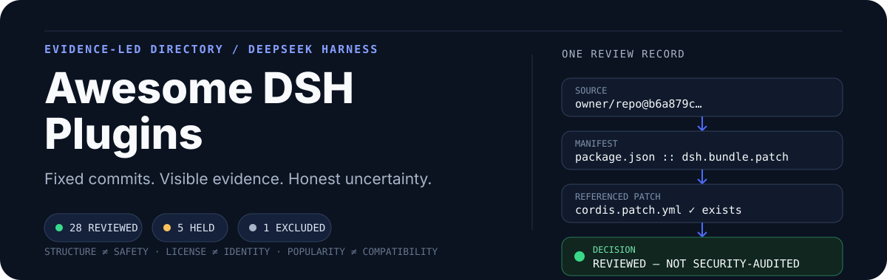

<p align="center">
  
</p>

<p align="center">
  <strong>English</strong> · <a href="./README.zh-CN.md">简体中文</a>
</p>

# Awesome DSH Plugins

An independent, evidence-led directory for
[DeepSeek Harness](https://github.com/deepseek-ai/deepseek-harness) plugins.
Every listed entry was inspected at an immutable commit for its bundle
manifest, referenced patch, license signals, package identity, lifecycle
scripts, and material capability signals.

This is a compact reviewed subset, not a mirror of every repository carrying
the `dsh-plugin` topic. It complements the broad
[Awesome DeepSeek Harness Plugin](https://github.com/awesome-dsh-plugin/awesome-dsh-plugin)
discovery list with fixed-source evidence and an explicit hold queue.

> [!CAUTION]
> A structural review is not a security audit or a runtime compatibility test.
> DSH plugins execute third-party code with your permissions. Read the source,
> inspect lifecycle scripts, and prefer immutable versions before installing.

## Website

This repository is also the source for the bilingual static website. The site,
generated README catalogs, plugin detail pages, review log, sitemap, and counts
all read from [`data/plugins.json`](./data/plugins.json), so a reviewed catalog
change and its presentation ship in the same commit.

```bash
npm install
npm run dev
```

Production verification uses `npm run check && npm run build`. The static
export is written to `out/` and is ready for Cloudflare Pages. See the
[deployment guide](./docs/DEPLOYMENT.md). No AI, authentication, database,
payment, or third-party plugin execution is part of the website.

## Automatic candidate discovery

GitHub Actions runs bounded GitHub API discovery every six hours and a full
query pass weekly. It resolves each matching repository to a 40-character
commit, inspects `package.json` and the referenced patch path without cloning,
installing, or executing third-party code, and opens a review PR only when the
candidate queue materially changes. A separate bot branch stores the incremental
checkpoint, so empty runs do not create or churn review PRs. Candidates are
never promoted into `data/plugins.json` automatically.

The query set and request budgets live in
[`config/discovery.json`](./config/discovery.json). A maintainer can also run
`GITHUB_TOKEN=... npm run discover -- --dry-run` locally.

## What is different here

- **Immutable evidence:** every decision links to a full 40-character commit.
- **Native bundle check:** `package.json` must declare `dsh.bundle.patch` and
  the referenced patch must exist.
- **Separate facts:** structure, license, identity, compatibility, lifecycle,
  and capability signals are not collapsed into a single “safe” score.
- **Visible uncertainty:** incomplete or conflicting candidates stay in the
  hold queue instead of receiving an install recommendation.
- **No popularity theater:** stars and topic membership are discovery hints,
  not proof of trust or compatibility.

## Status model

| Status       | Meaning                                                                                                      |
| ------------ | ------------------------------------------------------------------------------------------------------------ |
| **Reviewed** | Native bundle structure was confirmed at the linked commit. Runtime behavior and security remain unverified. |
| **Held**     | DSH-oriented candidate with a specific identity, structure, or compatibility blocker.                        |
| **Excluded** | Fixed-source evidence says it is not currently eligible as a native DSH bundle.                              |

## Catalog

<!-- CATALOG:START -->
Snapshot: **2026-08-24** · **835 candidates** · **581 reviewed** · **253 held** · **1 excluded**

### Reviewed native bundles

#### UI & Workspace

- **Status Rotator** · [01Virex/dsh-status-rotator@88ba67b](https://github.com/01Virex/dsh-status-rotator/commit/88ba67b897fb1842859f3f25dd1408f70f866721) — Rotates the DSH chat turn-status label ("Deep diving...") through user-defined phrases every few seconds, editable from DSH's settings panel.
  - **Evidence:** [manifest](https://github.com/01Virex/dsh-status-rotator/blob/88ba67b897fb1842859f3f25dd1408f70f866721/package.json) → [patch](https://github.com/01Virex/dsh-status-rotator/blob/88ba67b897fb1842859f3f25dd1408f70f866721/cordis.patch.yml) · **Identity:** `dsh-status-rotator`
  - **Licenses:** repo `MIT` / package `MIT` · lifecycle `none` · compatibility unknown
  - **Signals:** `external-network` `credentials` `client-injection` `subprocess` `process-control` `browser` `session-data` · **Review:** The fixed source, same-commit patch, licenses and installation identity were reviewed statically; lifecycle hooks, plugin code and capabilities were not executed.

- **DSH Progress Viz** · [2008924/dsh-progress-viz@0be31d8](https://github.com/2008924/dsh-progress-viz/commit/0be31d89bff49807991ded4e0be0d6db83f76810) — A headless-session progress plugin that writes live stage and timeline JSON for a local dashboard.
  - **Evidence:** [manifest](https://github.com/2008924/dsh-progress-viz/blob/0be31d89bff49807991ded4e0be0d6db83f76810/plugin/package.json) → [patch](https://github.com/2008924/dsh-progress-viz/blob/0be31d89bff49807991ded4e0be0d6db83f76810/plugin/cordis.patch.yml) · **Identity:** `dsh-progress-viz-plugin`
  - **Licenses:** repo `MIT` / package `MIT` · lifecycle `none` · declares rc.6 peers
  - **Signals:** `session-events` `filesystem-write` `progress-data` `headless` `local-install` · **Review:** The nested plugin documents a local profile install and rc.6 session peer; no event stream or progress file was read or written.

- **DSH WSL Workspace** · [6Mikao9/dsh-wsl-workspace@89905a8](https://github.com/6Mikao9/dsh-wsl-workspace/commit/89905a82ebbff7881b586554a72ebeb0d78f93bf) — Workspace support for using DeepSeek Harness across Windows and WSL paths.
  - **Evidence:** [manifest](https://github.com/6Mikao9/dsh-wsl-workspace/blob/89905a82ebbff7881b586554a72ebeb0d78f93bf/package.json) → [patch](https://github.com/6Mikao9/dsh-wsl-workspace/blob/89905a82ebbff7881b586554a72ebeb0d78f93bf/cordis.patch.yml) · **Identity:** `dsh-wsl-workspace`
  - **Licenses:** repo `MIT` / package `MIT` · lifecycle `none` · compatibility unknown
  - **Signals:** `filesystem` `cross-platform-paths` · **Review:** Broad DSH peer ranges leave runtime compatibility unknown.

- **DSH Toolbox Web** · [AbcdefgXW/dsh-toolbox-web@322c260](https://github.com/AbcdefgXW/dsh-toolbox-web/commit/322c2602a98cac7521af147b9becb78bb332303b) — A Web toolbox for session, trash, workspace-directory, search, preset, configuration, archive, and scheduled-heartbeat management.
  - **Evidence:** [manifest](https://github.com/AbcdefgXW/dsh-toolbox-web/blob/322c2602a98cac7521af147b9becb78bb332303b/package.json) → [patch](https://github.com/AbcdefgXW/dsh-toolbox-web/blob/322c2602a98cac7521af147b9becb78bb332303b/cordis.patch.yml) · **Identity:** `dsh-toolbox-web`
  - **Licenses:** repo `MIT` / package `MIT` · lifecycle `none` · compatibility unknown
  - **Signals:** `session-data` `filesystem-write` `scheduled-tasks` `external-messaging` `client-injection` · **Review:** The public package maps to this repository; session and configuration writes plus optional IM heartbeat delivery are visible and were not executed.

- **Visualizer Bundle** · [abidhmuhsin/dsh-visualizer@07fd8c1](https://github.com/abidhmuhsin/dsh-visualizer/commit/07fd8c1f3ed543f5df7dda97175f0ea45d8937d1) — Installable dsh profile bundle: mounts the visualizer streaming-HTML tool and its inline Web GUI preview card
  - **Evidence:** [manifest](https://github.com/abidhmuhsin/dsh-visualizer/blob/07fd8c1f3ed543f5df7dda97175f0ea45d8937d1/packages/bundle/package.json) → [patch](https://github.com/abidhmuhsin/dsh-visualizer/blob/07fd8c1f3ed543f5df7dda97175f0ea45d8937d1/packages/bundle/cordis.patch.yml) · **Identity:** `dsh-visualizer-bundle`
  - **Licenses:** repo `MIT` / package `MIT` · lifecycle `none` · compatibility unknown
  - **Signals:** `external-network` `client-injection` `filesystem-read` `filesystem-write` `subprocess` `browser` `session-data` `package-install` `nested-bundle` · **Review:** The fixed source, same-commit patch, licenses and installation identity were reviewed statically; lifecycle hooks, plugin code and capabilities were not executed.

- **DSH Client UI Aqua Unofficial** · [afrel1024/dsh-client-ui-aqua-unofficial@a175ff4](https://github.com/afrel1024/dsh-client-ui-aqua-unofficial/commit/a175ff40853e43c11451383cecd1e52a3d824bb3) — Adds a configurable glassmorphism theme, animated surfaces, and wallpaper controls to DSH Web.
  - **Evidence:** [manifest](https://github.com/afrel1024/dsh-client-ui-aqua-unofficial/blob/a175ff40853e43c11451383cecd1e52a3d824bb3/package.json) → [patch](https://github.com/afrel1024/dsh-client-ui-aqua-unofficial/blob/a175ff40853e43c11451383cecd1e52a3d824bb3/cordis.patch.yml) · **Identity:** `dsh-client-ui-aqua-unofficial`
  - **Licenses:** repo `MIT` / package `MIT` · lifecycle `none` · declares rc.6 peers
  - **Signals:** `client-injection` `theme` `browser-storage` `dynamic-wallpaper` `settings-write` · **Review:** The fixed source and npm identity both expose 1.4.1 from the same repository; no browser effects, settings writes, wallpaper loading, or build was executed.

- **DSH Effort** · [AI-Galaxy-GPU/dsh-effort@edbb063](https://github.com/AI-Galaxy-GPU/dsh-effort/commit/edbb063eefb05e33aa970a4b9ec8cbaad08e8641) — Adds a Web control for selecting the current session model's supported reasoning-effort level.
  - **Evidence:** [manifest](https://github.com/AI-Galaxy-GPU/dsh-effort/blob/edbb063eefb05e33aa970a4b9ec8cbaad08e8641/package.json) → [patch](https://github.com/AI-Galaxy-GPU/dsh-effort/blob/edbb063eefb05e33aa970a4b9ec8cbaad08e8641/cordis.patch.yml) · **Identity:** `dsh-effort`
  - **Licenses:** repo `unknown` / package `MIT` · lifecycle `none` · compatibility unknown
  - **Signals:** `session-data` `model-selection` `client-injection` `local-storage` · **Review:** The fixed source uses session model RPCs and browser storage; the repository has no detected license file and declares no DSH peer range.

- **DSH Sound** · [AI-Galaxy-GPU/dsh-sound@f5f25dc](https://github.com/AI-Galaxy-GPU/dsh-sound/commit/f5f25dc3e2ffee29fad4872d8b00aaac7738ce32) — Plays configurable browser sounds for task completion, approvals, questions, plan review, blocking, and failures.
  - **Evidence:** [manifest](https://github.com/AI-Galaxy-GPU/dsh-sound/blob/f5f25dc3e2ffee29fad4872d8b00aaac7738ce32/package.json) → [patch](https://github.com/AI-Galaxy-GPU/dsh-sound/blob/f5f25dc3e2ffee29fad4872d8b00aaac7738ce32/cordis.patch.yml) · **Identity:** `dsh-sound`
  - **Licenses:** repo `MIT` / package `MIT` · lifecycle `none` · compatibility unknown
  - **Signals:** `session-events` `local-file` `browser-storage` `client-injection` · **Review:** The fixed source stores configuration in localStorage and audio in IndexedDB; the documented npm target currently exposes no published version and no runtime behavior was tested.

- **DSH Update Checker** · [Airmetro/dsh-update-checker@bea57c0](https://github.com/Airmetro/dsh-update-checker/commit/bea57c020bb8a32889079b8f3a04182bc94e4982) — Auto-check DeepSeek Harness and third-party plugin updates, notify in the Web GUI, one-click update with backup/rollback and restart watchdog.
  - **Evidence:** [manifest](https://github.com/Airmetro/dsh-update-checker/blob/bea57c020bb8a32889079b8f3a04182bc94e4982/package.json) → [patch](https://github.com/Airmetro/dsh-update-checker/blob/bea57c020bb8a32889079b8f3a04182bc94e4982/cordis.patch.yml) · **Identity:** `dsh-update-checker`
  - **Licenses:** repo `MIT` / package `MIT` · lifecycle `none` · compatibility unknown
  - **Signals:** `external-network` `credentials` `client-injection` `process-control` · **Review:** The fixed source, same-commit patch, licenses and installation identity were reviewed statically; lifecycle hooks, plugin code and capabilities were not executed.

- **Sidor UI** · [AKI2253/Sidor_UI@89fbabe](https://github.com/AKI2253/Sidor_UI/commit/89fbabe1801f4802b362349ddd3094fa7c727b2d) — SIDOR — DeepSeek Harness 控制台皮肤：开屏动画 / 星野 / 余额徽章 / 设置页特效 / 低余额警告体系（Sidor 附属插件平台）
  - **Evidence:** [manifest](https://github.com/AKI2253/Sidor_UI/blob/89fbabe1801f4802b362349ddd3094fa7c727b2d/package.json) → [patch](https://github.com/AKI2253/Sidor_UI/blob/89fbabe1801f4802b362349ddd3094fa7c727b2d/cordis.patch.yml) · **Identity:** `sidor-ui`
  - **Licenses:** repo `MIT` / package `MIT` · lifecycle `none` · compatibility unknown
  - **Signals:** `external-network` `client-injection` · **Review:** The fixed source, same-commit patch, licenses and installation identity were reviewed statically; lifecycle hooks, plugin code and capabilities were not executed.

- **DSH Kanban** · [alpacachen/dsh-kanban@9f6de7d](https://github.com/alpacachen/dsh-kanban/commit/9f6de7dfa1e7f40e28f84f994da40a115ad16115) — A kanban board plugin for DeepSeek Harness: a 'Board' tab in conversations plus 13 kanban_* AI tools, per-workspace isolation and disk persistence. Built with React, TypeScript, dnd-kit, shadcn/ui and Tailwind CSS.
  - **Evidence:** [manifest](https://github.com/alpacachen/dsh-kanban/blob/9f6de7dfa1e7f40e28f84f994da40a115ad16115/package.json) → [patch](https://github.com/alpacachen/dsh-kanban/blob/9f6de7dfa1e7f40e28f84f994da40a115ad16115/cordis.patch.yml) · **Identity:** `@alpacachen/dsh-kanban`
  - **Licenses:** repo `MIT` / package `MIT` · lifecycle `none` · compatibility unknown
  - **Signals:** `external-network` `client-injection` `process-control` · **Review:** The fixed source, same-commit patch, licenses and installation identity were reviewed statically; lifecycle hooks, plugin code and capabilities were not executed.

- **DSH Plugin Desktop** · [anywhere-labs/deepseek-harness-desktop@6074088](https://github.com/anywhere-labs/deepseek-harness-desktop/commit/6074088f5b660206e404b3591fab51fb99c69add) — An Electron desktop shell composed as a DSH Cordis plugin with terminal, profile, diagnostics, package, and update surfaces.
  - **Evidence:** [manifest](https://github.com/anywhere-labs/deepseek-harness-desktop/blob/6074088f5b660206e404b3591fab51fb99c69add/dsh-plugin-desktop/package.json) → [patch](https://github.com/anywhere-labs/deepseek-harness-desktop/blob/6074088f5b660206e404b3591fab51fb99c69add/dsh-plugin-desktop/cordis.patch.yml) · **Identity:** `dsh-plugin-desktop`
  - **Licenses:** repo `MIT` / package `MIT` · lifecycle `prepack` · compatibility unknown
  - **Signals:** `subprocess` `external-network` `credentials` `client-injection` `process-control` `system-prompt` `prepack` · **Review:** The fixed source, same-commit patch, licenses and installation identity were reviewed statically; lifecycle hooks, plugin code and capabilities were not executed.

- **Summary Sidebar** · [az790871109/dsh-summary-sidebar@5588f55](https://github.com/az790871109/dsh-summary-sidebar/commit/5588f551a86b59b2976a238464d292177917bae0) — 独立的「摘要 + 侧边栏」插件：摘要只列每个对话输出的文档/网页/图片与来源，侧边栏提供文件夹、终端、浏览器、文档阅读器、图片阅读器，可点击文件进行预览与编辑。
  - **Evidence:** [manifest](https://github.com/az790871109/dsh-summary-sidebar/blob/5588f551a86b59b2976a238464d292177917bae0/package.json) → [patch](https://github.com/az790871109/dsh-summary-sidebar/blob/5588f551a86b59b2976a238464d292177917bae0/cordis.patch.yml) · **Identity:** `dsh-summary-sidebar`
  - **Licenses:** repo `MIT` / package `MIT` · lifecycle `none` · compatibility unknown
  - **Signals:** `credentials` `client-injection` `subprocess` `browser` `package-install` · **Review:** The fixed source, same-commit patch, licenses and installation identity were reviewed statically; lifecycle hooks, plugin code and capabilities were not executed.

- **CC DSH Notifier** · [baobaolaodie/cc-dsh-notifier@8f93b37](https://github.com/baobaolaodie/cc-dsh-notifier/commit/8f93b37759d6a057062c4f1c2abce1ec6a6bd61d) — Claude Code + DeepSeek Harness Windows 通知系统:Toast + 点击跳转
  - **Evidence:** [manifest](https://github.com/baobaolaodie/cc-dsh-notifier/blob/8f93b37759d6a057062c4f1c2abce1ec6a6bd61d/package.json) → [patch](https://github.com/baobaolaodie/cc-dsh-notifier/blob/8f93b37759d6a057062c4f1c2abce1ec6a6bd61d/plugins/dsh-notifier/cordis-root.patch.yml) · **Identity:** `cc-dsh-notifier`
  - **Licenses:** repo `MIT` / package `MIT` · lifecycle `prepack` · compatibility unknown
  - **Signals:** `external-network` `credentials` `client-injection` `subprocess` `process-control` `session-data` `theme` `prepack` · **Review:** The fixed source, same-commit patch, licenses and installation identity were reviewed statically; lifecycle hooks, plugin code and capabilities were not executed.

- **DSH Context** · [bowenliang123/dsh-context@aca38b2](https://github.com/bowenliang123/dsh-context/commit/aca38b24d714106f7256280dc8f9c9ec5b8e4552) — A context insight panel for request history, compactions, injections, model switches, and composition changes.
  - **Evidence:** [manifest](https://github.com/bowenliang123/dsh-context/blob/aca38b24d714106f7256280dc8f9c9ec5b8e4552/package.json) → [patch](https://github.com/bowenliang123/dsh-context/blob/aca38b24d714106f7256280dc8f9c9ec5b8e4552/cordis.patch.yml) · **Identity:** `dsh-context`
  - **Licenses:** repo `Apache-2.0` / package `Apache-2.0` · lifecycle `prepare` · compatibility unknown
  - **Signals:** `session-data` `client-injection` `browser` · **Review:** The host/client bundle structure is confirmed; the prepare hook invokes Husky and the package declares no DSH peer range.

- **DSH Client UI Skins** · [caoyiwei850/dsh-client-ui-skins@21ad7f5](https://github.com/caoyiwei850/dsh-client-ui-skins/commit/21ad7f52b3d2481daeca224f5c579b9c3253597b) — Adds built-in and custom-image skins to the DSH Web client with a settings surface.
  - **Evidence:** [manifest](https://github.com/caoyiwei850/dsh-client-ui-skins/blob/21ad7f52b3d2481daeca224f5c579b9c3253597b/package.json) → [patch](https://github.com/caoyiwei850/dsh-client-ui-skins/blob/21ad7f52b3d2481daeca224f5c579b9c3253597b/cordis.patch.yml) · **Identity:** `dsh-client-ui-skins`
  - **Licenses:** repo `MIT` / package `MIT` · lifecycle `none` · declares rc.6 peers
  - **Signals:** `client-injection` `theme` `browser-storage` `settings-write` · **Review:** The fixed source and npm package both expose 0.1.10, although npm metadata has no repository mapping; no skin rendering, storage, or settings write was executed.

- **DSH Stop Server** · [caozhikun/dsh-stop-server@baa9b9c](https://github.com/caozhikun/dsh-stop-server/commit/baa9b9cbc10e947486ae530c1c8fed5a61a314d4) — Adds a Web action that calls a host shutdown route to stop the DSH process and close the current interface.
  - **Evidence:** [manifest](https://github.com/caozhikun/dsh-stop-server/blob/baa9b9cbc10e947486ae530c1c8fed5a61a314d4/package.json) → [patch](https://github.com/caozhikun/dsh-stop-server/blob/baa9b9cbc10e947486ae530c1c8fed5a61a314d4/cordis.patch.yml) · **Identity:** `dsh-stop-server`
  - **Licenses:** repo `unknown` / package `MIT` · lifecycle `none` · compatibility unknown
  - **Signals:** `process-exit` `web-route` `client-injection` · **Review:** The fixed host source registers a shutdown route with appExit, process.exit, and SIGTERM fallbacks; the repository has no detected license file and shutdown was not executed.

- **Captain DSH Web UI All** · [CAPTAIN1275/dsh-ui-web@04422dd](https://github.com/CAPTAIN1275/dsh-ui-web/commit/04422dd2d447044537f404747adbc7c0c8a86cd4) — An aggregate Web UI bundle for task boards, Git views, pets, remote access, live statistics, settings, and bundled skins.
  - **Evidence:** [manifest](https://github.com/CAPTAIN1275/dsh-ui-web/blob/04422dd2d447044537f404747adbc7c0c8a86cd4/packages/dsh-web-ui-all/package.json) → [patch](https://github.com/CAPTAIN1275/dsh-ui-web/blob/04422dd2d447044537f404747adbc7c0c8a86cd4/packages/dsh-web-ui-all/cordis.patch.yml) · **Identity:** `@captain1275/dsh-web-ui-all`
  - **Licenses:** repo `Apache-2.0` / package `Apache-2.0` · lifecycle `none` · compatibility unknown
  - **Signals:** `aggregate-scope` `remote-access` `filesystem-write` `git` `client-injection` · **Review:** The public aggregate identity maps to this repository and represents its component candidates; broad remote, file, Git, session, and UI surfaces were not executed.

- **DSH Pomodoro** · [causebefore/dsh-pomodoro@5ce97fa](https://github.com/causebefore/dsh-pomodoro/commit/5ce97fabad64acc1ced3c372d55ca06567a603e7) — Adds configurable focus and break timers with sidebar access and a draggable DSH Web panel.
  - **Evidence:** [manifest](https://github.com/causebefore/dsh-pomodoro/blob/5ce97fabad64acc1ced3c372d55ca06567a603e7/package.json) → [patch](https://github.com/causebefore/dsh-pomodoro/blob/5ce97fabad64acc1ced3c372d55ca06567a603e7/cordis.patch.yml) · **Identity:** `dsh-pomodoro`
  - **Licenses:** repo `MIT` / package `MIT` · lifecycle `prepublishOnly` · declares rc.6 peers
  - **Signals:** `client-injection` `settings-write` `timer` `browser-ui` `prepublish-check` · **Review:** The fixed source and npm identity both expose 0.4.0 from the same repository; no timer, panel, settings, or prepublish behavior was executed.

- **DSH TUI** · [ccch1mneyyy/dsh-TUI@ee83376](https://github.com/ccch1mneyyy/dsh-TUI/commit/ee83376b549814f236ea2ab90682bb8f482dc826) — A full-screen terminal client with live status, streaming thoughts, tools, approvals, and filesystem access.
  - **Evidence:** [manifest](https://github.com/ccch1mneyyy/dsh-TUI/blob/ee83376b549814f236ea2ab90682bb8f482dc826/package.json) → [patch](https://github.com/ccch1mneyyy/dsh-TUI/blob/ee83376b549814f236ea2ab90682bb8f482dc826/cordis.patch.yml) · **Identity:** `@deepseek-harness-tui/dsh-tui`
  - **Licenses:** repo `MIT` / package `MIT` · lifecycle `none` · compatibility unknown
  - **Signals:** `terminal` `subprocess` `filesystem` `credentials` `broad-agent-surface` · **Review:** The bundle exposes a broad agent surface; structure confirmation is not a runtime endorsement.

- **DSH Cerrda Theme** · [Cerrda/dsh-cerrda-theme@7390edf](https://github.com/Cerrda/dsh-cerrda-theme/commit/7390edfc7c49314de944dffbc306a255d5c574d8) — A dark rose and purple visual theme for DSH Web with a custom composer and animated background.
  - **Evidence:** [manifest](https://github.com/Cerrda/dsh-cerrda-theme/blob/7390edfc7c49314de944dffbc306a255d5c574d8/package.json) → [patch](https://github.com/Cerrda/dsh-cerrda-theme/blob/7390edfc7c49314de944dffbc306a255d5c574d8/cordis.patch.yml) · **Identity:** `dsh-cerrda-theme`
  - **Licenses:** repo `MIT` / package `MIT` · lifecycle `none` · compatibility unknown
  - **Signals:** `web-theme` `client-injection` `webgl` `npm-package` · **Review:** The fixed source is 0.1.0 while npm exposes 0.1.1 from the same repository; no CSS, fonts, animation, or WebGL behavior was loaded.

- **DSH Sticky Notes** · [charrywhite/dsh-sticky-notes@e2653fc](https://github.com/charrywhite/dsh-sticky-notes/commit/e2653fc9b09c2d4cb7ea21ff1cc58ff08d6ec851) — A persistent sticky-note panel with host-side JSON storage, browser UI, and model-facing note tools.
  - **Evidence:** [manifest](https://github.com/charrywhite/dsh-sticky-notes/blob/e2653fc9b09c2d4cb7ea21ff1cc58ff08d6ec851/package.json) → [patch](https://github.com/charrywhite/dsh-sticky-notes/blob/e2653fc9b09c2d4cb7ea21ff1cc58ff08d6ec851/cordis.patch.yml) · **Identity:** Git source / unknown
  - **Licenses:** repo `unknown` / package `MIT` · lifecycle `none` · compatibility unknown
  - **Signals:** `filesystem-write` `web-route` `client-injection` `model-tools` `private-package` · **Review:** Local-link and source installation are documented for the private package; note storage, HTTP routes, and model tools were not exercised.

- **Castorice Theme** · [chemicalcat250/dsh-theme-castorice@c55e467](https://github.com/chemicalcat250/dsh-theme-castorice/commit/c55e467aed3d02cffcc1c7f2de284ce98eab9bc2) — Applies a violet dark Castorice-inspired visual theme to the DSH Web interface.
  - **Evidence:** [manifest](https://github.com/chemicalcat250/dsh-theme-castorice/blob/c55e467aed3d02cffcc1c7f2de284ce98eab9bc2/package.json) → [patch](https://github.com/chemicalcat250/dsh-theme-castorice/blob/c55e467aed3d02cffcc1c7f2de284ce98eab9bc2/cordis.patch.yml) · **Identity:** `dsh-theme-castorice`
  - **Licenses:** repo `MIT` / package `MIT` · lifecycle `none` · compatibility unknown
  - **Signals:** `client-injection` `theme` `browser-storage` · **Review:** GitHub-source installation is documented and the client code injects theme styles and browser preferences; it was not loaded in a browser.

- **DSH Security Doctor** · [ChenChen913/dsh-security-doctor@abaa3f5](https://github.com/ChenChen913/dsh-security-doctor/commit/abaa3f5e29c5b2105503b2596c200e99ab13f16b) — One-click local security checkup for the DeepSeek Harness Web UI: a sidebar button that runs read-only checks (!!js config, third-party plugins, credential file permissions, instruction files, endpoint config, protection services) and shows a severity-graded report. / DSH 安全医生：一键本机安全体检插件，只读检查、分级报告、不外发数据。
  - **Evidence:** [manifest](https://github.com/ChenChen913/dsh-security-doctor/blob/abaa3f5e29c5b2105503b2596c200e99ab13f16b/package.json) → [patch](https://github.com/ChenChen913/dsh-security-doctor/blob/abaa3f5e29c5b2105503b2596c200e99ab13f16b/cordis.patch.yml) · **Identity:** `dsh-security-doctor`
  - **Licenses:** repo `MIT` / package `MIT` · lifecycle `none` · compatibility unknown
  - **Signals:** `external-network` `credentials` `client-injection` · **Review:** The fixed source, same-commit patch, licenses and installation identity were reviewed statically; lifecycle hooks, plugin code and capabilities were not executed.

- **DSH DeepSeek Balance** · [Choi-Peng/dsh-deepseek-balance@45d7444](https://github.com/Choi-Peng/dsh-deepseek-balance/commit/45d7444b67c65bea2aee5b18e0ffefd25f0f23e1) — Displays DeepSeek account balance and editable warning thresholds in the DSH Web sidebar.
  - **Evidence:** [manifest](https://github.com/Choi-Peng/dsh-deepseek-balance/blob/45d7444b67c65bea2aee5b18e0ffefd25f0f23e1/package.json) → [patch](https://github.com/Choi-Peng/dsh-deepseek-balance/blob/45d7444b67c65bea2aee5b18e0ffefd25f0f23e1/cordis.patch.yml) · **Identity:** `@choi-p/dsh-deepseek-balance`
  - **Licenses:** repo `MIT` / package `MIT` · lifecycle `none` · compatibility unknown
  - **Signals:** `account-balance` `credentials` `external-network` `settings-write` `web-ui` · **Review:** The fixed source is 0.3.2 while npm exposes 0.3.1 from the same repository; balance requests and profile setting writes were not executed.

- **DSH DeepCompute** · [cipher2026/dsh-idle-deepcompute@619dbef](https://github.com/cipher2026/dsh-idle-deepcompute/commit/619dbef0d002073f7276769d24de7b1a7b24c59f) — A terminal-styled idle laboratory game embedded as a full-width DSH Web page.
  - **Evidence:** [manifest](https://github.com/cipher2026/dsh-idle-deepcompute/blob/619dbef0d002073f7276769d24de7b1a7b24c59f/package.json) → [patch](https://github.com/cipher2026/dsh-idle-deepcompute/blob/619dbef0d002073f7276769d24de7b1a7b24c59f/cordis.patch.yml) · **Identity:** `dsh-deepcompute`
  - **Licenses:** repo `Apache-2.0` / package `Apache-2.0` · lifecycle `none` · compatibility unknown
  - **Signals:** `web-ui` `idle-game` `client-injection` `github-only` · **Review:** The repository documents a commit-pinnable GitHub install; no client module, game state, or browser storage behavior was loaded.

- **DSH Browser Notify** · [classfieldseason-cmd/dsh-notify-plugin@8f386ca](https://github.com/classfieldseason-cmd/dsh-notify-plugin/commit/8f386ca5d66e8549119466c4a2ede15154aad577) — Shows browser desktop notifications when a DSH conversation turn completes.
  - **Evidence:** [manifest](https://github.com/classfieldseason-cmd/dsh-notify-plugin/blob/8f386ca5d66e8549119466c4a2ede15154aad577/package.json) → [patch](https://github.com/classfieldseason-cmd/dsh-notify-plugin/blob/8f386ca5d66e8549119466c4a2ede15154aad577/cordis.patch.yml) · **Identity:** `dsh-browser-notify-plugin`
  - **Licenses:** repo `MIT` / package `MIT` · lifecycle `none` · declares rc.6 peers
  - **Signals:** `browser-notification` `session-events` `client-injection` · **Review:** The public package identity matches this repository and the client listens for session completion before calling the browser Notification API; no notification was triggered.

- **DSH Wallpaper** · [codeMonkey-Pine/dsh-wallpaper@6ab97b2](https://github.com/codeMonkey-Pine/dsh-wallpaper/commit/6ab97b2b48278f3044df65a14680ce6efd760e01) — Scans a local Wallpaper Engine library and exposes wallpaper selection, configuration, and rendering in DSH Web.
  - **Evidence:** [manifest](https://github.com/codeMonkey-Pine/dsh-wallpaper/blob/6ab97b2b48278f3044df65a14680ce6efd760e01/package.json) → [patch](https://github.com/codeMonkey-Pine/dsh-wallpaper/blob/6ab97b2b48278f3044df65a14680ce6efd760e01/cordis.patch.yml) · **Identity:** `dsh-wallpaper`
  - **Licenses:** repo `Apache-2.0` / package `Apache-2.0` · lifecycle `none` · declares rc.6 peers
  - **Signals:** `filesystem-read` `subprocess` `local-http` `client-injection` `model-tools` · **Review:** The fixed source and npm identity both expose 0.1.2 from the same repository; no library scan, preview process, route, browser rendering, or agent tool was executed.

- **DSH Web UI Skin** · [crack-time/dsh-web-ui-skin@1124dea](https://github.com/crack-time/dsh-web-ui-skin/commit/1124deacfccbf2309fc05f07e92e05d0b321b581) — Adds a pastoral cottage wallpaper and frosted-glass presentation to the DSH Web client.
  - **Evidence:** [manifest](https://github.com/crack-time/dsh-web-ui-skin/blob/1124deacfccbf2309fc05f07e92e05d0b321b581/package.json) → [patch](https://github.com/crack-time/dsh-web-ui-skin/blob/1124deacfccbf2309fc05f07e92e05d0b321b581/cordis.patch.yml) · **Identity:** `@crack/dsh-web-ui-skin`
  - **Licenses:** repo `MIT` / package `MIT` · lifecycle `none` · compatibility unknown
  - **Signals:** `client-injection` `theme` `browser-ui` `github-only` · **Review:** A pinned root Git source identity exists while npm has no matching scoped package; no build, asset load, DOM injection, or browser rendering was executed.

- **DSH Glassmorphism** · [czw63/dsh-glassmorphism@e1f0466](https://github.com/czw63/dsh-glassmorphism/commit/e1f0466dac2dbbd1dc4e9f465f8819436672e648) — Adds a mobile-aware liquid-glass theme with optional wallpaper, blur, and refraction effects.
  - **Evidence:** [manifest](https://github.com/czw63/dsh-glassmorphism/blob/e1f0466dac2dbbd1dc4e9f465f8819436672e648/package.json) → [patch](https://github.com/czw63/dsh-glassmorphism/blob/e1f0466dac2dbbd1dc4e9f465f8819436672e648/cordis.patch.yml) · **Identity:** `@local/dsh-glass-theme`
  - **Licenses:** repo `MIT` / package `MIT` · lifecycle `none` · compatibility unknown
  - **Signals:** `client-injection` `theme` `browser-storage` · **Review:** A local-file installation path is documented and the client stores visual preferences in the browser; no style bundle was loaded.

- **MY GO** · [daizihan233/dsh-my-go@cf2d802](https://github.com/daizihan233/dsh-my-go/commit/cf2d80236d2c596a68ce6d8409357836f0258696) — DSH plugin: Sisyphus agent orchestration — star topology, single-line blocking, 7 specialist sub-agents (Hermes/Explore/Librarian/Looker/Hephaestus/Prometheus/Oracle) with per-type model binding, go_work/continue/need_help/forward communication tools, Web UI tree panel and settings.
  - **Evidence:** [manifest](https://github.com/daizihan233/dsh-my-go/blob/cf2d80236d2c596a68ce6d8409357836f0258696/package.json) → [patch](https://github.com/daizihan233/dsh-my-go/blob/cf2d80236d2c596a68ce6d8409357836f0258696/cordis.patch.yml) · **Identity:** `dsh-my-go`
  - **Licenses:** repo `MIT` / package `MIT` · lifecycle `none` · declares rc.6 peers
  - **Signals:** `external-network` `client-injection` `session-data` `model-tools` `multi-agent` · **Review:** The fixed source, same-commit patch, licenses and installation identity were reviewed statically; lifecycle hooks, plugin code and capabilities were not executed.

- **Oled Care** · [domparent/OLEDCare@8999fa8](https://github.com/domparent/OLEDCare/commit/8999fa87ed2dea0e3079c1e5c71a69260e1e4c74) — OLED burn-in care for the DeepSeek Harness Web GUI: true-black nap screensaver, pure-black surfaces, gamma-aware text dimming with an idle/focus ladder, and slow accent-hue rotation.
  - **Evidence:** [manifest](https://github.com/domparent/OLEDCare/blob/8999fa87ed2dea0e3079c1e5c71a69260e1e4c74/package.json) → [patch](https://github.com/domparent/OLEDCare/blob/8999fa87ed2dea0e3079c1e5c71a69260e1e4c74/cordis.patch.yml) · **Identity:** `dsh-oled-care`
  - **Licenses:** repo `MIT` / package `MIT` · lifecycle `none` · compatibility unknown
  - **Signals:** `external-network` `client-injection` `process-control` `session-data` `financial` `theme` · **Review:** The fixed source, same-commit patch, licenses and installation identity were reviewed statically; lifecycle hooks, plugin code and capabilities were not executed.

- **DSH Delete Session** · [dream12347/dsh-delete-session@e0f052a](https://github.com/dream12347/dsh-delete-session/commit/e0f052ac7cff776df72cdc58e8c42c94a1843c55) — A Web session manager for trash, restore, permanent deletion, archived sessions, activity statistics, pause, and log-folder access.
  - **Evidence:** [manifest](https://github.com/dream12347/dsh-delete-session/blob/e0f052ac7cff776df72cdc58e8c42c94a1843c55/package.json) → [patch](https://github.com/dream12347/dsh-delete-session/blob/e0f052ac7cff776df72cdc58e8c42c94a1843c55/cordis.patch.yml) · **Identity:** Git source / unknown
  - **Licenses:** repo `MIT` / package `MIT` · lifecycle `none` · declares rc.6 peers
  - **Signals:** `session-data` `filesystem-delete` `archive-registry` `client-injection` `browser-storage` · **Review:** Pinned GitHub installation and rc.6 peers are documented; destructive session and workspace actions remain user-triggered and were not executed.

- **DSH Popout Sidebar** · [e2mcc/dsh-popout-sidebar@7485171](https://github.com/e2mcc/dsh-popout-sidebar/commit/748517180dd4828f2a0307ff0b21ba92e39693bb) — Adds an artifact sidebar that can open its content in a larger browser tab.
  - **Evidence:** [manifest](https://github.com/e2mcc/dsh-popout-sidebar/blob/748517180dd4828f2a0307ff0b21ba92e39693bb/package.json) → [patch](https://github.com/e2mcc/dsh-popout-sidebar/blob/748517180dd4828f2a0307ff0b21ba92e39693bb/cordis.patch.yml) · **Identity:** `dsh-popout-sidebar`
  - **Licenses:** repo `MIT` / package `MIT` · lifecycle `none` · compatibility unknown
  - **Signals:** `client-injection` `browser-ui` `external-window` `github-only` · **Review:** A pinned root Git source exists while npm has no package; no build, browser panel, artifact rendering, or popout was executed.

- **DSH Unarchive** · [edfrey0044/dsh-unarchive@52a5194](https://github.com/edfrey0044/dsh-unarchive/commit/52a51946f9b48c1f97eb965b3050aab124355d51) — Restores archived DSH sessions through a command and tool that update the global archive registry.
  - **Evidence:** [manifest](https://github.com/edfrey0044/dsh-unarchive/blob/52a51946f9b48c1f97eb965b3050aab124355d51/package.json) → [patch](https://github.com/edfrey0044/dsh-unarchive/blob/52a51946f9b48c1f97eb965b3050aab124355d51/cordis.patch.yml) · **Identity:** `dsh-unarchive`
  - **Licenses:** repo `MIT` / package `MIT` · lifecycle `none` · mixed peer ranges
  - **Signals:** `session-data` `archive-registry` `workspace-state` · **Review:** Git-source installation is documented and the bundle removes session identifiers from the global archive set; no registry or session state was changed.

- **DSH Balance** · [eka3os/dsh-balance@0ffde6c](https://github.com/eka3os/dsh-balance/commit/0ffde6cc21ca4feae483ccd6e5577891eacfb0ff) — DeepSeek Harness Web plugin that shows the API balance beside Settings in the sidebar.
  - **Evidence:** [manifest](https://github.com/eka3os/dsh-balance/blob/0ffde6cc21ca4feae483ccd6e5577891eacfb0ff/package.json) → [patch](https://github.com/eka3os/dsh-balance/blob/0ffde6cc21ca4feae483ccd6e5577891eacfb0ff/cordis.patch.yml) · **Identity:** `@ek3os/dsh-balance`
  - **Licenses:** repo `MIT` / package `MIT` · lifecycle `none` · mixed peer ranges
  - **Signals:** `external-network` `credentials` `client-injection` `process-control` · **Review:** The fixed source, same-commit patch, licenses and installation identity were reviewed statically; lifecycle hooks, plugin code and capabilities were not executed.

- **DSH Notes** · [ErrorLst/dsh-notes@1e0bda1](https://github.com/ErrorLst/dsh-notes/commit/1e0bda1db01d3bfd21743160888d700efbe1f030) — Adds a full-height notes rail with session cards and global or workspace todo items.
  - **Evidence:** [manifest](https://github.com/ErrorLst/dsh-notes/blob/1e0bda1db01d3bfd21743160888d700efbe1f030/package.json) → [patch](https://github.com/ErrorLst/dsh-notes/blob/1e0bda1db01d3bfd21743160888d700efbe1f030/cordis.patch.yml) · **Identity:** `@dsh-external/dsh-notes`
  - **Licenses:** repo `MIT` / package `MIT` · lifecycle `none` · compatibility unknown
  - **Signals:** `client-injection` `session-data` `workspace-data` `browser-ui` `github-only` · **Review:** The root manifest is private and npm has no matching package, but a pinned root Git bundle exists; no note persistence, session card, or browser UI was executed.

- **DSH OpenCode Palette** · [FeatherHunter/dsh-opencode-palette@4c3660a](https://github.com/FeatherHunter/dsh-opencode-palette/commit/4c3660a40229f3e661dd8cb7e67610b2d932e575) — Adds a persistent selector for dozens of OpenCode-inspired color themes in the DSH Web interface.
  - **Evidence:** [manifest](https://github.com/FeatherHunter/dsh-opencode-palette/blob/4c3660a40229f3e661dd8cb7e67610b2d932e575/package/package.json) → [patch](https://github.com/FeatherHunter/dsh-opencode-palette/blob/4c3660a40229f3e661dd8cb7e67610b2d932e575/package/cordis.patch.yml) · **Identity:** `dsh-opencode-palette`
  - **Licenses:** repo `MIT` / package `MIT` · lifecycle `none` · compatibility unknown
  - **Signals:** `client-injection` `theme` `browser-storage` · **Review:** The fixed source version is older than the observed registry release but maps to the same public identity; theme injection and persistent browser settings were not executed.

- **DeepSeek Harness Wallet** · [feibi-mochi/deepseek-harness-control-center@1a3b34b](https://github.com/feibi-mochi/deepseek-harness-control-center/commit/1a3b34b2b421344e608d9e30079621bff727d515) — A local-first account, usage, recharge, completion, layout, and session control center for DSH Web.
  - **Evidence:** [manifest](https://github.com/feibi-mochi/deepseek-harness-control-center/blob/1a3b34b2b421344e608d9e30079621bff727d515/package.json) → [patch](https://github.com/feibi-mochi/deepseek-harness-control-center/blob/1a3b34b2b421344e608d9e30079621bff727d515/cordis.patch.yml) · **Identity:** `deepseek-harness-wallet`
  - **Licenses:** repo `MIT` / package `MIT` · lifecycle `none` · declares rc.6 peers
  - **Signals:** `account-balance` `usage-accounting` `credentials` `external-network` `session-control` `web-ui` · **Review:** The fixed source and npm identity both expose 0.1.4 from the same repository; no credential request, accounting, recharge link, notification, or session action was executed.

- **DSH Balance Widget** · [FeilongRong/dsh-balance-widget@79cd46d](https://github.com/FeilongRong/dsh-balance-widget/commit/79cd46dd4a4106768af15c6d99ffa8d7566bd37e) — Sidebar balance widget for the DSH Web GUI: a "余额" button in the sidebar footer opens a panel showing each provider's account balance (DeepSeek live query, MiniMax / Qwen / SCNet console links, Ollama local). · DSH Web GUI 侧边栏余额插件：侧边栏底部的「余额」按钮弹出面板，展示各服务商账户余额（DeepSeek 实时查询，MiniMax / 百炼 / SCNet 控制台链接，Ollama 本地）。
  - **Evidence:** [manifest](https://github.com/FeilongRong/dsh-balance-widget/blob/79cd46dd4a4106768af15c6d99ffa8d7566bd37e/package.json) → [patch](https://github.com/FeilongRong/dsh-balance-widget/blob/79cd46dd4a4106768af15c6d99ffa8d7566bd37e/cordis.patch.yml) · **Identity:** `@feilongrong/dsh-balance-widget`
  - **Licenses:** repo `MIT` / package `MIT` · lifecycle `none` · compatibility unknown
  - **Signals:** `external-network` `credentials` `client-injection` `process-control` · **Review:** The fixed source, same-commit patch, licenses and installation identity were reviewed statically; lifecycle hooks, plugin code and capabilities were not executed.

- **DSH UI Crystal** · [gityanglijun/dsh-ui-crystal@37e321c](https://github.com/gityanglijun/dsh-ui-crystal/commit/37e321c2a53cf924ce9278c3ca0b6827cf3bcca0) — Adds a blue-violet Crystal theme and whale-girl background to the DSH Web shell.
  - **Evidence:** [manifest](https://github.com/gityanglijun/dsh-ui-crystal/blob/37e321c2a53cf924ce9278c3ca0b6827cf3bcca0/package.json) → [patch](https://github.com/gityanglijun/dsh-ui-crystal/blob/37e321c2a53cf924ce9278c3ca0b6827cf3bcca0/cordis.patch.yml) · **Identity:** `dsh-ui-crystal`
  - **Licenses:** repo `unknown` / package `MIT` · lifecycle `none` · compatibility unknown
  - **Signals:** `client-injection` `theme` `large-assets` `browser-ui` `github-only` · **Review:** The package declares MIT but no repository license file or npm package was found; no build, asset load, DOM injection, or browser rendering was executed.

- **StyleVault** · [GptsApp/dsh-stylevault@26eee2d](https://github.com/GptsApp/dsh-stylevault/commit/26eee2d412f38b7a570cc84bfaac3a09f72a8ec8) — A theme vault with configurable styles and shareable appearance packs for DSH Web.
  - **Evidence:** [manifest](https://github.com/GptsApp/dsh-stylevault/blob/26eee2d412f38b7a570cc84bfaac3a09f72a8ec8/package.json) → [patch](https://github.com/GptsApp/dsh-stylevault/blob/26eee2d412f38b7a570cc84bfaac3a09f72a8ec8/cordis.patch.yml) · **Identity:** Git source / unknown
  - **Licenses:** repo `MIT` / package `MIT` · lifecycle `none` · compatibility unknown
  - **Signals:** `theme` `client-injection` `browser-storage` `github-only` · **Review:** Fixed source, manifest, patch, available license evidence, and documented install identity were reviewed statically; plugin code and declared capabilities were not executed.

- **Macos Skin** · [hero-goblins/dsh-macos-skin@da6eebb](https://github.com/hero-goblins/dsh-macos-skin/commit/da6eebb494f53eec2dc6e1f335c6a1866ac023a4) — macOS desktop skin for the DeepSeek Harness web GUI + real-time plugin install/runtime error log panel (host route serves ~/.dsh/logs)
  - **Evidence:** [manifest](https://github.com/hero-goblins/dsh-macos-skin/blob/da6eebb494f53eec2dc6e1f335c6a1866ac023a4/package.json) → [patch](https://github.com/hero-goblins/dsh-macos-skin/blob/da6eebb494f53eec2dc6e1f335c6a1866ac023a4/cordis.patch.yml) · **Identity:** `dsh-macos-skin`
  - **Licenses:** repo `MIT` / package `MIT` · lifecycle `none` · declares rc.6 peers
  - **Signals:** `external-network` `client-injection` `browser` `package-install` `theme` · **Review:** The fixed source, same-commit patch, licenses and installation identity were reviewed statically; lifecycle hooks, plugin code and capabilities were not executed.

- **DSH Remote QR Button** · [huaxiren6/dsh-remote-qr-button@8427d46](https://github.com/huaxiren6/dsh-remote-qr-button/commit/8427d4613a587bb947e8e7eb69fbdba1e435b402) — Floating phone-pairing QR button for the DSH WebUI. Companion UI for dsh-remote-link: opens its /qr pairing page in an in-app overlay.
  - **Evidence:** [manifest](https://github.com/huaxiren6/dsh-remote-qr-button/blob/8427d4613a587bb947e8e7eb69fbdba1e435b402/package.json) → [patch](https://github.com/huaxiren6/dsh-remote-qr-button/blob/8427d4613a587bb947e8e7eb69fbdba1e435b402/cordis.patch.yml) · **Identity:** `dsh-remote-qr-button`
  - **Licenses:** repo `MIT` / package `MIT` · lifecycle `none` · declares rc.6 peers
  - **Signals:** `external-network` `client-injection` · **Review:** The fixed source, same-commit patch, licenses and installation identity were reviewed statically; lifecycle hooks, plugin code and capabilities were not executed.

- **DSH Clean Desktop Shell** · [Icather/dsh-clean-desktop-shell@352820e](https://github.com/Icather/dsh-clean-desktop-shell/commit/352820e53ddd6fb9db749d61faf4869866c50eb1) — Clean desktop shell for DeepSeek Harness (DSH) as a DSH plugin — reuses your web profile, tray/single-instance/auto-launch, zero visual changes. DSH 插件形态的纯净桌面壳：复用现有 web profile，托盘管理后端，零视觉改造。
  - **Evidence:** [manifest](https://github.com/Icather/dsh-clean-desktop-shell/blob/352820e53ddd6fb9db749d61faf4869866c50eb1/package.json) → [patch](https://github.com/Icather/dsh-clean-desktop-shell/blob/352820e53ddd6fb9db749d61faf4869866c50eb1/cordis.patch.yml) · **Identity:** `dsh-clean-desktop-shell`
  - **Licenses:** repo `MIT` / package `MIT` · lifecycle `none` · mixed peer ranges
  - **Signals:** `external-network` · **Review:** The fixed source, same-commit patch, licenses and installation identity were reviewed statically; lifecycle hooks, plugin code and capabilities were not executed.

- **DSH OMC TUI** · [ipromise2021/dsh-omc-tui@d2307dc](https://github.com/ipromise2021/dsh-omc-tui/commit/d2307dc2b2fe057fcbb82be245da394214c7865f) — A keyboard-first terminal interface that composes DSH sessions, approvals, jobs, tools, skills, and model selection.
  - **Evidence:** [manifest](https://github.com/ipromise2021/dsh-omc-tui/blob/d2307dc2b2fe057fcbb82be245da394214c7865f/package.json) → [patch](https://github.com/ipromise2021/dsh-omc-tui/blob/d2307dc2b2fe057fcbb82be245da394214c7865f/cordis.patch.yml) · **Identity:** `dsh-omc-tui`
  - **Licenses:** repo `MIT` / package `MIT` · lifecycle `none` · declares rc.6 peers
  - **Signals:** `terminal-ui` `session-control` `approvals` `model-tools` `profile-overrides` `github-only` · **Review:** The patch replaces several base tool and prompt rows to compose the TUI; no terminal, profile override, session, approval, or tool was run.

- **DSH RPG Workstation** · [Jay-R-J/dsh-rpg-workstation@84fc0de](https://github.com/Jay-R-J/dsh-rpg-workstation/commit/84fc0dec315470f4ede619223a79d2f64e103515) — Adds conversation XP, levels, achievements, streaks, and a floating RPG dashboard to DSH Web.
  - **Evidence:** [manifest](https://github.com/Jay-R-J/dsh-rpg-workstation/blob/84fc0dec315470f4ede619223a79d2f64e103515/package.json) → [patch](https://github.com/Jay-R-J/dsh-rpg-workstation/blob/84fc0dec315470f4ede619223a79d2f64e103515/cordis.patch.yml) · **Identity:** `dsh-rpg-workstation`
  - **Licenses:** repo `MIT` / package `MIT` · lifecycle `prepublishOnly` · declares rc.6 peers
  - **Signals:** `gamification` `session-events` `filesystem-write` `web-ui` `npm-package` `prepublish-build` · **Review:** The fixed source matches npm 0.3.0; no build, session event, XP state, filesystem write, or dashboard rendering was executed.

- **DSH Session Admin** · [Jemius/dsh-session-manager@191a1f3](https://github.com/Jemius/dsh-session-manager/commit/191a1f3a991a3ff0b1694e18ec6486b4ddb81d03) — Adds archive, restore, export, and permanent deletion controls for DSH sessions.
  - **Evidence:** [manifest](https://github.com/Jemius/dsh-session-manager/blob/191a1f3a991a3ff0b1694e18ec6486b4ddb81d03/package.json) → [patch](https://github.com/Jemius/dsh-session-manager/blob/191a1f3a991a3ff0b1694e18ec6486b4ddb81d03/cordis.patch.yml) · **Identity:** `dsh-session-admin`
  - **Licenses:** repo `MIT` / package `MIT` · lifecycle `prepare` · declares rc.6 peers
  - **Signals:** `session-archive` `session-delete` `data-export` `web-ui` `prepare-build` `repository-renamed` · **Review:** GitHub confirms dsh-session-manager redirects to the same repository ID now named dsh-session-admin; the fixed source is 0.1.2 while npm exposes 0.1.3, and no session mutation was executed.

- **DSH Balance Bubble** · [Jescoi/dsh-balance-bubble@dbfaef5](https://github.com/Jescoi/dsh-balance-bubble/commit/dbfaef5ea65ac380833bbc7c6f6423e69ef595e2) — A persistent floating DeepSeek account-balance bubble backed by a host endpoint.
  - **Evidence:** [manifest](https://github.com/Jescoi/dsh-balance-bubble/blob/dbfaef5ea65ac380833bbc7c6f6423e69ef595e2/package.json) → [patch](https://github.com/Jescoi/dsh-balance-bubble/blob/dbfaef5ea65ac380833bbc7c6f6423e69ef595e2/cordis.patch.yml) · **Identity:** Git source / unknown
  - **Licenses:** repo `MIT` / package `unknown` · lifecycle `none` · compatibility unknown
  - **Signals:** `account-balance` `credentials` `local-web-server` `client-injection` · **Review:** Fixed source, manifest, patch, available license evidence, and documented install identity were reviewed statically; plugin code and declared capabilities were not executed.

- **La Feng UI** · [JimingYang25/Lafeng-UI-A-snazzy-personalized-custom-UI-plugin-for-DeepSeek-Harness-Cordis-.@bfd81d8](https://github.com/JimingYang25/Lafeng-UI-A-snazzy-personalized-custom-UI-plugin-for-DeepSeek-Harness-Cordis-./commit/bfd81d879daf3dd899f7db67f2e6c33f88a7460d) — A customizable Web UI pack with skins, animated wallpapers, music, audio visualization, and personas.
  - **Evidence:** [manifest](https://github.com/JimingYang25/Lafeng-UI-A-snazzy-personalized-custom-UI-plugin-for-DeepSeek-Harness-Cordis-./blob/bfd81d879daf3dd899f7db67f2e6c33f88a7460d/package.json) → [patch](https://github.com/JimingYang25/Lafeng-UI-A-snazzy-personalized-custom-UI-plugin-for-DeepSeek-Harness-Cordis-./blob/bfd81d879daf3dd899f7db67f2e6c33f88a7460d/cordis.patch.yml) · **Identity:** Git source / unknown
  - **Licenses:** repo `MIT` / package `MIT` · lifecycle `none` · compatibility unknown
  - **Signals:** `theme` `audio` `client-injection` `browser-storage` `persona` · **Review:** Fixed source, manifest, patch, available license evidence, and documented install identity were reviewed statically; plugin code and declared capabilities were not executed.

- **DSH Survey** · [jinhuang712/dsh-survey@9f36ef1](https://github.com/jinhuang712/dsh-survey/commit/9f36ef12e23607e6ad8a11853931c7c83d0e1d7a) — A model tool and rich Web form for multi-question surveys, skips, Markdown answers, and recaps.
  - **Evidence:** [manifest](https://github.com/jinhuang712/dsh-survey/blob/9f36ef12e23607e6ad8a11853931c7c83d0e1d7a/package.json) → [patch](https://github.com/jinhuang712/dsh-survey/blob/9f36ef12e23607e6ad8a11853931c7c83d0e1d7a/cordis.patch.yml) · **Identity:** Git source / unknown
  - **Licenses:** repo `MIT` / package `MIT` · lifecycle `prepublishOnly` · declares rc.6 peers
  - **Signals:** `model-tools` `interactive-form` `session-data` `client-injection` `prepublish-build` · **Review:** Fixed source, manifest, patch, available license evidence, and documented install identity were reviewed statically; plugin code and declared capabilities were not executed.

- **DSH Strata** · [jsdvjx/dsh-strata@e2f8585](https://github.com/jsdvjx/dsh-strata/commit/e2f8585c73a54e73ea7056fff216532da8410ae5) — Session strata for the DeepSeek Harness Web GUI: the transcript's scrollbar becomes a to-scale, colour-coded map of the whole run — user messages emphasised, clickable anchors, auto-loading history, and a hover deck of every prompt in the session.
  - **Evidence:** [manifest](https://github.com/jsdvjx/dsh-strata/blob/e2f8585c73a54e73ea7056fff216532da8410ae5/package.json) → [patch](https://github.com/jsdvjx/dsh-strata/blob/e2f8585c73a54e73ea7056fff216532da8410ae5/cordis.patch.yml) · **Identity:** `dsh-strata`
  - **Licenses:** repo `MIT` / package `MIT` · lifecycle `none` · mixed peer ranges
  - **Signals:** `external-network` `credentials` `client-injection` `process-control` · **Review:** The fixed source, same-commit patch, licenses and installation identity were reviewed statically; lifecycle hooks, plugin code and capabilities were not executed.

- **DSH Memes** · [kagura-agent/dsh-memes@68a528d](https://github.com/kagura-agent/dsh-memes/commit/68a528d1c6d710a801d2402c8b86ecc0cced40f0) — Lets agents select reaction media by semantic tags and render it in DSH conversations.
  - **Evidence:** [manifest](https://github.com/kagura-agent/dsh-memes/blob/68a528d1c6d710a801d2402c8b86ecc0cced40f0/package.json) → [patch](https://github.com/kagura-agent/dsh-memes/blob/68a528d1c6d710a801d2402c8b86ecc0cced40f0/cordis.patch.yml) · **Identity:** `dsh-memes`
  - **Licenses:** repo `MIT` / package `MIT` · lifecycle `none` · compatibility unknown
  - **Signals:** `media-picker` `model-tools` `external-media` `web-ui` `github-only` · **Review:** Plugin code is MIT but reaction media is fetched from a separate library under its own source rights; no tag fetch, selection, or media render was executed.

- **DSH App** · [Karbo123/DSH-EvoResearch@ea6d4df](https://github.com/Karbo123/DSH-EvoResearch/commit/ea6d4df404f57cdcecb19ea1f740f65d7919c30b) — EvoResearch 自定义浏览器表面 bundle：复用 DSH host 引擎（dsh-base 的全部服务与工具），自建前端工作台（不加载官方 ui-* 外壳，替换官方 dsh-web-app 表面）
  - **Evidence:** [manifest](https://github.com/Karbo123/DSH-EvoResearch/blob/ea6d4df404f57cdcecb19ea1f740f65d7919c30b/packages/evoresearch-app/package.json) → [patch](https://github.com/Karbo123/DSH-EvoResearch/blob/ea6d4df404f57cdcecb19ea1f740f65d7919c30b/packages/evoresearch-app/cordis.patch.yml) · **Identity:** `@evoresearch/dsh-app`
  - **Licenses:** repo `MIT` / package `MIT` · lifecycle `none` · compatibility unknown
  - **Signals:** `external-network` `client-injection` `database` `system-prompt` · **Review:** The fixed source, same-commit patch, licenses and installation identity were reviewed statically; lifecycle hooks, plugin code and capabilities were not executed.

- **DSH Bottom Bar** · [kc0ed/dsh-bottom-bar@01d8433](https://github.com/kc0ed/dsh-bottom-bar/commit/01d843306e7d3f0819b9e8ac28f0478be2b2d801) — A configurable input-footer statistics row with cost estimates and a persistent local usage ledger.
  - **Evidence:** [manifest](https://github.com/kc0ed/dsh-bottom-bar/blob/01d843306e7d3f0819b9e8ac28f0478be2b2d801/package.json) → [patch](https://github.com/kc0ed/dsh-bottom-bar/blob/01d843306e7d3f0819b9e8ac28f0478be2b2d801/cordis.patch.yml) · **Identity:** `@kc0ed/dsh-bottom-bar`
  - **Licenses:** repo `MIT` / package `MIT` · lifecycle `none` · compatibility unknown
  - **Signals:** `token-meter` `cost-estimation` `browser-storage` `client-injection` · **Review:** Fixed source, manifest, patch, available license evidence, and documented install identity were reviewed statically; plugin code and declared capabilities were not executed.

- **DSH WhaleGirl** · [KLnormal/dsh_whalegirl@6cf1b30](https://github.com/KLnormal/dsh_whalegirl/commit/6cf1b30e151e7a3c5f849860acf0a5c010b47fbf) — A desktop-native animated companion driven by DSH session events.
  - **Evidence:** [manifest](https://github.com/KLnormal/dsh_whalegirl/blob/6cf1b30e151e7a3c5f849860acf0a5c010b47fbf/package.json) → [patch](https://github.com/KLnormal/dsh_whalegirl/blob/6cf1b30e151e7a3c5f849860acf0a5c010b47fbf/cordis.patch.yml) · **Identity:** Git source / unknown
  - **Licenses:** repo `MIT` / package `SEE LICENSE IN ASSET_LICENSE.md` · lifecycle `none` · compatibility unknown
  - **Signals:** `desktop-app` `session-data` `audio` `subprocess` `external-model-download` · **Review:** Fixed source, manifest, patch, available license evidence, and documented install identity were reviewed statically; plugin code and declared capabilities were not executed.

- **DSH Workspace Drag** · [lanscer/dsh-workspace-drag@d134d9c](https://github.com/lanscer/dsh-workspace-drag/commit/d134d9c5c62aa447c4e1de5489c426ae3a94aa61) — DSH Web UI plugin — drag a conversation onto any workspace in the sidebar to organize it. / DSH Web UI 插件：在侧边栏把对话拖到任意工作区即可归类整理，可在设置页开关。
  - **Evidence:** [manifest](https://github.com/lanscer/dsh-workspace-drag/blob/d134d9c5c62aa447c4e1de5489c426ae3a94aa61/package.json) → [patch](https://github.com/lanscer/dsh-workspace-drag/blob/d134d9c5c62aa447c4e1de5489c426ae3a94aa61/cordis.patch.yml) · **Identity:** `dsh-workspace-drag`
  - **Licenses:** repo `MIT` / package `MIT` · lifecycle `none` · compatibility unknown
  - **Signals:** `external-network` `client-injection` `process-control` · **Review:** The fixed source, same-commit patch, licenses and installation identity were reviewed statically; lifecycle hooks, plugin code and capabilities were not executed.

- **DSH Bell Notify** · [Laplace-bit/dsh-bell-notify@943e178](https://github.com/Laplace-bit/dsh-bell-notify/commit/943e178bd7bdc15628fdcfc5125e058cc0974dee) — Synthesized Web Audio bells and status cues for agent lifecycle events.
  - **Evidence:** [manifest](https://github.com/Laplace-bit/dsh-bell-notify/blob/943e178bd7bdc15628fdcfc5125e058cc0974dee/package.json) → [patch](https://github.com/Laplace-bit/dsh-bell-notify/blob/943e178bd7bdc15628fdcfc5125e058cc0974dee/cordis.patch.yml) · **Identity:** `dsh-bell-notify`
  - **Licenses:** repo `MIT` / package `MIT` · lifecycle `prepare` · compatibility unknown
  - **Signals:** `audio` `agent-events` `client-injection` `prepare-build` · **Review:** Fixed source, manifest, patch, available license evidence, and documented install identity were reviewed statically; plugin code and declared capabilities were not executed.

- **DSH Stats HUD** · [lauytgary/dsh_hud_plugin@e3285fc](https://github.com/lauytgary/dsh_hud_plugin/commit/e3285fc9981e91cb2e022d054adb05f5e6f10d2a) — Sci-fi HUD: turns the session stats line into game-style level bars, a speedometer and a rolling token counter.
  - **Evidence:** [manifest](https://github.com/lauytgary/dsh_hud_plugin/blob/e3285fc9981e91cb2e022d054adb05f5e6f10d2a/package.json) → [patch](https://github.com/lauytgary/dsh_hud_plugin/blob/e3285fc9981e91cb2e022d054adb05f5e6f10d2a/cordis.patch.yml) · **Identity:** `dsh-stats-hud`
  - **Licenses:** repo `MIT` / package `MIT` · lifecycle `none` · compatibility unknown
  - **Signals:** `external-network` `credentials` `client-injection` `process-control` · **Review:** The fixed source, same-commit patch, licenses and installation identity were reviewed statically; lifecycle hooks, plugin code and capabilities were not executed.

- **Token DAY** · [lemon49/dsh-token-day@b84bc72](https://github.com/lemon49/dsh-token-day/commit/b84bc726a6636095dd27a24d9d6ebeb7488bd4ff) — Token usage/billing dashboard and conversation manager for DeepSeek Harness
  - **Evidence:** [manifest](https://github.com/lemon49/dsh-token-day/blob/b84bc726a6636095dd27a24d9d6ebeb7488bd4ff/package.json) → [patch](https://github.com/lemon49/dsh-token-day/blob/b84bc726a6636095dd27a24d9d6ebeb7488bd4ff/cordis.patch.yml) · **Identity:** `dsh-token-day`
  - **Licenses:** repo `MIT` / package `MIT` · lifecycle `none` · declares rc.6 peers
  - **Signals:** `external-network` `credentials` `client-injection` `filesystem-read` `filesystem-write` `session-data` `model-tools` `package-install` `financial` · **Review:** The fixed source, same-commit patch, licenses and installation identity were reviewed statically; lifecycle hooks, plugin code and capabilities were not executed.

- **DSH Client UI Android** · [LeMonXi-i/dsh-client-ui-android@2dccd80](https://github.com/LeMonXi-i/dsh-client-ui-android/commit/2dccd8033f7510233510b916da9502ef0bc9bb1d) — Adds Android detection and a touch-first responsive layout to the DSH Web interface.
  - **Evidence:** [manifest](https://github.com/LeMonXi-i/dsh-client-ui-android/blob/2dccd8033f7510233510b916da9502ef0bc9bb1d/package.json) → [patch](https://github.com/LeMonXi-i/dsh-client-ui-android/blob/2dccd8033f7510233510b916da9502ef0bc9bb1d/cordis.patch.yml) · **Identity:** `dsh-client-ui-android`
  - **Licenses:** repo `MIT` / package `MIT` · lifecycle `none` · mixed peer ranges
  - **Signals:** `mobile-layout` `android` `client-injection` `responsive-ui` `github-only` · **Review:** The fixed source documents npm and GitHub installation but npm has no matching package; no user-agent detection, layout mutation, or browser rendering was executed.

- **DSH Keyboard** · [lhf6623/dsh-keyboard@4ecb1b7](https://github.com/lhf6623/dsh-keyboard/commit/4ecb1b77a2b1900331d6ce003f6047e8ed3ad198) — An on-screen keyboard and mouse visualizer that highlights live input events.
  - **Evidence:** [manifest](https://github.com/lhf6623/dsh-keyboard/blob/4ecb1b77a2b1900331d6ce003f6047e8ed3ad198/package.json) → [patch](https://github.com/lhf6623/dsh-keyboard/blob/4ecb1b77a2b1900331d6ce003f6047e8ed3ad198/cordis.patch.yml) · **Identity:** Git source / unknown
  - **Licenses:** repo `unknown` / package `MIT` · lifecycle `none` · compatibility unknown
  - **Signals:** `input-events` `client-injection` `keyboard-visualizer` `github-only` · **Review:** Fixed source, manifest, patch, available license evidence, and documented install identity were reviewed statically; plugin code and declared capabilities were not executed.

- **DSH Neu Theme** · [Lhy723/dsh-neu-theme@c6ecbe4](https://github.com/Lhy723/dsh-neu-theme/commit/c6ecbe421298b0e89791655b153cfb3287a5c522) — A light and dark neumorphic theme for DSH Web.
  - **Evidence:** [manifest](https://github.com/Lhy723/dsh-neu-theme/blob/c6ecbe421298b0e89791655b153cfb3287a5c522/package.json) → [patch](https://github.com/Lhy723/dsh-neu-theme/blob/c6ecbe421298b0e89791655b153cfb3287a5c522/cordis.patch.yml) · **Identity:** `dsh-neu-theme`
  - **Licenses:** repo `MIT` / package `MIT` · lifecycle `none` · declares rc.6 peers
  - **Signals:** `theme` `client-injection` · **Review:** Fixed source, manifest, patch, available license evidence, and documented install identity were reviewed statically; plugin code and declared capabilities were not executed.

- **DSH Prompt Recall** · [liguanyu/dsh_PromptRecall@6040210](https://github.com/liguanyu/dsh_PromptRecall/commit/6040210ed1895a093060395eb61337a45baba712) — Codex-style up and down history recall for the Web prompt input.
  - **Evidence:** [manifest](https://github.com/liguanyu/dsh_PromptRecall/blob/6040210ed1895a093060395eb61337a45baba712/package.json) → [patch](https://github.com/liguanyu/dsh_PromptRecall/blob/6040210ed1895a093060395eb61337a45baba712/cordis.patch.yml) · **Identity:** Git source / unknown
  - **Licenses:** repo `MIT` / package `MIT` · lifecycle `none` · compatibility unknown
  - **Signals:** `input-history` `client-injection` `browser-storage` · **Review:** Fixed source, manifest, patch, available license evidence, and documented install identity were reviewed statically; plugin code and declared capabilities were not executed.

- **My Better DSH** · [lilwhich/my_better-dsh@b903e95](https://github.com/lilwhich/my_better-dsh/commit/b903e955d4e735eccc9d519c4345d072f53904ae) — A beginner-oriented Web bundle combining file navigation, session tools, UI packs, checkpoints, and global settings.
  - **Evidence:** [manifest](https://github.com/lilwhich/my_better-dsh/blob/b903e955d4e735eccc9d519c4345d072f53904ae/package.json) → [patch](https://github.com/lilwhich/my_better-dsh/blob/b903e955d4e735eccc9d519c4345d072f53904ae/cordis.patch.yml) · **Identity:** Git source / unknown
  - **Licenses:** repo `MIT` / package `MIT` · lifecycle `none` · compatibility unknown
  - **Signals:** `aggregate-bundle` `filesystem-write` `session-data` `client-injection` `configuration-edit` · **Review:** Fixed source, manifest, patch, available license evidence, and documented install identity were reviewed statically; plugin code and declared capabilities were not executed.

- **Workbench** · [LingYuYue1/dsh-workbench@cc89934](https://github.com/LingYuYue1/dsh-workbench/commit/cc89934ed45b7d54b4b069feb41c83d92ab87c06) — VSCode 风格工作台面板：文件树 / 多标签预览 / CodeMirror 编辑 / 终端 / Git / 全库搜索 / 变更审查。VSCode-style workbench sidebar panel for DeepSeek Harness.
  - **Evidence:** [manifest](https://github.com/LingYuYue1/dsh-workbench/blob/cc89934ed45b7d54b4b069feb41c83d92ab87c06/package.json) → [patch](https://github.com/LingYuYue1/dsh-workbench/blob/cc89934ed45b7d54b4b069feb41c83d92ab87c06/cordis.patch.yml) · **Identity:** `dsh-workbench`
  - **Licenses:** repo `MIT` / package `MIT` · lifecycle `none` · declares rc.6 peers
  - **Signals:** `external-network` `client-injection` `subprocess` `package-install` · **Review:** The fixed source, same-commit patch, licenses and installation identity were reviewed statically; lifecycle hooks, plugin code and capabilities were not executed.

- **DSH Pelican** · [Little-Star888/dsh-pelican@f5bb404](https://github.com/Little-Star888/dsh-pelican/commit/f5bb404eaef95dc5d768ccf67ad18fa13134f6ca) — Adds an animated pelican cyclist and global message-status indicator to DSH Web.
  - **Evidence:** [manifest](https://github.com/Little-Star888/dsh-pelican/blob/f5bb404eaef95dc5d768ccf67ad18fa13134f6ca/package.json) → [patch](https://github.com/Little-Star888/dsh-pelican/blob/f5bb404eaef95dc5d768ccf67ad18fa13134f6ca/cordis.patch.yml) · **Identity:** `dsh-pelican`
  - **Licenses:** repo `MIT` / package `MIT` · lifecycle `none` · compatibility unknown
  - **Signals:** `client-injection` `animation` `session-state` `browser-ui` · **Review:** The fixed source is 0.1.0 while npm exposes 0.1.1 from the same repository; no animation, message observation, session state, or browser rendering was executed.

- **DSH Session Rewind** · [LiuJunheng/DeepSeekHarnessGreen@b352856](https://github.com/LiuJunheng/DeepSeekHarnessGreen/commit/b352856b2069c5045b71abee030e9acc9c52324b) — 在 WebUI 设置页可视化分析会话(逐回合/错误统计),并支持按回合「回退」——从选定回合之后派生干净的续接会话(官方 session.fork),等效于移除失败消息后继续对话
  - **Evidence:** [manifest](https://github.com/LiuJunheng/DeepSeekHarnessGreen/blob/b352856b2069c5045b71abee030e9acc9c52324b/plugins/dsh-session-rewind/package.json) → [patch](https://github.com/LiuJunheng/DeepSeekHarnessGreen/blob/b352856b2069c5045b71abee030e9acc9c52324b/plugins/dsh-session-rewind/cordis.patch.yml) · **Identity:** `dsh-session-rewind`
  - **Licenses:** repo `Apache-2.0` / package `Apache-2.0` · lifecycle `none` · compatibility unknown
  - **Signals:** `external-network` · **Review:** The fixed source, same-commit patch, licenses and installation identity were reviewed statically; lifecycle hooks, plugin code and capabilities were not executed.

- **Quick TOC** · [LyaxZ/dsh-quick-toc@e211d4d](https://github.com/LyaxZ/dsh-quick-toc/commit/e211d4d9d6e19c8bc37889bc1e6e36b391d97ccb) — Quick conversation TOC for DeepSeek Harness: markdown heading outline grouped by turn, with auto-follow highlight and smooth jump navigation
  - **Evidence:** [manifest](https://github.com/LyaxZ/dsh-quick-toc/blob/e211d4d9d6e19c8bc37889bc1e6e36b391d97ccb/package.json) → [patch](https://github.com/LyaxZ/dsh-quick-toc/blob/e211d4d9d6e19c8bc37889bc1e6e36b391d97ccb/cordis.patch.yml) · **Identity:** `dsh-quick-toc`
  - **Licenses:** repo `MIT` / package `MIT` · lifecycle `none` · compatibility unknown
  - **Signals:** `process-control` `session-data` · **Review:** The fixed source, same-commit patch, licenses and installation identity were reviewed statically; lifecycle hooks, plugin code and capabilities were not executed.

- **DSH Balance** · [lynnss-ai/dsh-balance@685bb40](https://github.com/lynnss-ai/dsh-balance/commit/685bb40a8f53643f35086ec0e94e1bbf585c7a7e) — Real-time DeepSeek API balance viewer: Host query via curl, browser UI in the settings trigger row
  - **Evidence:** [manifest](https://github.com/lynnss-ai/dsh-balance/blob/685bb40a8f53643f35086ec0e94e1bbf585c7a7e/package.json) → [patch](https://github.com/lynnss-ai/dsh-balance/blob/685bb40a8f53643f35086ec0e94e1bbf585c7a7e/cordis.patch.yml) · **Identity:** `@lynnss-ai/dsh-balance`
  - **Licenses:** repo `MIT` / package `MIT` · lifecycle `prepare` · mixed peer ranges
  - **Signals:** `external-network` `credentials` `client-injection` `process-control` `prepare` · **Review:** The fixed source, same-commit patch, licenses and installation identity were reviewed statically; lifecycle hooks, plugin code and capabilities were not executed.

- **DSH Frosted Glass** · [makuralymi/dsh-webUI-Glass-Theme@9822e4a](https://github.com/makuralymi/dsh-webUI-Glass-Theme/commit/9822e4a4d6c4e700da2520c47a37d1da87692764) — A global frosted-glass theme with animated light/dark switching and scheduling.
  - **Evidence:** [manifest](https://github.com/makuralymi/dsh-webUI-Glass-Theme/blob/9822e4a4d6c4e700da2520c47a37d1da87692764/package.json) → [patch](https://github.com/makuralymi/dsh-webUI-Glass-Theme/blob/9822e4a4d6c4e700da2520c47a37d1da87692764/cordis.patch.yml) · **Identity:** Git source / unknown
  - **Licenses:** repo `unknown` / package `MIT` · lifecycle `none` · mixed peer ranges
  - **Signals:** `theme` `client-injection` `timer` `github-only` · **Review:** Fixed source, manifest, patch, available license evidence, and documented install identity were reviewed statically; plugin code and declared capabilities were not executed.

- **DSH Chat Rail** · [Max-Null/dsh-chat-rail@a75058b](https://github.com/Max-Null/dsh-chat-rail/commit/a75058b925d4869065dd879563ab2f07c68ca7db) — Adds a scroll-aware right-side message navigation rail to DSH conversations.
  - **Evidence:** [manifest](https://github.com/Max-Null/dsh-chat-rail/blob/a75058b925d4869065dd879563ab2f07c68ca7db/package.json) → [patch](https://github.com/Max-Null/dsh-chat-rail/blob/a75058b925d4869065dd879563ab2f07c68ca7db/cordis.patch.yml) · **Identity:** `@max-null/dsh-chat-rail`
  - **Licenses:** repo `MIT` / package `MIT` · lifecycle `none` · declares rc.6 peers
  - **Signals:** `conversation-ui` `session-projection` `client-injection` `filesystem-read` · **Review:** The fixed source, patch, licenses, exact npm gitHead and documented install identity were reviewed statically; conversation UI behavior was not run.

- **DSH CoT Summarization** · [MeowLynxSea/dsh-cot-summerization@dd69071](https://github.com/MeowLynxSea/dsh-cot-summerization/commit/dd69071e134a797a574ded3d576a36fa4ce31272) — Hides raw reasoning and displays a summary generated through a configurable Chat Completions endpoint.
  - **Evidence:** [manifest](https://github.com/MeowLynxSea/dsh-cot-summerization/blob/dd69071e134a797a574ded3d576a36fa4ce31272/package.json) → [patch](https://github.com/MeowLynxSea/dsh-cot-summerization/blob/dd69071e134a797a574ded3d576a36fa4ce31272/cordis.patch.yml) · **Identity:** Git source / unknown
  - **Licenses:** repo `MIT` / package `MIT` · lifecycle `none` · declares rc.6 peers
  - **Signals:** `reasoning-data` `external-network` `credentials` `model-request` `client-injection` · **Review:** Fixed source, manifest, patch, available license evidence, and documented install identity were reviewed statically; plugin code and declared capabilities were not executed.

- **DSH Sticky Note** · [Meredith2328/dsh-sticky-note@ebabb6c](https://github.com/Meredith2328/dsh-sticky-note/commit/ebabb6c746b1495c5f077e440d98b6665d7a61b9) — A Web sticky-note panel that saves notes and TODO items into an archive directory.
  - **Evidence:** [manifest](https://github.com/Meredith2328/dsh-sticky-note/blob/ebabb6c746b1495c5f077e440d98b6665d7a61b9/package.json) → [patch](https://github.com/Meredith2328/dsh-sticky-note/blob/ebabb6c746b1495c5f077e440d98b6665d7a61b9/cordis.patch.yml) · **Identity:** `dsh-sticky-note`
  - **Licenses:** repo `MIT` / package `MIT` · lifecycle `none` · mixed peer ranges
  - **Signals:** `filesystem-write` `persistent-data` `client-injection` · **Review:** The host and Web client faces are structurally confirmed; wildcard DSH peers and persistent note writes were not runtime-tested.

- **Whale PET** · [miku00039-01/dsh-whale-pet@486ef80](https://github.com/miku00039-01/dsh-whale-pet/commit/486ef800e72c4b6be9b5ddf00979f2d145c7bdbd) — 🐋 DSH 鲸鱼娘桌宠插件:/whalepet 命令启动 DeepSeek Harness 桌面宠物(启动/停止/监测服务、双击唤起 GUI)
  - **Evidence:** [manifest](https://github.com/miku00039-01/dsh-whale-pet/blob/486ef800e72c4b6be9b5ddf00979f2d145c7bdbd/package.json) → [patch](https://github.com/miku00039-01/dsh-whale-pet/blob/486ef800e72c4b6be9b5ddf00979f2d145c7bdbd/cordis.patch.yml) · **Identity:** `dsh-whale-pet`
  - **Licenses:** repo `MIT` / package `MIT` · lifecycle `none` · compatibility unknown
  - **Signals:** `external-network` `credentials` · **Review:** The fixed source, same-commit patch, licenses and installation identity were reviewed statically; lifecycle hooks, plugin code and capabilities were not executed.

- **DSH Visualize** · [Nagi-ovo/dsh-visualize@e3254f7](https://github.com/Nagi-ovo/dsh-visualize/commit/e3254f762cbe4dbf796eca05d73a293f0e8e4a87) — In-conversation generative UI with streaming interactive HTML cards and sandboxed rendering.
  - **Evidence:** [manifest](https://github.com/Nagi-ovo/dsh-visualize/blob/e3254f762cbe4dbf796eca05d73a293f0e8e4a87/package.json) → [patch](https://github.com/Nagi-ovo/dsh-visualize/blob/e3254f762cbe4dbf796eca05d73a293f0e8e4a87/cordis.patch.yml) · **Identity:** Git source / unknown
  - **Licenses:** repo `BSD-3-Clause` / package `BSD-3-Clause` · lifecycle `none` · compatibility unknown
  - **Signals:** `github-only` `dynamic-content` `sandbox` · **Review:** The package is private; only GitHub-source evidence was observed.

- **DSH Simplified Chinese UI** · [ngk3pori/dsh-zh-cn-ui@ea388ec](https://github.com/ngk3pori/dsh-zh-cn-ui/commit/ea388ec1ba8a19973ee6f38c6ce309d0d11f6d94) — Localizes DSH browser interface text into Simplified Chinese through client-side data and DOM translation.
  - **Evidence:** [manifest](https://github.com/ngk3pori/dsh-zh-cn-ui/blob/ea388ec1ba8a19973ee6f38c6ce309d0d11f6d94/package.json) → [patch](https://github.com/ngk3pori/dsh-zh-cn-ui/blob/ea388ec1ba8a19973ee6f38c6ce309d0d11f6d94/cordis.patch.yml) · **Identity:** `dsh-zh-cn-ui`
  - **Licenses:** repo `MIT` / package `MIT` · lifecycle `none` · compatibility unknown
  - **Signals:** `localization` `dom-mutation` `client-injection` `manual-git-install` · **Review:** The fixed source, patch, licenses and documented Git clone installation identity were reviewed statically; browser translation code was not run.

- **Webview Wrapper** · [no1xsyzy/dsh-webview-wrapper@93c78a3](https://github.com/no1xsyzy/dsh-webview-wrapper/commit/93c78a37cdcbfec98cb9794b0be321d7449e8d89) — A naive native desktop shell for the DeepSeek Harness web surface: hosts the dsh Web app in an OS window via WebviewJS, as a pure everything-is-a-plugin composition.
  - **Evidence:** [manifest](https://github.com/no1xsyzy/dsh-webview-wrapper/blob/93c78a37cdcbfec98cb9794b0be321d7449e8d89/package.json) → [patch](https://github.com/no1xsyzy/dsh-webview-wrapper/blob/93c78a37cdcbfec98cb9794b0be321d7449e8d89/cordis.patch.yml) · **Identity:** `dsh-webview-wrapper`
  - **Licenses:** repo `MIT` / package `MIT` · lifecycle `prepublishOnly` · compatibility unknown
  - **Signals:** `external-network` `client-injection` `filesystem-read` `filesystem-write` `subprocess` `browser` `model-tools` `package-install` `plugin-management` `prepublish-only` · **Review:** The fixed source, same-commit patch, licenses and installation identity were reviewed statically; lifecycle hooks, plugin code and capabilities were not executed.

- **DSH Pet Whale** · [nzl153/dsh-pet-whale@952551a](https://github.com/nzl153/dsh-pet-whale/commit/952551ac1268617eb8ceffdf4e16751bfd645eb3) — A Web desktop whale pet whose animation reacts to agent state.
  - **Evidence:** [manifest](https://github.com/nzl153/dsh-pet-whale/blob/952551ac1268617eb8ceffdf4e16751bfd645eb3/package.json) → [patch](https://github.com/nzl153/dsh-pet-whale/blob/952551ac1268617eb8ceffdf4e16751bfd645eb3/cordis.patch.yml) · **Identity:** `pet-whale`
  - **Licenses:** repo `MIT` / package `MIT` · lifecycle `none` · compatibility unknown
  - **Signals:** `desktop-pet` `agent-events` `client-injection` · **Review:** Fixed source, manifest, patch, available license evidence, and documented install identity were reviewed statically; plugin code and declared capabilities were not executed.

- **DSH Annotation** · [omdsh-dev/dsh-annotation@0b0ceb6](https://github.com/omdsh-dev/dsh-annotation/commit/0b0ceb6415c5c1204b9f73716e905b392acd729b) — Adds numbered annotations to selected assistant text and carries them into the next message.
  - **Evidence:** [manifest](https://github.com/omdsh-dev/dsh-annotation/blob/0b0ceb6415c5c1204b9f73716e905b392acd729b/package.json) → [patch](https://github.com/omdsh-dev/dsh-annotation/blob/0b0ceb6415c5c1204b9f73716e905b392acd729b/cordis.patch.yml) · **Identity:** `@omdsh-dev/dsh-annotation`
  - **Licenses:** repo `MIT` / package `MIT` · lifecycle `prepack` · compatibility unknown
  - **Signals:** `client-injection` `conversation-data` · **Review:** The Web client injection and native bundle row are fixed-source confirmed; no DSH package peer range establishes runtime compatibility.

- **DSH Better Sidebar** · [omdsh-dev/DSH-better-sidebar@5d2d6e5](https://github.com/omdsh-dev/DSH-better-sidebar/commit/5d2d6e580143dc6ad95c015feb2909ec60afdf77) — A sidebar workbench with file editing, terminal, Git, media, and extensible tabs.
  - **Evidence:** [manifest](https://github.com/omdsh-dev/DSH-better-sidebar/blob/5d2d6e580143dc6ad95c015feb2909ec60afdf77/package.json) → [patch](https://github.com/omdsh-dev/DSH-better-sidebar/blob/5d2d6e580143dc6ad95c015feb2909ec60afdf77/cordis.patch.yml) · **Identity:** `dsh-better-sidebar`
  - **Licenses:** repo `MIT` / package `MIT` · lifecycle `prepare` · compatibility unknown
  - **Signals:** `terminal` `filesystem-write` `git` `native-build` `remote-installer` · **Review:** Direct package installation exists, but remote installer scripts and native builds warrant review.

- **DSH GenUI** · [omdsh-dev/dsh-genui@0e756ef](https://github.com/omdsh-dev/dsh-genui/commit/0e756efb7671e6b8413dde3d8e199c68fa89cbeb) — Interactive inline UI for layouts, charts, forms, quizzes, Mermaid, 3D scenes, and action events.
  - **Evidence:** [manifest](https://github.com/omdsh-dev/dsh-genui/blob/0e756efb7671e6b8413dde3d8e199c68fa89cbeb/package.json) → [patch](https://github.com/omdsh-dev/dsh-genui/blob/0e756efb7671e6b8413dde3d8e199c68fa89cbeb/cordis.patch.yml) · **Identity:** `dsh-genui`
  - **Licenses:** repo `MIT` / package `MIT` · lifecycle `none` · compatibility unknown
  - **Signals:** `git-source` `dynamic-content` `client-injection` `web-routes` · **Review:** Git-source install and dynamic client rendering are explicit review surfaces.

- **Ostar DSH Left Sidebar** · [ostar999/ostar-dsh-left-sidebar@5399969](https://github.com/ostar999/ostar-dsh-left-sidebar/commit/539996931956ed712cd8bd8e17c655cb78586607) — DSH 左侧边栏工作区管理器：批量删除工作区 / 批量·单选删除会话 / 一键折叠·展开全部工作区和会话。官方工作区浏览器的全部功能与交互完整保留，管理功能以同尺寸按钮叠加在工作区按钮行。
  - **Evidence:** [manifest](https://github.com/ostar999/ostar-dsh-left-sidebar/blob/539996931956ed712cd8bd8e17c655cb78586607/package.json) → [patch](https://github.com/ostar999/ostar-dsh-left-sidebar/blob/539996931956ed712cd8bd8e17c655cb78586607/cordis.patch.yml) · **Identity:** `ostar-dsh-left-sidebar`
  - **Licenses:** repo `MIT` / package `MIT` · lifecycle `none` · compatibility unknown
  - **Signals:** `external-network` `credentials` `client-injection` · **Review:** The fixed source, same-commit patch, licenses and installation identity were reviewed statically; lifecycle hooks, plugin code and capabilities were not executed.

- **DSH Task Control** · [p2coder/dsh-task-control@a20e79b](https://github.com/p2coder/dsh-task-control/commit/a20e79b7cf5afc83fe960564fa5c1c4a6ae8c339) — Composer controls for pausing, resuming, or cancelling the active conversation task.
  - **Evidence:** [manifest](https://github.com/p2coder/dsh-task-control/blob/a20e79b7cf5afc83fe960564fa5c1c4a6ae8c339/package.json) → [patch](https://github.com/p2coder/dsh-task-control/blob/a20e79b7cf5afc83fe960564fa5c1c4a6ae8c339/cordis.patch.yml) · **Identity:** Git source / unknown
  - **Licenses:** repo `MIT` / package `MIT` · lifecycle `none` · declares rc.6 peers
  - **Signals:** `task-control` `session-data` `client-injection` `github-only` · **Review:** Fixed source, manifest, patch, available license evidence, and documented install identity were reviewed statically; plugin code and declared capabilities were not executed.

- **Harness UI Enhancer** · [Physicolor/harness-ui-enhancer@3357651](https://github.com/Physicolor/harness-ui-enhancer/commit/3357651927f22bc5913d2fa09199660212484488) — Polishes DSH Web styles and exposes live controls for layout scale, typography, and chat width.
  - **Evidence:** [manifest](https://github.com/Physicolor/harness-ui-enhancer/blob/3357651927f22bc5913d2fa09199660212484488/package.json) → [patch](https://github.com/Physicolor/harness-ui-enhancer/blob/3357651927f22bc5913d2fa09199660212484488/cordis.patch.yml) · **Identity:** `harness-ui-enhancer`
  - **Licenses:** repo `MIT` / package `MIT` · lifecycle `prepare` · compatibility unknown
  - **Signals:** `client-injection` `theme` `settings-write` `browser-storage` `prepare-build` · **Review:** The fixed source and npm identity both expose 0.4.0 from the same repository; no prepare build, style injection, setting write, or browser rendering was executed.

- **DSH Invest** · [Pikapiku09/dsh-invest-plugin@8260090](https://github.com/Pikapiku09/dsh-invest-plugin/commit/826009099d27af8e083854f5bd83224dab740a4a) — A 股多角色投研流水线常规插件：invest_run 工具（选股/消息/深度/总判断 4 角色子代理 + Tushare 实时数据 + 三级缓存 + 报告归档），GUI 工具卡片（分阶段标签 + 推理过程 + SVG 图表内联渲染）。Hot-pluggable — mounted via profile package.json bundles + dsh.bundle.patch, no dsh source changes.
  - **Evidence:** [manifest](https://github.com/Pikapiku09/dsh-invest-plugin/blob/826009099d27af8e083854f5bd83224dab740a4a/packages/dsh-invest/package.json) → [patch](https://github.com/Pikapiku09/dsh-invest-plugin/blob/826009099d27af8e083854f5bd83224dab740a4a/packages/dsh-invest/cordis.patch.yml) · **Identity:** `dsh-invest`
  - **Licenses:** repo `MIT` / package `MIT` · lifecycle `none` · declares rc.6 peers
  - **Signals:** `external-network` `credentials` `client-injection` `system-prompt` · **Review:** The fixed source, same-commit patch, licenses and installation identity were reviewed statically; lifecycle hooks, plugin code and capabilities were not executed.

- **DSH Personal Center** · [PolinniZhong/dsh-personal-center@047ed94](https://github.com/PolinniZhong/dsh-personal-center/commit/047ed94a57ebb9ded55ff6844a2d723038f45b7f) — DSH 个人中心:设置 →「个人」分区(个人资料统计 UI + 个性化自定义指令);统计数据待接入
  - **Evidence:** [manifest](https://github.com/PolinniZhong/dsh-personal-center/blob/047ed94a57ebb9ded55ff6844a2d723038f45b7f/package.json) → [patch](https://github.com/PolinniZhong/dsh-personal-center/blob/047ed94a57ebb9ded55ff6844a2d723038f45b7f/cordis.patch.yml) · **Identity:** `dsh-personal-center`
  - **Licenses:** repo `MIT` / package `MIT` · lifecycle `none` · compatibility unknown
  - **Signals:** `external-network` `credentials` `client-injection` `mcp` · **Review:** The fixed source, same-commit patch, licenses and installation identity were reviewed statically; lifecycle hooks, plugin code and capabilities were not executed.

- **DSH BigFish** · [QCYTSN/dsh-dafeiyu@fba38c1](https://github.com/QCYTSN/dsh-dafeiyu/commit/fba38c18da2d275333691986763b4914e533b6b3) — A desktop-native BigFish companion driven by DSH session events.
  - **Evidence:** [manifest](https://github.com/QCYTSN/dsh-dafeiyu/blob/fba38c18da2d275333691986763b4914e533b6b3/package.json) → [patch](https://github.com/QCYTSN/dsh-dafeiyu/blob/fba38c18da2d275333691986763b4914e533b6b3/cordis.patch.yml) · **Identity:** `dsh-dafeiyu`
  - **Licenses:** repo `MIT` / package `SEE LICENSE IN ASSET_LICENSE.md` · lifecycle `none` · compatibility unknown
  - **Signals:** `desktop-app` `session-data` `audio` `subprocess` · **Review:** Fixed source, manifest, patch, available license evidence, and documented install identity were reviewed statically; plugin code and declared capabilities were not executed.

- **MyPet** · [qiqikuaidianpao/mypet@f9de0bf](https://github.com/qiqikuaidianpao/mypet/commit/f9de0bfa15b3a461187d637ddc3e1f6037b84b58) — A browser Tamagotchi-style pet that reacts to coding sessions, levels up, and collects skins.
  - **Evidence:** [manifest](https://github.com/qiqikuaidianpao/mypet/blob/f9de0bfa15b3a461187d637ddc3e1f6037b84b58/package.json) → [patch](https://github.com/qiqikuaidianpao/mypet/blob/f9de0bfa15b3a461187d637ddc3e1f6037b84b58/cordis.patch.yml) · **Identity:** `mypet`
  - **Licenses:** repo `MIT` / package `MIT` · lifecycle `prepublishOnly` · declares rc.6 peers
  - **Signals:** `desktop-pet` `session-data` `browser-storage` `client-injection` `prepublish-build` · **Review:** Fixed source, manifest, patch, available license evidence, and documented install identity were reviewed statically; plugin code and declared capabilities were not executed.

- **DSH Rhine Lab Theme** · [ReLuckyLucy/dsh_Rhine_Lab_themo@54c2f26](https://github.com/ReLuckyLucy/dsh_Rhine_Lab_themo/commit/54c2f2611f6bc6e36a784cc33908ad29bccef2b7) — A reversible Arknights Rhine Lab archive-terminal theme for DSH Web.
  - **Evidence:** [manifest](https://github.com/ReLuckyLucy/dsh_Rhine_Lab_themo/blob/54c2f2611f6bc6e36a784cc33908ad29bccef2b7/package.json) → [patch](https://github.com/ReLuckyLucy/dsh_Rhine_Lab_themo/blob/54c2f2611f6bc6e36a784cc33908ad29bccef2b7/cordis.patch.yml) · **Identity:** Git source / unknown
  - **Licenses:** repo `MIT` / package `MIT` · lifecycle `prepare` · compatibility unknown
  - **Signals:** `theme` `client-injection` `prepare-build` · **Review:** Fixed source, manifest, patch, available license evidence, and documented install identity were reviewed statically; plugin code and declared capabilities were not executed.

- **Riesbri DSH TUI** · [riesbri/dsh-tui@e051d01](https://github.com/riesbri/dsh-tui/commit/e051d01024bc56b00bfd54e1655ea287f105af85) — Provides an in-process terminal interface over DSH agent, command, session, and approval services.
  - **Evidence:** [manifest](https://github.com/riesbri/dsh-tui/blob/e051d01024bc56b00bfd54e1655ea287f105af85/packages/tui/package.json) → [patch](https://github.com/riesbri/dsh-tui/blob/e051d01024bc56b00bfd54e1655ea287f105af85/packages/tui/cordis.patch.yml) · **Identity:** `@riesbri/dsh-tui`
  - **Licenses:** repo `MIT` / package `MIT` · lifecycle `prepare` · compatibility unknown
  - **Signals:** `terminal` `session-data` `approval-flow` `prepare-build` `workspace-dependencies` · **Review:** The fixed source now declares repository metadata and both the TUI and renderer packages have public identities; no build or terminal interface ran.

- **DSH Task Chime** · [ruazero/dsh-task-chime@6575057](https://github.com/ruazero/dsh-task-chime/commit/657505755e9ac662eb67c727fbee5a894e5af5e5) — Ring a real system sound when a DeepSeek Harness agent finishes a task OR needs your input: custom sounds, 4 intensity levels, auto escalation, and a settings card in the GUI.
  - **Evidence:** [manifest](https://github.com/ruazero/dsh-task-chime/blob/657505755e9ac662eb67c727fbee5a894e5af5e5/package.json) → [patch](https://github.com/ruazero/dsh-task-chime/blob/657505755e9ac662eb67c727fbee5a894e5af5e5/cordis.patch.yml) · **Identity:** `dsh-task-chime`
  - **Licenses:** repo `MIT` / package `MIT` · lifecycle `none` · mixed peer ranges
  - **Signals:** `external-network` `client-injection` `process-control` · **Review:** The fixed source, same-commit patch, licenses and installation identity were reviewed statically; lifecycle hooks, plugin code and capabilities were not executed.

- **DSH Mobile** · [saya-ch/dsh-mobile@3ac054e](https://github.com/saya-ch/dsh-mobile/commit/3ac054ed2d93105bb4a43a1f506509086d0aa53a) — Adds mobile-oriented DSH Web surfaces and a secure local-network gateway for Android and browsers.
  - **Evidence:** [manifest](https://github.com/saya-ch/dsh-mobile/blob/3ac054ed2d93105bb4a43a1f506509086d0aa53a/package.json) → [patch](https://github.com/saya-ch/dsh-mobile/blob/3ac054ed2d93105bb4a43a1f506509086d0aa53a/cordis.patch.yml) · **Identity:** `dsh-mobile`
  - **Licenses:** repo `Apache-2.0` / package `Apache-2.0` · lifecycle `prepack` · compatibility unknown
  - **Signals:** `mobile-ui` `lan-access` `tls-certificate` `device-discovery` `client-injection` `prepack-build` · **Review:** The fixed source and matching public package identity were reviewed statically; no candidate code, install hook, network call, filesystem change, or UI behavior was executed.

- **DSH Workbench UI** · [seedaylight/dsh-workbench-ui@43777c9](https://github.com/seedaylight/dsh-workbench-ui/commit/43777c951650c6cfa3699d572e893604d450f224) — A workbench-style UI for DeepSeek Harness: task panel with six-stage pipeline, telemetry field, command console, dual light/dark themes, privacy mask for screenshots. | 为 DeepSeek Harness 打造的工作台式 UI:任务面板与六阶段流水线、遥测场、命令控制台、浅色/深色主题、截图隐私模式。
  - **Evidence:** [manifest](https://github.com/seedaylight/dsh-workbench-ui/blob/43777c951650c6cfa3699d572e893604d450f224/package.json) → [patch](https://github.com/seedaylight/dsh-workbench-ui/blob/43777c951650c6cfa3699d572e893604d450f224/cordis.patch.yml) · **Identity:** `dsh-workbench-ui`
  - **Licenses:** repo `MIT` / package `MIT` · lifecycle `none` · mixed peer ranges
  - **Signals:** `external-network` `credentials` `client-injection` `process-control` · **Review:** The fixed source, same-commit patch, licenses and installation identity were reviewed statically; lifecycle hooks, plugin code and capabilities were not executed.

- **DSH Network Mode** · [SeekTureWorld/dsh-network-mode@9397592](https://github.com/SeekTureWorld/dsh-network-mode/commit/93975928707264740048038ef2e657994523aa8b) — Switch DSH between localhost (127.0.0.1) and LAN (0.0.0.0) bind from the Settings page (LAN access off by default), with a crypto.randomUUID polyfill for non-secure LAN origins.
  - **Evidence:** [manifest](https://github.com/SeekTureWorld/dsh-network-mode/blob/93975928707264740048038ef2e657994523aa8b/package.json) → [patch](https://github.com/SeekTureWorld/dsh-network-mode/blob/93975928707264740048038ef2e657994523aa8b/cordis.patch.yml) · **Identity:** `dsh-network-mode`
  - **Licenses:** repo `MIT` / package `MIT` · lifecycle `none` · mixed peer ranges
  - **Signals:** `external-network` `client-injection` · **Review:** The fixed source, same-commit patch, licenses and installation identity were reviewed statically; lifecycle hooks, plugin code and capabilities were not executed.

- **Uagent Sync** · [severin-ye/uagent-sync@a4dd3ee](https://github.com/severin-ye/uagent-sync/commit/a4dd3eef2d6a5c89894172ce9ad9510d56b7ef4e) — U同步 / Uagent Sync — cross-device workspace sync for DeepSeek Harness: backup, restore, and ecosystem update via the uagent-sync CLI.
  - **Evidence:** [manifest](https://github.com/severin-ye/uagent-sync/blob/a4dd3eef2d6a5c89894172ce9ad9510d56b7ef4e/packages/dsh/package.json) → [patch](https://github.com/severin-ye/uagent-sync/blob/a4dd3eef2d6a5c89894172ce9ad9510d56b7ef4e/packages/dsh/cordis.patch.yml) · **Identity:** `uagent-sync-dsh`
  - **Licenses:** repo `MIT` / package `MIT` · lifecycle `none` · mixed peer ranges
  - **Signals:** `external-network` `credentials` `filesystem-read` `process-control` `mcp` `browser` `session-data` `package-install` `plugin-management` `multi-agent` `theme` `nested-bundle` · **Review:** The fixed source, same-commit patch, licenses and installation identity were reviewed statically; lifecycle hooks, plugin code and capabilities were not executed.

- **DSH Codex Pet** · [skr311/dsh-codex-pet@6aa7b86](https://github.com/skr311/dsh-codex-pet/commit/6aa7b86f7c41d1e13f80300539e2e7fd1b87512d) — Imports sprite-sheet pets and renders them as agent-state-linked Web overlays.
  - **Evidence:** [manifest](https://github.com/skr311/dsh-codex-pet/blob/6aa7b86f7c41d1e13f80300539e2e7fd1b87512d/packages/dsh-codex-pet/package.json) → [patch](https://github.com/skr311/dsh-codex-pet/blob/6aa7b86f7c41d1e13f80300539e2e7fd1b87512d/packages/dsh-codex-pet/cordis.patch.yml) · **Identity:** `dsh-codex-pet`
  - **Licenses:** repo `MIT` / package `MIT` · lifecycle `none` · compatibility unknown
  - **Signals:** `desktop-pet` `image-assets` `agent-events` `client-injection` · **Review:** Fixed source, manifest, patch, available license evidence, and documented install identity were reviewed statically; plugin code and declared capabilities were not executed.

- **Whale TUI** · [slicenferqin/dsh-whale-tui@1ab3c39](https://github.com/slicenferqin/dsh-whale-tui/commit/1ab3c39bda298d22f3489d88543a388b67fdc407) — grok-style terminal UI for DeepSeek Harness — whale edition
  - **Evidence:** [manifest](https://github.com/slicenferqin/dsh-whale-tui/blob/1ab3c39bda298d22f3489d88543a388b67fdc407/npm/package.json) → [patch](https://github.com/slicenferqin/dsh-whale-tui/blob/1ab3c39bda298d22f3489d88543a388b67fdc407/npm/cordis.patch.yml) · **Identity:** `dsh-whale-tui`
  - **Licenses:** repo `MIT` / package `MIT` · lifecycle `none` · compatibility unknown
  - **Signals:** `external-network` `credentials` `subprocess` `session-data` `model-tools` `package-install` `multi-agent` `theme` `nested-bundle` · **Review:** The fixed source, same-commit patch, licenses and installation identity were reviewed statically; lifecycle hooks, plugin code and capabilities were not executed.

- **DSH Song Memory** · [songoao25/dsh-song-memory@5783750](https://github.com/songoao25/dsh-song-memory/commit/5783750b211c2b8e7a096c048a93456be4e36cff) — Three-tier memory control plane for DeepSeek Harness: persistent runtime context, searchable project documents, pluggable long-term memory, smart routing, supervised agent workflows, WebUI, and headless tools.
  - **Evidence:** [manifest](https://github.com/songoao25/dsh-song-memory/blob/5783750b211c2b8e7a096c048a93456be4e36cff/package.json) → [patch](https://github.com/songoao25/dsh-song-memory/blob/5783750b211c2b8e7a096c048a93456be4e36cff/cordis.patch.yml) · **Identity:** `dsh-song-memory`
  - **Licenses:** repo `MIT` / package `MIT` · lifecycle `prepublishOnly` · declares rc.6 peers
  - **Signals:** `external-network` `credentials` `client-injection` `database` `prepublish-only` · **Review:** The fixed source, same-commit patch, licenses and installation identity were reviewed statically; lifecycle hooks, plugin code and capabilities were not executed.

- **DSH Worktime Board** · [spacexun2/dsh-worktime-board@8fe6243](https://github.com/spacexun2/dsh-worktime-board/commit/8fe62434514e7d4aff3668da08f10c1280111ae7) — Daily, weekly, monthly, and academic-calendar work-time statistics with a cultivation-style progression system.
  - **Evidence:** [manifest](https://github.com/spacexun2/dsh-worktime-board/blob/8fe62434514e7d4aff3668da08f10c1280111ae7/package.json) → [patch](https://github.com/spacexun2/dsh-worktime-board/blob/8fe62434514e7d4aff3668da08f10c1280111ae7/cordis.patch.yml) · **Identity:** Git source / unknown
  - **Licenses:** repo `BSD-3-Clause` / package `BSD-3-Clause` · lifecycle `none` · mixed peer ranges
  - **Signals:** `time-tracking` `gamification` `client-injection` `browser-storage` · **Review:** Fixed source, manifest, patch, available license evidence, and documented install identity were reviewed statically; plugin code and declared capabilities were not executed.

- **DSH Message Index** · [stnt04/dsh-msg-index@8b9834b](https://github.com/stnt04/dsh-msg-index/commit/8b9834bd97067531b3a030fa3461a371945a450f) — A floating frosted control that indexes user messages and jumps to them in the current session.
  - **Evidence:** [manifest](https://github.com/stnt04/dsh-msg-index/blob/8b9834bd97067531b3a030fa3461a371945a450f/package.json) → [patch](https://github.com/stnt04/dsh-msg-index/blob/8b9834bd97067531b3a030fa3461a371945a450f/cordis.patch.yml) · **Identity:** Git source / unknown
  - **Licenses:** repo `MIT` / package `unknown` · lifecycle `none` · compatibility unknown
  - **Signals:** `session-data` `message-navigation` `client-injection` · **Review:** Fixed source, manifest, patch, available license evidence, and documented install identity were reviewed statically; plugin code and declared capabilities were not executed.

- **Frieren DSH Theme** · [SuperKSP/dsh_theme_Frieren@84276f9](https://github.com/SuperKSP/dsh_theme_Frieren/commit/84276f923478017c599ec680c6856c6c860ac926) — Applies a Frieren-inspired parchment, gold, magic-circle and petal theme to the DSH web interface.
  - **Evidence:** [manifest](https://github.com/SuperKSP/dsh_theme_Frieren/blob/84276f923478017c599ec680c6856c6c860ac926/package.json) → [patch](https://github.com/SuperKSP/dsh_theme_Frieren/blob/84276f923478017c599ec680c6856c6c860ac926/cordis.patch.yml) · **Identity:** `dsh-client-ui-skin-frieren`
  - **Licenses:** repo `MIT` / package `MIT` · lifecycle `none` · compatibility unknown
  - **Signals:** `theme` `client-injection` `visual-assets` `git-source-install` · **Review:** The fixed source, patch, licenses and repository-specific Git install identity were reviewed statically; assets, animation and client injection were not run.

- **DSH Minecraft Theme** · [SuperLS-X/dsh-minecraft-theme@06863f0](https://github.com/SuperLS-X/dsh-minecraft-theme/commit/06863f0b70acff752a3c0ccaf33489f686a5bfb4) — Minecraft 主题插件（DeepSeek Harness）：方块纹理背景铺满页面、像素字体、MC 风格按钮与点击音效、纹理导入与管理、音乐播放器（16 首 Minecraft 原声 + 本地音乐文件夹）。
  - **Evidence:** [manifest](https://github.com/SuperLS-X/dsh-minecraft-theme/blob/06863f0b70acff752a3c0ccaf33489f686a5bfb4/package.json) → [patch](https://github.com/SuperLS-X/dsh-minecraft-theme/blob/06863f0b70acff752a3c0ccaf33489f686a5bfb4/cordis.patch.yml) · **Identity:** `@superls-x/dsh-minecraft-theme`
  - **Licenses:** repo `MIT` / package `MIT` · lifecycle `none` · mixed peer ranges
  - **Signals:** `external-network` `client-injection` · **Review:** The fixed source, same-commit patch, licenses and installation identity were reviewed statically; lifecycle hooks, plugin code and capabilities were not executed.

- **DSH Codex** · [syncended/deepseek-harness-openai-codex@4486d15](https://github.com/syncended/deepseek-harness-openai-codex/commit/4486d153936338d29d5002abf6ccd4327572680c) — OpenAI Codex (ChatGPT Plus/Pro) provider for DeepSeek Harness, with Web UI and CLI device-code OAuth login.
  - **Evidence:** [manifest](https://github.com/syncended/deepseek-harness-openai-codex/blob/4486d153936338d29d5002abf6ccd4327572680c/package.json) → [patch](https://github.com/syncended/deepseek-harness-openai-codex/blob/4486d153936338d29d5002abf6ccd4327572680c/cordis.patch.yml) · **Identity:** `@syncended/dsh-codex`
  - **Licenses:** repo `MIT` / package `MIT` · lifecycle `none` · declares rc.6 peers
  - **Signals:** `external-network` `credentials` `client-injection` `process-control` · **Review:** The fixed source, same-commit patch, licenses and installation identity were reviewed statically; lifecycle hooks, plugin code and capabilities were not executed.

- **DSH Picture in Picture** · [syncended/deepseek-harness-picture-in-picture@591e7d1](https://github.com/syncended/deepseek-harness-picture-in-picture/commit/591e7d14c5c1ef9ea1cc5ef8b88449ff9a9a6f20) — A picture-in-picture mini chat surface for DSH Web.
  - **Evidence:** [manifest](https://github.com/syncended/deepseek-harness-picture-in-picture/blob/591e7d14c5c1ef9ea1cc5ef8b88449ff9a9a6f20/package.json) → [patch](https://github.com/syncended/deepseek-harness-picture-in-picture/blob/591e7d14c5c1ef9ea1cc5ef8b88449ff9a9a6f20/cordis.patch.yml) · **Identity:** `@syncended/dsh-pip`
  - **Licenses:** repo `MIT` / package `MIT` · lifecycle `none` · declares rc.6 peers
  - **Signals:** `picture-in-picture` `session-data` `client-injection` · **Review:** Fixed source, manifest, patch, available license evidence, and documented install identity were reviewed statically; plugin code and declared capabilities were not executed.

- **DSH macOS Desktop** · [Taylor-Cat/dsh-macos-desktop@c56f308](https://github.com/Taylor-Cat/dsh-macos-desktop/commit/c56f308014b8bda509c36bd80e8475b0bd1026d0) — A retro System 7 and Mac OS 9 desktop shell containing chat, files, terminal, browser, docs, and knowledge views.
  - **Evidence:** [manifest](https://github.com/Taylor-Cat/dsh-macos-desktop/blob/c56f308014b8bda509c36bd80e8475b0bd1026d0/package.json) → [patch](https://github.com/Taylor-Cat/dsh-macos-desktop/blob/c56f308014b8bda509c36bd80e8475b0bd1026d0/cordis.patch.yml) · **Identity:** Git source / unknown
  - **Licenses:** repo `MIT` / package `MIT` · lifecycle `none` · compatibility unknown
  - **Signals:** `desktop-shell` `terminal` `filesystem-read` `client-injection` `github-only` · **Review:** Fixed source, manifest, patch, available license evidence, and documented install identity were reviewed statically; plugin code and declared capabilities were not executed.

- **DSH Live2D Companion** · [Tisitan/dsh-live2d-companion@9e03a01](https://github.com/Tisitan/dsh-live2d-companion/commit/9e03a01bdccf6c2eedd42c269f38e716b1edc6e2) — Adds an AI-state web widget and optional always-on-top Live2D desktop companion.
  - **Evidence:** [manifest](https://github.com/Tisitan/dsh-live2d-companion/blob/9e03a01bdccf6c2eedd42c269f38e716b1edc6e2/package.json) → [patch](https://github.com/Tisitan/dsh-live2d-companion/blob/9e03a01bdccf6c2eedd42c269f38e716b1edc6e2/cordis.patch.yml) · **Identity:** `dsh-live2d-companion`
  - **Licenses:** repo `MIT` / package `MIT` · lifecycle `none` · compatibility unknown
  - **Signals:** `live2d` `desktop-pet` `client-injection` `desktop-window` `github-only` · **Review:** The fixed source and author-documented GitHub install identity were reviewed statically; no candidate code, install hook, network call, filesystem change, or UI behavior was executed.

- **DSH Pet Companion** · [ToBeWin/DSH-Pet-Companion@53fc630](https://github.com/ToBeWin/DSH-Pet-Companion/commit/53fc630ecb186169622f0ebca5267aae125484dc) — Adds animated local-only desktop pets to DSH Web using artwork bundled by the author.
  - **Evidence:** [manifest](https://github.com/ToBeWin/DSH-Pet-Companion/blob/53fc630ecb186169622f0ebca5267aae125484dc/package.json) → [patch](https://github.com/ToBeWin/DSH-Pet-Companion/blob/53fc630ecb186169622f0ebca5267aae125484dc/cordis.patch.yml) · **Identity:** `@tobewin/dsh-pet-companion`
  - **Licenses:** repo `MIT` / package `MIT` · lifecycle `prepack` · compatibility unknown
  - **Signals:** `desktop-pet` `bundled-media` `client-injection` `browser-storage` `prepack-build` `github-only` · **Review:** The unpublished package documents a fixed GitHub source install and describes its bundled pet artwork as original; no build, media load, browser state, or animation was executed.

- **DSH Pet Nutri** · [uckkk/dsh-pet-nutri@83bef20](https://github.com/uckkk/dsh-pet-nutri/commit/83bef20c1397d0b9d64ade13ad23af9510d5a3e0) — 营养补充
  - **Evidence:** [manifest](https://github.com/uckkk/dsh-pet-nutri/blob/83bef20c1397d0b9d64ade13ad23af9510d5a3e0/package.json) → [patch](https://github.com/uckkk/dsh-pet-nutri/blob/83bef20c1397d0b9d64ade13ad23af9510d5a3e0/cordis.patch.yml) · **Identity:** `dsh-pet-nutri`
  - **Licenses:** repo `MIT` / package `MIT` · lifecycle `none` · declares rc.6 peers
  - **Signals:** `native-bundle` · **Review:** The fixed source, same-commit patch, licenses and installation identity were reviewed statically; lifecycle hooks, plugin code and capabilities were not executed.

- **DSH Pet Pack** · [uckkk/dsh-pet-pack@3a9c606](https://github.com/uckkk/dsh-pet-pack/commit/3a9c606fe064769ec92825915b4cab73e900ac91) — 宠物旅行清单
  - **Evidence:** [manifest](https://github.com/uckkk/dsh-pet-pack/blob/3a9c606fe064769ec92825915b4cab73e900ac91/package.json) → [patch](https://github.com/uckkk/dsh-pet-pack/blob/3a9c606fe064769ec92825915b4cab73e900ac91/cordis.patch.yml) · **Identity:** `dsh-pet-pack`
  - **Licenses:** repo `MIT` / package `MIT` · lifecycle `none` · declares rc.6 peers
  - **Signals:** `native-bundle` · **Review:** The fixed source, same-commit patch, licenses and installation identity were reviewed statically; lifecycle hooks, plugin code and capabilities were not executed.

- **DSH Conversation Nav** · [UlaBe/dsh-conversation-nav@df424f6](https://github.com/UlaBe/dsh-conversation-nav/commit/df424f663deb86fd8e8868c65aa650b1283f2e14) — A right-edge drawer that lists user messages and jumps to their positions in the conversation.
  - **Evidence:** [manifest](https://github.com/UlaBe/dsh-conversation-nav/blob/df424f663deb86fd8e8868c65aa650b1283f2e14/package.json) → [patch](https://github.com/UlaBe/dsh-conversation-nav/blob/df424f663deb86fd8e8868c65aa650b1283f2e14/cordis.patch.yml) · **Identity:** `@ulabe/dsh-conversation-nav`
  - **Licenses:** repo `unknown` / package `MIT` · lifecycle `none` · compatibility unknown
  - **Signals:** `session-data` `message-navigation` `client-injection` · **Review:** Fixed source, manifest, patch, available license evidence, and documented install identity were reviewed statically; plugin code and declared capabilities were not executed.

- **DSH Archived Chats** · [Ultronen/dsh-archived-chats@8a6912e](https://github.com/Ultronen/dsh-archived-chats/commit/8a6912e1f39f992e2d8bdf955b456b01e8927948) — A settings page for browsing, searching, restoring, and deleting archived sessions by workspace.
  - **Evidence:** [manifest](https://github.com/Ultronen/dsh-archived-chats/blob/8a6912e1f39f992e2d8bdf955b456b01e8927948/package.json) → [patch](https://github.com/Ultronen/dsh-archived-chats/blob/8a6912e1f39f992e2d8bdf955b456b01e8927948/cordis.patch.yml) · **Identity:** `dsh-archived-chats`
  - **Licenses:** repo `MIT` / package `MIT` · lifecycle `none` · compatibility unknown
  - **Signals:** `session-data` `archive-registry` `filesystem-delete` `client-injection` · **Review:** Fixed source, manifest, patch, available license evidence, and documented install identity were reviewed statically; plugin code and declared capabilities were not executed.

- **DSH Unarchive** · [uwu9039/dsh-unarchive@5f10e58](https://github.com/uwu9039/dsh-unarchive/commit/5f10e58188d808a12414ff134216f87fdb2d2ca9) — An archived-session recycle bin with previews, restoration, and optional archive confirmation.
  - **Evidence:** [manifest](https://github.com/uwu9039/dsh-unarchive/blob/5f10e58188d808a12414ff134216f87fdb2d2ca9/package.json) → [patch](https://github.com/uwu9039/dsh-unarchive/blob/5f10e58188d808a12414ff134216f87fdb2d2ca9/cordis.patch.yml) · **Identity:** Git source / unknown
  - **Licenses:** repo `MIT` / package `MIT` · lifecycle `none` · compatibility unknown
  - **Signals:** `session-data` `archive-registry` `filesystem-write` `client-injection` · **Review:** Fixed source, manifest, patch, available license evidence, and documented install identity were reviewed statically; plugin code and declared capabilities were not executed.

- **DSH Chatflow Rail** · [veritas501/dsh-chatflow-rail@485a978](https://github.com/veritas501/dsh-chatflow-rail/commit/485a978e34d9847005036acba80347d4fc249d13) — A left-side conversation-flow rail with position navigation and a docked previous-message card.
  - **Evidence:** [manifest](https://github.com/veritas501/dsh-chatflow-rail/blob/485a978e34d9847005036acba80347d4fc249d13/package.json) → [patch](https://github.com/veritas501/dsh-chatflow-rail/blob/485a978e34d9847005036acba80347d4fc249d13/cordis.patch.yml) · **Identity:** Git source / unknown
  - **Licenses:** repo `MIT` / package `MIT` · lifecycle `prepare` · compatibility unknown
  - **Signals:** `session-data` `message-navigation` `client-injection` `prepare-build` · **Review:** Fixed source, manifest, patch, available license evidence, and documented install identity were reviewed statically; plugin code and declared capabilities were not executed.

- **DSH Compact Activity** · [wallpap/dsh-compact-activity@6ef1278](https://github.com/wallpap/dsh-compact-activity/commit/6ef1278f453f8428866402f5658d7a62565dbb0a) — Codex-style one-line disclosures for reasoning and tool activity.
  - **Evidence:** [manifest](https://github.com/wallpap/dsh-compact-activity/blob/6ef1278f453f8428866402f5658d7a62565dbb0a/package.json) → [patch](https://github.com/wallpap/dsh-compact-activity/blob/6ef1278f453f8428866402f5658d7a62565dbb0a/cordis.patch.yml) · **Identity:** `dsh-compact-activity`
  - **Licenses:** repo `MIT` / package `MIT` · lifecycle `prepack` · compatibility unknown
  - **Signals:** `reasoning-data` `tool-activity` `client-injection` `prepack-build` · **Review:** Fixed source, manifest, patch, available license evidence, and documented install identity were reviewed statically; plugin code and declared capabilities were not executed.

- **DSH Billing Community Bundle** · [Wanbinyu/dsh-billing@198e54d](https://github.com/Wanbinyu/dsh-billing/commit/198e54d5cb8a1cc28aecda97d41cd0fe1d4f5ff7) — Aggregates host-side billing projections and a DSH Web usage and cost interface.
  - **Evidence:** [manifest](https://github.com/Wanbinyu/dsh-billing/blob/198e54d5cb8a1cc28aecda97d41cd0fe1d4f5ff7/package.json) → [patch](https://github.com/Wanbinyu/dsh-billing/blob/198e54d5cb8a1cc28aecda97d41cd0fe1d4f5ff7/cordis.patch.yml) · **Identity:** `dsh-billing-community-bundle`
  - **Licenses:** repo `MIT` / package `MIT` · lifecycle `none` · declares rc.6 peers
  - **Signals:** `billing-data` `usage-accounting` `session-data` `filesystem-write` `client-injection` `github-only` · **Review:** The repository provides a fixed GitHub aggregate bundle over local component packages; no build, session projection, ledger write, or browser UI was executed.

- **DSH Achievements** · [WJNCT55555/dsh-achievements@ce6ceb3](https://github.com/WJNCT55555/dsh-achievements/commit/ce6ceb3f3231648565cadcd598edbe50e41eda26) — A Web achievement gallery with toasts, trophies, dock integration, crossovers, and opt-in anonymous statistics.
  - **Evidence:** [manifest](https://github.com/WJNCT55555/dsh-achievements/blob/ce6ceb3f3231648565cadcd598edbe50e41eda26/package.json) → [patch](https://github.com/WJNCT55555/dsh-achievements/blob/ce6ceb3f3231648565cadcd598edbe50e41eda26/cordis.patch.yml) · **Identity:** Git source / unknown
  - **Licenses:** repo `MIT` / package `MIT` · lifecycle `none` · compatibility unknown
  - **Signals:** `gamification` `client-injection` `browser-storage` `optional-telemetry` · **Review:** Fixed source, manifest, patch, available license evidence, and documented install identity were reviewed statically; plugin code and declared capabilities were not executed.

- **DSH Dock** · [Wntediluvian/dsh-plugins@7f6fe53](https://github.com/Wntediluvian/dsh-plugins/commit/7f6fe535408e4661621d9086a4509b31f8742eca) — Adds a persistent usage dock with provider balances and guarded restart or stop controls.
  - **Evidence:** [manifest](https://github.com/Wntediluvian/dsh-plugins/blob/7f6fe535408e4661621d9086a4509b31f8742eca/dsh-dock/package.json) → [patch](https://github.com/Wntediluvian/dsh-plugins/blob/7f6fe535408e4661621d9086a4509b31f8742eca/dsh-dock/cordis.patch.yml) · **Identity:** `dsh-dock`
  - **Licenses:** repo `MIT` / package `MIT` · lifecycle `none` · compatibility unknown
  - **Signals:** `provider-usage` `credentials` `external-network` `process-control` `subprocess` `filesystem-write` `client-injection` · **Review:** The fixed source, package license file, bundle structure and monorepo Git-path install identity were reviewed statically; provider requests and process controls were not run.

- **DSH Model Balance** · [wycto/dsh-model-balance@79e0903](https://github.com/wycto/dsh-model-balance/commit/79e0903093378f49713f4650fa827cc66690737f) — Displays balances for configured model providers in a DSH Web sidebar panel.
  - **Evidence:** [manifest](https://github.com/wycto/dsh-model-balance/blob/79e0903093378f49713f4650fa827cc66690737f/package.json) → [patch](https://github.com/wycto/dsh-model-balance/blob/79e0903093378f49713f4650fa827cc66690737f/cordis.patch.yml) · **Identity:** `@wycto/dsh-balance-panel`
  - **Licenses:** repo `MIT` / package `MIT` · lifecycle `none` · compatibility unknown
  - **Signals:** `account-balance` `credentials` `external-network` `custom-endpoints` `web-route` `client-injection` · **Review:** The fixed source and npm identity both expose 0.1.1 from the same repository; no credential resolution, provider request, custom endpoint, or browser panel was executed.

- **DSH Image Create** · [xiaoyuink/dsh-image-create@90ed40c](https://github.com/xiaoyuink/dsh-image-create/commit/90ed40ceb267510f08080ca91690f34cf37da214) — AI 生图 (image generation) plugin for the dsh web GUI: text-to-image and image-to-image through a configurable OpenAI-compatible endpoint, with multi-provider support, model discovery, and agent tool registration. 与 @xiaoyuink/dsh-image-vision 同系列的图像插件。
  - **Evidence:** [manifest](https://github.com/xiaoyuink/dsh-image-create/blob/90ed40ceb267510f08080ca91690f34cf37da214/package.json) → [patch](https://github.com/xiaoyuink/dsh-image-create/blob/90ed40ceb267510f08080ca91690f34cf37da214/cordis.patch.yml) · **Identity:** `@xiaoyuink/dsh-image-create`
  - **Licenses:** repo `Apache-2.0` / package `Apache-2.0` · lifecycle `none` · declares rc.6 peers
  - **Signals:** `filesystem` `external-network` `credentials` `client-injection` · **Review:** The fixed source, same-commit patch, licenses and installation identity were reviewed statically; lifecycle hooks, plugin code and capabilities were not executed.

- **DSH Session Timeline** · [XiLuovo/dsh-session-timeline@55f3268](https://github.com/XiLuovo/dsh-session-timeline/commit/55f32688719aaf918de7e4bfe5099d9282309acb) — A collapsible conversation timeline with scroll tracking, message jumps, and preview tooltips.
  - **Evidence:** [manifest](https://github.com/XiLuovo/dsh-session-timeline/blob/55f32688719aaf918de7e4bfe5099d9282309acb/package.json) → [patch](https://github.com/XiLuovo/dsh-session-timeline/blob/55f32688719aaf918de7e4bfe5099d9282309acb/cordis.patch.yml) · **Identity:** `dsh-session-timeline`
  - **Licenses:** repo `MIT` / package `MIT` · lifecycle `none` · declares rc.6 peers
  - **Signals:** `session-data` `message-navigation` `scroll-spy` `client-injection` · **Review:** Fixed source, manifest, patch, available license evidence, and documented install identity were reviewed statically; plugin code and declared capabilities were not executed.

- **Easy Port Manager** · [xswt442-cmd/dsh-easy-port-manager@3add732](https://github.com/xswt442-cmd/dsh-easy-port-manager/commit/3add7329082bddfc1ca1a7a46951827581e91f70) — DSH 缁狅紕鎮? sidebar button + floating panel listing every dsh web instance on ports 3080-3129 (port, PID, live status) with graceful one-click stop, including Task-Manager-style stop of the current instance.
  - **Evidence:** [manifest](https://github.com/xswt442-cmd/dsh-easy-port-manager/blob/3add7329082bddfc1ca1a7a46951827581e91f70/package.json) → [patch](https://github.com/xswt442-cmd/dsh-easy-port-manager/blob/3add7329082bddfc1ca1a7a46951827581e91f70/cordis.patch.yml) · **Identity:** `dsh-easy-port-manager`
  - **Licenses:** repo `MIT` / package `MIT` · lifecycle `none` · compatibility unknown
  - **Signals:** `external-network` `client-injection` `session-data` · **Review:** The fixed source, same-commit patch, licenses and installation identity were reviewed statically; lifecycle hooks, plugin code and capabilities were not executed.

- **DSH Deepseek Web** · [y-wi/dsh-deepseek-web@7ada18c](https://github.com/y-wi/dsh-deepseek-web/commit/7ada18c90faaca11a416d7e03fe830fafab33070) — Unofficial DeepSeek Web LLM provider plugin for DeepSeek Harness. Lives in packages/plugin of the public workspace; npm tarball ships built lib/ and prebuilt WASM.
  - **Evidence:** [manifest](https://github.com/y-wi/dsh-deepseek-web/blob/7ada18c90faaca11a416d7e03fe830fafab33070/packages/plugin/package.json) → [patch](https://github.com/y-wi/dsh-deepseek-web/blob/7ada18c90faaca11a416d7e03fe830fafab33070/packages/plugin/cordis.patch.yml) · **Identity:** `dsh-deepseek-web`
  - **Licenses:** repo `MIT` / package `MIT` · lifecycle `prepublishOnly` · mixed peer ranges
  - **Signals:** `credentials` `client-injection` `browser` `prepublish-only` · **Review:** The fixed source, same-commit patch, licenses and installation identity were reviewed statically; lifecycle hooks, plugin code and capabilities were not executed.

- **DSH Fold** · [Yancey2023/dsh-fold@f1b5212](https://github.com/Yancey2023/dsh-fold/commit/f1b52127892770aa4cc71284a5ca1805dea2a96c) — Folds conversation turns and tool rows in the DSH web interface to reduce visual noise.
  - **Evidence:** [manifest](https://github.com/Yancey2023/dsh-fold/blob/f1b52127892770aa4cc71284a5ca1805dea2a96c/package.json) → [patch](https://github.com/Yancey2023/dsh-fold/blob/f1b52127892770aa4cc71284a5ca1805dea2a96c/cordis.patch.yml) · **Identity:** `dsh-fold`
  - **Licenses:** repo `MIT` / package `MIT` · lifecycle `none` · compatibility unknown
  - **Signals:** `conversation-ui` `client-injection` `session-data` `custom-install-script` · **Review:** The fixed source, patch, licenses and GitHub-source install identity were reviewed statically; custom install scripts, tests and browser UI were not run.

- **DSH Enhance Workspace** · [yangshen830-eng/dsh-enhance-workspace@9f9fc69](https://github.com/yangshen830-eng/dsh-enhance-workspace/commit/9f9fc69b498c8da18e7eb3ef308f49f1d298a6f0) — DSH web plugin: enhance the workspace panel with multi-directory (multi-root) workspaces — group several directories as one workspace, pick one when starting a conversation, and edit roots in place.
  - **Evidence:** [manifest](https://github.com/yangshen830-eng/dsh-enhance-workspace/blob/9f9fc69b498c8da18e7eb3ef308f49f1d298a6f0/package.json) → [patch](https://github.com/yangshen830-eng/dsh-enhance-workspace/blob/9f9fc69b498c8da18e7eb3ef308f49f1d298a6f0/cordis.patch.yml) · **Identity:** `dsh-enhance-workspace`
  - **Licenses:** repo `MIT` / package `MIT` · lifecycle `none` · declares rc.6 peers
  - **Signals:** `external-network` `client-injection` · **Review:** The fixed source, same-commit patch, licenses and installation identity were reviewed statically; lifecycle hooks, plugin code and capabilities were not executed.

- **DSH Usage Stats** · [Ychris12138/dsh-usage-stats@8f33be3](https://github.com/Ychris12138/dsh-usage-stats/commit/8f33be3fe9a2d5fd7266624940faf55fefc9a8eb) — Token usage heatmap, provider balances, and subscription quotas for the dsh web GUI
  - **Evidence:** [manifest](https://github.com/Ychris12138/dsh-usage-stats/blob/8f33be3fe9a2d5fd7266624940faf55fefc9a8eb/package.json) → [patch](https://github.com/Ychris12138/dsh-usage-stats/blob/8f33be3fe9a2d5fd7266624940faf55fefc9a8eb/cordis.patch.yml) · **Identity:** `dsh-usage-stats`
  - **Licenses:** repo `MIT` / package `MIT` · lifecycle `none` · compatibility unknown
  - **Signals:** `external-network` `credentials` `client-injection` `process-control` · **Review:** The fixed source, same-commit patch, licenses and installation identity were reviewed statically; lifecycle hooks, plugin code and capabilities were not executed.

- **DSH Omp Tui** · [yiran-ye/dsh-omp-tui@c10b6d7](https://github.com/yiran-ye/dsh-omp-tui/commit/c10b6d778249eaf6c239c28ba407ec480527637b) — DeepSeek Harness native OMP-style terminal mode bundle
  - **Evidence:** [manifest](https://github.com/yiran-ye/dsh-omp-tui/blob/c10b6d778249eaf6c239c28ba407ec480527637b/package.json) → [patch](https://github.com/yiran-ye/dsh-omp-tui/blob/c10b6d778249eaf6c239c28ba407ec480527637b/cordis.patch.yml) · **Identity:** `dsh-omp-tui`
  - **Licenses:** repo `MIT` / package `MIT` · lifecycle `none` · mixed peer ranges
  - **Signals:** `external-network` `credentials` `client-injection` `mcp` `process-control` `system-prompt` · **Review:** The fixed source, same-commit patch, licenses and installation identity were reviewed statically; lifecycle hooks, plugin code and capabilities were not executed.

- **DSH Wallpaper Share** · [YRN-playmaker/dsh-wallpaper_share@a271e7f](https://github.com/YRN-playmaker/dsh-wallpaper_share/commit/a271e7f3df7b17a1bedd0fe496c386edc8309aa9) — Synchronizes and shares wallpaper state through a DSH host and browser client bundle.
  - **Evidence:** [manifest](https://github.com/YRN-playmaker/dsh-wallpaper_share/blob/a271e7f3df7b17a1bedd0fe496c386edc8309aa9/package.json) → [patch](https://github.com/YRN-playmaker/dsh-wallpaper_share/blob/a271e7f3df7b17a1bedd0fe496c386edc8309aa9/cordis.patch.yml) · **Identity:** `dsh-wallpaper_share`
  - **Licenses:** repo `MIT` / package `MIT` · lifecycle `none` · compatibility unknown
  - **Signals:** `wallpaper` `external-network` `filesystem-write` `client-injection` · **Review:** The fixed source, patch, licenses and GitHub-source install identity were reviewed statically; polling, routes, storage and client behavior were not run.

- **DSH Icon Theme** · [yzke/dsh-icon-theme@2e341d8](https://github.com/yzke/dsh-icon-theme/commit/2e341d850745ba29ae688de0eb882ecbabd17888) — Adds auto-detected and user-customizable icons to DSH settings and sidebar surfaces.
  - **Evidence:** [manifest](https://github.com/yzke/dsh-icon-theme/blob/2e341d850745ba29ae688de0eb882ecbabd17888/package.json) → [patch](https://github.com/yzke/dsh-icon-theme/blob/2e341d850745ba29ae688de0eb882ecbabd17888/cordis.patch.yml) · **Identity:** `dsh-icon-theme`
  - **Licenses:** repo `MIT` / package `MIT` · lifecycle `prepare` · compatibility unknown
  - **Signals:** `icon-theme` `settings-write` `filesystem-read` `client-injection` `prepare-build` · **Review:** The fixed source and matching public package identity were reviewed statically; no candidate code, install hook, network call, filesystem change, or UI behavior was executed.

- **DSH Context Panel** · [zhangxiang1993621/dsh-context-panel@aa2c80c](https://github.com/zhangxiang1993621/dsh-context-panel/commit/aa2c80c02a02af9ace46e22adb504ace45bdca8b) — Displays skills, rules, and files used by the active conversation inside a layout pane.
  - **Evidence:** [manifest](https://github.com/zhangxiang1993621/dsh-context-panel/blob/aa2c80c02a02af9ace46e22adb504ace45bdca8b/package.json) → [patch](https://github.com/zhangxiang1993621/dsh-context-panel/blob/aa2c80c02a02af9ace46e22adb504ace45bdca8b/cordis.patch.yml) · **Identity:** Git source / unknown
  - **Licenses:** repo `unknown` / package `MIT` · lifecycle `none` · compatibility unknown
  - **Signals:** `session-data` `filesystem-read` `client-injection` `local-install` · **Review:** Fixed source, manifest, patch, available license evidence, and documented install identity were reviewed statically; plugin code and declared capabilities were not executed.

- **Settings NAV Organizer** · [zhengjy01/dsh-settings-nav-organizer@660a152](https://github.com/zhengjy01/dsh-settings-nav-organizer/commit/660a152432d71c4f13c8d6575504fa34b60df22d) — Organize the DSH settings panel nav: fold third-party plugin entries under collapsible group rows, with bookmark-style custom groups and a fold toggle in General settings.
  - **Evidence:** [manifest](https://github.com/zhengjy01/dsh-settings-nav-organizer/blob/660a152432d71c4f13c8d6575504fa34b60df22d/package.json) → [patch](https://github.com/zhengjy01/dsh-settings-nav-organizer/blob/660a152432d71c4f13c8d6575504fa34b60df22d/cordis.patch.yml) · **Identity:** `dsh-settings-nav-organizer`
  - **Licenses:** repo `MIT` / package `MIT` · lifecycle `none` · compatibility unknown
  - **Signals:** `external-network` `credentials` `client-injection` `filesystem-write` `process-control` · **Review:** The fixed source, same-commit patch, licenses and installation identity were reviewed statically; lifecycle hooks, plugin code and capabilities were not executed.

- **DSH Web UI All** · [zhu1090093659/dsh-web-ui@5153e9a](https://github.com/zhu1090093659/dsh-web-ui/commit/5153e9ad487bb597f45095503b9aa50f4faa4add) — An aggregate Web UI bundle combining task board, Git, terminal, remote UI, stats, pets, and skins.
  - **Evidence:** [manifest](https://github.com/zhu1090093659/dsh-web-ui/blob/5153e9ad487bb597f45095503b9aa50f4faa4add/packages/dsh-web-ui-all/package.json) → [patch](https://github.com/zhu1090093659/dsh-web-ui/blob/5153e9ad487bb597f45095503b9aa50f4faa4add/packages/dsh-web-ui-all/cordis.patch.yml) · **Identity:** `@linxin666/dsh-web-ui-all`
  - **Licenses:** repo `Apache-2.0` / package `Apache-2.0` · lifecycle `prepare` · compatibility unknown
  - **Signals:** `aggregate-scope` `terminal` `ssh` `git` `native-build` · **Review:** Broad aggregate scope and a prepare build require elevated review before use.

#### Developer Tools

- **DSH Mcmp** · [Aampidy/dsh-mcmp@9013691](https://github.com/Aampidy/dsh-mcmp/commit/9013691be6402aeed4a1f241d00ba76d0baf4373) — DeepSeek Harness 插件:数学建模论文自动化流水线 v2(8 步骤 × 19 迭代 × N 轮:图表视觉自检与修复、评审问题修复闭环、跨步骤缺陷台账与向上修复、论文兜底定稿、质疑驱动、断点续跑、进度面板)
  - **Evidence:** [manifest](https://github.com/Aampidy/dsh-mcmp/blob/9013691be6402aeed4a1f241d00ba76d0baf4373/package.json) → [patch](https://github.com/Aampidy/dsh-mcmp/blob/9013691be6402aeed4a1f241d00ba76d0baf4373/cordis.patch.yml) · **Identity:** `dsh-mcmp`
  - **Licenses:** repo `MIT` / package `MIT` · lifecycle `none` · compatibility unknown
  - **Signals:** `external-network` `client-injection` · **Review:** The fixed source, same-commit patch, licenses and installation identity were reviewed statically; lifecycle hooks, plugin code and capabilities were not executed.

- **DSH Request Flight Recorder** · [abinzhao/dsh-request-flight-recorder@319e3bf](https://github.com/abinzhao/dsh-request-flight-recorder/commit/319e3bf0981b5cb03352c7c97cd94c75f37cefb0) — Records bounded content-free diagnostics for request timing, streaming phases, failures, and session correlation.
  - **Evidence:** [manifest](https://github.com/abinzhao/dsh-request-flight-recorder/blob/319e3bf0981b5cb03352c7c97cd94c75f37cefb0/package.json) → [patch](https://github.com/abinzhao/dsh-request-flight-recorder/blob/319e3bf0981b5cb03352c7c97cd94c75f37cefb0/cordis.patch.yml) · **Identity:** `dsh-request-flight-recorder`
  - **Licenses:** repo `MIT` / package `MIT` · lifecycle `prepack` · declares rc.6 peers
  - **Signals:** `request-metadata` `session-data` `stream-diagnostics` `client-injection` · **Review:** Exact rc.6 DSH peers and the native bundle are fixed-source confirmed; privacy properties, timing hooks, and the prepack build were not runtime-tested.

- **DSH Python Tempfile Shim** · [AngelosZou/dsh-python-tempfile-shim@20b84cd](https://github.com/AngelosZou/dsh-python-tempfile-shim/commit/20b84cdc91516fbf51a782214ba8d88a3f083d34) — A temporary Windows sandbox shim that injects a local sitecustomize path into confined Python command process trees.
  - **Evidence:** [manifest](https://github.com/AngelosZou/dsh-python-tempfile-shim/blob/20b84cdc91516fbf51a782214ba8d88a3f083d34/package.json) → [patch](https://github.com/AngelosZou/dsh-python-tempfile-shim/blob/20b84cdc91516fbf51a782214ba8d88a3f083d34/cordis.patch.yml) · **Identity:** Git source / unknown
  - **Licenses:** repo `MIT` / package `MIT` · lifecycle `none` · compatibility unknown
  - **Signals:** `windows-only` `environment-injection` `shell-runtime` `python-environment` `github-only` · **Review:** The author documents local-clone installation and removal after an upstream fix; no shell resolver, environment, or Python process was modified.

- **DSH Eval Harness** · [BiBoyang/dsh-eval-harness@035d1c6](https://github.com/BiBoyang/dsh-eval-harness/commit/035d1c6e1ebf918bbb7bc2a83fd3173af15ea693) — A headless evaluation harness for measuring agent behavior and task outcomes.
  - **Evidence:** [manifest](https://github.com/BiBoyang/dsh-eval-harness/blob/035d1c6e1ebf918bbb7bc2a83fd3173af15ea693/package.json) → [patch](https://github.com/BiBoyang/dsh-eval-harness/blob/035d1c6e1ebf918bbb7bc2a83fd3173af15ea693/cordis.patch.yml) · **Identity:** `dsh-eval-harness`
  - **Licenses:** repo `unknown` / package `MIT` · lifecycle `prepack` · compatibility unknown
  - **Signals:** `headless` `evaluation` · **Review:** A README owner spelling defect was observed; only a broad Cordis peer is declared.

- **DSH Zh Kit** · [CatmaoU/dsh-zh-kit@2d00abe](https://github.com/CatmaoU/dsh-zh-kit/commit/2d00abeb62bb0306de1638a8de574f731fc88e71) — DeepSeek Harness 中文工具包：模型中文优先（推理/回答）+ 轨迹视图中文化与「人话」解释（融合 deepseek-harness-zh-cn 与 dsh-trajectory-zh）
  - **Evidence:** [manifest](https://github.com/CatmaoU/dsh-zh-kit/blob/2d00abeb62bb0306de1638a8de574f731fc88e71/package.json) → [patch](https://github.com/CatmaoU/dsh-zh-kit/blob/2d00abeb62bb0306de1638a8de574f731fc88e71/cordis.patch.yml) · **Identity:** `dsh-zh-kit`
  - **Licenses:** repo `Apache-2.0` / package `Apache-2.0` · lifecycle `none` · mixed peer ranges
  - **Signals:** `filesystem` `external-network` `client-injection` `process-control` · **Review:** The fixed source, same-commit patch, licenses and installation identity were reviewed statically; lifecycle hooks, plugin code and capabilities were not executed.

- **DSH Plugin Codegraph** · [CC19990113/dsh-plugin-codegraph@94b0fd3](https://github.com/CC19990113/dsh-plugin-codegraph/commit/94b0fd32cc2a7f679522ed042f6db62435ad1392) — Builds a tree-sitter and SQLite code graph and exposes symbol, caller, reachability, and indexing tools to DSH agents.
  - **Evidence:** [manifest](https://github.com/CC19990113/dsh-plugin-codegraph/blob/94b0fd32cc2a7f679522ed042f6db62435ad1392/packages/bundle/package.json) → [patch](https://github.com/CC19990113/dsh-plugin-codegraph/blob/94b0fd32cc2a7f679522ed042f6db62435ad1392/packages/bundle/cordis.patch.yml) · **Identity:** `dsh-plugin-codegraph`
  - **Licenses:** repo `MIT` / package `MIT` · lifecycle `none` · compatibility unknown
  - **Signals:** `filesystem-read` `filesystem-watch` `sqlite` `tree-sitter` `model-tools` · **Review:** The fixed source is 0.1.0 while npm exposes 0.1.4 from the same package directory; no source scan, watcher, native parser, database, or tool was executed.

- **DSH Change Center** · [Chance-Wu/dsh-change-center@fbe60fc](https://github.com/Chance-Wu/dsh-change-center/commit/fbe60fc21757ff36249c5609d6fe615db5c9b544) — Captures tool-driven file changes for diff review, verification, rollback, and optional Git staging or publication.
  - **Evidence:** [manifest](https://github.com/Chance-Wu/dsh-change-center/blob/fbe60fc21757ff36249c5609d6fe615db5c9b544/package.json) → [patch](https://github.com/Chance-Wu/dsh-change-center/blob/fbe60fc21757ff36249c5609d6fe615db5c9b544/cordis.patch.yml) · **Identity:** Git source / unknown
  - **Licenses:** repo `MIT` / package `MIT` · lifecycle `none` · mixed peer ranges
  - **Signals:** `filesystem-write` `git-write` `session-data` `tool-results` `llm-review` `high-trust-surface` · **Review:** The fixed source can persist file-change evidence, apply or roll back edits, and invoke Git add, commit, and push; no filesystem, Git, or model action was executed.

- **DSH Reviewer Bot** · [chaojixinren/dsh-reviewer-bot@77228ae](https://github.com/chaojixinren/dsh-reviewer-bot/commit/77228ae61cda1c621b84edbeb330d5e223047434) — Automates repository review workflows across GitHub and GitLab with configurable trust, diagnostics, and write controls.
  - **Evidence:** [manifest](https://github.com/chaojixinren/dsh-reviewer-bot/blob/77228ae61cda1c621b84edbeb330d5e223047434/bundle/package.json) → [patch](https://github.com/chaojixinren/dsh-reviewer-bot/blob/77228ae61cda1c621b84edbeb330d5e223047434/bundle/cordis.patch.yml) · **Identity:** `@dshrb/bundle`
  - **Licenses:** repo `unknown` / package `MIT` · lifecycle `none` · declares rc.6 peers
  - **Signals:** `credentials` `external-network` `repository-write` `subprocess` `ci-data` `review-automation` · **Review:** The bundle declares exact DSH rc.6 compatibility and supports forge credentials plus optional repository writes; its automation, subprocesses, and remote calls were not executed.

- **DSH EasySSH Workspace** · [chenw2759-wq/dsh-IDE@607ff87](https://github.com/chenw2759-wq/dsh-IDE/commit/607ff875e8220c0c4069b37bfe60d76288bdea03) — An SSH workspace mode that routes file and subprocess operations to remote hosts while exposing remote browsing and agent tools.
  - **Evidence:** [manifest](https://github.com/chenw2759-wq/dsh-IDE/blob/607ff875e8220c0c4069b37bfe60d76288bdea03/packages/dsh-easyssh/package.json) → [patch](https://github.com/chenw2759-wq/dsh-IDE/blob/607ff875e8220c0c4069b37bfe60d76288bdea03/packages/dsh-easyssh/cordis.patch.yml) · **Identity:** Git source / unknown
  - **Licenses:** repo `BSD-3-Clause` / package `BSD-3-Clause` · lifecycle `prepare` · declares rc.6 peers
  - **Signals:** `ssh` `credentials` `remote-execution` `filesystem-write` `prepare-build` · **Review:** Source-link installation and exact rc.6 peers are documented; remote mode bypasses the local kernel sandbox, and no credential, SSH, SFTP, or process action was executed.

- **DSH Git Ops** · [codehz/dsh-git-ops@bab93cf](https://github.com/codehz/dsh-git-ops/commit/bab93cf93dfb38d050e8fa6f0c3081551ff491be) — Adds Git recommendations, local branch switching, status and diff views, and agent intent shortcuts.
  - **Evidence:** [manifest](https://github.com/codehz/dsh-git-ops/blob/bab93cf93dfb38d050e8fa6f0c3081551ff491be/package.json) → [patch](https://github.com/codehz/dsh-git-ops/blob/bab93cf93dfb38d050e8fa6f0c3081551ff491be/cordis.patch.yml) · **Identity:** `dsh-git-ops`
  - **Licenses:** repo `MIT` / package `MIT` · lifecycle `none` · declares rc.6 peers
  - **Signals:** `git-read` `git-write` `branch-switch` `subprocess` `client-injection` `agent-intent` · **Review:** The fixed source invokes Git through the DSH subprocess surface and can stage changes or switch branches; no command or UI action was executed.

- **Safe Launch** · [dHR-P/dsh-safe-launch@d064de1](https://github.com/dHR-P/dsh-safe-launch/commit/d064de16528f317b6107a9d0477be4e579036c71) — DSH 鐎瑰鍙忛崥顖氬З閸ｃ劍褰冩禒璁圭窗娴犺缍?dsh 閻楀牊婀伴崸鍥у讲鐎瑰顥婇獮鑸殿劀鐢晲濞囬悽銊⑩偓鏂衡偓鏂挎儙閸斻劌鎳℃禒銈嗗瘻鐎瑰じ瀵岄悧鍫熸拱閼奉亪鈧倸绨查幑鏇″箯閿涘苯宸婚崣鑼閺堫剙鍙忛柌蹇撳悑鐎瑰湱鐓╅梼闈涚杽濞村绱辨＃鏍偧娴ｈ法鏁ゆ稉搴㈡珮闁碍褰冩禒鑸垫￥瀵偊绱遍幒鍫熸綀閹恒儳顓搁妴浣告倱閹板繐鍩楅弽绋跨妇閸楀洨楠囬柌鎴滅闂嗏偓閵嗕焦褰冩禒璺哄悑鐎硅鈧勵梾閺屻儱鐣ㄧ憗鍛偓浣圭閸楁洜婀呴梻銊у珝閵嗕總afe launcher for DeepSeek Harness: works on any dsh version with adaptive boot-command capture, full historical-version compatibility matrix, normal-plugin first-run, consent-based takeover and updates.
  - **Evidence:** [manifest](https://github.com/dHR-P/dsh-safe-launch/blob/d064de16528f317b6107a9d0477be4e579036c71/package.json) → [patch](https://github.com/dHR-P/dsh-safe-launch/blob/d064de16528f317b6107a9d0477be4e579036c71/cordis.patch.yml) · **Identity:** `dsh-safe-launch`
  - **Licenses:** repo `MIT` / package `MIT` · lifecycle `none` · declares rc.6 peers
  - **Signals:** `external-network` `client-injection` `process-control` `package-install` · **Review:** The fixed source, same-commit patch, licenses and installation identity were reviewed statically; lifecycle hooks, plugin code and capabilities were not executed.

- **Arch Doc** · [duyanta123/arch-doc@76fcfaf](https://github.com/duyanta123/arch-doc/commit/76fcfafada67c6eaa25c86769271eae19dcc4132) — A filesystem skill that analyzes a codebase and produces architecture documentation for modules, dependencies, entry points, and run methods.
  - **Evidence:** [manifest](https://github.com/duyanta123/arch-doc/blob/76fcfafada67c6eaa25c86769271eae19dcc4132/package.json) → [patch](https://github.com/duyanta123/arch-doc/blob/76fcfafada67c6eaa25c86769271eae19dcc4132/cordis.patch.yml) · **Identity:** Git source / unknown
  - **Licenses:** repo `MIT` / package `MIT` · lifecycle `none` · compatibility unknown
  - **Signals:** `filesystem-read` `filesystem-write` `code-analysis` `documentation-generation` `github-only` · **Review:** Pinned GitHub installation is documented; the wildcard skill-filesystem peer leaves compatibility unproven, and no codebase was read or documented.

- **DSH Workbench** · [ghbhiee/dsh-plugins@2017411](https://github.com/ghbhiee/dsh-plugins/commit/2017411fca73e4294335eb25ea1ddaf6a5cb986b) — A browser workbench combining a terminal, file explorer, and file preview.
  - **Evidence:** [manifest](https://github.com/ghbhiee/dsh-plugins/blob/2017411fca73e4294335eb25ea1ddaf6a5cb986b/packages/workbench/package.json) → [patch](https://github.com/ghbhiee/dsh-plugins/blob/2017411fca73e4294335eb25ea1ddaf6a5cb986b/packages/workbench/cordis.patch.yml) · **Identity:** Git source / unknown
  - **Licenses:** repo `MIT` / package `MIT` · lifecycle `none` · compatibility unknown
  - **Signals:** `terminal` `subprocess` `filesystem-read` `filesystem-write` `client-injection` · **Review:** Fixed source, manifest, patch, available license evidence, and documented install identity were reviewed statically; plugin code and declared capabilities were not executed.

- **Greet** · [HDylanYueH/dsh-greet@04cd363](https://github.com/HDylanYueH/dsh-greet/commit/04cd363df07f5ce33902591703aa9f393e8dc060) — A minimal DeepSeek Harness (dsh) plugin that registers a greet tool.
  - **Evidence:** [manifest](https://github.com/HDylanYueH/dsh-greet/blob/04cd363df07f5ce33902591703aa9f393e8dc060/package.json) → [patch](https://github.com/HDylanYueH/dsh-greet/blob/04cd363df07f5ce33902591703aa9f393e8dc060/cordis.patch.yml) · **Identity:** `dsh-greet`
  - **Licenses:** repo `MIT` / package `MIT` · lifecycle `none` · compatibility unknown
  - **Signals:** `external-network` `process-control` `model-tools` · **Review:** The fixed source, same-commit patch, licenses and installation identity were reviewed statically; lifecycle hooks, plugin code and capabilities were not executed.

- **DSH Grayprint** · [HongzhongL/dsh-grayprint@5d43d2c](https://github.com/HongzhongL/dsh-grayprint/commit/5d43d2c95fa6412ef10f5b06f761cc7f227573ee) — GrayPrint — live reasoning-style fingerprints for the DeepSeek Harness web chat. Compares grayscale-vs-current writing style and independently tracks Let me exploratory openers versus We need planning openers.
  - **Evidence:** [manifest](https://github.com/HongzhongL/dsh-grayprint/blob/5d43d2c95fa6412ef10f5b06f761cc7f227573ee/package.json) → [patch](https://github.com/HongzhongL/dsh-grayprint/blob/5d43d2c95fa6412ef10f5b06f761cc7f227573ee/cordis.patch.yml) · **Identity:** `dsh-grayprint`
  - **Licenses:** repo `MIT` / package `MIT` · lifecycle `none` · compatibility unknown
  - **Signals:** `external-network` `client-injection` · **Review:** The fixed source, same-commit patch, licenses and installation identity were reviewed statically; lifecycle hooks, plugin code and capabilities were not executed.

- **DSH Tool Visual Primitives** · [InkshadeWoods/dsh-tool-visual-primitives@d7957c4](https://github.com/InkshadeWoods/dsh-tool-visual-primitives/commit/d7957c4168824559a905772fbe2770bfa34deead) — DSH 视觉原语工具：参考 DeepSeek《Thinking with Visual Primitives》论文，将图片路由到外部视觉模型并返回带视觉基元的文本分析。纯文本循环，对话模型无需原生视觉能力即可'看见'图片。
  - **Evidence:** [manifest](https://github.com/InkshadeWoods/dsh-tool-visual-primitives/blob/d7957c4168824559a905772fbe2770bfa34deead/package.json) → [patch](https://github.com/InkshadeWoods/dsh-tool-visual-primitives/blob/d7957c4168824559a905772fbe2770bfa34deead/cordis.patch.yml) · **Identity:** `dsh-tool-visual-primitives`
  - **Licenses:** repo `MIT` / package `MIT` · lifecycle `prepublishOnly` · compatibility unknown
  - **Signals:** `external-network` `credentials` `client-injection` `prepublish-only` · **Review:** The fixed source, same-commit patch, licenses and installation identity were reviewed statically; lifecycle hooks, plugin code and capabilities were not executed.

- **DSH Console** · [Isanti2016/dsh-console@8d31014](https://github.com/Isanti2016/dsh-console/commit/8d310148c7b8e1b0d9bbb3bd7fb40913527792f4) — Console commands for Web service and SSH-tunnel management, one-shot prompts, and TUI launch.
  - **Evidence:** [manifest](https://github.com/Isanti2016/dsh-console/blob/8d310148c7b8e1b0d9bbb3bd7fb40913527792f4/package.json) → [patch](https://github.com/Isanti2016/dsh-console/blob/8d310148c7b8e1b0d9bbb3bd7fb40913527792f4/cordis.patch.yml) · **Identity:** `dsh-console`
  - **Licenses:** repo `MIT` / package `MIT` · lifecycle `none` · compatibility unknown
  - **Signals:** `command-line` `ssh` `subprocess` `service-management` · **Review:** Fixed source, manifest, patch, available license evidence, and documented install identity were reviewed statically; plugin code and declared capabilities were not executed.

- **DSH Context Lens** · [KinomotoMio/dsh-context-lens@e00745a](https://github.com/KinomotoMio/dsh-context-lens/commit/e00745ab36bcb08f2e6ef944a020f39ff5562dc8) — Shows the model context contributed by DSH plugins through host and client inspection surfaces.
  - **Evidence:** [manifest](https://github.com/KinomotoMio/dsh-context-lens/blob/e00745ab36bcb08f2e6ef944a020f39ff5562dc8/package.json) → [patch](https://github.com/KinomotoMio/dsh-context-lens/blob/e00745ab36bcb08f2e6ef944a020f39ff5562dc8/cordis.patch.yml) · **Identity:** `@kinomotomio/dsh-context-lens`
  - **Licenses:** repo `MIT` / package `MIT` · lifecycle `none` · declares rc.6 peers
  - **Signals:** `model-context` `session-data` `system-prompt` `client-injection` `host-api` `github-only` · **Review:** A matching fixed GitHub source exists while npm has no package; no model context, session data, host API, client UI, test, or build was executed.

- **DSH Selection Highlight** · [kxSenlin/dsh-selection-highlight@6ece433](https://github.com/kxSenlin/dsh-selection-highlight/commit/6ece4332c71d73778dec9659467588d878470829) — Selection Highlight（选区高亮）for dsh Web：双击/拖选对话文本后，对话区域内的相同文本片段淡高亮。VS Code Selection Highlight 风格的纯浏览器侧 dsh 插件。
  - **Evidence:** [manifest](https://github.com/kxSenlin/dsh-selection-highlight/blob/6ece4332c71d73778dec9659467588d878470829/package.json) → [patch](https://github.com/kxSenlin/dsh-selection-highlight/blob/6ece4332c71d73778dec9659467588d878470829/cordis.patch.yml) · **Identity:** `dsh-selection-highlight`
  - **Licenses:** repo `MIT` / package `MIT` · lifecycle `none` · compatibility unknown
  - **Signals:** `client-injection` · **Review:** The fixed source, same-commit patch, licenses and installation identity were reviewed statically; lifecycle hooks, plugin code and capabilities were not executed.

- **DSH Ops Kit** · [LeslieWylie/dsh-ops-kit@c4ba835](https://github.com/LeslieWylie/dsh-ops-kit/commit/c4ba8353cb5825c4ca971836a260ec8f9af7be83) — Operational tools and skills for development workflows inside DeepSeek Harness.
  - **Evidence:** [manifest](https://github.com/LeslieWylie/dsh-ops-kit/blob/c4ba8353cb5825c4ca971836a260ec8f9af7be83/package.json) → [patch](https://github.com/LeslieWylie/dsh-ops-kit/blob/c4ba8353cb5825c4ca971836a260ec8f9af7be83/cordis.patch.yml) · **Identity:** `dsh-ops-kit`
  - **Licenses:** repo `MIT` / package `MIT` · lifecycle `prepublishOnly` · declares rc.6 peers
  - **Signals:** `tools` `skills` · **Review:** DSH skill and tools peers declare rc.6; runtime compatibility was not tested.

- **DSH Proxy Config** · [lhf6623/dsh-proxy-config@e3d5934](https://github.com/lhf6623/dsh-proxy-config/commit/e3d5934d62884170af6fe36fdac8cb1ebb1cd5e3) — A settings panel that persists HTTP or SOCKS proxy values into the host process environment.
  - **Evidence:** [manifest](https://github.com/lhf6623/dsh-proxy-config/blob/e3d5934d62884170af6fe36fdac8cb1ebb1cd5e3/package.json) → [patch](https://github.com/lhf6623/dsh-proxy-config/blob/e3d5934d62884170af6fe36fdac8cb1ebb1cd5e3/cordis.patch.yml) · **Identity:** Git source / unknown
  - **Licenses:** repo `unknown` / package `MIT` · lifecycle `none` · compatibility unknown
  - **Signals:** `proxy` `process-environment` `configuration-write` `credentials` `subprocess` · **Review:** Fixed source, manifest, patch, available license evidence, and documented install identity were reviewed statically; plugin code and declared capabilities were not executed.

- **DSH SCNet** · [lql341/dsh-scnet@24070df](https://github.com/lql341/dsh-scnet/commit/24070dfb9aa00c9707683b0bf68000198c8b32dc) — SSH and Slurm tooling for SCNet and similar domestic HPC clusters.
  - **Evidence:** [manifest](https://github.com/lql341/dsh-scnet/blob/24070dfb9aa00c9707683b0bf68000198c8b32dc/package.json) → [patch](https://github.com/lql341/dsh-scnet/blob/24070dfb9aa00c9707683b0bf68000198c8b32dc/cordis.patch.yml) · **Identity:** `dsh-scnet`
  - **Licenses:** repo `MIT` / package `MIT` · lifecycle `none` · compatibility unknown
  - **Signals:** `ssh` `hpc` `remote-execution` `filesystem-write` `subprocess` · **Review:** Fixed source, manifest, patch, available license evidence, and documented install identity were reviewed statically; plugin code and declared capabilities were not executed.

- **DSH Exec Extension** · [LvDAO/dsh-exec-extension@1a7c4e1](https://github.com/LvDAO/dsh-exec-extension/commit/1a7c4e1e91740047f4aa501453f08e4e5fee1cfa) — Official-pattern dsh bundle: replace headless-startup with per-invocation CLI flags without writing settings
  - **Evidence:** [manifest](https://github.com/LvDAO/dsh-exec-extension/blob/1a7c4e1e91740047f4aa501453f08e4e5fee1cfa/package.json) → [patch](https://github.com/LvDAO/dsh-exec-extension/blob/1a7c4e1e91740047f4aa501453f08e4e5fee1cfa/cordis.patch.yml) · **Identity:** `dsh-exec-extension`
  - **Licenses:** repo `MIT` / package `MIT` · lifecycle `prepare` · mixed peer ranges
  - **Signals:** `filesystem` `external-network` `credentials` `client-injection` `mcp` `native-helper` `prepare` · **Review:** The fixed source, same-commit patch, licenses and installation identity were reviewed statically; lifecycle hooks, plugin code and capabilities were not executed.

- **DSH Bash Terminal** · [MAXeaglet/dsh-bash-terminal@6894913](https://github.com/MAXeaglet/dsh-bash-terminal/commit/6894913d71098f2ea24120d3a1afd5771f9ccd4a) — A Windows shell tool that routes commands through PowerShell, Git Bash, or WSL with a configurable default.
  - **Evidence:** [manifest](https://github.com/MAXeaglet/dsh-bash-terminal/blob/6894913d71098f2ea24120d3a1afd5771f9ccd4a/package.json) → [patch](https://github.com/MAXeaglet/dsh-bash-terminal/blob/6894913d71098f2ea24120d3a1afd5771f9ccd4a/cordis.patch.yml) · **Identity:** `dsh-bash-terminal`
  - **Licenses:** repo `MIT` / package `MIT` · lifecycle `none` · declares rc.6 peers
  - **Signals:** `subprocess` `shell` `windows` `configuration-write` · **Review:** Fixed source, manifest, patch, available license evidence, and documented install identity were reviewed statically; plugin code and declared capabilities were not executed.

- **DSH Session Control** · [mouliangyu/dsh-plugins@4c03d96](https://github.com/mouliangyu/dsh-plugins/commit/4c03d96049ceac75729817f249a235384ea30dce) — Global session and workspace management for DeepSeek Harness
  - **Evidence:** [manifest](https://github.com/mouliangyu/dsh-plugins/blob/4c03d96049ceac75729817f249a235384ea30dce/packages/session-control/package.json) → [patch](https://github.com/mouliangyu/dsh-plugins/blob/4c03d96049ceac75729817f249a235384ea30dce/packages/session-control/cordis.patch.yml) · **Identity:** `dsh-session-control`
  - **Licenses:** repo `MIT` / package `MIT` · lifecycle `none` · mixed peer ranges
  - **Signals:** `client-injection` `process-control` · **Review:** The fixed source, same-commit patch, licenses and installation identity were reviewed statically; lifecycle hooks, plugin code and capabilities were not executed.

- **DSH Session Lifecycle** · [mrzhangkris/dsh-session-lifecycle@2020895](https://github.com/mrzhangkris/dsh-session-lifecycle/commit/20208959882a68c109558b38401eea94edb1f57f) — 会话生命周期管理：one-shot 子代理完成后自动清理 + 总量保底 + 连带清理 projcache，从源头杜绝缓存膨胀与卡顿。
  - **Evidence:** [manifest](https://github.com/mrzhangkris/dsh-session-lifecycle/blob/20208959882a68c109558b38401eea94edb1f57f/package.json) → [patch](https://github.com/mrzhangkris/dsh-session-lifecycle/blob/20208959882a68c109558b38401eea94edb1f57f/cordis.patch.yml) · **Identity:** `dsh-session-lifecycle`
  - **Licenses:** repo `Apache-2.0` / package `Apache-2.0` · lifecycle `none` · compatibility unknown
  - **Signals:** `external-network` `credentials` · **Review:** The fixed source, same-commit patch, licenses and installation identity were reviewed statically; lifecycle hooks, plugin code and capabilities were not executed.

- **DSH Large Project Performance** · [orangeofcarl0-sys/dsh-large-proj-perf@cb957b4](https://github.com/orangeofcarl0-sys/dsh-large-proj-perf/commit/cb957b4c3dfdf39c762f8912c3463c34a652287e) — Large-session optimizations for fork initialization, projection warming, cache refill, materialization, LRU pruning, and heap detection.
  - **Evidence:** [manifest](https://github.com/orangeofcarl0-sys/dsh-large-proj-perf/blob/cb957b4c3dfdf39c762f8912c3463c34a652287e/package.json) → [patch](https://github.com/orangeofcarl0-sys/dsh-large-proj-perf/blob/cb957b4c3dfdf39c762f8912c3463c34a652287e/cordis.patch.yml) · **Identity:** Git source / unknown
  - **Licenses:** repo `MIT` / package `MIT` · lifecycle `none` · compatibility unknown
  - **Signals:** `performance-patch` `session-data` `cache` `memory-management` `github-only` · **Review:** Fixed source, manifest, patch, available license evidence, and documented install identity were reviewed statically; plugin code and declared capabilities were not executed.

- **DSH Superpower** · [pai535Huang/dsh-superpower@c35de08](https://github.com/pai535Huang/dsh-superpower/commit/c35de085dd20f30522eb2393dcfe0df54a08225c) — DeepSeek Harness preset adapter for obra/superpowers
  - **Evidence:** [manifest](https://github.com/pai535Huang/dsh-superpower/blob/c35de085dd20f30522eb2393dcfe0df54a08225c/package.json) → [patch](https://github.com/pai535Huang/dsh-superpower/blob/c35de085dd20f30522eb2393dcfe0df54a08225c/cordis.patch.yml) · **Identity:** `dsh-superpower`
  - **Licenses:** repo `MIT` / package `MIT` · lifecycle `none` · compatibility unknown
  - **Signals:** `external-network` · **Review:** The fixed source, same-commit patch, licenses and installation identity were reviewed statically; lifecycle hooks, plugin code and capabilities were not executed.

- **DSH UE Assets Operator** · [QSWWLTN/dsh-UEAssetsOperator@2dbb683](https://github.com/QSWWLTN/dsh-UEAssetsOperator/commit/2dbb6833c9b7e556131dbbe05b070a7e0f535576) — Native tools for Unreal Engine uasset inspection and Blueprint edits through built-in UE Python.
  - **Evidence:** [manifest](https://github.com/QSWWLTN/dsh-UEAssetsOperator/blob/2dbb6833c9b7e556131dbbe05b070a7e0f535576/package.json) → [patch](https://github.com/QSWWLTN/dsh-UEAssetsOperator/blob/2dbb6833c9b7e556131dbbe05b070a7e0f535576/cordis.patch.yml) · **Identity:** Git source / unknown
  - **Licenses:** repo `MIT` / package `unknown` · lifecycle `none` · compatibility unknown
  - **Signals:** `unreal-engine` `asset-inspection` `filesystem-write` `subprocess` `python` · **Review:** Fixed source, manifest, patch, available license evidence, and documented install identity were reviewed statically; plugin code and declared capabilities were not executed.

- **DSH NeoForge** · [r05En1cU/dsh-neoforge@7bbee40](https://github.com/r05En1cU/dsh-neoforge/commit/7bbee4096ecf563aab5cfff29c4b65f5d36790aa) — A plugin API layer with runtime mixins, snapshot and restore, and a Cordis-native event bus.
  - **Evidence:** [manifest](https://github.com/r05En1cU/dsh-neoforge/blob/7bbee4096ecf563aab5cfff29c4b65f5d36790aa/package.json) → [patch](https://github.com/r05En1cU/dsh-neoforge/blob/7bbee4096ecf563aab5cfff29c4b65f5d36790aa/cordis.patch.yml) · **Identity:** Git source / unknown
  - **Licenses:** repo `MIT` / package `MIT` · lifecycle `prepare` · compatibility unknown
  - **Signals:** `plugin-api` `runtime-mixin` `snapshot` `event-bus` `prepare-build` · **Review:** Fixed source, manifest, patch, available license evidence, and documented install identity were reviewed statically; plugin code and declared capabilities were not executed.

- **DSH Structured Output** · [royenheart/dsh-plugin-structured-output@1116e33](https://github.com/royenheart/dsh-plugin-structured-output/commit/1116e33d7dc06267e54acc2b310f79399b22ea18) — JSON Schema structured-output tools, a command, and native result validation.
  - **Evidence:** [manifest](https://github.com/royenheart/dsh-plugin-structured-output/blob/1116e33d7dc06267e54acc2b310f79399b22ea18/package.json) → [patch](https://github.com/royenheart/dsh-plugin-structured-output/blob/1116e33d7dc06267e54acc2b310f79399b22ea18/cordis.patch.yml) · **Identity:** Git source / unknown
  - **Licenses:** repo `unknown` / package `MIT` · lifecycle `none` · declares rc.6 peers
  - **Signals:** `structured-output` `json-schema` `model-tools` `validation` `local-installer` · **Review:** Fixed source, manifest, patch, available license evidence, and documented install identity were reviewed statically; plugin code and declared capabilities were not executed.

- **DSH Restart Systemd** · [RoyougiShiki/dsh-restart-systemd@90ab7ea](https://github.com/RoyougiShiki/dsh-restart-systemd/commit/90ab7ea416e50a49861130d9e329b3af9a349746) — A Web and command trigger for safely restarting a user systemd service and resuming the session.
  - **Evidence:** [manifest](https://github.com/RoyougiShiki/dsh-restart-systemd/blob/90ab7ea416e50a49861130d9e329b3af9a349746/package.json) → [patch](https://github.com/RoyougiShiki/dsh-restart-systemd/blob/90ab7ea416e50a49861130d9e329b3af9a349746/cordis.patch.yml) · **Identity:** Git source / unknown
  - **Licenses:** repo `MIT` / package `MIT` · lifecycle `none` · compatibility unknown
  - **Signals:** `service-restart` `systemd` `subprocess` `session-data` `local-install` · **Review:** Fixed source, manifest, patch, available license evidence, and documented install identity were reviewed statically; plugin code and declared capabilities were not executed.

- **DSH Code IDE** · [SakalioLabs/dsh-code-ide@51d49f4](https://github.com/SakalioLabs/dsh-code-ide/commit/51d49f405a4e0d28592b6add36548fe0c28b68fa) — Adds an optional browser IDE with file editing, search, terminals, and language-aware CodeMirror surfaces.
  - **Evidence:** [manifest](https://github.com/SakalioLabs/dsh-code-ide/blob/51d49f405a4e0d28592b6add36548fe0c28b68fa/package.json) → [patch](https://github.com/SakalioLabs/dsh-code-ide/blob/51d49f405a4e0d28592b6add36548fe0c28b68fa/cordis.patch.yml) · **Identity:** `dsh-code-ide`
  - **Licenses:** repo `MIT` / package `MIT` · lifecycle `none` · compatibility unknown
  - **Signals:** `filesystem-read` `filesystem-write` `terminal` `subprocess` `native-dependencies` `websocket` `client-injection` `alpha-release` `github-only` · **Review:** The alpha bundle has a fixed GitHub identity and native terminal, ripgrep, FFI, and browser surfaces; none was built, installed, or executed.

- **VS Game** · [shang-han/dsh-vs-game@ebf4994](https://github.com/shang-han/dsh-vs-game/commit/ebf49946dff41ca0b38cd59d6468a4577bfc89e9) — 工作中的大肥鱼：工作驱动的解压小游戏。文件是敌人，token 是经验，DSH 干活就是你变强的方式。
  - **Evidence:** [manifest](https://github.com/shang-han/dsh-vs-game/blob/ebf49946dff41ca0b38cd59d6468a4577bfc89e9/package.json) → [patch](https://github.com/shang-han/dsh-vs-game/blob/ebf49946dff41ca0b38cd59d6468a4577bfc89e9/cordis.patch.yml) · **Identity:** `dsh-vs-game`
  - **Licenses:** repo `MIT` / package `MIT` · lifecycle `none` · declares rc.6 peers
  - **Signals:** `external-network` `credentials` `client-injection` `subprocess` · **Review:** The fixed source, same-commit patch, licenses and installation identity were reviewed statically; lifecycle hooks, plugin code and capabilities were not executed.

- **DSH Lean** · [sjh9714/dsh-lean@df646af](https://github.com/sjh9714/dsh-lean/commit/df646af7ab39c12cf0024874f5ebe466f683153c) — Audits prompt-prefix token usage and proposes reductions to lower model cost.
  - **Evidence:** [manifest](https://github.com/sjh9714/dsh-lean/blob/df646af7ab39c12cf0024874f5ebe466f683153c/package.json) → [patch](https://github.com/sjh9714/dsh-lean/blob/df646af7ab39c12cf0024874f5ebe466f683153c/cordis.patch.yml) · **Identity:** `dsh-lean`
  - **Licenses:** repo `MIT` / package `MIT` · lifecycle `none` · compatibility unknown
  - **Signals:** `token-audit` `cost-optimization` `prompt-analysis` `filesystem-read` · **Review:** Fixed source, manifest, patch, available license evidence, and documented install identity were reviewed statically; plugin code and declared capabilities were not executed.

- **DSH Minimal PowerShell** · [skydog221/dsh-minimal-powershell@aa53185](https://github.com/skydog221/dsh-minimal-powershell/commit/aa53185e4d69d97dcb3107dd15ea1dafd992c673) — Keeps minimal-mode shell calls working through PowerShell on Windows.
  - **Evidence:** [manifest](https://github.com/skydog221/dsh-minimal-powershell/blob/aa53185e4d69d97dcb3107dd15ea1dafd992c673/package.json) → [patch](https://github.com/skydog221/dsh-minimal-powershell/blob/aa53185e4d69d97dcb3107dd15ea1dafd992c673/cordis.patch.yml) · **Identity:** Git source / unknown
  - **Licenses:** repo `MIT` / package `MIT` · lifecycle `prepare` · declares rc.6 peers
  - **Signals:** `powershell` `shell` `sandbox-policy` `windows` `prepare-build` · **Review:** Fixed source, manifest, patch, available license evidence, and documented install identity were reviewed statically; plugin code and declared capabilities were not executed.

- **DSH Vimina** · [Sunse666/dsh-vimina@85b04c9](https://github.com/Sunse666/dsh-vimina/commit/85b04c969d6af8a6a1c3f70a4a9387b477a0042b) — Exposes Windows GUI scanning, input, screenshots, windows, mouse, and VMA scripting through native tools.
  - **Evidence:** [manifest](https://github.com/Sunse666/dsh-vimina/blob/85b04c969d6af8a6a1c3f70a4a9387b477a0042b/package.json) → [patch](https://github.com/Sunse666/dsh-vimina/blob/85b04c969d6af8a6a1c3f70a4a9387b477a0042b/cordis.patch.yml) · **Identity:** Git source / unknown
  - **Licenses:** repo `MIT` / package `MIT` · lifecycle `prepublishOnly` · mixed peer ranges
  - **Signals:** `gui-automation` `windows` `subprocess` `screenshot` `model-tools` · **Review:** Fixed source, manifest, patch, available license evidence, and documented install identity were reviewed statically; plugin code and declared capabilities were not executed.

- **DSH Git** · [taontech/dsh-git@bbe81b5](https://github.com/taontech/dsh-git/commit/bbe81b59264f8daf4f7b5abd53960bde7420a8b4) — A Git tab for repository status, history, branches, initialization, and operations.
  - **Evidence:** [manifest](https://github.com/taontech/dsh-git/blob/bbe81b59264f8daf4f7b5abd53960bde7420a8b4/package.json) → [patch](https://github.com/taontech/dsh-git/blob/bbe81b59264f8daf4f7b5abd53960bde7420a8b4/cordis.patch.yml) · **Identity:** `@taontech/dsh-git`
  - **Licenses:** repo `MIT` / package `MIT` · lifecycle `prepublishOnly` · compatibility unknown
  - **Signals:** `git` `filesystem-write` `subprocess` `client-injection` `prepublish-build` · **Review:** Fixed source, manifest, patch, available license evidence, and documented install identity were reviewed statically; plugin code and declared capabilities were not executed.

- **Archify** · [tt-a1i/archify@cffdd42](https://github.com/tt-a1i/archify/commit/cffdd42eed0ebf013aa070378d94facdd3d56b10) — Architecture knowledge and diagrams exposed to DSH through a nested integration bundle.
  - **Evidence:** [manifest](https://github.com/tt-a1i/archify/blob/cffdd42eed0ebf013aa070378d94facdd3d56b10/integrations/deepseek-harness/package.json) → [patch](https://github.com/tt-a1i/archify/blob/cffdd42eed0ebf013aa070378d94facdd3d56b10/integrations/deepseek-harness/cordis.patch.yml) · **Identity:** `@tt-a1i/archify-dsh`
  - **Licenses:** repo `MIT` / package `MIT` · lifecycle `none` · compatibility unknown
  - **Signals:** `nested-bundle` `filesystem-skill` `dynamic-yaml` · **Review:** Native structure confirmed in a nested package; runtime compatibility was not tested.

- **DSH Air Plant** · [uckkk/dsh-air-plant@d018d28](https://github.com/uckkk/dsh-air-plant/commit/d018d28b598caa461ad9bd0ed5365d87ba3bd72e) — 室内绿植
  - **Evidence:** [manifest](https://github.com/uckkk/dsh-air-plant/blob/d018d28b598caa461ad9bd0ed5365d87ba3bd72e/package.json) → [patch](https://github.com/uckkk/dsh-air-plant/blob/d018d28b598caa461ad9bd0ed5365d87ba3bd72e/cordis.patch.yml) · **Identity:** `dsh-air-plant`
  - **Licenses:** repo `MIT` / package `MIT` · lifecycle `none` · declares rc.6 peers
  - **Signals:** `native-bundle` · **Review:** The fixed source, same-commit patch, licenses and installation identity were reviewed statically; lifecycle hooks, plugin code and capabilities were not executed.

- **DSH Bone Aid** · [uckkk/dsh-bone-aid@9ee1200](https://github.com/uckkk/dsh-bone-aid/commit/9ee120064fe60d1ee8c45d738ad7429fe99c64fc) — 骨折扭伤
  - **Evidence:** [manifest](https://github.com/uckkk/dsh-bone-aid/blob/9ee120064fe60d1ee8c45d738ad7429fe99c64fc/package.json) → [patch](https://github.com/uckkk/dsh-bone-aid/blob/9ee120064fe60d1ee8c45d738ad7429fe99c64fc/cordis.patch.yml) · **Identity:** `dsh-bone-aid`
  - **Licenses:** repo `MIT` / package `MIT` · lifecycle `none` · declares rc.6 peers
  - **Signals:** `native-bundle` · **Review:** The fixed source, same-commit patch, licenses and installation identity were reviewed statically; lifecycle hooks, plugin code and capabilities were not executed.

- **DSH Curtain Pick** · [uckkk/dsh-curtain-pick@97a3e78](https://github.com/uckkk/dsh-curtain-pick/commit/97a3e7833b9b4d3cfd4c39026566e44b8a1d7671) — 窗帘选择
  - **Evidence:** [manifest](https://github.com/uckkk/dsh-curtain-pick/blob/97a3e7833b9b4d3cfd4c39026566e44b8a1d7671/package.json) → [patch](https://github.com/uckkk/dsh-curtain-pick/blob/97a3e7833b9b4d3cfd4c39026566e44b8a1d7671/cordis.patch.yml) · **Identity:** `dsh-curtain-pick`
  - **Licenses:** repo `MIT` / package `MIT` · lifecycle `none` · declares rc.6 peers
  - **Signals:** `native-bundle` · **Review:** The fixed source, same-commit patch, licenses and installation identity were reviewed statically; lifecycle hooks, plugin code and capabilities were not executed.

- **DSH Kitchen Exhaust** · [uckkk/dsh-kitchen-exhaust@54e88e4](https://github.com/uckkk/dsh-kitchen-exhaust/commit/54e88e4bb180e26ec92b41304954e28c9186bf72) — 烟灶选购
  - **Evidence:** [manifest](https://github.com/uckkk/dsh-kitchen-exhaust/blob/54e88e4bb180e26ec92b41304954e28c9186bf72/package.json) → [patch](https://github.com/uckkk/dsh-kitchen-exhaust/blob/54e88e4bb180e26ec92b41304954e28c9186bf72/cordis.patch.yml) · **Identity:** `dsh-kitchen-exhaust`
  - **Licenses:** repo `MIT` / package `MIT` · lifecycle `none` · declares rc.6 peers
  - **Signals:** `native-bundle` · **Review:** The fixed source, same-commit patch, licenses and installation identity were reviewed statically; lifecycle hooks, plugin code and capabilities were not executed.

- **DSH Mover Pick** · [uckkk/dsh-mover-pick@21172d9](https://github.com/uckkk/dsh-mover-pick/commit/21172d9e1c4ff2561eedcdfadd03c86298e5eb43) — 搬家公司
  - **Evidence:** [manifest](https://github.com/uckkk/dsh-mover-pick/blob/21172d9e1c4ff2561eedcdfadd03c86298e5eb43/package.json) → [patch](https://github.com/uckkk/dsh-mover-pick/blob/21172d9e1c4ff2561eedcdfadd03c86298e5eb43/cordis.patch.yml) · **Identity:** `dsh-mover-pick`
  - **Licenses:** repo `MIT` / package `MIT` · lifecycle `none` · declares rc.6 peers
  - **Signals:** `native-bundle` · **Review:** The fixed source, same-commit patch, licenses and installation identity were reviewed statically; lifecycle hooks, plugin code and capabilities were not executed.

- **DSH Multi Furniture** · [uckkk/dsh-multi-furniture@e6e040d](https://github.com/uckkk/dsh-multi-furniture/commit/e6e040d80c6ae549ad94d7e5429c7d546908c1b2) — 多功能家具
  - **Evidence:** [manifest](https://github.com/uckkk/dsh-multi-furniture/blob/e6e040d80c6ae549ad94d7e5429c7d546908c1b2/package.json) → [patch](https://github.com/uckkk/dsh-multi-furniture/blob/e6e040d80c6ae549ad94d7e5429c7d546908c1b2/cordis.patch.yml) · **Identity:** `dsh-multi-furniture`
  - **Licenses:** repo `MIT` / package `MIT` · lifecycle `none` · declares rc.6 peers
  - **Signals:** `native-bundle` · **Review:** The fixed source, same-commit patch, licenses and installation identity were reviewed statically; lifecycle hooks, plugin code and capabilities were not executed.

- **DSH No Main Light** · [uckkk/dsh-no-main-light@159615e](https://github.com/uckkk/dsh-no-main-light/commit/159615e9d6090031f3bd64adae5f66ac89513acd) — 无主灯方案
  - **Evidence:** [manifest](https://github.com/uckkk/dsh-no-main-light/blob/159615e9d6090031f3bd64adae5f66ac89513acd/package.json) → [patch](https://github.com/uckkk/dsh-no-main-light/blob/159615e9d6090031f3bd64adae5f66ac89513acd/cordis.patch.yml) · **Identity:** `dsh-no-main-light`
  - **Licenses:** repo `MIT` / package `MIT` · lifecycle `none` · declares rc.6 peers
  - **Signals:** `native-bundle` · **Review:** The fixed source, same-commit patch, licenses and installation identity were reviewed statically; lifecycle hooks, plugin code and capabilities were not executed.

- **DSH Red Packet** · [uckkk/dsh-red-packet@7b039db](https://github.com/uckkk/dsh-red-packet/commit/7b039db3056f5bb8b66f6237f6c0081f8c5502d4) — 红包礼仪
  - **Evidence:** [manifest](https://github.com/uckkk/dsh-red-packet/blob/7b039db3056f5bb8b66f6237f6c0081f8c5502d4/package.json) → [patch](https://github.com/uckkk/dsh-red-packet/blob/7b039db3056f5bb8b66f6237f6c0081f8c5502d4/cordis.patch.yml) · **Identity:** `dsh-red-packet`
  - **Licenses:** repo `MIT` / package `MIT` · lifecycle `none` · declares rc.6 peers
  - **Signals:** `native-bundle` · **Review:** The fixed source, same-commit patch, licenses and installation identity were reviewed statically; lifecycle hooks, plugin code and capabilities were not executed.

- **DSH Robot Setup** · [uckkk/dsh-robot-setup@7f4ffc1](https://github.com/uckkk/dsh-robot-setup/commit/7f4ffc1e7b1634e574f5dfb597b8914744ffc17d) — 扫地机器人
  - **Evidence:** [manifest](https://github.com/uckkk/dsh-robot-setup/blob/7f4ffc1e7b1634e574f5dfb597b8914744ffc17d/package.json) → [patch](https://github.com/uckkk/dsh-robot-setup/blob/7f4ffc1e7b1634e574f5dfb597b8914744ffc17d/cordis.patch.yml) · **Identity:** `dsh-robot-setup`
  - **Licenses:** repo `MIT` / package `MIT` · lifecycle `none` · declares rc.6 peers
  - **Signals:** `native-bundle` · **Review:** The fixed source, same-commit patch, licenses and installation identity were reviewed statically; lifecycle hooks, plugin code and capabilities were not executed.

- **DSH Plugin Git Inspect** · [Wanbinyu/dsh-plugin-git-inspect@51e98c3](https://github.com/Wanbinyu/dsh-plugin-git-inspect/commit/51e98c3780fe29e92c029d8359a22adf1ddf8c23) — Exposes read-only Git status, diff, log, branch, and repository inspection tools to DSH.
  - **Evidence:** [manifest](https://github.com/Wanbinyu/dsh-plugin-git-inspect/blob/51e98c3780fe29e92c029d8359a22adf1ddf8c23/package.json) → [patch](https://github.com/Wanbinyu/dsh-plugin-git-inspect/blob/51e98c3780fe29e92c029d8359a22adf1ddf8c23/cordis.patch.yml) · **Identity:** `dsh-plugin-git-inspect`
  - **Licenses:** repo `MIT` / package `MIT` · lifecycle `prepare` · mixed peer ranges
  - **Signals:** `git-read` `subprocess` `filesystem-read` `model-tools` `prepare-build` `github-only` · **Review:** The fixed GitHub bundle invokes Git through the DSH subprocess service and accepts rc.5 through rc.6 peers; no prepare build, command, or tool was executed.

- **DSH Git Graph** · [WhitePlusMS/dsh-git-graph@4e4621a](https://github.com/WhitePlusMS/dsh-git-graph/commit/4e4621aa02cd8f88e2c7dabc421d2399d10299a4) — A read-only Git graph view with refs, worktree state, search, filtering, and history pagination.
  - **Evidence:** [manifest](https://github.com/WhitePlusMS/dsh-git-graph/blob/4e4621aa02cd8f88e2c7dabc421d2399d10299a4/package.json) → [patch](https://github.com/WhitePlusMS/dsh-git-graph/blob/4e4621aa02cd8f88e2c7dabc421d2399d10299a4/cordis.patch.yml) · **Identity:** `dsh-git-graph`
  - **Licenses:** repo `MIT` / package `MIT` · lifecycle `prepack` · declares rc.6 peers
  - **Signals:** `git` `workspace-read` · **Review:** Exact rc.6 DSH peers were declared; runtime compatibility was not tested.

- **DSH Git Worktree** · [wloops/dsh-git-worktree@17945c5](https://github.com/wloops/dsh-git-worktree/commit/17945c59ea7a574e27acb6d41591222722a7f1b1) — Experimental worktree-backed session targets with isolated sessions, review views, confirmed delivery, and cleanup.
  - **Evidence:** [manifest](https://github.com/wloops/dsh-git-worktree/blob/17945c59ea7a574e27acb6d41591222722a7f1b1/package.json) → [patch](https://github.com/wloops/dsh-git-worktree/blob/17945c59ea7a574e27acb6d41591222722a7f1b1/cordis.patch.yml) · **Identity:** `dsh-git-worktree`
  - **Licenses:** repo `MIT` / package `MIT` · lifecycle `prepublishOnly` · compatibility unknown
  - **Signals:** `git-worktree` `session-data` `approval-gate` `filesystem-delete` `prepublish-build` · **Review:** Fixed source, manifest, patch, available license evidence, and documented install identity were reviewed statically; plugin code and declared capabilities were not executed.

- **Native Reasoning Slider** · [WSL043/dsh-native-reasoning-slider@578ec42](https://github.com/WSL043/dsh-native-reasoning-slider/commit/578ec42c9b221bc504942c9d5f4a3da6a41bc5a0) — A native, model-aware reasoning effort slider for DeepSeek Harness
  - **Evidence:** [manifest](https://github.com/WSL043/dsh-native-reasoning-slider/blob/578ec42c9b221bc504942c9d5f4a3da6a41bc5a0/package.json) → [patch](https://github.com/WSL043/dsh-native-reasoning-slider/blob/578ec42c9b221bc504942c9d5f4a3da6a41bc5a0/cordis.patch.yml) · **Identity:** `dsh-native-reasoning-slider`
  - **Licenses:** repo `MIT` / package `MIT` · lifecycle `none` · declares rc.6 peers
  - **Signals:** `external-network` `credentials` `client-injection` `process-control` `financial` · **Review:** The fixed source, same-commit patch, licenses and installation identity were reviewed statically; lifecycle hooks, plugin code and capabilities were not executed.

- **DSH Plugin Hooks Ordering** · [xinyuehtx/dsh-plugin-hooks-ordering@3f9f79f](https://github.com/xinyuehtx/dsh-plugin-hooks-ordering/commit/3f9f79ff1162782a74ebe425e15bf5d84df8895a) — Coordinates deterministic before-and-after ordering across independently contributed Cordis hooks.
  - **Evidence:** [manifest](https://github.com/xinyuehtx/dsh-plugin-hooks-ordering/blob/3f9f79ff1162782a74ebe425e15bf5d84df8895a/package.json) → [patch](https://github.com/xinyuehtx/dsh-plugin-hooks-ordering/blob/3f9f79ff1162782a74ebe425e15bf5d84df8895a/cordis.patch.yml) · **Identity:** `@tengxiaohtx/dsh-plugin-hooks-ordering`
  - **Licenses:** repo `MIT` / package `MIT` · lifecycle `prepublishOnly` · compatibility unknown
  - **Signals:** `hook-ordering` `agent-events` `tool-events` `model-stream` `filesystem-write` `prepublish-build` · **Review:** The fixed source and npm identity both expose 0.2.0 from the same repository; no hook takeover, ordering graph, log write, build, or test was executed.

- **DSH Launcher** · [XQ-rxslcq/dsh-launcher@046acfb](https://github.com/XQ-rxslcq/dsh-launcher/commit/046acfb4619bf49bb6854ab2a476c10bb127e067) — A configurable launcher for hidden command-line startup and an animated desktop companion window.
  - **Evidence:** [manifest](https://github.com/XQ-rxslcq/dsh-launcher/blob/046acfb4619bf49bb6854ab2a476c10bb127e067/package.json) → [patch](https://github.com/XQ-rxslcq/dsh-launcher/blob/046acfb4619bf49bb6854ab2a476c10bb127e067/cordis.patch.yml) · **Identity:** Git source / unknown
  - **Licenses:** repo `MIT` / package `MIT` · lifecycle `none` · compatibility unknown
  - **Signals:** `application-launcher` `subprocess` `configuration-write` `desktop-app` · **Review:** Fixed source, manifest, patch, available license evidence, and documented install identity were reviewed statically; plugin code and declared capabilities were not executed.

- **DSH Remote SSH** · [Yan-Zero/dsh-remote-ssh@21d727c](https://github.com/Yan-Zero/dsh-remote-ssh/commit/21d727cbe24fbae283196e5101adb3de2bdd9157) — Transparent local and remote SSH workspaces spanning files, subprocesses, settings, and Web UI.
  - **Evidence:** [manifest](https://github.com/Yan-Zero/dsh-remote-ssh/blob/21d727cbe24fbae283196e5101adb3de2bdd9157/package.json) → [patch](https://github.com/Yan-Zero/dsh-remote-ssh/blob/21d727cbe24fbae283196e5101adb3de2bdd9157/cordis.patch.yml) · **Identity:** `dsh-remote-ssh`
  - **Licenses:** repo `Apache-2.0` / package `Apache-2.0` · lifecycle `prepublishOnly` · compatibility unknown
  - **Signals:** `ssh` `remote-execution` `filesystem-write` `credentials` `prepublish-build` · **Review:** Fixed source, manifest, patch, available license evidence, and documented install identity were reviewed statically; plugin code and declared capabilities were not executed.

- **DSH Web UI Launcher** · [YV3507/dsh-webui-launcher@1028c4f](https://github.com/YV3507/dsh-webui-launcher/commit/1028c4f91f31a8fce4823a26d1f09b88b2838fb0) — Provides model tools, commands and a settings card for starting, stopping and opening the DSH web interface.
  - **Evidence:** [manifest](https://github.com/YV3507/dsh-webui-launcher/blob/1028c4f91f31a8fce4823a26d1f09b88b2838fb0/package.json) → [patch](https://github.com/YV3507/dsh-webui-launcher/blob/1028c4f91f31a8fce4823a26d1f09b88b2838fb0/cordis.patch.yml) · **Identity:** `dsh-webui-launcher`
  - **Licenses:** repo `MIT` / package `MIT` · lifecycle `none` · mixed peer ranges
  - **Signals:** `process-control` `subprocess` `external-network` `filesystem-write` `client-injection` `native-launcher` · **Review:** The fixed source, patch, licenses, compatibility ranges and GitHub-source install identity were reviewed statically; launchers, processes, tools, servers and browser code were not run.

- **DSH Git Bash Tool** · [zeroa234/dsh-preset-minimal-windows@5e33b0f](https://github.com/zeroa234/dsh-preset-minimal-windows/commit/5e33b0f22c2696a5a66c993dc3a5007397658c81) — A Windows Git Bash execution tool using the host subprocess seam with output spill and timeouts.
  - **Evidence:** [manifest](https://github.com/zeroa234/dsh-preset-minimal-windows/blob/5e33b0f22c2696a5a66c993dc3a5007397658c81/gitbash-tool/package.json) → [patch](https://github.com/zeroa234/dsh-preset-minimal-windows/blob/5e33b0f22c2696a5a66c993dc3a5007397658c81/gitbash-tool/cordis.patch.yml) · **Identity:** Git source / unknown
  - **Licenses:** repo `MIT` / package `MIT` · lifecycle `none` · compatibility unknown
  - **Signals:** `git-bash` `subprocess` `windows` `filesystem-write` · **Review:** Fixed source, manifest, patch, available license evidence, and documented install identity were reviewed statically; plugin code and declared capabilities were not executed.

#### Agent & Workflow

- **DSH Plan Lattice** · [1052326311/dsh-plan-lattice@e764f70](https://github.com/1052326311/dsh-plan-lattice/commit/e764f70b5b33a76d1a89624241347ffc9e87459b) — Adaptive execution contracts and evidence-gated work graphs for long-running DSH agents.
  - **Evidence:** [manifest](https://github.com/1052326311/dsh-plan-lattice/blob/e764f70b5b33a76d1a89624241347ffc9e87459b/package.json) → [patch](https://github.com/1052326311/dsh-plan-lattice/blob/e764f70b5b33a76d1a89624241347ffc9e87459b/cordis.patch.yml) · **Identity:** `dsh-plan-lattice`
  - **Licenses:** repo `MIT` / package `MIT` · lifecycle `prepack` · mixed peer ranges
  - **Signals:** `agent-planning` `filesystem-write` `model-tools` `github-release` `prepack-build` · **Review:** GitHub release tarballs provide a fixed install identity; peers mix rc.5 and rc.6, and the prepack build and workflow behavior were not executed.

- **Nocode** · [3dot141/nocode-evolve@1187dbf](https://github.com/3dot141/nocode-evolve/commit/1187dbfb42028be681991de00acf15e66751da45) — Harrison 的个人工程工作流与规则工具箱，支持 Claude Code、Codex、Qoder、Pi 和 DeepSeek Harness
  - **Evidence:** [manifest](https://github.com/3dot141/nocode-evolve/blob/1187dbfb42028be681991de00acf15e66751da45/plugins/deepseek/nocode/package.json) → [patch](https://github.com/3dot141/nocode-evolve/blob/1187dbfb42028be681991de00acf15e66751da45/plugins/deepseek/nocode/cordis.patch.yml) · **Identity:** `nocode`
  - **Licenses:** repo `MIT` / package `MIT` · lifecycle `none` · mixed peer ranges
  - **Signals:** `mcp` `process-control` `system-prompt` · **Review:** The fixed source, same-commit patch, licenses and installation identity were reviewed statically; lifecycle hooks, plugin code and capabilities were not executed.

- **DSH Forge** · [alex04130/dsh-forge@fae36ff](https://github.com/alex04130/dsh-forge/commit/fae36ff9577ece3d60bd629bb06142fd681e3745) — A broad extension bundle for cross-session mail, agent teams, model routing, runtime injection, skills, and plugin management.
  - **Evidence:** [manifest](https://github.com/alex04130/dsh-forge/blob/fae36ff9577ece3d60bd629bb06142fd681e3745/bundle/package.json) → [patch](https://github.com/alex04130/dsh-forge/blob/fae36ff9577ece3d60bd629bb06142fd681e3745/bundle/cordis.npm.yml) · **Identity:** `@dsh-forge/bundle`
  - **Licenses:** repo `MIT` / package `MIT` · lifecycle `none` · declares rc.6 peers
  - **Signals:** `multi-agent` `dynamic-loading` `package-management` `filesystem-write` `high-trust-surface` · **Review:** The distributable npm bundle, rather than the private root source manifest, declares rc.6 peers; its broad runtime injection and management surfaces were not executed.

- **DSH Computer Use** · [Anionex/dsh-computer-use@76bfe86](https://github.com/Anionex/dsh-computer-use/commit/76bfe8607f61945c1cbb84e73976e601100c13a2) — Computer-use tooling for screen perception and controlled desktop actions.
  - **Evidence:** [manifest](https://github.com/Anionex/dsh-computer-use/blob/76bfe8607f61945c1cbb84e73976e601100c13a2/package.json) → [patch](https://github.com/Anionex/dsh-computer-use/blob/76bfe8607f61945c1cbb84e73976e601100c13a2/cordis.patch.yml) · **Identity:** `@anionex/dsh-computer-use`
  - **Licenses:** repo `MIT` / package `MIT` · lifecycle `prepack` · declares rc.6 peers
  - **Signals:** `computer-use` `browser` `native-artifacts` · **Review:** Exact rc.6 DSH peers were declared; broad computer control remains a high-trust capability.

- **DSH Expert Mode** · [Asher-2000/dsh-expert-mode@55d5835](https://github.com/Asher-2000/dsh-expert-mode/commit/55d5835fc3634394495afa0b759cc874622fe0be) — Provides a coordinator persona and eleven domain-expert subagent presets for delegated DSH workflows.
  - **Evidence:** [manifest](https://github.com/Asher-2000/dsh-expert-mode/blob/55d5835fc3634394495afa0b759cc874622fe0be/package.json) → [patch](https://github.com/Asher-2000/dsh-expert-mode/blob/55d5835fc3634394495afa0b759cc874622fe0be/cordis.patch.yml) · **Identity:** `dsh-expert-mode`
  - **Licenses:** repo `MIT` / package `MIT` · lifecycle `none` · compatibility unknown
  - **Signals:** `agent-preset` `subagent-delegation` `persona-injection` `github-only` · **Review:** A pinned root Git source identity is available while npm has no matching package; no persona, agent realm, or delegation was loaded.

- **DH Multiagents** · [atesahmet0/dh-workspace@fb1f22c](https://github.com/atesahmet0/dh-workspace/commit/fb1f22c456f7a6e64ddd9bf773c87cb5d79b452e) — A role-bound multi-agent bundle with enforced tool matrices, persisted delegation, reusable presets, philosophy skills, and worktree operations.
  - **Evidence:** [manifest](https://github.com/atesahmet0/dh-workspace/blob/fb1f22c456f7a6e64ddd9bf773c87cb5d79b452e/package.json) → [patch](https://github.com/atesahmet0/dh-workspace/blob/fb1f22c456f7a6e64ddd9bf773c87cb5d79b452e/cordis.patch.yml) · **Identity:** `@dh-multiagents/bundle`
  - **Licenses:** repo `MIT` / package `unknown` · lifecycle `postinstall` · declares rc.6 peers
  - **Signals:** `multi-agent` `filesystem-write` `git-worktree` `model-routing` `postinstall` · **Review:** The public bundle identity resolves and documentation targets rc.6; its approved postinstall mirrors presets, and no lifecycle or agent action was run.

- **DSH CC Agents** · [Bcy2020/dsh-cc-ecosystem@486441b](https://github.com/Bcy2020/dsh-cc-ecosystem/commit/486441ba06baddbc29b7f82431a795541d2c0369) — An adapter that turns Claude Code agent definitions into DSH subagents with persona, tool filters, skills, and model aliases.
  - **Evidence:** [manifest](https://github.com/Bcy2020/dsh-cc-ecosystem/blob/486441ba06baddbc29b7f82431a795541d2c0369/packages/cc-agents/package.json) → [patch](https://github.com/Bcy2020/dsh-cc-ecosystem/blob/486441ba06baddbc29b7f82431a795541d2c0369/packages/cc-agents/cordis.patch.yml) · **Identity:** `dsh-cc-agents`
  - **Licenses:** repo `unknown` / package `MIT` · lifecycle `none` · compatibility unknown
  - **Signals:** `multi-agent` `filesystem-read` `prompt-injection` `tool-filtering` `model-routing` · **Review:** The public package maps to this monorepo; wildcard DSH peers leave compatibility unproven, and no Claude asset or subagent was loaded.

- **Think Expand** · [BrianHIO-x/dsh-think-expand@2cd4d28](https://github.com/BrianHIO-x/dsh-think-expand/commit/2cd4d284bf86cdb799bb042f8ea0e5070350fd7e) — Auto-expand every Think row, including after switching sessions. Header switch to turn it on or off.
  - **Evidence:** [manifest](https://github.com/BrianHIO-x/dsh-think-expand/blob/2cd4d284bf86cdb799bb042f8ea0e5070350fd7e/package.json) → [patch](https://github.com/BrianHIO-x/dsh-think-expand/blob/2cd4d284bf86cdb799bb042f8ea0e5070350fd7e/cordis.patch.yml) · **Identity:** `dsh-think-expand`
  - **Licenses:** repo `MIT` / package `MIT` · lifecycle `none` · compatibility unknown
  - **Signals:** `session-data` · **Review:** The fixed source, same-commit patch, licenses and installation identity were reviewed statically; lifecycle hooks, plugin code and capabilities were not executed.

- **Message Timeline Navigation** · [cokiscarazo-rgb/dsh-plugin-message-timeline-navigation@2ef241a](https://github.com/cokiscarazo-rgb/dsh-plugin-message-timeline-navigation/commit/2ef241a4f3aee88bdedd7c48a2c3e0ecde743c1f) — Codex-style message timeline navigation for DSH web clients: a vertical rail of ticks on the conversation edge — hover to preview, click to jump, and the current reading progress stays highlighted.
  - **Evidence:** [manifest](https://github.com/cokiscarazo-rgb/dsh-plugin-message-timeline-navigation/blob/2ef241a4f3aee88bdedd7c48a2c3e0ecde743c1f/package.json) → [patch](https://github.com/cokiscarazo-rgb/dsh-plugin-message-timeline-navigation/blob/2ef241a4f3aee88bdedd7c48a2c3e0ecde743c1f/cordis.patch.yml) · **Identity:** `dsh-plugin-message-timeline-navigation`
  - **Licenses:** repo `MIT` / package `MIT` · lifecycle `none` · compatibility unknown
  - **Signals:** `external-network` `client-injection` `session-data` · **Review:** The fixed source, same-commit patch, licenses and installation identity were reviewed statically; lifecycle hooks, plugin code and capabilities were not executed.

- **DSH Captain Call** · [Daisy2048/dsh-captain-call@d2b7406](https://github.com/Daisy2048/dsh-captain-call/commit/d2b740660b97b1189a5cadc769955e90b0b00706) — A desktop call-style notifier for AgentTeams completions with local speech synthesis, optional microphone replies, and archived conversations.
  - **Evidence:** [manifest](https://github.com/Daisy2048/dsh-captain-call/blob/d2b740660b97b1189a5cadc769955e90b0b00706/package.json) → [patch](https://github.com/Daisy2048/dsh-captain-call/blob/d2b740660b97b1189a5cadc769955e90b0b00706/cordis.patch.yml) · **Identity:** Git source / unknown
  - **Licenses:** repo `MIT` / package `MIT` · lifecycle `none` · declares rc.6 peers
  - **Signals:** `session-data` `filesystem-read` `audio` `microphone` `external-model-download` · **Review:** Local source installation is documented for the private package; audio, model download, microphone, and AgentTeams state access were not executed.

- **DSH AE Team** · [ddddjaak/dsh-ae-team@35a7494](https://github.com/ddddjaak/dsh-ae-team/commit/35a74945db2efd6f4425cdc5e4f611f7d05aee38) — An application-engineering team pack with seven role definitions, professional skills, and Mermaid graph templates for DSH Web.
  - **Evidence:** [manifest](https://github.com/ddddjaak/dsh-ae-team/blob/35a74945db2efd6f4425cdc5e4f611f7d05aee38/package.json) → [patch](https://github.com/ddddjaak/dsh-ae-team/blob/35a74945db2efd6f4425cdc5e4f611f7d05aee38/cordis.patch.yml) · **Identity:** Git source / unknown
  - **Licenses:** repo `MIT` / package `MIT` · lifecycle `none` · compatibility unknown
  - **Signals:** `multi-agent` `filesystem-skill` `prompt-injection` `dynamic-mermaid` `github-only` · **Review:** Source-link installation is documented; the manifest declares no DSH peer range, and no role, skill, prompt, or graph template was loaded.

- **Proactive Notify** · [DemoJ/proactive-notify@b9032be](https://github.com/DemoJ/proactive-notify/commit/b9032beae455e5edc2863fe9c4beb77b0217b1dd) — DSH 主动通知插件：遇到权限问题和任务完成时弹出系统级通知
  - **Evidence:** [manifest](https://github.com/DemoJ/proactive-notify/blob/b9032beae455e5edc2863fe9c4beb77b0217b1dd/package.json) → [patch](https://github.com/DemoJ/proactive-notify/blob/b9032beae455e5edc2863fe9c4beb77b0217b1dd/cordis.patch.yml) · **Identity:** `proactive-notify`
  - **Licenses:** repo `MIT` / package `MIT` · lifecycle `none` · compatibility unknown
  - **Signals:** `external-network` `client-injection` · **Review:** The fixed source, same-commit patch, licenses and installation identity were reviewed statically; lifecycle hooks, plugin code and capabilities were not executed.

- **DSH AUX** · [DoloresCaritasAngelus/DSH-AUX@8c1ef2c](https://github.com/DoloresCaritasAngelus/DSH-AUX/commit/8c1ef2c3117c8cdaf380a6feea3669d5753b3374) — Routes auxiliary LLM tasks for vision, Web extraction, and text compression with fallback, concurrency, and session status controls.
  - **Evidence:** [manifest](https://github.com/DoloresCaritasAngelus/DSH-AUX/blob/8c1ef2c3117c8cdaf380a6feea3669d5753b3374/dsh-aux/package.json) → [patch](https://github.com/DoloresCaritasAngelus/DSH-AUX/blob/8c1ef2c3117c8cdaf380a6feea3669d5753b3374/dsh-aux/cordis.patch.yml) · **Identity:** Git source / unknown
  - **Licenses:** repo `MIT` / package `MIT` · lifecycle `none` · declares rc.6 peers
  - **Signals:** `official-looking-namespace` `core-patch` `installer-script` `external-network` `credentials` `llm-routing` `session-data` · **Review:** The independent Git source uses an official-looking unpublished package name and an installer that symlinks files and patches DSH core for image, session, and settings bridges; no installer, patch, or model request was executed.

- **DSH TaskSwarm** · [february2015/dsh-taskswarm@bec7d32](https://github.com/february2015/dsh-taskswarm/commit/bec7d3272b3c8df977c1e9ac2dbb78c1d9a91a38) — Persistent multi-agent task orchestration with dependency waves, isolated worktrees, cross-model review, merge handling, and a live dashboard.
  - **Evidence:** [manifest](https://github.com/february2015/dsh-taskswarm/blob/bec7d3272b3c8df977c1e9ac2dbb78c1d9a91a38/package.json) → [patch](https://github.com/february2015/dsh-taskswarm/blob/bec7d3272b3c8df977c1e9ac2dbb78c1d9a91a38/cordis.patch.yml) · **Identity:** `dsh-taskswarm`
  - **Licenses:** repo `MIT` / package `MIT` · lifecycle `prepare` · compatibility unknown
  - **Signals:** `multi-agent` `git-worktree` `filesystem-write` `local-web-server` `prepare-build` · **Review:** The public package maps to this repository, but wildcard DSH peers leave compatibility unproven; no build, agent, Git, merge, or dashboard action was run.

- **DSH Prompt Enhancer** · [Fishsb/dsh-prompt-enhancer@d42b2b4](https://github.com/Fishsb/dsh-prompt-enhancer/commit/d42b2b41503743a946696312b55001d6a452a0ef) — Uses an independent LLM call to rewrite draft prompts in the DSH composer with undo support.
  - **Evidence:** [manifest](https://github.com/Fishsb/dsh-prompt-enhancer/blob/d42b2b41503743a946696312b55001d6a452a0ef/package.json) → [patch](https://github.com/Fishsb/dsh-prompt-enhancer/blob/d42b2b41503743a946696312b55001d6a452a0ef/cordis.patch.yml) · **Identity:** `dsh-prompt-enhancer`
  - **Licenses:** repo `MIT` / package `MIT` · lifecycle `none` · declares rc.6 peers
  - **Signals:** `llm-call` `client-injection` `external-network` `credentials` · **Review:** The client peers declare rc.6 and the native patch is present; prompt disclosure to a configured model and updater network behavior were not executed.

- **LinkHealth Intake Triage** · [fmlin0429712024/linkhealth-triage@fa89c59](https://github.com/fmlin0429712024/linkhealth-triage/commit/fa89c595c17f4a3504cf6d711f0590ee3548ff38) — A healthcare business-intake workflow with role prompts, scoring, routing, and a deterministic PHI review guardrail.
  - **Evidence:** [manifest](https://github.com/fmlin0429712024/linkhealth-triage/blob/fa89c595c17f4a3504cf6d711f0590ee3548ff38/triage-dsh-plugin/package.json) → [patch](https://github.com/fmlin0429712024/linkhealth-triage/blob/fa89c595c17f4a3504cf6d711f0590ee3548ff38/triage-dsh-plugin/cordis.patch.yml) · **Identity:** `linkhealth-intake-triage-dsh`
  - **Licenses:** repo `MIT` / package `MIT` · lifecycle `none` · compatibility unknown
  - **Signals:** `healthcare-workflow` `skills` `filesystem-write` `human-review` `sensitive-data` `github-only` · **Review:** The canonical nested source includes a PHI-to-human-review invariant and writes a local triage log; no health data, role prompt, guardrail, or log write was processed.

- **DSH Timer Scheduler** · [GMH13552/dsh-timer-scheduler@5b9c563](https://github.com/GMH13552/dsh-timer-scheduler/commit/5b9c563832ac4fabf136acfb503bde0e442dd2cf) — Lets an agent schedule a future wake-up and shows reminders in a DSH Web panel.
  - **Evidence:** [manifest](https://github.com/GMH13552/dsh-timer-scheduler/blob/5b9c563832ac4fabf136acfb503bde0e442dd2cf/package.json) → [patch](https://github.com/GMH13552/dsh-timer-scheduler/blob/5b9c563832ac4fabf136acfb503bde0e442dd2cf/cordis.patch.yml) · **Identity:** `dsh-timer-scheduler-ui`
  - **Licenses:** repo `MIT` / package `MIT` · lifecycle `none` · compatibility unknown
  - **Signals:** `scheduled-wakeup` `agent-events` `local-http-server` `web-ui` `github-only` · **Review:** The source documents local installation and a future npm release; no timer, wake-up, reminder API, or browser panel was started.

- **DSH Auto Continue 429** · [haochi72/dsh-auto-continue-429@924fb42](https://github.com/haochi72/dsh-auto-continue-429/commit/924fb42f25037a0f6efb841eff4ba8480e81c49d) — Retries DSH sessions after rate-limit errors and exposes a browser toggle for automatic continuation.
  - **Evidence:** [manifest](https://github.com/haochi72/dsh-auto-continue-429/blob/924fb42f25037a0f6efb841eff4ba8480e81c49d/package.json) → [patch](https://github.com/haochi72/dsh-auto-continue-429/blob/924fb42f25037a0f6efb841eff4ba8480e81c49d/cordis.patch.yml) · **Identity:** `dsh-auto-continue-429`
  - **Licenses:** repo `MIT` / package `MIT` · lifecycle `none` · compatibility unknown
  - **Signals:** `rate-limit-recovery` `session-continuation` `client-injection` `browser-ui` · **Review:** The fixed source and npm identity both expose 0.1.0 from the same repository; no retry, continuation, session mutation, or browser toggle was executed.

- **Billing Widget** · [Harris-Logic/dsh-billing-widget@01a99ef](https://github.com/Harris-Logic/dsh-billing-widget/commit/01a99efd69defedbfe9012b7d6ce5307bb6f930d) — DeepSeek 用量监控插件：API 余额、本次对话费用估算、峰谷时段指示（DeepSeek billing monitor: account balance, per-session cost estimate, peak/off-peak indicator for DeepSeek Harness）
  - **Evidence:** [manifest](https://github.com/Harris-Logic/dsh-billing-widget/blob/01a99efd69defedbfe9012b7d6ce5307bb6f930d/package.json) → [patch](https://github.com/Harris-Logic/dsh-billing-widget/blob/01a99efd69defedbfe9012b7d6ce5307bb6f930d/cordis.patch.yml) · **Identity:** `dsh-billing-widget`
  - **Licenses:** repo `MIT` / package `MIT` · lifecycle `none` · compatibility unknown
  - **Signals:** `external-network` `credentials` `process-control` `session-data` `financial` · **Review:** The fixed source, same-commit patch, licenses and installation identity were reviewed statically; lifecycle hooks, plugin code and capabilities were not executed.

- **DSH Nudge** · [huangmouren2023/deepseek-harness-toolkit@ea3ed50](https://github.com/huangmouren2023/deepseek-harness-toolkit/commit/ea3ed5023020db08fb3b396e9e3790cb4b43c9a4) — Automatically follows up after terminal failures or interruptions so the agent explains or resumes.
  - **Evidence:** [manifest](https://github.com/huangmouren2023/deepseek-harness-toolkit/blob/ea3ed5023020db08fb3b396e9e3790cb4b43c9a4/tools/dsh-nudge/package.json) → [patch](https://github.com/huangmouren2023/deepseek-harness-toolkit/blob/ea3ed5023020db08fb3b396e9e3790cb4b43c9a4/tools/dsh-nudge/cordis.patch.yml) · **Identity:** Git source / unknown
  - **Licenses:** repo `unknown` / package `MIT` · lifecycle `none` · compatibility unknown
  - **Signals:** `agent-steering` `terminal-events` `prompt-injection` `github-only` · **Review:** Fixed source, manifest, patch, available license evidence, and documented install identity were reviewed statically; plugin code and declared capabilities were not executed.

- **DSH Team** · [huxint/dsh-team@66835a7](https://github.com/huxint/dsh-team/commit/66835a7920eefb4c051ddf233ca582231e80dbce) — Persistent named agent teams with shared tasks, mailboxes, virtual workspaces, and a live team room.
  - **Evidence:** [manifest](https://github.com/huxint/dsh-team/blob/66835a7920eefb4c051ddf233ca582231e80dbce/package.json) → [patch](https://github.com/huxint/dsh-team/blob/66835a7920eefb4c051ddf233ca582231e80dbce/cordis.patch.yml) · **Identity:** Git source / unknown
  - **Licenses:** repo `MIT` / package `MIT` · lifecycle `none` · declares rc.6 peers
  - **Signals:** `multi-agent` `session-data` `filesystem-write` `mailbox` `client-injection` · **Review:** Fixed source, manifest, patch, available license evidence, and documented install identity were reviewed statically; plugin code and declared capabilities were not executed.

- **DSH Ikanban** · [isomoes/ikanban@5925d26](https://github.com/isomoes/ikanban/commit/5925d2664152e74cc52f1b22e2eeccc2f04b5bf9) — Keyboard-oriented iKanban web application bundle for DeepSeek Harness
  - **Evidence:** [manifest](https://github.com/isomoes/ikanban/blob/5925d2664152e74cc52f1b22e2eeccc2f04b5bf9/packages/ikanban/package.json) → [patch](https://github.com/isomoes/ikanban/blob/5925d2664152e74cc52f1b22e2eeccc2f04b5bf9/packages/ikanban/cordis.patch.yml) · **Identity:** `@isomoes/dsh-ikanban`
  - **Licenses:** repo `MIT` / package `MIT` · lifecycle `prepare` · mixed peer ranges
  - **Signals:** `external-network` `credentials` `client-injection` `mcp` `process-control` `database` `system-prompt` `prepare` · **Review:** The fixed source, same-commit patch, licenses and installation identity were reviewed statically; lifecycle hooks, plugin code and capabilities were not executed.

- **Discussion Intent** · [JinPLu/dsh-plugin-discussion-intent@f81b5d1](https://github.com/JinPLu/dsh-plugin-discussion-intent/commit/f81b5d1fc1ac56b4167c7385d8238d827040ca27) — An intent-calibrated discussion mode that keeps complex conversations evidence-led and action-oriented.
  - **Evidence:** [manifest](https://github.com/JinPLu/dsh-plugin-discussion-intent/blob/f81b5d1fc1ac56b4167c7385d8238d827040ca27/package.json) → [patch](https://github.com/JinPLu/dsh-plugin-discussion-intent/blob/f81b5d1fc1ac56b4167c7385d8238d827040ca27/cordis.patch.yml) · **Identity:** `@jinplu/dsh-plugin-discussion-intent`
  - **Licenses:** repo `MIT` / package `MIT` · lifecycle `prepare` · declares rc.6 peers
  - **Signals:** `agent-steering` `system-prompt` `session-data` `client-injection` `prepare-build` · **Review:** Fixed source, manifest, patch, available license evidence, and documented install identity were reviewed statically; plugin code and declared capabilities were not executed.

- **Gitbash** · [Jinsight-gif/dsh-plugin-gitbash@251c53c](https://github.com/Jinsight-gif/dsh-plugin-gitbash/commit/251c53cee969b0be1d68a58f40ca77f49dcd4f85) — Run commands on the Windows host's Git for Windows Bash from DeepSeek Harness. WSL-aware, auto-detects the git-bash install path, zero runtime dependencies.
  - **Evidence:** [manifest](https://github.com/Jinsight-gif/dsh-plugin-gitbash/blob/251c53cee969b0be1d68a58f40ca77f49dcd4f85/package.json) → [patch](https://github.com/Jinsight-gif/dsh-plugin-gitbash/blob/251c53cee969b0be1d68a58f40ca77f49dcd4f85/cordis.patch.yml) · **Identity:** `dsh-plugin-gitbash`
  - **Licenses:** repo `MIT` / package `MIT` · lifecycle `none` · compatibility unknown
  - **Signals:** `external-network` `process-control` `session-data` · **Review:** The fixed source, same-commit patch, licenses and installation identity were reviewed statically; lifecycle hooks, plugin code and capabilities were not executed.

- **Clawock DSH** · [KCNyu/clawock@428320b](https://github.com/KCNyu/clawock/commit/428320b7476fa9852a4070c4e99bcf423b0f3bfe) — An investment-decision workflow with evidence, an opposing case, deterministic settlement, and a scorecard tab.
  - **Evidence:** [manifest](https://github.com/KCNyu/clawock/blob/428320b7476fa9852a4070c4e99bcf423b0f3bfe/examples/dsh/plugin/package.json) → [patch](https://github.com/KCNyu/clawock/blob/428320b7476fa9852a4070c4e99bcf423b0f3bfe/examples/dsh/plugin/cordis.patch.yml) · **Identity:** `clawock-dsh`
  - **Licenses:** repo `MIT` / package `MIT` · lifecycle `none` · declares rc.6 peers
  - **Signals:** `investment-workflow` `skills` `external-network` `filesystem-read` `filesystem-write` `web-ui` `source-behind-registry` · **Review:** The nested integration is a real published package, not a fixture; the fixed source is 0.1.6 while npm exposes 0.1.8, and no market fetch, decision, or settlement ran.

- **Orcana Runtime Pack** · [Leo-Ayh-Oday/dsh-orcana@abf4b60](https://github.com/Leo-Ayh-Oday/dsh-orcana/commit/abf4b602b2f2057980640dbb8cd43f157ee4ae57) — A general Orcana runtime profile bundle for DSH.
  - **Evidence:** [manifest](https://github.com/Leo-Ayh-Oday/dsh-orcana/blob/abf4b602b2f2057980640dbb8cd43f157ee4ae57/packages/dsh-bundle/package.json) → [patch](https://github.com/Leo-Ayh-Oday/dsh-orcana/blob/abf4b602b2f2057980640dbb8cd43f157ee4ae57/packages/dsh-bundle/cordis.patch.yml) · **Identity:** `@leooday/dsh-bundle`
  - **Licenses:** repo `MIT` / package `MIT` · lifecycle `none` · compatibility unknown
  - **Signals:** `profile-bundle` `workflow-runtime` `package-bundle` · **Review:** Fixed source, manifest, patch, available license evidence, and documented install identity were reviewed statically; plugin code and declared capabilities were not executed.

- **DSH Plan Execute** · [leotangjc/plan-execute@f236fde](https://github.com/leotangjc/plan-execute/commit/f236fde11b996392efb41889de7505a27d712da0) — A three-stage workflow that grills decisions, compiles plans, and executes with acceptance checks.
  - **Evidence:** [manifest](https://github.com/leotangjc/plan-execute/blob/f236fde11b996392efb41889de7505a27d712da0/package.json) → [patch](https://github.com/leotangjc/plan-execute/blob/f236fde11b996392efb41889de7505a27d712da0/cordis.patch.yml) · **Identity:** Git source / unknown
  - **Licenses:** repo `unknown` / package `MIT` · lifecycle `none` · compatibility unknown
  - **Signals:** `workflow-orchestration` `model-tools` `agent-steering` `github-only` · **Review:** Fixed source, manifest, patch, available license evidence, and documented install identity were reviewed statically; plugin code and declared capabilities were not executed.

- **Whale Widget EAC** · [liangbai250/DSH-Whale-Balance-Widget@8200fe0](https://github.com/liangbai250/DSH-Whale-Balance-Widget/commit/8200fe0cce2d21b0ffed58548a59389a1e85469e) — DeepSeek Harness EAC balance whale widget with DeepSeek and Sub2API support.
  - **Evidence:** [manifest](https://github.com/liangbai250/DSH-Whale-Balance-Widget/blob/8200fe0cce2d21b0ffed58548a59389a1e85469e/package.json) → [patch](https://github.com/liangbai250/DSH-Whale-Balance-Widget/blob/8200fe0cce2d21b0ffed58548a59389a1e85469e/cordis.patch.yml) · **Identity:** `dsh-whale-widget-eac`
  - **Licenses:** repo `MIT` / package `MIT` · lifecycle `none` · compatibility unknown
  - **Signals:** `external-network` `credentials` `session-data` `financial` · **Review:** The fixed source, same-commit patch, licenses and installation identity were reviewed statically; lifecycle hooks, plugin code and capabilities were not executed.

- **DSH Voice** · [meomeo-dev/dsh-voice@b4b989c](https://github.com/meomeo-dev/dsh-voice/commit/b4b989c0bc8b942752086d910933e43b53cfbf54) — Session, workspace, and user-level conversation-tone switching with bundled voice skills.
  - **Evidence:** [manifest](https://github.com/meomeo-dev/dsh-voice/blob/b4b989c0bc8b942752086d910933e43b53cfbf54/package.json) → [patch](https://github.com/meomeo-dev/dsh-voice/blob/b4b989c0bc8b942752086d910933e43b53cfbf54/cordis.patch.yml) · **Identity:** `@meomeo-dev/dsh-voice`
  - **Licenses:** repo `unknown` / package `unknown` · lifecycle `prepare` · mixed peer ranges
  - **Signals:** `system-prompt` `filesystem-skill` `client-injection` `prepare-build` · **Review:** Fixed source, manifest, patch, available license evidence, and documented install identity were reviewed statically; plugin code and declared capabilities were not executed.

- **DSH Agency Agents** · [MichengAI/dsh-agency-agents@9770f19](https://github.com/MichengAI/dsh-agency-agents/commit/9770f195040af75a9c71a4a7060634234678f304) — A summonable roster of bundled domain experts with remote and DSH Web integration surfaces.
  - **Evidence:** [manifest](https://github.com/MichengAI/dsh-agency-agents/blob/9770f195040af75a9c71a4a7060634234678f304/package.json) → [patch](https://github.com/MichengAI/dsh-agency-agents/blob/9770f195040af75a9c71a4a7060634234678f304/cordis.patch.yml) · **Identity:** `@michengai/dsh-agency-agents`
  - **Licenses:** repo `Apache-2.0` / package `Apache-2.0` · lifecycle `prepublishOnly` · mixed peer ranges
  - **Signals:** `expert-agents` `subagents` `remote-api` `client-injection` `web-ui` `prepublish-build` `source-behind-registry` · **Review:** The fixed source is 0.1.17 while npm exposes 0.1.19 from the same repository; no build, expert invocation, remote request, subagent, or UI was executed.

- **DSH Waker Trigger** · [msilita/dsh-waker-trigger@b10322d](https://github.com/msilita/dsh-waker-trigger/commit/b10322d46bd29c713830cc5fbdcb94f54de0a608) — Durable any/all triggers over schedules, files, commands, HTTP, processes, and ports that wake an agent at a safe boundary.
  - **Evidence:** [manifest](https://github.com/msilita/dsh-waker-trigger/blob/b10322d46bd29c713830cc5fbdcb94f54de0a608/package.json) → [patch](https://github.com/msilita/dsh-waker-trigger/blob/b10322d46bd29c713830cc5fbdcb94f54de0a608/cordis.patch.yml) · **Identity:** Git source / unknown
  - **Licenses:** repo `unknown` / package `unknown` · lifecycle `none` · declares rc.6 peers
  - **Signals:** `scheduler` `filesystem-watch` `subprocess` `external-network` `agent-events` · **Review:** Fixed source, manifest, patch, available license evidence, and documented install identity were reviewed statically; plugin code and declared capabilities were not executed.

- **Calendar** · [necokeine/dsh-calendar@dff0ca2](https://github.com/necokeine/dsh-calendar/commit/dff0ca27cb9a2412f36de8d482d85ffa31dcc3ce) — Session-interaction calendar plugin for DeepSeek Harness: a root-scope calendar surface aggregating every session's interaction events across the harness
  - **Evidence:** [manifest](https://github.com/necokeine/dsh-calendar/blob/dff0ca27cb9a2412f36de8d482d85ffa31dcc3ce/package.json) → [patch](https://github.com/necokeine/dsh-calendar/blob/dff0ca27cb9a2412f36de8d482d85ffa31dcc3ce/cordis.patch.yml) · **Identity:** `@necokeine/dsh-calendar`
  - **Licenses:** repo `MIT` / package `MIT` · lifecycle `prepack` · declares rc.6 peers
  - **Signals:** `external-network` `client-injection` `process-control` `session-data` `model-tools` `package-install` `prepack` · **Review:** The fixed source, same-commit patch, licenses and installation identity were reviewed statically; lifecycle hooks, plugin code and capabilities were not executed.

- **DSH Cron** · [omdsh-dev/dsh-cron@9c4b5fa](https://github.com/omdsh-dev/dsh-cron/commit/9c4b5fada700ea25c1c22f55e21144a69cfe2c35) — Durable cross-session jobs driven by five-field cron rules and injected into agent sessions.
  - **Evidence:** [manifest](https://github.com/omdsh-dev/dsh-cron/blob/9c4b5fada700ea25c1c22f55e21144a69cfe2c35/package.json) → [patch](https://github.com/omdsh-dev/dsh-cron/blob/9c4b5fada700ea25c1c22f55e21144a69cfe2c35/cordis.patch.yml) · **Identity:** Git source / unknown
  - **Licenses:** repo `MIT` / package `MIT` · lifecycle `prepare` · mixed peer ranges
  - **Signals:** `scheduler` `session-data` `agent-steering` `filesystem-write` `prepare-build` · **Review:** Fixed source, manifest, patch, available license evidence, and documented install identity were reviewed statically; plugin code and declared capabilities were not executed.

- **DSH LLM Fallbacks** · [omdsh-dev/dsh-llm-fallbacks@69ec1fe](https://github.com/omdsh-dev/dsh-llm-fallbacks/commit/69ec1fe19660cd465f610890e2f1366cd418f86c) — Adds configurable provider and model fallback chains after retry, authentication, quota, or rate-limit failures.
  - **Evidence:** [manifest](https://github.com/omdsh-dev/dsh-llm-fallbacks/blob/69ec1fe19660cd465f610890e2f1366cd418f86c/package.json) → [patch](https://github.com/omdsh-dev/dsh-llm-fallbacks/blob/69ec1fe19660cd465f610890e2f1366cd418f86c/bundle/cordis.patch.yml) · **Identity:** `dsh-llm-fallbacks`
  - **Licenses:** repo `MIT` / package `unknown` · lifecycle `prepare` · declares rc.6 peers
  - **Signals:** `llm-routing` `client-injection` `prepare-build` · **Review:** The DSH peers declare rc.6 and the fallback row is fixed-source confirmed; prepare builds code and provider switching was not runtime-tested.

- **DSH More Agent Presets** · [R-LEI2536/dsh-more-agent-presets@fef064f](https://github.com/R-LEI2536/dsh-more-agent-presets/commit/fef064fc50589ce4a23a07e0ab5c2697ab6699bd) — 多个可选择的 DeepSeek Harness Agent Presets 集合
  - **Evidence:** [manifest](https://github.com/R-LEI2536/dsh-more-agent-presets/blob/fef064fc50589ce4a23a07e0ab5c2697ab6699bd/package.json) → [patch](https://github.com/R-LEI2536/dsh-more-agent-presets/blob/fef064fc50589ce4a23a07e0ab5c2697ab6699bd/cordis.patch.yml) · **Identity:** `dsh-more-agent-presets`
  - **Licenses:** repo `MIT` / package `MIT` · lifecycle `none` · compatibility unknown
  - **Signals:** `client-injection` `process-control` · **Review:** The fixed source, same-commit patch, licenses and installation identity were reviewed statically; lifecycle hooks, plugin code and capabilities were not executed.

- **DSH Rules** · [rj-jiangyichen/dsh-rules@dd5d211](https://github.com/rj-jiangyichen/dsh-rules/commit/dd5d211edadf4c10ffd4673f7896cea46ea183e1) — Activates rule prompts and Markdown documents when agent file activity matches configured globs.
  - **Evidence:** [manifest](https://github.com/rj-jiangyichen/dsh-rules/blob/dd5d211edadf4c10ffd4673f7896cea46ea183e1/package.json) → [patch](https://github.com/rj-jiangyichen/dsh-rules/blob/dd5d211edadf4c10ffd4673f7896cea46ea183e1/cordis.patch.yml) · **Identity:** `dsh-rules`
  - **Licenses:** repo `MIT` / package `MIT` · lifecycle `prepublishOnly` · compatibility unknown
  - **Signals:** `filesystem-read` `file-globs` `prompt-injection` `agent-events` `prepublish-check` · **Review:** The fixed source and npm identity both expose 0.1.0, though registry metadata does not map the repository; no file matching, rule load, prompt injection, or test was executed.

- **DSH Trellis** · [SajoLuo/dsh-trellis@401b117](https://github.com/SajoLuo/dsh-trellis/commit/401b117a50063bfda5aed459070a11c0646c3092) — Trellis workflow integration for DeepSeek Harness: per-turn workflow-state breadcrumbs, utility commands, and native session identity.
  - **Evidence:** [manifest](https://github.com/SajoLuo/dsh-trellis/blob/401b117a50063bfda5aed459070a11c0646c3092/package.json) → [patch](https://github.com/SajoLuo/dsh-trellis/blob/401b117a50063bfda5aed459070a11c0646c3092/cordis.patch.yml) · **Identity:** `dsh-trellis`
  - **Licenses:** repo `MIT` / package `MIT` · lifecycle `prepack` · declares rc.6 peers
  - **Signals:** `external-network` `credentials` `client-injection` `prepack` · **Review:** The fixed source, same-commit patch, licenses and installation identity were reviewed statically; lifecycle hooks, plugin code and capabilities were not executed.

- **HA Orchestrator** · [Saktawdi/ha-orchestrator@83b80a6](https://github.com/Saktawdi/ha-orchestrator/commit/83b80a6bd59f0ed48eaab56c31fc6c7ffeb1b799) — Model failover and subagent fanout, pipeline, and supervisor orchestration.
  - **Evidence:** [manifest](https://github.com/Saktawdi/ha-orchestrator/blob/83b80a6bd59f0ed48eaab56c31fc6c7ffeb1b799/package.json) → [patch](https://github.com/Saktawdi/ha-orchestrator/blob/83b80a6bd59f0ed48eaab56c31fc6c7ffeb1b799/cordis.patch.yml) · **Identity:** Git source / unknown
  - **Licenses:** repo `MIT` / package `MIT` · lifecycle `prepublishOnly` · declares rc.6 peers
  - **Signals:** `model-failover` `multi-agent` `workflow-orchestration` `external-network` `prepublish-build` · **Review:** Fixed source, manifest, patch, available license evidence, and documented install identity were reviewed statically; plugin code and declared capabilities were not executed.

- **DSH Bash Scripting** · [satan9394/dsh-bash-scripting@e9b421d](https://github.com/satan9394/dsh-bash-scripting/commit/e9b421d420fe824f4d44e0344d6e22de2b3cb712) — Bash 脚本防御模式：set -euo pipefail、参数校验、错误处理、可调试。受 wshobson/agents（38k★ MIT）启发。
  - **Evidence:** [manifest](https://github.com/satan9394/dsh-bash-scripting/blob/e9b421d420fe824f4d44e0344d6e22de2b3cb712/package.json) → [patch](https://github.com/satan9394/dsh-bash-scripting/blob/e9b421d420fe824f4d44e0344d6e22de2b3cb712/cordis.patch.yml) · **Identity:** `dsh-bash-scripting`
  - **Licenses:** repo `MIT` / package `MIT` · lifecycle `none` · compatibility unknown
  - **Signals:** `external-network` · **Review:** The fixed source, same-commit patch, licenses and installation identity were reviewed statically; lifecycle hooks, plugin code and capabilities were not executed.

- **DSH LLM Eval** · [satan9394/dsh-llm-eval@7690b6a](https://github.com/satan9394/dsh-llm-eval/commit/7690b6ae38c1fb14a6672df82b2be9227bb77226) — LLM 评估：输出质量评估、幻觉检测、基准测试、回归守护。受 wshobson/agents（38k★ MIT）启发。
  - **Evidence:** [manifest](https://github.com/satan9394/dsh-llm-eval/blob/7690b6ae38c1fb14a6672df82b2be9227bb77226/package.json) → [patch](https://github.com/satan9394/dsh-llm-eval/blob/7690b6ae38c1fb14a6672df82b2be9227bb77226/cordis.patch.yml) · **Identity:** `dsh-llm-eval`
  - **Licenses:** repo `MIT` / package `MIT` · lifecycle `none` · compatibility unknown
  - **Signals:** `external-network` · **Review:** The fixed source, same-commit patch, licenses and installation identity were reviewed statically; lifecycle hooks, plugin code and capabilities were not executed.

- **DSH Taskboard** · [shengsheng90/DSH-taskboard@f15e324](https://github.com/shengsheng90/DSH-taskboard/commit/f15e324bbd8d6d02af4d1506f0073beaa4f9fd34) — Provides a local project taskboard with cards, attachments, automations, agent tools, and a DSH Web UI.
  - **Evidence:** [manifest](https://github.com/shengsheng90/DSH-taskboard/blob/f15e324bbd8d6d02af4d1506f0073beaa4f9fd34/package.json) → [patch](https://github.com/shengsheng90/DSH-taskboard/blob/f15e324bbd8d6d02af4d1506f0073beaa4f9fd34/cordis.patch.yml) · **Identity:** `@shengsheng/dsh-taskboard`
  - **Licenses:** repo `Apache-2.0` / package `Apache-2.0` · lifecycle `none` · declares rc.6 peers
  - **Signals:** `task-management` `filesystem-write` `sqlite` `attachments` `automation` `model-tools` `client-injection` · **Review:** The fixed source and current public package both expose version 0.1.1; no database, attachment, automation, tool, or browser action ran.

- **DSH Swift Cycle** · [Solismuchengxue/dsh_plugin_swift_cycle@d44bee7](https://github.com/Solismuchengxue/dsh_plugin_swift_cycle/commit/d44bee70c109bb1d772d26ee790d6de9aadce9cc) — A DSH adapter for the Swift Cycle governance skill.
  - **Evidence:** [manifest](https://github.com/Solismuchengxue/dsh_plugin_swift_cycle/blob/d44bee70c109bb1d772d26ee790d6de9aadce9cc/package.json) → [patch](https://github.com/Solismuchengxue/dsh_plugin_swift_cycle/blob/d44bee70c109bb1d772d26ee790d6de9aadce9cc/cordis.patch.yml) · **Identity:** `dsh-plugin-swift-cycle`
  - **Licenses:** repo `MIT` / package `MIT` · lifecycle `none` · compatibility unknown
  - **Signals:** `governance` `filesystem-skill` `workflow` · **Review:** Fixed source, manifest, patch, available license evidence, and documented install identity were reviewed statically; plugin code and declared capabilities were not executed.

- **Rollout Scout** · [SpookySandwich/dsh-plugin-rollout-scout@8b5c562](https://github.com/SpookySandwich/dsh-plugin-rollout-scout/commit/8b5c5621372f8c90251b4485b88b8aeebe0ff5cb) — Fish for limited-rollout models in DeepSeek Harness: launch concurrent probe conversations, classify their live chain-of-thought by phrase signals, discard old-model probes instantly, and keep confident rollout catches.
  - **Evidence:** [manifest](https://github.com/SpookySandwich/dsh-plugin-rollout-scout/blob/8b5c5621372f8c90251b4485b88b8aeebe0ff5cb/package.json) → [patch](https://github.com/SpookySandwich/dsh-plugin-rollout-scout/blob/8b5c5621372f8c90251b4485b88b8aeebe0ff5cb/cordis.patch.yml) · **Identity:** `dsh-plugin-rollout-scout`
  - **Licenses:** repo `MIT` / package `MIT` · lifecycle `prepack` · compatibility unknown
  - **Signals:** `external-network` `client-injection` `session-data` `prepack` · **Review:** The fixed source, same-commit patch, licenses and installation identity were reviewed statically; lifecycle hooks, plugin code and capabilities were not executed.

- **Octie DSH** · [StarChen-Cycler/octie-dsh-plugin@457bc4e](https://github.com/StarChen-Cycler/octie-dsh-plugin/commit/457bc4e3fcd64597ef8e77a5e5d739105feb490b) — A persistent task-graph state machine with model tools, a client panel, presets, skills, and immutable snapshots.
  - **Evidence:** [manifest](https://github.com/StarChen-Cycler/octie-dsh-plugin/blob/457bc4e3fcd64597ef8e77a5e5d739105feb490b/octie/package.json) → [patch](https://github.com/StarChen-Cycler/octie-dsh-plugin/blob/457bc4e3fcd64597ef8e77a5e5d739105feb490b/octie/cordis.patch.yml) · **Identity:** Git source / unknown
  - **Licenses:** repo `MIT` / package `MIT` · lifecycle `prepack` · compatibility unknown
  - **Signals:** `task-graph` `model-tools` `filesystem-write` `snapshot` `identity-collision` · **Review:** The npm identity maps to the upstream Octie repository, so this record is pinned to the author's documented Git plugin source and does not claim the npm package.

- **LLM Call Inspector** · [striveh/dsh-llm-call-inspector@1ceb6ae](https://github.com/striveh/dsh-llm-call-inspector/commit/1ceb6aedce81a7839e3e759e6a4aeff3c1cf25ef) — Session-scoped LLM request and response inspector for DeepSeek Harness Web
  - **Evidence:** [manifest](https://github.com/striveh/dsh-llm-call-inspector/blob/1ceb6aedce81a7839e3e759e6a4aeff3c1cf25ef/package.json) → [patch](https://github.com/striveh/dsh-llm-call-inspector/blob/1ceb6aedce81a7839e3e759e6a4aeff3c1cf25ef/cordis.patch.yml) · **Identity:** `dsh-llm-call-inspector`
  - **Licenses:** repo `MIT` / package `MIT` · lifecycle `prepack` · declares rc.6 peers
  - **Signals:** `external-network` `credentials` `client-injection` `subprocess` `process-control` `browser` `session-data` `model-tools` `package-install` `prepack` · **Review:** The fixed source, same-commit patch, licenses and installation identity were reviewed statically; lifecycle hooks, plugin code and capabilities were not executed.

- **DSH Project Kanban** · [StruggleYang/dsh-project-kanban@1337489](https://github.com/StruggleYang/dsh-project-kanban/commit/1337489eb1eb4056eac8b6a478075606a89eb449) — A workspace-isolated persistent Kanban board with browser UI and model tools.
  - **Evidence:** [manifest](https://github.com/StruggleYang/dsh-project-kanban/blob/1337489eb1eb4056eac8b6a478075606a89eb449/package.json) → [patch](https://github.com/StruggleYang/dsh-project-kanban/blob/1337489eb1eb4056eac8b6a478075606a89eb449/cordis.patch.yml) · **Identity:** `dsh-project-kanban`
  - **Licenses:** repo `MIT` / package `MIT` · lifecycle `none` · compatibility unknown
  - **Signals:** `kanban` `model-tools` `filesystem-write` `client-injection` · **Review:** Fixed source, manifest, patch, available license evidence, and documented install identity were reviewed statically; plugin code and declared capabilities were not executed.

- **DSH Yogacara** · [tancheng33/dsh-yogacara@daa16f8](https://github.com/tancheng33/dsh-yogacara/commit/daa16f81b9326e3a4ff19d7feee77e940100c738) — A Yogacara self-model with consciousness states, mental factors, durable seeds, and a self-grasping meter.
  - **Evidence:** [manifest](https://github.com/tancheng33/dsh-yogacara/blob/daa16f81b9326e3a4ff19d7feee77e940100c738/package.json) → [patch](https://github.com/tancheng33/dsh-yogacara/blob/daa16f81b9326e3a4ff19d7feee77e940100c738/cordis.patch.yml) · **Identity:** `dsh-yogacara`
  - **Licenses:** repo `MIT` / package `MIT` · lifecycle `prepare` · declares rc.6 peers
  - **Signals:** `self-model` `long-term-memory` `system-prompt` `model-tools` `prepare-build` · **Review:** Fixed source, manifest, patch, available license evidence, and documented install identity were reviewed statically; plugin code and declared capabilities were not executed.

- **DSH Expert Team** · [tipus0731/dsh-expert-team@0d08ec9](https://github.com/tipus0731/dsh-expert-team/commit/0d08ec9992669d372d2aeb9d69236d25adc02b46) — Role-bounded expert agents with acceptance-driven dispatch and unanimous cross-validation.
  - **Evidence:** [manifest](https://github.com/tipus0731/dsh-expert-team/blob/0d08ec9992669d372d2aeb9d69236d25adc02b46/package.json) → [patch](https://github.com/tipus0731/dsh-expert-team/blob/0d08ec9992669d372d2aeb9d69236d25adc02b46/cordis.patch.yml) · **Identity:** Git source / unknown
  - **Licenses:** repo `MIT` / package `MIT` · lifecycle `none` · declares rc.6 peers
  - **Signals:** `multi-agent` `task-dispatch` `cross-validation` `model-tools` · **Review:** Fixed source, manifest, patch, available license evidence, and documented install identity were reviewed statically; plugin code and declared capabilities were not executed.

- **DSH Subagent Roles** · [trynewthin/dsh-subagent-roles@83f118c](https://github.com/trynewthin/dsh-subagent-roles/commit/83f118cfc217c7388d542bcdd63b01b60f77fa21) — Role-based model routing and Web configuration for subagent delegation.
  - **Evidence:** [manifest](https://github.com/trynewthin/dsh-subagent-roles/blob/83f118cfc217c7388d542bcdd63b01b60f77fa21/package.json) → [patch](https://github.com/trynewthin/dsh-subagent-roles/blob/83f118cfc217c7388d542bcdd63b01b60f77fa21/cordis.patch.yml) · **Identity:** Git source / unknown
  - **Licenses:** repo `unknown` / package `MIT` · lifecycle `prepare` · declares rc.6 peers
  - **Signals:** `multi-agent` `model-routing` `configuration-write` `client-injection` `prepare-build` · **Review:** Fixed source, manifest, patch, available license evidence, and documented install identity were reviewed statically; plugin code and declared capabilities were not executed.

- **DSH Qingagent** · [void2anything/dsh-qingagent@c8e3a7d](https://github.com/void2anything/dsh-qingagent/commit/c8e3a7d7e19e37e3b0a3555a54f0dcd28b910fc4) — DeepSeek Harness × 青简写作桥：QingML 起草工具与右侧宣纸预览。
  - **Evidence:** [manifest](https://github.com/void2anything/dsh-qingagent/blob/c8e3a7d7e19e37e3b0a3555a54f0dcd28b910fc4/package.json) → [patch](https://github.com/void2anything/dsh-qingagent/blob/c8e3a7d7e19e37e3b0a3555a54f0dcd28b910fc4/cordis.patch.yml) · **Identity:** `dsh-qingagent`
  - **Licenses:** repo `Apache-2.0` / package `Apache-2.0` · lifecycle `prepack` · declares rc.6 peers
  - **Signals:** `external-network` `credentials` `client-injection` `system-prompt` `prepack` · **Review:** The fixed source, same-commit patch, licenses and installation identity were reviewed statically; lifecycle hooks, plugin code and capabilities were not executed.

- **DSH Adaptive Performance** · [winliyou/dsh-plugins@cc3bce5](https://github.com/winliyou/dsh-plugins/commit/cc3bce59434e0b8b8914188de495e329bdb17fa6) — Adds adaptive tool and runtime-context behavior for standard DSH agent presets.
  - **Evidence:** [manifest](https://github.com/winliyou/dsh-plugins/blob/cc3bce59434e0b8b8914188de495e329bdb17fa6/packages/adaptive-perf/package.json) → [patch](https://github.com/winliyou/dsh-plugins/blob/cc3bce59434e0b8b8914188de495e329bdb17fa6/packages/adaptive-perf/cordis.patch.yml) · **Identity:** `@chaoset/adaptive-perf`
  - **Licenses:** repo `MIT` / package `MIT` · lifecycle `prepublishOnly` · compatibility unknown
  - **Signals:** `adaptive-performance` `agent-tools` `runtime-context` `sandbox-interaction` `prepublish-test` · **Review:** The fixed source and matching public package identity were reviewed statically; no candidate code, install hook, network call, filesystem change, or UI behavior was executed.

- **Loop** · [XiaoWind/dsh-plugin-loop@d46cb61](https://github.com/XiaoWind/dsh-plugin-loop/commit/d46cb6138682eb17381102bfbb228ff90a91cc32) — DeepSeek Harness plugin: a /loop slash command for timed recurring agent loops
  - **Evidence:** [manifest](https://github.com/XiaoWind/dsh-plugin-loop/blob/d46cb6138682eb17381102bfbb228ff90a91cc32/package.json) → [patch](https://github.com/XiaoWind/dsh-plugin-loop/blob/d46cb6138682eb17381102bfbb228ff90a91cc32/cordis.patch.yml) · **Identity:** `dsh-plugin-loop`
  - **Licenses:** repo `MIT` / package `MIT` · lifecycle `none` · declares rc.6 peers
  - **Signals:** `external-network` `credentials` `subprocess` `process-control` `session-data` `model-tools` · **Review:** The fixed source, same-commit patch, licenses and installation identity were reviewed statically; lifecycle hooks, plugin code and capabilities were not executed.

- **Computer Use Win** · [Yu-tao-Li/computer-use-win@27d0e28](https://github.com/Yu-tao-Li/computer-use-win/commit/27d0e2822b21edfb14bb97737d9723e18ae47768) — Connects DSH to Windows desktop automation through an MCP server and PowerShell UI Automation backend.
  - **Evidence:** [manifest](https://github.com/Yu-tao-Li/computer-use-win/blob/27d0e2822b21edfb14bb97737d9723e18ae47768/package.json) → [patch](https://github.com/Yu-tao-Li/computer-use-win/blob/27d0e2822b21edfb14bb97737d9723e18ae47768/cordis.patch.yml) · **Identity:** `computer-use-win`
  - **Licenses:** repo `MIT` / package `MIT` · lifecycle `none` · compatibility unknown
  - **Signals:** `windows-only` `computer-use` `mcp` `powershell` `subprocess` `screenshots` `ocr` `keyboard-input` `mouse-input` `high-trust-surface` `github-only` · **Review:** Pinned GitHub installation is documented for the Windows-only MCP bundle; no server, PowerShell process, screenshot, OCR, mouse, keyboard, or desktop action was executed.

- **Noletme** · [Yuer6327/NoLetMe@02e086a](https://github.com/Yuer6327/NoLetMe/commit/02e086a2fc797b19f0be79744b58eed9ab8ec7a4) — NoLetMe — real-time reasoning-trajectory keyword stats for the DeepSeek Harness web chat. Tracks the We-need/Let's efficient trajectory vs the Let-me hesitant trajectory vs the The-user-wants neutral framing in the model's streaming reasoning blocks.
  - **Evidence:** [manifest](https://github.com/Yuer6327/NoLetMe/blob/02e086a2fc797b19f0be79744b58eed9ab8ec7a4/package.json) → [patch](https://github.com/Yuer6327/NoLetMe/blob/02e086a2fc797b19f0be79744b58eed9ab8ec7a4/cordis.patch.yml) · **Identity:** `dsh-noletme`
  - **Licenses:** repo `MIT` / package `MIT` · lifecycle `prepare` · compatibility unknown
  - **Signals:** `external-network` `client-injection` `session-data` `model-tools` `package-install` `prepare` · **Review:** The fixed source, same-commit patch, licenses and installation identity were reviewed statically; lifecycle hooks, plugin code and capabilities were not executed.

#### Files & Data

- **DSH Usage Billing** · [940842546/dsh-usage-billing@96ff9fc](https://github.com/940842546/dsh-usage-billing/commit/96ff9fccd2f6ece426a40cdbcf8f3826ab7c387c) — Aggregates model token usage and estimated DeepSeek charges into persistent session and time-range dashboards.
  - **Evidence:** [manifest](https://github.com/940842546/dsh-usage-billing/blob/96ff9fccd2f6ece426a40cdbcf8f3826ab7c387c/package.json) → [patch](https://github.com/940842546/dsh-usage-billing/blob/96ff9fccd2f6ece426a40cdbcf8f3826ab7c387c/cordis.patch.yml) · **Identity:** `dsh-usage-billing`
  - **Licenses:** repo `MIT` / package `MIT` · lifecycle `none` · declares rc.6 peers
  - **Signals:** `session-data` `usage-metrics` `filesystem-write` `client-injection` · **Review:** The DSH tools peer declares rc.6 and the fixed source writes aggregated usage data; pricing accuracy and runtime behavior were not verified.

- **DSH Input File Ref** · [AFAP/dsh-input-file-ref@fe62f66](https://github.com/AFAP/dsh-input-file-ref/commit/fe62f66cf183a5645eafcd43dcf88526f5066aaa) — An at-mention file picker that browses and searches relative workspace paths before inserting the selected path into chat.
  - **Evidence:** [manifest](https://github.com/AFAP/dsh-input-file-ref/blob/fe62f66cf183a5645eafcd43dcf88526f5066aaa/package.json) → [patch](https://github.com/AFAP/dsh-input-file-ref/blob/fe62f66cf183a5645eafcd43dcf88526f5066aaa/cordis.patch.yml) · **Identity:** Git source / unknown
  - **Licenses:** repo `MIT` / package `MIT` · lifecycle `none` · compatibility unknown
  - **Signals:** `filesystem-metadata` `workspace-read` `client-injection` `web-route` `github-only` · **Review:** GitHub installation is documented; the host lists relative path metadata behind a same-origin trust fence, and no filesystem access was exercised.

- **DSH Usage** · [Aisland-SJL/dsh-usage@4b9a952](https://github.com/Aisland-SJL/dsh-usage/commit/4b9a9522cfd9f07b054f96525cbff95faaf03a59) — Shows persistent balances and token-usage dashboards across DSH sessions and optional Claude Code usage logs.
  - **Evidence:** [manifest](https://github.com/Aisland-SJL/dsh-usage/blob/4b9a9522cfd9f07b054f96525cbff95faaf03a59/package.json) → [patch](https://github.com/Aisland-SJL/dsh-usage/blob/4b9a9522cfd9f07b054f96525cbff95faaf03a59/cordis.patch.yml) · **Identity:** Git source / unknown
  - **Licenses:** repo `MIT` / package `MIT` · lifecycle `none` · compatibility unknown
  - **Signals:** `session-data` `credentials` `external-network` `filesystem-write` `identity-collision` · **Review:** The author documents GitHub-source installation; the private manifest name collides with another npm repository, so no npm identity is listed and usage, balance, and file access were not executed.

- **Coding Plans** · [birat-chapagain/dsh-coding-plans@50675b8](https://github.com/birat-chapagain/dsh-coding-plans/commit/50675b8becb0476885ad79270261dfff1f3ffe24) — DeepSeek Harness profile bundle for Kimi, MiniMax, Z.AI, and Qwen coding subscriptions.
  - **Evidence:** [manifest](https://github.com/birat-chapagain/dsh-coding-plans/blob/50675b8becb0476885ad79270261dfff1f3ffe24/package.json) → [patch](https://github.com/birat-chapagain/dsh-coding-plans/blob/50675b8becb0476885ad79270261dfff1f3ffe24/cordis.patch.yml) · **Identity:** `dsh-coding-plans`
  - **Licenses:** repo `MIT` / package `MIT` · lifecycle `prepack` · compatibility unknown
  - **Signals:** `external-network` `credentials` `process-control` `model-tools` `package-install` `prepack` · **Review:** The fixed source, same-commit patch, licenses and installation identity were reviewed statically; lifecycle hooks, plugin code and capabilities were not executed.

- **DSH Session Export** · [bwndlct/dsh-session-export@eb18389](https://github.com/bwndlct/dsh-session-export/commit/eb18389192e36934718877fd7c6eb397f5cf1cd4) — Exports DeepSeek Harness sessions into portable files for reuse or archival.
  - **Evidence:** [manifest](https://github.com/bwndlct/dsh-session-export/blob/eb18389192e36934718877fd7c6eb397f5cf1cd4/package.json) → [patch](https://github.com/bwndlct/dsh-session-export/blob/eb18389192e36934718877fd7c6eb397f5cf1cd4/cordis.patch.yml) · **Identity:** `dsh-session-export`
  - **Licenses:** repo `MIT` / package `MIT` · lifecycle `none` · declares rc.6 peers
  - **Signals:** `session-data` `filesystem-write` · **Review:** Command, session, and tools peers declare rc.6; exported data may contain sensitive context.

- **DSH File** · [chengzhi43/dsh-file@ae933f7](https://github.com/chengzhi43/dsh-file/commit/ae933f70273397c925410da42e302a7968e7c2a1) — A VS Code-style browser, editor, and markdown viewer for files in the current DSH workspace.
  - **Evidence:** [manifest](https://github.com/chengzhi43/dsh-file/blob/ae933f70273397c925410da42e302a7968e7c2a1/package.json) → [patch](https://github.com/chengzhi43/dsh-file/blob/ae933f70273397c925410da42e302a7968e7c2a1/cordis.patch.yml) · **Identity:** `dsh-file`
  - **Licenses:** repo `MIT` / package `MIT` · lifecycle `none` · declares rc.6 peers
  - **Signals:** `filesystem-read` `filesystem-write` `web-ui` `markdown` `source-ahead-registry` · **Review:** The fixed source is 0.1.0 while npm exposes 0.0.1 without repository metadata; file reads, edits, markdown rendering, and browser loading were not executed.

- **DSH Cloud Sync** · [dickpy/dsh-cloud-sync@fa3dfa5](https://github.com/dickpy/dsh-cloud-sync/commit/fa3dfa57955d5c54344c21012c6e3d71f09fe920) — Synchronizes portable DSH profiles and local plugin sources through WebDAV or object storage.
  - **Evidence:** [manifest](https://github.com/dickpy/dsh-cloud-sync/blob/fa3dfa57955d5c54344c21012c6e3d71f09fe920/package.json) → [patch](https://github.com/dickpy/dsh-cloud-sync/blob/fa3dfa57955d5c54344c21012c6e3d71f09fe920/cordis.patch.yml) · **Identity:** `@dickpy/dsh-cloud-sync`
  - **Licenses:** repo `MIT` / package `MIT` · lifecycle `none` · compatibility unknown
  - **Signals:** `cloud-sync` `filesystem-read` `filesystem-write` `credentials` `external-network` `release-check` · **Review:** The fixed source is 0.20.0 while npm exposes 0.20.5 without repository metadata; no profile upload, download, credential use, or release check was executed.

- **DSH Drag to Attachment** · [djt889/dsh-drag-to-attachment@620ad6e](https://github.com/djt889/dsh-drag-to-attachment/commit/620ad6e4c23a4454fb078104fa37a6e3f7ca3145) — Turns dropped or pasted host files and folders into DSH attachments or absolute filesystem paths.
  - **Evidence:** [manifest](https://github.com/djt889/dsh-drag-to-attachment/blob/620ad6e4c23a4454fb078104fa37a6e3f7ca3145/package.json) → [patch](https://github.com/djt889/dsh-drag-to-attachment/blob/620ad6e4c23a4454fb078104fa37a6e3f7ca3145/cordis.patch.yml) · **Identity:** `@dsh-external/dsh-drag-to-attachment`
  - **Licenses:** repo `BSD-3-Clause` / package `BSD-3-Clause` · lifecycle `none` · compatibility unknown
  - **Signals:** `native-executable` `subprocess` `filesystem` `folder-attachment` `absolute-path` `client-injection` · **Review:** GitHub installation is documented and the package bundles an Everything helper executable for local path discovery; no binary, subprocess, or file operation was executed.

- **GEML DSH Plugin** · [geml-spec/geml@6048f6e](https://github.com/geml-spec/geml/commit/6048f6ef7c47b6975124cc752bf84f986d1590e3) — Adds addressable document blocks to DSH through the GEML MCP server and bundled authoring skills.
  - **Evidence:** [manifest](https://github.com/geml-spec/geml/blob/6048f6ef7c47b6975124cc752bf84f986d1590e3/integrations/dsh-plugin/package.json) → [patch](https://github.com/geml-spec/geml/blob/6048f6ef7c47b6975124cc752bf84f986d1590e3/integrations/dsh-plugin/cordis.patch.yml) · **Identity:** `@geml/dsh-plugin`
  - **Licenses:** repo `MIT` / package `MIT` · lifecycle `none` · compatibility unknown
  - **Signals:** `mcp-stdio` `subprocess` `document-editing` `skills` `filesystem-read` `filesystem-write` `source-ahead-registry` · **Review:** The fixed integration is 1.0.1 while npm exposes 1.0.0 from the same repository; no npx subprocess, MCP request, skill, or document edit was executed.

- **DSH Drag-and-Drop Upload** · [GLFzr/dsh-file-upload@54891a4](https://github.com/GLFzr/dsh-file-upload/commit/54891a4a3632900fd333c40b00e142a2b349c538) — Adds drag-and-drop uploads to the DSH Web composer and stores files in a local dropbox directory.
  - **Evidence:** [manifest](https://github.com/GLFzr/dsh-file-upload/blob/54891a4a3632900fd333c40b00e142a2b349c538/package.json) → [patch](https://github.com/GLFzr/dsh-file-upload/blob/54891a4a3632900fd333c40b00e142a2b349c538/cordis.patch.yml) · **Identity:** `dsh-file-upload`
  - **Licenses:** repo `MIT` / package `MIT` · lifecycle `none` · compatibility unknown
  - **Signals:** `file-upload` `filesystem-write` `web-routes` `client-injection` · **Review:** The dual host/client bundle is structurally confirmed; upload routes and filesystem writes were not runtime-tested.

- **DSH File Upload** · [HongMing-Huang/dsh-file-upload@7aac111](https://github.com/HongMing-Huang/dsh-file-upload/commit/7aac111b00f5a3172a9fc093ec7f69bebdf65aac) — Composer file upload with removable chips, content sniffing, Markdown conversion, and document tools.
  - **Evidence:** [manifest](https://github.com/HongMing-Huang/dsh-file-upload/blob/7aac111b00f5a3172a9fc093ec7f69bebdf65aac/package.json) → [patch](https://github.com/HongMing-Huang/dsh-file-upload/blob/7aac111b00f5a3172a9fc093ec7f69bebdf65aac/cordis.patch.yml) · **Identity:** `dsh-file-upload`
  - **Licenses:** repo `MIT` / package `MIT` · lifecycle `prepublishOnly` · mixed peer ranges
  - **Signals:** `file-upload` `filesystem-write` `document-parsing` · **Review:** DSH peers declare rc.6 while Cordis is broad; runtime compatibility was not tested.

- **DSH File Picker** · [JackeyWilder/dsh-file-picker@a8741fb](https://github.com/JackeyWilder/dsh-file-picker/commit/a8741fb8cd8b46dab10a16fe0fc26a3d8f46c455) — A native Windows file picker and attachment rail that injects selected paths into the session.
  - **Evidence:** [manifest](https://github.com/JackeyWilder/dsh-file-picker/blob/a8741fb8cd8b46dab10a16fe0fc26a3d8f46c455/package.json) → [patch](https://github.com/JackeyWilder/dsh-file-picker/blob/a8741fb8cd8b46dab10a16fe0fc26a3d8f46c455/cordis.patch.yml) · **Identity:** `@jackeywilder/dsh-file-picker`
  - **Licenses:** repo `MIT` / package `MIT` · lifecycle `none` · declares rc.6 peers
  - **Signals:** `native-dialog` `filesystem-read` `session-data` `client-injection` `windows` · **Review:** Fixed source, manifest, patch, available license evidence, and documented install identity were reviewed statically; plugin code and declared capabilities were not executed.

- **Baton** · [kakadeka/Baton@73e87b3](https://github.com/kakadeka/Baton/commit/73e87b3767edba27f912152ca307718dafd82d05) — Baton 项目接力协作系统 —— DeepSeek Harness 组合包（19 个 baton_* 工具）
  - **Evidence:** [manifest](https://github.com/kakadeka/Baton/blob/73e87b3767edba27f912152ca307718dafd82d05/package.json) → [patch](https://github.com/kakadeka/Baton/blob/73e87b3767edba27f912152ca307718dafd82d05/cordis.patch.yml) · **Identity:** `@kakadeka/dsh-baton`
  - **Licenses:** repo `Apache-2.0` / package `Apache-2.0` · lifecycle `none` · declares rc.6 peers
  - **Signals:** `external-network` `credentials` `filesystem-write` `subprocess` `process-control` `session-data` `model-tools` `package-install` · **Review:** The fixed source, same-commit patch, licenses and installation identity were reviewed statically; lifecycle hooks, plugin code and capabilities were not executed.

- **DSH FileScope** · [KunIsMe/dsh-filescope@e84692e](https://github.com/KunIsMe/dsh-filescope/commit/e84692ed79d765fe06c40eabf1c7360e53b1b172) — A workspace file-explorer drawer with live file previews.
  - **Evidence:** [manifest](https://github.com/KunIsMe/dsh-filescope/blob/e84692ed79d765fe06c40eabf1c7360e53b1b172/package.json) → [patch](https://github.com/KunIsMe/dsh-filescope/blob/e84692ed79d765fe06c40eabf1c7360e53b1b172/cordis.patch.yml) · **Identity:** `dsh-filescope`
  - **Licenses:** repo `MIT` / package `MIT` · lifecycle `none` · compatibility unknown
  - **Signals:** `filesystem-read` `file-preview` `client-injection` · **Review:** Fixed source, manifest, patch, available license evidence, and documented install identity were reviewed statically; plugin code and declared capabilities were not executed.

- **DSH Tree** · [lyhue1991/dsh-tree@31130cd](https://github.com/lyhue1991/dsh-tree/commit/31130cd4d7184ce9c19172bb4e637e56926a53ac) — DSH 项目资源管理器：右侧 details 列文件树（并列网格、宽度与左侧工作区一致 264-420px），Session log 右侧 📁 切换按钮；支持多选、双击展开/打开、右键菜单（系统打开/重命名/废纸篓/新建/复制路径）、拖拽移动、上传。
  - **Evidence:** [manifest](https://github.com/lyhue1991/dsh-tree/blob/31130cd4d7184ce9c19172bb4e637e56926a53ac/package.json) → [patch](https://github.com/lyhue1991/dsh-tree/blob/31130cd4d7184ce9c19172bb4e637e56926a53ac/cordis.patch.yml) · **Identity:** `@lyhue1991/dsh-tree`
  - **Licenses:** repo `MIT` / package `MIT` · lifecycle `none` · compatibility unknown
  - **Signals:** `filesystem` `external-network` `credentials` `client-injection` · **Review:** The fixed source, same-commit patch, licenses and installation identity were reviewed statically; lifecycle hooks, plugin code and capabilities were not executed.

- **DSH DBHub Live** · [mr-mihu/dsh-dbhub-live@77b8bbd](https://github.com/mr-mihu/dsh-dbhub-live/commit/77b8bbd57d6e7a28f1577fcf1172cd2deaddbf9b) — Bridges DBHub into DSH with persistent multi-source servers, workspace tools, and temporary database connections.
  - **Evidence:** [manifest](https://github.com/mr-mihu/dsh-dbhub-live/blob/77b8bbd57d6e7a28f1577fcf1172cd2deaddbf9b/package.json) → [patch](https://github.com/mr-mihu/dsh-dbhub-live/blob/77b8bbd57d6e7a28f1577fcf1172cd2deaddbf9b/cordis.patch.yml) · **Identity:** `dsh-dbhub-live`
  - **Licenses:** repo `MIT` / package `MIT` · lifecycle `none` · compatibility unknown
  - **Signals:** `database` `mcp` `external-network` `credentials` `model-tools` `workspace-data` · **Review:** The fixed source and npm identity both expose 2.0.0 from the same repository; no database, MCP server, credential, network connection, or agent tool was executed.

- **DSH Download Progress** · [nanshanzhaoji/dsh-download-progress@052917d](https://github.com/nanshanzhaoji/dsh-download-progress/commit/052917db31285668140a85e14cd5e4636ab644e1) — Adds a download tool with percentage tracking and a floating progress panel in DSH Web.
  - **Evidence:** [manifest](https://github.com/nanshanzhaoji/dsh-download-progress/blob/052917db31285668140a85e14cd5e4636ab644e1/package.json) → [patch](https://github.com/nanshanzhaoji/dsh-download-progress/blob/052917db31285668140a85e14cd5e4636ab644e1/cordis.patch.yml) · **Identity:** `dsh-download-progress`
  - **Licenses:** repo `MIT` / package `MIT` · lifecycle `none` · declares rc.6 peers
  - **Signals:** `file-download` `external-network` `filesystem-write` `model-tools` `client-injection` `github-only` · **Review:** A fixed GitHub source identity is available while npm has no matching package; no download, file write, HTTP route, or browser panel was executed.

- **DSH Explorer** · [No-PRM/dsh-explorer@2b21a68](https://github.com/No-PRM/dsh-explorer/commit/2b21a68866c5ddb4a0ae79328e6dde96b34399bb) — An aggregate host and browser file explorer with tree browsing, search, Git status, media preview, and drag-to-reference.
  - **Evidence:** [manifest](https://github.com/No-PRM/dsh-explorer/blob/2b21a68866c5ddb4a0ae79328e6dde96b34399bb/package.json) → [patch](https://github.com/No-PRM/dsh-explorer/blob/2b21a68866c5ddb4a0ae79328e6dde96b34399bb/cordis.patch.yml) · **Identity:** Git source / unknown
  - **Licenses:** repo `MIT` / package `unknown` · lifecycle `none` · compatibility unknown
  - **Signals:** `filesystem-read` `file-search` `git-status` `media-preview` `client-injection` · **Review:** Fixed source, manifest, patch, available license evidence, and documented install identity were reviewed statically; plugin code and declared capabilities were not executed.

- **DSH Chat Import** · [Nwflower/dsh-chat-import@3c751ce](https://github.com/Nwflower/dsh-chat-import/commit/3c751ce8dbff52a75c62b10f714993f39be33e84) — Imports conversation histories from major coding agents and chat products as resumable DSH sessions.
  - **Evidence:** [manifest](https://github.com/Nwflower/dsh-chat-import/blob/3c751ce8dbff52a75c62b10f714993f39be33e84/package.json) → [patch](https://github.com/Nwflower/dsh-chat-import/blob/3c751ce8dbff52a75c62b10f714993f39be33e84/cordis.patch.yml) · **Identity:** `dsh-chat-import`
  - **Licenses:** repo `MIT` / package `MIT` · lifecycle `prepack` · declares rc.6 peers
  - **Signals:** `session-import` `filesystem-read` `session-data` `prepack-build` · **Review:** Fixed source, manifest, patch, available license evidence, and documented install identity were reviewed statically; plugin code and declared capabilities were not executed.

- **DSH At File** · [omdsh-dev/dsh-at-file@9c71e52](https://github.com/omdsh-dev/dsh-at-file/commit/9c71e52c483ae589c7979b6ffc8b3a2cd5d8efa4) — Codex-style @file mentions that search workspace paths and attach file contents to prompts.
  - **Evidence:** [manifest](https://github.com/omdsh-dev/dsh-at-file/blob/9c71e52c483ae589c7979b6ffc8b3a2cd5d8efa4/package.json) → [patch](https://github.com/omdsh-dev/dsh-at-file/blob/9c71e52c483ae589c7979b6ffc8b3a2cd5d8efa4/cordis.patch.yml) · **Identity:** `dsh-at-file`
  - **Licenses:** repo `MIT` / package `MIT` · lifecycle `none` · compatibility unknown
  - **Signals:** `workspace-read` `data-disclosure` · **Review:** Workspace contents can be attached to prompts; users should review disclosure boundaries.

- **Dynamic Island** · [pk7j7sqryy-ops/dsh-Dynamic-Island@b4edd18](https://github.com/pk7j7sqryy-ops/dsh-Dynamic-Island/commit/b4edd18a51cd452e44848f38ee0ac87c942cc40b) — 灵动岛 Dynamic Island：基于 DeepSeek Harness 的顶部居中 Agent 状态活窗——折叠胶囊显示状态与预设，悬停/点击展开 token 指标、上下文占用率、折线图与工具调用开销，跟随主题色。Top-center agent status island for DeepSeek Harness (DSH).
  - **Evidence:** [manifest](https://github.com/pk7j7sqryy-ops/dsh-Dynamic-Island/blob/b4edd18a51cd452e44848f38ee0ac87c942cc40b/package.json) → [patch](https://github.com/pk7j7sqryy-ops/dsh-Dynamic-Island/blob/b4edd18a51cd452e44848f38ee0ac87c942cc40b/cordis.patch.yml) · **Identity:** `dsh-dynamic-island`
  - **Licenses:** repo `MIT` / package `MIT` · lifecycle `none` · compatibility unknown
  - **Signals:** `external-network` `credentials` `client-injection` `filesystem-read` `filesystem-write` `subprocess` `session-data` `model-tools` `package-install` · **Review:** The fixed source, same-commit patch, licenses and installation identity were reviewed statically; lifecycle hooks, plugin code and capabilities were not executed.

- **Graphflow** · [Roarpeng/GraphFlow@3123d8d](https://github.com/Roarpeng/GraphFlow/commit/3123d8d5754817b83f2cad6f254bb7971b133c86) — A Context-Aware Multi-Agent Orchestration Engine
  - **Evidence:** [manifest](https://github.com/Roarpeng/GraphFlow/blob/3123d8d5754817b83f2cad6f254bb7971b133c86/package.json) → [patch](https://github.com/Roarpeng/GraphFlow/blob/3123d8d5754817b83f2cad6f254bb7971b133c86/cordis.patch.yml) · **Identity:** `@roarpeng/graphflow`
  - **Licenses:** repo `Apache-2.0` / package `Apache-2.0` · lifecycle `postinstall` · compatibility unknown
  - **Signals:** `external-network` `credentials` `client-injection` `filesystem-write` `process-control` `mcp` `database` `session-data` `model-tools` `package-install` `multi-agent` `postinstall` · **Review:** The fixed source, same-commit patch, licenses and installation identity were reviewed statically; lifecycle hooks, plugin code and capabilities were not executed.

- **DSH Files** · [taxueseek/dsh-files@43887e2](https://github.com/taxueseek/dsh-files/commit/43887e2dca25fad9d7b23049fe1674f0af00c5cf) — File upload cards, session-scoped storage, deduplication, cleanup, and document reading tools.
  - **Evidence:** [manifest](https://github.com/taxueseek/dsh-files/blob/43887e2dca25fad9d7b23049fe1674f0af00c5cf/package.json) → [patch](https://github.com/taxueseek/dsh-files/blob/43887e2dca25fad9d7b23049fe1674f0af00c5cf/cordis.patch.yml) · **Identity:** `dsh-files`
  - **Licenses:** repo `unknown` / package `MIT` · lifecycle `prepublishOnly` · mixed peer ranges
  - **Signals:** `file-upload` `filesystem-write` `document-parsing` · **Review:** DSH peers declare rc.6 while Cordis is broad; repository license detection was unavailable.

- **DSH Archived Sessions** · [TOBYCAI/dsh-archived-sessions@a4e3cfe](https://github.com/TOBYCAI/dsh-archived-sessions/commit/a4e3cfec229d8a546bead20e92dd695e5924ea0d) — DSH 设置面板「归档会话」管理器：查看、恢复、彻底删除已归档的 session，带所属工作区标签与会话日期。
  - **Evidence:** [manifest](https://github.com/TOBYCAI/dsh-archived-sessions/blob/a4e3cfec229d8a546bead20e92dd695e5924ea0d/package.json) → [patch](https://github.com/TOBYCAI/dsh-archived-sessions/blob/a4e3cfec229d8a546bead20e92dd695e5924ea0d/cordis.patch.yml) · **Identity:** `dsh-archived-sessions`
  - **Licenses:** repo `MIT` / package `MIT` · lifecycle `none` · declares rc.6 peers
  - **Signals:** `external-network` `credentials` `client-injection` · **Review:** The fixed source, same-commit patch, licenses and installation identity were reviewed statically; lifecycle hooks, plugin code and capabilities were not executed.

- **DSH Browser FS** · [whitefirer/dsh-browser-fs@d144aaf](https://github.com/whitefirer/dsh-browser-fs/commit/d144aaf8960442558897e5600be00366f40d812d) — Lets agents list, read, and write within a browser-authorized local directory over a WebSocket relay.
  - **Evidence:** [manifest](https://github.com/whitefirer/dsh-browser-fs/blob/d144aaf8960442558897e5600be00366f40d812d/package.json) → [patch](https://github.com/whitefirer/dsh-browser-fs/blob/d144aaf8960442558897e5600be00366f40d812d/cordis.patch.yml) · **Identity:** Git source / unknown
  - **Licenses:** repo `unknown` / package `unknown` · lifecycle `none` · declares rc.6 peers
  - **Signals:** `browser-filesystem` `filesystem-read` `filesystem-write` `websocket` `model-tools` · **Review:** Fixed source, manifest, patch, available license evidence, and documented install identity were reviewed statically; plugin code and declared capabilities were not executed.

- **DSH DeepSeek Attach** · [wqx-txdsyl/dsh-ds-attach@9cc7bab](https://github.com/wqx-txdsyl/dsh-ds-attach/commit/9cc7babf8ce8996daf011299ac2b805525dfb96f) — DeepSeek-style file cards, drag-and-drop, document text extraction, and message injection for DSH attachments.
  - **Evidence:** [manifest](https://github.com/wqx-txdsyl/dsh-ds-attach/blob/9cc7babf8ce8996daf011299ac2b805525dfb96f/package.json) → [patch](https://github.com/wqx-txdsyl/dsh-ds-attach/blob/9cc7babf8ce8996daf011299ac2b805525dfb96f/cordis.patch.yml) · **Identity:** Git source / unknown
  - **Licenses:** repo `MIT` / package `MIT` · lifecycle `none` · compatibility unknown
  - **Signals:** `file-upload` `document-extraction` `filesystem-write` `session-data` `client-injection` · **Review:** Fixed source, manifest, patch, available license evidence, and documented install identity were reviewed statically; plugin code and declared capabilities were not executed.

- **DSH File Explorer** · [Zalpha263/dsh-file-explorer@6cca848](https://github.com/Zalpha263/dsh-file-explorer/commit/6cca8489bdfc721a20cdf9b0de6b6de54cabe2a5) — Provides a persistent web file tree with preview, editing, context actions, upload, download, and archive tools.
  - **Evidence:** [manifest](https://github.com/Zalpha263/dsh-file-explorer/blob/6cca8489bdfc721a20cdf9b0de6b6de54cabe2a5/package.json) → [patch](https://github.com/Zalpha263/dsh-file-explorer/blob/6cca8489bdfc721a20cdf9b0de6b6de54cabe2a5/cordis.patch.yml) · **Identity:** `dsh-file-explorer`
  - **Licenses:** repo `MIT` / package `MIT` · lifecycle `none` · compatibility unknown
  - **Signals:** `file-manager` `filesystem-read` `filesystem-write` `archive-operations` `client-injection` `source-registry-version-drift` · **Review:** The fixed source version is ahead of the current matching registry release; identity was reviewed statically and no file or UI action ran.

- **Cordis Transfer Plugin** · [zby1211/cordis-transfer-plugin@c99f767](https://github.com/zby1211/cordis-transfer-plugin/commit/c99f767edbea444b12019bf934448983fb9d6327) — Imports and exports dynamic Cordis plugins as ZIP packages through the browser.
  - **Evidence:** [manifest](https://github.com/zby1211/cordis-transfer-plugin/blob/c99f767edbea444b12019bf934448983fb9d6327/package.json) → [patch](https://github.com/zby1211/cordis-transfer-plugin/blob/c99f767edbea444b12019bf934448983fb9d6327/cordis.patch.yml) · **Identity:** `cordis-transfer-plugin`
  - **Licenses:** repo `MIT` / package `MIT` · lifecycle `none` · declares rc.6 peers
  - **Signals:** `plugin-export` `plugin-import` `file-upload` `filesystem-write` `model-tools` · **Review:** Fixed source, manifest, patch, available license evidence, and documented install identity were reviewed statically; plugin code and declared capabilities were not executed.

- **DSH Drop Any File** · [Zenjibad/dsh-drop-any-file@959a233](https://github.com/Zenjibad/dsh-drop-any-file/commit/959a233cfa65060e3de315fdfd36bb7627fc2568) — Extends DSH Web drag-and-drop to accept arbitrary file types and save them as session attachments.
  - **Evidence:** [manifest](https://github.com/Zenjibad/dsh-drop-any-file/blob/959a233cfa65060e3de315fdfd36bb7627fc2568/package.json) → [patch](https://github.com/Zenjibad/dsh-drop-any-file/blob/959a233cfa65060e3de315fdfd36bb7627fc2568/cordis.patch.yml) · **Identity:** `dsh-drop-any-file`
  - **Licenses:** repo `MIT` / package `MIT` · lifecycle `none` · compatibility unknown
  - **Signals:** `drag-and-drop` `attachments` `filesystem-write` `client-injection` `github-only` · **Review:** The fixed source and author-documented GitHub install identity were reviewed statically; no candidate code, install hook, network call, filesystem change, or UI behavior was executed.

- **DSH Web Search Multi** · [zmh2000829/dsh-web-search-multi@558e750](https://github.com/zmh2000829/dsh-web-search-multi/commit/558e750555a8da5e54b9660f62079ff9fa3142a5) — Configurable SearXNG, Brave, Tavily, Gemini, and Wikipedia search provider for DeepSeek Harness
  - **Evidence:** [manifest](https://github.com/zmh2000829/dsh-web-search-multi/blob/558e750555a8da5e54b9660f62079ff9fa3142a5/package.json) → [patch](https://github.com/zmh2000829/dsh-web-search-multi/blob/558e750555a8da5e54b9660f62079ff9fa3142a5/cordis.patch.yml) · **Identity:** `dsh-web-search-multi`
  - **Licenses:** repo `MIT` / package `MIT` · lifecycle `prepack` · mixed peer ranges
  - **Signals:** `external-network` `credentials` `client-injection` `process-control` `docker` `prepare` `prepack` · **Review:** The fixed source, same-commit patch, licenses and installation identity were reviewed statically; lifecycle hooks, plugin code and capabilities were not executed.

- **Lunheng Article Pipeline** · [zuoyunlai/lunheng-article-pipeline-dsh@c5f22ef](https://github.com/zuoyunlai/lunheng-article-pipeline-dsh/commit/c5f22efe1bd0343c1343270fa8ce801364252687) — 论衡（lunheng-article-pipeline）— 多 Agent 深度长文流水线技能包（DeepSeek Harness 适配版，对应正典 v2.3.7）：定题→并行检索（文献/数据/案例）→分析→大纲人在环确认→写作→批判→审计→修订→配图→终检交付，8 张角色卡（T0 主控 + T1-T3 检索 + T4 分析 + T5 写作 + T6 批判 + T7 审计，T8 终检=主控亲完成），三角验证 + M 机械化硬门 + F 失败模式防御，用 dsh subagent 子代理编排。
  - **Evidence:** [manifest](https://github.com/zuoyunlai/lunheng-article-pipeline-dsh/blob/c5f22efe1bd0343c1343270fa8ce801364252687/package.json) → [patch](https://github.com/zuoyunlai/lunheng-article-pipeline-dsh/blob/c5f22efe1bd0343c1343270fa8ce801364252687/cordis.patch.yml) · **Identity:** `lunheng-article-pipeline`
  - **Licenses:** repo `MIT` / package `MIT` · lifecycle `none` · compatibility unknown
  - **Signals:** `filesystem-read` `multi-agent` · **Review:** The fixed source, same-commit patch, licenses and installation identity were reviewed statically; lifecycle hooks, plugin code and capabilities were not executed.

#### Vision & Media

- **DSH LLM Vision** · [1710782766/dsh-llm-vision@8ff56db](https://github.com/1710782766/dsh-llm-vision/commit/8ff56db2e40cb7053dbe8602522ea1d6734c1e9c) — Image description and OCR tools backed by an OpenAI-compatible vision endpoint.
  - **Evidence:** [manifest](https://github.com/1710782766/dsh-llm-vision/blob/8ff56db2e40cb7053dbe8602522ea1d6734c1e9c/package.json) → [patch](https://github.com/1710782766/dsh-llm-vision/blob/8ff56db2e40cb7053dbe8602522ea1d6734c1e9c/cordis.patch.yml) · **Identity:** `dsh-llm-vision`
  - **Licenses:** repo `Apache-2.0` / package `Apache-2.0` · lifecycle `none` · compatibility unknown
  - **Signals:** `vision` `ocr` `external-network` `credentials` `filesystem-cache` `client-injection` · **Review:** The fixed source matches npm 0.1.0; endpoint calls, image processing, credentials, cache writes, and client injection were not executed.

- **Debug Mode** · [a554878526/dsh-debug-mode@4ff706e](https://github.com/a554878526/dsh-debug-mode/commit/4ff706e0e3d8a7f4eb7fc4a2f7384125be47f6dc) — Runtime-first Debug Mode plugin for DeepSeek Harness
  - **Evidence:** [manifest](https://github.com/a554878526/dsh-debug-mode/blob/4ff706e0e3d8a7f4eb7fc4a2f7384125be47f6dc/package.json) → [patch](https://github.com/a554878526/dsh-debug-mode/blob/4ff706e0e3d8a7f4eb7fc4a2f7384125be47f6dc/cordis.patch.yml) · **Identity:** `dsh-debug-mode`
  - **Licenses:** repo `MIT` / package `MIT` · lifecycle `prepack` · declares rc.6 peers
  - **Signals:** `external-network` `credentials` `client-injection` `filesystem-read` `filesystem-write` `subprocess` `process-control` `browser` `session-data` `model-tools` `package-install` `vision` `prepack` · **Review:** The fixed source, same-commit patch, licenses and installation identity were reviewed statically; lifecycle hooks, plugin code and capabilities were not executed.

- **Dock Base** · [AKS1st/dock@e109174](https://github.com/AKS1st/dock/commit/e109174598df79f7430527f139015068e887f95a) — DSH Web workbench base: a VSCode-style layout shell (activity bar, side bar, editor area, panel, status bar) with a registry service (ctx.workbench) that feature plugins use to mount panels, editor views, activity items, status items and commands.
  - **Evidence:** [manifest](https://github.com/AKS1st/dock/blob/e109174598df79f7430527f139015068e887f95a/package.json) → [patch](https://github.com/AKS1st/dock/blob/e109174598df79f7430527f139015068e887f95a/cordis.patch.yml) · **Identity:** `dock-base`
  - **Licenses:** repo `MIT` / package `MIT` · lifecycle `none` · compatibility unknown
  - **Signals:** `external-network` `client-injection` `package-install` `vision` · **Review:** The fixed source, same-commit patch, licenses and installation identity were reviewed statically; lifecycle hooks, plugin code and capabilities were not executed.

- **Screenshot** · [Alain-Prot0s5/dsh-screenshot@c3aaf18](https://github.com/Alain-Prot0s5/dsh-screenshot/commit/c3aaf184a41e77ae4017ec6f1b4a0c34ba147521) — Screenshot-to-input for DeepSeek Harness: composer camera button + global hotkey (Alt+A) + listener bound to the app lifecycle, configurable in settings. 截图自动粘贴到 DSH 输入框：相机按钮 + 全局快捷键 + 生命周期绑定 + 设置页配置。
  - **Evidence:** [manifest](https://github.com/Alain-Prot0s5/dsh-screenshot/blob/c3aaf184a41e77ae4017ec6f1b4a0c34ba147521/package.json) → [patch](https://github.com/Alain-Prot0s5/dsh-screenshot/blob/c3aaf184a41e77ae4017ec6f1b4a0c34ba147521/cordis.patch.yml) · **Identity:** `@alain-prot0s5/dsh-screenshot`
  - **Licenses:** repo `MIT` / package `MIT` · lifecycle `none` · declares rc.6 peers
  - **Signals:** `external-network` `client-injection` `subprocess` `process-control` `session-data` `web-search` `vision` `theme` · **Review:** The fixed source, same-commit patch, licenses and installation identity were reviewed statically; lifecycle hooks, plugin code and capabilities were not executed.

- **Custom Plugin** · [AlexPeng07/dsh-custom-plugin@b0dcdb5](https://github.com/AlexPeng07/dsh-custom-plugin/commit/b0dcdb5e92f6ca107d0873d3baae98765d91af7a) — Custom convenience suite for the dsh web GUI: background colors with weather FX, liquid glass, a per-user-message timeline rail with stars and branching, multi-level project folders, prompt library, conversation export (JSON / Markdown / PDF-with-images), Mermaid rendering, quote reply, DeepSeek balance and daily token usage; dual-face plugin mounted without dsh source changes.
  - **Evidence:** [manifest](https://github.com/AlexPeng07/dsh-custom-plugin/blob/b0dcdb5e92f6ca107d0873d3baae98765d91af7a/package.json) → [patch](https://github.com/AlexPeng07/dsh-custom-plugin/blob/b0dcdb5e92f6ca107d0873d3baae98765d91af7a/cordis.patch.yml) · **Identity:** `@alexpeng/dsh-custom-plugin`
  - **Licenses:** repo `Apache-2.0` / package `Apache-2.0` · lifecycle `prepublishOnly` · declares rc.6 peers
  - **Signals:** `external-network` `credentials` `client-injection` `filesystem-write` `process-control` `browser` `session-data` `model-tools` `package-install` `vision` `financial` `theme` `prepublish-only` · **Review:** The fixed source, same-commit patch, licenses and installation identity were reviewed statically; lifecycle hooks, plugin code and capabilities were not executed.

- **Liketavern** · [Amakurai/dsh-liketavern@a58ca44](https://github.com/Amakurai/dsh-liketavern/commit/a58ca44b37c0d42bcd0818e9b4bb17b9e5b082f3) — Tavern mode for dsh web — SillyTavern character cards, prompt presets, lorebooks, personas and regex on the dsh agent runtime.
  - **Evidence:** [manifest](https://github.com/Amakurai/dsh-liketavern/blob/a58ca44b37c0d42bcd0818e9b4bb17b9e5b082f3/package.json) → [patch](https://github.com/Amakurai/dsh-liketavern/blob/a58ca44b37c0d42bcd0818e9b4bb17b9e5b082f3/cordis.patch.yml) · **Identity:** `dsh-liketavern`
  - **Licenses:** repo `MIT` / package `MIT` · lifecycle `prepack` · declares rc.6 peers
  - **Signals:** `external-network` `credentials` `client-injection` `filesystem-read` `filesystem-write` `subprocess` `session-data` `model-tools` `package-install` `audio` `multi-agent` `prepack` · **Review:** The fixed source, same-commit patch, licenses and installation identity were reviewed statically; lifecycle hooks, plugin code and capabilities were not executed.

- **Verifier PRO** · [Animal2404/dsh-verifier-Pro@1240247](https://github.com/Animal2404/dsh-verifier-Pro/commit/1240247b0f0f59b21ae3986b14ff5ae94682c701) — LLM-as-a-Verifier brain for DSH agent teams: fine-grained verification (select/compare/track/progress) via official llm-verifier Python bridge, with team best-of-N selection and reviewer quality gates
  - **Evidence:** [manifest](https://github.com/Animal2404/dsh-verifier-Pro/blob/1240247b0f0f59b21ae3986b14ff5ae94682c701/package.json) → [patch](https://github.com/Animal2404/dsh-verifier-Pro/blob/1240247b0f0f59b21ae3986b14ff5ae94682c701/cordis.patch.yml) · **Identity:** `@dsh-external/dsh-verifier-pro`
  - **Licenses:** repo `BSD-3-Clause` / package `BSD-3-Clause` · lifecycle `none` · declares rc.6 peers
  - **Signals:** `external-network` `credentials` `client-injection` `subprocess` `session-data` `system-prompt` `model-tools` `vision` · **Review:** The fixed source, same-commit patch, licenses and installation identity were reviewed statically; lifecycle hooks, plugin code and capabilities were not executed.

- **DSH Vision Toolkit** · [Anionex/dsh-vision-toolkit@29850a8](https://github.com/Anionex/dsh-vision-toolkit/commit/29850a83871d4b7a7cc13e251420c5a440e2f69e) — Vision tools for image Q&A, long-screenshot OCR, UI reproduction, grounding, and pixel diff.
  - **Evidence:** [manifest](https://github.com/Anionex/dsh-vision-toolkit/blob/29850a83871d4b7a7cc13e251420c5a440e2f69e/package.json) → [patch](https://github.com/Anionex/dsh-vision-toolkit/blob/29850a83871d4b7a7cc13e251420c5a440e2f69e/cordis.patch.yml) · **Identity:** `@anionex/dsh-vision-toolkit`
  - **Licenses:** repo `MIT` / package `MIT` · lifecycle `prepack` · compatibility unknown
  - **Signals:** `browser` `subprocess` `credentials` `python-environment` · **Review:** High-privilege runtime preparation is visible; compatibility requires a separate check.

- **DSH Codex Media** · [binsarjr/dsh-codex-media@4dba264](https://github.com/binsarjr/dsh-codex-media/commit/4dba264473d00dc75c1e100e8de56a291a9d3441) — Adds local image and document analysis plus image generation through Codex CLI or configurable API transports.
  - **Evidence:** [manifest](https://github.com/binsarjr/dsh-codex-media/blob/4dba264473d00dc75c1e100e8de56a291a9d3441/package.json) → [patch](https://github.com/binsarjr/dsh-codex-media/blob/4dba264473d00dc75c1e100e8de56a291a9d3441/cordis.patch.yml) · **Identity:** `dsh-codex-media`
  - **Licenses:** repo `MIT` / package `MIT` · lifecycle `none` · compatibility unknown
  - **Signals:** `local-file` `subprocess` `external-network` `credentials` `image-generation` · **Review:** The native row loads source that can read files, spawn the local Codex CLI, call APIs, and write generated images; none of those paths were executed.

- **Codex Oauth** · [birat-chapagain/dsh-codex-oauth@3627384](https://github.com/birat-chapagain/dsh-codex-oauth/commit/362738416bccddcb7a882ccf4c98f2ac2959e61f) — DeepSeek Harness plugin: use your OpenAI Codex (ChatGPT Plus/Pro) subscription through OAuth.
  - **Evidence:** [manifest](https://github.com/birat-chapagain/dsh-codex-oauth/blob/362738416bccddcb7a882ccf4c98f2ac2959e61f/package.json) → [patch](https://github.com/birat-chapagain/dsh-codex-oauth/blob/362738416bccddcb7a882ccf4c98f2ac2959e61f/cordis.patch.yml) · **Identity:** `dsh-codex-oauth`
  - **Licenses:** repo `MIT` / package `MIT` · lifecycle `prepack` · declares rc.6 peers
  - **Signals:** `external-network` `credentials` `subprocess` `process-control` `session-data` `model-tools` `package-install` `vision` `prepack` · **Review:** The fixed source, same-commit patch, licenses and installation identity were reviewed statically; lifecycle hooks, plugin code and capabilities were not executed.

- **Medomni** · [bowang-lab/dsh-medomni@8bd5a2b](https://github.com/bowang-lab/dsh-medomni/commit/8bd5a2b961e46355e988e250a4178ffea3a1e2f2) — Medical imaging specialist tools for deepseek-harness: MAIRA-2 and MedGemma report generation for chest X-ray/CT/MRI/retinal (fundus) images, TotalSegmentator organ segmentation, BiomedCLIP zero-shot ultrasound classification, and BiomedParse text-prompted segmentation across X-ray, CT, MRI, ultrasound, and retinal (fundus) images.
  - **Evidence:** [manifest](https://github.com/bowang-lab/dsh-medomni/blob/8bd5a2b961e46355e988e250a4178ffea3a1e2f2/package.json) → [patch](https://github.com/bowang-lab/dsh-medomni/blob/8bd5a2b961e46355e988e250a4178ffea3a1e2f2/cordis.patch.yml) · **Identity:** `dsh-medomni`
  - **Licenses:** repo `MIT` / package `MIT` · lifecycle `none` · mixed peer ranges
  - **Signals:** `external-network` `client-injection` `filesystem-read` `process-control` `session-data` `model-tools` `vision` · **Review:** The fixed source, same-commit patch, licenses and installation identity were reviewed statically; lifecycle hooks, plugin code and capabilities were not executed.

- **DSH Vision** · [cdxDNRF/dsh-vision@e10ec00](https://github.com/cdxDNRF/dsh-vision/commit/e10ec00b78acd275c0ade275a124f558e4e8acb8) — Bridges images to an OpenAI-compatible vision endpoint and exposes automatic descriptions, a vision tool, and settings UI.
  - **Evidence:** [manifest](https://github.com/cdxDNRF/dsh-vision/blob/e10ec00b78acd275c0ade275a124f558e4e8acb8/package.json) → [patch](https://github.com/cdxDNRF/dsh-vision/blob/e10ec00b78acd275c0ade275a124f558e4e8acb8/cordis.patch.yml) · **Identity:** `@cdxdnrf/dsh-vision`
  - **Licenses:** repo `MIT` / package `MIT` · lifecycle `none` · compatibility unknown
  - **Signals:** `external-network` `credentials` `filesystem-read` `subprocess` `model-tools` `client-injection` `github-only` · **Review:** A fixed GitHub source identity exists while npm has no matching scoped package; no image read, proxy lookup, credential resolution, network request, or model tool was executed.

- **DSH Blender** · [CheshireJCat/blender@3d641da](https://github.com/CheshireJCat/blender/commit/3d641dae1c84248f213095f322f6beace0631409) — A Blender integration that exposes 3D scene authoring through DSH tools.
  - **Evidence:** [manifest](https://github.com/CheshireJCat/blender/blob/3d641dae1c84248f213095f322f6beace0631409/package.json) → [patch](https://github.com/CheshireJCat/blender/blob/3d641dae1c84248f213095f322f6beace0631409/cordis.patch.yml) · **Identity:** `dsh-blender`
  - **Licenses:** repo `MIT` / package `MIT` · lifecycle `prepack` · declares rc.6 peers
  - **Signals:** `external-application` `subprocess` `setup-command` · **Review:** DSH tools rc.6 is declared; Blender execution and setup were not tested.

- **ADD Reasoning Effort** · [cjdem/dsh-add-reasoning-effort@12360c9](https://github.com/cjdem/dsh-add-reasoning-effort/commit/12360c9149d202d13493f732635fcb5229bd6e50) — ADD Reasoning Effort plugin package for DeepSeek Harness.
  - **Evidence:** [manifest](https://github.com/cjdem/dsh-add-reasoning-effort/blob/12360c9149d202d13493f732635fcb5229bd6e50/package.json) → [patch](https://github.com/cjdem/dsh-add-reasoning-effort/blob/12360c9149d202d13493f732635fcb5229bd6e50/cordis.patch.yml) · **Identity:** `dsh-add-reasoning-effort`
  - **Licenses:** repo `MIT` / package `MIT` · lifecycle `none` · compatibility unknown
  - **Signals:** `external-network` `client-injection` `model-tools` `vision` · **Review:** The fixed source, same-commit patch, licenses and installation identity were reviewed statically; lifecycle hooks, plugin code and capabilities were not executed.

- **DSH Chat Imagine** · [corrinehu/dsh-chat-imagine@419e39b](https://github.com/corrinehu/dsh-chat-imagine/commit/419e39b30f6932064e7744036f7975d761fd93a0) — Image-generation tools that use configured OpenAI-compatible providers or a detected local MiniMax CLI and render results in chat.
  - **Evidence:** [manifest](https://github.com/corrinehu/dsh-chat-imagine/blob/419e39b30f6932064e7744036f7975d761fd93a0/package.json) → [patch](https://github.com/corrinehu/dsh-chat-imagine/blob/419e39b30f6932064e7744036f7975d761fd93a0/cordis.patch.yml) · **Identity:** Git source / unknown
  - **Licenses:** repo `MIT` / package `MIT` · lifecycle `none` · declares rc.6 peers
  - **Signals:** `image-generation` `external-network` `credentials` `subprocess` `in-memory-media` · **Review:** GitHub installation and rc.6 tools are documented; provider requests, CLI discovery, subprocesses, and image generation were not executed.

- **Compaction Optical** · [cyijun/dsh-compaction-optical@cf7814b](https://github.com/cyijun/dsh-compaction-optical/commit/cf7814bf0c8d2651db87475a3b6a519fb62d6504) — Experimental optical-memory compaction provider for DeepSeek Harness
  - **Evidence:** [manifest](https://github.com/cyijun/dsh-compaction-optical/blob/cf7814bf0c8d2651db87475a3b6a519fb62d6504/package.json) → [patch](https://github.com/cyijun/dsh-compaction-optical/blob/cf7814bf0c8d2651db87475a3b6a519fb62d6504/cordis.patch.yml) · **Identity:** `dsh-compaction-optical`
  - **Licenses:** repo `MIT` / package `MIT` · lifecycle `prepare` · declares rc.6 peers
  - **Signals:** `external-network` `credentials` `filesystem-read` `filesystem-write` `subprocess` `session-data` `model-tools` `package-install` `vision` `prepare` · **Review:** The fixed source, same-commit patch, licenses and installation identity were reviewed statically; lifecycle hooks, plugin code and capabilities were not executed.

- **Maestro Skills** · [ddtcorex/maestro-skills@1e85677](https://github.com/ddtcorex/maestro-skills/commit/1e856774e17b1cdd7da9320ecb04a09f23d891ed) — Magento 2 development skills (8), Govard/Laravel environment tooling (3), and the superpowers process-skills library (14, forked from obra/superpowers), packaged as a Cordis plugin
  - **Evidence:** [manifest](https://github.com/ddtcorex/maestro-skills/blob/1e856774e17b1cdd7da9320ecb04a09f23d891ed/package.json) → [patch](https://github.com/ddtcorex/maestro-skills/blob/1e856774e17b1cdd7da9320ecb04a09f23d891ed/cordis.patch.yml) · **Identity:** `@ddtcorex/maestro-skills`
  - **Licenses:** repo `MIT` / package `MIT` · lifecycle `prepare` · compatibility unknown
  - **Signals:** `external-network` `client-injection` `process-control` `model-tools` `package-install` `plugin-management` `vision` `financial` `multi-agent` `theme` `prepare` · **Review:** The fixed source, same-commit patch, licenses and installation identity were reviewed statically; lifecycle hooks, plugin code and capabilities were not executed.

- **AI Novel Writer** · [EthanYoQ/AI-Novel-Writer@cb767d8](https://github.com/EthanYoQ/AI-Novel-Writer/commit/cb767d89277927ecd2986e70b9f0a9f57c72c9f8) — A local-first novel project plugin for DeepSeek Harness
  - **Evidence:** [manifest](https://github.com/EthanYoQ/AI-Novel-Writer/blob/cb767d89277927ecd2986e70b9f0a9f57c72c9f8/plugins/dsh-ai-novel-writer/package.json) → [patch](https://github.com/EthanYoQ/AI-Novel-Writer/blob/cb767d89277927ecd2986e70b9f0a9f57c72c9f8/plugins/dsh-ai-novel-writer/cordis.patch.yml) · **Identity:** `@ethanyoq/dsh-ai-novel-writer`
  - **Licenses:** repo `GPL-3.0` / package `MIT` · lifecycle `none` · declares rc.6 peers
  - **Signals:** `external-network` `credentials` `client-injection` `filesystem-read` `process-control` `database` `session-data` `model-tools` `package-install` `vision` `financial` `theme` `nested-bundle` · **Review:** The fixed source, same-commit patch, licenses and installation identity were reviewed statically; lifecycle hooks, plugin code and capabilities were not executed.

- **Labnana** · [exoticknight/dsh-labnana@a2ca18f](https://github.com/exoticknight/dsh-labnana/commit/a2ca18fdebabdecf4e90894b58433f8c1bfc0156) — Labnana image generation for DeepSeek Harness: text-to-image / image-to-image / precise editing with credits estimation, subscription balance and web settings UI.
  - **Evidence:** [manifest](https://github.com/exoticknight/dsh-labnana/blob/a2ca18fdebabdecf4e90894b58433f8c1bfc0156/package.json) → [patch](https://github.com/exoticknight/dsh-labnana/blob/a2ca18fdebabdecf4e90894b58433f8c1bfc0156/cordis.patch.yml) · **Identity:** `dsh-labnana`
  - **Licenses:** repo `Apache-2.0` / package `Apache-2.0` · lifecycle `none` · declares rc.6 peers
  - **Signals:** `external-network` `credentials` `client-injection` `session-data` `package-install` `vision` `financial` · **Review:** The fixed source, same-commit patch, licenses and installation identity were reviewed statically; lifecycle hooks, plugin code and capabilities were not executed.

- **Funasr Voice** · [fenglin-ai/dsh-funasr-voice@30289f4](https://github.com/fenglin-ai/dsh-funasr-voice/commit/30289f461117f46a6cbc9c66198cccdf91029621) — DSH Web 本地离线语音输入插件：浏览器采集麦克风 → host 拉起本地 FunASR (SenseVoiceSmall) 识别 → 文字填入输入框。
  - **Evidence:** [manifest](https://github.com/fenglin-ai/dsh-funasr-voice/blob/30289f461117f46a6cbc9c66198cccdf91029621/package.json) → [patch](https://github.com/fenglin-ai/dsh-funasr-voice/blob/30289f461117f46a6cbc9c66198cccdf91029621/cordis.patch.yml) · **Identity:** `dsh-funasr-voice`
  - **Licenses:** repo `MIT` / package `MIT` · lifecycle `none` · compatibility unknown
  - **Signals:** `client-injection` `filesystem-write` `session-data` `vision` `audio` · **Review:** The fixed source, same-commit patch, licenses and installation identity were reviewed statically; lifecycle hooks, plugin code and capabilities were not executed.

- **DSH ChatVoice** · [FuzzySoul/dsh-chatvoice@34b4a18](https://github.com/FuzzySoul/dsh-chatvoice/commit/34b4a183c92c31fcea454d65c16c15f00bc4537b) — Browser-native speech input and reply read-aloud without a separate API key.
  - **Evidence:** [manifest](https://github.com/FuzzySoul/dsh-chatvoice/blob/34b4a183c92c31fcea454d65c16c15f00bc4537b/package.json) → [patch](https://github.com/FuzzySoul/dsh-chatvoice/blob/34b4a183c92c31fcea454d65c16c15f00bc4537b/cordis.patch.yml) · **Identity:** `dsh-chatvoice`
  - **Licenses:** repo `MIT` / package `MIT` · lifecycle `none` · compatibility unknown
  - **Signals:** `microphone` `browser-speech` `client-injection` · **Review:** Fixed source, manifest, patch, available license evidence, and documented install identity were reviewed statically; plugin code and declared capabilities were not executed.

- **Superself** · [fxylabs/superself@cb66987](https://github.com/fxylabs/superself/commit/cb669873ed72e42d3e8511d02bd73f1a8e8ff913) — DeepSeek Harness plugin: Superself's `self` CLI as model-facing tools plus a /self command — cross-session, cross-project project state for agents.
  - **Evidence:** [manifest](https://github.com/fxylabs/superself/blob/cb669873ed72e42d3e8511d02bd73f1a8e8ff913/apps/dsh-plugin/package.json) → [patch](https://github.com/fxylabs/superself/blob/cb669873ed72e42d3e8511d02bd73f1a8e8ff913/apps/dsh-plugin/cordis.patch.yml) · **Identity:** `dsh-plugin-superself`
  - **Licenses:** repo `Apache-2.0` / package `Apache-2.0` · lifecycle `prepublishOnly` · declares rc.6 peers
  - **Signals:** `external-network` `filesystem-write` `subprocess` `mcp` `database` `session-data` `model-tools` `package-install` `vision` `financial` `theme` `nested-bundle` `prepublish-only` · **Review:** The fixed source, same-commit patch, licenses and installation identity were reviewed statically; lifecycle hooks, plugin code and capabilities were not executed.

- **WEB Manager** · [FYHC1/dsh-web-manager@4f610da](https://github.com/FYHC1/dsh-web-manager/commit/4f610da5e3a9efb409d0666e9a4ac735448d44fe) — dsh web manager — Windows tray manager, WSL companion scripts, and the in-dsh runtime bridge, installable as a dsh profile plugin bundle.
  - **Evidence:** [manifest](https://github.com/FYHC1/dsh-web-manager/blob/4f610da5e3a9efb409d0666e9a4ac735448d44fe/package.json) → [patch](https://github.com/FYHC1/dsh-web-manager/blob/4f610da5e3a9efb409d0666e9a4ac735448d44fe/cordis.patch.yml) · **Identity:** `dsh-web-manager`
  - **Licenses:** repo `MIT` / package `MIT` · lifecycle `none` · compatibility unknown
  - **Signals:** `external-network` `client-injection` `process-control` `browser` `package-install` `web-search` `vision` · **Review:** The fixed source, same-commit patch, licenses and installation identity were reviewed statically; lifecycle hooks, plugin code and capabilities were not executed.

- **Stock Watch** · [ggttol/dsh-stock-watch@13a3f07](https://github.com/ggttol/dsh-stock-watch/commit/13a3f07a2f2cd057a960bdaa754c3e2de5ef2cfc) — A股自选股实时盯盘插件 - DeepSeek Harness Web 右上角可折叠弹窗；v1.2.0 新增 AI 持仓建议引擎：技术指标量化评分/止损止盈线推导/市场环境/新闻聚合/一键会话深度研判
  - **Evidence:** [manifest](https://github.com/ggttol/dsh-stock-watch/blob/13a3f07a2f2cd057a960bdaa754c3e2de5ef2cfc/package.json) → [patch](https://github.com/ggttol/dsh-stock-watch/blob/13a3f07a2f2cd057a960bdaa754c3e2de5ef2cfc/cordis.patch.yml) · **Identity:** `dsh-stock-watch`
  - **Licenses:** repo `MIT` / package `MIT` · lifecycle `none` · compatibility unknown
  - **Signals:** `external-network` `client-injection` `vision` `financial` · **Review:** The fixed source, same-commit patch, licenses and installation identity were reviewed statically; lifecycle hooks, plugin code and capabilities were not executed.

- **DSH Image Bridge** · [haitang1/dsh-image-bridge@4c7e7a9](https://github.com/haitang1/dsh-image-bridge/commit/4c7e7a9ba8ffbd1dba2bbcf255a7cba13813b11b) — Writes pasted images into the workspace and exposes hidden paths so text models can call vision tools.
  - **Evidence:** [manifest](https://github.com/haitang1/dsh-image-bridge/blob/4c7e7a9ba8ffbd1dba2bbcf255a7cba13813b11b/package.json) → [patch](https://github.com/haitang1/dsh-image-bridge/blob/4c7e7a9ba8ffbd1dba2bbcf255a7cba13813b11b/cordis.patch.yml) · **Identity:** Git source / unknown
  - **Licenses:** repo `MIT` / package `MIT` · lifecycle `none` · compatibility unknown
  - **Signals:** `image-input` `filesystem-write` `prompt-injection` `model-tools` `session-data` · **Review:** Fixed source, manifest, patch, available license evidence, and documented install identity were reviewed statically; plugin code and declared capabilities were not executed.

- **DSH Diagram** · [hanzhangzzz/dsh-diagram@480d3b3](https://github.com/hanzhangzzz/dsh-diagram/commit/480d3b3e81a583648595ec60cdcf834a8b7593cc) — Editable Excalidraw diagrams embedded in DeepSeek Harness conversations.
  - **Evidence:** [manifest](https://github.com/hanzhangzzz/dsh-diagram/blob/480d3b3e81a583648595ec60cdcf834a8b7593cc/package.json) → [patch](https://github.com/hanzhangzzz/dsh-diagram/blob/480d3b3e81a583648595ec60cdcf834a8b7593cc/cordis.patch.yml) · **Identity:** `dsh-diagram`
  - **Licenses:** repo `MIT` / package `MIT` · lifecycle `none` · declares rc.6 peers
  - **Signals:** `interactive-content` · **Review:** Exact rc.6 DSH peers were declared; runtime compatibility was not tested.

- **Skill Publish Github** · [Harris-Logic/dsh-skill-publish-github@0606886](https://github.com/Harris-Logic/dsh-skill-publish-github/commit/0606886e8af24ce72fffdca72350b131120c04bf) — DSH skill 插件：把「发布 DSH 插件到 GitHub」做成可复用 skill（publish-dsh-plugin）。DSH skill plugin that turns publishing a DeepSeek Harness plugin to GitHub into a reusable skill.
  - **Evidence:** [manifest](https://github.com/Harris-Logic/dsh-skill-publish-github/blob/0606886e8af24ce72fffdca72350b131120c04bf/package.json) → [patch](https://github.com/Harris-Logic/dsh-skill-publish-github/blob/0606886e8af24ce72fffdca72350b131120c04bf/cordis.patch.yml) · **Identity:** `dsh-skill-publish-github`
  - **Licenses:** repo `MIT` / package `MIT` · lifecycle `none` · compatibility unknown
  - **Signals:** `external-network` `process-control` `session-data` `vision` · **Review:** The fixed source, same-commit patch, licenses and installation identity were reviewed statically; lifecycle hooks, plugin code and capabilities were not executed.

- **Usage** · [heekei/dsh-usage@b212435](https://github.com/heekei/dsh-usage/commit/b21243584218b485ce35cf4b8017346d86b0d49a) — DSH plugin: query provider quota/balance (Kimi / Zhipu GLM / DeepSeek / Volcengine / custom API) and show a live usage badge bar under the composer.
  - **Evidence:** [manifest](https://github.com/heekei/dsh-usage/blob/b21243584218b485ce35cf4b8017346d86b0d49a/package.json) → [patch](https://github.com/heekei/dsh-usage/blob/b21243584218b485ce35cf4b8017346d86b0d49a/cordis.patch.yml) · **Identity:** `dsh-usage`
  - **Licenses:** repo `MIT` / package `MIT` · lifecycle `prepare` · compatibility unknown
  - **Signals:** `external-network` `credentials` `client-injection` `session-data` `model-tools` `vision` `financial` `prepare` · **Review:** The fixed source, same-commit patch, licenses and installation identity were reviewed statically; lifecycle hooks, plugin code and capabilities were not executed.

- **Seektty** · [Hilbert-beinghappy/seektty@5fcef8c](https://github.com/Hilbert-beinghappy/seektty/commit/5fcef8c85dab0e58338d8174fd2e7922e1dd3efc) — SeekTTY, a pluggable DeepSeek-colored terminal surface for DeepSeek Harness
  - **Evidence:** [manifest](https://github.com/Hilbert-beinghappy/seektty/blob/5fcef8c85dab0e58338d8174fd2e7922e1dd3efc/package.json) → [patch](https://github.com/Hilbert-beinghappy/seektty/blob/5fcef8c85dab0e58338d8174fd2e7922e1dd3efc/cordis.patch.yml) · **Identity:** `seektty`
  - **Licenses:** repo `MIT` / package `MIT` · lifecycle `none` · declares rc.6 peers
  - **Signals:** `external-network` `credentials` `client-injection` `filesystem-read` `filesystem-write` `subprocess` `process-control` `mcp` `browser` `session-data` `model-tools` `package-install` `vision` `multi-agent` `theme` · **Review:** The fixed source, same-commit patch, licenses and installation identity were reviewed statically; lifecycle hooks, plugin code and capabilities were not executed.

- **DSH DashScope Media** · [hisonWarren/deepseekharness-alter@efb651d](https://github.com/hisonWarren/deepseekharness-alter/commit/efb651d1e2f28e2169839ee946e856903aee6150) — DashScope-backed image, video, and speech tools with in-chat media cards.
  - **Evidence:** [manifest](https://github.com/hisonWarren/deepseekharness-alter/blob/efb651d1e2f28e2169839ee946e856903aee6150/plugins-local/dsh-dashscope-media/package.json) → [patch](https://github.com/hisonWarren/deepseekharness-alter/blob/efb651d1e2f28e2169839ee946e856903aee6150/plugins-local/dsh-dashscope-media/cordis.patch.yml) · **Identity:** Git source / unknown
  - **Licenses:** repo `MIT` / package `unknown` · lifecycle `none` · declares rc.6 peers
  - **Signals:** `image-generation` `video-generation` `text-to-speech` `credentials` `external-network` · **Review:** Fixed source, manifest, patch, available license evidence, and documented install identity were reviewed statically; plugin code and declared capabilities were not executed.

- **Audio Dagou** · [HokkaidoCOLA/dsh-audio-dagou@fb51976](https://github.com/HokkaidoCOLA/dsh-audio-dagou/commit/fb51976657eda9b7a321903b81262451518a14d4) — 一个给 DeepSeek Harness（DSH）web 会话配音效的插件「大狗」：执行命令后播「大狗」，模型向你提问时播「叮咚鸡」，每轮任务结束按命令次数成正比地播「叫」（上限 10 声）。
  - **Evidence:** [manifest](https://github.com/HokkaidoCOLA/dsh-audio-dagou/blob/fb51976657eda9b7a321903b81262451518a14d4/package.json) → [patch](https://github.com/HokkaidoCOLA/dsh-audio-dagou/blob/fb51976657eda9b7a321903b81262451518a14d4/cordis.patch.yml) · **Identity:** `@dsh-external/dsh-audio-dagou`
  - **Licenses:** repo `BSD-3-Clause` / package `BSD-3-Clause` · lifecycle `none` · declares rc.6 peers
  - **Signals:** `package-install` `audio` `multi-agent` · **Review:** The fixed source, same-commit patch, licenses and installation identity were reviewed statically; lifecycle hooks, plugin code and capabilities were not executed.

- **DSH Image Gen** · [hoyyang/dsh-image-gen@304fb01](https://github.com/hoyyang/dsh-image-gen/commit/304fb01d41d7e37bc0b013787dc652e6bf38846f) — DSH 通用图像生成插件：接入任意 OpenAI 兼容生图网关（自定义 baseUrl + 模型 + API Key），设置页可视化配置。工具 dsh_image_gen / dsh_image_gen_config + 命令 /dsh-image-gen + skill。
  - **Evidence:** [manifest](https://github.com/hoyyang/dsh-image-gen/blob/304fb01d41d7e37bc0b013787dc652e6bf38846f/package.json) → [patch](https://github.com/hoyyang/dsh-image-gen/blob/304fb01d41d7e37bc0b013787dc652e6bf38846f/cordis.patch.yml) · **Identity:** `@dsh-external/dsh-image-gen`
  - **Licenses:** repo `MIT` / package `MIT` · lifecycle `none` · mixed peer ranges
  - **Signals:** `external-network` `credentials` `client-injection` · **Review:** The fixed source, same-commit patch, licenses and installation identity were reviewed statically; lifecycle hooks, plugin code and capabilities were not executed.

- **Client Auto Continue** · [HsiangNianian/dsh-auto-continue@2c27c77](https://github.com/HsiangNianian/dsh-auto-continue/commit/2c27c77d1cb3bde0bca47e3fe0239b6d4ec991d7) — DSH Web UI plugin: automatically sends "继续" (continue) when a request is interrupted by network errors or other non-human causes
  - **Evidence:** [manifest](https://github.com/HsiangNianian/dsh-auto-continue/blob/2c27c77d1cb3bde0bca47e3fe0239b6d4ec991d7/package.json) → [patch](https://github.com/HsiangNianian/dsh-auto-continue/blob/2c27c77d1cb3bde0bca47e3fe0239b6d4ec991d7/cordis.patch.yml) · **Identity:** `dsh-client-auto-continue`
  - **Licenses:** repo `MIT` / package `MIT` · lifecycle `prepack` · declares rc.6 peers
  - **Signals:** `external-network` `credentials` `client-injection` `process-control` `browser` `session-data` `model-tools` `package-install` `vision` `financial` `multi-agent` `theme` `prepack` · **Review:** The fixed source, same-commit patch, licenses and installation identity were reviewed statically; lifecycle hooks, plugin code and capabilities were not executed.

- **Mind Garden** · [hyyhf/mindgarden@0b19c13](https://github.com/hyyhf/mindgarden/commit/0b19c13b1b97e4cec52f05e70021aa1cdec4266a) — Installable Mind Garden companion-dialogue bundle for DeepSeek Harness Web profiles
  - **Evidence:** [manifest](https://github.com/hyyhf/mindgarden/blob/0b19c13b1b97e4cec52f05e70021aa1cdec4266a/package.json) → [patch](https://github.com/hyyhf/mindgarden/blob/0b19c13b1b97e4cec52f05e70021aa1cdec4266a/cordis.patch.yml) · **Identity:** `@deepseek-ai/dsh-mind-garden`
  - **Licenses:** repo `MIT` / package `MIT` · lifecycle `none` · compatibility unknown
  - **Signals:** `external-network` `credentials` `client-injection` `filesystem-read` `database` `session-data` `model-tools` `vision` `theme` · **Review:** The fixed source, same-commit patch, licenses and installation identity were reviewed statically; lifecycle hooks, plugin code and capabilities were not executed.

- **Opencode ZEN Free Provider** · [jiesou/dsh-opencode-zen-free-provider@de05003](https://github.com/jiesou/dsh-opencode-zen-free-provider/commit/de05003153a8192fc350d6e41baba0ad305ff044) — OpenCode Zen free models provider for dsh
  - **Evidence:** [manifest](https://github.com/jiesou/dsh-opencode-zen-free-provider/blob/de05003153a8192fc350d6e41baba0ad305ff044/package.json) → [patch](https://github.com/jiesou/dsh-opencode-zen-free-provider/blob/de05003153a8192fc350d6e41baba0ad305ff044/cordis.patch.yml) · **Identity:** `@jiesou/dsh-opencode-zen-free-provider`
  - **Licenses:** repo `MIT` / package `MIT` · lifecycle `none` · declares rc.6 peers
  - **Signals:** `external-network` `credentials` `model-tools` `vision` · **Review:** The fixed source, same-commit patch, licenses and installation identity were reviewed statically; lifecycle hooks, plugin code and capabilities were not executed.

- **Chatgpt Bridge** · [jiezeng2004-design/dsh-chatgpt-bridge@8c47538](https://github.com/jiezeng2004-design/dsh-chatgpt-bridge/commit/8c47538e3961a9df5abbd5df55424f8e97f360af) — MCP bridge: lets ChatGPT Web create, view, continue and control DeepSeek Harness (DSH) agent sessions through the official MCP protocol. The bridge only connects; DSH keeps its session, agent, tool, approval and workspace security model.
  - **Evidence:** [manifest](https://github.com/jiezeng2004-design/dsh-chatgpt-bridge/blob/8c47538e3961a9df5abbd5df55424f8e97f360af/package.json) → [patch](https://github.com/jiezeng2004-design/dsh-chatgpt-bridge/blob/8c47538e3961a9df5abbd5df55424f8e97f360af/cordis.patch.yml) · **Identity:** `dsh-chatgpt-bridge`
  - **Licenses:** repo `MIT` / package `MIT` · lifecycle `none` · compatibility unknown
  - **Signals:** `external-network` `credentials` `client-injection` `filesystem-read` `subprocess` `process-control` `mcp` `session-data` `model-tools` `package-install` `vision` `multi-agent` `theme` · **Review:** The fixed source, same-commit patch, licenses and installation identity were reviewed statically; lifecycle hooks, plugin code and capabilities were not executed.

- **Sidebar Panel** · [kee0012/dsh-sidebar-panel@0e26f3d](https://github.com/kee0012/dsh-sidebar-panel/commit/0e26f3ddc1e764568d52852a06aaa7ae226f5d04) — DSH (DeepSeek Harness) right-side panel plugin: overview (context/cost/usage), files (workspace tree + right-click reference/copy/reveal), changes (files written this session), tools (tool-call details).
  - **Evidence:** [manifest](https://github.com/kee0012/dsh-sidebar-panel/blob/0e26f3ddc1e764568d52852a06aaa7ae226f5d04/package.json) → [patch](https://github.com/kee0012/dsh-sidebar-panel/blob/0e26f3ddc1e764568d52852a06aaa7ae226f5d04/cordis.patch.yml) · **Identity:** `dsh-sidebar-panel`
  - **Licenses:** repo `MIT` / package `MIT` · lifecycle `none` · compatibility unknown
  - **Signals:** `external-network` `credentials` `client-injection` `filesystem-read` `filesystem-write` `browser` `session-data` `package-install` `vision` `financial` · **Review:** The fixed source, same-commit patch, licenses and installation identity were reviewed statically; lifecycle hooks, plugin code and capabilities were not executed.

- **Session NAV** · [kiligzzz/dsh-session-nav@5089021](https://github.com/kiligzzz/dsh-session-nav/commit/50890218632b2c4c18d8840762a1b55d257644d7) — Piano-key style in-conversation navigation bar for the DeepSeek Harness web GUI: one key per user message, hover ladder animation, turn-preview tooltip, active-message highlight, click-to-jump. Official dual-face dsh plugin (host + client), no dsh source changes.
  - **Evidence:** [manifest](https://github.com/kiligzzz/dsh-session-nav/blob/50890218632b2c4c18d8840762a1b55d257644d7/package.json) → [patch](https://github.com/kiligzzz/dsh-session-nav/blob/50890218632b2c4c18d8840762a1b55d257644d7/cordis.patch.yml) · **Identity:** `@kiligzzz/dsh-session-nav`
  - **Licenses:** repo `MIT` / package `MIT` · lifecycle `none` · declares rc.6 peers
  - **Signals:** `external-network` `client-injection` `subprocess` `process-control` `browser` `session-data` `package-install` `vision` `theme` · **Review:** The fixed source, same-commit patch, licenses and installation identity were reviewed statically; lifecycle hooks, plugin code and capabilities were not executed.

- **DirectorX** · [LaplaceYoung/dsh-directorx@5553398](https://github.com/LaplaceYoung/dsh-directorx/commit/5553398fafcdb8e263f54e19203c1c56fbd43e43) — AI video generation, editing, quality review, storyboard canvas, and a director knowledge library.
  - **Evidence:** [manifest](https://github.com/LaplaceYoung/dsh-directorx/blob/5553398fafcdb8e263f54e19203c1c56fbd43e43/package.json) → [patch](https://github.com/LaplaceYoung/dsh-directorx/blob/5553398fafcdb8e263f54e19203c1c56fbd43e43/cordis.patch.yml) · **Identity:** Git source / unknown
  - **Licenses:** repo `Apache-2.0` / package `Apache-2.0` · lifecycle `none` · compatibility unknown
  - **Signals:** `video-generation` `video-editing` `quality-control` `filesystem-write` `external-network` · **Review:** Fixed source, manifest, patch, available license evidence, and documented install identity were reviewed statically; plugin code and declared capabilities were not executed.

- **Local LLM Controller** · [Lbunc/dsh-local-llm-controller@4719b07](https://github.com/Lbunc/dsh-local-llm-controller/commit/4719b073957553cde70d2e26b226a34a853ae533) — DSH plugin: start/stop a local llama.cpp llama-server (Qwen3.6-35B / Qwen3.5-9B, vision/text × fast/long-context) from the settings → plugins page, and keep the DSH provider contextWindow in sync.
  - **Evidence:** [manifest](https://github.com/Lbunc/dsh-local-llm-controller/blob/4719b073957553cde70d2e26b226a34a853ae533/package.json) → [patch](https://github.com/Lbunc/dsh-local-llm-controller/blob/4719b073957553cde70d2e26b226a34a853ae533/cordis.patch.yml) · **Identity:** `dsh-local-llm-controller`
  - **Licenses:** repo `MIT` / package `MIT` · lifecycle `none` · declares rc.6 peers
  - **Signals:** `external-network` `client-injection` `model-tools` `vision` · **Review:** The fixed source, same-commit patch, licenses and installation identity were reviewed statically; lifecycle hooks, plugin code and capabilities were not executed.

- **DSH Qwen Voice** · [leaveimagination/dsh-qwen-voice@c63fed7](https://github.com/leaveimagination/dsh-qwen-voice/commit/c63fed7f17ea3ec2ea53247057e84be9365fcbe0) — DSH Qwen Voice plugin package.
  - **Evidence:** [manifest](https://github.com/leaveimagination/dsh-qwen-voice/blob/c63fed7f17ea3ec2ea53247057e84be9365fcbe0/package.json) → [patch](https://github.com/leaveimagination/dsh-qwen-voice/blob/c63fed7f17ea3ec2ea53247057e84be9365fcbe0/cordis.patch.yml) · **Identity:** `dsh-qwen-voice`
  - **Licenses:** repo `MIT` / package `MIT` · lifecycle `none` · declares rc.6 peers
  - **Signals:** `external-network` `credentials` `client-injection` · **Review:** The fixed source, same-commit patch, licenses and installation identity were reviewed statically; lifecycle hooks, plugin code and capabilities were not executed.

- **TUI** · [Lingxi-AI-cn/dsh-tui-plugin@b4a5743](https://github.com/Lingxi-AI-cn/dsh-tui-plugin/commit/b4a574385627ef61ef9a527970fc393fa85b7b99) — Post-install native terminal UI bundle for DeepSeek Harness
  - **Evidence:** [manifest](https://github.com/Lingxi-AI-cn/dsh-tui-plugin/blob/b4a574385627ef61ef9a527970fc393fa85b7b99/packages/bundle/tui-app/package.json) → [patch](https://github.com/Lingxi-AI-cn/dsh-tui-plugin/blob/b4a574385627ef61ef9a527970fc393fa85b7b99/packages/bundle/tui-app/cordis.patch.yml) · **Identity:** `@lingxi-ai-cn/dsh-tui`
  - **Licenses:** repo `MIT` / package `MIT` · lifecycle `none` · declares rc.6 peers
  - **Signals:** `external-network` `credentials` `client-injection` `filesystem-read` `subprocess` `mcp` `session-data` `system-prompt` `model-tools` `package-install` `vision` `multi-agent` `theme` `nested-bundle` · **Review:** The fixed source, same-commit patch, licenses and installation identity were reviewed statically; lifecycle hooks, plugin code and capabilities were not executed.

- **Continuity** · [linxuhao/Deepseek-Continuity@50c90e4](https://github.com/linxuhao/Deepseek-Continuity/commit/50c90e490c84b4c63653648e73642d910cce3864) — Local image/voice/music/SFX for DeepSeek Harness with asset consistency: the same character stays the same character across calls, degenerate output is refused, and the GPU is untouched when idle.
  - **Evidence:** [manifest](https://github.com/linxuhao/Deepseek-Continuity/blob/50c90e490c84b4c63653648e73642d910cce3864/package.json) → [patch](https://github.com/linxuhao/Deepseek-Continuity/blob/50c90e490c84b4c63653648e73642d910cce3864/cordis.patch.yml) · **Identity:** `dsh-plugin-continuity`
  - **Licenses:** repo `MIT` / package `MIT` · lifecycle `none` · compatibility unknown
  - **Signals:** `external-network` `client-injection` `filesystem-read` `filesystem-write` `subprocess` `process-control` `mcp` `model-tools` `web-search` `vision` `audio` `theme` · **Review:** The fixed source, same-commit patch, licenses and installation identity were reviewed statically; lifecycle hooks, plugin code and capabilities were not executed.

- **DS Vision Auto Route** · [litianshuo110/dsh-ds-vision-auto-route@d1e755b](https://github.com/litianshuo110/dsh-ds-vision-auto-route/commit/d1e755baf564eb1f8bf71b20bd12d19734fb1bda) — Route image-bearing turns to a configurable image-capable model for DeepSeek Harness
  - **Evidence:** [manifest](https://github.com/litianshuo110/dsh-ds-vision-auto-route/blob/d1e755baf564eb1f8bf71b20bd12d19734fb1bda/package.json) → [patch](https://github.com/litianshuo110/dsh-ds-vision-auto-route/blob/d1e755baf564eb1f8bf71b20bd12d19734fb1bda/cordis.patch.yml) · **Identity:** `dsh-ds-vision-auto-route`
  - **Licenses:** repo `MIT` / package `MIT` · lifecycle `none` · declares rc.6 peers
  - **Signals:** `external-network` `session-data` `model-tools` `package-install` `vision` · **Review:** The fixed source, same-commit patch, licenses and installation identity were reviewed statically; lifecycle hooks, plugin code and capabilities were not executed.

- **Agnes Media** · [LittleBeaverStudio/agnes-media@8873cc6](https://github.com/LittleBeaverStudio/agnes-media/commit/8873cc64db8df5a4c683f04665ae32c2bbfabc90) — Registers generate_image and generate_video tools for Agnes AI media models (agnes-image-2.1-flash, agnes-video-v2.0) in DeepSeek Harness.
  - **Evidence:** [manifest](https://github.com/LittleBeaverStudio/agnes-media/blob/8873cc64db8df5a4c683f04665ae32c2bbfabc90/package.json) → [patch](https://github.com/LittleBeaverStudio/agnes-media/blob/8873cc64db8df5a4c683f04665ae32c2bbfabc90/cordis.patch.yml) · **Identity:** `agnes-media`
  - **Licenses:** repo `MIT` / package `MIT` · lifecycle `none` · compatibility unknown
  - **Signals:** `external-network` `credentials` `client-injection` `subprocess` `process-control` `browser` `session-data` `vision` · **Review:** The fixed source, same-commit patch, licenses and installation identity were reviewed statically; lifecycle hooks, plugin code and capabilities were not executed.

- **ModLens** · [liustack/modlens@2818192](https://github.com/liustack/modlens/commit/28181920f6b064e33c6b235221e1a3a5d360a897) — A vision bridge that turns images into structured OCR, layout, and semantic evidence for text-only models.
  - **Evidence:** [manifest](https://github.com/liustack/modlens/blob/28181920f6b064e33c6b235221e1a3a5d360a897/package.json) → [patch](https://github.com/liustack/modlens/blob/28181920f6b064e33c6b235221e1a3a5d360a897/cordis.patch.yml) · **Identity:** `@liustack/modlens`
  - **Licenses:** repo `MIT` / package `MIT` · lifecycle `prepublishOnly` · compatibility unknown
  - **Signals:** `external-network` `credentials` `external-installer` · **Review:** External vision engines and credentials are capability facts, not a safety judgment.

- **Bridge Browser** · [Lum1104/dsh-browser@ef8b551](https://github.com/Lum1104/dsh-browser/commit/ef8b551666d6e725e69934e71c3cc0f63c3e51b0) — Bridge plugin: token-authenticated WebSocket carrier for the browser extension plus text-only browser_* tools that drive the user's Chrome via that extension
  - **Evidence:** [manifest](https://github.com/Lum1104/dsh-browser/blob/ef8b551666d6e725e69934e71c3cc0f63c3e51b0/packages/browser/bridge-browser/package.json) → [patch](https://github.com/Lum1104/dsh-browser/blob/ef8b551666d6e725e69934e71c3cc0f63c3e51b0/packages/browser/bridge-browser/cordis.patch.yml) · **Identity:** `@yuxianglin/dsh-bridge-browser`
  - **Licenses:** repo `MIT` / package `MIT` · lifecycle `none` · declares rc.6 peers
  - **Signals:** `external-network` `credentials` `client-injection` `process-control` `browser` `session-data` `model-tools` `package-install` `vision` `financial` `theme` `nested-bundle` · **Review:** The fixed source, same-commit patch, licenses and installation identity were reviewed statically; lifecycle hooks, plugin code and capabilities were not executed.

- **Openclaw Persona** · [lynsucceed/dsh-openclaw-persona@fe858ec](https://github.com/lynsucceed/dsh-openclaw-persona/commit/fe858ecb28ff5d8204b57d430b0a2a66a3d177dc) — Reuse OpenClaw persona files (SOUL/IDENTITY/USER/MEMORY/TOOLS.md) as the DSH agent persona, with a Web GUI editor — edit the .md files in the sidebar and the change takes effect on the next request.
  - **Evidence:** [manifest](https://github.com/lynsucceed/dsh-openclaw-persona/blob/fe858ecb28ff5d8204b57d430b0a2a66a3d177dc/package.json) → [patch](https://github.com/lynsucceed/dsh-openclaw-persona/blob/fe858ecb28ff5d8204b57d430b0a2a66a3d177dc/cordis.patch.yml) · **Identity:** `@lynsucceed/dsh-openclaw-persona`
  - **Licenses:** repo `MIT` / package `MIT` · lifecycle `prepublishOnly` · declares rc.6 peers
  - **Signals:** `external-network` `client-injection` `session-data` `package-install` `vision` `audio` `prepublish-only` · **Review:** The fixed source, same-commit patch, licenses and installation identity were reviewed statically; lifecycle hooks, plugin code and capabilities were not executed.

- **Voice Chat** · [maoyuching/dsh-voice-chat@9354d54](https://github.com/maoyuching/dsh-voice-chat/commit/9354d54d95f82c9f20e19bb812a48cce540a6ac1) — 豆包式语音对话客户端插件：聊天框麦克风按钮（按住说话）→ 语音转文字发送 → 回复自动朗读。
  - **Evidence:** [manifest](https://github.com/maoyuching/dsh-voice-chat/blob/9354d54d95f82c9f20e19bb812a48cce540a6ac1/package.json) → [patch](https://github.com/maoyuching/dsh-voice-chat/blob/9354d54d95f82c9f20e19bb812a48cce540a6ac1/cordis.patch.yml) · **Identity:** `dsh-voice-chat`
  - **Licenses:** repo `MIT` / package `MIT` · lifecycle `none` · compatibility unknown
  - **Signals:** `external-network` `credentials` `model-tools` `audio` · **Review:** The fixed source, same-commit patch, licenses and installation identity were reviewed statically; lifecycle hooks, plugin code and capabilities were not executed.

- **Automation** · [MichengAI/dsh-automation@8218e23](https://github.com/MichengAI/dsh-automation/commit/8218e234b9f8294fc55000d4aa8df382bdaf5daa) — 在独立 DSH Session 中按计划执行编码任务，支持 Web 设置页与 Agent 双入口管理。
  - **Evidence:** [manifest](https://github.com/MichengAI/dsh-automation/blob/8218e234b9f8294fc55000d4aa8df382bdaf5daa/package.json) → [patch](https://github.com/MichengAI/dsh-automation/blob/8218e234b9f8294fc55000d4aa8df382bdaf5daa/cordis.patch.yml) · **Identity:** `@michengai/dsh-automation`
  - **Licenses:** repo `Apache-2.0` / package `Apache-2.0` · lifecycle `none` · mixed peer ranges
  - **Signals:** `external-network` `client-injection` `process-control` `session-data` `model-tools` `package-install` `vision` · **Review:** The fixed source, same-commit patch, licenses and installation identity were reviewed statically; lifecycle hooks, plugin code and capabilities were not executed.

- **Lark Bridge** · [moyu-good/dsh-lark-bridge@189ab92](https://github.com/moyu-good/dsh-lark-bridge/commit/189ab924b517585c0a75cc8dfffb51a4e098269d) — Feishu (Lark) IM bot channel for DeepSeek Harness agents — per-chat sessions, native thinking process, interactive approval cards, WebSocket long connection.
  - **Evidence:** [manifest](https://github.com/moyu-good/dsh-lark-bridge/blob/189ab924b517585c0a75cc8dfffb51a4e098269d/package.json) → [patch](https://github.com/moyu-good/dsh-lark-bridge/blob/189ab924b517585c0a75cc8dfffb51a4e098269d/cordis.patch.yml) · **Identity:** `@deepseek-ai/dsh-lark-bridge`
  - **Licenses:** repo `BSD-3-Clause` / package `BSD-3-Clause` · lifecycle `prepare` · compatibility unknown
  - **Signals:** `external-network` `credentials` `client-injection` `subprocess` `process-control` `mcp` `session-data` `model-tools` `package-install` `vision` `multi-agent` `theme` `prepare` · **Review:** The fixed source, same-commit patch, licenses and installation identity were reviewed statically; lifecycle hooks, plugin code and capabilities were not executed.

- **Model Garden** · [mrdevlorx/dsh-model-garden@5b1133c](https://github.com/mrdevlorx/dsh-model-garden/commit/5b1133cb508e67975d2fbb69d6f80eb46e6785a1) — A searchable, sortable model picker for the DeepSeek Harness Web UI — provider groups, favorites, live per-task cost, prices and context windows.
  - **Evidence:** [manifest](https://github.com/mrdevlorx/dsh-model-garden/blob/5b1133cb508e67975d2fbb69d6f80eb46e6785a1/package.json) → [patch](https://github.com/mrdevlorx/dsh-model-garden/blob/5b1133cb508e67975d2fbb69d6f80eb46e6785a1/cordis.patch.yml) · **Identity:** `dsh-model-garden`
  - **Licenses:** repo `MIT` / package `MIT` · lifecycle `none` · compatibility unknown
  - **Signals:** `external-network` `credentials` `client-injection` `filesystem-write` `subprocess` `process-control` `browser` `session-data` `model-tools` `vision` `financial` `theme` · **Review:** The fixed source, same-commit patch, licenses and installation identity were reviewed statically; lifecycle hooks, plugin code and capabilities were not executed.

- **Version** · [MrWinchester/dsh-version-control@17daf49](https://github.com/MrWinchester/dsh-version-control/commit/17daf4964991b326e5d3b2317707274f99683d9d) — DSH version inspector for the dsh web GUI: shows the running client's dsh / dsh-base / dsh-web-app / web-ui-all versions, polls the npm registry for the latest release on a configurable schedule (default 3h), and offers a one-click update that upgrades the profile's core packages to the latest tag (restart the web app afterwards). Hot-pluggable — mounted via `dsh plugin --profile name add link:path`, no dsh source changes.
  - **Evidence:** [manifest](https://github.com/MrWinchester/dsh-version-control/blob/17daf4964991b326e5d3b2317707274f99683d9d/package.json) → [patch](https://github.com/MrWinchester/dsh-version-control/blob/17daf4964991b326e5d3b2317707274f99683d9d/cordis.patch.yml) · **Identity:** `@linxin666/dsh-version`
  - **Licenses:** repo `Apache-2.0` / package `Apache-2.0` · lifecycle `prepare` · compatibility unknown
  - **Signals:** `client-injection` `process-control` `package-install` `vision` `prepare` · **Review:** The fixed source, same-commit patch, licenses and installation identity were reviewed statically; lifecycle hooks, plugin code and capabilities were not executed.

- **Copilot ONE Monokai Office** · [MrWolfox-ctrlcv/copilot-one-monokai-theme-for-deepseek-harness@a0bf01d](https://github.com/MrWolfox-ctrlcv/copilot-one-monokai-theme-for-deepseek-harness/commit/a0bf01d2c4bc8371ac887bf4e7011f0bc0c5a65d) — One Monokai (office mode) theme for DeepSeek Harness Web UI — a cozy, low-glare CSS overlay aligned with VS Code's One Monokai. · DeepSeek Harness 办公主题：One Monokai 质感，护眼舒适。
  - **Evidence:** [manifest](https://github.com/MrWolfox-ctrlcv/copilot-one-monokai-theme-for-deepseek-harness/blob/a0bf01d2c4bc8371ac887bf4e7011f0bc0c5a65d/package.json) → [patch](https://github.com/MrWolfox-ctrlcv/copilot-one-monokai-theme-for-deepseek-harness/blob/a0bf01d2c4bc8371ac887bf4e7011f0bc0c5a65d/cordis.patch.yml) · **Identity:** `copilot-one-monokai-office`
  - **Licenses:** repo `MIT` / package `MIT` · lifecycle `none` · compatibility unknown
  - **Signals:** `external-network` `client-injection` `subprocess` `process-control` `vision` `theme` · **Review:** The fixed source, same-commit patch, licenses and installation identity were reviewed statically; lifecycle hooks, plugin code and capabilities were not executed.

- **Wechat Bridge** · [NattoCB/dsh-plugin-wechat-bridge@0c790fc](https://github.com/NattoCB/dsh-plugin-wechat-bridge/commit/0c790fcf03989fc1b17b796e6d8b5fb6f462d65b) — DSH bundle plugin: bridge WeChat (ilink bot) messages into a DSH agent session, with runtime enable/disable hot-plug and a Settings UI tab.
  - **Evidence:** [manifest](https://github.com/NattoCB/dsh-plugin-wechat-bridge/blob/0c790fcf03989fc1b17b796e6d8b5fb6f462d65b/package.json) → [patch](https://github.com/NattoCB/dsh-plugin-wechat-bridge/blob/0c790fcf03989fc1b17b796e6d8b5fb6f462d65b/cordis.patch.yml) · **Identity:** `dsh-plugin-wechat-bridge`
  - **Licenses:** repo `MIT` / package `MIT` · lifecycle `none` · declares rc.6 peers
  - **Signals:** `external-network` `client-injection` `session-data` `model-tools` `vision` `multi-agent` · **Review:** The fixed source, same-commit patch, licenses and installation identity were reviewed statically; lifecycle hooks, plugin code and capabilities were not executed.

- **Harness ACP** · [openma-ai/deepseek-harness-acp@89995bc](https://github.com/openma-ai/deepseek-harness-acp/commit/89995bcecfdbd9846ccaf0a65c7a477793dc2c1a) — Agent Client Protocol (ACP) adapter for DeepSeek Harness — use DeepSeek Harness from ACP clients such as Zed.
  - **Evidence:** [manifest](https://github.com/openma-ai/deepseek-harness-acp/blob/89995bcecfdbd9846ccaf0a65c7a477793dc2c1a/package.json) → [patch](https://github.com/openma-ai/deepseek-harness-acp/blob/89995bcecfdbd9846ccaf0a65c7a477793dc2c1a/cordis.patch.yml) · **Identity:** `@openma/deepseek-harness-acp`
  - **Licenses:** repo `Apache-2.0` / package `Apache-2.0` · lifecycle `prepublishOnly` · declares rc.6 peers
  - **Signals:** `external-network` `credentials` `client-injection` `filesystem-read` `filesystem-write` `subprocess` `process-control` `mcp` `browser` `session-data` `model-tools` `package-install` `vision` `multi-agent` `theme` `prepublish-only` · **Review:** The fixed source, same-commit patch, licenses and installation identity were reviewed statically; lifecycle hooks, plugin code and capabilities were not executed.

- **Paste Names** · [PaoMoXML/dsh-paste-names@03d5ee1](https://github.com/PaoMoXML/dsh-paste-names/commit/03d5ee1902123b900f6ff35550bade7da4b6a2d5) — Paste non-image files or folders into the DSH chat composer as native @path references (with plain-name fallback) instead of the images-only error.
  - **Evidence:** [manifest](https://github.com/PaoMoXML/dsh-paste-names/blob/03d5ee1902123b900f6ff35550bade7da4b6a2d5/package.json) → [patch](https://github.com/PaoMoXML/dsh-paste-names/blob/03d5ee1902123b900f6ff35550bade7da4b6a2d5/cordis.patch.yml) · **Identity:** `dsh-paste-names`
  - **Licenses:** repo `MIT` / package `MIT` · lifecycle `none` · compatibility unknown
  - **Signals:** `external-network` `client-injection` `filesystem-read` `package-install` `vision` · **Review:** The fixed source, same-commit patch, licenses and installation identity were reviewed statically; lifecycle hooks, plugin code and capabilities were not executed.

- **DSH Vision Opencode** · [poiuyjie/dsh-vision-opencode@d01f809](https://github.com/poiuyjie/dsh-vision-opencode/commit/d01f8096789433b2e883107f6713a804dcbc2bdc) — DeepSeek Harness plugin: configurable vision model with vision_read_image tool, composer-bar vision-model selector, and automatic image-to-text conversion for text-only main models.
  - **Evidence:** [manifest](https://github.com/poiuyjie/dsh-vision-opencode/blob/d01f8096789433b2e883107f6713a804dcbc2bdc/package.json) → [patch](https://github.com/poiuyjie/dsh-vision-opencode/blob/d01f8096789433b2e883107f6713a804dcbc2bdc/cordis.patch.yml) · **Identity:** `dsh-vision-opencode`
  - **Licenses:** repo `MIT` / package `MIT` · lifecycle `none` · declares rc.6 peers
  - **Signals:** `external-network` `client-injection` `process-control` · **Review:** The fixed source, same-commit patch, licenses and installation identity were reviewed statically; lifecycle hooks, plugin code and capabilities were not executed.

- **Simple Background** · [RunCross/dsh-simple-background@3af4670](https://github.com/RunCross/dsh-simple-background/commit/3af4670f6e40eaf1a38c45d2025c9a567961cb92) — Dynamically change DSH Web CSS from Settings: raw CSS, background image, and a user JS file.
  - **Evidence:** [manifest](https://github.com/RunCross/dsh-simple-background/blob/3af4670f6e40eaf1a38c45d2025c9a567961cb92/package.json) → [patch](https://github.com/RunCross/dsh-simple-background/blob/3af4670f6e40eaf1a38c45d2025c9a567961cb92/cordis.patch.yml) · **Identity:** `@runcross/dsh-simple-background`
  - **Licenses:** repo `Apache-2.0` / package `MIT` · lifecycle `none` · compatibility unknown
  - **Signals:** `client-injection` `filesystem-read` `filesystem-write` `browser` `session-data` `package-install` `vision` `theme` · **Review:** The fixed source, same-commit patch, licenses and installation identity were reviewed statically; lifecycle hooks, plugin code and capabilities were not executed.

- **DSH Multimodal Client** · [SCT192221/dsh-multimodal@c0e0122](https://github.com/SCT192221/dsh-multimodal/commit/c0e0122b764d9883500e5f8eb39e32313d85f34d) — Multimodal client plugin for DeepSeek Harness: inline image rows for generate_image/show_image tool cards, a turn-tail image gallery, and the multimodal settings page. Companion to the dsh-multimodal host plugin.
  - **Evidence:** [manifest](https://github.com/SCT192221/dsh-multimodal/blob/c0e0122b764d9883500e5f8eb39e32313d85f34d/dsh-multimodal-client/package.json) → [patch](https://github.com/SCT192221/dsh-multimodal/blob/c0e0122b764d9883500e5f8eb39e32313d85f34d/dsh-multimodal-client/cordis.patch.yml) · **Identity:** `dsh-multimodal-client`
  - **Licenses:** repo `MIT` / package `MIT` · lifecycle `none` · declares rc.6 peers
  - **Signals:** `credentials` `client-injection` · **Review:** The fixed source, same-commit patch, licenses and installation identity were reviewed statically; lifecycle hooks, plugin code and capabilities were not executed.

- **DSH SiliconFlow Vision** · [ShiXiangYu2/dsh-siliconflow-vision@911c63b](https://github.com/ShiXiangYu2/dsh-siliconflow-vision/commit/911c63b86bbd22d14951fa50b5b3def5480463c9) — Analyzes local, remote, and data-URL images through SiliconFlow vision models and exposes a persistent web panel.
  - **Evidence:** [manifest](https://github.com/ShiXiangYu2/dsh-siliconflow-vision/blob/911c63b86bbd22d14951fa50b5b3def5480463c9/package.json) → [patch](https://github.com/ShiXiangYu2/dsh-siliconflow-vision/blob/911c63b86bbd22d14951fa50b5b3def5480463c9/cordis.patch.yml) · **Identity:** `dsh-siliconflow-vision`
  - **Licenses:** repo `MIT` / package `MIT` · lifecycle `none` · compatibility unknown
  - **Signals:** `vision-model` `external-network` `local-file-read` `credentials` `client-injection` · **Review:** The fixed source and matching public package identity were reviewed statically; no candidate code, install hook, network call, filesystem change, or UI behavior was executed.

- **ACP Rich** · [smelt-ai/dsh-acp-rich@61d5af0](https://github.com/smelt-ai/dsh-acp-rich/commit/61d5af06145e04728c7e358bf7aec07e5456afe5) — Presentation-complete Agent Client Protocol server for deepseek-harness: streaming text, reasoning, tool cards, inline diffs, plans, usage, commands, permission prompts, and resumable sessions
  - **Evidence:** [manifest](https://github.com/smelt-ai/dsh-acp-rich/blob/61d5af06145e04728c7e358bf7aec07e5456afe5/package.json) → [patch](https://github.com/smelt-ai/dsh-acp-rich/blob/61d5af06145e04728c7e358bf7aec07e5456afe5/profile/cordis.patch.yml) · **Identity:** `@smelt-ai/dsh-acp-rich`
  - **Licenses:** repo `Apache-2.0` / package `Apache-2.0` · lifecycle `prepublishOnly` · declares rc.6 peers
  - **Signals:** `external-network` `credentials` `client-injection` `filesystem-write` `subprocess` `process-control` `mcp` `database` `session-data` `model-tools` `vision` `theme` `prepublish-only` · **Review:** The fixed source, same-commit patch, licenses and installation identity were reviewed statically; lifecycle hooks, plugin code and capabilities were not executed.

- **Narrative Voice** · [TellToday/dsh-narrative-voice@7b4d13e](https://github.com/TellToday/dsh-narrative-voice/commit/7b4d13ef2437a87485851e1b8a2df60f9bcaafee) — A DSH (DeepSeek Harness) bundle plugin that rewrites the ask_user_question tool description at prompt-assembly time with a fixed narrative-voice rule (default: the answerer narrates), toggled live via the /voice command.
  - **Evidence:** [manifest](https://github.com/TellToday/dsh-narrative-voice/blob/7b4d13ef2437a87485851e1b8a2df60f9bcaafee/package.json) → [patch](https://github.com/TellToday/dsh-narrative-voice/blob/7b4d13ef2437a87485851e1b8a2df60f9bcaafee/cordis.patch.yml) · **Identity:** `@dsh-user/narrative-voice`
  - **Licenses:** repo `MIT` / package `MIT` · lifecycle `none` · mixed peer ranges
  - **Signals:** `external-network` `process-control` `system-prompt` · **Review:** The fixed source, same-commit patch, licenses and installation identity were reviewed statically; lifecycle hooks, plugin code and capabilities were not executed.

- **Browser Skill DSH Plugin** · [Tencent/BrowserSkill@2719e76](https://github.com/Tencent/BrowserSkill/commit/2719e76438ea0c4a4227493731267269dca82e0f) — DeepSeek Harness tool plugin that exposes BrowserSkill (bsk) browser automation to the model
  - **Evidence:** [manifest](https://github.com/Tencent/BrowserSkill/blob/2719e76438ea0c4a4227493731267269dca82e0f/packages/dsh-plugin-browserskill/package.json) → [patch](https://github.com/Tencent/BrowserSkill/blob/2719e76438ea0c4a4227493731267269dca82e0f/packages/dsh-plugin-browserskill/cordis.patch.yml) · **Identity:** `@wxg-prc-cpg/browser-skill-dsh-plugin`
  - **Licenses:** repo `MIT` / package `MIT` · lifecycle `prepack` · declares rc.6 peers
  - **Signals:** `external-network` `credentials` `client-injection` `subprocess` `process-control` `browser` `session-data` `system-prompt` `model-tools` `package-install` `vision` `theme` `nested-bundle` `prepack` · **Review:** The fixed source, same-commit patch, licenses and installation identity were reviewed statically; lifecycle hooks, plugin code and capabilities were not executed.

- **Wechat Format** · [Tinywan/dsh-wechat-format@86d5fa6](https://github.com/Tinywan/dsh-wechat-format/commit/86d5fa63a60b561c7c20cacc91705bdc34294470) — DeepSeek Harness 插件：微信公众号 Markdown 排版工具（wechat_format），输出全内联样式 HTML
  - **Evidence:** [manifest](https://github.com/Tinywan/dsh-wechat-format/blob/86d5fa63a60b561c7c20cacc91705bdc34294470/package.json) → [patch](https://github.com/Tinywan/dsh-wechat-format/blob/86d5fa63a60b561c7c20cacc91705bdc34294470/cordis.patch.yml) · **Identity:** `dsh-wechat-format`
  - **Licenses:** repo `MIT` / package `MIT` · lifecycle `prepublishOnly` · mixed peer ranges
  - **Signals:** `external-network` `client-injection` `vision` `theme` `prepublish-only` · **Review:** The fixed source, same-commit patch, licenses and installation identity were reviewed statically; lifecycle hooks, plugin code and capabilities were not executed.

- **Sessions Manager** · [TOBYCAI/dsh-sessions-manager@0812e37](https://github.com/TOBYCAI/dsh-sessions-manager/commit/0812e37e1417c0cf6f89202b118a2fc37366b8d8) — DSH 设置面板会话管理器：归档 / 恢复 / 彻底删除 / 移动到其他工作区，带工作区标签与会话日期；统一「会话管理」面板。Session manager for the DeepSeek Harness settings panel — archive / restore / permanently delete / move sessions across workspaces, with workspace tags & session dates in one unified panel.
  - **Evidence:** [manifest](https://github.com/TOBYCAI/dsh-sessions-manager/blob/0812e37e1417c0cf6f89202b118a2fc37366b8d8/package.json) → [patch](https://github.com/TOBYCAI/dsh-sessions-manager/blob/0812e37e1417c0cf6f89202b118a2fc37366b8d8/cordis.patch.yml) · **Identity:** `dsh-sessions-manager`
  - **Licenses:** repo `MIT` / package `MIT` · lifecycle `prepack` · declares rc.6 peers
  - **Signals:** `external-network` `credentials` `client-injection` `filesystem-read` `filesystem-write` `browser` `session-data` `vision` `prepack` · **Review:** The fixed source, same-commit patch, licenses and installation identity were reviewed statically; lifecycle hooks, plugin code and capabilities were not executed.

- **Tongflow** · [tong-io/tongflow@914cd68](https://github.com/tong-io/tongflow/commit/914cd6812d84229146a0ffed34a128e09ddeec11) — TongFlow studio plugin for DeepSeek Harness (dsh): agent-designed project folders, one TongFlow workflow per generated asset stored next to its outputs, deterministic media generation, embedded canvas.
  - **Evidence:** [manifest](https://github.com/tong-io/tongflow/blob/914cd6812d84229146a0ffed34a128e09ddeec11/packages/dsh-tongflow/package.json) → [patch](https://github.com/tong-io/tongflow/blob/914cd6812d84229146a0ffed34a128e09ddeec11/packages/dsh-tongflow/cordis.patch.yml) · **Identity:** `dsh-tongflow`
  - **Licenses:** repo `AGPL-3.0` / package `AGPL-3.0-only` · lifecycle `none` · declares rc.6 peers
  - **Signals:** `external-network` `credentials` `client-injection` `filesystem-write` `process-control` `database` `session-data` `model-tools` `package-install` `plugin-management` `vision` `audio` `financial` `theme` `nested-bundle` · **Review:** The fixed source, same-commit patch, licenses and installation identity were reviewed statically; lifecycle hooks, plugin code and capabilities were not executed.

- **Advanced Model Editor** · [u9521/dsh-advanced-model-editor@07864a5](https://github.com/u9521/dsh-advanced-model-editor/commit/07864a531c7fd7cd81bf4a0a11c169711f60a6ef) — Advanced model configuration page for DSH WebUI
  - **Evidence:** [manifest](https://github.com/u9521/dsh-advanced-model-editor/blob/07864a531c7fd7cd81bf4a0a11c169711f60a6ef/package.json) → [patch](https://github.com/u9521/dsh-advanced-model-editor/blob/07864a531c7fd7cd81bf4a0a11c169711f60a6ef/cordis.patch.yml) · **Identity:** `@local/dsh-advanced-model-editor`
  - **Licenses:** repo `MIT` / package `MIT` · lifecycle `none` · compatibility unknown
  - **Signals:** `external-network` `client-injection` `process-control` `model-tools` `package-install` `vision` · **Review:** The fixed source, same-commit patch, licenses and installation identity were reviewed statically; lifecycle hooks, plugin code and capabilities were not executed.

- **Desktop** · [uuedTech/dsh-plugins-pub@607af5d](https://github.com/uuedTech/dsh-plugins-pub/commit/607af5df1365c39344e58c20a7fd1cd402db4de9) — dsh desktop wrapper: spawns the prebuilt platform shell over stdio JSON-RPC, points it at the local dsh Web loopback URL, and switches the SAME native window between local and remote (SSH-tunnel) dsh instances in place. Ships as an npm BUNDLE (dsh.bundle.patch) so `dsh plugin --profile web add @uued/dsh-desktop` installs and activates it with zero manual wiring.
  - **Evidence:** [manifest](https://github.com/uuedTech/dsh-plugins-pub/blob/607af5df1365c39344e58c20a7fd1cd402db4de9/dsh-desktop/package.json) → [patch](https://github.com/uuedTech/dsh-plugins-pub/blob/607af5df1365c39344e58c20a7fd1cd402db4de9/dsh-desktop/cordis.patch.yml) · **Identity:** `@uued/dsh-desktop`
  - **Licenses:** repo `MIT` / package `MIT` · lifecycle `none` · declares rc.6 peers
  - **Signals:** `external-network` `credentials` `client-injection` `filesystem-read` `filesystem-write` `subprocess` `process-control` `browser` `session-data` `model-tools` `package-install` `vision` `nested-bundle` · **Review:** The fixed source, same-commit patch, licenses and installation identity were reviewed statically; lifecycle hooks, plugin code and capabilities were not executed.

- **Concurrency Meter** · [Wanbinyu/dsh-concurrency-meter@44ff024](https://github.com/Wanbinyu/dsh-concurrency-meter/commit/44ff0241003861780807c6d270f8bcf18e3c2b00) — Read-only model request concurrency monitoring for DeepSeek Harness
  - **Evidence:** [manifest](https://github.com/Wanbinyu/dsh-concurrency-meter/blob/44ff0241003861780807c6d270f8bcf18e3c2b00/package.json) → [patch](https://github.com/Wanbinyu/dsh-concurrency-meter/blob/44ff0241003861780807c6d270f8bcf18e3c2b00/cordis.patch.yml) · **Identity:** `dsh-concurrency-meter`
  - **Licenses:** repo `MIT` / package `MIT` · lifecycle `none` · declares rc.6 peers
  - **Signals:** `external-network` `client-injection` `model-tools` `package-install` `vision` · **Review:** The fixed source, same-commit patch, licenses and installation identity were reviewed statically; lifecycle hooks, plugin code and capabilities were not executed.

- **Error Lens** · [Wanbinyu/dsh-error-lens@75c0a32](https://github.com/Wanbinyu/dsh-error-lens/commit/75c0a3282d90d342c73cc2b301f1ff9f05a9de75) — Read-only, redacted provider error diagnostics for DeepSeek Harness
  - **Evidence:** [manifest](https://github.com/Wanbinyu/dsh-error-lens/blob/75c0a3282d90d342c73cc2b301f1ff9f05a9de75/package.json) → [patch](https://github.com/Wanbinyu/dsh-error-lens/blob/75c0a3282d90d342c73cc2b301f1ff9f05a9de75/cordis.patch.yml) · **Identity:** `dsh-error-lens`
  - **Licenses:** repo `MIT` / package `MIT` · lifecycle `none` · declares rc.6 peers
  - **Signals:** `external-network` `credentials` `client-injection` `session-data` `model-tools` `package-install` `vision` · **Review:** The fixed source, same-commit patch, licenses and installation identity were reviewed statically; lifecycle hooks, plugin code and capabilities were not executed.

- **Provider Probe** · [Wanbinyu/dsh-provider-probe@681896c](https://github.com/Wanbinyu/dsh-provider-probe/commit/681896c8390480aa1309c2f16dbaa3eb9a97e1d4) — Safe, explicit provider connectivity and latency checks for DeepSeek Harness
  - **Evidence:** [manifest](https://github.com/Wanbinyu/dsh-provider-probe/blob/681896c8390480aa1309c2f16dbaa3eb9a97e1d4/package.json) → [patch](https://github.com/Wanbinyu/dsh-provider-probe/blob/681896c8390480aa1309c2f16dbaa3eb9a97e1d4/cordis.patch.yml) · **Identity:** `dsh-provider-probe`
  - **Licenses:** repo `MIT` / package `MIT` · lifecycle `none` · declares rc.6 peers
  - **Signals:** `external-network` `credentials` `client-injection` `session-data` `model-tools` `package-install` `vision` · **Review:** The fixed source, same-commit patch, licenses and installation identity were reviewed statically; lifecycle hooks, plugin code and capabilities were not executed.

- **DSH MMX Bridge** · [welsione/dsh-mmx-bridge@03a8789](https://github.com/welsione/dsh-mmx-bridge/commit/03a878985cd6ed0aeb7b87d5e87cee427c4e67a0) — Bridges MiniMax multimodal image, video, speech, music, search, quota, and preview capabilities into DSH.
  - **Evidence:** [manifest](https://github.com/welsione/dsh-mmx-bridge/blob/03a878985cd6ed0aeb7b87d5e87cee427c4e67a0/package.json) → [patch](https://github.com/welsione/dsh-mmx-bridge/blob/03a878985cd6ed0aeb7b87d5e87cee427c4e67a0/cordis.patch.yml) · **Identity:** `dsh-mmx-bridge`
  - **Licenses:** repo `MIT` / package `MIT` · lifecycle `prepublishOnly` · compatibility unknown
  - **Signals:** `multimodal` `credentials` `external-network` `web-search` `image-generation` `audio` `video` `model-tools` `client-injection` · **Review:** The fixed source and npm identity both expose 1.0.3 from the same repository; no credential, request, generation, search, media load, or client enhancement was executed.

- **Bridge** · [wenbin-wb/dsh-bridge@30a7356](https://github.com/wenbin-wb/dsh-bridge/commit/30a7356fa40a3018c642054d154f53c9cd3e90a9) — 手机扫码即可在移动端/公网继续用 DeepSeek Harness，人不在电脑前也能接着干。一键局域网二维码、Cloudflare 公网隧道、自建隧道与微信 / QQ / 飞书 / Telegram Bot（多工作区/会话持久化/媒体/卡片审批/流式输出），无需自己搭公网服务器。
  - **Evidence:** [manifest](https://github.com/wenbin-wb/dsh-bridge/blob/30a7356fa40a3018c642054d154f53c9cd3e90a9/package.json) → [patch](https://github.com/wenbin-wb/dsh-bridge/blob/30a7356fa40a3018c642054d154f53c9cd3e90a9/cordis.patch.yml) · **Identity:** `@wenbin_wb/dsh-bridge`
  - **Licenses:** repo `MIT` / package `MIT` · lifecycle `none` · compatibility unknown
  - **Signals:** `external-network` `credentials` `session-data` `model-tools` `package-install` `vision` · **Review:** The fixed source, same-commit patch, licenses and installation identity were reviewed statically; lifecycle hooks, plugin code and capabilities were not executed.

- **Quota Panel** · [wenzetan/dsh-quota-panel@7e06c9d](https://github.com/wenzetan/dsh-quota-panel/commit/7e06c9df76478200d6bc897a5f1a9181167aa5ff) — Provider quota/balance widget for the dsh web surface: collapsed glanceable capsule expanding into a Harness-native card with a settings panel (provider visibility / refresh interval / warn thresholds), fed by a loopback Connection RPC channel whose host half proxies each provider with credentials that never reach the browser.
  - **Evidence:** [manifest](https://github.com/wenzetan/dsh-quota-panel/blob/7e06c9df76478200d6bc897a5f1a9181167aa5ff/package.json) → [patch](https://github.com/wenzetan/dsh-quota-panel/blob/7e06c9df76478200d6bc897a5f1a9181167aa5ff/cordis.patch.yml) · **Identity:** `dsh-quota-panel`
  - **Licenses:** repo `MIT` / package `MIT` · lifecycle `prepack` · compatibility unknown
  - **Signals:** `external-network` `credentials` `client-injection` `filesystem-write` `subprocess` `process-control` `mcp` `browser` `session-data` `model-tools` `package-install` `vision` `financial` `theme` `prepack` · **Review:** The fixed source, same-commit patch, licenses and installation identity were reviewed statically; lifecycle hooks, plugin code and capabilities were not executed.

- **File Explorer** · [wolfsonliu/dsh-file-explorer@8d8caf7](https://github.com/wolfsonliu/dsh-file-explorer/commit/8d8caf7ac485adc9e185b109e1f9b1c9cbb68c87) — Floating workspace file-explorer panel for DSH Web with extensible previews
  - **Evidence:** [manifest](https://github.com/wolfsonliu/dsh-file-explorer/blob/8d8caf7ac485adc9e185b109e1f9b1c9cbb68c87/package.json) → [patch](https://github.com/wolfsonliu/dsh-file-explorer/blob/8d8caf7ac485adc9e185b109e1f9b1c9cbb68c87/cordis.patch.yml) · **Identity:** `@dsh-external/dsh-file-explorer`
  - **Licenses:** repo `MIT` / package `MIT` · lifecycle `none` · compatibility unknown
  - **Signals:** `external-network` `client-injection` `filesystem-read` `filesystem-write` `session-data` `model-tools` `package-install` `vision` `audio` `theme` · **Review:** The fixed source, same-commit patch, licenses and installation identity were reviewed statically; lifecycle hooks, plugin code and capabilities were not executed.

- **UI Notify** · [wowayou/mydsh@25024b5](https://github.com/wowayou/mydsh/commit/25024b581cf99972d9df3c2eabb5fd645b48790a) — mydsh: browser completion notification — Notification API + sound when an agent turn finishes while the tab is hidden
  - **Evidence:** [manifest](https://github.com/wowayou/mydsh/blob/25024b581cf99972d9df3c2eabb5fd645b48790a/client/ui-notify/package.json) → [patch](https://github.com/wowayou/mydsh/blob/25024b581cf99972d9df3c2eabb5fd645b48790a/client/ui-notify/cordis.patch.yml) · **Identity:** `@wowayou/ui-notify`
  - **Licenses:** repo `MIT` / package `MIT` · lifecycle `none` · compatibility unknown
  - **Signals:** `external-network` `credentials` `client-injection` `filesystem-read` `filesystem-write` `subprocess` `process-control` `browser` `session-data` `vision` `audio` `theme` `nested-bundle` · **Review:** The fixed source, same-commit patch, licenses and installation identity were reviewed statically; lifecycle hooks, plugin code and capabilities were not executed.

- **Codex Subscription** · [WSL043/dsh-codex-subscription@22b8cf5](https://github.com/WSL043/dsh-codex-subscription/commit/22b8cf5a2eaf251d8b7fc6729c169ad7f6ce327b) — ChatGPT and Codex subscriptions for DeepSeek Harness with OAuth login, image generation, quota, and subscription web search
  - **Evidence:** [manifest](https://github.com/WSL043/dsh-codex-subscription/blob/22b8cf5a2eaf251d8b7fc6729c169ad7f6ce327b/package.json) → [patch](https://github.com/WSL043/dsh-codex-subscription/blob/22b8cf5a2eaf251d8b7fc6729c169ad7f6ce327b/cordis.patch.yml) · **Identity:** `dsh-codex-subscription`
  - **Licenses:** repo `MIT` / package `MIT` · lifecycle `none` · declares rc.6 peers
  - **Signals:** `external-network` `credentials` `client-injection` `process-control` `session-data` `model-tools` `web-search` `vision` · **Review:** The fixed source, same-commit patch, licenses and installation identity were reviewed statically; lifecycle hooks, plugin code and capabilities were not executed.

- **DeepSee** · [WUBING2023/deepsee@7431a43](https://github.com/WUBING2023/deepsee/commit/7431a430783105df9e40e740bb818c957cace6e7) — Vision reading, model-capability discovery, and multi-model routing with optional OCR installation.
  - **Evidence:** [manifest](https://github.com/WUBING2023/deepsee/blob/7431a430783105df9e40e740bb818c957cace6e7/package.json) → [patch](https://github.com/WUBING2023/deepsee/blob/7431a430783105df9e40e740bb818c957cace6e7/cordis.patch.yml) · **Identity:** Git source / unknown
  - **Licenses:** repo `MIT` / package `MIT` · lifecycle `none` · declares rc.6 peers
  - **Signals:** `vision` `model-routing` `external-download` `subprocess` `install-script` · **Review:** Fixed source, manifest, patch, available license evidence, and documented install identity were reviewed statically; plugin code and declared capabilities were not executed.

- **TTS Reader** · [wyidong/dsh-tts-reader@5bf060b](https://github.com/wyidong/dsh-tts-reader/commit/5bf060b7892914e23fcd61363301fd52b4dd3ac0) — Text-to-speech reader for DeepSeek Harness web: read any assistant message aloud with the browser's native speechSynthesis — 8 Chinese voice presets, essence mode, auto-play. 语音朗读插件：用浏览器原生语音朗读每条助手消息。
  - **Evidence:** [manifest](https://github.com/wyidong/dsh-tts-reader/blob/5bf060b7892914e23fcd61363301fd52b4dd3ac0/package.json) → [patch](https://github.com/wyidong/dsh-tts-reader/blob/5bf060b7892914e23fcd61363301fd52b4dd3ac0/cordis.patch.yml) · **Identity:** `dsh-tts-reader`
  - **Licenses:** repo `MIT` / package `MIT` · lifecycle `none` · compatibility unknown
  - **Signals:** `external-network` `credentials` `client-injection` `session-data` `audio` · **Review:** The fixed source, same-commit patch, licenses and installation identity were reviewed statically; lifecycle hooks, plugin code and capabilities were not executed.

- **Usage Ledger** · [xie-tj/dsh-plugin-usage-ledger@e8ef0f6](https://github.com/xie-tj/dsh-plugin-usage-ledger/commit/e8ef0f653ce66ecd74cb82015c7b91baf9ffba42) — Persistent model usage ledger and Web Usage dashboard for DeepSeek Harness
  - **Evidence:** [manifest](https://github.com/xie-tj/dsh-plugin-usage-ledger/blob/e8ef0f653ce66ecd74cb82015c7b91baf9ffba42/package.json) → [patch](https://github.com/xie-tj/dsh-plugin-usage-ledger/blob/e8ef0f653ce66ecd74cb82015c7b91baf9ffba42/cordis.patch.yml) · **Identity:** `dsh-plugin-usage-ledger`
  - **Licenses:** repo `MIT` / package `MIT` · lifecycle `none` · declares rc.6 peers
  - **Signals:** `credentials` `client-injection` `filesystem-read` `filesystem-write` `subprocess` `database` `session-data` `model-tools` `package-install` `vision` · **Review:** The fixed source, same-commit patch, licenses and installation identity were reviewed statically; lifecycle hooks, plugin code and capabilities were not executed.

- **DeepSeek Visionary DSH** · [xlight/deepseek-visionary@e3cf51c](https://github.com/xlight/deepseek-visionary/commit/e3cf51c09c12eea2da7762c715202be4ac0320c5) — Native vision, status, login, and logout tools backed by a Visionary server CLI and an image bridge.
  - **Evidence:** [manifest](https://github.com/xlight/deepseek-visionary/blob/e3cf51c09c12eea2da7762c715202be4ac0320c5/packages/dsh-plugin/package.json) → [patch](https://github.com/xlight/deepseek-visionary/blob/e3cf51c09c12eea2da7762c715202be4ac0320c5/packages/dsh-plugin/cordis.patch.yml) · **Identity:** `@xlight-oss/visionary-dsh`
  - **Licenses:** repo `MIT` / package `unknown` · lifecycle `none` · declares rc.6 peers
  - **Signals:** `vision` `subprocess` `credentials` `external-network` `model-tools` · **Review:** Fixed source, manifest, patch, available license evidence, and documented install identity were reviewed statically; plugin code and declared capabilities were not executed.

- **PI TUI** · [XMoon/dsh-pi-tui@3a3bd1f](https://github.com/XMoon/dsh-pi-tui/commit/3a3bd1f8904bdbac4140b71924a25feede6301d7) — The dsh-pi-tui bundle: a TUI surface for DeepSeek Harness profiles (dsh --profile pi-tui)
  - **Evidence:** [manifest](https://github.com/XMoon/dsh-pi-tui/blob/3a3bd1f8904bdbac4140b71924a25feede6301d7/package.json) → [patch](https://github.com/XMoon/dsh-pi-tui/blob/3a3bd1f8904bdbac4140b71924a25feede6301d7/cordis.patch.yml) · **Identity:** `@xmoon76/dsh-pi-tui`
  - **Licenses:** repo `MIT` / package `MIT` · lifecycle `prepack` · declares rc.6 peers
  - **Signals:** `external-network` `credentials` `client-injection` `filesystem-read` `filesystem-write` `subprocess` `browser` `session-data` `model-tools` `package-install` `vision` `financial` `multi-agent` `theme` `prepack` · **Review:** The fixed source, same-commit patch, licenses and installation identity were reviewed statically; lifecycle hooks, plugin code and capabilities were not executed.

- **Profile Settings** · [XMoon/dsh-profile-settings@24ba661](https://github.com/XMoon/dsh-profile-settings/commit/24ba661a1c4a1b0c7302d3d9dd389e7b87af6ff4) — Per-profile settings overlay for DeepSeek Harness: global settings.yaml plus profiles/name/settings.patch.yml, transparently layered under ctx.settings
  - **Evidence:** [manifest](https://github.com/XMoon/dsh-profile-settings/blob/24ba661a1c4a1b0c7302d3d9dd389e7b87af6ff4/package.json) → [patch](https://github.com/XMoon/dsh-profile-settings/blob/24ba661a1c4a1b0c7302d3d9dd389e7b87af6ff4/cordis.patch.yml) · **Identity:** `@xmoon76/dsh-profile-settings`
  - **Licenses:** repo `MIT` / package `MIT` · lifecycle `prepack` · declares rc.6 peers
  - **Signals:** `client-injection` `session-data` `vision` `prepack` · **Review:** The fixed source, same-commit patch, licenses and installation identity were reviewed statically; lifecycle hooks, plugin code and capabilities were not executed.

- **Auto Preset Router** · [yhfgyyf/dsh-auto-preset-router@e9a62c5](https://github.com/yhfgyyf/dsh-auto-preset-router/commit/e9a62c5aa0ab38caec59f3c08a1a41434ce5132d) — Route the first prompt to one of DeepSeek Harness's four shipped Agent Presets with DeepSeek V4 Flash.
  - **Evidence:** [manifest](https://github.com/yhfgyyf/dsh-auto-preset-router/blob/e9a62c5aa0ab38caec59f3c08a1a41434ce5132d/package.json) → [patch](https://github.com/yhfgyyf/dsh-auto-preset-router/blob/e9a62c5aa0ab38caec59f3c08a1a41434ce5132d/cordis.patch.yml) · **Identity:** `dsh-auto-preset-router`
  - **Licenses:** repo `MIT` / package `MIT` · lifecycle `none` · declares rc.6 peers
  - **Signals:** `credentials` `filesystem-read` `session-data` `system-prompt` `vision` · **Review:** The fixed source, same-commit patch, licenses and installation identity were reviewed statically; lifecycle hooks, plugin code and capabilities were not executed.

- **DSH Capture Window** · [Yidien/dsh-capture-window@3f5d383](https://github.com/Yidien/dsh-capture-window/commit/3f5d383cc3be3b610685ebc9931571c7504558d4) — 旁路捕获窗 + /recall 引擎:把想法投进一个安静的独立新会话,压缩当前会话最近 10 句作为背景(不进主线上下文、不切主线视图)
  - **Evidence:** [manifest](https://github.com/Yidien/dsh-capture-window/blob/3f5d383cc3be3b610685ebc9931571c7504558d4/package.json) → [patch](https://github.com/Yidien/dsh-capture-window/blob/3f5d383cc3be3b610685ebc9931571c7504558d4/cordis.patch.yml) · **Identity:** `dsh-capture-window`
  - **Licenses:** repo `MIT` / package `MIT` · lifecycle `prepublishOnly` · declares rc.6 peers
  - **Signals:** `client-injection` `prepublish-only` · **Review:** The fixed source, same-commit patch, licenses and installation identity were reviewed statically; lifecycle hooks, plugin code and capabilities were not executed.

- **DSH Vision Router** · [ysr666/dsh-vision-router@d805a71](https://github.com/ysr666/dsh-vision-router/commit/d805a71a3de75b624c733babc422df7d0eac6403) — A vision routing bundle with image Q&A, grounding, OCR, pixel inspection, screenshots, and provider chains.
  - **Evidence:** [manifest](https://github.com/ysr666/dsh-vision-router/blob/d805a71a3de75b624c733babc422df7d0eac6403/package.json) → [patch](https://github.com/ysr666/dsh-vision-router/blob/d805a71a3de75b624c733babc422df7d0eac6403/cordis.patch.yml) · **Identity:** `dsh-vision-router`
  - **Licenses:** repo `MIT` / package `MIT` · lifecycle `none` · declares rc.6 peers
  - **Signals:** `external-network` `browser` `file-upload` `filesystem-write` `native-code` · **Review:** The fixed manifest and patch declare rc.6 DSH peers; network providers, browser automation, file writes, and native image dependencies were not executed.

- **DSH Read Image** · [Yu-tao-Li/dsh-read-image@f6ab53b](https://github.com/Yu-tao-Li/dsh-read-image/commit/f6ab53b527afd23e5464a5cf585bd6453fcb9fad) — Renders read_image tool results as images in DSH Web through the durable attachment store.
  - **Evidence:** [manifest](https://github.com/Yu-tao-Li/dsh-read-image/blob/f6ab53b527afd23e5464a5cf585bd6453fcb9fad/package.json) → [patch](https://github.com/Yu-tao-Li/dsh-read-image/blob/f6ab53b527afd23e5464a5cf585bd6453fcb9fad/cordis.patch.yml) · **Identity:** `dsh-read-image`
  - **Licenses:** repo `MIT` / package `MIT` · lifecycle `none` · compatibility unknown
  - **Signals:** `image-rendering` `attachments` `tool-results` `client-injection` `github-only` · **Review:** The fixed source and author-documented GitHub install identity were reviewed statically; no candidate code, install hook, network call, filesystem change, or UI behavior was executed.

- **DSH Vision Bridge** · [YUCONG-28/dsh-skills-plugins@92f1316](https://github.com/YUCONG-28/dsh-skills-plugins/commit/92f131620e403c0aabe7252221cea3a2f0dd48b1) — Routes image requests through local OCR, cached evidence and configurable remote vision providers.
  - **Evidence:** [manifest](https://github.com/YUCONG-28/dsh-skills-plugins/blob/92f131620e403c0aabe7252221cea3a2f0dd48b1/plugins/dsh-vision-bridge/package.json) → [patch](https://github.com/YUCONG-28/dsh-skills-plugins/blob/92f131620e403c0aabe7252221cea3a2f0dd48b1/plugins/dsh-vision-bridge/cordis.patch.yml) · **Identity:** `dsh-vision-bridge`
  - **Licenses:** repo `MIT` / package `MIT` · lifecycle `postinstall` · compatibility unknown
  - **Signals:** `vision-routing` `ocr` `native-helper-build` `postinstall` `external-network` `credentials` `filesystem-write` · **Review:** The fixed monorepo source, nested license, patch and documented file-source identity were reviewed statically; postinstall, native OCR helper, providers, tests and plugins were not run.

- **DSH Realtime Voice** · [zfu691531-hash/dsh-realtime-voice@91aae22](https://github.com/zfu691531-hash/dsh-realtime-voice/commit/91aae229357e647964bbf2e50ec7602c4ce55d4a) — Realtime speech-to-speech using Qwen or OpenAI-compatible providers.
  - **Evidence:** [manifest](https://github.com/zfu691531-hash/dsh-realtime-voice/blob/91aae229357e647964bbf2e50ec7602c4ce55d4a/package.json) → [patch](https://github.com/zfu691531-hash/dsh-realtime-voice/blob/91aae229357e647964bbf2e50ec7602c4ce55d4a/cordis.patch.yml) · **Identity:** Git source / unknown
  - **Licenses:** repo `MIT` / package `MIT` · lifecycle `prepack` · mixed peer ranges
  - **Signals:** `microphone` `audio` `credentials` `external-network` `prepack-build` · **Review:** Fixed source, manifest, patch, available license evidence, and documented install identity were reviewed statically; plugin code and declared capabilities were not executed.

- **Memory** · [zhouzhencheng07/dsh-memory@674372f](https://github.com/zhouzhencheng07/dsh-memory/commit/674372f1aeedd5ae3952615676ca4d35ffa3db68) — Cross-session memory for DeepSeek Harness (dsh): background Auto-Memory, per-workspace daily notes, memory search, and optional vector search
  - **Evidence:** [manifest](https://github.com/zhouzhencheng07/dsh-memory/blob/674372f1aeedd5ae3952615676ca4d35ffa3db68/package.json) → [patch](https://github.com/zhouzhencheng07/dsh-memory/blob/674372f1aeedd5ae3952615676ca4d35ffa3db68/cordis.patch.yml) · **Identity:** `dsh-memory`
  - **Licenses:** repo `MIT` / package `MIT` · lifecycle `none` · compatibility unknown
  - **Signals:** `external-network` `client-injection` `filesystem-read` `filesystem-write` `session-data` `system-prompt` `model-tools` `vision` `theme` · **Review:** The fixed source, same-commit patch, licenses and installation identity were reviewed statically; lifecycle hooks, plugin code and capabilities were not executed.

- **Cron** · [ZhuoSir/dsh-cron@8427295](https://github.com/ZhuoSir/dsh-cron/commit/8427295db65600691fae0ad90ebb018a62f31c5d) — Scheduled tasks for DeepSeek Harness: fire prompts into the agent at a time, an interval, or a daily clock time, with a web panel for tasks and run history.
  - **Evidence:** [manifest](https://github.com/ZhuoSir/dsh-cron/blob/8427295db65600691fae0ad90ebb018a62f31c5d/package.json) → [patch](https://github.com/ZhuoSir/dsh-cron/blob/8427295db65600691fae0ad90ebb018a62f31c5d/cordis.patch.yml) · **Identity:** `dsh-cron`
  - **Licenses:** repo `MIT` / package `MIT` · lifecycle `none` · declares rc.6 peers
  - **Signals:** `external-network` `client-injection` `filesystem-write` `session-data` `model-tools` `package-install` `vision` `audio` · **Review:** The fixed source, same-commit patch, licenses and installation identity were reviewed statically; lifecycle hooks, plugin code and capabilities were not executed.

- **Adhdgofly DSH EXT** · [zuoguyoupan2023/adhdgofly-dsh-ext@afa2676](https://github.com/zuoguyoupan2023/adhdgofly-dsh-ext/commit/afa2676fc18d13e25fbfeb901591118edd22e642) — ADHDGoFly POS highlighting for DeepSeek Harness Web: nouns green, verbs red, adjectives/adverbs purple, others gray, in rendered Markdown (conversation messages, deliverables, etc.)
  - **Evidence:** [manifest](https://github.com/zuoguyoupan2023/adhdgofly-dsh-ext/blob/afa2676fc18d13e25fbfeb901591118edd22e642/package.json) → [patch](https://github.com/zuoguyoupan2023/adhdgofly-dsh-ext/blob/afa2676fc18d13e25fbfeb901591118edd22e642/cordis.patch.yml) · **Identity:** `adhdgofly-dsh-ext`
  - **Licenses:** repo `MIT` / package `MIT` · lifecycle `prepublishOnly` · declares rc.6 peers
  - **Signals:** `external-network` `client-injection` `session-data` `package-install` `audio` `theme` `prepublish-only` · **Review:** The fixed source, same-commit patch, licenses and installation identity were reviewed statically; lifecycle hooks, plugin code and capabilities were not executed.

- **DSH Vision Bridge** · [zzdream67/dsh-vision-bridge@f91c8db](https://github.com/zzdream67/dsh-vision-bridge/commit/f91c8db8fcd635daf4bedc1b657c2a5394e80ab1) — Let text-only models see images in DeepSeek Harness: intercepts the llm/stream waterfall and transparently substitutes each image with a vision model's description.
  - **Evidence:** [manifest](https://github.com/zzdream67/dsh-vision-bridge/blob/f91c8db8fcd635daf4bedc1b657c2a5394e80ab1/package.json) → [patch](https://github.com/zzdream67/dsh-vision-bridge/blob/f91c8db8fcd635daf4bedc1b657c2a5394e80ab1/cordis.patch.yml) · **Identity:** `@zzdream67/dsh-vision-bridge`
  - **Licenses:** repo `MIT` / package `MIT` · lifecycle `prepublishOnly` · mixed peer ranges
  - **Signals:** `external-network` `credentials` `client-injection` `process-control` `prepare` `prepublish-only` · **Review:** The fixed source, same-commit patch, licenses and installation identity were reviewed statically; lifecycle hooks, plugin code and capabilities were not executed.

#### Search & Research

- **Mall** · [1e0zj/dsh-plugin-mall@ab5c448](https://github.com/1e0zj/dsh-plugin-mall/commit/ab5c448690b163ab9bbe6c09250038e38dc6de63) — dsh 插件市场：搜索 GitHub dsh-plugin 话题下的插件仓库，一键安装到本地 dsh profile（agent 工具 + 设置页插件市场 tab）
  - **Evidence:** [manifest](https://github.com/1e0zj/dsh-plugin-mall/blob/ab5c448690b163ab9bbe6c09250038e38dc6de63/package.json) → [patch](https://github.com/1e0zj/dsh-plugin-mall/blob/ab5c448690b163ab9bbe6c09250038e38dc6de63/cordis.patch.yml) · **Identity:** `@1e0zj/dsh-plugin-mall`
  - **Licenses:** repo `MIT` / package `MIT` · lifecycle `none` · mixed peer ranges
  - **Signals:** `external-network` `client-injection` `filesystem-write` `subprocess` `process-control` `mcp` `session-data` `model-tools` `package-install` `plugin-management` `web-search` `theme` · **Review:** The fixed source, same-commit patch, licenses and installation identity were reviewed statically; lifecycle hooks, plugin code and capabilities were not executed.

- **DSH Search** · [2982136527/dsh-plugins@b8b03b1](https://github.com/2982136527/dsh-plugins/commit/b8b03b1e3d72729f70bcab68835abefaf27c8da5) — Provides model-callable Web search through Bing RSS with a DuckDuckGo fallback and no required API key.
  - **Evidence:** [manifest](https://github.com/2982136527/dsh-plugins/blob/b8b03b1e3d72729f70bcab68835abefaf27c8da5/dsh-search/package.json) → [patch](https://github.com/2982136527/dsh-plugins/blob/b8b03b1e3d72729f70bcab68835abefaf27c8da5/dsh-search/cordis.patch.yml) · **Identity:** `dsh-search`
  - **Licenses:** repo `unknown` / package `MIT` · lifecycle `none` · compatibility unknown
  - **Signals:** `web-search` `external-network` `git-source` · **Review:** The fixed monorepo subdirectory and patch are confirmed; the author documents clone-plus-local-path installation, and the repository has no detected license file.

- **DSH Web Tools** · [A3Boy/dsh-web-tools@ff35019](https://github.com/A3Boy/dsh-web-tools/commit/ff35019e3be679b6d62e866c462bbd801fd12110) — Unifies multiple Web search and fetch providers with credential pools, quotas, health tracking, and deterministic fallback.
  - **Evidence:** [manifest](https://github.com/A3Boy/dsh-web-tools/blob/ff35019e3be679b6d62e866c462bbd801fd12110/package.json) → [patch](https://github.com/A3Boy/dsh-web-tools/blob/ff35019e3be679b6d62e866c462bbd801fd12110/cordis.patch.yml) · **Identity:** `dsh-web-tools`
  - **Licenses:** repo `MIT` / package `MIT` · lifecycle `prepare` · declares rc.6 peers
  - **Signals:** `external-network` `credentials` `web-search` `remote-content` `client-injection` · **Review:** The fixed peers declare rc.6; provider calls, credential handling, quota logic, fallback behavior, and the prepare build were not executed.

- **DSH KB RAG** · [Breeze136/dsh-kb-rag@2ba96b7](https://github.com/Breeze136/dsh-kb-rag/commit/2ba96b785b154dec2fe76e64eb4a17516def92e1) — Local literature RAG with hybrid retrieval, reranking, citations, and a SQLite-backed Python engine.
  - **Evidence:** [manifest](https://github.com/Breeze136/dsh-kb-rag/blob/2ba96b785b154dec2fe76e64eb4a17516def92e1/npm-package/package.json) → [patch](https://github.com/Breeze136/dsh-kb-rag/blob/2ba96b785b154dec2fe76e64eb4a17516def92e1/npm-package/cordis.patch.yml) · **Identity:** `dsh-kb-rag`
  - **Licenses:** repo `MIT` / package `MIT` · lifecycle `none` · declares rc.6 peers
  - **Signals:** `literature-search` `filesystem-read` `filesystem-write` `python-subprocess` `model-download` `source-behind-registry` · **Review:** The fixed source is 1.0.7 while npm now exposes 1.1.0 from the same repository; no Python daemon, file ingestion, model download, index mutation, or search was executed.

- **Openanalyst** · [Chenmo0414/openanalyst@eb2df0d](https://github.com/Chenmo0414/openanalyst/commit/eb2df0d86879797120400b5851fdb91e40e84b90) — Turn DeepSeek Harness into a data analyst: attach CSV/Parquet/JSON, auto-profile, query, and render real charts inside the conversation.
  - **Evidence:** [manifest](https://github.com/Chenmo0414/openanalyst/blob/eb2df0d86879797120400b5851fdb91e40e84b90/packages/dsh/package.json) → [patch](https://github.com/Chenmo0414/openanalyst/blob/eb2df0d86879797120400b5851fdb91e40e84b90/packages/dsh/cordis.patch.yml) · **Identity:** `openanalyst`
  - **Licenses:** repo `MIT` / package `MIT` · lifecycle `none` · mixed peer ranges
  - **Signals:** `external-network` `client-injection` · **Review:** The fixed source, same-commit patch, licenses and installation identity were reviewed statically; lifecycle hooks, plugin code and capabilities were not executed.

- **DSH Web Search Multi** · [cinob/dsh-web-search-multi@ea1c2d0](https://github.com/cinob/dsh-web-search-multi/commit/ea1c2d0497c3f01bdcf84184ae9f3cc28bb26465) — Provides multi-provider Web search with automatic fallback, credentials, and a settings interface.
  - **Evidence:** [manifest](https://github.com/cinob/dsh-web-search-multi/blob/ea1c2d0497c3f01bdcf84184ae9f3cc28bb26465/package.json) → [patch](https://github.com/cinob/dsh-web-search-multi/blob/ea1c2d0497c3f01bdcf84184ae9f3cc28bb26465/cordis.patch.yml) · **Identity:** `dsh-web-search-multi`
  - **Licenses:** repo `MIT` / package `MIT` · lifecycle `none` · mixed peer ranges
  - **Signals:** `external-network` `credentials` `workspace-write` `provider-fallback` `settings-ui` · **Review:** Wildcard DSH peers and multiple external search providers are declared, with documented workspace-write capability; no provider request or write was executed.

- **DSH Tool Web Enhanced** · [edusrez/dsh-tool-web-enhanced@591d9b9](https://github.com/edusrez/dsh-tool-web-enhanced/commit/591d9b95ce2854abc24899ffb6e5a30bdebd6ea4) — Extends DSH web search with topic filtering and an optional SearXNG result section.
  - **Evidence:** [manifest](https://github.com/edusrez/dsh-tool-web-enhanced/blob/591d9b95ce2854abc24899ffb6e5a30bdebd6ea4/package.json) → [patch](https://github.com/edusrez/dsh-tool-web-enhanced/blob/591d9b95ce2854abc24899ffb6e5a30bdebd6ea4/cordis.patch.yml) · **Identity:** `dsh-tool-web-enhanced`
  - **Licenses:** repo `MIT` / package `MIT` · lifecycle `prepack` · declares rc.6 peers
  - **Signals:** `web-search` `external-network` `searxng` `model-tools` `prepack-build` · **Review:** The fixed source is 0.1.0-rc.1 while npm exposes 0.3.0-rc.1 from the same repository; no search, SearXNG request, tool call, or prepack build was executed.

- **OC** · [FeiJi-9527/dsh-oc@64922eb](https://github.com/FeiJi-9527/dsh-oc/commit/64922ebcaffc51754b2ad306a18e9d959959bf99) — DeepSeek Harness 插件全家桶:会话新窗口、深链自动选中、桌面壳自动标记,并自动带上 dsh-better-sidebar 右侧工作台。
  - **Evidence:** [manifest](https://github.com/FeiJi-9527/dsh-oc/blob/64922ebcaffc51754b2ad306a18e9d959959bf99/package.json) → [patch](https://github.com/FeiJi-9527/dsh-oc/blob/64922ebcaffc51754b2ad306a18e9d959959bf99/cordis.patch.yml) · **Identity:** `dsh-oc`
  - **Licenses:** repo `MIT` / package `MIT` · lifecycle `prepack` · declares rc.6 peers
  - **Signals:** `external-network` `credentials` `client-injection` `session-data` `package-install` `web-search` `prepack` · **Review:** The fixed source, same-commit patch, licenses and installation identity were reviewed statically; lifecycle hooks, plugin code and capabilities were not executed.

- **DSH Web Access** · [haibinwang9/dsh-web-access@1eaffaf](https://github.com/haibinwang9/dsh-web-access/commit/1eaffafe3130f8347b92cbb89f533cf9c5f97d7b) — Multi-provider Web search and URL extraction with fallback across SearXNG, Tavily, Brave, and DuckDuckGo.
  - **Evidence:** [manifest](https://github.com/haibinwang9/dsh-web-access/blob/1eaffafe3130f8347b92cbb89f533cf9c5f97d7b/package.json) → [patch](https://github.com/haibinwang9/dsh-web-access/blob/1eaffafe3130f8347b92cbb89f533cf9c5f97d7b/cordis.patch.yml) · **Identity:** Git source / unknown
  - **Licenses:** repo `MIT` / package `MIT` · lifecycle `none` · declares rc.6 peers
  - **Signals:** `web-search` `content-extraction` `credentials` `external-network` `provider-fallback` · **Review:** Fixed source, manifest, patch, available license evidence, and documented install identity were reviewed statically; plugin code and declared capabilities were not executed.

- **DSH PCB Parts Search** · [Huaqiu-Electronics/dsh-pcb-parts-search@7b02c04](https://github.com/Huaqiu-Electronics/dsh-pcb-parts-search/commit/7b02c0492e06530c3c58638639351ea7878dde3e) — A model tool for searching electronic components and ICs from the LCSC/EDA parts service.
  - **Evidence:** [manifest](https://github.com/Huaqiu-Electronics/dsh-pcb-parts-search/blob/7b02c0492e06530c3c58638639351ea7878dde3e/package.json) → [patch](https://github.com/Huaqiu-Electronics/dsh-pcb-parts-search/blob/7b02c0492e06530c3c58638639351ea7878dde3e/cordis.patch.yml) · **Identity:** Git source / unknown
  - **Licenses:** repo `MIT` / package `MIT` · lifecycle `prepack` · mixed peer ranges
  - **Signals:** `parts-search` `model-tools` `external-network` `prepack-build` · **Review:** Fixed source, manifest, patch, available license evidence, and documented install identity were reviewed statically; plugin code and declared capabilities were not executed.

- **DSH Semantic Search** · [JohnXu22786/semantic-search@601c3f5](https://github.com/JohnXu22786/semantic-search/commit/601c3f581506ee202591b2202e18ccd8abad380a) — A DeepSeek Harness (dsh) plugin for local semantic code search. Builds a fragment-level index of a workspace (symbol-aware chunking for many languages), computes local embeddings (lightweight lexical TF-IDF feature vectors by default, or a configurable OpenAI-compatible embedding endpoint), and answers natural-language queries with hybrid retrieval (vector cosine + BM25, fused with reciprocal-rank fusion). Ships dsh tools sema_search / sema_reindex / sema_stats plus a stand-alone CLI.
  - **Evidence:** [manifest](https://github.com/JohnXu22786/semantic-search/blob/601c3f581506ee202591b2202e18ccd8abad380a/package.json) → [patch](https://github.com/JohnXu22786/semantic-search/blob/601c3f581506ee202591b2202e18ccd8abad380a/cordis.patch.yml) · **Identity:** `dsh-semantic-search`
  - **Licenses:** repo `MIT` / package `MIT` · lifecycle `prepack` · declares rc.6 peers
  - **Signals:** `external-network` `credentials` `client-injection` `prepack` · **Review:** The fixed source, same-commit patch, licenses and installation identity were reviewed statically; lifecycle hooks, plugin code and capabilities were not executed.

- **WEB Search Free** · [MochiNek0/dsh-web-search-free@05719a4](https://github.com/MochiNek0/dsh-web-search-free/commit/05719a4dd548eea9540577da1c07984bda1adc18) — Free web search plugin for dsh supporting firecrawl and tavily
  - **Evidence:** [manifest](https://github.com/MochiNek0/dsh-web-search-free/blob/05719a4dd548eea9540577da1c07984bda1adc18/package.json) → [patch](https://github.com/MochiNek0/dsh-web-search-free/blob/05719a4dd548eea9540577da1c07984bda1adc18/cordis.patch.yml) · **Identity:** `dsh-web-search-free`
  - **Licenses:** repo `MIT` / package `MIT` · lifecycle `none` · compatibility unknown
  - **Signals:** `external-network` `credentials` `client-injection` `model-tools` `package-install` `web-search` · **Review:** The fixed source, same-commit patch, licenses and installation identity were reviewed statically; lifecycle hooks, plugin code and capabilities were not executed.

- **DSH Search Boost** · [Mr-remon219/dsh-search-boost@af80be8](https://github.com/Mr-remon219/dsh-search-boost/commit/af80be8b5a0da2b74511dbb74f1acce601b11bf3) — Fuses multiple Web and X search engines with page fetching and parallel research workflows.
  - **Evidence:** [manifest](https://github.com/Mr-remon219/dsh-search-boost/blob/af80be8b5a0da2b74511dbb74f1acce601b11bf3/package.json) → [patch](https://github.com/Mr-remon219/dsh-search-boost/blob/af80be8b5a0da2b74511dbb74f1acce601b11bf3/cordis.patch.yml) · **Identity:** `dsh-search-boost`
  - **Licenses:** repo `MIT` / package `MIT` · lifecycle `none` · compatibility unknown
  - **Signals:** `external-network` `credentials` `subprocess` `browser` `multi-agent` · **Review:** The bundle row and search-provider override are fixed-source confirmed; external engines, credentials, subprocesses, and research fan-out were not executed.

- **DSH Paper Daily** · [mrywwww/dsh-paper-daily@780aa46](https://github.com/mrywwww/dsh-paper-daily/commit/780aa4670ec21591b6ac22bb7dc094d9240e436e) — Collects daily condensed-matter papers from arXiv and selected APS journals with optional summaries.
  - **Evidence:** [manifest](https://github.com/mrywwww/dsh-paper-daily/blob/780aa4670ec21591b6ac22bb7dc094d9240e436e/package.json) → [patch](https://github.com/mrywwww/dsh-paper-daily/blob/780aa4670ec21591b6ac22bb7dc094d9240e436e/cordis.patch.yml) · **Identity:** `dsh-paper-daily`
  - **Licenses:** repo `MIT` / package `MIT` · lifecycle `none` · compatibility unknown
  - **Signals:** `research-feed` `external-network` `model-request` `credentials` `filesystem-write` `client-injection` · **Review:** The fixed source, licenses, native bundle structure and GitHub-source install identity were reviewed statically; feeds, summaries, credentials and UI were not run.

- **Codeaudit** · [Ph03n1xRt/dsh-codeaudit@90d9f05](https://github.com/Ph03n1xRt/dsh-codeaudit/commit/90d9f057b69dec8ba69c8b42f1e2197b7320db6f) — DSH 代码审计模式：测绘代码资产、追踪数据流证据、记录漏洞链路与代码片段，并在 Web 中可视化展示。
  - **Evidence:** [manifest](https://github.com/Ph03n1xRt/dsh-codeaudit/blob/90d9f057b69dec8ba69c8b42f1e2197b7320db6f/package.json) → [patch](https://github.com/Ph03n1xRt/dsh-codeaudit/blob/90d9f057b69dec8ba69c8b42f1e2197b7320db6f/cordis.patch.yml) · **Identity:** `dsh-codeaudit`
  - **Licenses:** repo `MIT` / package `MIT` · lifecycle `none` · declares rc.6 peers
  - **Signals:** `external-network` `client-injection` `subprocess` `database` `session-data` `model-tools` `package-install` `email` · **Review:** The fixed source, same-commit patch, licenses and installation identity were reviewed statically; lifecycle hooks, plugin code and capabilities were not executed.

- **Pocket** · [shaobeichen/dsh-pocket@52b5c94](https://github.com/shaobeichen/dsh-pocket/commit/52b5c949d5b861229920e6f22e102e117f2f0354) — 把 DeepSeek Harness 装进你的口袋：一个包、一个设置页，手机扫码即同步访问电脑上的 DSH（局域网 + 公网，实时同屏）。
  - **Evidence:** [manifest](https://github.com/shaobeichen/dsh-pocket/blob/52b5c949d5b861229920e6f22e102e117f2f0354/package.json) → [patch](https://github.com/shaobeichen/dsh-pocket/blob/52b5c949d5b861229920e6f22e102e117f2f0354/cordis.patch.yml) · **Identity:** `dsh-pocket`
  - **Licenses:** repo `GPL-2.0` / package `GPL-2.0` · lifecycle `none` · compatibility unknown
  - **Signals:** `external-network` `subprocess` `process-control` `package-install` `web-search` · **Review:** The fixed source, same-commit patch, licenses and installation identity were reviewed statically; lifecycle hooks, plugin code and capabilities were not executed.

- **DSH Journal Monitor** · [SIMON-WORLD/dsh-journal-monitor@a97982e](https://github.com/SIMON-WORLD/dsh-journal-monitor/commit/a97982e3349666afde0a1069a54587c7ab388e0d) — Monitors economics journals and working papers, filters new items, persists deduplication state, and sends scheduled digests.
  - **Evidence:** [manifest](https://github.com/SIMON-WORLD/dsh-journal-monitor/blob/a97982e3349666afde0a1069a54587c7ab388e0d/package.json) → [patch](https://github.com/SIMON-WORLD/dsh-journal-monitor/blob/a97982e3349666afde0a1069a54587c7ab388e0d/cordis.patch.yml) · **Identity:** `dsh-journal-monitor`
  - **Licenses:** repo `MIT` / package `MIT` · lifecycle `none` · compatibility unknown
  - **Signals:** `research-monitoring` `external-network` `rss` `webhook` `filesystem-write` `scheduler` `model-tools` `github-only` · **Review:** A fixed GitHub source identity is documented; no journal request, feed parse, state write, webhook, scheduler, probe, or test was executed.

- **Skin Token Dashboard** · [Smith-yue/harness-plugin@86c26ca](https://github.com/Smith-yue/harness-plugin/commit/86c26ca4a4382a08243873f576e50e1b8ef01a2b) — DeepSeek Harness desktop skins and durable per-session token usage summaries
  - **Evidence:** [manifest](https://github.com/Smith-yue/harness-plugin/blob/86c26ca4a4382a08243873f576e50e1b8ef01a2b/package.json) → [patch](https://github.com/Smith-yue/harness-plugin/blob/86c26ca4a4382a08243873f576e50e1b8ef01a2b/cordis.patch.yml) · **Identity:** `dsh-skin-token-dashboard`
  - **Licenses:** repo `MIT` / package `MIT` · lifecycle `prepare` · declares rc.6 peers
  - **Signals:** `client-injection` `session-data` `package-install` `web-search` `financial` `theme` `prepare` · **Review:** The fixed source, same-commit patch, licenses and installation identity were reviewed statically; lifecycle hooks, plugin code and capabilities were not executed.

- **DSH Web Search Exa** · [TonyDua/dsh-web-search-exa@083706b](https://github.com/TonyDua/dsh-web-search-exa/commit/083706bae60af8e1f3776b02448f17c140c3f571) — Exa-powered web search exposed to DSH as agent tools and Web settings.
  - **Evidence:** [manifest](https://github.com/TonyDua/dsh-web-search-exa/blob/083706bae60af8e1f3776b02448f17c140c3f571/package.json) → [patch](https://github.com/TonyDua/dsh-web-search-exa/blob/083706bae60af8e1f3776b02448f17c140c3f571/cordis.patch.yml) · **Identity:** `@tonydua/dsh-web-search-exa`
  - **Licenses:** repo `MIT` / package `MIT` · lifecycle `none` · mixed peer ranges
  - **Signals:** `external-network` `credentials` · **Review:** DSH peers declare rc.6 while the Cordis range remains rc.1; runtime was not tested.

- **Deja** · [vshulcz/deja-vu@9a2b2fb](https://github.com/vshulcz/deja-vu/commit/9a2b2fb3bfc82cf8f3f5e365ad912702e91809a6) — Brings the session history of nineteen other coding agents into DeepSeek Harness: recall, session digest and per-file history tools over a local index, plus optional automatic recall before each step.
  - **Evidence:** [manifest](https://github.com/vshulcz/deja-vu/blob/9a2b2fb3bfc82cf8f3f5e365ad912702e91809a6/extensions/dsh/package.json) → [patch](https://github.com/vshulcz/deja-vu/blob/9a2b2fb3bfc82cf8f3f5e365ad912702e91809a6/extensions/dsh/cordis.patch.yml) · **Identity:** `dsh-deja`
  - **Licenses:** repo `MIT` / package `MIT` · lifecycle `none` · compatibility unknown
  - **Signals:** `external-network` `credentials` `subprocess` `mcp` `database` `session-data` `system-prompt` `model-tools` `package-install` `plugin-management` `web-search` `nested-bundle` · **Review:** The fixed source, same-commit patch, licenses and installation identity were reviewed statically; lifecycle hooks, plugin code and capabilities were not executed.

- **Native Session Delete** · [WSL043/dsh-native-session-delete@6c14379](https://github.com/WSL043/dsh-native-session-delete/commit/6c14379ee967e40389df2da62168bd66a152668a) — Native DeepSeek Harness session management: archive search, restore, and safe permanent deletion
  - **Evidence:** [manifest](https://github.com/WSL043/dsh-native-session-delete/blob/6c14379ee967e40389df2da62168bd66a152668a/package.json) → [patch](https://github.com/WSL043/dsh-native-session-delete/blob/6c14379ee967e40389df2da62168bd66a152668a/cordis.patch.yml) · **Identity:** `dsh-native-session-delete`
  - **Licenses:** repo `MIT` / package `MIT` · lifecycle `prepack` · declares rc.6 peers
  - **Signals:** `external-network` `client-injection` `filesystem-read` `process-control` `browser` `session-data` `prepack` · **Review:** The fixed source, same-commit patch, licenses and installation identity were reviewed statically; lifecycle hooks, plugin code and capabilities were not executed.

- **DSH Free Search** · [zhouzhencheng07/dsh-free-search@2336dad](https://github.com/zhouzhencheng07/dsh-free-search/commit/2336dadd0c8ef593d6e8af2897327e4725b9c01e) — A keyless multi-source Web search provider wired into the native DSH Web seam.
  - **Evidence:** [manifest](https://github.com/zhouzhencheng07/dsh-free-search/blob/2336dadd0c8ef593d6e8af2897327e4725b9c01e/package.json) → [patch](https://github.com/zhouzhencheng07/dsh-free-search/blob/2336dadd0c8ef593d6e8af2897327e4725b9c01e/cordis.patch.yml) · **Identity:** Git source / unknown
  - **Licenses:** repo `MIT` / package `MIT` · lifecycle `none` · compatibility unknown
  - **Signals:** `web-search` `external-network` `provider-fallback` `identity-collision` · **Review:** The npm identity maps to another repository, so this record is pinned to the author's documented Git source and does not claim that package.

- **KIT** · [zhouzhencheng07/dsh-kit@d32f61d](https://github.com/zhouzhencheng07/dsh-kit/commit/d32f61d568d9e0ef848e2d327c70c5fe117bd760) — Page capability kit for DeepSeek Harness (dsh): composer-docked file tree / source control / terminal panels for the current session workspace, plus free multi-source web search (merged from dsh-free-search)
  - **Evidence:** [manifest](https://github.com/zhouzhencheng07/dsh-kit/blob/d32f61d568d9e0ef848e2d327c70c5fe117bd760/package.json) → [patch](https://github.com/zhouzhencheng07/dsh-kit/blob/d32f61d568d9e0ef848e2d327c70c5fe117bd760/cordis.patch.yml) · **Identity:** `dsh-kit`
  - **Licenses:** repo `MIT` / package `MIT` · lifecycle `none` · compatibility unknown
  - **Signals:** `external-network` `credentials` `client-injection` `subprocess` `session-data` `web-search` · **Review:** The fixed source, same-commit patch, licenses and installation identity were reviewed statically; lifecycle hooks, plugin code and capabilities were not executed.

#### Memory

- **DSH Memory** · [chenhw7/dsh-memory@e5e35ce](https://github.com/chenhw7/dsh-memory/commit/e5e35cedb0a77d8df63c5e29188743d7e27c27b9) — A persistent cross-session memory bundle with storage, tools, extraction, review, and context injection.
  - **Evidence:** [manifest](https://github.com/chenhw7/dsh-memory/blob/e5e35cedb0a77d8df63c5e29188743d7e27c27b9/package.json) → [patch](https://github.com/chenhw7/dsh-memory/blob/e5e35cedb0a77d8df63c5e29188743d7e27c27b9/cordis.patch.yml) · **Identity:** `@chenhw7/dsh-memory`
  - **Licenses:** repo `MIT` / package `MIT` · lifecycle `prepare` · mixed peer ranges
  - **Signals:** `persistent-memory` `filesystem-write` `model-tools` `context-injection` `prepare-build` `github-only` · **Review:** GitHub installation requires an explicitly allowed prepare build and mixed rc.5 peer declarations; no build, storage, extraction, or context injection was executed.

- **DSH Vibe Math** · [ChongCyrus/Vibe-Mathematics@e77c7eb](https://github.com/ChongCyrus/Vibe-Mathematics/commit/e77c7ebe1b035ea5f56c2f993156cb9bada2c08e) — Multi-agent mathematical problem-solving & verification frameworks for DeepSeek Harness — TWO agent presets in one install: vibe-math-v1 (classic pipeline: brainstorm → solver iteration → multi-verifier debate → Verified) and vibe-math-v2 (new probability-driven architecture: qs.json + Propos knowledge base + explorer→solver→review/debate verdict). Installing this bundle auto-installs both presets into the DSH preset root.
  - **Evidence:** [manifest](https://github.com/ChongCyrus/Vibe-Mathematics/blob/e77c7ebe1b035ea5f56c2f993156cb9bada2c08e/package.json) → [patch](https://github.com/ChongCyrus/Vibe-Mathematics/blob/e77c7ebe1b035ea5f56c2f993156cb9bada2c08e/cordis.patch.yml) · **Identity:** `dsh-vibe-math`
  - **Licenses:** repo `MIT` / package `MIT` · lifecycle `none` · compatibility unknown
  - **Signals:** `external-network` `client-injection` · **Review:** The fixed source, same-commit patch, licenses and installation identity were reviewed statically; lifecycle hooks, plugin code and capabilities were not executed.

- **DSH Self Memory** · [cyanxi69-jpg/dsh-self-memory@5c58b33](https://github.com/cyanxi69-jpg/dsh-self-memory/commit/5c58b335dcfdb05bf01259492c032db42759a9b4) — A file-backed memory plugin with weighted keyword recall, generalized problems, and contradiction-aware solutions.
  - **Evidence:** [manifest](https://github.com/cyanxi69-jpg/dsh-self-memory/blob/5c58b335dcfdb05bf01259492c032db42759a9b4/package.json) → [patch](https://github.com/cyanxi69-jpg/dsh-self-memory/blob/5c58b335dcfdb05bf01259492c032db42759a9b4/cordis.patch.yml) · **Identity:** `dsh-self-memory`
  - **Licenses:** repo `MIT` / package `MIT` · lifecycle `none` · compatibility unknown
  - **Signals:** `persistent-memory` `filesystem-write` `keyword-search` `context-injection` `local-install` · **Review:** The fixed source documents local-directory installation and stores generalized problem history on disk; no memory import, retrieval, or write was performed.

- **Window Memory** · [DrFlyingPig/dsh-window-memory@6f12e6d](https://github.com/DrFlyingPig/dsh-window-memory/commit/6f12e6d04f43c0396a8dadc30c7d4ecec677f987) — DSH Desktop host plugin: remembers the desktop window size, position and maximized state across launches.
  - **Evidence:** [manifest](https://github.com/DrFlyingPig/dsh-window-memory/blob/6f12e6d04f43c0396a8dadc30c7d4ecec677f987/package.json) → [patch](https://github.com/DrFlyingPig/dsh-window-memory/blob/6f12e6d04f43c0396a8dadc30c7d4ecec677f987/cordis.patch.yml) · **Identity:** `dsh-window-memory`
  - **Licenses:** repo `MIT` / package `MIT` · lifecycle `none` · compatibility unknown
  - **Signals:** `external-network` `package-install` · **Review:** The fixed source, same-commit patch, licenses and installation identity were reviewed statically; lifecycle hooks, plugin code and capabilities were not executed.

- **DSH AgentMemory** · [elementor-i/dsh-agentmemory@4a4c124](https://github.com/elementor-i/dsh-agentmemory/commit/4a4c124cf93b977117d89c1a132643f6c73fd24f) — Bridges DSH memory tools, activity capture, and context injection to a local AgentMemory REST server.
  - **Evidence:** [manifest](https://github.com/elementor-i/dsh-agentmemory/blob/4a4c124cf93b977117d89c1a132643f6c73fd24f/package.json) → [patch](https://github.com/elementor-i/dsh-agentmemory/blob/4a4c124cf93b977117d89c1a132643f6c73fd24f/cordis.patch.yml) · **Identity:** `@dsh-external/dsh-agentmemory`
  - **Licenses:** repo `MIT` / package `MIT` · lifecycle `none` · mixed peer ranges
  - **Signals:** `persistent-memory` `local-http-client` `model-tools` `activity-capture` `context-injection` `github-only` · **Review:** The plugin requires a separately running local AgentMemory service and exposes a broad HTTP escape tool; no service call, capture hook, or prompt injection was executed.

- **Llmwiki** · [EveGoodEvening/dsh-llmwiki@7f5b9a9](https://github.com/EveGoodEvening/dsh-llmwiki/commit/7f5b9a99b4ddfe75e17a1f7b13ce2641d1c1e426) — Local-first, evidence-backed Markdown wiki plugin for DeepSeek Harness
  - **Evidence:** [manifest](https://github.com/EveGoodEvening/dsh-llmwiki/blob/7f5b9a99b4ddfe75e17a1f7b13ce2641d1c1e426/package.json) → [patch](https://github.com/EveGoodEvening/dsh-llmwiki/blob/7f5b9a99b4ddfe75e17a1f7b13ce2641d1c1e426/cordis.patch.yml) · **Identity:** `@evegoodevening/dsh-llmwiki`
  - **Licenses:** repo `MIT` / package `MIT` · lifecycle `prepack` · declares rc.6 peers
  - **Signals:** `external-network` `filesystem-read` `process-control` `session-data` `system-prompt` `model-tools` `package-install` `prepack` · **Review:** The fixed source, same-commit patch, licenses and installation identity were reviewed statically; lifecycle hooks, plugin code and capabilities were not executed.

- **DSH SGME** · [freehul/sgme@d5d98a6](https://github.com/freehul/sgme/commit/d5d98a62b55a89d30c1f0206e3b59e82108633d0) — Bridges DSH agents to the SGME shared long-term memory service over HTTP.
  - **Evidence:** [manifest](https://github.com/freehul/sgme/blob/d5d98a62b55a89d30c1f0206e3b59e82108633d0/adapters/dsh/sgme-bridge/package.json) → [patch](https://github.com/freehul/sgme/blob/d5d98a62b55a89d30c1f0206e3b59e82108633d0/adapters/dsh/sgme-bridge/cordis.patch.yml) · **Identity:** `dsh-sgme`
  - **Licenses:** repo `MIT` / package `MIT` · lifecycle `prepublishOnly` · declares rc.6 peers
  - **Signals:** `long-term-memory` `external-network` `model-tools` `commands` `prepublish-build` · **Review:** The nested fixed source and npm identity both expose 0.2.0; repository documentation maps the root Git wrapper to it, and no memory request, command, tool, or prepublish build was executed.

- **Prompt Vault** · [Frog755/dsh-prompt-vault@6eb0289](https://github.com/Frog755/dsh-prompt-vault/commit/6eb0289bd3b1966add59b52baa975a6285ed6763) — Prompt Vault: 输入框上方的提示词库。📚 按钮展开面板，主题名 + 详情展开 + 一键填入输入框；支持新建/编辑/删除/搜索。数据持久化在 ~/.dsh/prompt-library.json。
  - **Evidence:** [manifest](https://github.com/Frog755/dsh-prompt-vault/blob/6eb0289bd3b1966add59b52baa975a6285ed6763/package.json) → [patch](https://github.com/Frog755/dsh-prompt-vault/blob/6eb0289bd3b1966add59b52baa975a6285ed6763/cordis.patch.yml) · **Identity:** `@frog755/dsh-prompt-vault`
  - **Licenses:** repo `MIT` / package `MIT` · lifecycle `none` · compatibility unknown
  - **Signals:** `package-install` · **Review:** The fixed source, same-commit patch, licenses and installation identity were reviewed statically; lifecycle hooks, plugin code and capabilities were not executed.

- **DSH Native Memory** · [highland0971/dsh-native-memory@270e235](https://github.com/highland0971/dsh-native-memory/commit/270e235bf00a1211f1fd31fdf91d9a1f70f57df9) — Workspace-scoped long-term memory with native storage, cross-session recall, approvals, and provenance.
  - **Evidence:** [manifest](https://github.com/highland0971/dsh-native-memory/blob/270e235bf00a1211f1fd31fdf91d9a1f70f57df9/package.json) → [patch](https://github.com/highland0971/dsh-native-memory/blob/270e235bf00a1211f1fd31fdf91d9a1f70f57df9/cordis.patch.yml) · **Identity:** `dsh-native-memory`
  - **Licenses:** repo `MIT` / package `MIT` · lifecycle `prepublishOnly` · compatibility unknown
  - **Signals:** `long-term-memory` `session-data` `approval-gate` `storage-domain` `prepublish-build` · **Review:** Fixed source, manifest, patch, available license evidence, and documented install identity were reviewed statically; plugin code and declared capabilities were not executed.

- **iHow Memory** · [iHow1/dsh-ihow-memory@c530943](https://github.com/iHow1/dsh-ihow-memory/commit/c5309437c5549a31c1aa6ba38d20b82752209986) — A local-first shared memory plugin exposed to DSH through an MCP client.
  - **Evidence:** [manifest](https://github.com/iHow1/dsh-ihow-memory/blob/c5309437c5549a31c1aa6ba38d20b82752209986/package.json) → [patch](https://github.com/iHow1/dsh-ihow-memory/blob/c5309437c5549a31c1aa6ba38d20b82752209986/cordis.patch.yml) · **Identity:** `dsh-ihow-memory`
  - **Licenses:** repo `Apache-2.0` / package `Apache-2.0` · lifecycle `prepack` · declares rc.6 peers
  - **Signals:** `long-term-memory` `mcp` `local-service` `filesystem-write` `prepack-build` · **Review:** Fixed source, manifest, patch, available license evidence, and documented install identity were reviewed statically; plugin code and declared capabilities were not executed.

- **DSH Layered Memory** · [JunNanLYS/dsh-layered-memory@6e06980](https://github.com/JunNanLYS/dsh-layered-memory/commit/6e06980534e3c09034ddb47ab185b134642b186d) — L0~L3 分层蒸馏记忆插件 for DeepSeek Harness：自动捕获对话（L0）、抽取原子记忆（L1）、整合场景块（L2）、蒸馏核心画像/团队方法论（L3），并在模型步骤前自动召回注入。移植自 MemoryCore (TencentDB Agent Memory) 的管线设计。
  - **Evidence:** [manifest](https://github.com/JunNanLYS/dsh-layered-memory/blob/6e06980534e3c09034ddb47ab185b134642b186d/package.json) → [patch](https://github.com/JunNanLYS/dsh-layered-memory/blob/6e06980534e3c09034ddb47ab185b134642b186d/cordis.patch.yml) · **Identity:** `dsh-layered-memory`
  - **Licenses:** repo `MIT` / package `MIT` · lifecycle `none` · declares rc.6 peers
  - **Signals:** `external-network` `credentials` `client-injection` `database` `system-prompt` · **Review:** The fixed source, same-commit patch, licenses and installation identity were reviewed statically; lifecycle hooks, plugin code and capabilities were not executed.

- **DSH Session Summarizer** · [KhalilYamber/dsh-session-summarizer@7a115c3](https://github.com/KhalilYamber/dsh-session-summarizer/commit/7a115c32c869c608ed690a155fec6609ea2cb049) — Reads recent or selected sessions and generates a compact context summary.
  - **Evidence:** [manifest](https://github.com/KhalilYamber/dsh-session-summarizer/blob/7a115c32c869c608ed690a155fec6609ea2cb049/package.json) → [patch](https://github.com/KhalilYamber/dsh-session-summarizer/blob/7a115c32c869c608ed690a155fec6609ea2cb049/cordis.patch.yml) · **Identity:** Git source / unknown
  - **Licenses:** repo `MIT` / package `MIT` · lifecycle `none` · compatibility unknown
  - **Signals:** `session-data` `summarization` `model-request` `local-install` · **Review:** Fixed source, manifest, patch, available license evidence, and documented install identity were reviewed statically; plugin code and declared capabilities were not executed.

- **DSH Context Structurer** · [kkkkkklze/dsh-context-structurer@0420f4c](https://github.com/kkkkkklze/dsh-context-structurer/commit/0420f4cbef56fcd3060e0e1e95e05796c6c08051) — Splits conversations into typed subcontexts and indexes them with a structured table of contents.
  - **Evidence:** [manifest](https://github.com/kkkkkklze/dsh-context-structurer/blob/0420f4cbef56fcd3060e0e1e95e05796c6c08051/package.json) → [patch](https://github.com/kkkkkklze/dsh-context-structurer/blob/0420f4cbef56fcd3060e0e1e95e05796c6c08051/cordis.patch.yml) · **Identity:** Git source / unknown
  - **Licenses:** repo `unknown` / package `MIT` · lifecycle `none` · compatibility unknown
  - **Signals:** `session-data` `context-index` `filesystem-write` `local-install` · **Review:** Fixed source, manifest, patch, available license evidence, and documented install identity were reviewed statically; plugin code and declared capabilities were not executed.

- **Unified Agent Memory** · [Noelune/unified-agent-memory@b6a879c](https://github.com/Noelune/unified-agent-memory/commit/b6a879cc73364f24c08160dda2f53140c82ebec7) — A unified memory layer for retaining and retrieving agent knowledge across work.
  - **Evidence:** [manifest](https://github.com/Noelune/unified-agent-memory/blob/b6a879cc73364f24c08160dda2f53140c82ebec7/package.json) → [patch](https://github.com/Noelune/unified-agent-memory/blob/b6a879cc73364f24c08160dda2f53140c82ebec7/cordis.patch.yml) · **Identity:** `dsh-unified-agent-memory`
  - **Licenses:** repo `MIT` / package `MIT` · lifecycle `none` · declares rc.6 peers
  - **Signals:** `persistent-memory` · **Review:** Manifest declares DSH tools rc.6 peers; runtime compatibility was not tested.

- **Folio DSH Tools** · [nyantused-cpun/folio@91f3d36](https://github.com/nyantused-cpun/folio/commit/91f3d366c4654d70ed2f39e2f62a1e38eab8ff3b) — Model tools and guards that expose the Folio memory and quality CLI through a Python subprocess.
  - **Evidence:** [manifest](https://github.com/nyantused-cpun/folio/blob/91f3d366c4654d70ed2f39e2f62a1e38eab8ff3b/plugins/folio-tools/package.json) → [patch](https://github.com/nyantused-cpun/folio/blob/91f3d366c4654d70ed2f39e2f62a1e38eab8ff3b/plugins/folio-tools/cordis.patch.yml) · **Identity:** `@nyantused/folio-dsh-tools`
  - **Licenses:** repo `MIT` / package `MIT` · lifecycle `none` · declares rc.6 peers
  - **Signals:** `long-term-memory` `model-tools` `subprocess` `filesystem-write` `guard` · **Review:** Fixed source, manifest, patch, available license evidence, and documented install identity were reviewed statically; plugin code and declared capabilities were not executed.

- **DSH Simple Wiki Memory** · [rainow/dsh-simple-wiki-memory@563989a](https://github.com/rainow/dsh-simple-wiki-memory/commit/563989ac70783acb41f712d2bcd605b0befc1f6f) — Maintains a Git-backed wiki memory workspace with reference, pending, archive, and memory-log areas.
  - **Evidence:** [manifest](https://github.com/rainow/dsh-simple-wiki-memory/blob/563989ac70783acb41f712d2bcd605b0befc1f6f/package.json) → [patch](https://github.com/rainow/dsh-simple-wiki-memory/blob/563989ac70783acb41f712d2bcd605b0befc1f6f/cordis.patch.yml) · **Identity:** `dsh-simple-wiki-memory`
  - **Licenses:** repo `MIT` / package `MIT` · lifecycle `none` · compatibility unknown
  - **Signals:** `persistent-memory` `filesystem-write` `git-repository` `system-prompt` `github-only` · **Review:** The fixed source and author-documented GitHub install identity were reviewed statically; no candidate code, install hook, network call, filesystem change, or UI behavior was executed.

- **DSH Recall** · [Relistencode/dsh-recall@23f9103](https://github.com/Relistencode/dsh-recall/commit/23f9103a2d588936bb3847c1cb443ad24efa7477) — Local offline literal, fuzzy, and semantic search over original conversation history.
  - **Evidence:** [manifest](https://github.com/Relistencode/dsh-recall/blob/23f9103a2d588936bb3847c1cb443ad24efa7477/package.json) → [patch](https://github.com/Relistencode/dsh-recall/blob/23f9103a2d588936bb3847c1cb443ad24efa7477/cordis.patch.yml) · **Identity:** `dsh-recall`
  - **Licenses:** repo `MIT` / package `MIT` · lifecycle `none` · compatibility unknown
  - **Signals:** `session-data` `local-search` `semantic-search` `filesystem-read` · **Review:** Fixed source, manifest, patch, available license evidence, and documented install identity were reviewed statically; plugin code and declared capabilities were not executed.

- **DSH Rag** · [satan9394/dsh-rag@2dcd65e](https://github.com/satan9394/dsh-rag/commit/2dcd65e1188048ec9d163f5b756d7bc8338d5cd1) — RAG 检索增强生成：向量数据库、嵌入、语义搜索、减少幻觉、来源引用。受 wshobson/agents（38k★ MIT）启发。
  - **Evidence:** [manifest](https://github.com/satan9394/dsh-rag/blob/2dcd65e1188048ec9d163f5b756d7bc8338d5cd1/package.json) → [patch](https://github.com/satan9394/dsh-rag/blob/2dcd65e1188048ec9d163f5b756d7bc8338d5cd1/cordis.patch.yml) · **Identity:** `dsh-rag`
  - **Licenses:** repo `MIT` / package `MIT` · lifecycle `none` · compatibility unknown
  - **Signals:** `external-network` · **Review:** The fixed source, same-commit patch, licenses and installation identity were reviewed statically; lifecycle hooks, plugin code and capabilities were not executed.

- **DSH Knowledge** · [Soren-ABT/dsh-knowledge@a0ad107](https://github.com/Soren-ABT/dsh-knowledge/commit/a0ad107c0febf751796c0a686c08979eeb62eab3) — Manages document knowledge bases with chunking, embeddings, retrieval, model tools, and a browser panel.
  - **Evidence:** [manifest](https://github.com/Soren-ABT/dsh-knowledge/blob/a0ad107c0febf751796c0a686c08979eeb62eab3/package.json) → [patch](https://github.com/Soren-ABT/dsh-knowledge/blob/a0ad107c0febf751796c0a686c08979eeb62eab3/cordis.patch.yml) · **Identity:** `dsh-knowledge`
  - **Licenses:** repo `MIT` / package `MIT` · lifecycle `prepare` · compatibility unknown
  - **Signals:** `knowledge-base` `document-processing` `filesystem-write` `embeddings` `external-network` `model-tools` `client-injection` `prepare-build` · **Review:** The fixed source is 0.2.11 while npm exposes 0.2.12 from the same repository; no build, parsing, embedding, retrieval, storage, or tool ran.

- **DSH Engramory** · [tinqiao-oss/engramory@4a9b392](https://github.com/tinqiao-oss/engramory/commit/4a9b3925554e3ae2aaa7205bd842c21ca72f8626) — Curated file-based long-term memory with Markdown notes, a shared plain-file store, and a deterministic index cap.
  - **Evidence:** [manifest](https://github.com/tinqiao-oss/engramory/blob/4a9b3925554e3ae2aaa7205bd842c21ca72f8626/adapters/dsh/plugin/package.json) → [patch](https://github.com/tinqiao-oss/engramory/blob/4a9b3925554e3ae2aaa7205bd842c21ca72f8626/adapters/dsh/plugin/cordis.patch.yml) · **Identity:** `dsh-engramory`
  - **Licenses:** repo `MIT` / package `MIT` · lifecycle `none` · mixed peer ranges
  - **Signals:** `long-term-memory` `filesystem-read` `filesystem-write` `guard` · **Review:** Fixed source, manifest, patch, available license evidence, and documented install identity were reviewed statically; plugin code and declared capabilities were not executed.

- **W117C DSH Memory** · [W117C/dsh-memory@78fce61](https://github.com/W117C/dsh-memory/commit/78fce61abb0792706020516ff643ca208852ad63) — Implements a cognitive memory system with SQLite vector storage, local embeddings, tools, and a web panel.
  - **Evidence:** [manifest](https://github.com/W117C/dsh-memory/blob/78fce61abb0792706020516ff643ca208852ad63/package.json) → [patch](https://github.com/W117C/dsh-memory/blob/78fce61abb0792706020516ff643ca208852ad63/cordis.patch.yml) · **Identity:** `@dsh-plugins/memory`
  - **Licenses:** repo `MIT` / package `MIT` · lifecycle `none` · compatibility unknown
  - **Signals:** `persistent-memory` `sqlite` `native-dependencies` `local-embeddings` `filesystem-write` `model-tools` `client-injection` `github-only` · **Review:** A fixed GitHub source identity is documented; no native dependency, database, embedding model, memory tool, or browser panel was loaded.

- **Memory Panel** · [x2it/dsh-memory-panel@7305b62](https://github.com/x2it/dsh-memory-panel/commit/7305b625239e08d52a9588b7b5e0a6837564a878) — Long-term memory for DeepSeek Harness: memory_save/recall/list tools plus a sidebar panel visualizing what the agent remembers about you
  - **Evidence:** [manifest](https://github.com/x2it/dsh-memory-panel/blob/7305b625239e08d52a9588b7b5e0a6837564a878/package.json) → [patch](https://github.com/x2it/dsh-memory-panel/blob/7305b625239e08d52a9588b7b5e0a6837564a878/cordis.patch.yml) · **Identity:** `dsh-memory-panel`
  - **Licenses:** repo `MIT` / package `MIT` · lifecycle `prepack` · declares rc.6 peers
  - **Signals:** `external-network` `credentials` `client-injection` `filesystem-read` `filesystem-write` `process-control` `browser` `session-data` `model-tools` `package-install` `plugin-management` `prepack` · **Review:** The fixed source, same-commit patch, licenses and installation identity were reviewed statically; lifecycle hooks, plugin code and capabilities were not executed.

#### Safety & Approvals

- **DSH Popper** · [1473382/dsh-popper@d6130c0](https://github.com/1473382/dsh-popper/commit/d6130c052068147af9b9ac87b9f8c3729bb02f5b) — A falsification-driven session loop with claim gates, competing hypotheses, and an append-only evidence ledger.
  - **Evidence:** [manifest](https://github.com/1473382/dsh-popper/blob/d6130c052068147af9b9ac87b9f8c3729bb02f5b/package.json) → [patch](https://github.com/1473382/dsh-popper/blob/d6130c052068147af9b9ac87b9f8c3729bb02f5b/cordis.patch.yml) · **Identity:** Git source / unknown
  - **Licenses:** repo `unknown` / package `MIT` · lifecycle `none` · compatibility unknown
  - **Signals:** `system-prompt` `tool-gating` `session-data` `filesystem-write` `github-only` · **Review:** Git-source installation is documented, but the unpublished scoped package name and manifest repository field do not establish an official npm identity; no gate or session write was executed.

- **DSH Multi Folder** · [AngelosZou/dsh-multi-folder@420416b](https://github.com/AngelosZou/dsh-multi-folder/commit/420416bb1e295d7c99dae301ca12cfb01049e37f) — DeepSeek Harness plugin: secondary working directories for a project. The agent keeps the primary workspace as cwd, gains equal write/exec permissions on configured secondary directories under workspace-write mode, and is notified of configuration changes at the next message boundary. Configurable from the session header AND from the session-creation page (before the first message) through a sessionless multiFolder remote API.
  - **Evidence:** [manifest](https://github.com/AngelosZou/dsh-multi-folder/blob/420416bb1e295d7c99dae301ca12cfb01049e37f/package.json) → [patch](https://github.com/AngelosZou/dsh-multi-folder/blob/420416bb1e295d7c99dae301ca12cfb01049e37f/cordis.patch.yml) · **Identity:** `dsh-multi-folder`
  - **Licenses:** repo `MIT` / package `MIT` · lifecycle `none` · mixed peer ranges
  - **Signals:** `external-network` `client-injection` `process-control` `system-prompt` · **Review:** The fixed source, same-commit patch, licenses and installation identity were reviewed statically; lifecycle hooks, plugin code and capabilities were not executed.

- **DSH Turn Approval** · [arrow949/dsh-turn-approval@5b4cbfd](https://github.com/arrow949/dsh-turn-approval/commit/5b4cbfd425885ed3f3ed93c796d5113847cc93b8) — Turn-scoped approval rules that expire after the current task.
  - **Evidence:** [manifest](https://github.com/arrow949/dsh-turn-approval/blob/5b4cbfd425885ed3f3ed93c796d5113847cc93b8/package.json) → [patch](https://github.com/arrow949/dsh-turn-approval/blob/5b4cbfd425885ed3f3ed93c796d5113847cc93b8/cordis.patch.yml) · **Identity:** `dsh-turn-approval`
  - **Licenses:** repo `MIT` / package `MIT` · lifecycle `none` · compatibility unknown
  - **Signals:** `permission-control` · **Review:** Only a Cordis peer is declared, so DSH compatibility remains unknown.

- **YOLO Mode** · [CanGeng/yolo-mode@78bf20c](https://github.com/CanGeng/yolo-mode/commit/78bf20cada95a040d2a72f41cd2f0e60cda175e0) — Adds a human-controlled unattended mode that can arm danger-full-access and never-approval with guards and notifications.
  - **Evidence:** [manifest](https://github.com/CanGeng/yolo-mode/blob/78bf20cada95a040d2a72f41cd2f0e60cda175e0/package.json) → [patch](https://github.com/CanGeng/yolo-mode/blob/78bf20cada95a040d2a72f41cd2f0e60cda175e0/cordis.patch.yml) · **Identity:** `yolo-mode`
  - **Licenses:** repo `MIT` / package `MIT` · lifecycle `none` · compatibility unknown
  - **Signals:** `permission-change` `danger-full-access` `approval-policy` `subprocess` `external-network` `credentials` `github-only` · **Review:** The fixed bundle explicitly changes permission and approval posture; no arming, command guard, subprocess, webhook, desktop, or email behavior was executed.

- **DSH Island** · [cdxiaodong/dsh-island@c7cd407](https://github.com/cdxiaodong/dsh-island/commit/c7cd407be48b731d910af946a81a6dc58aa690ca) — A macOS menu-bar island and whale companion that displays DSH sessions, tools, progress, and approval requests.
  - **Evidence:** [manifest](https://github.com/cdxiaodong/dsh-island/blob/c7cd407be48b731d910af946a81a6dc58aa690ca/package.json) → [patch](https://github.com/cdxiaodong/dsh-island/blob/c7cd407be48b731d910af946a81a6dc58aa690ca/cordis.patch.yml) · **Identity:** `dsh-island`
  - **Licenses:** repo `unknown` / package `MIT` · lifecycle `prepublishOnly` · compatibility unknown
  - **Signals:** `native-executable` `subprocess` `tool-arguments` `approval` `session-data` · **Review:** The source spawns a bundled macOS panel and forwards tool arguments, session paths, and approval decisions over a local socket; no native code or prepublish hook was executed.

- **DSH Write Gate** · [couldbeme/dsh-write-gate@de8c581](https://github.com/couldbeme/dsh-write-gate/commit/de8c58100574a23df8e729e884661bc5fa60b8ec) — Applies deterministic and optional model-judged commitment policies before agent write operations.
  - **Evidence:** [manifest](https://github.com/couldbeme/dsh-write-gate/blob/de8c58100574a23df8e729e884661bc5fa60b8ec/package.json) → [patch](https://github.com/couldbeme/dsh-write-gate/blob/de8c58100574a23df8e729e884661bc5fa60b8ec/cordis.patch.yml) · **Identity:** `dsh-write-gate`
  - **Licenses:** repo `MIT` / package `MIT` · lifecycle `prepublishOnly` · declares rc.6 peers
  - **Signals:** `pre-execution-policy` `model-tools` `external-network` `filesystem-read` `prepublish-build` · **Review:** The fixed source and npm identity both expose 0.1.1 from the same repository; no policy file read, model judge, tool interception, build, or test was executed.

- **DSH Workspace Only** · [CsBpRd/dsh-workspace-only-plugin@a2682d3](https://github.com/CsBpRd/dsh-workspace-only-plugin/commit/a2682d35c390b2443b0371d5db925ee71e744715) — Adds a policy switch intended to confine file access for every sandbox mode to the session workspace.
  - **Evidence:** [manifest](https://github.com/CsBpRd/dsh-workspace-only-plugin/blob/a2682d35c390b2443b0371d5db925ee71e744715/package.json) → [patch](https://github.com/CsBpRd/dsh-workspace-only-plugin/blob/a2682d35c390b2443b0371d5db925ee71e744715/cordis.patch.yml) · **Identity:** `dsh-workspace-only-plugin`
  - **Licenses:** repo `MIT` / package `MIT` · lifecycle `none` · declares rc.6 peers
  - **Signals:** `approval-hook` `core-patch` `remote-installer` `filesystem-write` `policy-control` · **Review:** The documented setup downloads an installer and patches DSH core plus another plugin to alter approval policy; the installer and patch scripts were not executed.

- **Handcraft Mode** · [DianranQian/handcraft-mode@470b907](https://github.com/DianranQian/handcraft-mode/commit/470b907a2d85c514d0376f2eeac22c8615db1efa) — Adds a host-side tool gate and a client settings toggle that keeps the agent advisory-only.
  - **Evidence:** [manifest](https://github.com/DianranQian/handcraft-mode/blob/470b907a2d85c514d0376f2eeac22c8615db1efa/package.json) → [patch](https://github.com/DianranQian/handcraft-mode/blob/470b907a2d85c514d0376f2eeac22c8615db1efa/cordis.yml) · **Identity:** `handcraft-mode`
  - **Licenses:** repo `unknown` / package `MIT` · lifecycle `prepare` · compatibility unknown
  - **Signals:** `tool-gating` `settings-write` `client-injection` `prepare-build` `github-only` · **Review:** The package declares MIT but no repository license file or npm package was found; the pinned root Git bundle is structurally complete, and no prepare build, tool gate, or UI was executed.

- **Deepseekeyes** · [dttxorg/deepseekeyes@e3a347b](https://github.com/dttxorg/deepseekeyes/commit/e3a347b0726d45db799196aa450818b55d5ef610) — Auditable vision and cross-platform Computer Use runtime for DeepSeek Harness with source-preserving evidence.
  - **Evidence:** [manifest](https://github.com/dttxorg/deepseekeyes/blob/e3a347b0726d45db799196aa450818b55d5ef610/package.json) → [patch](https://github.com/dttxorg/deepseekeyes/blob/e3a347b0726d45db799196aa450818b55d5ef610/cordis.patch.yml) · **Identity:** `@dttxorg/deepseekeyes`
  - **Licenses:** repo `MIT` / package `MIT` · lifecycle `prepack` · declares rc.6 peers
  - **Signals:** `external-network` `credentials` `client-injection` `mcp` `browser` `process-control` `financial` `prepack` · **Review:** The fixed source, same-commit patch, licenses and installation identity were reviewed statically; lifecycle hooks, plugin code and capabilities were not executed.

- **DSH Pentester** · [fb0sh/dsh-pentester@d4e0348](https://github.com/fb0sh/dsh-pentester/commit/d4e034868e505cb1a9f93e7f79a4c4539098dfab) — Pentesting agent plugin for DeepSeek Harness
  - **Evidence:** [manifest](https://github.com/fb0sh/dsh-pentester/blob/d4e034868e505cb1a9f93e7f79a4c4539098dfab/package.json) → [patch](https://github.com/fb0sh/dsh-pentester/blob/d4e034868e505cb1a9f93e7f79a4c4539098dfab/cordis.patch.yml) · **Identity:** `dsh-pentester`
  - **Licenses:** repo `MIT` / package `MIT` · lifecycle `prepare` · mixed peer ranges
  - **Signals:** `external-network` `prepare` · **Review:** The fixed source, same-commit patch, licenses and installation identity were reviewed statically; lifecycle hooks, plugin code and capabilities were not executed.

- **HOL Guard Plugin** · [hashgraph-online/hol-guard-plugin@43b2dda](https://github.com/hashgraph-online/hol-guard-plugin/commit/43b2dda59e9f07057c52e69fd7426188faae1488) — HOL Guard security plugin for Codex, DeepSeek Harness, and agent ecosystems.
  - **Evidence:** [manifest](https://github.com/hashgraph-online/hol-guard-plugin/blob/43b2dda59e9f07057c52e69fd7426188faae1488/package.json) → [patch](https://github.com/hashgraph-online/hol-guard-plugin/blob/43b2dda59e9f07057c52e69fd7426188faae1488/cordis.patch.yml) · **Identity:** `hol-guard-plugin`
  - **Licenses:** repo `Apache-2.0` / package `Apache-2.0` · lifecycle `none` · compatibility unknown
  - **Signals:** `external-network` `credentials` `mcp` `session-data` `model-tools` · **Review:** The fixed source, same-commit patch, licenses and installation identity were reviewed statically; lifecycle hooks, plugin code and capabilities were not executed.

- **DSH Fact Gate** · [HiNEM66/dsh-fact-gate@04d6568](https://github.com/HiNEM66/dsh-fact-gate/commit/04d6568f9a34c1199fd2016fc15e1c8fdb225935) — Applies fact-forcing gates to edits, writes, PowerShell operations, and dangerous code-mode APIs.
  - **Evidence:** [manifest](https://github.com/HiNEM66/dsh-fact-gate/blob/04d6568f9a34c1199fd2016fc15e1c8fdb225935/package.json) → [patch](https://github.com/HiNEM66/dsh-fact-gate/blob/04d6568f9a34c1199fd2016fc15e1c8fdb225935/cordis.patch.yml) · **Identity:** `dsh-fact-gate`
  - **Licenses:** repo `MIT` / package `MIT` · lifecycle `none` · compatibility unknown
  - **Signals:** `tool-gating` `filesystem-write-policy` `shell-policy` `code-mode-policy` `github-only` · **Review:** A pinned root Git source exists while npm has no package; no edit, write, shell, code-mode, or test behavior was executed.

- **DSH Auth** · [hxy91819/dsh-auth@ea8e827](https://github.com/hxy91819/dsh-auth/commit/ea8e82707167ef5bb8036370ea0e618caacd9da4) — A single-account authentication bundle designed to run behind Nginx for DSH Web.
  - **Evidence:** [manifest](https://github.com/hxy91819/dsh-auth/blob/ea8e82707167ef5bb8036370ea0e618caacd9da4/package.json) → [patch](https://github.com/hxy91819/dsh-auth/blob/ea8e82707167ef5bb8036370ea0e618caacd9da4/cordis.patch.yml) · **Identity:** `dsh-auth`
  - **Licenses:** repo `MIT` / package `MIT` · lifecycle `prepack` · mixed peer ranges
  - **Signals:** `authentication` `credentials` `reverse-proxy` `session-data` `prepack-build` · **Review:** Fixed source, manifest, patch, available license evidence, and documented install identity were reviewed statically; plugin code and declared capabilities were not executed.

- **Iterate Plugin** · [jingzhao-l/iterate-plugin@eb5ccf5](https://github.com/jingzhao-l/iterate-plugin/commit/eb5ccf5a1958858fc23da233aba9c1bb9b76c5a4) — A DSH plugin that turns the iterate skill into an autonomous closed-loop harness for planning, parallel review, atomic fixes, validation, convergence, auto-stop, and meta-review.
  - **Evidence:** [manifest](https://github.com/jingzhao-l/iterate-plugin/blob/eb5ccf5a1958858fc23da233aba9c1bb9b76c5a4/package.json) → [patch](https://github.com/jingzhao-l/iterate-plugin/blob/eb5ccf5a1958858fc23da233aba9c1bb9b76c5a4/cordis.patch.yml) · **Identity:** `iterate-plugin`
  - **Licenses:** repo `MIT` / package `MIT` · lifecycle `prepublishOnly` · compatibility unknown
  - **Signals:** `external-network` `credentials` `client-injection` `process-control` `system-prompt` `prepublish-only` · **Review:** The fixed source, same-commit patch, licenses and installation identity were reviewed statically; lifecycle hooks, plugin code and capabilities were not executed.

- **DSH Approval LLM** · [Letter2025/dsh-approval-llm@af70355](https://github.com/Letter2025/dsh-approval-llm/commit/af70355a3c48c15f1ec8ac31c39fa279e895c168) — An LLM-assisted approval layer for evaluating sensitive tool actions.
  - **Evidence:** [manifest](https://github.com/Letter2025/dsh-approval-llm/blob/af70355a3c48c15f1ec8ac31c39fa279e895c168/package.json) → [patch](https://github.com/Letter2025/dsh-approval-llm/blob/af70355a3c48c15f1ec8ac31c39fa279e895c168/cordis.patch.yml) · **Identity:** `dsh-approval-llm`
  - **Licenses:** repo `unknown` / package `MIT` · lifecycle `none` · compatibility unknown
  - **Signals:** `permission-control` `llm-call` · **Review:** Broad peer ranges leave compatibility unknown; repository license detection was unavailable.

- **DSH Bundle Dedup Guard** · [Lstalu/dsh-bundle-dedup-guard@f6bccc7](https://github.com/Lstalu/dsh-bundle-dedup-guard/commit/f6bccc70df0873291b90e1177b7f3869deeb9ceb) — Checks profile bundle lists for duplicate loader entries before they cause DSH boot failures.
  - **Evidence:** [manifest](https://github.com/Lstalu/dsh-bundle-dedup-guard/blob/f6bccc70df0873291b90e1177b7f3869deeb9ceb/package.json) → [patch](https://github.com/Lstalu/dsh-bundle-dedup-guard/blob/f6bccc70df0873291b90e1177b7f3869deeb9ceb/cordis.patch.yml) · **Identity:** `dsh-bundle-dedup-guard`
  - **Licenses:** repo `MIT` / package `MIT` · lifecycle `prepack` · compatibility unknown
  - **Signals:** `profile-bundles` `configuration-read` `loader-guard` `prepack-check` · **Review:** The fixed source and npm identity both expose 0.1.0 from the same repository; no profile read, loader interception, check, test, or prepack behavior was executed.

- **DSH Plugin Guard** · [MangShe3-0/dsh-plugin-guard@d8a5bae](https://github.com/MangShe3-0/dsh-plugin-guard/commit/d8a5baedcbda79bdb6519219d810290f6b2f8513) — Provides a read-only, offline-first static scanner for DSH plugin source and package metadata.
  - **Evidence:** [manifest](https://github.com/MangShe3-0/dsh-plugin-guard/blob/d8a5baedcbda79bdb6519219d810290f6b2f8513/package.json) → [patch](https://github.com/MangShe3-0/dsh-plugin-guard/blob/d8a5baedcbda79bdb6519219d810290f6b2f8513/cordis.patch.yml) · **Identity:** `dsh-plugin-guard`
  - **Licenses:** repo `MIT` / package `MIT` · lifecycle `none` · declares rc.6 peers
  - **Signals:** `security-scanning` `filesystem-read` `package-metadata` `model-tools` `github-only` · **Review:** A matching fixed GitHub source exists while npm has no package; no target plugin, scanner, CLI, filesystem read, tool, or test was executed.

- **Upstream Radar** · [MicroMilo/upstream-radar@0519c00](https://github.com/MicroMilo/upstream-radar/commit/0519c00d8fb77b375748151dcb6365d25e04c86c) — Dependency security monitoring for vulnerable transitive paths and breaking plugin updates.
  - **Evidence:** [manifest](https://github.com/MicroMilo/upstream-radar/blob/0519c00d8fb77b375748151dcb6365d25e04c86c/package.json) → [patch](https://github.com/MicroMilo/upstream-radar/blob/0519c00d8fb77b375748151dcb6365d25e04c86c/cordis.patch.yml) · **Identity:** `upstream-radar`
  - **Licenses:** repo `Apache-2.0` / package `Apache-2.0` · lifecycle `prepublishOnly` · compatibility unknown
  - **Signals:** `dependency-audit` `vulnerability-data` `external-network` `filesystem-read` `prepublish-build` · **Review:** Fixed source, manifest, patch, available license evidence, and documented install identity were reviewed statically; plugin code and declared capabilities were not executed.

- **DSH Sandbox Micro** · [omdsh-dev/dsh-sandbox-micro@31cbb2f](https://github.com/omdsh-dev/dsh-sandbox-micro/commit/31cbb2f2c33231a1fcff9ffc5ee09ea2388ce369) — DSH microsandbox bundle: Linux microVM shell executor and ctx.sandbox provider (msb run) with workdir/env preservation, fail-closed probing, and shell-free argv construction
  - **Evidence:** [manifest](https://github.com/omdsh-dev/dsh-sandbox-micro/blob/31cbb2f2c33231a1fcff9ffc5ee09ea2388ce369/package.json) → [patch](https://github.com/omdsh-dev/dsh-sandbox-micro/blob/31cbb2f2c33231a1fcff9ffc5ee09ea2388ce369/cordis.patch.yml) · **Identity:** `@deepseek-ai/dsh-sandbox-micro`
  - **Licenses:** repo `MIT` / package `MIT` · lifecycle `prepack` · mixed peer ranges
  - **Signals:** `external-network` `prepack` · **Review:** The fixed source, same-commit patch, licenses and installation identity were reviewed statically; lifecycle hooks, plugin code and capabilities were not executed.

- **DSH Plugin Risk Rule Design** · [pypcfx-glitch/risk-rule-design@3169f80](https://github.com/pypcfx-glitch/risk-rule-design/commit/3169f80d7908f94c008ee48277ecbebaa73bc5d0) — DeepSeek Harness 第三方插件：金融风控规则挖掘。数据质检、连续变量阈值遍历、单规则挖掘、逐层遍历树并行(OR)组合搜索（F1 平衡最优）并输出自包含 HTML 分析报告。纯 JS 零依赖。
  - **Evidence:** [manifest](https://github.com/pypcfx-glitch/risk-rule-design/blob/3169f80d7908f94c008ee48277ecbebaa73bc5d0/package.json) → [patch](https://github.com/pypcfx-glitch/risk-rule-design/blob/3169f80d7908f94c008ee48277ecbebaa73bc5d0/cordis.patch.yml) · **Identity:** `dsh-plugin-risk-rule-design`
  - **Licenses:** repo `MIT` / package `MIT` · lifecycle `none` · compatibility unknown
  - **Signals:** `external-network` · **Review:** The fixed source, same-commit patch, licenses and installation identity were reviewed statically; lifecycle hooks, plugin code and capabilities were not executed.

- **DSH Plugin Check** · [stimQQ/dshplugins@b48002d](https://github.com/stimQQ/dshplugins/commit/b48002d5ff6b78d5a205250d4f4920d5d0f2a66d) — Audits installed plugins for broken packages, stale DSH pins, and install-time code, then drafts repair issues.
  - **Evidence:** [manifest](https://github.com/stimQQ/dshplugins/blob/b48002d5ff6b78d5a205250d4f4920d5d0f2a66d/packages/dsh-plugin-check/package.json) → [patch](https://github.com/stimQQ/dshplugins/blob/b48002d5ff6b78d5a205250d4f4920d5d0f2a66d/packages/dsh-plugin-check/cordis.patch.yml) · **Identity:** `dsh-plugin-check`
  - **Licenses:** repo `unknown` / package `MIT` · lifecycle `none` · compatibility unknown
  - **Signals:** `plugin-audit` `dependency-audit` `lifecycle-scan` `issue-drafting` · **Review:** Fixed source, manifest, patch, available license evidence, and documented install identity were reviewed statically; plugin code and declared capabilities were not executed.

- **DSH Prior Probe** · [SuTang-vain/dsh-self-harness-tools@373b454](https://github.com/SuTang-vain/dsh-self-harness-tools/commit/373b4548bba62872cf25748b04f5407e00e75882) — Frozen probe batteries with deterministic offline scoring and optional single-shot provider calls.
  - **Evidence:** [manifest](https://github.com/SuTang-vain/dsh-self-harness-tools/blob/373b4548bba62872cf25748b04f5407e00e75882/plugins/prior-probe/package.json) → [patch](https://github.com/SuTang-vain/dsh-self-harness-tools/blob/373b4548bba62872cf25748b04f5407e00e75882/plugins/prior-probe/cordis.patch.yml) · **Identity:** `dsh-prior-probe`
  - **Licenses:** repo `MIT` / package `MIT` · lifecycle `none` · compatibility unknown
  - **Signals:** `evaluation` `regex-scoring` `model-tools` `external-network` `credentials` · **Review:** Fixed source, manifest, patch, available license evidence, and documented install identity were reviewed statically; plugin code and declared capabilities were not executed.

- **DeepSeek Harness Auth** · [taichuy/deepseek-harness-auth@5399726](https://github.com/taichuy/deepseek-harness-auth/commit/539972671d1ba2c2d1fa12d5a2b2d53617249de5) — A fail-closed password authentication proxy bundle for the DSH Web profile.
  - **Evidence:** [manifest](https://github.com/taichuy/deepseek-harness-auth/blob/539972671d1ba2c2d1fa12d5a2b2d53617249de5/package.json) → [patch](https://github.com/taichuy/deepseek-harness-auth/blob/539972671d1ba2c2d1fa12d5a2b2d53617249de5/cordis.patch.yml) · **Identity:** `deepseek-harness-auth`
  - **Licenses:** repo `MIT` / package `MIT` · lifecycle `prepack` · mixed peer ranges
  - **Signals:** `authentication` `reverse-proxy` `credentials` `prepack-build` · **Review:** Fixed source, manifest, patch, available license evidence, and documented install identity were reviewed statically; plugin code and declared capabilities were not executed.

- **DSH Plugin Trust Center** · [TonyWang-hub/dsh-plugin-trust-center@ba0b0aa](https://github.com/TonyWang-hub/dsh-plugin-trust-center/commit/ba0b0aa2e3a895704eeff0a04dda3d5fbb60a84a) — Evidence-first static inspection, compatibility checks, quarantine, receipts, snapshots, and controlled promotion for DSH plugins.
  - **Evidence:** [manifest](https://github.com/TonyWang-hub/dsh-plugin-trust-center/blob/ba0b0aa2e3a895704eeff0a04dda3d5fbb60a84a/package.json) → [patch](https://github.com/TonyWang-hub/dsh-plugin-trust-center/blob/ba0b0aa2e3a895704eeff0a04dda3d5fbb60a84a/cordis.patch.yml) · **Identity:** Git source / unknown
  - **Licenses:** repo `Apache-2.0` / package `Apache-2.0` · lifecycle `prepack` · declares rc.6 peers
  - **Signals:** `plugin-audit` `quarantine` `sbom` `snapshot` `prepack-build` · **Review:** Fixed source, manifest, patch, available license evidence, and documented install identity were reviewed statically; plugin code and declared capabilities were not executed.

- **DSH Defensive Prompt Injection** · [Tough-Respawn/defensive-prompt-injection@7384be5](https://github.com/Tough-Respawn/defensive-prompt-injection/commit/7384be59f6380d047014fb99f348cab137759d70) — A fail-closed action gate that applies defensive prompt-injection rules inside DSH.
  - **Evidence:** [manifest](https://github.com/Tough-Respawn/defensive-prompt-injection/blob/7384be59f6380d047014fb99f348cab137759d70/packages/deepseek-harness/package.json) → [patch](https://github.com/Tough-Respawn/defensive-prompt-injection/blob/7384be59f6380d047014fb99f348cab137759d70/packages/deepseek-harness/cordis.patch.yml) · **Identity:** Git source / unknown
  - **Licenses:** repo `MIT` / package `MIT` · lifecycle `none` · compatibility unknown
  - **Signals:** `prompt-injection-defense` `approval-gate` `filesystem-read` `local-install` · **Review:** Fixed source, manifest, patch, available license evidence, and documented install identity were reviewed statically; plugin code and declared capabilities were not executed.

- **DSH Auth Plugin** · [v1xingyue/dsh-auth-plugin@dec45bf](https://github.com/v1xingyue/dsh-auth-plugin/commit/dec45bf6132e60d05b563750c42b5b80b36e67fa) — Adds password, OAuth, Solana, and EVM-wallet authentication to DSH Web.
  - **Evidence:** [manifest](https://github.com/v1xingyue/dsh-auth-plugin/blob/dec45bf6132e60d05b563750c42b5b80b36e67fa/package.json) → [patch](https://github.com/v1xingyue/dsh-auth-plugin/blob/dec45bf6132e60d05b563750c42b5b80b36e67fa/cordis.patch.yml) · **Identity:** `dsh-auth-plugin`
  - **Licenses:** repo `MIT` / package `MIT` · lifecycle `prepack` · compatibility unknown
  - **Signals:** `authentication` `oauth` `wallet-auth` `credentials` `client-injection` `prepack-check` · **Review:** The fixed source and matching public package identity were reviewed statically; no candidate code, install hook, network call, filesystem change, or UI behavior was executed.

- **DSH AutoGate** · [wangxing-git/dsh-autogate@dad7c04](https://github.com/wangxing-git/dsh-autogate/commit/dad7c04a3a435fcdeca67e29deabc46b7a4c718f) — A workspace-sandboxed automatic approval tier using deterministic rules, LLM adjudication, and human escalation.
  - **Evidence:** [manifest](https://github.com/wangxing-git/dsh-autogate/blob/dad7c04a3a435fcdeca67e29deabc46b7a4c718f/package.json) → [patch](https://github.com/wangxing-git/dsh-autogate/blob/dad7c04a3a435fcdeca67e29deabc46b7a4c718f/cordis.patch.yml) · **Identity:** Git source / unknown
  - **Licenses:** repo `MIT` / package `MIT` · lifecycle `prepublishOnly` · declares rc.6 peers
  - **Signals:** `approval-gate` `sandbox-policy` `model-request` `human-escalation` `prepublish-build` · **Review:** Fixed source, manifest, patch, available license evidence, and documented install identity were reviewed statically; plugin code and declared capabilities were not executed.

- **Whale Status** · [WhaleHarness/WhaleHarness@1bf6c4c](https://github.com/WhaleHarness/WhaleHarness/commit/1bf6c4c4047565e524fef6f554a9edc4940fbd8d) — Checks site health, TLS, DNS, tarball integrity, local plugin verification, and update state.
  - **Evidence:** [manifest](https://github.com/WhaleHarness/WhaleHarness/blob/1bf6c4c4047565e524fef6f554a9edc4940fbd8d/plugins/whale-status/package.json) → [patch](https://github.com/WhaleHarness/WhaleHarness/blob/1bf6c4c4047565e524fef6f554a9edc4940fbd8d/plugins/whale-status/cordis.patch.yml) · **Identity:** Git source / unknown
  - **Licenses:** repo `MIT` / package `MIT` · lifecycle `none` · declares rc.6 peers
  - **Signals:** `site-health` `tls` `dependency-audit` `integrity-check` `external-network` · **Review:** Fixed source, manifest, patch, available license evidence, and documented install identity were reviewed statically; plugin code and declared capabilities were not executed.

- **DSH Plugin Vet** · [wulun811/dsh-plugin-vet@2ef0b8d](https://github.com/wulun811/dsh-plugin-vet/commit/2ef0b8ded090723cab83134cc7c536e7f9e5ee26) — A plugin trust pipeline combining deterministic scans, runtime sentinels, audit skills, and a GUI shield.
  - **Evidence:** [manifest](https://github.com/wulun811/dsh-plugin-vet/blob/2ef0b8ded090723cab83134cc7c536e7f9e5ee26/package.json) → [patch](https://github.com/wulun811/dsh-plugin-vet/blob/2ef0b8ded090723cab83134cc7c536e7f9e5ee26/cordis.patch.yml) · **Identity:** `@jieai/dsh-plugin-vet`
  - **Licenses:** repo `MIT` / package `MIT` · lifecycle `prepublishOnly` · declares rc.6 peers
  - **Signals:** `plugin-audit` `runtime-monitor` `filesystem-skill` `client-injection` `prepublish-build` · **Review:** Fixed source, manifest, patch, available license evidence, and documented install identity were reviewed statically; plugin code and declared capabilities were not executed.

- **DSH Remote** · [xgone/dsh-remote@92e59d1](https://github.com/xgone/dsh-remote/commit/92e59d1e41dfe50b0c4975788ff3a40200044c91) — Adds a login gate, MFA, signed sessions, role controls, and remote-friendly directory selection to DSH Web.
  - **Evidence:** [manifest](https://github.com/xgone/dsh-remote/blob/92e59d1e41dfe50b0c4975788ff3a40200044c91/package.json) → [patch](https://github.com/xgone/dsh-remote/blob/92e59d1e41dfe50b0c4975788ff3a40200044c91/cordis.patch.yml) · **Identity:** `@xgone/dsh-remote`
  - **Licenses:** repo `MIT` / package `MIT` · lifecycle `none` · compatibility unknown
  - **Signals:** `authentication` `password-storage` `totp` `session-cookies` `role-based-access` `filesystem-write` `web-route` `client-injection` `high-trust-surface` · **Review:** The fixed source is 0.1.4 while npm exposes 0.1.5 from the same repository; no bootstrap account, password hash, MFA, cookie, access gate, or filesystem action was executed.

- **Enterprise Compliance** · [xiaoliang2/enterprise-compliance@78545cb](https://github.com/xiaoliang2/enterprise-compliance/commit/78545cbdbcadd80adcfa9d6c06c8f57c9edf127d) — Enterprise compliance for DeepSeek Harness — SOC2/GDPR automated checks, sensitive-info redaction, and a redacted tool audit trail. · DSH 企业级合规插件：SOC2/GDPR 自动化合规自检、敏感信息拦截与脱敏、操作日志审计追溯。
  - **Evidence:** [manifest](https://github.com/xiaoliang2/enterprise-compliance/blob/78545cbdbcadd80adcfa9d6c06c8f57c9edf127d/package.json) → [patch](https://github.com/xiaoliang2/enterprise-compliance/blob/78545cbdbcadd80adcfa9d6c06c8f57c9edf127d/cordis.patch.yml) · **Identity:** `@xiaobanli/dsh-enterprise-compliance`
  - **Licenses:** repo `MIT` / package `MIT` · lifecycle `none` · declares rc.6 peers
  - **Signals:** `external-network` `credentials` `client-injection` `filesystem-read` `filesystem-write` `session-data` · **Review:** The fixed source, same-commit patch, licenses and installation identity were reviewed statically; lifecycle hooks, plugin code and capabilities were not executed.

- **DeepSeek Peak Blocker** · [zisekongling/deepseek-peak-blocker@db54633](https://github.com/zisekongling/deepseek-peak-blocker/commit/db54633ce5e251f9427d12c1366a9eff6314cfc9) — Intercepts DeepSeek Official requests during configured peak windows and asks the user to continue or cancel.
  - **Evidence:** [manifest](https://github.com/zisekongling/deepseek-peak-blocker/blob/db54633ce5e251f9427d12c1366a9eff6314cfc9/package.json) → [patch](https://github.com/zisekongling/deepseek-peak-blocker/blob/db54633ce5e251f9427d12c1366a9eff6314cfc9/cordis.patch.yml) · **Identity:** `deepseek-peak-blocker`
  - **Licenses:** repo `MIT` / package `MIT` · lifecycle `none` · compatibility unknown
  - **Signals:** `model-interrupt` `request-gating` `user-confirmation` `agent-events` `web-route` `client-injection` `github-only` · **Review:** The repository documents fixed GitHub-source installation; no request interception, bypass command, user decision, HTTP endpoint, or browser UI was executed.

- **DSH Poison Guard** · [zoahdev/dsh-poison-guard@7be8ffd](https://github.com/zoahdev/dsh-poison-guard/commit/7be8ffd0470e47145f0fe9dd7cc1ba4982646811) — A pre-install supply-chain scanner using AST analysis, deobfuscation, and heuristics for exfiltration and dynamic code.
  - **Evidence:** [manifest](https://github.com/zoahdev/dsh-poison-guard/blob/7be8ffd0470e47145f0fe9dd7cc1ba4982646811/package.json) → [patch](https://github.com/zoahdev/dsh-poison-guard/blob/7be8ffd0470e47145f0fe9dd7cc1ba4982646811/cordis.patch.yml) · **Identity:** `dsh-poison-guard`
  - **Licenses:** repo `MIT` / package `MIT` · lifecycle `prepare` · declares rc.6 peers
  - **Signals:** `supply-chain-scan` `ast-analysis` `deobfuscation` `filesystem-read` `prepare-build` · **Review:** Fixed source, manifest, patch, available license evidence, and documented install identity were reviewed statically; plugin code and declared capabilities were not executed.

#### Integrations

- **Chicheng Gate** · [534119219/chicheng-gate@155dbf6](https://github.com/534119219/chicheng-gate/commit/155dbf6c6a793ac2c74f2e0e4fcafaf7ebb95876) — Adds LAN and tunneled DSH panel access with a password gate, trusted-host configuration, and managed frpc connectivity.
  - **Evidence:** [manifest](https://github.com/534119219/chicheng-gate/blob/155dbf6c6a793ac2c74f2e0e4fcafaf7ebb95876/package.json) → [patch](https://github.com/534119219/chicheng-gate/blob/155dbf6c6a793ac2c74f2e0e4fcafaf7ebb95876/cordis.patch.yml) · **Identity:** `chicheng-gate`
  - **Licenses:** repo `MIT` / package `MIT` · lifecycle `none` · compatibility unknown
  - **Signals:** `remote-access` `credentials` `remote-binary-download` `subprocess` `filesystem-write` · **Review:** Static source shows frpc download with checksum verification, archive extraction, credential storage, subprocess launch, and DSH restart paths; none were executed.

- **DSH Custom Provider Reasoning** · [534119219/dsh-custom-provider-reasoning@86ae352](https://github.com/534119219/dsh-custom-provider-reasoning/commit/86ae352b91237b1274bf76a642d645dfd1fba276) — Adds selectable reasoning-effort metadata to hand-declared custom provider models.
  - **Evidence:** [manifest](https://github.com/534119219/dsh-custom-provider-reasoning/blob/86ae352b91237b1274bf76a642d645dfd1fba276/package.json) → [patch](https://github.com/534119219/dsh-custom-provider-reasoning/blob/86ae352b91237b1274bf76a642d645dfd1fba276/cordis.patch.yml) · **Identity:** `dsh-custom-provider-reasoning`
  - **Licenses:** repo `MIT` / package `MIT` · lifecycle `none` · compatibility unknown
  - **Signals:** `model-routing` `provider-metadata` `settings-write` `client-injection` `github-only` · **Review:** GitHub dependency installation is documented; provider metadata and settings changes were reviewed statically and were not applied.

- **DSH Notify Win** · [Andyqwe44/dsh-notify-win@a26c182](https://github.com/Andyqwe44/dsh-notify-win/commit/a26c1825a02dd077ef68b40095f6d33d91550e49) — Shows native Windows task and question notifications, flashes the taskbar, and can return toast answers to DSH.
  - **Evidence:** [manifest](https://github.com/Andyqwe44/dsh-notify-win/blob/a26c1825a02dd077ef68b40095f6d33d91550e49/package.json) → [patch](https://github.com/Andyqwe44/dsh-notify-win/blob/a26c1825a02dd077ef68b40095f6d33d91550e49/cordis.patch.yml) · **Identity:** `dsh-notify-win`
  - **Licenses:** repo `MIT` / package `MIT` · lifecycle `prepublishOnly` · compatibility unknown
  - **Signals:** `native-executable` `powershell` `subprocess` `question-data` `filesystem` · **Review:** The package ships an executable plus PowerShell and VBScript helpers and spawns notification processes; no native helper, subprocess, question flow, or prepublish hook was executed.

- **DSH QQ Remote** · [ASAKAFENG/dsh-qq-remote@b724335](https://github.com/ASAKAFENG/dsh-qq-remote/commit/b724335a194d217f51dedbfd799d02ae67559d3b) — Controls DSH over a OneBot QQ bridge with remote commands, task dispatch, screenshots, chat, sessions, and progress events.
  - **Evidence:** [manifest](https://github.com/ASAKAFENG/dsh-qq-remote/blob/b724335a194d217f51dedbfd799d02ae67559d3b/package.json) → [patch](https://github.com/ASAKAFENG/dsh-qq-remote/blob/b724335a194d217f51dedbfd799d02ae67559d3b/cordis.patch.yml) · **Identity:** `@dsh-external/dsh-qq-remote`
  - **Licenses:** repo `MIT` / package `MIT` · lifecycle `none` · compatibility unknown
  - **Signals:** `remote-command-execution` `external-network` `credentials` `screenshot` `session-data` `subprocess` · **Review:** The fixed source exposes remote command, screenshot, session, file, credential, and subprocess surfaces through QQ; its separate installer and all runtime paths were not executed.

- **DSH Weave** · [baixianger/dsh-weave@2e71605](https://github.com/baixianger/dsh-weave/commit/2e716052adb063a60cbd2cd11cdd071fabb35d08) — Connects DeepSeek Harness nodes through a private peer-to-peer weave protocol.
  - **Evidence:** [manifest](https://github.com/baixianger/dsh-weave/blob/2e716052adb063a60cbd2cd11cdd071fabb35d08/package.json) → [patch](https://github.com/baixianger/dsh-weave/blob/2e716052adb063a60cbd2cd11cdd071fabb35d08/cordis.patch.yml) · **Identity:** `dsh-weave`
  - **Licenses:** repo `MIT` / package `MIT` · lifecycle `none` · declares rc.6 peers
  - **Signals:** `peer-to-peer` `external-network` `filesystem-write` `client-injection` · **Review:** The fixed source, patch, licenses, matching npm gitHead and install identity were reviewed statically; networking and storage were not executed.

- **DSH WeChat Pro** · [bwhite55/dsh-wechat-pro@c726696](https://github.com/bwhite55/dsh-wechat-pro/commit/c7266964a1ce159a6c3d14c1bb3cbfc1f563c357) — Connects WeChat contacts to real DSH workspaces, sessions, prompts, approvals, event streams, and media transfers.
  - **Evidence:** [manifest](https://github.com/bwhite55/dsh-wechat-pro/blob/c7266964a1ce159a6c3d14c1bb3cbfc1f563c357/package.json) → [patch](https://github.com/bwhite55/dsh-wechat-pro/blob/c7266964a1ce159a6c3d14c1bb3cbfc1f563c357/cordis.patch.yml) · **Identity:** `dsh-wechat-pro`
  - **Licenses:** repo `MIT` / package `MIT` · lifecycle `none` · mixed peer ranges
  - **Signals:** `external-network` `credentials` `session-data` `approval` `file-transfer` `filesystem-write` · **Review:** The package uses wildcard DSH peers and handles WeChat credentials, prompts, approvals, session events, and media files; none were runtime-tested.

- **DSH CodeBuddy Auth** · [cainiao1992/dsh-codebuddy-auth@c684e73](https://github.com/cainiao1992/dsh-codebuddy-auth/commit/c684e73d310974d1e9283bee445afa3d4ab94477) — Adds CodeBuddy browser OAuth, token refresh, credential storage, and model synchronization to a DSH provider route.
  - **Evidence:** [manifest](https://github.com/cainiao1992/dsh-codebuddy-auth/blob/c684e73d310974d1e9283bee445afa3d4ab94477/package.json) → [patch](https://github.com/cainiao1992/dsh-codebuddy-auth/blob/c684e73d310974d1e9283bee445afa3d4ab94477/cordis.patch.yml) · **Identity:** `dsh-codebuddy-auth`
  - **Licenses:** repo `MIT` / package `MIT` · lifecycle `none` · compatibility unknown
  - **Signals:** `oauth` `browser-login` `credentials` `external-network` `model-provider` `github-only` · **Review:** A matching fixed GitHub source exists while npm has no package; no login flow, token refresh, credential write, or model synchronization was executed.

- **DSH OpenCode** · [chiro2001/dsh-oc@1ed1c51](https://github.com/chiro2001/dsh-oc/commit/1ed1c5164e9b0ef98dde9e8cda85042bf5c5b59b) — Bridges DSH sessions to an OpenCode terminal interface with model credentials, filesystem access, and native runtime support.
  - **Evidence:** [manifest](https://github.com/chiro2001/dsh-oc/blob/1ed1c5164e9b0ef98dde9e8cda85042bf5c5b59b/package.json) → [patch](https://github.com/chiro2001/dsh-oc/blob/1ed1c5164e9b0ef98dde9e8cda85042bf5c5b59b/cordis.patch.yml) · **Identity:** `@chiro2001/dsh-oc`
  - **Licenses:** repo `unknown` / package `unknown` · lifecycle `none` · declares rc.6 peers
  - **Signals:** `external-application` `remote-binary-download` `subprocess` `credentials` `filesystem` `session-data` · **Review:** The Git-source bundle declares rc.6 peers and can download or launch an OpenCode runtime while exposing credentials, files, and sessions; none of those paths was executed.

- **DSH Gateway** · [clarknu/dsh-gateway@56c4462](https://github.com/clarknu/dsh-gateway/commit/56c4462579b94951c63bd08a286cd367aefa950a) — Provides an HTTPS, cookie-authenticated, WebSocket-capable reverse gateway for the local DSH Web surface.
  - **Evidence:** [manifest](https://github.com/clarknu/dsh-gateway/blob/56c4462579b94951c63bd08a286cd367aefa950a/package.json) → [patch](https://github.com/clarknu/dsh-gateway/blob/56c4462579b94951c63bd08a286cd367aefa950a/cordis.patch.yml) · **Identity:** `dsh-gateway`
  - **Licenses:** repo `MIT` / package `MIT` · lifecycle `none` · compatibility unknown
  - **Signals:** `tls` `https-server` `websocket` `reverse-proxy` `credentials` `filesystem-write` · **Review:** The fixed source is 1.0.0 while npm exposes 1.3.4 from the same repository; no listener, certificate generation, credential check, proxy, or WebSocket was executed.

- **DSH Collab Sync** · [cxxy161/dsh-collab-sync@22945f8](https://github.com/cxxy161/dsh-collab-sync/commit/22945f8a3a43199f76d82836a40d75c3744762ad) — Coordinates multiple clients on one DSH backend with writer locks, session-log repair, remote access settings, and collaboration partitions.
  - **Evidence:** [manifest](https://github.com/cxxy161/dsh-collab-sync/blob/22945f8a3a43199f76d82836a40d75c3744762ad/package.json) → [patch](https://github.com/cxxy161/dsh-collab-sync/blob/22945f8a3a43199f76d82836a40d75c3744762ad/cordis.patch.yml) · **Identity:** `dsh-collab-sync`
  - **Licenses:** repo `MIT` / package `MIT` · lifecycle `none` · compatibility unknown
  - **Signals:** `session-data` `filesystem-write` `data-repair` `remote-access` `configuration-write` · **Review:** Broad DSH version ranges are declared and the source can repair compressed session logs, change host exposure, and write configuration; none was executed.

- **DSH Channel** · [ddrwin/dsh-channel@13629df](https://github.com/ddrwin/dsh-channel/commit/13629dfb8f006965abca32c97f2f573bc8f685c0) — Adds heartbeat discovery and cross-session messaging between agents hosted by one DSH Desktop instance.
  - **Evidence:** [manifest](https://github.com/ddrwin/dsh-channel/blob/13629dfb8f006965abca32c97f2f573bc8f685c0/package.json) → [patch](https://github.com/ddrwin/dsh-channel/blob/13629dfb8f006965abca32c97f2f573bc8f685c0/cordis.patch.yml) · **Identity:** `dsh-channel`
  - **Licenses:** repo `MIT` / package `MIT` · lifecycle `prepublishOnly` · declares rc.6 peers
  - **Signals:** `cross-session-messaging` `session-data` `model-tools` `settings-read` `prepublish-build` `github-only` · **Review:** A matching fixed GitHub source exists while npm has no package; no heartbeat, session message, tool registration, build, or prepublish behavior was executed.

- **DSH QQBot Community** · [DLive/dsh-qqbot-community@c65813f](https://github.com/DLive/dsh-qqbot-community/commit/c65813fff5185f76e37f459f4daef575deaa8e6f) — Connects QQ Official Bot conversations to DSH sessions, prompts, event streams, and media handling.
  - **Evidence:** [manifest](https://github.com/DLive/dsh-qqbot-community/blob/c65813fff5185f76e37f459f4daef575deaa8e6f/package.json) → [patch](https://github.com/DLive/dsh-qqbot-community/blob/c65813fff5185f76e37f459f4daef575deaa8e6f/cordis.patch.yml) · **Identity:** `dsh-qqbot-community`
  - **Licenses:** repo `MIT` / package `MIT` · lifecycle `prepublishOnly` · compatibility unknown
  - **Signals:** `external-network` `credentials` `websocket` `session-data` `file-transfer` `prepublish-build` · **Review:** The public package maps to this repository and the source connects to QQ with credentials while forwarding messages and media; no network, file, session, or prepublish action was executed.

- **DSH MCP Bridge** · [Edge-Echo/dsh-mcp-bridge@7768dc3](https://github.com/Edge-Echo/dsh-mcp-bridge/commit/7768dc3d3b7d65bca896a7c4eece170cb004439e) — A bridge for exposing MCP servers and tools through a DSH Web bundle.
  - **Evidence:** [manifest](https://github.com/Edge-Echo/dsh-mcp-bridge/blob/7768dc3d3b7d65bca896a7c4eece170cb004439e/package.json) → [patch](https://github.com/Edge-Echo/dsh-mcp-bridge/blob/7768dc3d3b7d65bca896a7c4eece170cb004439e/cordis.patch.yml) · **Identity:** `dsh-mcp-bridge`
  - **Licenses:** repo `MIT` / package `MIT` · lifecycle `none` · compatibility unknown
  - **Signals:** `mcp` `subprocess` `external-tools` · **Review:** Web bundle structure was confirmed; the README records a separate headless dependency limitation.

- **DSH Origin Plugin** · [Fantasality/dsh-origin-plugin@778f85d](https://github.com/Fantasality/dsh-origin-plugin/commit/778f85d3ded5df9fce45c14fc199ca83515cb8a2) — Drive Origin scientific plotting from DeepSeek Harness AI chat via MCP - write data, plot line/scatter/column, export PNG/SVG.
  - **Evidence:** [manifest](https://github.com/Fantasality/dsh-origin-plugin/blob/778f85d3ded5df9fce45c14fc199ca83515cb8a2/package.json) → [patch](https://github.com/Fantasality/dsh-origin-plugin/blob/778f85d3ded5df9fce45c14fc199ca83515cb8a2/cordis.patch.yml) · **Identity:** `dsh-origin-plugin`
  - **Licenses:** repo `MIT` / package `MIT` · lifecycle `none` · compatibility unknown
  - **Signals:** `external-network` `client-injection` `mcp` `process-control` · **Review:** The fixed source, same-commit patch, licenses and installation identity were reviewed statically; lifecycle hooks, plugin code and capabilities were not executed.

- **DSH Voice Info** · [flyingtimes/dsh-voice-info@819bd53](https://github.com/flyingtimes/dsh-voice-info/commit/819bd534a00c810a7f72d9b787e71a760875eb12) — Context-aware turn summaries and alerts spoken through a Bluetooth speaker using a local CLI.
  - **Evidence:** [manifest](https://github.com/flyingtimes/dsh-voice-info/blob/819bd534a00c810a7f72d9b787e71a760875eb12/package.json) → [patch](https://github.com/flyingtimes/dsh-voice-info/blob/819bd534a00c810a7f72d9b787e71a760875eb12/cordis.patch.yml) · **Identity:** Git source / unknown
  - **Licenses:** repo `MIT` / package `MIT` · lifecycle `none` · compatibility unknown
  - **Signals:** `audio` `bluetooth` `subprocess` `session-data` `filesystem-write` · **Review:** Fixed source, manifest, patch, available license evidence, and documented install identity were reviewed statically; plugin code and declared capabilities were not executed.

- **DSH API Quota** · [ganfne123/dsh-plugin-api-quota@a571a35](https://github.com/ganfne123/dsh-plugin-api-quota/commit/a571a35773d517aca7a3e2f3c28876919c9ea3eb) — A sidebar panel that checks and displays DeepSeek API-key balance and quota.
  - **Evidence:** [manifest](https://github.com/ganfne123/dsh-plugin-api-quota/blob/a571a35773d517aca7a3e2f3c28876919c9ea3eb/package.json) → [patch](https://github.com/ganfne123/dsh-plugin-api-quota/blob/a571a35773d517aca7a3e2f3c28876919c9ea3eb/cordis.patch.yml) · **Identity:** `dsh-plugin-api-quota`
  - **Licenses:** repo `MIT` / package `MIT` · lifecycle `prepublishOnly` · declares rc.6 peers
  - **Signals:** `credentials` `external-network` `account-balance` `client-injection` `prepublish-build` · **Review:** Fixed source, manifest, patch, available license evidence, and documented install identity were reviewed statically; plugin code and declared capabilities were not executed.

- **DSH Web Remote** · [godchen520/dsh-web-remote@c852cee](https://github.com/godchen520/dsh-web-remote/commit/c852cee2a882cc29544c9ceaef1844410246a042) — Remote Web access through Cloudflare Quick Tunnels or local HTTP, with token proxying and a mobile control panel.
  - **Evidence:** [manifest](https://github.com/godchen520/dsh-web-remote/blob/c852cee2a882cc29544c9ceaef1844410246a042/package.json) → [patch](https://github.com/godchen520/dsh-web-remote/blob/c852cee2a882cc29544c9ceaef1844410246a042/cordis.patch.yml) · **Identity:** Git source / unknown
  - **Licenses:** repo `MIT` / package `MIT` · lifecycle `none` · compatibility unknown
  - **Signals:** `remote-access` `external-network` `authentication` `local-web-server` `cloudflare` · **Review:** Fixed source, manifest, patch, available license evidence, and documented install identity were reviewed statically; plugin code and declared capabilities were not executed.

- **DSH Notion Manager** · [Graffiti-yH/dsh-notion-manager@4cc011a](https://github.com/Graffiti-yH/dsh-notion-manager/commit/4cc011aedb18f619a15c1cddb38a264376080637) — Exposes Notion search, pages, databases, blocks, comments, and users as DSH agent tools.
  - **Evidence:** [manifest](https://github.com/Graffiti-yH/dsh-notion-manager/blob/4cc011aedb18f619a15c1cddb38a264376080637/package.json) → [patch](https://github.com/Graffiti-yH/dsh-notion-manager/blob/4cc011aedb18f619a15c1cddb38a264376080637/cordis.patch.yml) · **Identity:** `dsh-notion-manager`
  - **Licenses:** repo `MIT` / package `MIT` · lifecycle `none` · declares rc.6 peers
  - **Signals:** `notion-api` `credentials` `external-network` `model-tools` `content-write` `github-only` · **Review:** The fixed source supports credential references and broad Notion read and write tools; no token, workspace request, or content mutation was performed.

- **DSH YZJ Bridge** · [GuoxinShan/dsh-yzj@1415eae](https://github.com/GuoxinShan/dsh-yzj/commit/1415eaed78d170d90a4a7a1133373a03d6dcf612) — A profile bundle connecting Yunzhijia CLI capabilities, model tools, rich cards, and a workspace panel.
  - **Evidence:** [manifest](https://github.com/GuoxinShan/dsh-yzj/blob/1415eaed78d170d90a4a7a1133373a03d6dcf612/packages/bundle/package.json) → [patch](https://github.com/GuoxinShan/dsh-yzj/blob/1415eaed78d170d90a4a7a1133373a03d6dcf612/packages/bundle/cordis.patch.yml) · **Identity:** Git source / unknown
  - **Licenses:** repo `unknown` / package `MIT` · lifecycle `none` · compatibility unknown
  - **Signals:** `enterprise-messaging` `model-tools` `client-injection` `credentials` `subprocess` · **Review:** Fixed source, manifest, patch, available license evidence, and documented install identity were reviewed statically; plugin code and declared capabilities were not executed.

- **DSH Minecraft Launcher** · [hellosky983/dsh-mc-launcher@f68a7cd](https://github.com/hellosky983/dsh-mc-launcher/commit/f68a7cd5e9e8bec778c8db2550980edbe2ef87d3) — A full-screen Minecraft launcher with Microsoft login, version installation, and game launch.
  - **Evidence:** [manifest](https://github.com/hellosky983/dsh-mc-launcher/blob/f68a7cd5e9e8bec778c8db2550980edbe2ef87d3/package.json) → [patch](https://github.com/hellosky983/dsh-mc-launcher/blob/f68a7cd5e9e8bec778c8db2550980edbe2ef87d3/cordis.patch.yml) · **Identity:** Git source / unknown
  - **Licenses:** repo `MIT` / package `MIT` · lifecycle `none` · declares rc.6 peers
  - **Signals:** `external-network` `credentials` `filesystem-write` `subprocess` `game-launcher` · **Review:** Fixed source, manifest, patch, available license evidence, and documented install identity were reviewed statically; plugin code and declared capabilities were not executed.

- **Orbis Remote DSH** · [icodesign/orbis@b9a8aad](https://github.com/icodesign/orbis/commit/b9a8aad0caeb54a209edb884b1e6c9b96c4f7d6e) — Remote DSH workspace access through Orbis, including session, directory, credential, and provider integration.
  - **Evidence:** [manifest](https://github.com/icodesign/orbis/blob/b9a8aad0caeb54a209edb884b1e6c9b96c4f7d6e/packages/orbis-remote-dsh/package.json) → [patch](https://github.com/icodesign/orbis/blob/b9a8aad0caeb54a209edb884b1e6c9b96c4f7d6e/packages/orbis-remote-dsh/cordis.patch.yml) · **Identity:** `@orbisapp/remote-dsh`
  - **Licenses:** repo `Apache-2.0` / package `Apache-2.0` · lifecycle `prepack` · declares rc.6 peers
  - **Signals:** `remote-access` `credentials` `session-data` `filesystem-write` `external-network` · **Review:** Fixed source, manifest, patch, available license evidence, and documented install identity were reviewed statically; plugin code and declared capabilities were not executed.

- **DSH Connect** · [IvanWu2015/dsh-connect@838492d](https://github.com/IvanWu2015/dsh-connect/commit/838492defdab22473788cbb6d03a914656f59c68) — Channel-agnostic messaging bridge core for DeepSeek Harness (DSH): binds chat channels to DSH agents, streams replies, and pushes work summaries
  - **Evidence:** [manifest](https://github.com/IvanWu2015/dsh-connect/blob/838492defdab22473788cbb6d03a914656f59c68/packages/connect/package.json) → [patch](https://github.com/IvanWu2015/dsh-connect/blob/838492defdab22473788cbb6d03a914656f59c68/packages/connect/cordis.patch.yml) · **Identity:** `dsh-connect`
  - **Licenses:** repo `MIT` / package `MIT` · lifecycle `none` · declares rc.6 peers
  - **Signals:** `external-network` `credentials` `client-injection` `process-control` `email` · **Review:** The fixed source, same-commit patch, licenses and installation identity were reviewed statically; lifecycle hooks, plugin code and capabilities were not executed.

- **DSH ChatNode WeChat** · [Jesse-njx/dsh-chatnode-wechat@a724da3](https://github.com/Jesse-njx/dsh-chatnode-wechat/commit/a724da34b5c78a9b9ab4a5de79f5d2a05fac1745) — A WeChat chat-node integration for connecting conversations to DeepSeek Harness.
  - **Evidence:** [manifest](https://github.com/Jesse-njx/dsh-chatnode-wechat/blob/a724da34b5c78a9b9ab4a5de79f5d2a05fac1745/package.json) → [patch](https://github.com/Jesse-njx/dsh-chatnode-wechat/blob/a724da34b5c78a9b9ab4a5de79f5d2a05fac1745/cordis.patch.yml) · **Identity:** `dsh-chatnode-wechat`
  - **Licenses:** repo `MIT` / package `MIT` · lifecycle `prepare` · compatibility unknown
  - **Signals:** `external-network` `messaging` `source-build` · **Review:** A prepare build can execute on source install; rc.6 support is documented but not declared as peers.

- **DSH DeepSeek Billing** · [Jolly-J/dsh-deepseek-billing@1c4642a](https://github.com/Jolly-J/dsh-deepseek-billing/commit/1c4642aeb13df1c06f80f76fbb73a926bb8f593e) — A sidebar balance display and per-session DeepSeek cost estimator.
  - **Evidence:** [manifest](https://github.com/Jolly-J/dsh-deepseek-billing/blob/1c4642aeb13df1c06f80f76fbb73a926bb8f593e/package.json) → [patch](https://github.com/Jolly-J/dsh-deepseek-billing/blob/1c4642aeb13df1c06f80f76fbb73a926bb8f593e/cordis.patch.yml) · **Identity:** Git source / unknown
  - **Licenses:** repo `MIT` / package `MIT` · lifecycle `none` · compatibility unknown
  - **Signals:** `account-balance` `credentials` `session-data` `external-network` `client-injection` · **Review:** Fixed source, manifest, patch, available license evidence, and documented install identity were reviewed statically; plugin code and declared capabilities were not executed.

- **DSH Agent Sync** · [kuaiyukuaikuai/dsh-agent-sync@9d97956](https://github.com/kuaiyukuaikuai/dsh-agent-sync/commit/9d97956ee5168c2cf9755f84345928b0007fb5c2) — DSH plugin that scans other AI agents on this machine (Codex, Claude Code, cc-switch, custom sources) and one-click syncs their MCP servers and skills into DeepSeek Harness.
  - **Evidence:** [manifest](https://github.com/kuaiyukuaikuai/dsh-agent-sync/blob/9d97956ee5168c2cf9755f84345928b0007fb5c2/package.json) → [patch](https://github.com/kuaiyukuaikuai/dsh-agent-sync/blob/9d97956ee5168c2cf9755f84345928b0007fb5c2/cordis.patch.yml) · **Identity:** `dsh-agent-sync`
  - **Licenses:** repo `MIT` / package `MIT` · lifecycle `none` · mixed peer ranges
  - **Signals:** `external-network` `credentials` `client-injection` `mcp` `process-control` · **Review:** The fixed source, same-commit patch, licenses and installation identity were reviewed statically; lifecycle hooks, plugin code and capabilities were not executed.

- **DSH Local Agent Bridge** · [Leshm0321/dsh-plugin-local-agent-bridge@8fdd8a1](https://github.com/Leshm0321/dsh-plugin-local-agent-bridge/commit/8fdd8a13d23af9f27e42032f85dd74c67dd0be1c) — Adds a DSH browser control surface for host-native Codex and Claude Code sessions.
  - **Evidence:** [manifest](https://github.com/Leshm0321/dsh-plugin-local-agent-bridge/blob/8fdd8a13d23af9f27e42032f85dd74c67dd0be1c/package.json) → [patch](https://github.com/Leshm0321/dsh-plugin-local-agent-bridge/blob/8fdd8a13d23af9f27e42032f85dd74c67dd0be1c/cordis.patch.yml) · **Identity:** `dsh-plugin-local-agent-bridge`
  - **Licenses:** repo `MIT` / package `MIT` · lifecycle `prepare` · declares rc.6 peers
  - **Signals:** `external-agent` `subprocess` `browser-control` `session-data` `filesystem-write` `client-injection` `prepare-build` `github-only` · **Review:** The root package is private and npm has no identity, but a pinned Git bundle exists; no Codex or Claude process, browser control, session storage, build, or test was executed.

- **DSH Provider Quick Config** · [lo2589/deepseek-harness-provider@bff762a](https://github.com/lo2589/deepseek-harness-provider/commit/bff762ad720a8613a3283480fb120d602891685d) — A send-button panel for configuring provider routes, models, API keys, and local-model synchronization.
  - **Evidence:** [manifest](https://github.com/lo2589/deepseek-harness-provider/blob/bff762ad720a8613a3283480fb120d602891685d/dsh-provider-quick-config/package.json) → [patch](https://github.com/lo2589/deepseek-harness-provider/blob/bff762ad720a8613a3283480fb120d602891685d/dsh-provider-quick-config/cordis.patch.yml) · **Identity:** Git source / unknown
  - **Licenses:** repo `unknown` / package `unknown` · lifecycle `none` · compatibility unknown
  - **Signals:** `provider-config` `credentials` `external-network` `configuration-write` `client-injection` · **Review:** Fixed source, manifest, patch, available license evidence, and documented install identity were reviewed statically; plugin code and declared capabilities were not executed.

- **DSH Plugin Manager** · [miaooon/dsh-plugin-manager@24eb36f](https://github.com/miaooon/dsh-plugin-manager/commit/24eb36fa037725a20ac175d9ea3986de681e5c72) — 第三方插件管理（设置 → 插件页内）:list installed third-party plugins, one-click enable/disable (profile patch), export selected plugins to an offline zip, and import exported zips without any network.
  - **Evidence:** [manifest](https://github.com/miaooon/dsh-plugin-manager/blob/24eb36fa037725a20ac175d9ea3986de681e5c72/package.json) → [patch](https://github.com/miaooon/dsh-plugin-manager/blob/24eb36fa037725a20ac175d9ea3986de681e5c72/cordis.patch.yml) · **Identity:** `dsh-plugin-manager`
  - **Licenses:** repo `Apache-2.0` / package `Apache-2.0` · lifecycle `none` · declares rc.6 peers
  - **Signals:** `client-injection` `system-prompt` · **Review:** The fixed source, same-commit patch, licenses and installation identity were reviewed statically; lifecycle hooks, plugin code and capabilities were not executed.

- **MMX Quota Tool** · [mtty-ai/mmx-quota-tool@4b3a534](https://github.com/mtty-ai/mmx-quota-tool/commit/4b3a5342e6c932fe9ad429ec87f4447d1562ee2c) — A MiniMax token-plan quota indicator and detail panel for DSH Web.
  - **Evidence:** [manifest](https://github.com/mtty-ai/mmx-quota-tool/blob/4b3a5342e6c932fe9ad429ec87f4447d1562ee2c/package.json) → [patch](https://github.com/mtty-ai/mmx-quota-tool/blob/4b3a5342e6c932fe9ad429ec87f4447d1562ee2c/cordis.patch.yml) · **Identity:** Git source / unknown
  - **Licenses:** repo `MIT` / package `MIT` · lifecycle `none` · compatibility unknown
  - **Signals:** `account-quota` `credentials` `external-network` `client-injection` · **Review:** Fixed source, manifest, patch, available license evidence, and documented install identity were reviewed statically; plugin code and declared capabilities were not executed.

- **Open Design DSH Runtime** · [nexu-io/open-design@62483a1](https://github.com/nexu-io/open-design/commit/62483a1947b5c5e7b3fffe24b52b685d93ad9209) — An integrity-pinned profile runtime that connects Open Design to a user-installed DSH over JSONL stdio.
  - **Evidence:** [manifest](https://github.com/nexu-io/open-design/blob/62483a1947b5c5e7b3fffe24b52b685d93ad9209/packages/dsh-runtime/package.json) → [patch](https://github.com/nexu-io/open-design/blob/62483a1947b5c5e7b3fffe24b52b685d93ad9209/packages/dsh-runtime/cordis.patch.yml) · **Identity:** Git source / unknown
  - **Licenses:** repo `Apache-2.0` / package `Apache-2.0` · lifecycle `none` · declares rc.6 peers
  - **Signals:** `stdio` `subprocess` `profile-bundle` `session-data` `integrity-check` · **Review:** Fixed source, manifest, patch, available license evidence, and documented install identity were reviewed statically; plugin code and declared capabilities were not executed.

- **DSH Gauge** · [noone89A/dsh-gauge@ca176d7](https://github.com/noone89A/dsh-gauge/commit/ca176d7658661c91bdea666102a51692fc3d88d6) — Cache-hit, token-usage, price-window, and session cost statistics for DSH Web.
  - **Evidence:** [manifest](https://github.com/noone89A/dsh-gauge/blob/ca176d7658661c91bdea666102a51692fc3d88d6/package.json) → [patch](https://github.com/noone89A/dsh-gauge/blob/ca176d7658661c91bdea666102a51692fc3d88d6/cordis.patch.yml) · **Identity:** `dsh-gauge`
  - **Licenses:** repo `MIT` / package `MIT` · lifecycle `none` · declares rc.6 peers
  - **Signals:** `token-meter` `cost-estimation` `session-data` `client-injection` · **Review:** Fixed source, manifest, patch, available license evidence, and documented install identity were reviewed statically; plugin code and declared capabilities were not executed.

- **DSH Lark Bot** · [PlutoKeating/dsh-lark-bot@6a5be5b](https://github.com/PlutoKeating/dsh-lark-bot/commit/6a5be5b9b98fc2bb18395ea7c05d70a12fc6db53) — A Feishu and Lark bridge with streaming cards, project workspaces, approvals, and schedules.
  - **Evidence:** [manifest](https://github.com/PlutoKeating/dsh-lark-bot/blob/6a5be5b9b98fc2bb18395ea7c05d70a12fc6db53/package.json) → [patch](https://github.com/PlutoKeating/dsh-lark-bot/blob/6a5be5b9b98fc2bb18395ea7c05d70a12fc6db53/cordis.patch.yml) · **Identity:** `dsh-lark-bot`
  - **Licenses:** repo `AGPL-3.0` / package `AGPL-3.0` · lifecycle `prepublishOnly` · compatibility unknown
  - **Signals:** `enterprise-messaging` `credentials` `session-data` `approval-forwarding` `external-network` · **Review:** Fixed source, manifest, patch, available license evidence, and documented install identity were reviewed statically; plugin code and declared capabilities were not executed.

- **DSH WebGate** · [pppolf/dsh-webgate@9ac449a](https://github.com/pppolf/dsh-webgate/commit/9ac449aac9777879857dd67c9d827774c6df9413) — Remote access over LAN QR links, Cloudflare tunnels, or FRP reverse proxy with a login portal.
  - **Evidence:** [manifest](https://github.com/pppolf/dsh-webgate/blob/9ac449aac9777879857dd67c9d827774c6df9413/package.json) → [patch](https://github.com/pppolf/dsh-webgate/blob/9ac449aac9777879857dd67c9d827774c6df9413/cordis.patch.yml) · **Identity:** `dsh-webgate`
  - **Licenses:** repo `unknown` / package `MIT` · lifecycle `none` · compatibility unknown
  - **Signals:** `remote-access` `cloudflare` `reverse-proxy` `authentication` `external-network` · **Review:** Fixed source, manifest, patch, available license evidence, and documented install identity were reviewed statically; plugin code and declared capabilities were not executed.

- **DSH XiaoTangYuan Game** · [qimidandapigu/dsh-xiaotangyuan-game@52baef4](https://github.com/qimidandapigu/dsh-xiaotangyuan-game/commit/52baef4df34c961ee7914e75c02eba84b8838db9) — A game AI runtime that detects and installs supported game adapters from verified releases.
  - **Evidence:** [manifest](https://github.com/qimidandapigu/dsh-xiaotangyuan-game/blob/52baef4df34c961ee7914e75c02eba84b8838db9/apps/harness-plugin/package.json) → [patch](https://github.com/qimidandapigu/dsh-xiaotangyuan-game/blob/52baef4df34c961ee7914e75c02eba84b8838db9/apps/harness-plugin/cordis.patch.yml) · **Identity:** Git source / unknown
  - **Licenses:** repo `MIT` / package `MIT` · lifecycle `none` · declares rc.6 peers
  - **Signals:** `game-integration` `external-download` `filesystem-write` `subprocess` `credentials` · **Review:** Fixed source, manifest, patch, available license evidence, and documented install identity were reviewed statically; plugin code and declared capabilities were not executed.

- **Awesome Ios Sim** · [qubyyang/awesome-ios-sim@dc3e641](https://github.com/qubyyang/awesome-ios-sim/commit/dc3e641c6098d0d4aa62b66ce561b49bbaddd21c) — Simulator State as Code for iOS developers, CI pipelines, MCP clients, and DeepSeek Harness
  - **Evidence:** [manifest](https://github.com/qubyyang/awesome-ios-sim/blob/dc3e641c6098d0d4aa62b66ce561b49bbaddd21c/package.json) → [patch](https://github.com/qubyyang/awesome-ios-sim/blob/dc3e641c6098d0d4aa62b66ce561b49bbaddd21c/cordis.patch.yml) · **Identity:** `@qubyyang/awesome-ios-sim`
  - **Licenses:** repo `MIT` / package `MIT` · lifecycle `none` · compatibility unknown
  - **Signals:** `external-network` `credentials` `client-injection` `mcp` `process-control` · **Review:** The fixed source, same-commit patch, licenses and installation identity were reviewed statically; lifecycle hooks, plugin code and capabilities were not executed.

- **DSH Call Me** · [radres/dsh-plugin-call-me@af1a21b](https://github.com/radres/dsh-plugin-call-me/commit/af1a21bc85ce7a0fe1de85384eb98a8e14ca457c) — Places a real phone call so spoken questions and replies can steer the active agent run.
  - **Evidence:** [manifest](https://github.com/radres/dsh-plugin-call-me/blob/af1a21bc85ce7a0fe1de85384eb98a8e14ca457c/package.json) → [patch](https://github.com/radres/dsh-plugin-call-me/blob/af1a21bc85ce7a0fe1de85384eb98a8e14ca457c/cordis.patch.yml) · **Identity:** Git source / unknown
  - **Licenses:** repo `MIT` / package `MIT` · lifecycle `none` · compatibility unknown
  - **Signals:** `telephony` `audio` `credentials` `external-network` `agent-steering` · **Review:** Fixed source, manifest, patch, available license evidence, and documented install identity were reviewed statically; plugin code and declared capabilities were not executed.

- **Rapid MLX DSH Provider** · [raullenchai/rapid-mlx-dsh-provider@b14ada2](https://github.com/raullenchai/rapid-mlx-dsh-provider/commit/b14ada226041d98f130e0cb8469391d5b42d612d) — Registers a local Rapid MLX server as a DSH language-model provider route.
  - **Evidence:** [manifest](https://github.com/raullenchai/rapid-mlx-dsh-provider/blob/b14ada226041d98f130e0cb8469391d5b42d612d/package.json) → [patch](https://github.com/raullenchai/rapid-mlx-dsh-provider/blob/b14ada226041d98f130e0cb8469391d5b42d612d/cordis.patch.yml) · **Identity:** `@rapid-mlx/dsh-provider`
  - **Licenses:** repo `Apache-2.0` / package `Apache-2.0` · lifecycle `none` · compatibility unknown
  - **Signals:** `llm-provider` `local-network` `model-discovery` `github-only` · **Review:** The fixed source and author-documented GitHub install identity were reviewed statically; no candidate code, install hook, network call, filesystem change, or UI behavior was executed.

- **DSH RingCentral** · [ringclaw/dsh-ringcentral@42b76e9](https://github.com/ringclaw/dsh-ringcentral/commit/42b76e9cf244f607fdfed17e2a905bff38001dd5) — Connects DSH sessions to RingCentral Team Messaging as an IM channel.
  - **Evidence:** [manifest](https://github.com/ringclaw/dsh-ringcentral/blob/42b76e9cf244f607fdfed17e2a905bff38001dd5/package.json) → [patch](https://github.com/ringclaw/dsh-ringcentral/blob/42b76e9cf244f607fdfed17e2a905bff38001dd5/cordis.patch.yml) · **Identity:** `dsh-ringcentral`
  - **Licenses:** repo `MIT` / package `MIT` · lifecycle `prepublishOnly` · compatibility unknown
  - **Signals:** `ringcentral` `im-channel` `external-network` `credentials` `prepublish-build` · **Review:** The fixed source is older than the current matching registry release; identity and evidence were reviewed statically and no messaging or build action ran.

- **DSH Codex Harness** · [shuind/dsh-codex-harness@398852d](https://github.com/shuind/dsh-codex-harness/commit/398852d586489408544bf7873011853504cc8a7d) — Provides a Codex-compatible harness and preset installer for GPT models inside DSH.
  - **Evidence:** [manifest](https://github.com/shuind/dsh-codex-harness/blob/398852d586489408544bf7873011853504cc8a7d/package.json) → [patch](https://github.com/shuind/dsh-codex-harness/blob/398852d586489408544bf7873011853504cc8a7d/cordis.patch.yml) · **Identity:** `@shuind/dsh-codex-harness`
  - **Licenses:** repo `MIT` / package `MIT` · lifecycle `prepare` · compatibility unknown
  - **Signals:** `codex-provider` `model-tools` `preset-install` `filesystem-write` `prepare-build` · **Review:** The fixed source and matching public package identity were reviewed statically; no candidate code, install hook, network call, filesystem change, or UI behavior was executed.

- **DSH Notify Center** · [SingleOne/dsh-notify-center@50778f7](https://github.com/SingleOne/dsh-notify-center/commit/50778f749e6fe55f731767fb79c2b0f2158ad61e) — Native desktop and webhook notifications for agent, session, title, and approval events.
  - **Evidence:** [manifest](https://github.com/SingleOne/dsh-notify-center/blob/50778f749e6fe55f731767fb79c2b0f2158ad61e/package.json) → [patch](https://github.com/SingleOne/dsh-notify-center/blob/50778f749e6fe55f731767fb79c2b0f2158ad61e/cordis.patch.yml) · **Identity:** Git source / unknown
  - **Licenses:** repo `MIT` / package `MIT` · lifecycle `prepack` · declares rc.6 peers
  - **Signals:** `desktop-notification` `webhook` `session-data` `approval-events` `prepack-build` · **Review:** Fixed source, manifest, patch, available license evidence, and documented install identity were reviewed statically; plugin code and declared capabilities were not executed.

- **Godot Bridge** · [Smalldy/godot-bridge@ac81927](https://github.com/Smalldy/godot-bridge/commit/ac81927d66d872db8f00a12431e748345b92dfc6) — Launches and drives a running Godot game through its TCP interaction server using native agent tools.
  - **Evidence:** [manifest](https://github.com/Smalldy/godot-bridge/blob/ac81927d66d872db8f00a12431e748345b92dfc6/package.json) → [patch](https://github.com/Smalldy/godot-bridge/blob/ac81927d66d872db8f00a12431e748345b92dfc6/cordis.patch.yml) · **Identity:** `godot-bridge`
  - **Licenses:** repo `MIT` / package `MIT` · lifecycle `none` · compatibility unknown
  - **Signals:** `godot` `tcp` `game-integration` `subprocess` `model-tools` · **Review:** Fixed source, manifest, patch, available license evidence, and documented install identity were reviewed statically; plugin code and declared capabilities were not executed.

- **Bottom Info Bar** · [songoao25/bottom-info-bar@06a554e](https://github.com/songoao25/bottom-info-bar/commit/06a554e6862fa4194e48eda83626f09b449d89f6) — A composer status bar for provider, model, live balance, peak pricing, countdowns, and spend totals.
  - **Evidence:** [manifest](https://github.com/songoao25/bottom-info-bar/blob/06a554e6862fa4194e48eda83626f09b449d89f6/plugin/package.json) → [patch](https://github.com/songoao25/bottom-info-bar/blob/06a554e6862fa4194e48eda83626f09b449d89f6/plugin/cordis.patch.yml) · **Identity:** Git source / unknown
  - **Licenses:** repo `MIT` / package `MIT` · lifecycle `prepack` · compatibility unknown
  - **Signals:** `account-balance` `cost-estimation` `credentials` `session-data` `prepack-build` · **Review:** Fixed source, manifest, patch, available license evidence, and documented install identity were reviewed statically; plugin code and declared capabilities were not executed.

- **DSH MoodBall** · [sundusk/dsh-moodball@f6d1640](https://github.com/sundusk/dsh-moodball/commit/f6d1640e12232e21f71438ac7a6e68533e8af57f) — Serves agent activity state to a companion macOS desktop mood indicator.
  - **Evidence:** [manifest](https://github.com/sundusk/dsh-moodball/blob/f6d1640e12232e21f71438ac7a6e68533e8af57f/package.json) → [patch](https://github.com/sundusk/dsh-moodball/blob/f6d1640e12232e21f71438ac7a6e68533e8af57f/cordis.patch.yml) · **Identity:** Git source / unknown
  - **Licenses:** repo `BSD-3-Clause` / package `BSD-3-Clause` · lifecycle `none` · declares rc.6 peers
  - **Signals:** `desktop-app` `session-data` `local-web-server` `macos` · **Review:** Fixed source, manifest, patch, available license evidence, and documented install identity were reviewed statically; plugin code and declared capabilities were not executed.

- **Kabutack** · [SunQingyuan0/Kabutack@3e257a2](https://github.com/SunQingyuan0/Kabutack/commit/3e257a287a424a154ff92bed9bb0e871f2f540cc) — 统一管理 DSH 插件/Skill/MCP，支持角色化动态装载与切换
  - **Evidence:** [manifest](https://github.com/SunQingyuan0/Kabutack/blob/3e257a287a424a154ff92bed9bb0e871f2f540cc/package.json) → [patch](https://github.com/SunQingyuan0/Kabutack/blob/3e257a287a424a154ff92bed9bb0e871f2f540cc/cordis.patch.yml) · **Identity:** `@dsh-external/kabutack`
  - **Licenses:** repo `BSD-3-Clause` / package `BSD-3-Clause` · lifecycle `postinstall` · mixed peer ranges
  - **Signals:** `external-network` `client-injection` `mcp` `process-control` `postinstall` · **Review:** The fixed source, same-commit patch, licenses and installation identity were reviewed statically; lifecycle hooks, plugin code and capabilities were not executed.

- **Gateway Core** · [temotee2103/dsh-overdrive@0f865f2](https://github.com/temotee2103/dsh-overdrive/commit/0f865f23004d2e25e4a816e559628d558c16d9e6) — dsh-overdrive: DeepSeek Harness plugin — multi-platform chat bridge core (trajectory / approval / multi-agent)
  - **Evidence:** [manifest](https://github.com/temotee2103/dsh-overdrive/blob/0f865f23004d2e25e4a816e559628d558c16d9e6/packages/gateway-core/package.json) → [patch](https://github.com/temotee2103/dsh-overdrive/blob/0f865f23004d2e25e4a816e559628d558c16d9e6/packages/gateway-core/cordis.patch.yml) · **Identity:** `@dsh-overdrive/gateway-core`
  - **Licenses:** repo `MIT` / package `MIT` · lifecycle `none` · compatibility unknown
  - **Signals:** `external-network` `credentials` `docker` · **Review:** The fixed source, same-commit patch, licenses and installation identity were reviewed statically; lifecycle hooks, plugin code and capabilities were not executed.

- **DSH Plugin Bridge** · [Totoro-qaq/dsh-plugin-bridge@1afbdae](https://github.com/Totoro-qaq/dsh-plugin-bridge/commit/1afbdaeac1cf4e021794a505b4eabde1e2291f75) — DeepSeek Harness Cordis bundle for cross-preset session migration via fixed-schema handoff summaries
  - **Evidence:** [manifest](https://github.com/Totoro-qaq/dsh-plugin-bridge/blob/1afbdaeac1cf4e021794a505b4eabde1e2291f75/package.json) → [patch](https://github.com/Totoro-qaq/dsh-plugin-bridge/blob/1afbdaeac1cf4e021794a505b4eabde1e2291f75/cordis.patch.yml) · **Identity:** `dsh-plugin-bridge`
  - **Licenses:** repo `MIT` / package `MIT` · lifecycle `prepack` · mixed peer ranges
  - **Signals:** `external-network` `credentials` `client-injection` `process-control` `system-prompt` `prepack` · **Review:** The fixed source, same-commit patch, licenses and installation identity were reviewed statically; lifecycle hooks, plugin code and capabilities were not executed.

- **DSH MQTT** · [UllrAI/dsh-mqtt@38b0caf](https://github.com/UllrAI/dsh-mqtt/commit/38b0caf784fa0384ee33cc52fe87a8b753873e36) — Provides an MQTT protocol driver and agent-worker gateway for DSH.
  - **Evidence:** [manifest](https://github.com/UllrAI/dsh-mqtt/blob/38b0caf784fa0384ee33cc52fe87a8b753873e36/package.json) → [patch](https://github.com/UllrAI/dsh-mqtt/blob/38b0caf784fa0384ee33cc52fe87a8b753873e36/cordis.patch.yml) · **Identity:** `dsh-mqtt`
  - **Licenses:** repo `MIT` / package `MIT` · lifecycle `prepare` · compatibility unknown
  - **Signals:** `mqtt` `external-network` `agent-worker` `message-routing` `prepare-build` · **Review:** The fixed source and matching public package identity were reviewed statically; no candidate code, install hook, network call, filesystem change, or UI behavior was executed.

- **DSH LLM USTC** · [USTC-XeF2/dsh-llm-ustc@6290fbb](https://github.com/USTC-XeF2/dsh-llm-ustc/commit/6290fbbebb05d0d3658af8fbc388c0918106714b) — A USTC language-model provider with a provider-scoped iWAN tunnel.
  - **Evidence:** [manifest](https://github.com/USTC-XeF2/dsh-llm-ustc/blob/6290fbbebb05d0d3658af8fbc388c0918106714b/package.json) → [patch](https://github.com/USTC-XeF2/dsh-llm-ustc/blob/6290fbbebb05d0d3658af8fbc388c0918106714b/cordis.patch.yml) · **Identity:** `dsh-llm-ustc`
  - **Licenses:** repo `MIT` / package `MIT` · lifecycle `prepack` · declares rc.6 peers
  - **Signals:** `model-provider` `credentials` `network-tunnel` `external-network` `prepack-build` · **Review:** Fixed source, manifest, patch, available license evidence, and documented install identity were reviewed statically; plugin code and declared capabilities were not executed.

- **DSH LLM NewAPI** · [wenzetan/dsh-llm-newapi@99599d3](https://github.com/wenzetan/dsh-llm-newapi/commit/99599d31f173715f6ce852afe7f6042fdc1ee656) — Registers a NewAPI OpenAI-compatible chat-completions provider route in DSH.
  - **Evidence:** [manifest](https://github.com/wenzetan/dsh-llm-newapi/blob/99599d31f173715f6ce852afe7f6042fdc1ee656/package.json) → [patch](https://github.com/wenzetan/dsh-llm-newapi/blob/99599d31f173715f6ce852afe7f6042fdc1ee656/cordis.patch.yml) · **Identity:** `dsh-llm-newapi`
  - **Licenses:** repo `MIT` / package `MIT` · lifecycle `prepack` · compatibility unknown
  - **Signals:** `llm-provider` `openai-compatible` `external-network` `credentials` `prepack-build` · **Review:** The fixed source is the registry next release while the stable tag has the same base version; no provider request, credential access, or build ran.

- **DSH OpenCode Go Usage** · [Xenia0922/dsh-opencode-go-usage@f7a7192](https://github.com/Xenia0922/dsh-opencode-go-usage/commit/f7a71928f0c5040a58cf45f6e41e4ac05da43317) — A draggable dashboard for OpenCode Go quota, per-request usage, and spending.
  - **Evidence:** [manifest](https://github.com/Xenia0922/dsh-opencode-go-usage/blob/f7a71928f0c5040a58cf45f6e41e4ac05da43317/package.json) → [patch](https://github.com/Xenia0922/dsh-opencode-go-usage/blob/f7a71928f0c5040a58cf45f6e41e4ac05da43317/cordis.patch.yml) · **Identity:** Git source / unknown
  - **Licenses:** repo `MIT` / package `MIT` · lifecycle `none` · compatibility unknown
  - **Signals:** `account-quota` `cost-estimation` `external-network` `client-injection` `identity-collision` · **Review:** The npm identity maps to another repository, so this record is pinned only to the documented local source and does not claim the npm package.

- **DSH NebulaGraph** · [xiajingchun/dsh-nebulagraph-v5@0f95d35](https://github.com/xiajingchun/dsh-nebulagraph-v5/commit/0f95d35f0704c1fc47131cbcf0d4de4a81a4bde4) — Connects DSH to NebulaGraph 5 and exposes GQL query results plus graph visualization data.
  - **Evidence:** [manifest](https://github.com/xiajingchun/dsh-nebulagraph-v5/blob/0f95d35f0704c1fc47131cbcf0d4de4a81a4bde4/package.json) → [patch](https://github.com/xiajingchun/dsh-nebulagraph-v5/blob/0f95d35f0704c1fc47131cbcf0d4de4a81a4bde4/cordis.patch.yml) · **Identity:** `dsh-nebula`
  - **Licenses:** repo `MIT` / package `MIT` · lifecycle `prepare` · compatibility unknown
  - **Signals:** `nebulagraph` `database-query` `external-network` `credentials` `model-tools` `prepare-build` · **Review:** The fixed source and author-documented GitHub install identity were reviewed statically; no candidate code, install hook, network call, filesystem change, or UI behavior was executed.

- **DSH Codex** · [Yan-Zero/dsh-codex@621b218](https://github.com/Yan-Zero/dsh-codex/commit/621b218f51080413094bc1d16e37f37142afd89d) — Connects ChatGPT OAuth, Codex models, search, remote image reading, and image generation to DSH.
  - **Evidence:** [manifest](https://github.com/Yan-Zero/dsh-codex/blob/621b218f51080413094bc1d16e37f37142afd89d/package.json) → [patch](https://github.com/Yan-Zero/dsh-codex/blob/621b218f51080413094bc1d16e37f37142afd89d/cordis.patch.yml) · **Identity:** `dsh-codex`
  - **Licenses:** repo `Apache-2.0` / package `Apache-2.0` · lifecycle `prepublishOnly` · mixed peer ranges
  - **Signals:** `external-network` `credentials` `llm-call` `web-search` `image-generation` · **Review:** The fixed bundle is structurally valid; broad wildcard DSH peers and OAuth/model network access require independent compatibility and trust review.

- **DSH Bridges** · [yhlooo/dsh-bridges@3110789](https://github.com/yhlooo/dsh-bridges/commit/311078914fcb46d7008da56641501a984472c432) — Imports project conventions from Claude Code, Codex, OpenCode, CodeBuddy, Pi, Gemini CLI, and Cursor.
  - **Evidence:** [manifest](https://github.com/yhlooo/dsh-bridges/blob/311078914fcb46d7008da56641501a984472c432/package.json) → [patch](https://github.com/yhlooo/dsh-bridges/blob/311078914fcb46d7008da56641501a984472c432/cordis.patch.yml) · **Identity:** `dsh-bridges`
  - **Licenses:** repo `Apache-2.0` / package `Apache-2.0` · lifecycle `prepack` · declares rc.6 peers
  - **Signals:** `project-import` `filesystem-read` `filesystem-skill` `prepack-build` · **Review:** Fixed source, manifest, patch, available license evidence, and documented install identity were reviewed statically; plugin code and declared capabilities were not executed.

- **DSH Cost Usage Status** · [Zenjibad/deepseek-cost-usage-status-plugin@3d6f68e](https://github.com/Zenjibad/deepseek-cost-usage-status-plugin/commit/3d6f68e569bdd74d974dc75544601dbe738dda3d) — A live composer dashboard for model, peak pricing, session cost, burn rate, and account balance.
  - **Evidence:** [manifest](https://github.com/Zenjibad/deepseek-cost-usage-status-plugin/blob/3d6f68e569bdd74d974dc75544601dbe738dda3d/package.json) → [patch](https://github.com/Zenjibad/deepseek-cost-usage-status-plugin/blob/3d6f68e569bdd74d974dc75544601dbe738dda3d/cordis.patch.yml) · **Identity:** Git source / unknown
  - **Licenses:** repo `MIT` / package `MIT` · lifecycle `none` · declares rc.6 peers
  - **Signals:** `account-balance` `cost-estimation` `credentials` `session-data` `client-injection` · **Review:** Fixed source, manifest, patch, available license evidence, and documented install identity were reviewed statically; plugin code and declared capabilities were not executed.

- **DSH IM Gateway** · [zhuiyueya/dsh-im-gateway@f4b166d](https://github.com/zhuiyueya/dsh-im-gateway/commit/f4b166d5bb896d640515d7bfd887db37cc735f4a) — A unified session, approval, allowlist, and configuration gateway for more than twenty messaging channels.
  - **Evidence:** [manifest](https://github.com/zhuiyueya/dsh-im-gateway/blob/f4b166d5bb896d640515d7bfd887db37cc735f4a/package.json) → [patch](https://github.com/zhuiyueya/dsh-im-gateway/blob/f4b166d5bb896d640515d7bfd887db37cc735f4a/cordis.patch.yml) · **Identity:** Git source / unknown
  - **Licenses:** repo `MIT` / package `MIT` · lifecycle `prepack` · compatibility unknown
  - **Signals:** `instant-messaging` `credentials` `session-data` `approval-forwarding` `prepack-build` · **Review:** Fixed source, manifest, patch, available license evidence, and documented install identity were reviewed statically; plugin code and declared capabilities were not executed.

- **Weixin** · [zp-home/dsh-weixin-clawbot@75845ed](https://github.com/zp-home/dsh-weixin-clawbot/commit/75845ed976ad89b1244b059fca131c0839a4c46c) — Host-only Weixin ClawBot/iLink bridge for DeepSeek Harness (DSH)
  - **Evidence:** [manifest](https://github.com/zp-home/dsh-weixin-clawbot/blob/75845ed976ad89b1244b059fca131c0839a4c46c/package.json) → [patch](https://github.com/zp-home/dsh-weixin-clawbot/blob/75845ed976ad89b1244b059fca131c0839a4c46c/cordis.patch.yml) · **Identity:** `@local/dsh-weixin`
  - **Licenses:** repo `MIT` / package `MIT` · lifecycle `none` · declares rc.6 peers
  - **Signals:** `external-network` `credentials` `filesystem-write` `session-data` `system-prompt` `model-tools` · **Review:** The fixed source, same-commit patch, licenses and installation identity were reviewed statically; lifecycle hooks, plugin code and capabilities were not executed.

- **DSH Model Profile** · [ztlovelsw/dsh-model-profile@1e3ddd5](https://github.com/ztlovelsw/dsh-model-profile/commit/1e3ddd5eaca411cabee2b8b5b15fae3bf4b9e521) — Edits per-model image support and reasoning efforts in the DSH Web model catalog.
  - **Evidence:** [manifest](https://github.com/ztlovelsw/dsh-model-profile/blob/1e3ddd5eaca411cabee2b8b5b15fae3bf4b9e521/package.json) → [patch](https://github.com/ztlovelsw/dsh-model-profile/blob/1e3ddd5eaca411cabee2b8b5b15fae3bf4b9e521/cordis.patch.yml) · **Identity:** `@ztlovelsw/dsh-model-profile`
  - **Licenses:** repo `unknown` / package `BSD-3-Clause` · lifecycle `prepare` · declares rc.6 peers
  - **Signals:** `model-config` `configuration-write` `client-injection` `prepare-build` · **Review:** Fixed source, manifest, patch, available license evidence, and documented install identity were reviewed statically; plugin code and declared capabilities were not executed.

- **DSH Notify Bell** · [ZYar-er/dsh-notify-bell@21c0747](https://github.com/ZYar-er/dsh-notify-bell/commit/21c0747d520635b54b771cca5107468f7ccba920) — Semantic BEL or WAV notifications for completion, blocking, permission, questions, and errors.
  - **Evidence:** [manifest](https://github.com/ZYar-er/dsh-notify-bell/blob/21c0747d520635b54b771cca5107468f7ccba920/package.json) → [patch](https://github.com/ZYar-er/dsh-notify-bell/blob/21c0747d520635b54b771cca5107468f7ccba920/cordis.patch.yml) · **Identity:** `dsh-notify-bell`
  - **Licenses:** repo `MIT` / package `MIT` · lifecycle `none` · compatibility unknown
  - **Signals:** `audio` `desktop-notification` `agent-events` `client-injection` · **Review:** Fixed source, manifest, patch, available license evidence, and documented install identity were reviewed statically; plugin code and declared capabilities were not executed.

- **DSH LAN Fix** · [zynieie/dsh-lan-plugin@1b16999](https://github.com/zynieie/dsh-lan-plugin/commit/1b169996787d222c217dde2ccb932b904087638c) — A LAN compatibility patch that provides a cryptographic RPC-ID fallback for insecure browser contexts.
  - **Evidence:** [manifest](https://github.com/zynieie/dsh-lan-plugin/blob/1b169996787d222c217dde2ccb932b904087638c/packages/dsh-lan-fix/package.json) → [patch](https://github.com/zynieie/dsh-lan-plugin/blob/1b169996787d222c217dde2ccb932b904087638c/packages/dsh-lan-fix/cordis.patch.yml) · **Identity:** Git source / unknown
  - **Licenses:** repo `unknown` / package `MIT` · lifecycle `none` · declares rc.6 peers
  - **Signals:** `lan-access` `client-patch` `cryptography` `local-install` · **Review:** Fixed source, manifest, patch, available license evidence, and documented install identity were reviewed statically; plugin code and declared capabilities were not executed.

#### Skills & Methods

- **Creght Skills** · [creght-dev/skills@5e20ab3](https://github.com/creght-dev/skills/commit/5e20ab3ab57643b2c50461d8e7007f927ff489df) — A repository of agent skills packaged with a native DSH bundle.
  - **Evidence:** [manifest](https://github.com/creght-dev/skills/blob/5e20ab3ab57643b2c50461d8e7007f927ff489df/package.json) → [patch](https://github.com/creght-dev/skills/blob/5e20ab3ab57643b2c50461d8e7007f927ff489df/cordis.patch.yml) · **Identity:** Git source / unknown
  - **Licenses:** repo `MIT` / package `MIT` · lifecycle `none` · compatibility unknown
  - **Signals:** `skills` `git-source` · **Review:** No DSH peers are declared, so compatibility remains unknown.

- **DSH Plugin Guide** · [Fectivnfy112357/dsh-plugin-guide@48da363](https://github.com/Fectivnfy112357/dsh-plugin-guide/commit/48da36336f64a0d7f331ccdfbad1339649e84ff0) — A dual-format guide and filesystem skill for building DSH and Agent Plugins packages.
  - **Evidence:** [manifest](https://github.com/Fectivnfy112357/dsh-plugin-guide/blob/48da36336f64a0d7f331ccdfbad1339649e84ff0/package.json) → [patch](https://github.com/Fectivnfy112357/dsh-plugin-guide/blob/48da36336f64a0d7f331ccdfbad1339649e84ff0/cordis.patch.yml) · **Identity:** Git source / unknown
  - **Licenses:** repo `MIT` / package `MIT` · lifecycle `none` · compatibility unknown
  - **Signals:** `filesystem-skill` `plugin-development` `github-only` · **Review:** Fixed source, manifest, patch, available license evidence, and documented install identity were reviewed statically; plugin code and declared capabilities were not executed.

- **Aegis** · [GanyuanRan/Aegis@21b27d2](https://github.com/GanyuanRan/Aegis/commit/21b27d23598ef492834427e2a1381b744f66b787) — A software-engineering method pack for planning, debugging, prompt hygiene, verification, and repair tracking.
  - **Evidence:** [manifest](https://github.com/GanyuanRan/Aegis/blob/21b27d23598ef492834427e2a1381b744f66b787/package.json) → [patch](https://github.com/GanyuanRan/Aegis/blob/21b27d23598ef492834427e2a1381b744f66b787/extensions/dsh/cordis.patch.yml) · **Identity:** Git source / unknown
  - **Licenses:** repo `MIT` / package `unknown` · lifecycle `none` · compatibility unknown
  - **Signals:** `filesystem-skill` `missing-package-license` · **Review:** Repository license is MIT; the fixed package manifest has no license field.

- **Project AI Docs** · [igugyj/project-ai-docs@811e729](https://github.com/igugyj/project-ai-docs/commit/811e7294177a8769b3f2bcebf43e237058ba8e40) — A project-local AI documentation protocol that maintains a docs/.ai knowledge base.
  - **Evidence:** [manifest](https://github.com/igugyj/project-ai-docs/blob/811e7294177a8769b3f2bcebf43e237058ba8e40/package.json) → [patch](https://github.com/igugyj/project-ai-docs/blob/811e7294177a8769b3f2bcebf43e237058ba8e40/cordis.patch.yml) · **Identity:** `project-ai-docs`
  - **Licenses:** repo `MIT` / package `MIT` · lifecycle `none` · declares rc.6 peers
  - **Signals:** `filesystem-skill` `filesystem-read` `filesystem-write` `documentation-generation` · **Review:** Fixed source, manifest, patch, available license evidence, and documented install identity were reviewed statically; plugin code and declared capabilities were not executed.

- **Ten Methods Tutor** · [jmwasky-creative/ten-methods-tutor@5e76ea2](https://github.com/jmwasky-creative/ten-methods-tutor/commit/5e76ea229179a3d3c1c1c86a1a3c78bf2c953722) — A deterministic local arithmetic tutor with guided exercises and parent-facing recaps.
  - **Evidence:** [manifest](https://github.com/jmwasky-creative/ten-methods-tutor/blob/5e76ea229179a3d3c1c1c86a1a3c78bf2c953722/package.json) → [patch](https://github.com/jmwasky-creative/ten-methods-tutor/blob/5e76ea229179a3d3c1c1c86a1a3c78bf2c953722/cordis.patch.yml) · **Identity:** Git source / unknown
  - **Licenses:** repo `MIT` / package `MIT` · lifecycle `none` · declares rc.6 peers
  - **Signals:** `education` `local-web-server` `session-data` `model-tools` `filesystem-write` · **Review:** Fixed source, manifest, patch, available license evidence, and documented install identity were reviewed statically; plugin code and declared capabilities were not executed.

- **DSH LookatStudy** · [Kaiji-Z/dsh-plugin-lookatstudy@298dde9](https://github.com/Kaiji-Z/dsh-plugin-lookatstudy/commit/298dde9258ea9a84b03cc719e508212044227ad9) — Turns markdown, folders, or GitHub learning repositories into guided courses with mastery and spaced repetition.
  - **Evidence:** [manifest](https://github.com/Kaiji-Z/dsh-plugin-lookatstudy/blob/298dde9258ea9a84b03cc719e508212044227ad9/package.json) → [patch](https://github.com/Kaiji-Z/dsh-plugin-lookatstudy/blob/298dde9258ea9a84b03cc719e508212044227ad9/cordis.patch.yml) · **Identity:** `dsh-plugin-lookatstudy`
  - **Licenses:** repo `MIT` / package `MIT` · lifecycle `none` · mixed peer ranges
  - **Signals:** `guided-learning` `filesystem-read` `github-import` `persistent-state` `model-tools` `web-ui` · **Review:** The fixed source matches npm 0.9.0 and declares broad peer ranges; no repository import, course generation, learner state, tool, or dashboard was executed.

- **Gitbash Shell** · [KannaKuron/dsh-gitbash-shell@1053ec5](https://github.com/KannaKuron/dsh-gitbash-shell/commit/1053ec51142d365059267005a7cb84c2de7065a9) — DSH plugin: run every agent shell command through Git for Windows bash on Windows instead of PowerShell. Replaces the pwsh executor with a Git Bash ctx.shell provider and materializes Git Bash variants of the standard/minimal/code/cordis agent presets into your user preset root at startup.
  - **Evidence:** [manifest](https://github.com/KannaKuron/dsh-gitbash-shell/blob/1053ec51142d365059267005a7cb84c2de7065a9/package.json) → [patch](https://github.com/KannaKuron/dsh-gitbash-shell/blob/1053ec51142d365059267005a7cb84c2de7065a9/cordis.patch.yml) · **Identity:** `dsh-gitbash-shell`
  - **Licenses:** repo `MIT` / package `MIT` · lifecycle `none` · compatibility unknown
  - **Signals:** `external-network` `client-injection` `subprocess` `theme` · **Review:** The fixed source, same-commit patch, licenses and installation identity were reviewed statically; lifecycle hooks, plugin code and capabilities were not executed.

- **Gongwen Skill** · [linhut/gongwen-skill@e5a277e](https://github.com/linhut/gongwen-skill/commit/e5a277ea685e3462608d3f3f8c02f108fada642a) — A Chinese official-document workflow for GB/T 9704 checks, repair, optimization, templates, and layout injection.
  - **Evidence:** [manifest](https://github.com/linhut/gongwen-skill/blob/e5a277ea685e3462608d3f3f8c02f108fada642a/package.json) → [patch](https://github.com/linhut/gongwen-skill/blob/e5a277ea685e3462608d3f3f8c02f108fada642a/cordis.patch.yml) · **Identity:** `gongwen-skill`
  - **Licenses:** repo `MIT` / package `MIT` · lifecycle `none` · compatibility unknown
  - **Signals:** `filesystem-skill` `document-processing` `subprocess` `filesystem-write` · **Review:** Fixed source, manifest, patch, available license evidence, and documented install identity were reviewed statically; plugin code and declared capabilities were not executed.

- **DSH Agent Skills** · [minivv/dsh-agent-skills@f753b09](https://github.com/minivv/dsh-agent-skills/commit/f753b0992564202dda6da0ab71fa2179054137a4) — Discovers and manages Agent Skills for Claude Code, Codex, Gemini CLI, and other tools from DSH.
  - **Evidence:** [manifest](https://github.com/minivv/dsh-agent-skills/blob/f753b0992564202dda6da0ab71fa2179054137a4/package.json) → [patch](https://github.com/minivv/dsh-agent-skills/blob/f753b0992564202dda6da0ab71fa2179054137a4/cordis.patch.yml) · **Identity:** `dsh-agent-skills`
  - **Licenses:** repo `MIT` / package `MIT` · lifecycle `prepare` · declares rc.6 peers
  - **Signals:** `skill-management` `filesystem-read` `filesystem-write` `client-injection` `prepare-build` · **Review:** The fixed source is 0.1.2 while npm exposes 0.1.7 from the same repository; no build, skill scan, or preset write was executed.

- **DSH HTB Skills** · [qingsiweisan/dsh-htb-skills@d04c3d0](https://github.com/qingsiweisan/dsh-htb-skills/commit/d04c3d04385cff83eb5db27a77faa7b3d0342125) — A versioned Hack The Box penetration-testing skill library with tiered routing and hidden references.
  - **Evidence:** [manifest](https://github.com/qingsiweisan/dsh-htb-skills/blob/d04c3d04385cff83eb5db27a77faa7b3d0342125/package.json) → [patch](https://github.com/qingsiweisan/dsh-htb-skills/blob/d04c3d04385cff83eb5db27a77faa7b3d0342125/cordis.patch.yml) · **Identity:** Git source / unknown
  - **Licenses:** repo `MIT` / package `MIT` · lifecycle `none` · compatibility unknown
  - **Signals:** `filesystem-skill` `security-testing` `prompt-injection` `local-install` · **Review:** Fixed source, manifest, patch, available license evidence, and documented install identity were reviewed statically; plugin code and declared capabilities were not executed.

- **Rotifer** · [rotifer-protocol/rotifer-playground@43eda46](https://github.com/rotifer-protocol/rotifer-playground/commit/43eda46b16fe5d915d4e1ddb6b5dcd1c5a489a83) — The Rotifer Protocol plugin for OpenClaw — three Skills plus the Rotifer MCP server. Create your first Agent from a template (hello), route yourself to the right capability (assistant), and rank an Agent's Genes against live Arena data to swap in stronger ones (evolve). Ranking is the automatic part; every replacement waits for your approval and can be rolled back.
  - **Evidence:** [manifest](https://github.com/rotifer-protocol/rotifer-playground/blob/43eda46b16fe5d915d4e1ddb6b5dcd1c5a489a83/plugins/rotifer/package.json) → [patch](https://github.com/rotifer-protocol/rotifer-playground/blob/43eda46b16fe5d915d4e1ddb6b5dcd1c5a489a83/plugins/rotifer/cordis.patch.yml) · **Identity:** `rotifer`
  - **Licenses:** repo `Apache-2.0` / package `Apache-2.0` · lifecycle `none` · compatibility unknown
  - **Signals:** `external-network` `credentials` `client-injection` `filesystem-read` `filesystem-write` `subprocess` `process-control` `mcp` `browser` `database` `session-data` `package-install` `web-search` `financial` `nested-bundle` · **Review:** The fixed source, same-commit patch, licenses and installation identity were reviewed statically; lifecycle hooks, plugin code and capabilities were not executed.

- **DSH Wiki** · [skillre/dsh-wiki@b6dfa3a](https://github.com/skillre/dsh-wiki/commit/b6dfa3a7f3eec5de3d8c45fe2ca3e61314ddadc4) — A DSH bundle that exposes a repository-backed wiki skill and documentation workflow.
  - **Evidence:** [manifest](https://github.com/skillre/dsh-wiki/blob/b6dfa3a7f3eec5de3d8c45fe2ca3e61314ddadc4/package.json) → [patch](https://github.com/skillre/dsh-wiki/blob/b6dfa3a7f3eec5de3d8c45fe2ca3e61314ddadc4/cordis.patch.yml) · **Identity:** `dsh-wiki`
  - **Licenses:** repo `unknown` / package `unknown` · lifecycle `none` · compatibility unknown
  - **Signals:** `filesystem-skill` `documentation` `package-bundle` · **Review:** Fixed source, manifest, patch, available license evidence, and documented install identity were reviewed statically; plugin code and declared capabilities were not executed.

- **Flashcard** · [tyfforu/dsh-flashcard@9c58eed](https://github.com/tyfforu/dsh-flashcard/commit/9c58eed456f9e6e9ac4066f1474b61a96da265f4) — DSH web plugin: Anki-style flashcard review panel in the right sidebar, with AI-assisted card generation and SM-2 spaced repetition. Registers a tab through dsh-better-sidebar's ctx.betterSidebar service.
  - **Evidence:** [manifest](https://github.com/tyfforu/dsh-flashcard/blob/9c58eed456f9e6e9ac4066f1474b61a96da265f4/package.json) → [patch](https://github.com/tyfforu/dsh-flashcard/blob/9c58eed456f9e6e9ac4066f1474b61a96da265f4/cordis.patch.yml) · **Identity:** `dsh-flashcard`
  - **Licenses:** repo `MIT` / package `MIT` · lifecycle `none` · mixed peer ranges
  - **Signals:** `external-network` `client-injection` `process-control` `session-data` `package-install` · **Review:** The fixed source, same-commit patch, licenses and installation identity were reviewed statically; lifecycle hooks, plugin code and capabilities were not executed.

- **ANY Skills** · [wmengxiang/dsh-any-skills@280e945](https://github.com/wmengxiang/dsh-any-skills/commit/280e94518118cbb74cd0ee29dc24b8cc4d24d7a1) — Import, install and invoke Agent Skills in DeepSeek Harness from Codex, Claude Code, OpenCode, GitHub or npm — with a composer-side skill picker. · 从 Codex / Claude Code / OpenCode / GitHub / npm 导入并安装技能到 ~/.dsh/skills，支持 composer 旁一键插入 /skill-name 调用。
  - **Evidence:** [manifest](https://github.com/wmengxiang/dsh-any-skills/blob/280e94518118cbb74cd0ee29dc24b8cc4d24d7a1/package.json) → [patch](https://github.com/wmengxiang/dsh-any-skills/blob/280e94518118cbb74cd0ee29dc24b8cc4d24d7a1/cordis.patch.yml) · **Identity:** `dsh-any-skills`
  - **Licenses:** repo `MIT` / package `MIT` · lifecycle `prepare` · compatibility unknown
  - **Signals:** `external-network` `credentials` `client-injection` `filesystem-read` `filesystem-write` `browser` `package-install` `prepare` · **Review:** The fixed source, same-commit patch, licenses and installation identity were reviewed statically; lifecycle hooks, plugin code and capabilities were not executed.

- **Skill Select** · [wyzh0117/dsh-skill-select@f1834b3](https://github.com/wyzh0117/dsh-skill-select/commit/f1834b3b0e1cf4ff2ff4b0642abce0711ce3a081) — DSH web plugin: pick skills from a sidebar tab — list every installed skill with global/local badges, LLM-generated descriptions (cached, never touching skill files), and inject the /skill gesture into the current session composer on check.
  - **Evidence:** [manifest](https://github.com/wyzh0117/dsh-skill-select/blob/f1834b3b0e1cf4ff2ff4b0642abce0711ce3a081/package.json) → [patch](https://github.com/wyzh0117/dsh-skill-select/blob/f1834b3b0e1cf4ff2ff4b0642abce0711ce3a081/cordis.patch.yml) · **Identity:** `dsh-skill-select`
  - **Licenses:** repo `MIT` / package `MIT` · lifecycle `none` · declares rc.6 peers
  - **Signals:** `external-network` `client-injection` `process-control` `session-data` `model-tools` · **Review:** The fixed source, same-commit patch, licenses and installation identity were reviewed statically; lifecycle hooks, plugin code and capabilities were not executed.

- **DSH Lazeword** · [xczhanjun/lazeword@c65f598](https://github.com/xczhanjun/lazeword/commit/c65f59886eecbf8ba7ce29d522493321a81c63a0) — Offline vocabulary learning with FSRS scheduling, Anki sync, subject decks, and learning games.
  - **Evidence:** [manifest](https://github.com/xczhanjun/lazeword/blob/c65f59886eecbf8ba7ce29d522493321a81c63a0/package.json) → [patch](https://github.com/xczhanjun/lazeword/blob/c65f59886eecbf8ba7ce29d522493321a81c63a0/cordis.patch.yml) · **Identity:** `dsh-lazeword`
  - **Licenses:** repo `MIT` / package `MIT` · lifecycle `prepublishOnly` · mixed peer ranges
  - **Signals:** `education` `spaced-repetition` `anki` `browser-storage` `prepublish-build` · **Review:** Fixed source, manifest, patch, available license evidence, and documented install identity were reviewed statically; plugin code and declared capabilities were not executed.

- **Skills Nexus** · [xiaxi626/dsh-skills-nexus@3abfb97](https://github.com/xiaxi626/dsh-skills-nexus/commit/3abfb973f2a6dd4afb2a94276d50104e63bd96ee) — Universal DSH skill adapter — register any GitHub SKILL.md repo as a DSH skill via one command.
  - **Evidence:** [manifest](https://github.com/xiaxi626/dsh-skills-nexus/blob/3abfb973f2a6dd4afb2a94276d50104e63bd96ee/package.json) → [patch](https://github.com/xiaxi626/dsh-skills-nexus/blob/3abfb973f2a6dd4afb2a94276d50104e63bd96ee/cordis.patch.yml) · **Identity:** `dsh-skills-nexus`
  - **Licenses:** repo `MIT` / package `MIT` · lifecycle `none` · mixed peer ranges
  - **Signals:** `external-network` `filesystem-read` `subprocess` `process-control` `session-data` `package-install` `theme` · **Review:** The fixed source, same-commit patch, licenses and installation identity were reviewed statically; lifecycle hooks, plugin code and capabilities were not executed.

- **Math Research DSH** · [xsoc1/math-research-dsh@a5e6373](https://github.com/xsoc1/math-research-dsh/commit/a5e63739cd446c76258c050d9b053781dae9bae6) — A rigorous mathematics research suite with four agent skills, Lean verification, tests, and environment diagnostics.
  - **Evidence:** [manifest](https://github.com/xsoc1/math-research-dsh/blob/a5e63739cd446c76258c050d9b053781dae9bae6/package.json) → [patch](https://github.com/xsoc1/math-research-dsh/blob/a5e63739cd446c76258c050d9b053781dae9bae6/cordis.patch.yml) · **Identity:** Git source / unknown
  - **Licenses:** repo `MIT` / package `MIT` · lifecycle `none` · compatibility unknown
  - **Signals:** `filesystem-skill` `mathematics` `formal-verification` `environment-diagnostics` · **Review:** Fixed source, manifest, patch, available license evidence, and documented install identity were reviewed statically; plugin code and declared capabilities were not executed.

- **DSH Furrhaven Toolbox** · [YJLZSL/dsh-furrhaven-toolbox@473cdd6](https://github.com/YJLZSL/dsh-furrhaven-toolbox/commit/473cdd68f3271bab5db783b204d58ed01bbe3243) — Character-card authoring, validation, worldbook simulation, regex testing, vision, and roleplay tools.
  - **Evidence:** [manifest](https://github.com/YJLZSL/dsh-furrhaven-toolbox/blob/473cdd68f3271bab5db783b204d58ed01bbe3243/dsh/plugin/fh-tools/package.json) → [patch](https://github.com/YJLZSL/dsh-furrhaven-toolbox/blob/473cdd68f3271bab5db783b204d58ed01bbe3243/dsh/plugin/fh-tools/cordis.patch.yml) · **Identity:** Git source / unknown
  - **Licenses:** repo `BSD-3-Clause` / package `BSD-3-Clause` · lifecycle `none` · mixed peer ranges
  - **Signals:** `character-authoring` `model-tools` `vision` `subprocess` `filesystem-write` · **Review:** Fixed source, manifest, patch, available license evidence, and documented install identity were reviewed statically; plugin code and declared capabilities were not executed.

- **DSH J-Space Warm** · [zbsph/dsh-j-space-warm@6060c0f](https://github.com/zbsph/dsh-j-space-warm/commit/6060c0f2ef2f0c3e2f04e2c05d323c3a6dff0164) — Installs J-Space anchored warm-up agent presets with two-phase bootstrap and drift checks.
  - **Evidence:** [manifest](https://github.com/zbsph/dsh-j-space-warm/blob/6060c0f2ef2f0c3e2f04e2c05d323c3a6dff0164/package.json) → [patch](https://github.com/zbsph/dsh-j-space-warm/blob/6060c0f2ef2f0c3e2f04e2c05d323c3a6dff0164/cordis.patch.yml) · **Identity:** `dsh-j-space-warm`
  - **Licenses:** repo `Apache-2.0` / package `Apache-2.0` · lifecycle `none` · compatibility unknown
  - **Signals:** `agent-presets` `system-prompt` `filesystem-write` `drift-detection` `github-only` · **Review:** The fixed source and author-documented GitHub install identity were reviewed statically; no candidate code, install hook, network call, filesystem change, or UI behavior was executed.

#### Discovery & Management

- **DSH Plugin Market** · [2160039878-cyber/dsh-plugin-market@e897f67](https://github.com/2160039878-cyber/dsh-plugin-market/commit/e897f674cf1ef3f97d0afcac047542984a8b64d8) — A verified-first Web catalog that searches GitHub plugin leads and gates install-command copying behind structural checks.
  - **Evidence:** [manifest](https://github.com/2160039878-cyber/dsh-plugin-market/blob/e897f674cf1ef3f97d0afcac047542984a8b64d8/package.json) → [patch](https://github.com/2160039878-cyber/dsh-plugin-market/blob/e897f674cf1ef3f97d0afcac047542984a8b64d8/cordis.patch.yml) · **Identity:** Git source / unknown
  - **Licenses:** repo `MIT` / package `MIT` · lifecycle `none` · compatibility unknown
  - **Signals:** `github-search` `external-network` `install-command-copy` `client-injection` `identity-collision` · **Review:** The fixed Git-source bundle is confirmed; the unscoped npm name resolves to a different repository, so no npm identity is listed and no remote check or install action was executed.

- **DSH Plugin Hot Toggle** · [5102a/dsh-plugin-hot-toggle@15b5f24](https://github.com/5102a/dsh-plugin-hot-toggle/commit/15b5f24250b72b9028e89a5eed37d13cf7ce37e0) — Starts and stops installed Cordis plugin entries from DSH Web and persists the selected state across restarts.
  - **Evidence:** [manifest](https://github.com/5102a/dsh-plugin-hot-toggle/blob/15b5f24250b72b9028e89a5eed37d13cf7ce37e0/package.json) → [patch](https://github.com/5102a/dsh-plugin-hot-toggle/blob/15b5f24250b72b9028e89a5eed37d13cf7ce37e0/cordis.patch.yml) · **Identity:** `dsh-plugin-hot-toggle`
  - **Licenses:** repo `MIT` / package `MIT` · lifecycle `prepare` · compatibility unknown
  - **Signals:** `dynamic-loading` `package-management` `configuration-write` `client-injection` `high-trust-surface` · **Review:** The package and patch identities align; dynamic loader control, persisted configuration writes, and the prepare build were not executed.

- **DSH Capability Index** · [777-Zen/dsh-capability-index@08a4f48](https://github.com/777-Zen/dsh-capability-index/commit/08a4f488009d0e28f45f797a8c43296df4a9c8bc) — Injects per-step capability hints so agents can select installed plugins from an indexed trigger table before acting.
  - **Evidence:** [manifest](https://github.com/777-Zen/dsh-capability-index/blob/08a4f488009d0e28f45f797a8c43296df4a9c8bc/package.json) → [patch](https://github.com/777-Zen/dsh-capability-index/blob/08a4f488009d0e28f45f797a8c43296df4a9c8bc/cordis.patch.yml) · **Identity:** `dsh-capability-index`
  - **Licenses:** repo `MIT` / package `MIT` · lifecycle `none` · compatibility unknown
  - **Signals:** `runtime-context` `prompt-injection` `plugin-inventory` · **Review:** The root bundle is distinct from the repository's demo fixture; no DSH peer range establishes runtime compatibility.

- **DSH Plugin Audit** · [863683348/dsh-plugin-audit@2cbd6ab](https://github.com/863683348/dsh-plugin-audit/commit/2cbd6abf4ff6fe042464b6fa42455e84bf353d2f) — Audits DSH plugin health through GitHub discovery, npm probes, static scanning, scoring, and a leaderboard.
  - **Evidence:** [manifest](https://github.com/863683348/dsh-plugin-audit/blob/2cbd6abf4ff6fe042464b6fa42455e84bf353d2f/package.json) → [patch](https://github.com/863683348/dsh-plugin-audit/blob/2cbd6abf4ff6fe042464b6fa42455e84bf353d2f/cordis.patch.yml) · **Identity:** `dsh-audit`
  - **Licenses:** repo `MIT` / package `MIT` · lifecycle `none` · declares rc.6 peers
  - **Signals:** `external-network` `filesystem-read` `static-analysis` `web-ui` `model-tools` `source-behind-registry` · **Review:** The fixed source is version 0.2.0 while npm now exposes 0.4.0 from the same identity; no repository sync, registry probe, scan, or model tool was executed.

- **DSH Safe Plugin Manager** · [AI-Scarlett/dsh-safe-plugin-manager@993cfd3](https://github.com/AI-Scarlett/dsh-safe-plugin-manager/commit/993cfd3fe33227b422dba316c3d2f7d4fa1db565) — A GitHub-only plugin catalog and guarded profile lifecycle manager with plans, confirmations, backups, checks, and rollback.
  - **Evidence:** [manifest](https://github.com/AI-Scarlett/dsh-safe-plugin-manager/blob/993cfd3fe33227b422dba316c3d2f7d4fa1db565/package.json) → [patch](https://github.com/AI-Scarlett/dsh-safe-plugin-manager/blob/993cfd3fe33227b422dba316c3d2f7d4fa1db565/cordis.patch.yml) · **Identity:** Git source / unknown
  - **Licenses:** repo `unknown` / package `UNLICENSED` · lifecycle `none` · mixed peer ranges
  - **Signals:** `package-management` `filesystem-write` `subprocess` `external-network` `high-trust-surface` · **Review:** The private, UNLICENSED package is documented as GitHub-only; profile mutation, backups, subprocess execution, remote catalogs, and rollback were not executed.

- **Multi Model Provider** · [AlexKaiqi/dsh-multi-model-provider@68d82f1](https://github.com/AlexKaiqi/dsh-multi-model-provider/commit/68d82f18aae9de4c5104e0784d2463bfbd3a53f8) — Register models, assist with portraits, and select the Agent model from a secret-free catalog for DeepSeek Harness.
  - **Evidence:** [manifest](https://github.com/AlexKaiqi/dsh-multi-model-provider/blob/68d82f18aae9de4c5104e0784d2463bfbd3a53f8/package.json) → [patch](https://github.com/AlexKaiqi/dsh-multi-model-provider/blob/68d82f18aae9de4c5104e0784d2463bfbd3a53f8/cordis.patch.yml) · **Identity:** `dsh-multi-model-provider`
  - **Licenses:** repo `MIT` / package `MIT` · lifecycle `prepublishOnly` · mixed peer ranges
  - **Signals:** `external-network` `credentials` `client-injection` `filesystem-read` `process-control` `session-data` `model-tools` `package-install` `vision` `audio` `financial` `theme` `prepublish-only` · **Review:** The fixed source, same-commit patch, licenses and installation identity were reviewed statically; lifecycle hooks, plugin code and capabilities were not executed.

- **DSH Plugin Console** · [AlexYin-Tongji/dsh-plugin-console@7c72201](https://github.com/AlexYin-Tongji/dsh-plugin-console/commit/7c72201174d0df601737be52586246f14b8fd767) — DSH Plugin Console: a verified community catalog and profile manager for DeepSeek Harness
  - **Evidence:** [manifest](https://github.com/AlexYin-Tongji/dsh-plugin-console/blob/7c72201174d0df601737be52586246f14b8fd767/package.json) → [patch](https://github.com/AlexYin-Tongji/dsh-plugin-console/blob/7c72201174d0df601737be52586246f14b8fd767/cordis.patch.yml) · **Identity:** `dsh-plugin-console`
  - **Licenses:** repo `MIT` / package `MIT` · lifecycle `prepack` · declares rc.6 peers
  - **Signals:** `external-network` `client-injection` `prepack` · **Review:** The fixed source, same-commit patch, licenses and installation identity were reviewed statically; lifecycle hooks, plugin code and capabilities were not executed.

- **DSH Failure Lens** · [ArmyWas/dsh-failure-lens@bc0a834](https://github.com/ArmyWas/dsh-failure-lens/commit/bc0a8344b6096ef992a06d635e3ba7c4c2088157) — Deterministic DeepSeek Harness Web client plugin that explains the Windows-sandbox `spawn EPERM` failure as a distinct Conversation Node.
  - **Evidence:** [manifest](https://github.com/ArmyWas/dsh-failure-lens/blob/bc0a8344b6096ef992a06d635e3ba7c4c2088157/package.json) → [patch](https://github.com/ArmyWas/dsh-failure-lens/blob/bc0a8344b6096ef992a06d635e3ba7c4c2088157/cordis.patch.yml) · **Identity:** `dsh-failure-lens`
  - **Licenses:** repo `Apache-2.0` / package `Apache-2.0` · lifecycle `prepack` · compatibility unknown
  - **Signals:** `subprocess` `filesystem` `external-network` `credentials` `client-injection` `native-helper` `process-control` `system-prompt` `prepack` · **Review:** The fixed source, same-commit patch, licenses and installation identity were reviewed statically; lifecycle hooks, plugin code and capabilities were not executed.

- **Codsh Cli** · [Blackman99/codsh@1ed17e0](https://github.com/Blackman99/codsh/commit/1ed17e0d226a83f29825b3116cd8af7a3b6b5faf) — A Claude Code-style coding agent for the terminal, composed on the DeepSeek Harness (dsh): interactive TTY surface, plan mode, approvals, custom commands, and session management over the dsh plugin runtime
  - **Evidence:** [manifest](https://github.com/Blackman99/codsh/blob/1ed17e0d226a83f29825b3116cd8af7a3b6b5faf/package.json) → [patch](https://github.com/Blackman99/codsh/blob/1ed17e0d226a83f29825b3116cd8af7a3b6b5faf/cordis.patch.yml) · **Identity:** `codsh-cli`
  - **Licenses:** repo `MIT` / package `MIT` · lifecycle `prepublishOnly` · mixed peer ranges
  - **Signals:** `external-network` `credentials` `client-injection` `process-control` `system-prompt` `prepublish-only` · **Review:** The fixed source, same-commit patch, licenses and installation identity were reviewed statically; lifecycle hooks, plugin code and capabilities were not executed.

- **DSH Web Billing** · [bpc-oss/dsh-web-billing@27f3750](https://github.com/bpc-oss/dsh-web-billing/commit/27f3750d23ee08af1b8aa7d9843d470d26eadf67) — Tracks token cost, pricing windows, message ledgers, and provider account balance in DSH Web.
  - **Evidence:** [manifest](https://github.com/bpc-oss/dsh-web-billing/blob/27f3750d23ee08af1b8aa7d9843d470d26eadf67/package.json) → [patch](https://github.com/bpc-oss/dsh-web-billing/blob/27f3750d23ee08af1b8aa7d9843d470d26eadf67/cordis.patch.yml) · **Identity:** `dsh-web-billing`
  - **Licenses:** repo `MIT` / package `MIT` · lifecycle `prepublishOnly` · declares rc.6 peers
  - **Signals:** `billing-data` `token-meter` `external-network` `credentials` `filesystem-write` `client-injection` · **Review:** The fixed source documents GitHub installation while npm has no package; pricing sync, credential resolution, balance requests, ledger writes, and prepublish checks were not executed.

- **DSH Plug Manager** · [Casually/deepseek-harness-plugs-manage@be8112f](https://github.com/Casually/deepseek-harness-plugs-manage/commit/be8112f423d4d20a2df4e286552f9e1b2a28052b) — DeepSeek Harness 插件管理器：发现 GitHub dsh-plugin topic 下的插件仓库，通过 `dsh plugin` 安装/移除/更新 profile 插件，并在 设置 → 插件 → 插件市场 标签页中浏览管理。
  - **Evidence:** [manifest](https://github.com/Casually/deepseek-harness-plugs-manage/blob/be8112f423d4d20a2df4e286552f9e1b2a28052b/package.json) → [patch](https://github.com/Casually/deepseek-harness-plugs-manage/blob/be8112f423d4d20a2df4e286552f9e1b2a28052b/cordis.patch.yml) · **Identity:** `dsh-plug-manager`
  - **Licenses:** repo `MIT` / package `MIT` · lifecycle `none` · compatibility unknown
  - **Signals:** `external-network` `client-injection` `process-control` · **Review:** The fixed source, same-commit patch, licenses and installation identity were reviewed statically; lifecycle hooks, plugin code and capabilities were not executed.

- **DSH Monitor** · [Coco-king/dsh-monitor@9d318dc](https://github.com/Coco-king/dsh-monitor/commit/9d318dcc9f2e700b88b1ef9d7e1eab2aa61c9760) — Shows session costs and configurable provider usage or quota data in the DSH web interface.
  - **Evidence:** [manifest](https://github.com/Coco-king/dsh-monitor/blob/9d318dcc9f2e700b88b1ef9d7e1eab2aa61c9760/package.json) → [patch](https://github.com/Coco-king/dsh-monitor/blob/9d318dcc9f2e700b88b1ef9d7e1eab2aa61c9760/cordis.patch.yml) · **Identity:** `dsh-monitor`
  - **Licenses:** repo `MIT` / package `MIT` · lifecycle `none` · compatibility unknown
  - **Signals:** `billing-data` `provider-usage` `external-network` `credentials` `filesystem-write` `client-injection` · **Review:** The documented Git install tag resolves to the fixed commit and licenses and bundle structure are present; provider requests, credentials and UI code were not run.

- **DSH Hub Search** · [coderPerseus/dsh-hub@4dc755a](https://github.com/coderPerseus/dsh-hub/commit/4dc755a4e300d0994158405e86e6e0d9a9b7df09) — Adds tools for searching and inspecting plugin records in the remote DSH Hub catalog.
  - **Evidence:** [manifest](https://github.com/coderPerseus/dsh-hub/blob/4dc755a4e300d0994158405e86e6e0d9a9b7df09/packages/dsh-plugin/package.json) → [patch](https://github.com/coderPerseus/dsh-hub/blob/4dc755a4e300d0994158405e86e6e0d9a9b7df09/packages/dsh-plugin/cordis.patch.yml) · **Identity:** `@dshhubs/plugin-search`
  - **Licenses:** repo `unknown` / package `MIT` · lifecycle `none` · declares rc.6 peers
  - **Signals:** `external-network` `remote-catalog` `plugin-metadata` `install-command-data` · **Review:** The public package identity matches the source bundle and its tools read remote catalog metadata and installation text; no request or install was executed.

- **Skills Marketplace** · [cxdyun/dsh-skills-marketplace@3e26404](https://github.com/cxdyun/dsh-skills-marketplace/commit/3e26404afdcbe993f6abc07a221c7e3deb25f34b) — DSH 仓库技能市场管理器:按 仓库地址+分支+稀疏路径 拉取插件/技能,安装进 ~/.dsh/skills,在设置页以插件维度管理
  - **Evidence:** [manifest](https://github.com/cxdyun/dsh-skills-marketplace/blob/3e26404afdcbe993f6abc07a221c7e3deb25f34b/package.json) → [patch](https://github.com/cxdyun/dsh-skills-marketplace/blob/3e26404afdcbe993f6abc07a221c7e3deb25f34b/cordis.patch.yml) · **Identity:** `dsh-skills-marketplace`
  - **Licenses:** repo `MIT` / package `MIT` · lifecycle `none` · compatibility unknown
  - **Signals:** `external-network` `client-injection` `filesystem-read` `filesystem-write` `mcp` `model-tools` `package-install` `vision` · **Review:** The fixed source, same-commit patch, licenses and installation identity were reviewed statically; lifecycle hooks, plugin code and capabilities were not executed.

- **DSH Desktop Plugin Installer** · [deronghe/dsh-plugin-desktop-installer@210522b](https://github.com/deronghe/dsh-plugin-desktop-installer/commit/210522b440c6bd433206787e7ea5095728d4c14f) — Adds desktop settings controls for installing, enabling, disabling, removing, and restarting DSH plugins.
  - **Evidence:** [manifest](https://github.com/deronghe/dsh-plugin-desktop-installer/blob/210522b440c6bd433206787e7ea5095728d4c14f/package.json) → [patch](https://github.com/deronghe/dsh-plugin-desktop-installer/blob/210522b440c6bd433206787e7ea5095728d4c14f/cordis.patch.yml) · **Identity:** `dsh-plugin-desktop-installer`
  - **Licenses:** repo `MIT` / package `MIT` · lifecycle `none` · compatibility unknown
  - **Signals:** `plugin-management` `subprocess` `profile-write` `desktop-restart` `local-http-server` `github-only` · **Review:** GitHub installation is documented; its command execution, profile mutation, uninstall, and desktop restart surfaces were reviewed statically and not invoked.

- **DSH Market** · [dsh-market/dsh-market@3188f46](https://github.com/dsh-market/dsh-market/commit/3188f465779d25dc2d41f53cdf21334bef517ac3) — An in-harness plugin market that can browse, install, update, and remove third-party packages.
  - **Evidence:** [manifest](https://github.com/dsh-market/dsh-market/blob/3188f465779d25dc2d41f53cdf21334bef517ac3/package.json) → [patch](https://github.com/dsh-market/dsh-market/blob/3188f465779d25dc2d41f53cdf21334bef517ac3/cordis.patch.yml) · **Identity:** `dshmarket`
  - **Licenses:** repo `MIT` / package `MIT` · lifecycle `prepare` · compatibility unknown
  - **Signals:** `package-management` `remote-registry` `high-trust-surface` · **Review:** Package-manager control makes this a high-trust surface; listing is not an endorsement.

- **Plugin Store** · [Ericwong5021/deepseek-plugin-store@4c814ab](https://github.com/Ericwong5021/deepseek-plugin-store/commit/4c814abcecf5a15629fa75e8bcab15859dffe941) — DeepSeek 插件商店开源数据源 · Open source data source for the DeepSeek Plugin Store
  - **Evidence:** [manifest](https://github.com/Ericwong5021/deepseek-plugin-store/blob/4c814abcecf5a15629fa75e8bcab15859dffe941/package.json) → [patch](https://github.com/Ericwong5021/deepseek-plugin-store/blob/4c814abcecf5a15629fa75e8bcab15859dffe941/cordis.patch.yml) · **Identity:** `deepseek-plugin-store`
  - **Licenses:** repo `CC0-1.0` / package `CC0-1.0` · lifecycle `none` · declares rc.6 peers
  - **Signals:** `external-network` `credentials` `client-injection` `filesystem-read` `filesystem-write` `subprocess` `process-control` `mcp` `browser` `database` `session-data` `system-prompt` `model-tools` `plugin-management` `web-search` `vision` `audio` `email` `financial` `multi-agent` `theme` · **Review:** The fixed source, same-commit patch, licenses and installation identity were reviewed statically; lifecycle hooks, plugin code and capabilities were not executed.

- **DSH Skill MCP Panel** · [Fishquito7/dsh-skill-mcp-panel@92a471d](https://github.com/Fishquito7/dsh-skill-mcp-panel/commit/92a471dfbffe7df4b6fbb7a6f77f50f45047a765) — Manages Skills and MCP servers from DSH Web settings and a companion panel CLI.
  - **Evidence:** [manifest](https://github.com/Fishquito7/dsh-skill-mcp-panel/blob/92a471dfbffe7df4b6fbb7a6f77f50f45047a765/package.json) → [patch](https://github.com/Fishquito7/dsh-skill-mcp-panel/blob/92a471dfbffe7df4b6fbb7a6f77f50f45047a765/cordis.patch.yml) · **Identity:** `dsh-skill-mcp-panel`
  - **Licenses:** repo `MIT` / package `MIT` · lifecycle `prepack` · declares rc.6 peers
  - **Signals:** `skill-management` `mcp-management` `filesystem-write` `subprocess` `configuration-write` `client-injection` `prepack-build` · **Review:** A pinned root Git source exists while npm has no package; no skill or MCP mutation, subprocess, configuration write, client panel, or prepack build was executed.

- **DSH Skill Viewer** · [Fishquito7/dsh-skill-viewer@55c16e4](https://github.com/Fishquito7/dsh-skill-viewer/commit/55c16e4e4978a5e1cb96203e9ff89b6cf1078b94) — A Web settings panel and CLI for listing, scoping, enabling, disabling, adding, and deleting skills.
  - **Evidence:** [manifest](https://github.com/Fishquito7/dsh-skill-viewer/blob/55c16e4e4978a5e1cb96203e9ff89b6cf1078b94/package.json) → [patch](https://github.com/Fishquito7/dsh-skill-viewer/blob/55c16e4e4978a5e1cb96203e9ff89b6cf1078b94/cordis.patch.yml) · **Identity:** Git source / unknown
  - **Licenses:** repo `MIT` / package `MIT` · lifecycle `prepack` · compatibility unknown
  - **Signals:** `skill-management` `filesystem-write` `client-injection` `prepack-build` · **Review:** Fixed source, manifest, patch, available license evidence, and documented install identity were reviewed statically; plugin code and declared capabilities were not executed.

- **DSH Plugin Index** · [GGigHub/dsh-plugin-index@41fcb76](https://github.com/GGigHub/dsh-plugin-index/commit/41fcb7688e6d58d09dd953c87dfe1af54ce9a883) — A GitHub-star-backed plugin browser with install, remove, update, and repair controls.
  - **Evidence:** [manifest](https://github.com/GGigHub/dsh-plugin-index/blob/41fcb7688e6d58d09dd953c87dfe1af54ce9a883/package.json) → [patch](https://github.com/GGigHub/dsh-plugin-index/blob/41fcb7688e6d58d09dd953c87dfe1af54ce9a883/cordis.patch.yml) · **Identity:** Git source / unknown
  - **Licenses:** repo `MIT` / package `MIT` · lifecycle `none` · compatibility unknown
  - **Signals:** `plugin-management` `external-network` `filesystem-write` `package-install` `github-only` · **Review:** Fixed source, manifest, patch, available license evidence, and documented install identity were reviewed statically; plugin code and declared capabilities were not executed.

- **DSH Plugin Usage** · [GHJIVHIDD/dsh-plugin-usage@c352ba0](https://github.com/GHJIVHIDD/dsh-plugin-usage/commit/c352ba01379b0be9b49fa4265c1e033f5dbd680d) — Adds a real-time token and cost dashboard with pricing, estimates, and CSV or JSON export.
  - **Evidence:** [manifest](https://github.com/GHJIVHIDD/dsh-plugin-usage/blob/c352ba01379b0be9b49fa4265c1e033f5dbd680d/package.json) → [patch](https://github.com/GHJIVHIDD/dsh-plugin-usage/blob/c352ba01379b0be9b49fa4265c1e033f5dbd680d/cordis.patch.yml) · **Identity:** `@deepseek-ai/dsh-plugin-usage`
  - **Licenses:** repo `unknown` / package `MIT` · lifecycle `none` · declares rc.6 peers
  - **Signals:** `token-meter` `billing-data` `session-data` `client-injection` `data-export` `github-only` · **Review:** The package uses the official namespace but npm has no matching identity, while the pinned root Git bundle is complete; no usage stream, pricing, export, or client UI was executed.

- **Harness Flow Hub** · [Harzva/harness-flow-hub@25b23c2](https://github.com/Harzva/harness-flow-hub/commit/25b23c25198c8fafef166060bf054870511fc2fd) — An in-DSH flow hub prototype with transactional plugin installation, rollback, and browser UI.
  - **Evidence:** [manifest](https://github.com/Harzva/harness-flow-hub/blob/25b23c25198c8fafef166060bf054870511fc2fd/package.json) → [patch](https://github.com/Harzva/harness-flow-hub/blob/25b23c25198c8fafef166060bf054870511fc2fd/cordis.patch.yml) · **Identity:** Git source / unknown
  - **Licenses:** repo `unknown` / package `unknown` · lifecycle `none` · declares rc.6 peers
  - **Signals:** `plugin-management` `package-install` `filesystem-write` `rollback` `client-injection` · **Review:** Fixed source, manifest, patch, available license evidence, and documented install identity were reviewed statically; plugin code and declared capabilities were not executed.

- **DSH Plugin Toggle** · [huntersxy/dsh-plugin-toggle@e11d57c](https://github.com/huntersxy/dsh-plugin-toggle/commit/e11d57cedaf2dfd2a126106f8df86dec9fecf0ea) — A settings-page switchboard that edits profile patches to hot-enable or disable third-party plugins.
  - **Evidence:** [manifest](https://github.com/huntersxy/dsh-plugin-toggle/blob/e11d57cedaf2dfd2a126106f8df86dec9fecf0ea/package.json) → [patch](https://github.com/huntersxy/dsh-plugin-toggle/blob/e11d57cedaf2dfd2a126106f8df86dec9fecf0ea/cordis.patch.yml) · **Identity:** `dsh-plugin-toggle`
  - **Licenses:** repo `MIT` / package `MIT` · lifecycle `none` · compatibility unknown
  - **Signals:** `plugin-management` `filesystem-write` `configuration-edit` `hot-reload` · **Review:** Fixed source, manifest, patch, available license evidence, and documented install identity were reviewed statically; plugin code and declared capabilities were not executed.

- **DSH Go Balance** · [iamfromchangsha/dsh-go-balance@8d11fea](https://github.com/iamfromchangsha/dsh-go-balance/commit/8d11fea5d123fb0935df1b18f5f8f6bf7d2190da) — OpenCode Go subscription balance widget for DeepSeek Harness Web: rolling/weekly/monthly quota remaining, shown at the right end of the composer tool row.
  - **Evidence:** [manifest](https://github.com/iamfromchangsha/dsh-go-balance/blob/8d11fea5d123fb0935df1b18f5f8f6bf7d2190da/package.json) → [patch](https://github.com/iamfromchangsha/dsh-go-balance/blob/8d11fea5d123fb0935df1b18f5f8f6bf7d2190da/cordis.patch.yml) · **Identity:** `dsh-go-balance`
  - **Licenses:** repo `MIT` / package `MIT` · lifecycle `none` · declares rc.6 peers
  - **Signals:** `external-network` `credentials` `client-injection` · **Review:** The fixed source, same-commit patch, licenses and installation identity were reviewed statically; lifecycle hooks, plugin code and capabilities were not executed.

- **Workspace Token Record** · [jasonyoungguang/DSH_plugins_calculate_token_fee@bb37cb3](https://github.com/jasonyoungguang/DSH_plugins_calculate_token_fee/commit/bb37cb38326a2a6cbed911711401413572f94c0a) — Projects per-workspace and per-session token usage and cost into a sidebar hover card.
  - **Evidence:** [manifest](https://github.com/jasonyoungguang/DSH_plugins_calculate_token_fee/blob/bb37cb38326a2a6cbed911711401413572f94c0a/package.json) → [patch](https://github.com/jasonyoungguang/DSH_plugins_calculate_token_fee/blob/bb37cb38326a2a6cbed911711401413572f94c0a/cordis.patch.yml) · **Identity:** `workspace_token_record`
  - **Licenses:** repo `unknown` / package `MIT` · lifecycle `none` · compatibility unknown
  - **Signals:** `token-meter` `billing-data` `session-projection` `workspace-data` `client-injection` `github-only` · **Review:** The package declares MIT but no repository license file or npm package was found; no log fold, cost projection, workspace aggregation, or browser card was executed.

- **DSH Web Hot** · [jifeng15/dsh-web-restart@8ae1421](https://github.com/jifeng15/dsh-web-restart/commit/8ae14211b89e45d398236ad678e356606df9584a) — A host lifecycle layer for installing, updating, enabling, disabling, and self-healing Web plugins without restart.
  - **Evidence:** [manifest](https://github.com/jifeng15/dsh-web-restart/blob/8ae14211b89e45d398236ad678e356606df9584a/hot-plugin/package.json) → [patch](https://github.com/jifeng15/dsh-web-restart/blob/8ae14211b89e45d398236ad678e356606df9584a/hot-plugin/cordis.patch.yml) · **Identity:** Git source / unknown
  - **Licenses:** repo `MIT` / package `MIT` · lifecycle `none` · declares rc.6 peers
  - **Signals:** `plugin-management` `package-install` `filesystem-write` `hot-reload` `self-heal` · **Review:** Fixed source, manifest, patch, available license evidence, and documented install identity were reviewed statically; plugin code and declared capabilities were not executed.

- **Unified Market** · [jing-hy/dsh-unified-market@f67a1bc](https://github.com/jing-hy/dsh-unified-market/commit/f67a1bccb3e24841564e144ec492f0846419e2cc) — 统一插件市场（Unified Plugin Market for DeepSeek Harness）：聚合精选目录（awesome-dsh-plugin.com）+ GitHub dsh-plugin 生态 + npm registry 三源；对 DSH Desktop（EAC）特化（web-desktop profile）；来源白名单 + 冲突预检 + 试装验证；后台自动检测 + 可配置自动升级 + 市场自更新；一键检查/全部更新/逐个更新，更新进度窗口
  - **Evidence:** [manifest](https://github.com/jing-hy/dsh-unified-market/blob/f67a1bccb3e24841564e144ec492f0846419e2cc/package.json) → [patch](https://github.com/jing-hy/dsh-unified-market/blob/f67a1bccb3e24841564e144ec492f0846419e2cc/cordis.patch.yml) · **Identity:** `dsh-unified-market`
  - **Licenses:** repo `MIT` / package `MIT` · lifecycle `none` · compatibility unknown
  - **Signals:** `external-network` `client-injection` · **Review:** The fixed source, same-commit patch, licenses and installation identity were reviewed statically; lifecycle hooks, plugin code and capabilities were not executed.

- **DSH Tokstat** · [kongjianguan/dsh-tokstat@ebc851b](https://github.com/kongjianguan/dsh-tokstat/commit/ebc851b674fcaefe8dbe2aec4b746d9b111186d0) — Adds token, latency, throughput, and cost statistics in a settings panel and terminal UI.
  - **Evidence:** [manifest](https://github.com/kongjianguan/dsh-tokstat/blob/ebc851b674fcaefe8dbe2aec4b746d9b111186d0/package.json) → [patch](https://github.com/kongjianguan/dsh-tokstat/blob/ebc851b674fcaefe8dbe2aec4b746d9b111186d0/cordis.patch.yml) · **Identity:** `@kongjianguan/dsh-tokstat`
  - **Licenses:** repo `MIT` / package `MIT` · lifecycle `none` · declares rc.6 peers
  - **Signals:** `token-meter` `session-log` `filesystem-read` `local-http` `client-injection` `terminal` · **Review:** The fixed source is 0.1.0 while npm exposes 0.1.1 from the same repository; no session log read, HTTP route, client panel, terminal, or build script was executed.

- **DSH Clipboard History** · [kuangre123/dsh-clipboard-history@20db300](https://github.com/kuangre123/dsh-clipboard-history/commit/20db30027cfdeafcb5a0f8f8ae3719e4e778c672) — Clipboard history plugin for DeepSeek Harness: monitors the system clipboard and exposes recall/copy tools.
  - **Evidence:** [manifest](https://github.com/kuangre123/dsh-clipboard-history/blob/20db30027cfdeafcb5a0f8f8ae3719e4e778c672/package.json) → [patch](https://github.com/kuangre123/dsh-clipboard-history/blob/20db30027cfdeafcb5a0f8f8ae3719e4e778c672/cordis.patch.yml) · **Identity:** `dsh-clipboard-history`
  - **Licenses:** repo `MIT` / package `MIT` · lifecycle `none` · declares rc.6 peers
  - **Signals:** `external-network` `process-control` · **Review:** The fixed source, same-commit patch, licenses and installation identity were reviewed statically; lifecycle hooks, plugin code and capabilities were not executed.

- **DSH Codex Workflow** · [kui123456789/dsh-codex-workflow@3893b8d](https://github.com/kui123456789/dsh-codex-workflow/commit/3893b8d603f90ccb4689b833c236736f6b9b94f4) — DeepSeek Harness plugin that uses Codex to plan and review while DSH executes.
  - **Evidence:** [manifest](https://github.com/kui123456789/dsh-codex-workflow/blob/3893b8d603f90ccb4689b833c236736f6b9b94f4/package.json) → [patch](https://github.com/kui123456789/dsh-codex-workflow/blob/3893b8d603f90ccb4689b833c236736f6b9b94f4/cordis.patch.yml) · **Identity:** `dsh-codex-workflow`
  - **Licenses:** repo `MIT` / package `MIT` · lifecycle `none` · declares rc.6 peers
  - **Signals:** `credentials` `client-injection` `mcp` `process-control` `database` · **Review:** The fixed source, same-commit patch, licenses and installation identity were reviewed statically; lifecycle hooks, plugin code and capabilities were not executed.

- **DSH Plugin Market** · [losebird/dsh-plugin-market@e441cdb](https://github.com/losebird/dsh-plugin-market/commit/e441cdb14c6152c44c3bd7e573f7796695fe96cb) — A community plugin-market dialog with bundle and ZIP-based one-click installation.
  - **Evidence:** [manifest](https://github.com/losebird/dsh-plugin-market/blob/e441cdb14c6152c44c3bd7e573f7796695fe96cb/package.json) → [patch](https://github.com/losebird/dsh-plugin-market/blob/e441cdb14c6152c44c3bd7e573f7796695fe96cb/cordis.patch.yml) · **Identity:** Git source / unknown
  - **Licenses:** repo `unknown` / package `MIT` · lifecycle `none` · compatibility unknown
  - **Signals:** `plugin-marketplace` `package-install` `filesystem-write` `identity-collision` `client-injection` · **Review:** The npm name maps to another repository, so this record is pinned to the author's documented Git source and does not claim that npm identity; installation was not executed.

- **DSH Dag Orchestrator** · [Luck9Star/dsh-dag-orchestrator@880a310](https://github.com/Luck9Star/dsh-dag-orchestrator/commit/880a310be2ad6913e4df9248ece3984d0ff2acdb) — Resumable multi-task parallel DAG orchestration plugin for the DeepSeek Harness: strict-validated static DAG specs, tick-driven reconcile, node:sqlite persistence with an event hash-chain, crash reconciliation on apply(), and one DAG task node = one programmatic subagent delegation via ctx.subagents.
  - **Evidence:** [manifest](https://github.com/Luck9Star/dsh-dag-orchestrator/blob/880a310be2ad6913e4df9248ece3984d0ff2acdb/package.json) → [patch](https://github.com/Luck9Star/dsh-dag-orchestrator/blob/880a310be2ad6913e4df9248ece3984d0ff2acdb/cordis.patch.yml) · **Identity:** `dsh-dag-orchestrator`
  - **Licenses:** repo `MIT` / package `MIT` · lifecycle `none` · declares rc.6 peers
  - **Signals:** `external-network` `credentials` `client-injection` `process-control` `database` · **Review:** The fixed source, same-commit patch, licenses and installation identity were reviewed statically; lifecycle hooks, plugin code and capabilities were not executed.

- **DSH Ace Harness** · [lustresixx/dk-flow@5230052](https://github.com/lustresixx/dk-flow/commit/52300527b5fe4f04ec6f930c1590029b1b961b29) — ACEHarness core as a DeepSeek Harness plugin: state-machine workflows, adversarial multi-agent review, templates, governance
  - **Evidence:** [manifest](https://github.com/lustresixx/dk-flow/blob/52300527b5fe4f04ec6f930c1590029b1b961b29/package.json) → [patch](https://github.com/lustresixx/dk-flow/blob/52300527b5fe4f04ec6f930c1590029b1b961b29/cordis.patch.yml) · **Identity:** `dsh-ace-harness`
  - **Licenses:** repo `Apache-2.0` / package `Apache-2.0` · lifecycle `prepack` · declares rc.6 peers
  - **Signals:** `external-network` `client-injection` `process-control` `system-prompt` `prepare` `prepack` · **Review:** The fixed source, same-commit patch, licenses and installation identity were reviewed statically; lifecycle hooks, plugin code and capabilities were not executed.

- **Catalog Capabilities ZH** · [MeowTnT3r/catalog-capabilities-zh@1843ac3](https://github.com/MeowTnT3r/catalog-capabilities-zh/commit/1843ac3db8f4b437ed62866cdba3c9fe08158cd5) — A Chinese capability catalog and orchestration adapter for inspecting and installing DSH plugins and skills.
  - **Evidence:** [manifest](https://github.com/MeowTnT3r/catalog-capabilities-zh/blob/1843ac3db8f4b437ed62866cdba3c9fe08158cd5/package.json) → [patch](https://github.com/MeowTnT3r/catalog-capabilities-zh/blob/1843ac3db8f4b437ed62866cdba3c9fe08158cd5/cordis.patch.yml) · **Identity:** `catalog-capabilities-zh`
  - **Licenses:** repo `MIT` / package `MIT` · lifecycle `none` · compatibility unknown
  - **Signals:** `capability-catalog` `plugin-management` `skill-management` `subprocess` `filesystem-write` `github-only` · **Review:** The fixed source delegates installation to environment-provided plugin or skill managers and includes a Python catalog script; no inspection, subprocess, or install was run.

- **DSH Spend** · [nonewind/dsh-spend@43fb7b0](https://github.com/nonewind/dsh-spend/commit/43fb7b08b2b38d3da9f09c0ac085720a4144e61f) — Shows token usage, billing-plan statistics, and estimated spend in the DSH web interface.
  - **Evidence:** [manifest](https://github.com/nonewind/dsh-spend/blob/43fb7b08b2b38d3da9f09c0ac085720a4144e61f/package.json) → [patch](https://github.com/nonewind/dsh-spend/blob/43fb7b08b2b38d3da9f09c0ac085720a4144e61f/cordis.patch.yml) · **Identity:** `dsh-spend`
  - **Licenses:** repo `MIT` / package `MIT` · lifecycle `none` · compatibility unknown
  - **Signals:** `token-usage` `cost-estimation` `billing-data` `client-injection` · **Review:** The fixed source and matching public package identity were reviewed statically; no candidate code, install hook, network call, filesystem change, or UI behavior was executed.

- **DSH Usage Cost** · [PengPeng6845/dsh-usage-cost@d111291](https://github.com/PengPeng6845/dsh-usage-cost/commit/d1112912de6cf0287eb6a50275bf2e08c5bd471c) — Token consumption and API cost reporting for the DeepSeek Harness: cost math over the tokenUsage projection, durable day/month aggregates, and the model-facing token_usage tool
  - **Evidence:** [manifest](https://github.com/PengPeng6845/dsh-usage-cost/blob/d1112912de6cf0287eb6a50275bf2e08c5bd471c/packages/dsh-usage-cost/package.json) → [patch](https://github.com/PengPeng6845/dsh-usage-cost/blob/d1112912de6cf0287eb6a50275bf2e08c5bd471c/packages/dsh-usage-cost/cordis.patch.yml) · **Identity:** `dsh-usage-cost`
  - **Licenses:** repo `MIT` / package `MIT` · lifecycle `none` · compatibility unknown
  - **Signals:** `external-network` `credentials` `client-injection` `process-control` · **Review:** The fixed source, same-commit patch, licenses and installation identity were reviewed statically; lifecycle hooks, plugin code and capabilities were not executed.

- **DSH Plugin Hub** · [qomob/dsh@9b80e51](https://github.com/qomob/dsh/commit/9b80e51ff4371d41b33e5497b82f51ae08fe1699) — Embedded and live GitHub plugin search, detail inspection, approval-gated installation, and a catalog tab.
  - **Evidence:** [manifest](https://github.com/qomob/dsh/blob/9b80e51ff4371d41b33e5497b82f51ae08fe1699/plugin/package.json) → [patch](https://github.com/qomob/dsh/blob/9b80e51ff4371d41b33e5497b82f51ae08fe1699/plugin/cordis.patch.yml) · **Identity:** Git source / unknown
  - **Licenses:** repo `MIT` / package `MIT` · lifecycle `none` · compatibility unknown
  - **Signals:** `plugin-marketplace` `external-network` `package-install` `approval-gate` `identity-collision` · **Review:** The npm name maps to another repository, so this record is pinned only to the documented Git subdirectory source and does not claim that package identity.

- **DSH Cost Glance** · [qqq85-ux/dsh-cost-glance@3587c20](https://github.com/qqq85-ux/dsh-cost-glance/commit/3587c2046414e6b188333466edc056a4f47dc063) — Estimates per-session DeepSeek API cost from model, cache, and time-of-day pricing signals.
  - **Evidence:** [manifest](https://github.com/qqq85-ux/dsh-cost-glance/blob/3587c2046414e6b188333466edc056a4f47dc063/package.json) → [patch](https://github.com/qqq85-ux/dsh-cost-glance/blob/3587c2046414e6b188333466edc056a4f47dc063/cordis.patch.yml) · **Identity:** `dsh-cost-glance`
  - **Licenses:** repo `MIT` / package `MIT` · lifecycle `none` · compatibility unknown
  - **Signals:** `external-network` `credentials` `client-injection` · **Review:** The fixed source, same-commit patch, licenses and installation identity were reviewed statically; lifecycle hooks, plugin code and capabilities were not executed.

- **DSH Extension Hub** · [Relistencode/dsh-extension-hub@3f9726e](https://github.com/Relistencode/dsh-extension-hub/commit/3f9726ea1ffe8cf12f274ce69ff02713807418a6) — A Web and CLI hub for skills, MCP servers, plugins, imports, marketplace discovery, and updates.
  - **Evidence:** [manifest](https://github.com/Relistencode/dsh-extension-hub/blob/3f9726ea1ffe8cf12f274ce69ff02713807418a6/package.json) → [patch](https://github.com/Relistencode/dsh-extension-hub/blob/3f9726ea1ffe8cf12f274ce69ff02713807418a6/cordis.patch.yml) · **Identity:** `dsh-extension-hub`
  - **Licenses:** repo `MIT` / package `MIT` · lifecycle `none` · compatibility unknown
  - **Signals:** `plugin-management` `skill-management` `mcp` `package-install` `filesystem-write` · **Review:** Fixed source, manifest, patch, available license evidence, and documented install identity were reviewed statically; plugin code and declared capabilities were not executed.

- **DSH WebUI Market Plugin** · [Sanqi-normal/dsh-webui-market-plugin@8b32828](https://github.com/Sanqi-normal/dsh-webui-market-plugin/commit/8b328289ce5268451bd4414fa3ae41ee2f515649) — Adds a web plugin market for browsing, installing, and removing community DSH plugins.
  - **Evidence:** [manifest](https://github.com/Sanqi-normal/dsh-webui-market-plugin/blob/8b328289ce5268451bd4414fa3ae41ee2f515649/package.json) → [patch](https://github.com/Sanqi-normal/dsh-webui-market-plugin/blob/8b328289ce5268451bd4414fa3ae41ee2f515649/cordis.patch.yml) · **Identity:** `@sanqi-normal/dsh-webui-market-plugin`
  - **Licenses:** repo `MIT` / package `MIT` · lifecycle `none` · compatibility unknown
  - **Signals:** `plugin-market` `package-management` `external-network` `filesystem-write` `client-injection` · **Review:** The fixed source is slightly behind the current matching registry release; no catalog fetch, package operation, filesystem write, or UI behavior ran.

- **DSH Plugin Marketplace** · [Scorp1o117/dsh-plugin-marketplace@d4f8b24](https://github.com/Scorp1o117/dsh-plugin-marketplace/commit/d4f8b245f00142024328bc4804e1f8b93882a236) — A settings-page marketplace that browses, searches, and ranks the GitHub dsh-plugin topic.
  - **Evidence:** [manifest](https://github.com/Scorp1o117/dsh-plugin-marketplace/blob/d4f8b245f00142024328bc4804e1f8b93882a236/package.json) → [patch](https://github.com/Scorp1o117/dsh-plugin-marketplace/blob/d4f8b245f00142024328bc4804e1f8b93882a236/cordis.patch.yml) · **Identity:** `dsh-plugin-marketplace`
  - **Licenses:** repo `MIT` / package `MIT` · lifecycle `none` · declares rc.6 peers
  - **Signals:** `plugin-marketplace` `github-search` `external-network` `client-injection` · **Review:** Fixed source, manifest, patch, available license evidence, and documented install identity were reviewed statically; plugin code and declared capabilities were not executed.

- **Oss Prompt Optimizer** · [seven282/oss-prompt-optimizer@2f5167d](https://github.com/seven282/oss-prompt-optimizer/commit/2f5167d67cef28b5a3dae1f0eee15be809645491) — DeepSeek Harness plugin bundle: optimize raw instructions into professional Role / Task / Context / Format prompts through the harness llm service
  - **Evidence:** [manifest](https://github.com/seven282/oss-prompt-optimizer/blob/2f5167d67cef28b5a3dae1f0eee15be809645491/package.json) → [patch](https://github.com/seven282/oss-prompt-optimizer/blob/2f5167d67cef28b5a3dae1f0eee15be809645491/cordis.patch.yml) · **Identity:** `oss-prompt-optimizer`
  - **Licenses:** repo `MIT` / package `MIT` · lifecycle `prepare` · declares rc.6 peers
  - **Signals:** `credentials` `client-injection` `system-prompt` `prepare` · **Review:** The fixed source, same-commit patch, licenses and installation identity were reviewed statically; lifecycle hooks, plugin code and capabilities were not executed.

- **DSH Course Logic Extractor** · [ShadowBruceMeaningLau/dsh-course-logic-extractor@73cefe8](https://github.com/ShadowBruceMeaningLau/dsh-course-logic-extractor/commit/73cefe8180206afeb1c95014e1a633031eca49b6) — 闂傚倸鍊搁崐鎼佸磹閹间礁纾归柟闂寸绾剧懓顪冪€ｎ亜顒㈡い鎰Г閹便劌顫滈崱妤€鈷掗梺缁樺笧閺咁偊骞夌粙娆惧悑闁割偒婢€缂冩洖鈹戦悩鑼闁哄绨遍崑鎾诲即閵忕姷鐤囬棅顐㈡处缁嬫垹澹曢幐搴濈箚闁靛牆鍊告禍楣冩⒑闂堟稒顥為悽顖涘浮閿濈偛鈹戠€ｎ偅娅滈梺鍛婁緱閸撴瑩藟濮橆兘鏀介柨娑樺娴滃ジ鏌涙繝鍐ㄧ伌鐎规洜鎳撶叅妞ゅ繐鎳庡▓鐐翠繆閵堝繒鍒伴柛鐕佸灦瀹曟垿鍩￠崨顔惧幗闂佺鎻徊楣兯夋径鎰厽闁归偊鍓ㄩ煬顒勬煛鐏炵晫效鐎规洦鍋婂畷鐔碱敃閿濆棭鍟€闂傚倷绀侀幉锟犳晝閳哄懎鍨傞悹杞拌濞兼牠鏌ц箛姘兼綈閻庢碍宀搁弻鐔虹磼濡櫣鐟ㄥ┑顕嗙稻閸旀妲愰幘璇茬＜婵ɑ鐦烽姀鈥茬箚妞ゆ劧绲跨粻鎾绘煟閿濆鏁遍悗闈涖偢瀵爼骞嬮悪鈧崬鐑樼節瀵伴攱婢橀埀顒佸姍瀹曟垿骞橀崜浣癸紡闂佽鍨庡畝鈧崥瀣⒑閸濆嫮鐏遍柛鐘崇墵閻涱噣骞嬮敃鈧粻娑㈡⒒閸喓鈯曟い鏂垮濮婄粯鎷呴崨濠傛殘闂佽崵鍠嗛崕鐢稿极閸愵噮鏁傞柛顐ゅ枎娴滄顪冮妶鍡楀Ё缂佺姵鍨块幃娆愮節閸ャ劎鍘繝鐢靛Т缁绘劙銆呴浣典簻闁挎柨鎼崝銈囩磼鏉堛劍灏伴柟宄版噽閹叉挳宕熼鐐叉辈闂傚倷绶氬褔鎮ц箛娑掆偓锕傚醇閵夘垳绋忛棅顐㈡处閹峰煤椤忓秵鏅滈梺鍛婃处閸撴瑧绮婇懜鍏哥箚闁绘劦浜滈埀顒佺墵楠炴劙鎮欓浣稿伎闁诲酣娼ч幗婊呯不閺冨牊鐓ラ柣鏂挎惈鏍￠梺鎶芥敱閸ㄥ潡寮诲☉妯锋婵鐗婇弫楣冩⒑閹惰姤鏁遍柛鏃€鐗滈幑銏犫槈閵忕姷鐓戞繝銏ｆ硾閻ジ鎮块崟顒傜瘈缁炬澘顦辩壕鍧楁煛娴ｅ壊鐓奸柣娑卞櫍瀹曞爼顢楅埀顒傜棯瑜旈幃褰掑箒閹烘垵顬堥梺閫炲苯澧伴柛瀣洴閳ユ棃宕橀鍢壯囨煕閳╁喚娈旀繛鍏煎灴濮婅櫣绮欏▎鎯у壉闂佸湱鎳撳ú銈夛綖韫囨梻绡€婵﹩鍓涢敍婊堟⒑闂堟稓澧曢柟铏姈缁傛帡骞栨担鍏夋嫼闂佸憡绻傜€氼厼锕㈤悧鍫㈢闁告瑥顦介悞浠嬫煙楠炲灝鐏╅柍瑙勫灦缁绘繈宕熼鐔哥帆闂傚倷绀侀幖顐⒚洪妸鈺佺；闁绘柨鍚嬮崑鍌涗繆閵堝懏鍣洪柍閿嬪笒闇夐柨婵嗗椤掔喖鏌ｉ幒鏂夸壕闁靛洤瀚伴獮瀣攽閸ヨ埖锛嗘俊銈囧Х閸嬬偤宕濆▎鎾跺祦闁哄秲鍔嶆刊鎾煟閻旂⒈鏆掗柟顕嗙秮濮婄粯鎷呴崫鍕紦闂佺瀛╅悡鈥崇暦濠婂喚娼╂い鎺戭槺閸旂兘姊虹紒姗嗘當闁绘瀚粋宥咁煥閸喓鍙嗗┑鐐村灦閿氭い蹇婃櫇缁辨帡鎮╅崘娈?preset as a dsh plugin: given a course's materials, reverse-engineer its instructional design into a self-consistent logical chain. Installs the course-logic-extractor preset into the DSH preset roster automatically.
  - **Evidence:** [manifest](https://github.com/ShadowBruceMeaningLau/dsh-course-logic-extractor/blob/73cefe8180206afeb1c95014e1a633031eca49b6/package.json) → [patch](https://github.com/ShadowBruceMeaningLau/dsh-course-logic-extractor/blob/73cefe8180206afeb1c95014e1a633031eca49b6/cordis.patch.yml) · **Identity:** `dsh-course-logic-extractor`
  - **Licenses:** repo `MIT` / package `MIT` · lifecycle `none` · compatibility unknown
  - **Signals:** `external-network` `credentials` · **Review:** The fixed source, same-commit patch, licenses and installation identity were reviewed statically; lifecycle hooks, plugin code and capabilities were not executed.

- **DSH Edit Approval** · [SiriLee/dsh-edit-approval@5cbb98f](https://github.com/SiriLee/dsh-edit-approval/commit/5cbb98f946aefe19fb15be2b2fde2f3b8a9408e7) — DeepSeek Harness plugin: per-edit approval with a red/green line diff before write/edit/str_replace_editor — approve once or reject (Claude Code behavior).
  - **Evidence:** [manifest](https://github.com/SiriLee/dsh-edit-approval/blob/5cbb98f946aefe19fb15be2b2fde2f3b8a9408e7/package.json) → [patch](https://github.com/SiriLee/dsh-edit-approval/blob/5cbb98f946aefe19fb15be2b2fde2f3b8a9408e7/cordis.patch.yml) · **Identity:** `dsh-edit-approval`
  - **Licenses:** repo `MIT` / package `MIT` · lifecycle `prepare` · declares rc.6 peers
  - **Signals:** `external-network` `credentials` `client-injection` `process-control` `prepare` · **Review:** The fixed source, same-commit patch, licenses and installation identity were reviewed statically; lifecycle hooks, plugin code and capabilities were not executed.

- **Agent Plugins Market** · [Sivan757/dsh-agent-plugins-market@cec8a95](https://github.com/Sivan757/dsh-agent-plugins-market/commit/cec8a95b087920b16b99e9c66123767fc1794799) — The standard way to install Claude Code / Codex / Cursor / Kimi plugin marketplace suites in DeepSeek Harness (DSH) — zero conversion, zero file copying. Skills, MCP servers, hooks and slash commands are injected into your dsh sessions at runtime.
  - **Evidence:** [manifest](https://github.com/Sivan757/dsh-agent-plugins-market/blob/cec8a95b087920b16b99e9c66123767fc1794799/package.json) → [patch](https://github.com/Sivan757/dsh-agent-plugins-market/blob/cec8a95b087920b16b99e9c66123767fc1794799/cordis.patch.yml) · **Identity:** `dsh-agent-plugins-market`
  - **Licenses:** repo `MIT` / package `MIT` · lifecycle `prepack` · declares rc.6 peers
  - **Signals:** `external-network` `client-injection` `filesystem-read` `filesystem-write` `subprocess` `process-control` `mcp` `session-data` `model-tools` `package-install` `plugin-management` `web-search` `vision` `multi-agent` `prepack` · **Review:** The fixed source, same-commit patch, licenses and installation identity were reviewed statically; lifecycle hooks, plugin code and capabilities were not executed.

- **DSH Usage Dashboard** · [skkjkk/dsh-usage-dashboard@104cfb8](https://github.com/skkjkk/dsh-usage-dashboard/commit/104cfb87a78bcc42f0feec39e95bf9bf202e9b36) — Aggregates token, cost, duration, and session usage into trend, heatmap, and calendar views.
  - **Evidence:** [manifest](https://github.com/skkjkk/dsh-usage-dashboard/blob/104cfb87a78bcc42f0feec39e95bf9bf202e9b36/package.json) → [patch](https://github.com/skkjkk/dsh-usage-dashboard/blob/104cfb87a78bcc42f0feec39e95bf9bf202e9b36/cordis.patch.yml) · **Identity:** `@skkjkk/dsh-usage-dashboard`
  - **Licenses:** repo `Apache-2.0` / package `Apache-2.0` · lifecycle `prepublishOnly` · compatibility unknown
  - **Signals:** `usage-dashboard` `token-usage` `cost-data` `session-data` `client-injection` `prepublish-build` · **Review:** The fixed source and matching public package identity were reviewed statically; no candidate code, install hook, network call, filesystem change, or UI behavior was executed.

- **DSH Plugin Guardian** · [songoao25/dsh-plugin-guardian@bb49179](https://github.com/songoao25/dsh-plugin-guardian/commit/bb491797ab4a1b78dfbcab87821d6f8f59f24caf) — Offers graphical plugin uninstall, residue cleanup, snapshot rollback, and recovery controls.
  - **Evidence:** [manifest](https://github.com/songoao25/dsh-plugin-guardian/blob/bb491797ab4a1b78dfbcab87821d6f8f59f24caf/package.json) → [patch](https://github.com/songoao25/dsh-plugin-guardian/blob/bb491797ab4a1b78dfbcab87821d6f8f59f24caf/cordis.patch.yml) · **Identity:** `dsh-plugin-guardian`
  - **Licenses:** repo `MIT` / package `MIT` · lifecycle `none` · compatibility unknown
  - **Signals:** `plugin-management` `filesystem-write` `file-delete` `rollback` `configuration-edit` `client-injection` `github-only` · **Review:** The repository provides a fixed GitHub source identity; no plugin removal, residue cleanup, configuration write, rollback, or browser action was executed.

- **DSH Fish Hub** · [stvlynn/dsh.fish@d81793b](https://github.com/stvlynn/dsh.fish/commit/d81793bcf57a8949ae9b24f2c935e01c222e4ce6) — Authenticated dsh.fish search and install tools for Harness artifacts.
  - **Evidence:** [manifest](https://github.com/stvlynn/dsh.fish/blob/d81793bcf57a8949ae9b24f2c935e01c222e4ce6/packages/dsh-plugin-hub/package.json) → [patch](https://github.com/stvlynn/dsh.fish/blob/d81793bcf57a8949ae9b24f2c935e01c222e4ce6/packages/dsh-plugin-hub/cordis.patch.yml) · **Identity:** Git source / unknown
  - **Licenses:** repo `unknown` / package `MIT` · lifecycle `prepare` · mixed peer ranges
  - **Signals:** `artifact-registry` `credentials` `external-network` `package-install` `prepare-build` · **Review:** Fixed source, manifest, patch, available license evidence, and documented install identity were reviewed statically; plugin code and declared capabilities were not executed.

- **DSH Zhipu Coding Plan** · [tsja2001/dsh-zhipu-coding-plan@3afba87](https://github.com/tsja2001/dsh-zhipu-coding-plan/commit/3afba873a80b7c48b89762686c04f37f76bc2f90) — Shows GLM Coding Plan quota windows, model usage, and reset times in a conversation tab.
  - **Evidence:** [manifest](https://github.com/tsja2001/dsh-zhipu-coding-plan/blob/3afba873a80b7c48b89762686c04f37f76bc2f90/package.json) → [patch](https://github.com/tsja2001/dsh-zhipu-coding-plan/blob/3afba873a80b7c48b89762686c04f37f76bc2f90/cordis.patch.yml) · **Identity:** `dsh-zhipu-coding-plan`
  - **Licenses:** repo `MIT` / package `MIT` · lifecycle `none` · compatibility unknown
  - **Signals:** `quota-monitor` `billing-data` `external-network` `credentials` `client-injection` · **Review:** The fixed source and matching public package identity were reviewed statically; no candidate code, install hook, network call, filesystem change, or UI behavior was executed.

- **DSH Suite All** · [whyihaveyou/dsh-suite@0165407](https://github.com/whyihaveyou/dsh-suite/commit/01654079afbde1d62c45fac3cc49716e16f27996) — An all-in-one bundle aggregating the suite's plugin manager, notifications, session export, and team board.
  - **Evidence:** [manifest](https://github.com/whyihaveyou/dsh-suite/blob/01654079afbde1d62c45fac3cc49716e16f27996/packages/all/package.json) → [patch](https://github.com/whyihaveyou/dsh-suite/blob/01654079afbde1d62c45fac3cc49716e16f27996/packages/all/cordis.patch.yml) · **Identity:** `@dsh-suite/all`
  - **Licenses:** repo `MIT` / package `MIT` · lifecycle `none` · compatibility unknown
  - **Signals:** `aggregate-bundle` `plugin-management` `notification` `session-export` `kanban` · **Review:** Fixed source, manifest, patch, available license evidence, and documented install identity were reviewed statically; plugin code and declared capabilities were not executed.

- **DSH Plugin Hub Suite** · [wingsky-1/dsh-plugin-hub@f15865f](https://github.com/wingsky-1/dsh-plugin-hub/commit/f15865fdca4866776e3b8a90d8093885e7123606) — Aggregates eight DSH plugins for compression, session archiving, LAN proxying, MCP, notifications, usage, skills, and file preview.
  - **Evidence:** [manifest](https://github.com/wingsky-1/dsh-plugin-hub/blob/f15865fdca4866776e3b8a90d8093885e7123606/packages/dsh-plugins-all/package.json) → [patch](https://github.com/wingsky-1/dsh-plugin-hub/blob/f15865fdca4866776e3b8a90d8093885e7123606/packages/dsh-plugins-all/cordis.patch.yml) · **Identity:** `@wingsky-1/dsh-plugins-all`
  - **Licenses:** repo `MIT` / package `MIT` · lifecycle `prepare` · compatibility unknown
  - **Signals:** `aggregate-bundle` `plugin-suite` `external-network` `filesystem-write` `client-injection` `prepare-build` · **Review:** The fixed source and matching public package identity were reviewed statically; no candidate code, install hook, network call, filesystem change, or UI behavior was executed.

- **DSH Damage Pulse** · [wssfk12138/dsh-damage-pulse@6e724df](https://github.com/wssfk12138/dsh-damage-pulse/commit/6e724df0afac6949772f189e13227c4ab92da078) — Visualizes cache-aware token charges as balance-monitor damage-number animations.
  - **Evidence:** [manifest](https://github.com/wssfk12138/dsh-damage-pulse/blob/6e724df0afac6949772f189e13227c4ab92da078/package.json) → [patch](https://github.com/wssfk12138/dsh-damage-pulse/blob/6e724df0afac6949772f189e13227c4ab92da078/cordis.patch.yml) · **Identity:** `dsh-damage-pulse`
  - **Licenses:** repo `MIT` / package `MIT` · lifecycle `none` · compatibility unknown
  - **Signals:** `balance-monitor` `token-usage` `cost-data` `client-injection` `github-only` · **Review:** The fixed source and author-documented GitHub install identity were reviewed statically; no candidate code, install hook, network call, filesystem change, or UI behavior was executed.

- **DSH Plugin Store** · [ZASENJC/dsh-plugins-store@fa5829a](https://github.com/ZASENJC/dsh-plugins-store/commit/fa5829a4568ce0822de578424b53faf0c4fd6cb2) — A native catalog browser with fixed-source validation, risk confirmation, install plans, updates, and removal.
  - **Evidence:** [manifest](https://github.com/ZASENJC/dsh-plugins-store/blob/fa5829a4568ce0822de578424b53faf0c4fd6cb2/packages/dsh-plugin-store/package.json) → [patch](https://github.com/ZASENJC/dsh-plugins-store/blob/fa5829a4568ce0822de578424b53faf0c4fd6cb2/packages/dsh-plugin-store/cordis.patch.yml) · **Identity:** Git source / unknown
  - **Licenses:** repo `MIT` / package `MIT` · lifecycle `prepack` · declares rc.6 peers
  - **Signals:** `plugin-marketplace` `package-install` `approval-gate` `external-network` `identity-collision` · **Review:** The npm identity maps to another repository, so this record is pinned to the documented Git subdirectory source and does not claim that package.

- **DSH Plugin Toggle** · [Zenjibad/dsh-plugin-toggle@60cfa68](https://github.com/Zenjibad/dsh-plugin-toggle/commit/60cfa68063968893b3b1f238d0789675c16c28e3) — Adds persistent enable and disable controls for installed DSH plugins in Settings.
  - **Evidence:** [manifest](https://github.com/Zenjibad/dsh-plugin-toggle/blob/60cfa68063968893b3b1f238d0789675c16c28e3/package.json) → [patch](https://github.com/Zenjibad/dsh-plugin-toggle/blob/60cfa68063968893b3b1f238d0789675c16c28e3/cordis.patch.yml) · **Identity:** `dsh-plugin-toggle`
  - **Licenses:** repo `MIT` / package `MIT` · lifecycle `none` · compatibility unknown
  - **Signals:** `plugin-management` `dynamic-loading` `filesystem-write` `client-injection` · **Review:** The fixed source, patch, licenses and repository-specific Git install identities were reviewed statically; plugin stop-start operations, persistence and UI were not run.

- **DSH Usage Balance** · [zhou-yihang/dsh-usage-blance@09a2415](https://github.com/zhou-yihang/dsh-usage-blance/commit/09a2415ddde6bbb161980a6d75bd24f256fa2123) — Shows DeepSeek monthly, daily, and account-balance billing data below the DSH composer.
  - **Evidence:** [manifest](https://github.com/zhou-yihang/dsh-usage-blance/blob/09a2415ddde6bbb161980a6d75bd24f256fa2123/package.json) → [patch](https://github.com/zhou-yihang/dsh-usage-blance/blob/09a2415ddde6bbb161980a6d75bd24f256fa2123/cordis.patch.yml) · **Identity:** `dsh-usage-blance`
  - **Licenses:** repo `MIT` / package `MIT` · lifecycle `none` · compatibility unknown
  - **Signals:** `external-network` `credentials` `client-injection` `process-control` · **Review:** The fixed source, same-commit patch, licenses and installation identity were reviewed statically; lifecycle hooks, plugin code and capabilities were not executed.

- **DSH Recommend** · [zp-home/dsh-recommend@9319afc](https://github.com/zp-home/dsh-recommend/commit/9319afc6dca96f24413854b8300e609b54394e5e) — DSH 插件透明排行与推荐：每日自动抓取 dsh-plugin 话题生态 + 公开评分模型 + rank/recommend/search 工具 + 设置页排行标签
  - **Evidence:** [manifest](https://github.com/zp-home/dsh-recommend/blob/9319afc6dca96f24413854b8300e609b54394e5e/package.json) → [patch](https://github.com/zp-home/dsh-recommend/blob/9319afc6dca96f24413854b8300e609b54394e5e/cordis.patch.yml) · **Identity:** `dsh-recommend`
  - **Licenses:** repo `MIT` / package `MIT` · lifecycle `none` · mixed peer ranges
  - **Signals:** `external-network` `credentials` `client-injection` · **Review:** The fixed source, same-commit patch, licenses and installation identity were reviewed statically; lifecycle hooks, plugin code and capabilities were not executed.

### Hold queue

These entries are relevant to DSH but do not receive install recommendations until the recorded blocker is repaired.

- **SandBase Harness** · [sandbaseai/sandbase-harness@2bb788d](https://github.com/sandbaseai/sandbase-harness/commit/2bb788d9ec847d5af8996c6f682a33f9f0734b73) — A managed-agent integration with a DSH patch example and external service credentials.
  - **Evidence:** [manifest](https://github.com/sandbaseai/sandbase-harness/blob/2bb788d9ec847d5af8996c6f682a33f9f0734b73/package.json) → [patch](https://github.com/sandbaseai/sandbase-harness/blob/2bb788d9ec847d5af8996c6f682a33f9f0734b73/examples/deepseek-harness/cordis.yml) · **Identity:** Git source / unknown
  - **Licenses:** repo `Apache-2.0` / package `Apache-2.0` · lifecycle `none` · compatibility unknown
  - **Signals:** `mcp` `external-network` `credentials` `identity-collision` · **Review:** Held because the public distribution identity is ambiguous and name-colliding.

- **DSH Agent Teams** · [NanmiCoder/dsh-agent-teams@99b1e8a](https://github.com/NanmiCoder/dsh-agent-teams/commit/99b1e8a01b15eaca74f8adc3e8730db18f8d3912) — Team-style agent orchestration with persisted state and child-process coordination.
  - **Evidence:** [manifest](https://github.com/NanmiCoder/dsh-agent-teams/blob/99b1e8a01b15eaca74f8adc3e8730db18f8d3912/package.json) → [patch](https://github.com/NanmiCoder/dsh-agent-teams/blob/99b1e8a01b15eaca74f8adc3e8730db18f8d3912/cordis.patch.yml) · **Identity:** `@nanmicoder/dsh-agent-teams`
  - **Licenses:** repo `MIT` / package `MIT` · lifecycle `prepublishOnly` · behind rc.6 baseline
  - **Signals:** `subprocess` `filesystem-write` `stale-peer-range` · **Review:** Held because most declared DSH peer ranges target rc.1 rather than the rc.6 review baseline.

- **DSH Memory Evolve** · [csyangwen/dsh-memory-evolve@ce7f0fa](https://github.com/csyangwen/dsh-memory-evolve/commit/ce7f0faa0e0240f117c29795e9224c0d9ed18183) — A DSH-oriented memory and orchestration client whose fixed manifest lacks a native bundle declaration.
  - **Evidence:** [manifest](https://github.com/csyangwen/dsh-memory-evolve/blob/ce7f0faa0e0240f117c29795e9224c0d9ed18183/package.json) → no patch · **Identity:** Git source / unknown
  - **Licenses:** repo `MIT` / package `MIT` · lifecycle `none` · compatibility unknown
  - **Signals:** `missing-bundle` `private-package` `external-ai` · **Review:** Held because dsh.client is present but dsh.bundle and a referenced patch are absent.

- **DSH GitHub Login** · [Noob-stupid/dsh-github-login@0057f05](https://github.com/Noob-stupid/dsh-github-login/commit/0057f05396bb8eaf2c64505a8f50f905c50f0126) — A GitHub login integration whose package name and patch row identity disagree.
  - **Evidence:** [manifest](https://github.com/Noob-stupid/dsh-github-login/blob/0057f05396bb8eaf2c64505a8f50f905c50f0126/package.json) → [patch](https://github.com/Noob-stupid/dsh-github-login/blob/0057f05396bb8eaf2c64505a8f50f905c50f0126/cordis.patch.yml) · **Identity:** `dsh-github-login`
  - **Licenses:** repo `unknown` / package `MIT` · lifecycle `none` · compatibility unknown
  - **Signals:** `identity-mismatch` `authentication` `private-package` · **Review:** Held until dsh-github-login and @deepseek-ai/dsh-github-login are aligned and rechecked.

- **DSH Find Plugin** · [awesome-dsh-plugin/dsh-find-plugin@e75dc2e](https://github.com/awesome-dsh-plugin/dsh-find-plugin/commit/e75dc2e865c3cfbfd336f7b4bb753fec25d373e1) — An agent tool for searching the DSH plugin ecosystem from inside a conversation.
  - **Evidence:** [manifest](https://github.com/awesome-dsh-plugin/dsh-find-plugin/blob/e75dc2e865c3cfbfd336f7b4bb753fec25d373e1/package.json) → [patch](https://github.com/awesome-dsh-plugin/dsh-find-plugin/blob/e75dc2e865c3cfbfd336f7b4bb753fec25d373e1/cordis.patch.yml) · **Identity:** `dsh-find-plugin`
  - **Licenses:** repo `MIT` / package `MIT` · lifecycle `prepack` · behind rc.6 baseline
  - **Signals:** `external-network` `stale-peer-range` · **Review:** Held because @deepseek-ai/dsh-tools still targets rc.1 rather than the rc.6 review baseline.

- **Tydora** · [zuorn/Tydora@23c4546](https://github.com/zuorn/Tydora/commit/23c45464a280876ad85317edbd9cbe517157872c) — A Tauri Markdown workspace containing an embedded DSH bundle entry.
  - **Evidence:** [manifest](https://github.com/zuorn/Tydora/blob/23c45464a280876ad85317edbd9cbe517157872c/package.json) → [patch](https://github.com/zuorn/Tydora/blob/23c45464a280876ad85317edbd9cbe517157872c/cordis.patch.yml) · **Identity:** `tydora`
  - **Licenses:** repo `Apache-2.0` / package `unknown` · lifecycle `postinstall` · compatibility unknown
  - **Signals:** `embedded-source` `external-application` `filesystem` `subprocess` · **Review:** Held because the root package is a desktop application, the patch loads local TypeScript source, postinstall runs patch-package, and a separate install identity was not confirmed.

- **DSH Autonomy** · [abab996/dsh-autonomy@94f64d3](https://github.com/abab996/dsh-autonomy/commit/94f64d33135f9fce19b7d6a00491ed4ce83e5da4) — Adds per-session autonomy levels that alter system-prompt directives from strict through more exploratory behavior.
  - **Evidence:** [manifest](https://github.com/abab996/dsh-autonomy/blob/94f64d33135f9fce19b7d6a00491ed4ce83e5da4/packages/dsh-autonomy/package.json) → [patch](https://github.com/abab996/dsh-autonomy/blob/94f64d33135f9fce19b7d6a00491ed4ce83e5da4/packages/dsh-autonomy/cordis.patch.yml) · **Identity:** `dsh-autonomy`
  - **Licenses:** repo `unknown` / package `MIT` · lifecycle `none` · declares rc.6 peers
  - **Signals:** `system-prompt` `session-data` `client-injection` `identity-collision` · **Review:** Held because the documented unscoped npm identity currently resolves to JinkaiLiu/dsh-autonomy, not this repository; local source installation remains separately documented.

- **DSH Habits** · [DimitriLIAN/dsh-habits@f5e9c6f](https://github.com/DimitriLIAN/dsh-habits/commit/f5e9c6f718fa5b34fcce0fcb432573bbde666303) — Edits the user-global AGENTS.md instructions from DSH Web settings so habits are injected into every session.
  - **Evidence:** [manifest](https://github.com/DimitriLIAN/dsh-habits/blob/f5e9c6f718fa5b34fcce0fcb432573bbde666303/package.json) → [patch](https://github.com/DimitriLIAN/dsh-habits/blob/f5e9c6f718fa5b34fcce0fcb432573bbde666303/cordis.patch.yml) · **Identity:** `dsh-habits`
  - **Licenses:** repo `MIT` / package `MIT` · lifecycle `prepare` · compatibility unknown
  - **Signals:** `global-instructions` `filesystem-write` `client-injection` `prepare-build` `unresolved-install-identity` · **Review:** Held because the README installation target still contains a placeholder owner and the npm identity does not resolve; its prepare build and global instruction writes were not executed.

- **DSH Path Browser** · [dkjsiogu/dsh-path-browser@471496f](https://github.com/dkjsiogu/dsh-path-browser/commit/471496f786657a2dedd9280a6a77acf8e30cc122) — Browses host files and folders from the Web composer and inserts selected absolute paths.
  - **Evidence:** [manifest](https://github.com/dkjsiogu/dsh-path-browser/blob/471496f786657a2dedd9280a6a77acf8e30cc122/package.json) → [patch](https://github.com/dkjsiogu/dsh-path-browser/blob/471496f786657a2dedd9280a6a77acf8e30cc122/cordis.patch.yml) · **Identity:** `dsh-path-browser`
  - **Licenses:** repo `MIT` / package `MIT` · lifecycle `prepare` · compatibility unknown
  - **Signals:** `filesystem` `absolute-path` `client-injection` `prepare-build` `unresolved-install-identity` · **Review:** Held because the fixed source has no README or author-documented public installation identity and its npm name does not resolve; the prepare hook and filesystem access were not executed.

- **DSH Shutup** · [DosterBool/dsh-shutup@cc19b87](https://github.com/DosterBool/dsh-shutup/commit/cc19b8744c7c6520bc764b7678861746d8331c87) — Adds a configurable shortcut that interrupts model generation and steers the active turn with a correction prompt.
  - **Evidence:** [manifest](https://github.com/DosterBool/dsh-shutup/blob/cc19b8744c7c6520bc764b7678861746d8331c87/package.json) → [patch](https://github.com/DosterBool/dsh-shutup/blob/cc19b8744c7c6520bc764b7678861746d8331c87/cordis.patch.yml) · **Identity:** `dsh-shutup`
  - **Licenses:** repo `unknown` / package `MIT` · lifecycle `none` · declares rc.6 peers
  - **Signals:** `model-interrupt` `prompt-steering` `session-data` `browser-storage` `unresolved-install-identity` · **Review:** Held because no public installation documentation or resolvable package target was found at the fixed commit; prompt steering, session access, and browser storage were not exercised.

- **DSH Precedent** · [dshplugin-me/dsh-precedent@1a84adf](https://github.com/dshplugin-me/dsh-precedent/commit/1a84adf50a126b6869db111cc8bceba90f141ceb) — Builds a cited working-memory ledger from the existing DSH session log to surface prior successful approaches.
  - **Evidence:** [manifest](https://github.com/dshplugin-me/dsh-precedent/blob/1a84adf50a126b6869db111cc8bceba90f141ceb/package.json) → [patch](https://github.com/dshplugin-me/dsh-precedent/blob/1a84adf50a126b6869db111cc8bceba90f141ceb/cordis.patch.yml) · **Identity:** Git source / unknown
  - **Licenses:** repo `BSD-3-Clause` / package `BSD-3-Clause` · lifecycle `none` · compatibility unknown
  - **Signals:** `session-log` `working-memory` `private-package` `unreleased-tag` `unresolved-install-identity` · **Review:** Held because the author states that the documented v0.1.0 Git target is not tagged and will not currently resolve; session-log access was not executed.

- **DSH Diff Approval** · [9087/dsh-diff-approval@5966410](https://github.com/9087/dsh-diff-approval/commit/5966410671b3daa8ee92f63b7082e8a949b4db0d) — A pending-change panel that records edit and write results, shows whole-file diffs, and supports independent keep or revert decisions.
  - **Evidence:** [manifest](https://github.com/9087/dsh-diff-approval/blob/5966410671b3daa8ee92f63b7082e8a949b4db0d/package.json) → [patch](https://github.com/9087/dsh-diff-approval/blob/5966410671b3daa8ee92f63b7082e8a949b4db0d/cordis.patch.yml) · **Identity:** `dsh-diff-approval`
  - **Licenses:** repo `unknown` / package `MIT` · lifecycle `none` · mixed peer ranges
  - **Signals:** `filesystem-write` `file-delete` `session-data` `client-injection` `unresolved-install-identity` · **Review:** Held because the documented npm target did not resolve and no separate public Git-source installation command was found; revert can overwrite or remove files and was not executed.

- **Helm-D Security Router** · [ADWMC/helm-d@beef627](https://github.com/ADWMC/helm-d/commit/beef627794e518e19a2a3c6937efb7ebaecb7d72) — The routing component of a nine-bundle security-analysis suite covering Android, Web, native, protocol, malware, AI security, and evidence workflows.
  - **Evidence:** [manifest](https://github.com/ADWMC/helm-d/blob/beef627794e518e19a2a3c6937efb7ebaecb7d72/packages/router/package.json) → [patch](https://github.com/ADWMC/helm-d/blob/beef627794e518e19a2a3c6937efb7ebaecb7d72/packages/router/cordis.patch.yml) · **Identity:** `@dsh-security/router`
  - **Licenses:** repo `MIT` / package `unknown` · lifecycle `prepare` · declares rc.6 peers
  - **Signals:** `security-analysis` `filesystem-read` `tool-routing` `prepare-build` `unresolved-install-identity` · **Review:** Held because the nine documented scoped npm packages did not resolve during review; package manifests also omit license fields, and installers or tools were not run.

- **FlowDeck DSH** · [heidi-dang/flowdeck-dsh@225f080](https://github.com/heidi-dang/flowdeck-dsh/commit/225f0806d92a818f71d8b2c618cf41ea6eed3c7d) — A DSH integration and execution host for FlowDeck workflows.
  - **Evidence:** [manifest](https://github.com/heidi-dang/flowdeck-dsh/blob/225f0806d92a818f71d8b2c618cf41ea6eed3c7d/package.json) → [patch](https://github.com/heidi-dang/flowdeck-dsh/blob/225f0806d92a818f71d8b2c618cf41ea6eed3c7d/cordis.patch.yml) · **Identity:** `@heidi-dang/flowdeck-dsh`
  - **Licenses:** repo `MIT` / package `MIT` · lifecycle `prepublishOnly` · compatibility unknown
  - **Signals:** `workflow-runtime` `subprocess` `filesystem-write` `prepublish-build` · **Review:** Held because the claimed npm identity did not resolve and the fixed documentation did not provide a reproducible public Git-source DSH install.

- **DSH 1024 Store** · [imsai-sh/awesome-deepseek-harness-plugins@dcdbcde](https://github.com/imsai-sh/awesome-deepseek-harness-plugins/commit/dcdbcde3599b63406ddb77eadccc3a191110ce42) — Combines an in-app plugin catalog with a tracked wrapper around the official DSH plugin command.
  - **Evidence:** [manifest](https://github.com/imsai-sh/awesome-deepseek-harness-plugins/blob/dcdbcde3599b63406ddb77eadccc3a191110ce42/packages/dsh1024/package.json) → [patch](https://github.com/imsai-sh/awesome-deepseek-harness-plugins/blob/dcdbcde3599b63406ddb77eadccc3a191110ce42/packages/dsh1024/cordis.patch.yml) · **Identity:** `dsh1024`
  - **Licenses:** repo `MIT` / package `MIT` · lifecycle `prepack` · compatibility unknown
  - **Signals:** `plugin-marketplace` `package-install` `telemetry` `external-network` `filesystem-write` `subprocess` `identity-unresolved` · **Review:** Held because documentation installs dsh1024 from npm but version 0.4.0 is unavailable in the registry; no installer, telemetry, prepack or plugin operation ran.

- **DSH Desktop** · [IriskaDev/dsh-desktop@9ad9be1](https://github.com/IriskaDev/dsh-desktop/commit/9ad9be1dfa866115990933abdf94ee67e8f0d542) — A desktop application wrapper that embeds a DSH bundle and patch.
  - **Evidence:** [manifest](https://github.com/IriskaDev/dsh-desktop/blob/9ad9be1dfa866115990933abdf94ee67e8f0d542/package.json) → [patch](https://github.com/IriskaDev/dsh-desktop/blob/9ad9be1dfa866115990933abdf94ee67e8f0d542/cordis.patch.yml) · **Identity:** `dsh-desktop`
  - **Licenses:** repo `MIT` / package `unknown` · lifecycle `prepare` · compatibility unknown
  - **Signals:** `desktop-app` `private-package` `prepare-build` `identity-collision` · **Review:** Held because the npm name maps to another repository, the root is a private desktop application, and its prepare hook was not executed.

- **DSH Windows Manager Bridge** · [kanneiren/dsh-windows-manager@e9bb4c0](https://github.com/kanneiren/dsh-windows-manager/commit/e9bb4c02faad513b5c49928ae0c06b5c6fafb843) — An authenticated named-pipe runtime bridge embedded in the DSH Windows Manager application.
  - **Evidence:** [manifest](https://github.com/kanneiren/dsh-windows-manager/blob/e9bb4c02faad513b5c49928ae0c06b5c6fafb843/plugins/deepseek-harness-web/package.json) → [patch](https://github.com/kanneiren/dsh-windows-manager/blob/e9bb4c02faad513b5c49928ae0c06b5c6fafb843/plugins/deepseek-harness-web/cordis.patch.yml) · **Identity:** `dsh-windows-manager-plugin`
  - **Licenses:** repo `MIT` / package `MIT` · lifecycle `none` · compatibility unknown
  - **Signals:** `desktop-app` `named-pipe` `authentication` `embedded-bundle` · **Review:** Held because the bridge is distributed inside a manager application and no independent public package-to-source installation identity was confirmed.

- **DSH Zhihu Dashboard** · [kexuejin/dsh-zhihu-dashboard@791cfd3](https://github.com/kexuejin/dsh-zhihu-dashboard/commit/791cfd394d61fbed2899fc3c9264befdad3a2682) — A Zhihu dashboard and tool set for hot topics, feeds, posts, search, and idea distillation.
  - **Evidence:** [manifest](https://github.com/kexuejin/dsh-zhihu-dashboard/blob/791cfd394d61fbed2899fc3c9264befdad3a2682/package.json) → [patch](https://github.com/kexuejin/dsh-zhihu-dashboard/blob/791cfd394d61fbed2899fc3c9264befdad3a2682/cordis.patch.yml) · **Identity:** `dsh-zhihu-dashboard`
  - **Licenses:** repo `MIT` / package `MIT` · lifecycle `none` · declares rc.6 peers
  - **Signals:** `web-search` `external-network` `model-tools` `client-injection` · **Review:** Held because the documented npm identity did not resolve and no separate reproducible Git-source install command was found.

- **DSH Processes** · [liuqh16/dsh-processes@a4dd651](https://github.com/liuqh16/dsh-processes/commit/a4dd6511a9d6aaea38625f7054ab5c0d0877cc4c) — Background-process tools, commands, output inspection, and completion notifications.
  - **Evidence:** [manifest](https://github.com/liuqh16/dsh-processes/blob/a4dd6511a9d6aaea38625f7054ab5c0d0877cc4c/package.json) → [patch](https://github.com/liuqh16/dsh-processes/blob/a4dd6511a9d6aaea38625f7054ab5c0d0877cc4c/cordis.patch.yml) · **Identity:** `dsh-processes`
  - **Licenses:** repo `MIT` / package `MIT` · lifecycle `prepare` · behind rc.6 baseline
  - **Signals:** `subprocess` `process-management` `session-data` `prepare-build` · **Review:** Held because its DSH peer dependencies target rc.5 rather than the rc.6 review baseline.

- **DSH Marketplace** · [lmy414/dshregistry@c558602](https://github.com/lmy414/dshregistry/commit/c558602e21ff1c7554a15e318544304e3f7838e0) — An embedded marketplace UI for browsing, risk-reviewing, installing, and removing indexed plugins.
  - **Evidence:** [manifest](https://github.com/lmy414/dshregistry/blob/c558602e21ff1c7554a15e318544304e3f7838e0/plugin/package.json) → [patch](https://github.com/lmy414/dshregistry/blob/c558602e21ff1c7554a15e318544304e3f7838e0/plugin/cordis.patch.yml) · **Identity:** `dsh-marketplace`
  - **Licenses:** repo `MIT` / package `unknown` · lifecycle `none` · compatibility unknown
  - **Signals:** `plugin-marketplace` `package-install` `filesystem-write` `private-package` · **Review:** Held because the published package has no repository mapping and the private nested source lacks an independently documented public installation path.

- **DSH Desktop Hub** · [MarecGents/deepseek-harness-hub@43f64fb](https://github.com/MarecGents/deepseek-harness-hub/commit/43f64fb69736944a47deed139297929dc0f8491e) — A WebView2 desktop shell with tray controls, theme sync, window memory, and a side panel.
  - **Evidence:** [manifest](https://github.com/MarecGents/deepseek-harness-hub/blob/43f64fb69736944a47deed139297929dc0f8491e/package.json) → [patch](https://github.com/MarecGents/deepseek-harness-hub/blob/43f64fb69736944a47deed139297929dc0f8491e/cordis.patch.yml) · **Identity:** `@marecgents/dsh-hub`
  - **Licenses:** repo `MIT` / package `MIT` · lifecycle `postinstall` · behind rc.6 baseline
  - **Signals:** `desktop-app` `native-shell` `postinstall` `filesystem-write` `client-injection` · **Review:** Held because several DSH peers target rc.1 and installation runs native desktop setup through postinstall.

- **DSH API Usage** · [marvina/dsh-api-usage@bc47b5d](https://github.com/marvina/dsh-api-usage/commit/bc47b5dc87a559e50177878097146e2d3652bcce) — A sidebar panel for API balance and token-usage visibility.
  - **Evidence:** [manifest](https://github.com/marvina/dsh-api-usage/blob/bc47b5dc87a559e50177878097146e2d3652bcce/package.json) → [patch](https://github.com/marvina/dsh-api-usage/blob/bc47b5dc87a559e50177878097146e2d3652bcce/cordis.patch.yml) · **Identity:** `dsh-api-usage`
  - **Licenses:** repo `MIT` / package `MIT` · lifecycle `prepublishOnly` · declares rc.6 peers
  - **Signals:** `credentials` `account-balance` `token-meter` `external-network` `prepublish-build` · **Review:** Held because the documented npm identity did not resolve and no separate reproducible Git-source install command was found.

- **DSH Feishu Bridge** · [minyang2020/dsh-feishu-bridge@034f5f6](https://github.com/minyang2020/dsh-feishu-bridge/commit/034f5f6f38b0780665690d5c1fc4bfc95c6308d2) — A bidirectional Feishu bot bridge with per-user sessions, approvals, questions, and long-connection delivery.
  - **Evidence:** [manifest](https://github.com/minyang2020/dsh-feishu-bridge/blob/034f5f6f38b0780665690d5c1fc4bfc95c6308d2/package.json) → [patch](https://github.com/minyang2020/dsh-feishu-bridge/blob/034f5f6f38b0780665690d5c1fc4bfc95c6308d2/cordis.patch.yml) · **Identity:** `feishu-dsh-bridge`
  - **Licenses:** repo `MIT` / package `MIT` · lifecycle `none` · compatibility unknown
  - **Signals:** `enterprise-messaging` `credentials` `session-data` `approval-forwarding` `external-network` · **Review:** Held because the documented DSH package identity did not resolve; the source checkout instructions cover a standalone sidecar but not a reproducible Git-source DSH bundle install.

- **DSH MCP Adapter** · [NexusAgentX/dsh-mcp-adapter@39c5aab](https://github.com/NexusAgentX/dsh-mcp-adapter/commit/39c5aab08d273b23ad61e7a1a75acdc768dbfefe) — A single proxy tool that exposes MCP servers without injecting every server schema into context.
  - **Evidence:** [manifest](https://github.com/NexusAgentX/dsh-mcp-adapter/blob/39c5aab08d273b23ad61e7a1a75acdc768dbfefe/package.json) → [patch](https://github.com/NexusAgentX/dsh-mcp-adapter/blob/39c5aab08d273b23ad61e7a1a75acdc768dbfefe/cordis.patch.yml) · **Identity:** `dsh-mcp-adapter`
  - **Licenses:** repo `MIT` / package `MIT` · lifecycle `prepack` · behind rc.6 baseline
  - **Signals:** `mcp` `model-tools` `context-reduction` `prepack-build` · **Review:** Held because its DSH command and tool peers target rc.1 rather than the rc.6 review baseline.

- **DSH Codex Shim** · [OpenTritium/dsh-codex-shim@2522f9a](https://github.com/OpenTritium/dsh-codex-shim/commit/2522f9a77fb03f15f36b32c158f4238fadf82462) — A route-aware Codex environment simulation intended to improve tool-call reliability for adapted models.
  - **Evidence:** [manifest](https://github.com/OpenTritium/dsh-codex-shim/blob/2522f9a77fb03f15f36b32c158f4238fadf82462/package.json) → [patch](https://github.com/OpenTritium/dsh-codex-shim/blob/2522f9a77fb03f15f36b32c158f4238fadf82462/cordis.patch.yml) · **Identity:** `@opentritium/dsh-codex-shim`
  - **Licenses:** repo `MIT` / package `MIT` · lifecycle `prepare` · behind rc.6 baseline
  - **Signals:** `environment-simulation` `agent-steering` `sandbox-policy` `prepare-build` · **Review:** Held because every DSH peer targets rc.5 and installation requires a prepared tarball plus an exact host patch.

- **DSH MCP Support** · [royenheart/dsh-plugin-mcp-support@e0e95e4](https://github.com/royenheart/dsh-plugin-mcp-support/commit/e0e95e4bd155694898353d3e030f31a507a5d853) — A thin settings-driven wrapper over the native DSH MCP client.
  - **Evidence:** [manifest](https://github.com/royenheart/dsh-plugin-mcp-support/blob/e0e95e4bd155694898353d3e030f31a507a5d853/package.json) → [patch](https://github.com/royenheart/dsh-plugin-mcp-support/blob/e0e95e4bd155694898353d3e030f31a507a5d853/cordis.patch.yml) · **Identity:** `@royenheart/dsh-plugin-mcp-support`
  - **Licenses:** repo `unknown` / package `MIT` · lifecycle `none` · mixed peer ranges
  - **Signals:** `mcp` `configuration-write` `local-installer` · **Review:** Held because its native dsh-mcp-client peer targets rc.5 while the surrounding settings peer targets rc.6, and the public package identity is unresolved.

- **DSH Yi** · [Sanchaji/dsh-yi@e634e91](https://github.com/Sanchaji/dsh-yi/commit/e634e9198f08a8517a20d76cb6c4bfdb178b9408) — An I Ching divination tool with a Web entry and session-aware results.
  - **Evidence:** [manifest](https://github.com/Sanchaji/dsh-yi/blob/e634e9198f08a8517a20d76cb6c4bfdb178b9408/package.json) → [patch](https://github.com/Sanchaji/dsh-yi/blob/e634e9198f08a8517a20d76cb6c4bfdb178b9408/cordis.patch.yml) · **Identity:** `dsh-yi`
  - **Licenses:** repo `BSD-3-Clause` / package `BSD-3-Clause` · lifecycle `none` · mixed peer ranges
  - **Signals:** `divination` `model-tools` `session-data` `client-injection` · **Review:** Held because the npm identity did not resolve and the Git installation target remains an author placeholder rather than this fixed repository.

- **DSH Wallpaper Engine** · [TianYa-DAO/dsh-wallpaper-engine@f8f5fa4](https://github.com/TianYa-DAO/dsh-wallpaper-engine/commit/f8f5fa47170d2b6b2cca257be98a02da671d5ab6) — A local Wallpaper Engine library, background layer, and native scene panel for the desktop shell.
  - **Evidence:** [manifest](https://github.com/TianYa-DAO/dsh-wallpaper-engine/blob/f8f5fa47170d2b6b2cca257be98a02da671d5ab6/package.json) → [patch](https://github.com/TianYa-DAO/dsh-wallpaper-engine/blob/f8f5fa47170d2b6b2cca257be98a02da671d5ab6/cordis.patch.yml) · **Identity:** `dsh-wallpaper-engine`
  - **Licenses:** repo `MIT` / package `MIT` · lifecycle `prepare` · behind rc.6 baseline
  - **Signals:** `desktop-app` `filesystem-read` `native-bridge` `theme` `prepare-build` · **Review:** Held because all DSH Web peers target rc.5 rather than the rc.6 review baseline and the package identity is unpublished.

- **DSH HTML Parse** · [uckkk/dsh-html-parse@69fc2c5](https://github.com/uckkk/dsh-html-parse/commit/69fc2c5362dfd4beaae94f02e8c9f2f3e7f05643) — A model tool that extracts titles, metadata, headings, links, tables, and text from HTML.
  - **Evidence:** [manifest](https://github.com/uckkk/dsh-html-parse/blob/69fc2c5362dfd4beaae94f02e8c9f2f3e7f05643/package.json) → [patch](https://github.com/uckkk/dsh-html-parse/blob/69fc2c5362dfd4beaae94f02e8c9f2f3e7f05643/cordis.patch.yml) · **Identity:** `dsh-html-parse`
  - **Licenses:** repo `MIT` / package `MIT` · lifecycle `none` · declares rc.6 peers
  - **Signals:** `html-parsing` `model-tools` `content-extraction` · **Review:** Held because the only documented install command uses an unpublished npm identity and no reproducible Git-source alternative is provided.

- **DSH Handoff** · [WeiYe6/dsh-handoff@08dc59d](https://github.com/WeiYe6/dsh-handoff/commit/08dc59d0ec061152bc2b61e47be7db2aff0e7571) — Summarizes a long session into a fresh same-workspace session while preserving the original.
  - **Evidence:** [manifest](https://github.com/WeiYe6/dsh-handoff/blob/08dc59d0ec061152bc2b61e47be7db2aff0e7571/package.json) → [patch](https://github.com/WeiYe6/dsh-handoff/blob/08dc59d0ec061152bc2b61e47be7db2aff0e7571/cordis.patch.yml) · **Identity:** `dsh-handoff`
  - **Licenses:** repo `MIT` / package `MIT` · lifecycle `prepack` · behind rc.6 baseline
  - **Signals:** `session-data` `summarization` `model-request` `session-create` `prepack-build` · **Review:** Held because its DSH LLM and session peers are fixed to rc.5 rather than the rc.6 review baseline.

- **DSH Tool Diagnose** · [xu-kai-quan/dsh-tool-diagnose@a0e4aad](https://github.com/xu-kai-quan/dsh-tool-diagnose/commit/a0e4aad55da508c46880be2ed59de874e4d70f52) — An extensible diagnostics registry exposed through a model-facing diagnose tool.
  - **Evidence:** [manifest](https://github.com/xu-kai-quan/dsh-tool-diagnose/blob/a0e4aad55da508c46880be2ed59de874e4d70f52/package.json) → [patch](https://github.com/xu-kai-quan/dsh-tool-diagnose/blob/a0e4aad55da508c46880be2ed59de874e4d70f52/cordis.patch.yml) · **Identity:** `dsh-tool-diagnose`
  - **Licenses:** repo `MIT` / package `MIT` · lifecycle `prepare` · behind rc.6 baseline
  - **Signals:** `diagnostics` `model-tools` `credentials` `session-data` `prepare-build` · **Review:** Held because all DSH peers target rc.5 rather than the rc.6 review baseline.

- **DSH Plugin Marketplace** · [YELEBAI/dsh-plugin-marketplace@f4d5bbe](https://github.com/YELEBAI/dsh-plugin-marketplace/commit/f4d5bbe8592fa76afd8d80d35613e4160e17c760) — A validation-oriented marketplace with guided install agents, self-update, discovery, and installed-plugin management.
  - **Evidence:** [manifest](https://github.com/YELEBAI/dsh-plugin-marketplace/blob/f4d5bbe8592fa76afd8d80d35613e4160e17c760/package.json) → [patch](https://github.com/YELEBAI/dsh-plugin-marketplace/blob/f4d5bbe8592fa76afd8d80d35613e4160e17c760/cordis.patch.yml) · **Identity:** `dsh-plugin-marketplace`
  - **Licenses:** repo `MIT` / package `MIT` · lifecycle `none` · behind rc.6 baseline
  - **Signals:** `plugin-marketplace` `package-install` `self-update` `identity-collision` `agent-delegation` · **Review:** Held because its npm identity maps to the separately cataloged Scorp1o117 source and its DSH peers target rc.5.

- **DSH Vision Plugin** · [zcma11/dsh-vision-plugin@b418a5f](https://github.com/zcma11/dsh-vision-plugin/commit/b418a5f8e4373bb4e53556b8071ad6990f95de7c) — Uploads images, transcribes them through DashScope or offline Windows OCR, and injects descriptions into messages.
  - **Evidence:** [manifest](https://github.com/zcma11/dsh-vision-plugin/blob/b418a5f8e4373bb4e53556b8071ad6990f95de7c/package.json) → [patch](https://github.com/zcma11/dsh-vision-plugin/blob/b418a5f8e4373bb4e53556b8071ad6990f95de7c/cordis.patch.yml) · **Identity:** `dsh-vision-plugin`
  - **Licenses:** repo `MIT` / package `MIT` · lifecycle `none` · mixed peer ranges
  - **Signals:** `vision` `ocr` `credentials` `external-network` `identity-collision` · **Review:** Held because the npm identity maps to Xin-Zhang-IceMan/dsh-vision-plugin while the Git command in this source still contains a placeholder owner.

- **DSH Model Redactor** · [zerodegress/dsh-model-redactor@90af946](https://github.com/zerodegress/dsh-model-redactor/commit/90af9464c980ce96e746f860c0e964121c74d1a2) — Redacts secrets from model-visible input, output, reasoning, tool arguments, and stored session surfaces.
  - **Evidence:** [manifest](https://github.com/zerodegress/dsh-model-redactor/blob/90af9464c980ce96e746f860c0e964121c74d1a2/package.json) → [patch](https://github.com/zerodegress/dsh-model-redactor/blob/90af9464c980ce96e746f860c0e964121c74d1a2/cordis.patch.yml) · **Identity:** `dsh-model-redactor`
  - **Licenses:** repo `MIT` / package `MIT` · lifecycle `none` · declares rc.6 peers
  - **Signals:** `secret-redaction` `session-data` `reasoning-data` `tool-arguments` · **Review:** Held because the fixed source documents manual Cordis composition but no reproducible public DSH package or Git-source installation identity.

- **DSH Thinking Notifier** · [6-debug-6/dsh-thinking-notifier@d97ab09](https://github.com/6-debug-6/dsh-thinking-notifier/commit/d97ab09f21568e22b47e02d036ef678212d2d137) — A desktop popup for thinking, permission, and completion status events.
  - **Evidence:** [manifest](https://github.com/6-debug-6/dsh-thinking-notifier/blob/d97ab09f21568e22b47e02d036ef678212d2d137/package.json) → [patch](https://github.com/6-debug-6/dsh-thinking-notifier/blob/d97ab09f21568e22b47e02d036ef678212d2d137/cordis.patch.yml) · **Identity:** `dsh-thinking-notifier`
  - **Licenses:** repo `MIT` / package `MIT` · lifecycle `none` · compatibility unknown
  - **Signals:** `desktop-notification` `approval-events` `subprocess` `local-http-server` `placeholder-identity` · **Review:** Held because npm has no matching package and the manifest points to a placeholder repository identity; its PowerShell or Python subprocess and local status server were not started.

- **DSH Manager** · [as1350/dsh-manager@2733d86](https://github.com/as1350/dsh-manager/commit/2733d868662d15e203d61ead57f8889b04f74943) — A skills and deployment-patch manager with transactional enablement, rollback, and script-backed patch types.
  - **Evidence:** [manifest](https://github.com/as1350/dsh-manager/blob/2733d868662d15e203d61ead57f8889b04f74943/package.json) → [patch](https://github.com/as1350/dsh-manager/blob/2733d868662d15e203d61ead57f8889b04f74943/cordis.patch.yml) · **Identity:** `@deepseek-ai/dsh-manager`
  - **Licenses:** repo `unknown` / package `MIT` · lifecycle `none` · compatibility unknown
  - **Signals:** `official-looking-namespace` `identity-unresolved` `filesystem-write` `script-execution` `patch-management` `wildcard-peers` · **Review:** Held because the official-looking npm scope is unpublished, no repository license file was found, wildcard peers do not establish compatibility, and the documented tarball version differs from the manifest.

- **DSH WxAuto** · [br1nosense/dsh-wxauto-plugin@37f4b9e](https://github.com/br1nosense/dsh-wxauto-plugin/commit/37f4b9e6e25c8b95bed17255ca4c79457d721489) — Windows WeChat automation for DSH progress reports, message polling, and a two-way task bridge.
  - **Evidence:** [manifest](https://github.com/br1nosense/dsh-wxauto-plugin/blob/37f4b9e6e25c8b95bed17255ca4c79457d721489/package.json) → [patch](https://github.com/br1nosense/dsh-wxauto-plugin/blob/37f4b9e6e25c8b95bed17255ca4c79457d721489/cordis.patch.yml) · **Identity:** `@dsh-user/dsh-wxauto`
  - **Licenses:** repo `MIT` / package `MIT` · lifecycle `none` · declares rc.6 peers
  - **Signals:** `windows-only` `wechat-automation` `subprocess` `core-patch` `external-dependencies` `usage-restriction` · **Review:** Held because installation patches a DSH core namespace, pulls Python UI-automation dependencies, and the documented upstream usage restriction excludes production use; no installer, WeChat action, or bridge was run.

- **DSH WHU Plugin** · [daoxiang0520/dsh-plugin-whu@e4124f5](https://github.com/daoxiang0520/dsh-plugin-whu/commit/e4124f5b3587dd0f9008f30f89fedf74f0b7281b) — Connects Wuhan University library, timetable, grades, exams, and weather services through tools and a local UI.
  - **Evidence:** [manifest](https://github.com/daoxiang0520/dsh-plugin-whu/blob/e4124f5b3587dd0f9008f30f89fedf74f0b7281b/package/package.json) → [patch](https://github.com/daoxiang0520/dsh-plugin-whu/blob/e4124f5b3587dd0f9008f30f89fedf74f0b7281b/package/cordis.patch.yml) · **Identity:** `dsh-plugin-whu`
  - **Licenses:** repo `unknown` / package `MIT` · lifecycle `none` · compatibility unknown
  - **Signals:** `campus-services` `python-subprocess` `local-http-server` `credentials` `web-ui` `license-unresolved` · **Review:** Held because no repository license file was found and the Python campus-service bridge handles login and academic data; no subprocess, login, or service request was started.

- **Edtechools DSH Plugins** · [edtechools/dsh-plugins@5e68ba5](https://github.com/edtechools/dsh-plugins/commit/5e68ba504626c0dc0a5e854b6699dde9a014137d) — A two-plugin workspace providing conversation turn navigation and credential-backed Bocha web search.
  - **Evidence:** [manifest](https://github.com/edtechools/dsh-plugins/blob/5e68ba504626c0dc0a5e854b6699dde9a014137d/packages/turn-nav/package.json) → [patch](https://github.com/edtechools/dsh-plugins/blob/5e68ba504626c0dc0a5e854b6699dde9a014137d/packages/turn-nav/cordis.patch.yml) · **Identity:** `dsh-plugin-turn-nav`
  - **Licenses:** repo `unknown` / package `MIT` · lifecycle `prepare` · compatibility unknown
  - **Signals:** `web-ui` `web-search` `credentials` `external-network` `prepare-build` `workspace-dependencies` `license-unresolved` · **Review:** Held because the repository has no license file, both packages are unpublished, wildcard peers do not establish compatibility, and Git installation requires an allowed prepare build.

- **DSH Cross Collaboration** · [gameswu/dsh-cross-collaboration@a816775](https://github.com/gameswu/dsh-cross-collaboration/commit/a8167757de10c55167e547c8fc011290fae34ce4) — Discovers DSH peers over LAN or relay and delegates agent tasks to remote devices.
  - **Evidence:** [manifest](https://github.com/gameswu/dsh-cross-collaboration/blob/a8167757de10c55167e547c8fc011290fae34ce4/package.json) → [patch](https://github.com/gameswu/dsh-cross-collaboration/blob/a8167757de10c55167e547c8fc011290fae34ce4/cordis.patch.yml) · **Identity:** `dsh-cross-collaboration`
  - **Licenses:** repo `unknown` / package `unknown` · lifecycle `none` · compatibility unknown
  - **Signals:** `lan-discovery` `remote-task-execution` `udp` `websocket` `relay-network` `private-package` `license-unresolved` · **Review:** Held because the private package and repository declare no license, while the plugin exposes LAN discovery and remote delegated execution; no socket, relay, or task was started.

- **DSH Whale Button** · [hhj2714/dsh-whale-btn@c3386c4](https://github.com/hhj2714/dsh-whale-btn/commit/c3386c434bceeeab5e320769b6c12f3d4b515381) — A draggable always-on-top whale button that focuses or opens the DSH desktop window.
  - **Evidence:** [manifest](https://github.com/hhj2714/dsh-whale-btn/blob/c3386c434bceeeab5e320769b6c12f3d4b515381/package.json) → [patch](https://github.com/hhj2714/dsh-whale-btn/blob/c3386c434bceeeab5e320769b6c12f3d4b515381/cordis.patch.yml) · **Identity:** `dsh-whale-btn`
  - **Licenses:** repo `MIT` / package `unknown` · lifecycle `none` · compatibility unknown
  - **Signals:** `desktop-window-control` `subprocess` `always-on-top` `private-package` `github-only` · **Review:** Held because the package is private and omits its package license while spawning a native window helper; the repository MIT license and GitHub install are present, but no helper was started.

- **DSH Plugins 4U** · [honghudavy-star/DSH_plugins_4U@1868796](https://github.com/honghudavy-star/DSH_plugins_4U/commit/1868796c12d9ce212c4f12ba89783385fe7678a9) — An aggregate plugin suite for vision input, wallpaper customization, WeChat bridging, and a settings catalog.
  - **Evidence:** [manifest](https://github.com/honghudavy-star/DSH_plugins_4U/blob/1868796c12d9ce212c4f12ba89783385fe7678a9/package.json) → [patch](https://github.com/honghudavy-star/DSH_plugins_4U/blob/1868796c12d9ce212c4f12ba89783385fe7678a9/cordis.patch.yml) · **Identity:** `@dsh-plugins/4u`
  - **Licenses:** repo `unknown` / package `MIT` · lifecycle `none` · compatibility unknown
  - **Signals:** `vision` `credentials` `external-network` `filesystem-write` `wechat-bridge` `local-http-server` `license-unresolved` · **Review:** Held because no repository license file was found and the unpublished suite combines credentialed vision, filesystem wallpaper changes, and a WeChat bridge; none was executed.

- **DSH Preset Switcher** · [jeffcwj/dsh-preset-switcher@ec337bf](https://github.com/jeffcwj/dsh-preset-switcher/commit/ec337bf2b9cc54e354256804c8ae1528a8d79dbc) — Adds a session-header control and local API for changing an active session's agent preset.
  - **Evidence:** [manifest](https://github.com/jeffcwj/dsh-preset-switcher/blob/ec337bf2b9cc54e354256804c8ae1528a8d79dbc/package.json) → [patch](https://github.com/jeffcwj/dsh-preset-switcher/blob/ec337bf2b9cc54e354256804c8ae1528a8d79dbc/cordis.patch.yml) · **Identity:** `dsh-preset-switcher`
  - **Licenses:** repo `unknown` / package `MIT` · lifecycle `none` · compatibility unknown
  - **Signals:** `session-control` `preset-switching` `local-http-server` `web-ui` `local-install` `license-unresolved` · **Review:** Held because no repository license file or remote package identity was found and installation is documented only from an absolute local path; no session preset was changed.

- **DSH Claude Code Plugins** · [jianxx/dsh-cc-plugins@f5407cb](https://github.com/jianxx/dsh-cc-plugins/commit/f5407cbf9baf1f2dc47d9fba5186933c144ec0ce) — A large Claude Code parity workspace with permission rules, settings cascade, tools, hooks, MCP, memory, and profile bundles.
  - **Evidence:** [manifest](https://github.com/jianxx/dsh-cc-plugins/blob/f5407cbf9baf1f2dc47d9fba5186933c144ec0ce/packages/bundle/cc-permissions/package.json) → [patch](https://github.com/jianxx/dsh-cc-plugins/blob/f5407cbf9baf1f2dc47d9fba5186933c144ec0ce/packages/bundle/cc-permissions/cordis.patch.yml) · **Identity:** `@jianxx/dsh-cc-bundle-permissions`
  - **Licenses:** repo `Apache-2.0` / package `Apache-2.0` · lifecycle `none` · mixed peer ranges
  - **Signals:** `permission-engine` `settings-write` `hooks` `subprocess` `external-network` `workspace-dependencies` `identity-unresolved` · **Review:** Held because the documented repository install targets a private root with no bundle, nested packages are unpublished, and workspace dependencies do not provide an external install identity; no hook or tool ran.

- **DSH Lan Memory** · [kiefeng/dsh-lan-memory@ae0efa5](https://github.com/kiefeng/dsh-lan-memory/commit/ae0efa5e74a88fc852e344607502faeeaf170161) — A memory and persona system with pinned facts, JSONL retrieval, experience, soul, mood, settings, and sidebar cards.
  - **Evidence:** [manifest](https://github.com/kiefeng/dsh-lan-memory/blob/ae0efa5e74a88fc852e344607502faeeaf170161/package.json) → [patch](https://github.com/kiefeng/dsh-lan-memory/blob/ae0efa5e74a88fc852e344607502faeeaf170161/cordis.patch.yml) · **Identity:** `dsh-lan-memory`
  - **Licenses:** repo `unknown` / package `MIT` · lifecycle `none` · declares rc.6 peers
  - **Signals:** `persistent-memory` `filesystem-write` `persona-injection` `web-ui` `local-install` `license-unresolved` · **Review:** Held because no repository license file or remote package identity was found and only local-directory installation is documented; no memory, persona, or mood state was written.

- **DSH QQ Bot** · [leliln52/dsh-qqbot@ff2d9f7](https://github.com/leliln52/dsh-qqbot/commit/ff2d9f71bd244d9420d06237a9fee22a6fc03bf5) — Connects DSH agents to QQ through OneBot WebSocket or the official QQ bot platform.
  - **Evidence:** [manifest](https://github.com/leliln52/dsh-qqbot/blob/ff2d9f71bd244d9420d06237a9fee22a6fc03bf5/package.json) → [patch](https://github.com/leliln52/dsh-qqbot/blob/ff2d9f71bd244d9420d06237a9fee22a6fc03bf5/cordis.patch.yml) · **Identity:** `dsh-qqbot`
  - **Licenses:** repo `MIT` / package `MIT` · lifecycle `none` · declares rc.6 peers
  - **Signals:** `qq-bot` `websocket` `credentials` `external-network` `persistent-session` `identity-unresolved` · **Review:** Held because npm exposes 1.0.1 without repository metadata while the fixed source is 0.2.0 and documents only local installation; no bot login, message, or agent session was started.

- **DSH Freebuff** · [liceses/dsh-freebuff@308f365](https://github.com/liceses/dsh-freebuff/commit/308f365021d4b2cb6a8c12269a8e69a9c10ced86) — Adapts the unofficial Freebuff desktop protocol into a DSH model provider.
  - **Evidence:** [manifest](https://github.com/liceses/dsh-freebuff/blob/308f365021d4b2cb6a8c12269a8e69a9c10ced86/package.json) → [patch](https://github.com/liceses/dsh-freebuff/blob/308f365021d4b2cb6a8c12269a8e69a9c10ced86/cordis.patch.yml) · **Identity:** `dsh-freebuff`
  - **Licenses:** repo `Apache-2.0` / package `Apache-2.0` · lifecycle `none` · declares rc.6 peers
  - **Signals:** `model-provider` `unofficial-protocol` `external-network` `anonymous-identity` `reverse-proxy` `compliance-unresolved` · **Review:** Held because it reimplements an undocumented third-party desktop protocol and free service without confirmed API authorization; no request, identity, or model response was sent.

- **DSH Firefly Theme** · [Liu-ZA-81/dsh-theme-firefly@edbee71](https://github.com/Liu-ZA-81/dsh-theme-firefly/commit/edbee7165956153e48162d095ea539627e5cb416) — A Firefly character theme with wallpapers, GIFs, music, neon styling, and a startup transformation animation.
  - **Evidence:** [manifest](https://github.com/Liu-ZA-81/dsh-theme-firefly/blob/edbee7165956153e48162d095ea539627e5cb416/package.json) → [patch](https://github.com/Liu-ZA-81/dsh-theme-firefly/blob/edbee7165956153e48162d095ea539627e5cb416/cordis.patch.yml) · **Identity:** `dsh-theme-firefly`
  - **Licenses:** repo `MIT` / package `MIT` · lifecycle `none` · compatibility unknown
  - **Signals:** `web-theme` `client-injection` `bundled-media` `copyrighted-assets` `audio` `video` · **Review:** Held because the MIT license covers code while the repository redistributes HoYoverse character art, GIFs, and music whose copyright remains with third parties; no media was loaded.

- **DSH UI Sidebar** · [nicklin99/dsh-ui-sidebar@c31e512](https://github.com/nicklin99/dsh-ui-sidebar/commit/c31e5121e4d3508c69ed8a27a91dbe6ad64c3b58) — Replaces the DSH Web sidebar with custom branding, session search, grouping, and workspace navigation.
  - **Evidence:** [manifest](https://github.com/nicklin99/dsh-ui-sidebar/blob/c31e5121e4d3508c69ed8a27a91dbe6ad64c3b58/package.json) → [patch](https://github.com/nicklin99/dsh-ui-sidebar/blob/c31e5121e4d3508c69ed8a27a91dbe6ad64c3b58/cordis.patch.yml) · **Identity:** `dsh-ui-sidebar`
  - **Licenses:** repo `unknown` / package `MIT` · lifecycle `none` · declares rc.6 peers
  - **Signals:** `client-injection` `session-data` `sidebar-replacement` `unresolved-install-identity` `license-unresolved` · **Review:** Held because no repository license file, repository mapping, published package, or author-documented public install identity was found; the replacement sidebar was not loaded.

- **PicGo DSH Plugin** · [PicGo/dsh-plugin@8616305](https://github.com/PicGo/dsh-plugin/commit/8616305583fde0d02f2cf9bcfc8b957e81f36476) — Uploads images and files from DSH through PicGo image-host configurations.
  - **Evidence:** [manifest](https://github.com/PicGo/dsh-plugin/blob/8616305583fde0d02f2cf9bcfc8b957e81f36476/package.json) → [patch](https://github.com/PicGo/dsh-plugin/blob/8616305583fde0d02f2cf9bcfc8b957e81f36476/cordis.patch.yml) · **Identity:** `@picgo/dsh-plugin`
  - **Licenses:** repo `unknown` / package `MIT` · lifecycle `prepare` · compatibility unknown
  - **Signals:** `file-upload` `filesystem-read` `credentials` `external-network` `model-tools` `prepare-build` `license-unresolved` · **Review:** Held because no repository license file was found for the published package; no prepare build, file read, credential use, or upload was executed.

- **DSH Skin Studio** · [realMisakaMikoto/dsh-skin-studio@8a66d01](https://github.com/realMisakaMikoto/dsh-skin-studio/commit/8a66d01b7e11a96915f367e9330dfd01c5576352) — Creates, imports, manages, and shares portable visual skins for DSH Web.
  - **Evidence:** [manifest](https://github.com/realMisakaMikoto/dsh-skin-studio/blob/8a66d01b7e11a96915f367e9330dfd01c5576352/package.json) → [patch](https://github.com/realMisakaMikoto/dsh-skin-studio/blob/8a66d01b7e11a96915f367e9330dfd01c5576352/cordis.patch.yml) · **Identity:** `dsh-skin-studio`
  - **Licenses:** repo `MIT` / package `MIT` · lifecycle `prepack` · compatibility unknown
  - **Signals:** `theme` `client-injection` `file-import` `browser-storage` `prepack-build` `identity-unresolved` · **Review:** Held because npm exposes 0.4.4 without repository metadata while the fixed source is 0.3.5; no build, skin import, storage, or rendering was executed.

- **DSH Plugin Surgery** · [ruimin251204/dsh-plugin-surgery@11249e0](https://github.com/ruimin251204/dsh-plugin-surgery/commit/11249e08f60acf7a078b67cadc5278479de67381) — Previews plugin impact, performs uninstall cleanup, creates rollback snapshots, and diagnoses plugin state.
  - **Evidence:** [manifest](https://github.com/ruimin251204/dsh-plugin-surgery/blob/11249e08f60acf7a078b67cadc5278479de67381/package.json) → [patch](https://github.com/ruimin251204/dsh-plugin-surgery/blob/11249e08f60acf7a078b67cadc5278479de67381/cordis.patch.yml) · **Identity:** `dsh-plugin-surgery`
  - **Licenses:** repo `MIT` / package `MIT` · lifecycle `none` · compatibility unknown
  - **Signals:** `plugin-management` `filesystem-write` `file-delete` `rollback` `configuration-edit` `identity-unresolved` · **Review:** Held because npm exposes 0.2.0 without repository metadata while the fixed source is 0.1.4; no uninstall, cleanup, snapshot, rollback, or diagnosis was executed.

- **DSH QoL** · [shifan3/dsh-QoL@5830544](https://github.com/shifan3/dsh-QoL/commit/58305445e1ef13530c15e306d55c0ccfa823dea4) — Changes composer shortcuts, supports editing and branching earlier messages, and adds code-aware file editing.
  - **Evidence:** [manifest](https://github.com/shifan3/dsh-QoL/blob/58305445e1ef13530c15e306d55c0ccfa823dea4/package.json) → [patch](https://github.com/shifan3/dsh-QoL/blob/58305445e1ef13530c15e306d55c0ccfa823dea4/cordis.patch.yml) · **Identity:** `dsh-qol`
  - **Licenses:** repo `unknown` / package `MIT` · lifecycle `none` · compatibility unknown
  - **Signals:** `client-injection` `message-edit` `session-data` `filesystem-write` `private-package` `license-unresolved` `identity-unresolved` · **Review:** Held because the package is private, no repository license file or public distribution identity was found, and its immediate client injection can edit files and session history; none was loaded.

- **DSH Memory Hermes** · [SipengXie2024/dsh-memory-hermes@a79f49f](https://github.com/SipengXie2024/dsh-memory-hermes/commit/a79f49f607c4df49ee344ff8ec3b86d80f33a387) — Implements bounded curated Hermes-style memory with tools, storage, context injection, and a web surface.
  - **Evidence:** [manifest](https://github.com/SipengXie2024/dsh-memory-hermes/blob/a79f49f607c4df49ee344ff8ec3b86d80f33a387/package.json) → [patch](https://github.com/SipengXie2024/dsh-memory-hermes/blob/a79f49f607c4df49ee344ff8ec3b86d80f33a387/cordis.patch.yml) · **Identity:** `dsh-memory-hermes`
  - **Licenses:** repo `MIT` / package `MIT` · lifecycle `none` · compatibility unknown
  - **Signals:** `persistent-memory` `filesystem-write` `context-injection` `model-tools` `client-injection` `local-package` `identity-unresolved` · **Review:** Held because the package is unpublished, lacks repository metadata, uses wildcard DSH peers, and documents a local tarball install rather than a public source identity; no memory operation ran.

- **DSH CLI Interactive** · [studyinglx/dsh-cli@83d1538](https://github.com/studyinglx/dsh-cli/commit/83d1538c83a630cc5989a2cb3c238c0956ba4ef5) — Provides a Claude Code-style interactive terminal profile over DSH agent, command, LLM, and session services.
  - **Evidence:** [manifest](https://github.com/studyinglx/dsh-cli/blob/83d1538c83a630cc5989a2cb3c238c0956ba4ef5/package.json) → [patch](https://github.com/studyinglx/dsh-cli/blob/83d1538c83a630cc5989a2cb3c238c0956ba4ef5/cordis.patch.yml) · **Identity:** `dsh-cli-interactive`
  - **Licenses:** repo `MIT` / package `MIT` · lifecycle `none` · compatibility unknown
  - **Signals:** `terminal` `session-data` `model-request` `profile-bundle` `local-install` `identity-unresolved` · **Review:** Held because the package is unpublished, lacks repository metadata, and the documentation says npm publication is future work while using a locally built distribution; no build or terminal session ran.

- **DSH Marketplaces Nexus** · [TeaClearInkII/DSH-Marketplaces-Nexus@835a12c](https://github.com/TeaClearInkII/DSH-Marketplaces-Nexus/commit/835a12cc0f298713e197b24c2c92f3bde1533b44) — Aggregates DSH marketplaces and curated directories into a searchable browser panel with install-command metadata.
  - **Evidence:** [manifest](https://github.com/TeaClearInkII/DSH-Marketplaces-Nexus/blob/835a12cc0f298713e197b24c2c92f3bde1533b44/plugin/package.json) → [patch](https://github.com/TeaClearInkII/DSH-Marketplaces-Nexus/blob/835a12cc0f298713e197b24c2c92f3bde1533b44/plugin/cordis.patch.yml) · **Identity:** `dsh-marketplaces-nexus`
  - **Licenses:** repo `unknown` / package `MIT` · lifecycle `none` · compatibility unknown
  - **Signals:** `plugin-marketplace` `external-network` `remote-catalog` `install-command-data` `client-injection` `license-unresolved` `identity-unresolved` · **Review:** Held because the published package has no repository metadata and no repository license file was found; no remote catalog fetch or install command was executed.

- **DSH Live2D MyGO** · [U1s1-king/dsh-live2d-mygo@0605eeb](https://github.com/U1s1-king/dsh-live2d-mygo/commit/0605eeb15cc58a7bcb2f926e6ec90467ce74f6d7) — Adds a MyGO-themed Live2D desktop character with dress-up, dragging, snapshots, and speech bubbles.
  - **Evidence:** [manifest](https://github.com/U1s1-king/dsh-live2d-mygo/blob/0605eeb15cc58a7bcb2f926e6ec90467ce74f6d7/package.json) → [patch](https://github.com/U1s1-king/dsh-live2d-mygo/blob/0605eeb15cc58a7bcb2f926e6ec90467ce74f6d7/cordis.patch.yml) · **Identity:** `dsh-live2d-mygo`
  - **Licenses:** repo `unknown` / package `CC-BY-NC-SA-4.0` · lifecycle `none` · compatibility unknown
  - **Signals:** `live2d` `desktop-pet` `bundled-media` `third-party-assets` `client-injection` `license-unresolved` `identity-unresolved` · **Review:** Held because no repository license file or public distribution identity was found and the repository bundles 82 MyGO character images whose reuse rights were not independently established; no asset was loaded.

- **DSH UX Writing** · [uckkk/dsh-ux-writing@ecf5e64](https://github.com/uckkk/dsh-ux-writing/commit/ecf5e64fd2023bdfe24b3d368fd33a5e0f604e3f) — Provides model tools and guidelines for writing interface microcopy, buttons, and error messages.
  - **Evidence:** [manifest](https://github.com/uckkk/dsh-ux-writing/blob/ecf5e64fd2023bdfe24b3d368fd33a5e0f604e3f/package.json) → [patch](https://github.com/uckkk/dsh-ux-writing/blob/ecf5e64fd2023bdfe24b3d368fd33a5e0f604e3f/cordis.patch.yml) · **Identity:** `dsh-ux-writing`
  - **Licenses:** repo `MIT` / package `MIT` · lifecycle `none` · compatibility unknown
  - **Signals:** `ux-writing` `model-tools` `prompt-guidance` `unresolved-install-identity` · **Review:** Held because the documented dsh plugin add target is not published and no separate Git-source install command or package repository mapping was found; no tool or prompt guidance ran.

- **DSH Config Manager** · [xiajiajun516/dsh-config-manager@a019bc3](https://github.com/xiajiajun516/dsh-config-manager/commit/a019bc376884cad392d59da02031f2de2f6653ad) — Backs up, exports, imports, and migrates DSH configuration through host tools and a web interface.
  - **Evidence:** [manifest](https://github.com/xiajiajun516/dsh-config-manager/blob/a019bc376884cad392d59da02031f2de2f6653ad/package.json) → [patch](https://github.com/xiajiajun516/dsh-config-manager/blob/a019bc376884cad392d59da02031f2de2f6653ad/cordis.patch.yml) · **Identity:** `dsh-config-manager`
  - **Licenses:** repo `unknown` / package `unknown` · lifecycle `none` · declares rc.6 peers
  - **Signals:** `configuration-backup` `filesystem-read` `filesystem-write` `credentials` `model-tools` `client-injection` `license-unresolved` · **Review:** Held because neither the repository nor package declares a license; the source is also behind the current registry version, and no configuration or UI action ran.

- **DSH EvoForge** · [deepseek-harness-evoforge/dsh-evoforge@e8dada4](https://github.com/deepseek-harness-evoforge/dsh-evoforge/commit/e8dada4ac0dd277ca89fc8e1e19b82799badd093) — A pre-alpha suite for evidence-driven skill evolution, delivery, diagnostics, channels, review follow-up, and goal continuity.
  - **Evidence:** [manifest](https://github.com/deepseek-harness-evoforge/dsh-evoforge/blob/e8dada4ac0dd277ca89fc8e1e19b82799badd093/packages/dsh-evolve/package.json) → [patch](https://github.com/deepseek-harness-evoforge/dsh-evoforge/blob/e8dada4ac0dd277ca89fc8e1e19b82799badd093/packages/dsh-evolve/cordis.patch.yml) · **Identity:** `dsh-evolve`
  - **Licenses:** repo `MIT` / package `MIT` · lifecycle `prepack` · declares rc.6 peers
  - **Signals:** `aggregate-scope` `skills` `filesystem-read` `filesystem-write` `external-network` `subprocess` `prepack-build` `unresolved-install-identity` · **Review:** Held because the author documents no registry release and the current eleven-package install requires a local build and tarball pack; no build, package, skill mutation, channel, subprocess, or external request was executed.

- **DSH Subagent Default Model** · [dingminhua/dsh-subagent-default-model@cd69656](https://github.com/dingminhua/dsh-subagent-default-model/commit/cd69656171c0603954a00825f3ed5b49d6b159af) — Adds a settings-backed default provider and model for subagent delegations without an explicit route.
  - **Evidence:** [manifest](https://github.com/dingminhua/dsh-subagent-default-model/blob/cd69656171c0603954a00825f3ed5b49d6b159af/plugin/package.json) → [patch](https://github.com/dingminhua/dsh-subagent-default-model/blob/cd69656171c0603954a00825f3ed5b49d6b159af/plugin/cordis.patch.yml) · **Identity:** `dsh-subagent-default-model`
  - **Licenses:** repo `unknown` / package `MIT` · lifecycle `none` · declares rc.6 peers
  - **Signals:** `subagent-routing` `settings-write` `nested-bundle` `unresolved-install-identity` · **Review:** Held because the distributable bundle is in a plugin subdirectory with no npm release or author-documented public subdirectory install identity; no settings or subagent route was changed.

- **DjangoAILab DSH Plugins** · [DjangoAILab/dsh-plugins@459d852](https://github.com/DjangoAILab/dsh-plugins/commit/459d8528b3d2cc6bb232ad01957177fe271dbd1d) — A manual plugin collection whose canonical record exposes external CLI agents as DSH subagent providers.
  - **Evidence:** [manifest](https://github.com/DjangoAILab/dsh-plugins/blob/459d8528b3d2cc6bb232ad01957177fe271dbd1d/plugins/manual/dsh-external-agents/package.json) → [patch](https://github.com/DjangoAILab/dsh-plugins/blob/459d8528b3d2cc6bb232ad01957177fe271dbd1d/plugins/manual/dsh-external-agents/cordis.patch.yml) · **Identity:** `dsh-external-agents`
  - **Licenses:** repo `MIT` / package `MIT` · lifecycle `none` · declares rc.6 peers
  - **Signals:** `external-agent` `subprocess` `credentials` `nested-bundle` `aggregate-scope` `unresolved-install-identity` · **Review:** Held because the manual monorepo subdirectory has no package release or author-documented public subdirectory install identity; no external CLI, credential forwarding, subprocess, upload route, or browser code was executed.

- **DSH Third Party Suite** · [huangrx6/dsh-plugin@7a57cec](https://github.com/huangrx6/dsh-plugin/commit/7a57cec35156f28d390ddb0d889d7c560ae2d196) — A suite hub for layout, MCP, remote-access, and Skill-management plugins in DSH settings.
  - **Evidence:** [manifest](https://github.com/huangrx6/dsh-plugin/blob/7a57cec35156f28d390ddb0d889d7c560ae2d196/dsh-third-party/package.json) → [patch](https://github.com/huangrx6/dsh-plugin/blob/7a57cec35156f28d390ddb0d889d7c560ae2d196/dsh-third-party/cordis.patch.yml) · **Identity:** `dsh-third-party`
  - **Licenses:** repo `unknown` / package `MIT` · lifecycle `prepare` · declares rc.6 peers
  - **Signals:** `aggregate-scope` `client-injection` `mcp-management` `skill-import` `external-network` `prepare-build` `unresolved-install-identity` · **Review:** Held because five nested packages have no registry release or author-documented public subdirectory install identity and the repository lacks a license file; no build, MCP, Skill, Tailscale, or UI behavior was executed.

- **DSH Plugs** · [JustGenius-s/DSH-Plugs@574f791](https://github.com/JustGenius-s/DSH-Plugs/commit/574f791a1a6c25f66900d3312a5d1a79f97168c3) — A six-plugin suite for Codex-style navigation, updates, model configuration, marketplace, and WeChat presentation.
  - **Evidence:** [manifest](https://github.com/JustGenius-s/DSH-Plugs/blob/574f791a1a6c25f66900d3312a5d1a79f97168c3/plugins/dsh-codex/package.json) → [patch](https://github.com/JustGenius-s/DSH-Plugs/blob/574f791a1a6c25f66900d3312a5d1a79f97168c3/plugins/dsh-codex/cordis.patch.yml) · **Identity:** `@just-genius/dsh-codex`
  - **Licenses:** repo `unknown` / package `unknown` · lifecycle `none` · declares rc.6 peers
  - **Signals:** `client-injection` `license-incomplete` `identity-unresolved` · **Review:** Held because repository license, package license, installation identity is incomplete; no lifecycle hook, plugin or capability was executed.

- **DSH Balance Plugin** · [kongshan-zhuyu/dsh-balance-plugin@e866642](https://github.com/kongshan-zhuyu/dsh-balance-plugin/commit/e8666428b0bd2fbd7fcdccc9c729bbe15b4f5410) — A private nested bundle composing host and client balance components for DSH.
  - **Evidence:** [manifest](https://github.com/kongshan-zhuyu/dsh-balance-plugin/blob/e8666428b0bd2fbd7fcdccc9c729bbe15b4f5410/packages/dsh-bundle-balance/package.json) → [patch](https://github.com/kongshan-zhuyu/dsh-balance-plugin/blob/e8666428b0bd2fbd7fcdccc9c729bbe15b4f5410/packages/dsh-bundle-balance/cordis.patch.yml) · **Identity:** `@deepseek-ai/dsh-bundle-balance`
  - **Licenses:** repo `unknown` / package `unknown` · lifecycle `none` · compatibility unknown
  - **Signals:** `billing-data` `credentials` `external-network` `client-injection` `nested-bundle` `license-unresolved` `unresolved-install-identity` · **Review:** Held because the private nested bundle has no repository or package license, registry release, or public subdirectory install identity; no balance request, credential resolution, or client UI was executed.

- **DSH Kingdom** · [lusblead/dsh-Kingdom@d55cc25](https://github.com/lusblead/dsh-Kingdom/commit/d55cc25abe21a33fe6722fd014fe20e5c8efbfa7) — Adds local Kingdom territory, binding, task-governance, and execution-lifecycle capabilities to DSH sessions.
  - **Evidence:** [manifest](https://github.com/lusblead/dsh-Kingdom/blob/d55cc25abe21a33fe6722fd014fe20e5c8efbfa7/package.json) → [patch](https://github.com/lusblead/dsh-Kingdom/blob/d55cc25abe21a33fe6722fd014fe20e5c8efbfa7/cordis.patch.yml) · **Identity:** `dsh-kingdom`
  - **Licenses:** repo `BSD-3-Clause` / package `BSD-3-Clause` · lifecycle `none` · behind rc.6 baseline
  - **Signals:** `external-network` `credentials` `client-injection` `database` `stale-peer-range` · **Review:** Held because current DSH compatibility is incomplete; no lifecycle hook, plugin or capability was executed.

- **Neplich DSH Plugin Suite** · [Neplich/dsh_plugin@8a54a60](https://github.com/Neplich/dsh_plugin/commit/8a54a60e1e78f025a2744853d4c822cad40ab665) — A multi-package suite spanning browser automation, image archiving, chat enhancements, configuration, Skills, and a terminal work panel.
  - **Evidence:** [manifest](https://github.com/Neplich/dsh_plugin/blob/8a54a60e1e78f025a2744853d4c822cad40ab665/packages/feature/dsh-web-workpanel/package.json) → [patch](https://github.com/Neplich/dsh_plugin/blob/8a54a60e1e78f025a2744853d4c822cad40ab665/packages/feature/dsh-web-workpanel/cordis.patch.yml) · **Identity:** `@neplich/dsh-web-workpanel`
  - **Licenses:** repo `MIT` / package `MIT` · lifecycle `none` · declares rc.6 peers
  - **Signals:** `aggregate-scope` `browser-automation` `filesystem-read` `filesystem-write` `subprocess` `client-injection` `unresolved-install-identity` · **Review:** Held because eleven nested packages have no registry release or author-documented public subdirectory install identity; no browser automation, image archive, file edit, MCP or Skill change, terminal, or build was executed.

- **DSH Environment Probe** · [nodata404/dsh-env-probe@a0dd6f1](https://github.com/nodata404/dsh-env-probe/commit/a0dd6f1bfdf4a8c1c0b498b22bcd5ea59dcde0b7) — Probes local operating-system, shell, runtime, tool, disk, and network environment details for the system prompt.
  - **Evidence:** [manifest](https://github.com/nodata404/dsh-env-probe/blob/a0dd6f1bfdf4a8c1c0b498b22bcd5ea59dcde0b7/package.json) → [patch](https://github.com/nodata404/dsh-env-probe/blob/a0dd6f1bfdf4a8c1c0b498b22bcd5ea59dcde0b7/cordis.patch.yml) · **Identity:** `dsh-env-probe`
  - **Licenses:** repo `unknown` / package `MIT` · lifecycle `none` · compatibility unknown
  - **Signals:** `environment-probe` `system-prompt` `local-machine-data` `identity-unresolved` · **Review:** Held because the package is unpublished, the README has no public install identity, and the repository has no license file; no probe ran.

- **DSH HarmonyOS Scrcpy** · [ns-zzj/dsh-hos-scrcpy@2126bb2](https://github.com/ns-zzj/dsh-hos-scrcpy/commit/2126bb2aa509b58f35aba8f6ef2257afaacc085d) — Provides HarmonyOS device discovery, screen streaming, touch control, system keys, and hilog access.
  - **Evidence:** [manifest](https://github.com/ns-zzj/dsh-hos-scrcpy/blob/2126bb2aa509b58f35aba8f6ef2257afaacc085d/PluginMain-Static/package.json) → [patch](https://github.com/ns-zzj/dsh-hos-scrcpy/blob/2126bb2aa509b58f35aba8f6ef2257afaacc085d/PluginMain-Static/cordis.patch.yml) · **Identity:** `dsh-hos-scrcpy`
  - **Licenses:** repo `MIT` / package `MIT` · lifecycle `none` · compatibility unknown
  - **Signals:** `device-control` `screen-streaming` `system-keys` `log-access` `identity-unresolved` · **Review:** Held because the package is unpublished and the documentation only describes installing a locally built tarball; no device or command action ran.

- **DSH Harness Plugin** · [Proton1917/dsh-harness-plugin@4c597c8](https://github.com/Proton1917/dsh-harness-plugin/commit/4c597c86ec4595104e4e31a2468a1dd643452b15) — Adds live usage statistics and personal interface customization to DSH Web.
  - **Evidence:** [manifest](https://github.com/Proton1917/dsh-harness-plugin/blob/4c597c86ec4595104e4e31a2468a1dd643452b15/package.json) → [patch](https://github.com/Proton1917/dsh-harness-plugin/blob/4c597c86ec4595104e4e31a2468a1dd643452b15/cordis.patch.yml) · **Identity:** `@proton1917/dsh-harness-plugin`
  - **Licenses:** repo `BSD-3-Clause` / package `BSD-3-Clause` · lifecycle `prepare` · compatibility unknown
  - **Signals:** `usage-statistics` `client-injection` `tokenizer` `prepare-build` `identity-unresolved` · **Review:** Held because the scoped package is unpublished and the README only documents a machine-specific local link; no build, tokenizer, or UI behavior ran.

- **Restrict Discipline** · [refyon/restrict-discipline@52c5c81](https://github.com/refyon/restrict-discipline/commit/52c5c81df5cb3ff5dff46e71bc87eeaf61fb1024) — Blocks risky project-root writes and selected environment, proxy, and remote Git changes.
  - **Evidence:** [manifest](https://github.com/refyon/restrict-discipline/blob/52c5c81df5cb3ff5dff46e71bc87eeaf61fb1024/package.json) → [patch](https://github.com/refyon/restrict-discipline/blob/52c5c81df5cb3ff5dff46e71bc87eeaf61fb1024/cordis.patch.yml) · **Identity:** `restrict-discipline`
  - **Licenses:** repo `MIT` / package `MIT` · lifecycle `none` · compatibility unknown
  - **Signals:** `policy-enforcement` `filesystem-guard` `environment-guard` `git-guard` `identity-unresolved` · **Review:** Held because the documented registry name is unpublished and the GitHub example uses a placeholder owner rather than this repository; no policy hook ran.

- **DSH Wallpaper Engine** · [sakuraaa667/dsh-wallpaper-engine@63ffd5c](https://github.com/sakuraaa667/dsh-wallpaper-engine/commit/63ffd5c9155a1b0275525ed6b084caec84f0bafc) — Uses locally downloaded Wallpaper Engine assets as the DSH web background.
  - **Evidence:** [manifest](https://github.com/sakuraaa667/dsh-wallpaper-engine/blob/63ffd5c9155a1b0275525ed6b084caec84f0bafc/package.json) → [patch](https://github.com/sakuraaa667/dsh-wallpaper-engine/blob/63ffd5c9155a1b0275525ed6b084caec84f0bafc/cordis.patch.yml) · **Identity:** `dsh-wallpaper-engine`
  - **Licenses:** repo `MIT` / package `MIT` · lifecycle `none` · compatibility unknown
  - **Signals:** `wallpaper-engine` `filesystem-read` `client-injection` `identity-unresolved` · **Review:** Held because the registry package was unpublished and the README only documents local file installation; no asset scan or UI behavior ran.

- **DSH Image Describer** · [shuxu-zhao/dsh-image-dscriber@071d388](https://github.com/shuxu-zhao/dsh-image-dscriber/commit/071d388675b183cc9b7a648bfa4fc5455c726b59) — Adds an image-description tool backed by a configurable DSH vision provider.
  - **Evidence:** [manifest](https://github.com/shuxu-zhao/dsh-image-dscriber/blob/071d388675b183cc9b7a648bfa4fc5455c726b59/package.json) → [patch](https://github.com/shuxu-zhao/dsh-image-dscriber/blob/071d388675b183cc9b7a648bfa4fc5455c726b59/cordis.patch.yml) · **Identity:** `dsh-image-describer`
  - **Licenses:** repo `MIT` / package `unknown` · lifecycle `none` · compatibility unknown
  - **Signals:** `vision-model` `model-tool` `attachments` `external-network` `license-unresolved` `identity-unresolved` · **Review:** Held because the package is unpublished, package license is undeclared, and documentation only uses a local source directory; no image or model action ran.

- **DSH RAGFlow** · [staff-os/dsh-ragflow@e018a34](https://github.com/staff-os/dsh-ragflow/commit/e018a34027f6db0bf0315d7308178ea3a92ec998) — Adds RAGFlow knowledge-base retrieval, tools, HTTP service, and browser configuration to DSH.
  - **Evidence:** [manifest](https://github.com/staff-os/dsh-ragflow/blob/e018a34027f6db0bf0315d7308178ea3a92ec998/package.json) → [patch](https://github.com/staff-os/dsh-ragflow/blob/e018a34027f6db0bf0315d7308178ea3a92ec998/cordis.patch.yml) · **Identity:** `@deepseek-ai/dsh-ragflow`
  - **Licenses:** repo `unknown` / package `MIT` · lifecycle `none` · compatibility unknown
  - **Signals:** `rag-retrieval` `external-network` `credentials` `model-tools` `client-injection` `license-unresolved` · **Review:** Held because the repository has no license file even though a GitHub install identity is documented; no retrieval, HTTP, tool, or UI behavior ran.

- **DSH UI Tools** · [xing-shuyin/dsh-ui-tools@5ec7817](https://github.com/xing-shuyin/dsh-ui-tools/commit/5ec7817f416aa682e6528744b9017ce8ecd44079) — Adds a project file viewer, multi-terminal panel, and Git operations to DSH Web.
  - **Evidence:** [manifest](https://github.com/xing-shuyin/dsh-ui-tools/blob/5ec7817f416aa682e6528744b9017ce8ecd44079/package.json) → [patch](https://github.com/xing-shuyin/dsh-ui-tools/blob/5ec7817f416aa682e6528744b9017ce8ecd44079/cordis.patch.yml) · **Identity:** `dsh-ui-tools`
  - **Licenses:** repo `unknown` / package `MIT` · lifecycle `none` · compatibility unknown
  - **Signals:** `file-manager` `terminal` `git-operations` `filesystem-write` `client-injection` `license-unresolved` · **Review:** Held because the repository has no license file even though the registry package declares MIT; no terminal, Git, file, or UI action ran.

- **DSH Encrypt** · [yauntyour/DSH-Encrypt@7e1bab4](https://github.com/yauntyour/DSH-Encrypt/commit/7e1bab4ad72d829fd4ba23164fe52fe497f4096c) — Stores DSH credentials in an AES-256-GCM encrypted file managed through Web UI.
  - **Evidence:** [manifest](https://github.com/yauntyour/DSH-Encrypt/blob/7e1bab4ad72d829fd4ba23164fe52fe497f4096c/package.json) → [patch](https://github.com/yauntyour/DSH-Encrypt/blob/7e1bab4ad72d829fd4ba23164fe52fe497f4096c/cordis.patch.yml) · **Identity:** `dsh-encrypt`
  - **Licenses:** repo `MIT` / package `MIT` · lifecycle `prepack` · compatibility unknown
  - **Signals:** `credential-storage` `encryption` `filesystem-write` `native-dependency` `client-injection` `identity-unresolved` · **Review:** Held because the package is unpublished and documentation only describes local tarball or path installation; no native dependency, encryption, credential, or prepack action ran.

- **Zzy DSH Prompt Optimizer** · [zhengzeyong9527-droid/zzy-dsh-prompt-optimizer@3cf32c5](https://github.com/zhengzeyong9527-droid/zzy-dsh-prompt-optimizer/commit/3cf32c5f5d2fde485b0c7b3d25f150c0e553391e) — Adds privacy-aware prompt optimization with direct application to the DSH composer.
  - **Evidence:** [manifest](https://github.com/zhengzeyong9527-droid/zzy-dsh-prompt-optimizer/blob/3cf32c5f5d2fde485b0c7b3d25f150c0e553391e/package.json) → [patch](https://github.com/zhengzeyong9527-droid/zzy-dsh-prompt-optimizer/blob/3cf32c5f5d2fde485b0c7b3d25f150c0e553391e/cordis.patch.yml) · **Identity:** `zzy-dsh-prompt-optimizer`
  - **Licenses:** repo `MIT` / package `MIT` · lifecycle `prepack` · compatibility unknown
  - **Signals:** `prompt-optimization` `model-request` `client-injection` `prepack-build` `identity-unresolved` · **Review:** Held because the documented registry package is unpublished and no public Git identity is documented; no prompt, model, UI, or build action ran.

- **DSH Bridge** · [baixianger/dsh-bridge@3644483](https://github.com/baixianger/dsh-bridge/commit/36444838928df000b1f11fa0e20828ab71975c06) — Provides local session messaging and event bridging between DeepSeek Harness nodes.
  - **Evidence:** [manifest](https://github.com/baixianger/dsh-bridge/blob/36444838928df000b1f11fa0e20828ab71975c06/package.json) → [patch](https://github.com/baixianger/dsh-bridge/blob/36444838928df000b1f11fa0e20828ab71975c06/cordis.patch.yml) · **Identity:** `dsh-bridge`
  - **Licenses:** repo `unknown` / package `MIT` · lifecycle `none` · declares rc.6 peers
  - **Signals:** `session-messaging` `event-bridge` `local-network` `license-incomplete` · **Review:** Held because the matching npm release and package manifest declare MIT but the fixed repository has no license file; no bridge behavior ran.

- **DSH System Restart** · [kdeightx/dsh-dock@a0da26e](https://github.com/kdeightx/dsh-dock/commit/a0da26e3e316a980f010d09c7353358ea6dd0130) — Adds a sidebar control that requests a DeepSeek Harness web-process restart.
  - **Evidence:** [manifest](https://github.com/kdeightx/dsh-dock/blob/a0da26e3e316a980f010d09c7353358ea6dd0130/dsh-system-restart/package.json) → [patch](https://github.com/kdeightx/dsh-dock/blob/a0da26e3e316a980f010d09c7353358ea6dd0130/dsh-system-restart/cordis.patch.yml) · **Identity:** `dsh-system-restart`
  - **Licenses:** repo `unknown` / package `MIT` · lifecycle `none` · compatibility unknown
  - **Signals:** `process-control` `subprocess` `filesystem-write` `client-injection` `license-incomplete` · **Review:** Held because the fixed repository has no license file; the unpublished local-source install and process-control implementation were not executed.

- **DSH Studio** · [lai-133/dsh-integration@f5598fb](https://github.com/lai-133/dsh-integration/commit/f5598fbc64c3dad5d6a51267b95dfbc21993a2dc) — Adds wallpaper controls and an agent collaboration board to an integrated DSH desktop workspace.
  - **Evidence:** [manifest](https://github.com/lai-133/dsh-integration/blob/f5598fbc64c3dad5d6a51267b95dfbc21993a2dc/plugins/dsh-studio/package.json) → [patch](https://github.com/lai-133/dsh-integration/blob/f5598fbc64c3dad5d6a51267b95dfbc21993a2dc/plugins/dsh-studio/cordis.patch.yml) · **Identity:** `dsh-studio`
  - **Licenses:** repo `MIT` / package `MIT` · lifecycle `none` · compatibility unknown
  - **Signals:** `desktop-integration` `wallpaper` `agent-collaboration` `filesystem-write` `subprocess` `identity-unresolved` · **Review:** Held because the nested bundle is installed only by the enclosing desktop setup and has no independent npm or Git-source install identity; setup and desktop code were not run.

- **DSH LAN Access** · [nonmean/dsh-lan-access@fe6a4de](https://github.com/nonmean/dsh-lan-access/commit/fe6a4de294b490d0982676fdc9e0b23adcbc296f) — Toggles the DSH web server between loopback-only and local-network binding.
  - **Evidence:** [manifest](https://github.com/nonmean/dsh-lan-access/blob/fe6a4de294b490d0982676fdc9e0b23adcbc296f/package.json) → [patch](https://github.com/nonmean/dsh-lan-access/blob/fe6a4de294b490d0982676fdc9e0b23adcbc296f/cordis.patch.yml) · **Identity:** `dsh-lan-access`
  - **Licenses:** repo `MIT` / package `MIT` · lifecycle `none` · mixed peer ranges
  - **Signals:** `network-exposure` `bind-all-interfaces` `credentials` `dynamic-patch` `client-injection` `identity-unresolved` · **Review:** Held because the package is unpublished and documented Git install examples retain owner and repository placeholders; network exposure, credentials and dynamic patch behavior were not run.

- **DSH HUD** · [a903067276-rgb/dsh-hud@569daa8](https://github.com/a903067276-rgb/dsh-hud/commit/569daa816b4457d27ae1b4e6588c7fc5fff6b92f) — A HUD status panel for DSH web: git status, MCP servers, skills, model and token usage in a floating side panel
  - **Evidence:** [manifest](https://github.com/a903067276-rgb/dsh-hud/blob/569daa816b4457d27ae1b4e6588c7fc5fff6b92f/package.json) → [patch](https://github.com/a903067276-rgb/dsh-hud/blob/569daa816b4457d27ae1b4e6588c7fc5fff6b92f/cordis.patch.yml) · **Identity:** `dsh-hud`
  - **Licenses:** repo `MIT` / package `MIT` · lifecycle `none` · behind rc.6 baseline
  - **Signals:** `external-network` `credentials` `client-injection` `mcp` `process-control` `stale-peer-range` · **Review:** Held because current DSH compatibility is incomplete; no lifecycle hook, plugin or capability was executed.

- **DSH Voice AI Girlfriend** · [beiyege-01/dsh-voice-ai-girlfriend-plugin@8f346d1](https://github.com/beiyege-01/dsh-voice-ai-girlfriend-plugin/commit/8f346d12b200947a31634ab75c4876bf78b81ffa) — Voice AI girlfriend for DeepSeek Harness: FunASR mic input, Qwen3-TTS voice replies, companion animation window, QQ two-way chat. Needs the repo's voice bridge + NapCat.
  - **Evidence:** [manifest](https://github.com/beiyege-01/dsh-voice-ai-girlfriend-plugin/blob/8f346d12b200947a31634ab75c4876bf78b81ffa/package.json) → [patch](https://github.com/beiyege-01/dsh-voice-ai-girlfriend-plugin/blob/8f346d12b200947a31634ab75c4876bf78b81ffa/cordis.patch.yml) · **Identity:** `@beiyege-01/dsh-voice-ai-girlfriend`
  - **Licenses:** repo `unknown` / package `MIT` · lifecycle `prepare` · compatibility unknown
  - **Signals:** `external-network` `client-injection` `prepare` `license-incomplete` · **Review:** Held because repository license is incomplete; no lifecycle hook, plugin or capability was executed.

- **Mop Learn** · [Chillizu/mop-plugins@328630f](https://github.com/Chillizu/mop-plugins/commit/328630ff4d6a91ba772d3511ef0895dca357e675) — Mop Learn plugin package.
  - **Evidence:** [manifest](https://github.com/Chillizu/mop-plugins/blob/328630ff4d6a91ba772d3511ef0895dca357e675/packages/mop-learn/package.json) → [patch](https://github.com/Chillizu/mop-plugins/blob/328630ff4d6a91ba772d3511ef0895dca357e675/packages/mop-learn/cordis.patch.yml) · **Identity:** `@chillizu/mop-learn`
  - **Licenses:** repo `MIT` / package `unknown` · lifecycle `none` · mixed peer ranges
  - **Signals:** `external-network` `credentials` `client-injection` `process-control` `license-incomplete` · **Review:** Held because package license is incomplete; no lifecycle hook, plugin or capability was executed.

- **Uiskin Theme** · [chouxiaohuai/dsh-uiskin-theme@50f6ee0](https://github.com/chouxiaohuai/dsh-uiskin-theme/commit/50f6ee04073d7609ebaffaa563ebba3487c9a2d7) — Blue Glass Theme (ocean fantasy) for DeepSeek Harness Web — a static profile bundle. 海洋幻想主题：海洋背景、玻璃气泡、海洋侧边栏、鲸鱼设置按钮、炫彩模型文字。
  - **Evidence:** [manifest](https://github.com/chouxiaohuai/dsh-uiskin-theme/blob/50f6ee04073d7609ebaffaa563ebba3487c9a2d7/package.json) → [patch](https://github.com/chouxiaohuai/dsh-uiskin-theme/blob/50f6ee04073d7609ebaffaa563ebba3487c9a2d7/cordis.patch.yml) · **Identity:** `uiskin-theme`
  - **Licenses:** repo `UNLICENSED` / package `UNLICENSED` · lifecycle `none` · mixed peer ranges
  - **Signals:** `external-network` `client-injection` `identity-unresolved` · **Review:** Held because installation identity is incomplete; no lifecycle hook, plugin or capability was executed.

- **DSH Texas Holdem** · [cxczy/dsh-texas-holdem@24dee05](https://github.com/cxczy/dsh-texas-holdem/commit/24dee054d1b2a62c2d6fef8750eaf85bd817bfa7) — A local PVE Texas Hold’em table for the DeepSeek Harness Web GUI: sidebar entry + center-column 6-max table vs five AI bots
  - **Evidence:** [manifest](https://github.com/cxczy/dsh-texas-holdem/blob/24dee054d1b2a62c2d6fef8750eaf85bd817bfa7/package.json) → [patch](https://github.com/cxczy/dsh-texas-holdem/blob/24dee054d1b2a62c2d6fef8750eaf85bd817bfa7/cordis.patch.yml) · **Identity:** `dsh-texas-holdem`
  - **Licenses:** repo `unknown` / package `MIT` · lifecycle `prepublishOnly` · compatibility unknown
  - **Signals:** `external-network` `credentials` `client-injection` `prepublish-only` `license-incomplete` `identity-unresolved` · **Review:** Held because repository license, installation identity is incomplete; no lifecycle hook, plugin or capability was executed.

- **DSH Livefeed** · [ErrorLst/dsh-livefeed@4b98964](https://github.com/ErrorLst/dsh-livefeed/commit/4b98964937031f50a7cdbb638371e78d1e6b4472) — DSH 实时讯息面板（Linux Do 版）：定时从 linux.do 最新+最热门拉取话题，AI 按价值筛选输出，右缘悬浮面板未读/已读展示，按已读 URL 去重
  - **Evidence:** [manifest](https://github.com/ErrorLst/dsh-livefeed/blob/4b98964937031f50a7cdbb638371e78d1e6b4472/package.json) → [patch](https://github.com/ErrorLst/dsh-livefeed/blob/4b98964937031f50a7cdbb638371e78d1e6b4472/cordis.patch.yml) · **Identity:** `@dsh-external/dsh-livefeed`
  - **Licenses:** repo `unknown` / package `MIT` · lifecycle `none` · compatibility unknown
  - **Signals:** `client-injection` `browser` `license-incomplete` · **Review:** Held because repository license is incomplete; no lifecycle hook, plugin or capability was executed.

- **DSH Live** · [fore-vip/dsh-live@d07268a](https://github.com/fore-vip/dsh-live/commit/d07268a119c0187a830fd9f8fa15a482776fcb0d) — DeepSeek Harness（DSH）多平台直播推流插件：摄像头/麦克风采集、屏幕选区直播、画中画（PiP）、多平台多选同步推流（视频号/抖音/快手/斗鱼/B站/YY/虎牙/CC/自定义 RTMP）、ffmpeg 引擎真实推流。Cordis bundle 插件。
  - **Evidence:** [manifest](https://github.com/fore-vip/dsh-live/blob/d07268a119c0187a830fd9f8fa15a482776fcb0d/package.json) → [patch](https://github.com/fore-vip/dsh-live/blob/d07268a119c0187a830fd9f8fa15a482776fcb0d/cordis.patch.yml) · **Identity:** `dsh-live`
  - **Licenses:** repo `unknown` / package `UNLICENSED` · lifecycle `none` · mixed peer ranges
  - **Signals:** `external-network` `client-injection` `license-incomplete` · **Review:** Held because repository license, package license is incomplete; no lifecycle hook, plugin or capability was executed.

- **DSH CTF Console** · [fyfhcgch/dsh-ctf-collaborate@ceadb54](https://github.com/fyfhcgch/dsh-ctf-collaborate/commit/ceadb543b2143c9fa6e0847ef277d41e60dd605b) — CTF 解题控制台：在 DSH Web GUI 侧边栏/会话头部提供入口，右侧独立面板查看题目列表、详情、靶机端点、启动/回收环境、提交 flag。Host 经 webServer 前缀路由 /api/ctf-console/* 提供后端，用全局 fetch 调用 CTF 平台 API（X-Agent-AccessKey 认证）。
  - **Evidence:** [manifest](https://github.com/fyfhcgch/dsh-ctf-collaborate/blob/ceadb543b2143c9fa6e0847ef277d41e60dd605b/dsh-ctf-team/plugins/ctf-console/package.json) → [patch](https://github.com/fyfhcgch/dsh-ctf-collaborate/blob/ceadb543b2143c9fa6e0847ef277d41e60dd605b/dsh-ctf-team/plugins/ctf-console/cordis.patch.yml) · **Identity:** `@dsh-external/dsh-ctf-console`
  - **Licenses:** repo `unknown` / package `MIT` · lifecycle `none` · mixed peer ranges
  - **Signals:** `external-network` `credentials` `client-injection` `docker` `database` `license-incomplete` · **Review:** Held because repository license is incomplete; no lifecycle hook, plugin or capability was executed.

- **DSH Permission Engine** · [greatColin/dsh-permission-engine@10908c4](https://github.com/greatColin/dsh-permission-engine/commit/10908c4ad982c331891bc6a6a06c0a2df275d286) — DSH permission engine: a configurable responsibility chain for tools/pre-execute decisions
  - **Evidence:** [manifest](https://github.com/greatColin/dsh-permission-engine/blob/10908c4ad982c331891bc6a6a06c0a2df275d286/packages/dsh-permission-engine/package.json) → [patch](https://github.com/greatColin/dsh-permission-engine/blob/10908c4ad982c331891bc6a6a06c0a2df275d286/packages/dsh-permission-engine/lib/bundle.cordis.patch.yml) · **Identity:** `@yourname/dsh-permission-engine`
  - **Licenses:** repo `MIT` / package `unknown` · lifecycle `none` · behind rc.6 baseline
  - **Signals:** `external-network` `client-injection` `stale-peer-range` `license-incomplete` `identity-unresolved` · **Review:** Held because package license, installation identity, current DSH compatibility is incomplete; no lifecycle hook, plugin or capability was executed.

- **Deepseek Harness Background** · [HaoyueQin/deepseek-harness-background@e7174e4](https://github.com/HaoyueQin/deepseek-harness-background/commit/e7174e4b168bdcaea792db01446c8cb2ee478541) — Custom background image plugin for the DeepSeek Harness web GUI: upload a local picture or paste an image URL, and render it behind the whole app surface with adjustable opacity, scrim, panel transparency and frosted-glass blur.
  - **Evidence:** [manifest](https://github.com/HaoyueQin/deepseek-harness-background/blob/e7174e4b168bdcaea792db01446c8cb2ee478541/package.json) → [patch](https://github.com/HaoyueQin/deepseek-harness-background/blob/e7174e4b168bdcaea792db01446c8cb2ee478541/cordis.patch.yml) · **Identity:** `deepseek-harness-background`
  - **Licenses:** repo `MIT` / package `MIT` · lifecycle `prepare` · behind rc.6 baseline
  - **Signals:** `external-network` `credentials` `client-injection` `process-control` `prepare` `stale-peer-range` · **Review:** Held because current DSH compatibility is incomplete; no lifecycle hook, plugin or capability was executed.

- **DSH LLM Qoder** · [JiamingZang/dsh-llm-qodersdk@89658ae](https://github.com/JiamingZang/dsh-llm-qodersdk/commit/89658ae7f7067d99f7edb71c045660e962302dd7) — Qoder CLI (qoder-agent-sdk) adapter for the DeepSeek Harness LLM seam
  - **Evidence:** [manifest](https://github.com/JiamingZang/dsh-llm-qodersdk/blob/89658ae7f7067d99f7edb71c045660e962302dd7/package.json) → [patch](https://github.com/JiamingZang/dsh-llm-qodersdk/blob/89658ae7f7067d99f7edb71c045660e962302dd7/cordis.patch.yml) · **Identity:** `@jiamingzang/dsh-llm-qoder`
  - **Licenses:** repo `MIT` / package `MIT` · lifecycle `prepublishOnly` · behind rc.6 baseline
  - **Signals:** `external-network` `credentials` `mcp` `prepublish-only` `stale-peer-range` · **Review:** Held because current DSH compatibility is incomplete; no lifecycle hook, plugin or capability was executed.

- **Bundle** · [kael-odin/dsh-control-center@882f04d](https://github.com/kael-odin/dsh-control-center/commit/882f04db64c74c64c6bec599429b817a469b0a2a) — Installable DSH Web profile layer for DSH Control Center Web Edition
  - **Evidence:** [manifest](https://github.com/kael-odin/dsh-control-center/blob/882f04db64c74c64c6bec599429b817a469b0a2a/packages/bundle/package.json) → [patch](https://github.com/kael-odin/dsh-control-center/blob/882f04db64c74c64c6bec599429b817a469b0a2a/packages/bundle/cordis.patch.yml) · **Identity:** `@dsh-control-center/bundle`
  - **Licenses:** repo `AGPL-3.0` / package `AGPL-3.0-only` · lifecycle `none` · mixed peer ranges
  - **Signals:** `credentials` `mcp` `identity-unresolved` · **Review:** Held because installation identity is incomplete; no lifecycle hook, plugin or capability was executed.

- **DSH Whale Lap** · [Linzr-lly/dsh-whale-lap@8ab057d](https://github.com/Linzr-lly/dsh-whale-lap/commit/8ab057dfbe3e05f4dbe03e910a32dc3a15498d7f) — 趴趴鲸鱼娘 —— 一只趴在 DeepSeek Harness 对话框上的二次元鲸鱼娘桌宠：手绘 SVG、灵动动态、零外部依赖。
  - **Evidence:** [manifest](https://github.com/Linzr-lly/dsh-whale-lap/blob/8ab057dfbe3e05f4dbe03e910a32dc3a15498d7f/package.json) → [patch](https://github.com/Linzr-lly/dsh-whale-lap/blob/8ab057dfbe3e05f4dbe03e910a32dc3a15498d7f/cordis.patch.yml) · **Identity:** `dsh-whale-lap`
  - **Licenses:** repo `unknown` / package `MIT` · lifecycle `none` · compatibility unknown
  - **Signals:** `external-network` `client-injection` `license-incomplete` · **Review:** Held because repository license is incomplete; no lifecycle hook, plugin or capability was executed.

- **DSH Term Explainer** · [lizhicai-geh/term-explainer@682bc21](https://github.com/lizhicai-geh/term-explainer/commit/682bc21fca90238eeedd51c35d8bf6a6a81d2301) — 选中对话文本后点击「解释」按钮，在右侧对话框结合上下文用 LLM 解释所选文字，支持多轮追问。
  - **Evidence:** [manifest](https://github.com/lizhicai-geh/term-explainer/blob/682bc21fca90238eeedd51c35d8bf6a6a81d2301/package.json) → [patch](https://github.com/lizhicai-geh/term-explainer/blob/682bc21fca90238eeedd51c35d8bf6a6a81d2301/cordis.patch.yml) · **Identity:** `dsh-term-explainer`
  - **Licenses:** repo `unknown` / package `unknown` · lifecycle `prepare` · mixed peer ranges
  - **Signals:** `external-network` `client-injection` `prepare` `license-incomplete` · **Review:** Held because repository license, package license is incomplete; no lifecycle hook, plugin or capability was executed.

- **DSH Workflow Settings** · [MFWTW/dsh-UI-web@c6b91d8](https://github.com/MFWTW/dsh-UI-web/commit/c6b91d84f134f42fa6b0a5999a42ac17af1b7180) — DSH Workflow Settings plugin package.
  - **Evidence:** [manifest](https://github.com/MFWTW/dsh-UI-web/blob/c6b91d84f134f42fa6b0a5999a42ac17af1b7180/dsh-workflow-settings/package.json) → [patch](https://github.com/MFWTW/dsh-UI-web/blob/c6b91d84f134f42fa6b0a5999a42ac17af1b7180/dsh-workflow-settings/cordis.patch.yml) · **Identity:** `dsh-workflow-settings`
  - **Licenses:** repo `unknown` / package `unknown` · lifecycle `none` · compatibility unknown
  - **Signals:** `external-network` `client-injection` `license-incomplete` `identity-unresolved` · **Review:** Held because repository license, package license, installation identity is incomplete; no lifecycle hook, plugin or capability was executed.

- **DSH Plugin Market** · [newbieYi/dsh-plugin-market@746fe6f](https://github.com/newbieYi/dsh-plugin-market/commit/746fe6fda0dc90b801207d7931ba09f277e8469e) — DSH plugin marketplace: browse the GitHub dsh-plugin topic and install into the active profile.
  - **Evidence:** [manifest](https://github.com/newbieYi/dsh-plugin-market/blob/746fe6fda0dc90b801207d7931ba09f277e8469e/package.json) → [patch](https://github.com/newbieYi/dsh-plugin-market/blob/746fe6fda0dc90b801207d7931ba09f277e8469e/cordis.patch.yml) · **Identity:** `dsh-plugin-market`
  - **Licenses:** repo `unknown` / package `unknown` · lifecycle `none` · declares rc.6 peers
  - **Signals:** `filesystem` `external-network` `credentials` `client-injection` `process-control` `license-incomplete` · **Review:** Held because repository license, package license is incomplete; no lifecycle hook, plugin or capability was executed.

- **DSH Tryboard Plugin** · [nexsjournal/dsh-tryboard-plugin@98c134d](https://github.com/nexsjournal/dsh-tryboard-plugin/commit/98c134dc5152c27934b1de03d66f44e947c783e9) — DeepSeek Harness 插件：Web GUI 内置 Trello 风格工作看板（看板）——侧边栏设置上方加入口；支持多个自定义名称的工作看板，默认 待办/进行中/完成/待确认 四列，卡片可拖拽移动并自动切换状态，支持自定义列；数据持久化在 DSH 设置中
  - **Evidence:** [manifest](https://github.com/nexsjournal/dsh-tryboard-plugin/blob/98c134dc5152c27934b1de03d66f44e947c783e9/package.json) → [patch](https://github.com/nexsjournal/dsh-tryboard-plugin/blob/98c134dc5152c27934b1de03d66f44e947c783e9/cordis.patch.yml) · **Identity:** `dsh-tryboard-plugin`
  - **Licenses:** repo `MIT` / package `MIT` · lifecycle `none` · mixed peer ranges
  - **Signals:** `external-network` `client-injection` `identity-unresolved` · **Review:** Held because installation identity is incomplete; no lifecycle hook, plugin or capability was executed.

- **DSH Codex Sidebar** · [NOirBRight/dsh-codex-sidebar@cdf14ad](https://github.com/NOirBRight/dsh-codex-sidebar/commit/cdf14addbd42b391152911443d8d887670d874cc) — Codex-app-style 侧栏 for a DeepSeek Harness 主会话
  - **Evidence:** [manifest](https://github.com/NOirBRight/dsh-codex-sidebar/blob/cdf14addbd42b391152911443d8d887670d874cc/package.json) → [patch](https://github.com/NOirBRight/dsh-codex-sidebar/blob/cdf14addbd42b391152911443d8d887670d874cc/cordis.patch.yml) · **Identity:** `dsh-codex-sidebar`
  - **Licenses:** repo `unknown` / package `MIT` · lifecycle `none` · declares rc.6 peers
  - **Signals:** `client-injection` `browser` `license-incomplete` · **Review:** Held because repository license is incomplete; no lifecycle hook, plugin or capability was executed.

- **DSH LLM Assistant** · [NOirBRight/dsh-llm-assistant@874fc4d](https://github.com/NOirBRight/dsh-llm-assistant/commit/874fc4de35dc50a51300d8241e2fe2c5eb083480) — Resident DeepSeek assistant seat for DeepSeek Harness: chat, reminders, and on-demand read-only task reference
  - **Evidence:** [manifest](https://github.com/NOirBRight/dsh-llm-assistant/blob/874fc4de35dc50a51300d8241e2fe2c5eb083480/package.json) → [patch](https://github.com/NOirBRight/dsh-llm-assistant/blob/874fc4de35dc50a51300d8241e2fe2c5eb083480/cordis.patch.yml) · **Identity:** `dsh-llm-assistant`
  - **Licenses:** repo `unknown` / package `MIT` · lifecycle `none` · mixed peer ranges
  - **Signals:** `client-injection` `license-incomplete` · **Review:** Held because repository license is incomplete; no lifecycle hook, plugin or capability was executed.

- **DSH Run2skill** · [qkycir-123/dsh-run2skill@076be7c](https://github.com/qkycir-123/dsh-run2skill/commit/076be7c29d818d27064bc9f03ece9dcd37280719) — A DSH-native, local-first Run to Skill plugin
  - **Evidence:** [manifest](https://github.com/qkycir-123/dsh-run2skill/blob/076be7c29d818d27064bc9f03ece9dcd37280719/package.json) → [patch](https://github.com/qkycir-123/dsh-run2skill/blob/076be7c29d818d27064bc9f03ece9dcd37280719/cordis.patch.yml) · **Identity:** `dsh-run2skill`
  - **Licenses:** repo `MIT` / package `MIT` · lifecycle `none` · compatibility unknown
  - **Signals:** `external-network` `process-control` `identity-unresolved` · **Review:** Held because installation identity is incomplete; no lifecycle hook, plugin or capability was executed.

- **DSH Aseprite** · [Ratevoid/dsh-aseprite@bb48ec5](https://github.com/Ratevoid/dsh-aseprite/commit/bb48ec5e237cf5984b53a4c4ee9c1ed358c85050) — 在 DSH Web UI 里作像素画/精灵动画的内嵌编辑器：画布+图层+帧动画+调色板，用 JS 直接读写 Aseprite (.aseprite) 工程文件，不依赖安装 Aseprite。
  - **Evidence:** [manifest](https://github.com/Ratevoid/dsh-aseprite/blob/bb48ec5e237cf5984b53a4c4ee9c1ed358c85050/package.json) → [patch](https://github.com/Ratevoid/dsh-aseprite/blob/bb48ec5e237cf5984b53a4c4ee9c1ed358c85050/cordis.patch.yml) · **Identity:** `dsh-aseprite`
  - **Licenses:** repo `MIT` / package `MIT` · lifecycle `none` · mixed peer ranges
  - **Signals:** `external-network` `client-injection` `process-control` `identity-unresolved` · **Review:** Held because installation identity is incomplete; no lifecycle hook, plugin or capability was executed.

- **DSH Plugin Leaderboard** · [shaoxia20240902/dsh-plugin-leaderboard@586b1be](https://github.com/shaoxia20240902/dsh-plugin-leaderboard/commit/586b1bea746b4c69d1f0965717b9506bd949afb2) — DeepSeek Harness plugin leaderboard: 最热 / 最新 / 最火 Top 10 from the GitHub dsh-plugin topic, visible in the Web UI.
  - **Evidence:** [manifest](https://github.com/shaoxia20240902/dsh-plugin-leaderboard/blob/586b1bea746b4c69d1f0965717b9506bd949afb2/package.json) → [patch](https://github.com/shaoxia20240902/dsh-plugin-leaderboard/blob/586b1bea746b4c69d1f0965717b9506bd949afb2/cordis.patch.yml) · **Identity:** `dsh-plugin-leaderboard`
  - **Licenses:** repo `MIT` / package `MIT` · lifecycle `none` · behind rc.6 baseline
  - **Signals:** `external-network` `credentials` `client-injection` `process-control` `database` `stale-peer-range` · **Review:** Held because current DSH compatibility is incomplete; no lifecycle hook, plugin or capability was executed.

- **DSH Gdash Parkour** · [SonnPyker/dsh-gdash-parkour@01daf99](https://github.com/SonnPyker/dsh-gdash-parkour/commit/01daf995a604aa652d4cf2239ec12b4b716d16f5) — Geometry Dash Parkour for DSH — điều khiển ô vuông nhảy trên các dòng chat, collider từ UI, giãn dòng + kéo box + particles
  - **Evidence:** [manifest](https://github.com/SonnPyker/dsh-gdash-parkour/blob/01daf995a604aa652d4cf2239ec12b4b716d16f5/package.json) → [patch](https://github.com/SonnPyker/dsh-gdash-parkour/blob/01daf995a604aa652d4cf2239ec12b4b716d16f5/cordis.patch.yml) · **Identity:** `dsh-gdash-parkour`
  - **Licenses:** repo `MIT` / package `MIT` · lifecycle `none` · mixed peer ranges
  - **Signals:** `external-network` `client-injection` `process-control` `identity-unresolved` · **Review:** Held because installation identity is incomplete; no lifecycle hook, plugin or capability was executed.

- **DSH Feishu Todo** · [StanleyXu512/dsh-feishu-todo@b44dc5c](https://github.com/StanleyXu512/dsh-feishu-todo/commit/b44dc5c9ed73bdfb498fb965f00030087529cde9) — DSH 插件：通过飞书应用身份或个人授权读取近 7 天群聊消息，用外部 OpenAI 兼容 LLM 识别待办，在面板中查看。配置走设置页（schemastery 自动表单）。
  - **Evidence:** [manifest](https://github.com/StanleyXu512/dsh-feishu-todo/blob/b44dc5c9ed73bdfb498fb965f00030087529cde9/package.json) → [patch](https://github.com/StanleyXu512/dsh-feishu-todo/blob/b44dc5c9ed73bdfb498fb965f00030087529cde9/cordis.patch.yml) · **Identity:** `dsh-feishu-todo`
  - **Licenses:** repo `unknown` / package `MIT` · lifecycle `none` · mixed peer ranges
  - **Signals:** `external-network` `credentials` `client-injection` `license-incomplete` · **Review:** Held because repository license is incomplete; no lifecycle hook, plugin or capability was executed.

- **DSH Kimi Tide** · [tafcear/kimi-tide@100a5d0](https://github.com/tafcear/kimi-tide/commit/100a5d0c13f95bbe2e60d5bf94cf53ab8c40bc4b) — kimi-tide（月汐）— Kimi Code subscription as a native DeepSeek Harness LLM provider, with built-in OAuth token management.
  - **Evidence:** [manifest](https://github.com/tafcear/kimi-tide/blob/100a5d0c13f95bbe2e60d5bf94cf53ab8c40bc4b/packages/dsh-kimi-tide/package.json) → [patch](https://github.com/tafcear/kimi-tide/blob/100a5d0c13f95bbe2e60d5bf94cf53ab8c40bc4b/packages/dsh-kimi-tide/cordis.patch.yml) · **Identity:** `dsh-kimi-tide`
  - **Licenses:** repo `MIT` / package `MIT` · lifecycle `none` · declares rc.6 peers
  - **Signals:** `external-network` `credentials` `client-injection` `identity-unresolved` · **Review:** Held because installation identity is incomplete; no lifecycle hook, plugin or capability was executed.

- **DSH Codex Sub** · [TakahisaI/dsh-codex-sub@d530fc3](https://github.com/TakahisaI/dsh-codex-sub/commit/d530fc3b97d87400ab6ea7a295a7699896322664) — ChatGPT subscription authentication and OpenAI Codex models for DeepSeek Harness.
  - **Evidence:** [manifest](https://github.com/TakahisaI/dsh-codex-sub/blob/d530fc3b97d87400ab6ea7a295a7699896322664/package.json) → [patch](https://github.com/TakahisaI/dsh-codex-sub/blob/d530fc3b97d87400ab6ea7a295a7699896322664/cordis.patch.yml) · **Identity:** `dsh-codex-sub`
  - **Licenses:** repo `MIT` / package `UNLICENSED` · lifecycle `none` · mixed peer ranges
  - **Signals:** `credentials` `mcp` `license-incomplete` · **Review:** Held because package license is incomplete; no lifecycle hook, plugin or capability was executed.

- **DSH Plugin Manager Community** · [TAOxxx7/dsh-plugin-manager@06abe0a](https://github.com/TAOxxx7/dsh-plugin-manager/commit/06abe0a7f808b360726465d78ba33a6b9fb518a8) — DSH Settings plugin manager bundle for Desktop and native Web profiles
  - **Evidence:** [manifest](https://github.com/TAOxxx7/dsh-plugin-manager/blob/06abe0a7f808b360726465d78ba33a6b9fb518a8/package.json) → [patch](https://github.com/TAOxxx7/dsh-plugin-manager/blob/06abe0a7f808b360726465d78ba33a6b9fb518a8/cordis.patch.yml) · **Identity:** `dsh-plugin-manager-community`
  - **Licenses:** repo `MIT` / package `MIT` · lifecycle `prepublishOnly` · behind rc.6 baseline
  - **Signals:** `client-injection` `process-control` `prepublish-only` `stale-peer-range` · **Review:** Held because current DSH compatibility is incomplete; no lifecycle hook, plugin or capability was executed.

- **DSH Wx Desktop** · [wangxilhy23/dsh-wx-desktop@97b0d42](https://github.com/wangxilhy23/dsh-wx-desktop/commit/97b0d42fab530d39d577b3d4f7eb156ed067b75e) — DeepSeek Harness 桌面端：独立 Electron 应用（内嵌启动本机 dsh，复用已配置 profile 与全部插件），同时可作为 DSH 插件挂载，在 Web GUI 提供「打开桌面端」入口。
  - **Evidence:** [manifest](https://github.com/wangxilhy23/dsh-wx-desktop/blob/97b0d42fab530d39d577b3d4f7eb156ed067b75e/package.json) → [patch](https://github.com/wangxilhy23/dsh-wx-desktop/blob/97b0d42fab530d39d577b3d4f7eb156ed067b75e/cordis.patch.yml) · **Identity:** `dsh-wx-desktop`
  - **Licenses:** repo `MIT` / package `MIT` · lifecycle `none` · compatibility unknown
  - **Signals:** `external-network` `client-injection` `identity-unresolved` · **Review:** Held because installation identity is incomplete; no lifecycle hook, plugin or capability was executed.

- **DSH Vision** · [xiaoxiao44443/deepseek-harness-plugins@03f3bcb](https://github.com/xiaoxiao44443/deepseek-harness-plugins/commit/03f3bcba9c1ee59802b591d0e8aea65d5bc84535) — 为文本模型提供隔离的视觉模型分析工具，不把图片写入文本会话上下文。
  - **Evidence:** [manifest](https://github.com/xiaoxiao44443/deepseek-harness-plugins/blob/03f3bcba9c1ee59802b591d0e8aea65d5bc84535/plugins/vision/package.json) → [patch](https://github.com/xiaoxiao44443/deepseek-harness-plugins/blob/03f3bcba9c1ee59802b591d0e8aea65d5bc84535/plugins/vision/cordis.patch.yml) · **Identity:** `@dfy-plugins/dsh-vision`
  - **Licenses:** repo `unknown` / package `MIT` · lifecycle `none` · mixed peer ranges
  - **Signals:** `credentials` `client-injection` `process-control` `license-incomplete` `identity-unresolved` · **Review:** Held because repository license, installation identity is incomplete; no lifecycle hook, plugin or capability was executed.

- **DSH Skill Manager** · [yanglaofish/dsh-skill-manager@7ee39e9](https://github.com/yanglaofish/dsh-skill-manager/commit/7ee39e948054395627aeb16ff58d8b5c77258a5a) — Skill lifecycle manager: list, view, edit, import, delete, enable/disable skills on disk
  - **Evidence:** [manifest](https://github.com/yanglaofish/dsh-skill-manager/blob/7ee39e948054395627aeb16ff58d8b5c77258a5a/package.json) → [patch](https://github.com/yanglaofish/dsh-skill-manager/blob/7ee39e948054395627aeb16ff58d8b5c77258a5a/cordis.patch.yml) · **Identity:** `dsh-skill-manager`
  - **Licenses:** repo `unknown` / package `MIT` · lifecycle `none` · compatibility unknown
  - **Signals:** `client-injection` `process-control` `license-incomplete` · **Review:** Held because repository license is incomplete; no lifecycle hook, plugin or capability was executed.

- **DSH Account Usage** · [Ycet/dsh-account-usage@58294b6](https://github.com/Ycet/dsh-account-usage/commit/58294b699b504ea00e8fe90b29ab31ec694fff24) — DeepSeek Harness web-GUI plugin: a Settings「账户」page showing DeepSeek platform balance/usage (daily cost chart, per-model requests & tokens, selectable time range) and the OpenCode Go 5h/weekly/monthly quota with reset times.
  - **Evidence:** [manifest](https://github.com/Ycet/dsh-account-usage/blob/58294b699b504ea00e8fe90b29ab31ec694fff24/package.json) → [patch](https://github.com/Ycet/dsh-account-usage/blob/58294b699b504ea00e8fe90b29ab31ec694fff24/cordis.patch.yml) · **Identity:** `dsh-account-usage`
  - **Licenses:** repo `MIT` / package `MIT` · lifecycle `none` · mixed peer ranges
  - **Signals:** `external-network` `credentials` `client-injection` `identity-unresolved` · **Review:** Held because installation identity is incomplete; no lifecycle hook, plugin or capability was executed.

- **DSH Archive Manager** · [Ycet/dsh-archive-manager@fadce5e](https://github.com/Ycet/dsh-archive-manager/commit/fadce5e24b892fbe25b0a20be369b76813d75202) — DeepSeek Harness web-GUI plugin: a Settings「归档」page to view archived sessions grouped by workspace, filter (all/one workspace) and sort (name / created time), unarchive a session so it reappears in the sidebar and can be reopened, and permanently delete one or all archived sessions (each delete guarded by a second confirmation dialog).
  - **Evidence:** [manifest](https://github.com/Ycet/dsh-archive-manager/blob/fadce5e24b892fbe25b0a20be369b76813d75202/package.json) → [patch](https://github.com/Ycet/dsh-archive-manager/blob/fadce5e24b892fbe25b0a20be369b76813d75202/cordis.patch.yml) · **Identity:** `dsh-archive-manager`
  - **Licenses:** repo `MIT` / package `MIT` · lifecycle `none` · mixed peer ranges
  - **Signals:** `external-network` `client-injection` `database` `identity-unresolved` · **Review:** Held because installation identity is incomplete; no lifecycle hook, plugin or capability was executed.

- **DSH My Plugins** · [Ycet/dsh-my-plugins@d52a19a](https://github.com/Ycet/dsh-my-plugins/commit/d52a19ab7cde6a5e3364660c341a1b6ba9e81857) — DSH 设置-插件页新增「我的插件」标签：展示版本、启停、GitHub 更新检查与二次确认移除。
  - **Evidence:** [manifest](https://github.com/Ycet/dsh-my-plugins/blob/d52a19ab7cde6a5e3364660c341a1b6ba9e81857/package.json) → [patch](https://github.com/Ycet/dsh-my-plugins/blob/d52a19ab7cde6a5e3364660c341a1b6ba9e81857/cordis.patch.yml) · **Identity:** `dsh-my-plugins`
  - **Licenses:** repo `MIT` / package `MIT` · lifecycle `none` · compatibility unknown
  - **Signals:** `client-injection` `identity-unresolved` · **Review:** Held because installation identity is incomplete; no lifecycle hook, plugin or capability was executed.

- **DSH Notifications** · [Ycet/dsh-notifications@66afdf2](https://github.com/Ycet/dsh-notifications/commit/66afdf265eba33b25b82430bbf1ba192f3d83b85) — DeepSeek Harness web notifications for approvals, structured questions, and task outcomes.
  - **Evidence:** [manifest](https://github.com/Ycet/dsh-notifications/blob/66afdf265eba33b25b82430bbf1ba192f3d83b85/package.json) → [patch](https://github.com/Ycet/dsh-notifications/blob/66afdf265eba33b25b82430bbf1ba192f3d83b85/cordis.patch.yml) · **Identity:** `dsh-notifications`
  - **Licenses:** repo `MIT` / package `MIT` · lifecycle `none` · mixed peer ranges
  - **Signals:** `client-injection` `identity-unresolved` · **Review:** Held because installation identity is incomplete; no lifecycle hook, plugin or capability was executed.

- **DSH Petdex Pet** · [zenglihunter/dsh-petdex-pet@dd2fdea](https://github.com/zenglihunter/dsh-petdex-pet/commit/dd2fdead2bf88a7fb854f94f262e9649d4230777) — Petdex pet in the DSH web GUI: floating bottom-right, draggable, sprite-animated by agent activity, with a live settings page (size / enable / switch / delete / gallery search + previews / install-by-code) and hover interactions. Ships with 4 bundled Hunter x Hunter starter pets (Gon, Killua, Kurapika, Leorio).
  - **Evidence:** [manifest](https://github.com/zenglihunter/dsh-petdex-pet/blob/dd2fdead2bf88a7fb854f94f262e9649d4230777/package.json) → [patch](https://github.com/zenglihunter/dsh-petdex-pet/blob/dd2fdead2bf88a7fb854f94f262e9649d4230777/cordis.patch.yml) · **Identity:** `@dsh-external/dsh-petdex-pet`
  - **Licenses:** repo `MIT` / package `MIT` · lifecycle `none` · compatibility unknown
  - **Signals:** `external-network` `client-injection` `identity-unresolved` · **Review:** Held because installation identity is incomplete; no lifecycle hook, plugin or capability was executed.

- **Wan Tavern** · [aipaigyx/wan-tavern@5e0e98c](https://github.com/aipaigyx/wan-tavern/commit/5e0e98c87cbb7119b511da1fb85e3995e2e16b28) — 玩 · 酒馆模式完整插件：把 deepseek-harness 的酒馆模式一键打包为可分发、可安装的独立 DSH 插件。
  - **Evidence:** [manifest](https://github.com/aipaigyx/wan-tavern/blob/5e0e98c87cbb7119b511da1fb85e3995e2e16b28/package.json) → [patch](https://github.com/aipaigyx/wan-tavern/blob/5e0e98c87cbb7119b511da1fb85e3995e2e16b28/cordis.patch.yml) · **Identity:** `wan-tavern`
  - **Licenses:** repo `MIT` / package `MIT` · lifecycle `none` · mixed peer ranges
  - **Signals:** `external-network` `credentials` `client-injection` `identity-unresolved` · **Review:** Held because installation identity is incomplete; no lifecycle hook, plugin or capability was executed.

- **DSH Encoding Guard** · [andimial/dsh-encoding-guard@3c02698](https://github.com/andimial/dsh-encoding-guard/commit/3c02698a7b54cdd8e6046a146b22b87d692d4f71) — 文件编码守卫：read/write/edit 工具透明 UTF-8 no BOM 转码桥，轮次结束恢复原编码（utf8-bom/gb18030/utf16le/utf16be）
  - **Evidence:** [manifest](https://github.com/andimial/dsh-encoding-guard/blob/3c02698a7b54cdd8e6046a146b22b87d692d4f71/package.json) → [patch](https://github.com/andimial/dsh-encoding-guard/blob/3c02698a7b54cdd8e6046a146b22b87d692d4f71/cordis.patch.yml) · **Identity:** `dsh-encoding-guard`
  - **Licenses:** repo `unknown` / package `BSD-3-Clause` · lifecycle `none` · mixed peer ranges
  - **Signals:** `filesystem` `license-incomplete` `identity-unresolved` · **Review:** Held because repository license, installation identity is incomplete; no lifecycle hook, plugin or capability was executed.

- **DSH Vision Triage** · [CeasarSmj/dsh-vision-triage@cbbdc55](https://github.com/CeasarSmj/dsh-vision-triage/commit/cbbdc551b1d2453b4203bcbbfd66dddf7c7ee7bc) — DSH 分级视觉处理流水线插件：轻量本地分类器分诊，分流到 YOLO / YOLO-World / OmniParser / OCR / Qwen-VL
  - **Evidence:** [manifest](https://github.com/CeasarSmj/dsh-vision-triage/blob/cbbdc551b1d2453b4203bcbbfd66dddf7c7ee7bc/plugin/package.json) → [patch](https://github.com/CeasarSmj/dsh-vision-triage/blob/cbbdc551b1d2453b4203bcbbfd66dddf7c7ee7bc/plugin/cordis.patch.yml) · **Identity:** `dsh-vision-triage`
  - **Licenses:** repo `MIT` / package `MIT` · lifecycle `none` · mixed peer ranges
  - **Signals:** `external-network` `credentials` `mcp` `identity-unresolved` · **Review:** Held because installation identity is incomplete; no lifecycle hook, plugin or capability was executed.

- **DSH Codex Taskboard** · [chuspeeism/dashi-taskboard@5503ad2](https://github.com/chuspeeism/dashi-taskboard/commit/5503ad2fb1e42648e9ed03f7f1c6fb590b9d158e) — DSH Codex Taskboard plugin package.
  - **Evidence:** [manifest](https://github.com/chuspeeism/dashi-taskboard/blob/5503ad2fb1e42648e9ed03f7f1c6fb590b9d158e/integrations/deepseek-harness/package.json) → [patch](https://github.com/chuspeeism/dashi-taskboard/blob/5503ad2fb1e42648e9ed03f7f1c6fb590b9d158e/integrations/deepseek-harness/cordis.patch.yml) · **Identity:** `dsh-codex-taskboard`
  - **Licenses:** repo `Apache-2.0` / package `unknown` · lifecycle `none` · compatibility unknown
  - **Signals:** `license-incomplete` `identity-unresolved` · **Review:** Held because package license, installation identity is incomplete; no lifecycle hook, plugin or capability was executed.

- **DSH Pet Engine** · [cxin21/dsh-pet-engine@a82cf5e](https://github.com/cxin21/dsh-pet-engine/commit/a82cf5e99a9573fcd8dfd68817e51963e745d215) — A desktop pet engine (Kanban Musume) for DeepSeek Harness Web — character-pack driven, work-state aware, with optional LLM work commentary.
  - **Evidence:** [manifest](https://github.com/cxin21/dsh-pet-engine/blob/a82cf5e99a9573fcd8dfd68817e51963e745d215/package.json) → [patch](https://github.com/cxin21/dsh-pet-engine/blob/a82cf5e99a9573fcd8dfd68817e51963e745d215/cordis.patch.yml) · **Identity:** `dsh-pet-engine`
  - **Licenses:** repo `unknown` / package `MIT` · lifecycle `none` · compatibility unknown
  - **Signals:** `external-network` `credentials` `client-injection` `system-prompt` `license-incomplete` `identity-unresolved` · **Review:** Held because repository license, installation identity is incomplete; no lifecycle hook, plugin or capability was executed.

- **My Skin** · [fthuu/my-skin-for-DeepSeek-Harness@58ce052](https://github.com/fthuu/my-skin-for-DeepSeek-Harness/commit/58ce0528a6a56a1a9948ba32d369cedd419b5a71) — My Skin plugin package.
  - **Evidence:** [manifest](https://github.com/fthuu/my-skin-for-DeepSeek-Harness/blob/58ce0528a6a56a1a9948ba32d369cedd419b5a71/package.json) → [patch](https://github.com/fthuu/my-skin-for-DeepSeek-Harness/blob/58ce0528a6a56a1a9948ba32d369cedd419b5a71/cordis.patch.yml) · **Identity:** `my-skin`
  - **Licenses:** repo `custom` / package `unknown` · lifecycle `none` · compatibility unknown
  - **Signals:** `external-network` `credentials` `client-injection` `process-control` `identity-unresolved` · **Review:** Held because installation identity is incomplete; no lifecycle hook, plugin or capability was executed.

- **Better Shell Tools** · [gao-gao-zai/BetterShell@994d0b5](https://github.com/gao-gao-zai/BetterShell/commit/994d0b51b3faae5d1ef83c53cbf34b25eb1d685d) — Better Shell Tools plugin package.
  - **Evidence:** [manifest](https://github.com/gao-gao-zai/BetterShell/blob/994d0b51b3faae5d1ef83c53cbf34b25eb1d685d/packages/better-shell-tools/package.json) → [patch](https://github.com/gao-gao-zai/BetterShell/blob/994d0b51b3faae5d1ef83c53cbf34b25eb1d685d/packages/better-shell-tools/cordis.patch.yml) · **Identity:** `@gao-gao-zai/better-shell-tools`
  - **Licenses:** repo `MIT` / package `unknown` · lifecycle `none` · mixed peer ranges
  - **Signals:** `filesystem` `external-network` `client-injection` `process-control` `license-incomplete` · **Review:** Held because package license is incomplete; no lifecycle hook, plugin or capability was executed.

- **DSH Arkiv** · [Haven-hvn/deepseek-harness-web3-agent-stack@2f1e01b](https://github.com/Haven-hvn/deepseek-harness-web3-agent-stack/commit/2f1e01b311d92dac30f939b67641b8e28b32461e) — Arkiv entity storage for DeepSeek Harness: ctx.arkiv (create/query via @arkiv-network/sdk) — gated Filecoin-style, haven-spec entity definition
  - **Evidence:** [manifest](https://github.com/Haven-hvn/deepseek-harness-web3-agent-stack/blob/2f1e01b311d92dac30f939b67641b8e28b32461e/dsh-arkiv/package.json) → [patch](https://github.com/Haven-hvn/deepseek-harness-web3-agent-stack/blob/2f1e01b311d92dac30f939b67641b8e28b32461e/dsh-arkiv/cordis.patch.yml) · **Identity:** `dsh-arkiv`
  - **Licenses:** repo `unknown` / package `MIT` · lifecycle `prepare` · mixed peer ranges
  - **Signals:** `external-network` `credentials` `client-injection` `process-control` `database` `financial` `prepare` `license-incomplete` `identity-unresolved` · **Review:** Held because repository license, installation identity is incomplete; no lifecycle hook, plugin or capability was executed.

- **DSH Email Reader** · [huaxiren6/dsh-email-reader@5a8fbf7](https://github.com/huaxiren6/dsh-email-reader/commit/5a8fbf7beadac1953fc06491aaf4d4312d9a6094) — IMAP email reader for DeepSeek Harness: list, read, and search mail via imapflow; tools email_list / email_read / email_search.
  - **Evidence:** [manifest](https://github.com/huaxiren6/dsh-email-reader/blob/5a8fbf7beadac1953fc06491aaf4d4312d9a6094/package.json) → [patch](https://github.com/huaxiren6/dsh-email-reader/blob/5a8fbf7beadac1953fc06491aaf4d4312d9a6094/cordis.patch.yml) · **Identity:** `dsh-email-reader`
  - **Licenses:** repo `MIT` / package `MIT` · lifecycle `none` · behind rc.6 baseline
  - **Signals:** `external-network` `credentials` `client-injection` `email` `stale-peer-range` · **Review:** Held because current DSH compatibility is incomplete; no lifecycle hook, plugin or capability was executed.

- **DSH SMS Webhook** · [huaxiren6/dsh-sms-webhook@fce8fad](https://github.com/huaxiren6/dsh-sms-webhook/commit/fce8fad0c76c11076bc3b79af256f1fca9366172) — SMS forwarding webhook for DeepSeek Harness: receives pushes from SMS Forwarder apps, stores them, and exposes sms_recent / sms_search tools.
  - **Evidence:** [manifest](https://github.com/huaxiren6/dsh-sms-webhook/blob/fce8fad0c76c11076bc3b79af256f1fca9366172/package.json) → [patch](https://github.com/huaxiren6/dsh-sms-webhook/blob/fce8fad0c76c11076bc3b79af256f1fca9366172/cordis.patch.yml) · **Identity:** `dsh-sms-webhook`
  - **Licenses:** repo `MIT` / package `MIT` · lifecycle `none` · behind rc.6 baseline
  - **Signals:** `external-network` `stale-peer-range` · **Review:** Held because current DSH compatibility is incomplete; no lifecycle hook, plugin or capability was executed.

- **Zero21m DSH Plugin** · [Hyjkblj/ZERO21M@0b2f2cd](https://github.com/Hyjkblj/ZERO21M/commit/0b2f2cd8f0528dede4cea0b7032201d16ee88134) — DeepSeek Harness Cordis bundle for the ZERO21M multi-asset research workflow
  - **Evidence:** [manifest](https://github.com/Hyjkblj/ZERO21M/blob/0b2f2cd8f0528dede4cea0b7032201d16ee88134/package.json) → [patch](https://github.com/Hyjkblj/ZERO21M/blob/0b2f2cd8f0528dede4cea0b7032201d16ee88134/adapters/deepseek/zero21m-dsh-plugin/cordis.patch.yml) · **Identity:** `zero21m-dsh-plugin`
  - **Licenses:** repo `unknown` / package `UNLICENSED` · lifecycle `none` · compatibility unknown
  - **Signals:** `external-network` `credentials` `client-injection` `financial` `license-incomplete` · **Review:** Held because repository license, package license is incomplete; no lifecycle hook, plugin or capability was executed.

- **Ji Theme** · [jikllji/DSH-JI-Plugins@2b41a34](https://github.com/jikllji/DSH-JI-Plugins/commit/2b41a34832803e524d37a8b33dca3f1f65cf7344) — JI-Theme — switchable skins, custom color/opacity themes, and wallpaper for the dsh web UI
  - **Evidence:** [manifest](https://github.com/jikllji/DSH-JI-Plugins/blob/2b41a34832803e524d37a8b33dca3f1f65cf7344/ji-theme/package.json) → [patch](https://github.com/jikllji/DSH-JI-Plugins/blob/2b41a34832803e524d37a8b33dca3f1f65cf7344/ji-theme/cordis.patch.yml) · **Identity:** `ji-theme`
  - **Licenses:** repo `MIT` / package `MIT` · lifecycle `none` · mixed peer ranges
  - **Signals:** `credentials` `client-injection` `process-control` `identity-unresolved` · **Review:** Held because installation identity is incomplete; no lifecycle hook, plugin or capability was executed.

- **DSH Learning** · [kaikaixiaotian/deepseek-harness-learning-space@4afd990](https://github.com/kaikaixiaotian/deepseek-harness-learning-space/commit/4afd990d254a0dcedda1e89340202bafd87bd72c) — Learning-space host service: workspace discovery, file reads, and per-chapter notes IO for the dsh learning space UI
  - **Evidence:** [manifest](https://github.com/kaikaixiaotian/deepseek-harness-learning-space/blob/4afd990d254a0dcedda1e89340202bafd87bd72c/packages/dsh-learning/package.json) → [patch](https://github.com/kaikaixiaotian/deepseek-harness-learning-space/blob/4afd990d254a0dcedda1e89340202bafd87bd72c/packages/dsh-learning/cordis.patch.yml) · **Identity:** `dsh-learning`
  - **Licenses:** repo `unknown` / package `MIT` · lifecycle `prepare` · mixed peer ranges
  - **Signals:** `filesystem` `credentials` `client-injection` `prepare` `license-incomplete` `identity-unresolved` · **Review:** Held because repository license, installation identity is incomplete; no lifecycle hook, plugin or capability was executed.

- **Remex DSH Plugin** · [kteja-av/remex-dsh-plugin@f8579b2](https://github.com/kteja-av/remex-dsh-plugin/commit/f8579b2129ab3e06ce1ee67fb3996922dd9a0f74) — Cordis MemoryService provider for DeepSeek Harness over Remex HTTP (retrieve pre-step, evaluate post-turn).
  - **Evidence:** [manifest](https://github.com/kteja-av/remex-dsh-plugin/blob/f8579b2129ab3e06ce1ee67fb3996922dd9a0f74/package.json) → [patch](https://github.com/kteja-av/remex-dsh-plugin/blob/f8579b2129ab3e06ce1ee67fb3996922dd9a0f74/cordis.patch.yml) · **Identity:** `@your-scope/remex-dsh-plugin`
  - **Licenses:** repo `unknown` / package `MIT` · lifecycle `prepare` · compatibility unknown
  - **Signals:** `external-network` `credentials` `client-injection` `prepare` `license-incomplete` `identity-unresolved` · **Review:** Held because repository license, installation identity is incomplete; no lifecycle hook, plugin or capability was executed.

- **DSH Fail Soft** · [lanbaolu/dsh-fail-soft@5d1380f](https://github.com/lanbaolu/dsh-fail-soft/commit/5d1380fe0e3467897a995aeb36dcac2869c1cbad) — 自动隔离损坏插件，让 DSH 在坏插件面前照常启动：坏插件被禁用、其余插件正常装配，提供隔离管理与一键恢复 UI（deepseek-harness plugin that quarantines broken plugins so the service keeps booting, with status tools, a one-click restore panel and auto patch adaptation）
  - **Evidence:** [manifest](https://github.com/lanbaolu/dsh-fail-soft/blob/5d1380fe0e3467897a995aeb36dcac2869c1cbad/package.json) → [patch](https://github.com/lanbaolu/dsh-fail-soft/blob/5d1380fe0e3467897a995aeb36dcac2869c1cbad/cordis.patch.yml) · **Identity:** `@lanbaolu/dsh-fail-soft`
  - **Licenses:** repo `unknown` / package `BSD-3-Clause` · lifecycle `none` · mixed peer ranges
  - **Signals:** `client-injection` `license-incomplete` · **Review:** Held because repository license is incomplete; no lifecycle hook, plugin or capability was executed.

- **Meeting Brain Dashboard** · [lin927/meeting-brain-dashboard@6e87837](https://github.com/lin927/meeting-brain-dashboard/commit/6e878372446a60cc9ed7caa9d56a4d2335413db0) — 会议智能中枢分发包：本地后端（同步钉钉听记 + 本地向量检索 + DeepSeek 问答）+ DSH 驾驶舱 Client 插件。数据留在各自电脑，AI 生成走 DeepSeek 云端。
  - **Evidence:** [manifest](https://github.com/lin927/meeting-brain-dashboard/blob/6e878372446a60cc9ed7caa9d56a4d2335413db0/package.json) → [patch](https://github.com/lin927/meeting-brain-dashboard/blob/6e878372446a60cc9ed7caa9d56a4d2335413db0/cordis.patch.yml) · **Identity:** `meeting-brain-dashboard`
  - **Licenses:** repo `unknown` / package `MIT` · lifecycle `none` · declares rc.6 peers
  - **Signals:** `external-network` `credentials` `client-injection` `database` `license-incomplete` `identity-unresolved` · **Review:** Held because repository license, installation identity is incomplete; no lifecycle hook, plugin or capability was executed.

- **DSH Onevoke** · [luagioAI2/dsh-onevoke@7c8d033](https://github.com/luagioAI2/dsh-onevoke/commit/7c8d033d6644b0c64ae8944151abd52d8f8daf3e) — Onevoke-style kanban workflow as a DeepSeek Harness profile bundle: file board + one DSH session per task + worktree/review gates + tiered review + per-project models. Borrows Onevoke's ideas, depends on nothing from the onevoke repo.
  - **Evidence:** [manifest](https://github.com/luagioAI2/dsh-onevoke/blob/7c8d033d6644b0c64ae8944151abd52d8f8daf3e/package.json) → [patch](https://github.com/luagioAI2/dsh-onevoke/blob/7c8d033d6644b0c64ae8944151abd52d8f8daf3e/cordis.patch.yml) · **Identity:** `dsh-onevoke`
  - **Licenses:** repo `MIT` / package `MIT` · lifecycle `none` · compatibility unknown
  - **Signals:** `external-network` `client-injection` `process-control` `system-prompt` `identity-unresolved` · **Review:** Held because installation identity is incomplete; no lifecycle hook, plugin or capability was executed.

- **DSH Security Audit** · [omdsh-dev/dsh-security-audit@bcf475c](https://github.com/omdsh-dev/dsh-security-audit/commit/bcf475cf753893bd06f3bfae4cf18f3e136a321b) — DSH local security audit tool: read-only scans of config, credential metadata, plugin provenance, session structure and network exposure; redacted, reproducible, locatable risk reports
  - **Evidence:** [manifest](https://github.com/omdsh-dev/dsh-security-audit/blob/bcf475cf753893bd06f3bfae4cf18f3e136a321b/package.json) → [patch](https://github.com/omdsh-dev/dsh-security-audit/blob/bcf475cf753893bd06f3bfae4cf18f3e136a321b/cordis.patch.yml) · **Identity:** `@deepseek-ai/dsh-security-audit`
  - **Licenses:** repo `MIT` / package `MIT` · lifecycle `prepack` · behind rc.6 baseline
  - **Signals:** `external-network` `credentials` `financial` `prepack` `stale-peer-range` · **Review:** Held because current DSH compatibility is incomplete; no lifecycle hook, plugin or capability was executed.

- **DSH Session Health** · [omdsh-dev/dsh-session-health@f4142ba](https://github.com/omdsh-dev/dsh-session-health/commit/f4142ba5023721238c0b176b49eaadb245242af2) — DSH session health checker: frame-level diagnostics over multi-frame zstd session logs (torn/corrupt/empty detection), zero-dependency read-only scanner
  - **Evidence:** [manifest](https://github.com/omdsh-dev/dsh-session-health/blob/f4142ba5023721238c0b176b49eaadb245242af2/package.json) → [patch](https://github.com/omdsh-dev/dsh-session-health/blob/f4142ba5023721238c0b176b49eaadb245242af2/cordis.patch.yml) · **Identity:** `@deepseek-ai/dsh-session-health`
  - **Licenses:** repo `MIT` / package `MIT` · lifecycle `prepack` · behind rc.6 baseline
  - **Signals:** `external-network` `prepack` `stale-peer-range` · **Review:** Held because current DSH compatibility is incomplete; no lifecycle hook, plugin or capability was executed.

- **DSH Tool CSV** · [omdsh-dev/dsh-tool-csv@03781b4](https://github.com/omdsh-dev/dsh-tool-csv/commit/03781b48c78b71440196cf95c70c0cdfbad0c575) — DSH CSV data tool: parse/query/stats over RFC 4180 CSV text, zero-dependency state-machine parser
  - **Evidence:** [manifest](https://github.com/omdsh-dev/dsh-tool-csv/blob/03781b48c78b71440196cf95c70c0cdfbad0c575/package.json) → [patch](https://github.com/omdsh-dev/dsh-tool-csv/blob/03781b48c78b71440196cf95c70c0cdfbad0c575/cordis.patch.yml) · **Identity:** `@deepseek-ai/dsh-tool-csv`
  - **Licenses:** repo `MIT` / package `MIT` · lifecycle `prepack` · behind rc.6 baseline
  - **Signals:** `external-network` `prepack` `stale-peer-range` · **Review:** Held because current DSH compatibility is incomplete; no lifecycle hook, plugin or capability was executed.

- **DSH Tool Diff** · [omdsh-dev/dsh-tool-diff@cc1d1b7](https://github.com/omdsh-dev/dsh-tool-diff/commit/cc1d1b74582f92d857c692f13e2b268a3136de2c) — DSH diff tool: structured comparison of text/JSON/CSV/Markdown plus unified diff generation and in-memory patch validation. Zero-dependency, read-only.
  - **Evidence:** [manifest](https://github.com/omdsh-dev/dsh-tool-diff/blob/cc1d1b74582f92d857c692f13e2b268a3136de2c/package.json) → [patch](https://github.com/omdsh-dev/dsh-tool-diff/blob/cc1d1b74582f92d857c692f13e2b268a3136de2c/cordis.patch.yml) · **Identity:** `@deepseek-ai/dsh-tool-diff`
  - **Licenses:** repo `MIT` / package `MIT` · lifecycle `prepack` · behind rc.6 baseline
  - **Signals:** `external-network` `credentials` `email` `prepack` `stale-peer-range` · **Review:** Held because current DSH compatibility is incomplete; no lifecycle hook, plugin or capability was executed.

- **DSH Tool Encoding** · [omdsh-dev/dsh-tool-encoding@401daed](https://github.com/omdsh-dev/dsh-tool-encoding/commit/401daed7002094ac8077fae4b7506d3ea9b851d9) — DSH encoding tool plugin
  - **Evidence:** [manifest](https://github.com/omdsh-dev/dsh-tool-encoding/blob/401daed7002094ac8077fae4b7506d3ea9b851d9/package.json) → [patch](https://github.com/omdsh-dev/dsh-tool-encoding/blob/401daed7002094ac8077fae4b7506d3ea9b851d9/cordis.patch.yml) · **Identity:** `@deepseek-ai/dsh-tool-encoding`
  - **Licenses:** repo `MIT` / package `MIT` · lifecycle `prepack` · behind rc.6 baseline
  - **Signals:** `external-network` `financial` `prepack` `stale-peer-range` · **Review:** Held because current DSH compatibility is incomplete; no lifecycle hook, plugin or capability was executed.

- **DSH Tool Markdown** · [omdsh-dev/dsh-tool-markdown@ea295ee](https://github.com/omdsh-dev/dsh-tool-markdown/commit/ea295ee36a5ac3ff91a0604cac385dd128a07a5f) — DSH Markdown tool: HTML-to-Markdown conversion, whitelisted Markdown-to-HTML, GFM table normalization, TOC generation. Zero-dependency lightweight parsers.
  - **Evidence:** [manifest](https://github.com/omdsh-dev/dsh-tool-markdown/blob/ea295ee36a5ac3ff91a0604cac385dd128a07a5f/package.json) → [patch](https://github.com/omdsh-dev/dsh-tool-markdown/blob/ea295ee36a5ac3ff91a0604cac385dd128a07a5f/cordis.patch.yml) · **Identity:** `@deepseek-ai/dsh-tool-markdown`
  - **Licenses:** repo `MIT` / package `MIT` · lifecycle `prepack` · behind rc.6 baseline
  - **Signals:** `external-network` `prepack` `stale-peer-range` · **Review:** Held because current DSH compatibility is incomplete; no lifecycle hook, plugin or capability was executed.

- **DSH Tool Regex** · [omdsh-dev/dsh-tool-regex@928c650](https://github.com/omdsh-dev/dsh-tool-regex/commit/928c6505416a6ce162612db0d2e5bd687f3823b6) — DSH regex tool: test/find/replace over text plus static pattern explanation, zero-dependency with ReDoS guards
  - **Evidence:** [manifest](https://github.com/omdsh-dev/dsh-tool-regex/blob/928c6505416a6ce162612db0d2e5bd687f3823b6/package.json) → [patch](https://github.com/omdsh-dev/dsh-tool-regex/blob/928c6505416a6ce162612db0d2e5bd687f3823b6/cordis.patch.yml) · **Identity:** `@deepseek-ai/dsh-tool-regex`
  - **Licenses:** repo `MIT` / package `MIT` · lifecycle `prepack` · behind rc.6 baseline
  - **Signals:** `external-network` `credentials` `prepack` `stale-peer-range` · **Review:** Held because current DSH compatibility is incomplete; no lifecycle hook, plugin or capability was executed.

- **DSH Tool Schema** · [omdsh-dev/dsh-tool-schema@a3b3f5d](https://github.com/omdsh-dev/dsh-tool-schema/commit/a3b3f5dbad2eefdf8b383ce27de229e318b8070b) — DSH JSON Schema validation tool: validate, failure paths, static explain, default-only normalize; zero-network, zero-dynamic-code with resource limits and a pattern ReDoS worker budget
  - **Evidence:** [manifest](https://github.com/omdsh-dev/dsh-tool-schema/blob/a3b3f5dbad2eefdf8b383ce27de229e318b8070b/package.json) → [patch](https://github.com/omdsh-dev/dsh-tool-schema/blob/a3b3f5dbad2eefdf8b383ce27de229e318b8070b/cordis.patch.yml) · **Identity:** `@deepseek-ai/dsh-tool-schema`
  - **Licenses:** repo `MIT` / package `MIT` · lifecycle `prepack` · behind rc.6 baseline
  - **Signals:** `external-network` `credentials` `prepack` `stale-peer-range` · **Review:** Held because current DSH compatibility is incomplete; no lifecycle hook, plugin or capability was executed.

- **DSH Tool Stat** · [omdsh-dev/dsh-tool-stat@581dd88](https://github.com/omdsh-dev/dsh-tool-stat/commit/581dd881bd2ee872d8f3add53352bdc95a0c12cf) — DSH statistics tool: describe/percentile/frequency/correlation over explicit finite numeric arrays, zero-dependency, deterministic, numerically stable (Neumaier sum + Welford variance + linear-interpolation percentiles + Spearman midrank)
  - **Evidence:** [manifest](https://github.com/omdsh-dev/dsh-tool-stat/blob/581dd881bd2ee872d8f3add53352bdc95a0c12cf/package.json) → [patch](https://github.com/omdsh-dev/dsh-tool-stat/blob/581dd881bd2ee872d8f3add53352bdc95a0c12cf/cordis.patch.yml) · **Identity:** `@deepseek-ai/dsh-tool-stat`
  - **Licenses:** repo `MIT` / package `MIT` · lifecycle `prepack` · behind rc.6 baseline
  - **Signals:** `external-network` `prepack` `stale-peer-range` · **Review:** Held because current DSH compatibility is incomplete; no lifecycle hook, plugin or capability was executed.

- **DSH Rlm Bundle** · [OpenCnid/deepseek-rlm@79b6b28](https://github.com/OpenCnid/deepseek-rlm/commit/79b6b28e16c7305e8e791f2d8c9d2935e75ade60) — Installable DeepSeek Harness RLM bundle patch
  - **Evidence:** [manifest](https://github.com/OpenCnid/deepseek-rlm/blob/79b6b28e16c7305e8e791f2d8c9d2935e75ade60/packages/bundle/package.json) → [patch](https://github.com/OpenCnid/deepseek-rlm/blob/79b6b28e16c7305e8e791f2d8c9d2935e75ade60/packages/bundle/dsh.bundle.patch) · **Identity:** `@deepseek-rlm/dsh-rlm-bundle`
  - **Licenses:** repo `MIT` / package `MIT` · lifecycle `none` · mixed peer ranges
  - **Signals:** `client-injection` `system-prompt` `identity-unresolved` · **Review:** Held because installation identity is incomplete; no lifecycle hook, plugin or capability was executed.

- **DSH Quant** · [pengpengyi92/dsh-quant@08b942f](https://github.com/pengpengyi92/dsh-quant/commit/08b942fe34aa584c668f91022d8334f287a71802) — 🐳 The Everything-Plugin Quant OS — AI-native & DSH-native: 46 tools, 6 pluggable domains (data/alpha/ML/risk/execution), one end-to-end PDAT→PET pipeline. Methods open, secrets internal.
  - **Evidence:** [manifest](https://github.com/pengpengyi92/dsh-quant/blob/08b942fe34aa584c668f91022d8334f287a71802/package.json) → [patch](https://github.com/pengpengyi92/dsh-quant/blob/08b942fe34aa584c668f91022d8334f287a71802/cordis.patch.yml) · **Identity:** `dsh-quant`
  - **Licenses:** repo `MIT` / package `MIT` · lifecycle `prepublishOnly` · behind rc.6 baseline
  - **Signals:** `external-network` `credentials` `client-injection` `mcp` `process-control` `system-prompt` `financial` `prepublish-only` `stale-peer-range` · **Review:** Held because current DSH compatibility is incomplete; no lifecycle hook, plugin or capability was executed.

- **DSH Vct Arena** · [print-li/dsh-vct-arena@034f6ea](https://github.com/print-li/dsh-vct-arena/commit/034f6eaf729630242f628d3c354e7a29b24ab1fa) — VCT Arena theme for DSH web: four official VALORANT Champions Tour league themes (VCT-CN / Pacific / EMEA / Americas) as a pure-UI neon esports skin. Visual decoration only — no business logic is touched.
  - **Evidence:** [manifest](https://github.com/print-li/dsh-vct-arena/blob/034f6eaf729630242f628d3c354e7a29b24ab1fa/package.json) → [patch](https://github.com/print-li/dsh-vct-arena/blob/034f6eaf729630242f628d3c354e7a29b24ab1fa/cordis.patch.yml) · **Identity:** `dsh-vct-arena`
  - **Licenses:** repo `MIT` / package `MIT` · lifecycle `none` · mixed peer ranges
  - **Signals:** `credentials` `client-injection` `identity-unresolved` · **Review:** Held because installation identity is incomplete; no lifecycle hook, plugin or capability was executed.

- **DSH Server Auth** · [ptrel1/dsh-server-auth@10afc03](https://github.com/ptrel1/dsh-server-auth/commit/10afc03a6ffc008e130f0ff6503fc7cf5cd0a948) — DSH 登录认证插件：多账号登录、同一全局工作空间、本机/回环直连免登录，并带用户管理。独立、非侵入，构建于 webServer guard seam，无需 fork dsh。
  - **Evidence:** [manifest](https://github.com/ptrel1/dsh-server-auth/blob/10afc03a6ffc008e130f0ff6503fc7cf5cd0a948/package.json) → [patch](https://github.com/ptrel1/dsh-server-auth/blob/10afc03a6ffc008e130f0ff6503fc7cf5cd0a948/cordis.patch.yml) · **Identity:** `dsh-server-auth`
  - **Licenses:** repo `unknown` / package `MIT` · lifecycle `none` · mixed peer ranges
  - **Signals:** `external-network` `credentials` `client-injection` `process-control` `license-incomplete` `identity-unresolved` · **Review:** Held because repository license, installation identity is incomplete; no lifecycle hook, plugin or capability was executed.

- **DSH Lark Bridge Web** · [shrekcg/dsh-im-channel@fb64263](https://github.com/shrekcg/dsh-im-channel/commit/fb64263341fba403a051b3c3fa9875933c425f8c) — DSH web GUI plugin: IM 机器人 tab in plugin settings — Feishu channel status
  - **Evidence:** [manifest](https://github.com/shrekcg/dsh-im-channel/blob/fb64263341fba403a051b3c3fa9875933c425f8c/web-plugin/package.json) → [patch](https://github.com/shrekcg/dsh-im-channel/blob/fb64263341fba403a051b3c3fa9875933c425f8c/web-plugin/cordis.patch.yml) · **Identity:** `dsh-lark-bridge-web`
  - **Licenses:** repo `MIT` / package `unknown` · lifecycle `none` · compatibility unknown
  - **Signals:** `external-network` `client-injection` `license-incomplete` `identity-unresolved` · **Review:** Held because package license, installation identity is incomplete; no lifecycle hook, plugin or capability was executed.

- **DSH Anti Slop** · [try-works/dsh-anti-slop@23e5ddf](https://github.com/try-works/dsh-anti-slop/commit/23e5ddf170e4fc331a1bb628aa8e5d18b97e75b2) — DeepSeek Harness bundle: vendored anti-slop Oxlint rules, the anti_slop_lint tool, the install-anti-slop skill, a standing prompt section, and the /anti-slop command.
  - **Evidence:** [manifest](https://github.com/try-works/dsh-anti-slop/blob/23e5ddf170e4fc331a1bb628aa8e5d18b97e75b2/package.json) → [patch](https://github.com/try-works/dsh-anti-slop/blob/23e5ddf170e4fc331a1bb628aa8e5d18b97e75b2/cordis.patch.yml) · **Identity:** `@try-works/dsh-anti-slop`
  - **Licenses:** repo `MIT` / package `MIT` · lifecycle `prepublishOnly` · behind rc.6 baseline
  - **Signals:** `external-network` `client-injection` `process-control` `system-prompt` `prepublish-only` `stale-peer-range` · **Review:** Held because current DSH compatibility is incomplete; no lifecycle hook, plugin or capability was executed.

- **DSH Plugin** · [vTRKA/supervibe-dsh@9542a98](https://github.com/vTRKA/supervibe-dsh/commit/9542a98677d077c2a9abf3a1b193a07c087d15f1) — Supervibe plugin for DeepSeek Harness.
  - **Evidence:** [manifest](https://github.com/vTRKA/supervibe-dsh/blob/9542a98677d077c2a9abf3a1b193a07c087d15f1/packages/supervibe-dsh/package.json) → [patch](https://github.com/vTRKA/supervibe-dsh/blob/9542a98677d077c2a9abf3a1b193a07c087d15f1/packages/supervibe-dsh/cordis.patch.yml) · **Identity:** `@supervibe/dsh-plugin`
  - **Licenses:** repo `unknown` / package `unknown` · lifecycle `none` · mixed peer ranges
  - **Signals:** `process-control` `license-incomplete` `identity-unresolved` · **Review:** Held because repository license, package license, installation identity is incomplete; no lifecycle hook, plugin or capability was executed.

- **DSH Tool Session** · [wangxing-git/dsh-tool-session@f1db0ba](https://github.com/wangxing-git/dsh-tool-session/commit/f1db0bac18474528b6877c3e745f2bab34f38c97) — DeepSeek Harness 会话管理工具插件：为模型提供会话创建/重命名/归档/切换/列表工具，支持沙箱提权审批，并支持 UI 层面的会话切换与会话工具的专属视图。
  - **Evidence:** [manifest](https://github.com/wangxing-git/dsh-tool-session/blob/f1db0bac18474528b6877c3e745f2bab34f38c97/package.json) → [patch](https://github.com/wangxing-git/dsh-tool-session/blob/f1db0bac18474528b6877c3e745f2bab34f38c97/cordis.patch.yml) · **Identity:** `dsh-tool-session`
  - **Licenses:** repo `unknown` / package `MIT` · lifecycle `prepublishOnly` · mixed peer ranges
  - **Signals:** `client-injection` `prepublish-only` `license-incomplete` · **Review:** Held because repository license is incomplete; no lifecycle hook, plugin or capability was executed.

- **DSH Client UI Pet Go2** · [wanwango/dsh-pet@31e0c80](https://github.com/wanwango/dsh-pet/commit/31e0c80d7dc831cf7a2c846d873a2b2baf5fa4c6) — GoGo desktop pet: a floating, draggable character companion in the bottom-right corner of the dsh web GUI
  - **Evidence:** [manifest](https://github.com/wanwango/dsh-pet/blob/31e0c80d7dc831cf7a2c846d873a2b2baf5fa4c6/package.json) → [patch](https://github.com/wanwango/dsh-pet/blob/31e0c80d7dc831cf7a2c846d873a2b2baf5fa4c6/cordis.patch.yml) · **Identity:** `@dsh-external/dsh-client-ui-pet-go2`
  - **Licenses:** repo `unknown` / package `MIT` · lifecycle `none` · mixed peer ranges
  - **Signals:** `client-injection` `license-incomplete` `identity-unresolved` · **Review:** Held because repository license, installation identity is incomplete; no lifecycle hook, plugin or capability was executed.

- **Unity Bridge** · [ydd12333/unity-bridge@bd5e8cc](https://github.com/ydd12333/unity-bridge/commit/bd5e8ccaa21b7b5d0918d007ca61159d29239e00) — DeepSeek Harness plugin: control a local Unity editor — compile, refresh assets, read console/compile logs, execute editor static methods, open scenes, query assets, and pass through all MCP for Unity tools.
  - **Evidence:** [manifest](https://github.com/ydd12333/unity-bridge/blob/bd5e8ccaa21b7b5d0918d007ca61159d29239e00/package.json) → [patch](https://github.com/ydd12333/unity-bridge/blob/bd5e8ccaa21b7b5d0918d007ca61159d29239e00/cordis.patch.yml) · **Identity:** `unity-bridge`
  - **Licenses:** repo `unknown` / package `MIT` · lifecycle `none` · compatibility unknown
  - **Signals:** `external-network` `mcp` `docker` `license-incomplete` · **Review:** Held because repository license is incomplete; no lifecycle hook, plugin or capability was executed.

- **Novel Harness** · [yunianshu/Node-harness@e5515a6](https://github.com/yunianshu/Node-harness/commit/e5515a6f2e4a53222e5d63b9fe1e90b6277fc1da) — 多模型长篇小说生成 harness 插件（deepseek-harness/dsh 插件）
  - **Evidence:** [manifest](https://github.com/yunianshu/Node-harness/blob/e5515a6f2e4a53222e5d63b9fe1e90b6277fc1da/package.json) → [patch](https://github.com/yunianshu/Node-harness/blob/e5515a6f2e4a53222e5d63b9fe1e90b6277fc1da/cordis.patch.yml) · **Identity:** `novel-harness`
  - **Licenses:** repo `unknown` / package `unknown` · lifecycle `none` · behind rc.6 baseline
  - **Signals:** `credentials` `client-injection` `stale-peer-range` `license-incomplete` `identity-unresolved` · **Review:** Held because repository license, package license, installation identity, current DSH compatibility is incomplete; no lifecycle hook, plugin or capability was executed.

- **DSH Zgit** · [zukunftsholz/dsh-zgit@9ab017d](https://github.com/zukunftsholz/dsh-zgit/commit/9ab017d15732f2ba31e98198d7d8c5d4baa3c057) — Zero-git: fetch source code and binary releases from git hosts over plain HTTPS — no git binary, no clone. Simulates git for the DeepSeek Harness.
  - **Evidence:** [manifest](https://github.com/zukunftsholz/dsh-zgit/blob/9ab017d15732f2ba31e98198d7d8c5d4baa3c057/package.json) → [patch](https://github.com/zukunftsholz/dsh-zgit/blob/9ab017d15732f2ba31e98198d7d8c5d4baa3c057/cordis.patch.yml) · **Identity:** `dsh-zgit`
  - **Licenses:** repo `MIT` / package `MIT` · lifecycle `none` · behind rc.6 baseline
  - **Signals:** `filesystem` `external-network` `credentials` `system-prompt` `financial` `stale-peer-range` `identity-unresolved` · **Review:** Held because installation identity, current DSH compatibility is incomplete; no lifecycle hook, plugin or capability was executed.

- **Whale Galaxy** · [AgentBuff/dsh-whale-galaxy@ffcf540](https://github.com/AgentBuff/dsh-whale-galaxy/commit/ffcf540277ec5dc35bdb6810c8542817ee083819) — DSH web background plugin 「鲸落星河」: a DeepSeek whale swimming through a particle galaxy — canvas starfield, drifting nebula, stardust whale wake, dark/light adaptive.
  - **Evidence:** [manifest](https://github.com/AgentBuff/dsh-whale-galaxy/blob/ffcf540277ec5dc35bdb6810c8542817ee083819/package.json) → [patch](https://github.com/AgentBuff/dsh-whale-galaxy/blob/ffcf540277ec5dc35bdb6810c8542817ee083819/cordis.patch.yml) · **Identity:** `dsh-whale-galaxy`
  - **Licenses:** repo `Unresolved` / package `MIT` · lifecycle `none` · compatibility unknown
  - **Signals:** `external-network` `credentials` `client-injection` `subprocess` `package-install` `vision` `theme` `license-incomplete` `identity-unresolved` `unresolved-install-identity` · **Review:** Held because repository license, npm or Git-source installation identity evidence is incomplete or conflicting; no candidate code was executed.

- **Plugin** · [callmesoul/deepseek-kanban-plugin@57a30bc](https://github.com/callmesoul/deepseek-kanban-plugin/commit/57a30bc4aa9680e6395cd3daacec85f12ac98132) — DeepSeek Harness 任务看板插件（主机状态机 + git 调度 + 浏览器看板 UI）
  - **Evidence:** [manifest](https://github.com/callmesoul/deepseek-kanban-plugin/blob/57a30bc4aa9680e6395cd3daacec85f12ac98132/package.json) → [patch](https://github.com/callmesoul/deepseek-kanban-plugin/blob/57a30bc4aa9680e6395cd3daacec85f12ac98132/cordis.patch.yml) · **Identity:** `@deepseek-kanban/plugin`
  - **Licenses:** repo `Unresolved` / package `MIT` · lifecycle `none` · declares rc.6 peers
  - **Signals:** `external-network` `client-injection` `filesystem-read` `filesystem-write` `subprocess` `model-tools` `package-install` `license-incomplete` · **Review:** Held because repository license evidence is incomplete or conflicting; no candidate code was executed.

- **Generative UI** · [CNSeniorious000/dsh-generative-ui@bf97359](https://github.com/CNSeniorious000/dsh-generative-ui/commit/bf97359af1a6c74b105c44a7c908d61c6cf1a4a6) — Generative UI for DeepSeek Harness — the agent writes TSX, dsh web renders it live, inline in chat and in a canvas panel
  - **Evidence:** [manifest](https://github.com/CNSeniorious000/dsh-generative-ui/blob/bf97359af1a6c74b105c44a7c908d61c6cf1a4a6/package.json) → [patch](https://github.com/CNSeniorious000/dsh-generative-ui/blob/bf97359af1a6c74b105c44a7c908d61c6cf1a4a6/cordis.patch.yml) · **Identity:** `dsh-generative-ui`
  - **Licenses:** repo `MIT` / package `MIT` · lifecycle `prepare` · declares rc.6 peers
  - **Signals:** `external-network` `credentials` `client-injection` `filesystem-read` `process-control` `browser` `session-data` `model-tools` `theme` `prepare` `identity-unresolved` `unresolved-install-identity` · **Review:** Held because npm or Git-source installation identity evidence is incomplete or conflicting; no candidate code was executed.

- **Suite** · [DamonBao/dsh-codex-suite@492c5f6](https://github.com/DamonBao/dsh-codex-suite/commit/492c5f6d437e22ff630ceafca19d6c22535d432b) — A pure bundle package that installs the Codex provider and Conversation UI plugins together for DeepSeek Harness.
  - **Evidence:** [manifest](https://github.com/DamonBao/dsh-codex-suite/blob/492c5f6d437e22ff630ceafca19d6c22535d432b/packages/all/package.json) → [patch](https://github.com/DamonBao/dsh-codex-suite/blob/492c5f6d437e22ff630ceafca19d6c22535d432b/packages/all/cordis.patch.yml) · **Identity:** `@jcy2387/dsh-suite`
  - **Licenses:** repo `MIT` / package `MIT` · lifecycle `none` · compatibility unknown
  - **Signals:** `credentials` `client-injection` `filesystem-read` `filesystem-write` `session-data` `package-install` `vision` `nested-bundle` `identity-unresolved` `unresolved-install-identity` · **Review:** Held because npm or Git-source installation identity evidence is incomplete or conflicting; no candidate code was executed.

- **Verifier Gate** · [DevRico003/dsh-verifier-gate@11a51b7](https://github.com/DevRico003/dsh-verifier-gate/commit/11a51b720fb1d9473e778941bcf15cedd8af1d7c) — LLM-as-a-Verifier plugin for DeepSeek Harness: fine-grained logprob-based scoring, pairwise pivot tournaments (best-of-N) and an automatic end-of-turn quality gate.
  - **Evidence:** [manifest](https://github.com/DevRico003/dsh-verifier-gate/blob/11a51b720fb1d9473e778941bcf15cedd8af1d7c/package.json) → [patch](https://github.com/DevRico003/dsh-verifier-gate/blob/11a51b720fb1d9473e778941bcf15cedd8af1d7c/cordis.patch.yml) · **Identity:** `dsh-verifier-gate`
  - **Licenses:** repo `MIT` / package `MIT` · lifecycle `none` · mixed peer ranges
  - **Signals:** `external-network` `credentials` `client-injection` `subprocess` `process-control` `browser` `session-data` `model-tools` `package-install` `vision` `multi-agent` `theme` `identity-unresolved` `unresolved-install-identity` · **Review:** Held because npm or Git-source installation identity evidence is incomplete or conflicting; no candidate code was executed.

- **Blue** · [dsh-blue/blue@789ca9a](https://github.com/dsh-blue/blue/commit/789ca9a20e65c4006d4e8ce1ef8308162a735c61) — The dsh Blue bundle: the interactive terminal UI profile over dsh-base
  - **Evidence:** [manifest](https://github.com/dsh-blue/blue/blob/789ca9a20e65c4006d4e8ce1ef8308162a735c61/packages/bundle/blue/package.json) → [patch](https://github.com/dsh-blue/blue/blob/789ca9a20e65c4006d4e8ce1ef8308162a735c61/packages/bundle/blue/cordis.patch.yml) · **Identity:** `@dsh-blue/blue`
  - **Licenses:** repo `MIT` / package `MIT` · lifecycle `none` · declares rc.6 peers
  - **Signals:** `external-network` `credentials` `client-injection` `filesystem-read` `filesystem-write` `subprocess` `mcp` `browser` `session-data` `model-tools` `package-install` `vision` `multi-agent` `theme` `nested-bundle` `identity-unresolved` `unresolved-install-identity` · **Review:** Held because npm or Git-source installation identity evidence is incomplete or conflicting; no candidate code was executed.

- **Wallpaper Engine** · [elysia395/dsh-wallpaper-engine@053770d](https://github.com/elysia395/dsh-wallpaper-engine/commit/053770de24ff0e0810fcdc6f136d7f41b533f64f) — Wallpaper Engine backgrounds for the DSH web GUI: render your local Wallpaper Engine Video/Web wallpapers behind the chat, Scene wallpapers as extracted static frames, with iOS-style liquid glass, adjustable scrim/border/blur, and a customizable accent color + glass transparency for the whole settings window.
  - **Evidence:** [manifest](https://github.com/elysia395/dsh-wallpaper-engine/blob/053770de24ff0e0810fcdc6f136d7f41b533f64f/package.json) → [patch](https://github.com/elysia395/dsh-wallpaper-engine/blob/053770de24ff0e0810fcdc6f136d7f41b533f64f/cordis.patch.yml) · **Identity:** `dsh-plugin-wallpaper-engine`
  - **Licenses:** repo `Unresolved` / package `MIT` · lifecycle `prepare` · declares rc.6 peers
  - **Signals:** `external-network` `credentials` `client-injection` `filesystem-read` `subprocess` `browser` `package-install` `vision` `theme` `prepare` `license-incomplete` · **Review:** Held because repository license evidence is incomplete or conflicting; no candidate code was executed.

- **Telegram Inbox** · [Eyalm321/dsh-telegram-inbox@2637193](https://github.com/Eyalm321/dsh-telegram-inbox/commit/2637193902fbd6c8b2d80b2a0e59360932dc8b12) — Telegram inbox for the DeepSeek Harness: one chat is one durable agent session, with a fail-closed allow-list and a poll loop that never blocks on I/O.
  - **Evidence:** [manifest](https://github.com/Eyalm321/dsh-telegram-inbox/blob/2637193902fbd6c8b2d80b2a0e59360932dc8b12/package.json) → [patch](https://github.com/Eyalm321/dsh-telegram-inbox/blob/2637193902fbd6c8b2d80b2a0e59360932dc8b12/cordis.patch.yml) · **Identity:** `dsh-telegram-inbox`
  - **Licenses:** repo `MIT` / package `MIT` · lifecycle `none` · compatibility unknown
  - **Signals:** `external-network` `credentials` `client-injection` `filesystem-read` `filesystem-write` `subprocess` `process-control` `mcp` `session-data` `model-tools` `audio` `identity-unresolved` `unresolved-install-identity` · **Review:** Held because npm or Git-source installation identity evidence is incomplete or conflicting; no candidate code was executed.

- **TUI** · [foxyiy/dsh-tui@091b435](https://github.com/foxyiy/dsh-tui/commit/091b43503817d7d5f3fe1c53545fe852f6439051) — The interactive terminal GUI for DeepSeek Harness agents: markdown, tool cards, todo plans, questions, /model, /resume, and more, rendered with Ink + assistant-ui.
  - **Evidence:** [manifest](https://github.com/foxyiy/dsh-tui/blob/091b43503817d7d5f3fe1c53545fe852f6439051/package.json) → [patch](https://github.com/foxyiy/dsh-tui/blob/091b43503817d7d5f3fe1c53545fe852f6439051/cordis.patch.yml) · **Identity:** `@deepseek-ai/dsh-tui`
  - **Licenses:** repo `MIT` / package `MIT` · lifecycle `none` · declares rc.6 peers
  - **Signals:** `external-network` `credentials` `client-injection` `filesystem-read` `filesystem-write` `subprocess` `process-control` `database` `session-data` `system-prompt` `model-tools` `theme` `identity-unresolved` `unresolved-install-identity` · **Review:** Held because npm or Git-source installation identity evidence is incomplete or conflicting; no candidate code was executed.

- **Session Cleaner** · [haoranwang0921/dsh-session-cleaner@31defe9](https://github.com/haoranwang0921/dsh-session-cleaner/commit/31defe9b95b2cae0f084729a41812fde6f81e6d5) — dsh web GUI plugin: manage and delete conversation records (whole sessions or individual messages, cascade delete) from the settings page. Dual-face: node half serves /api/session-cleaner routes, browser half registers the settings-page view.
  - **Evidence:** [manifest](https://github.com/haoranwang0921/dsh-session-cleaner/blob/31defe9b95b2cae0f084729a41812fde6f81e6d5/package.json) → [patch](https://github.com/haoranwang0921/dsh-session-cleaner/blob/31defe9b95b2cae0f084729a41812fde6f81e6d5/cordis.patch.yml) · **Identity:** `@haoranwang0921/dsh-session-cleaner`
  - **Licenses:** repo `Apache-2.0` / package `Apache-2.0` · lifecycle `none` · declares rc.6 peers
  - **Signals:** `external-network` `client-injection` `filesystem-read` `filesystem-write` `subprocess` `browser` `session-data` `identity-unresolved` `unresolved-install-identity` · **Review:** Held because npm or Git-source installation identity evidence is incomplete or conflicting; no candidate code was executed.

- **Clarify** · [Hilbert-beinghappy/dsh-plugin-clarify@1640f7e](https://github.com/Hilbert-beinghappy/dsh-plugin-clarify/commit/1640f7e5fa04cf9531e558884210968e012dc927) — Off-transcript clarification Host plugin for DeepSeek Harness
  - **Evidence:** [manifest](https://github.com/Hilbert-beinghappy/dsh-plugin-clarify/blob/1640f7e5fa04cf9531e558884210968e012dc927/package.json) → [patch](https://github.com/Hilbert-beinghappy/dsh-plugin-clarify/blob/1640f7e5fa04cf9531e558884210968e012dc927/cordis.patch.yml) · **Identity:** `dsh-plugin-clarify`
  - **Licenses:** repo `MIT` / package `MIT` · lifecycle `prepack` · compatibility unknown
  - **Signals:** `credentials` `client-injection` `filesystem-read` `filesystem-write` `subprocess` `session-data` `model-tools` `package-install` `prepack` `identity-unresolved` `unresolved-install-identity` · **Review:** Held because npm or Git-source installation identity evidence is incomplete or conflicting; no candidate code was executed.

- **Highschool Tutor** · [HokkaidoCOLA/dsh-highschool-tutor@c65153b](https://github.com/HokkaidoCOLA/dsh-highschool-tutor/commit/c65153b40950903c378e18bebdd12dde144c0b09) — 高中三年学习与巩固助手（语数英物化地）：错题本 + 艾宾浩斯间隔复习、知识卡片库、讲题时自动生成 2D/3D 动态演示、AI 出题与批改工具、每日计划与进度统计、高考倒计时与模考趋势
  - **Evidence:** [manifest](https://github.com/HokkaidoCOLA/dsh-highschool-tutor/blob/c65153b40950903c378e18bebdd12dde144c0b09/package.json) → [patch](https://github.com/HokkaidoCOLA/dsh-highschool-tutor/blob/c65153b40950903c378e18bebdd12dde144c0b09/cordis.patch.yml) · **Identity:** `@dsh-external/dsh-highschool-tutor`
  - **Licenses:** repo `GPL-3.0` / package `GPL-3.0-or-later` · lifecycle `none` · compatibility unknown
  - **Signals:** `external-network` `client-injection` `filesystem-write` `subprocess` `browser` `session-data` `vision` `identity-unresolved` `unresolved-install-identity` · **Review:** Held because npm or Git-source installation identity evidence is incomplete or conflicting; no candidate code was executed.

- **Dshp Balance HP** · [HomoLand/dshp-balance-hp@7242f30](https://github.com/HomoLand/dshp-balance-hp/commit/7242f30f3b0d43956e1673ef931cbc233d803b1c) — DeepSeek 余额 HP 血量条插件（DSH Web GUI）：勾玉(三国杀)/红心(Minecraft)/血球(暗黑)/守望条等皮肤，HP=当前余额，上限=余额+今日消耗。
  - **Evidence:** [manifest](https://github.com/HomoLand/dshp-balance-hp/blob/7242f30f3b0d43956e1673ef931cbc233d803b1c/package.json) → [patch](https://github.com/HomoLand/dshp-balance-hp/blob/7242f30f3b0d43956e1673ef931cbc233d803b1c/cordis.patch.yml) · **Identity:** `dshp-balance-hp`
  - **Licenses:** repo `MIT` / package `MIT` · lifecycle `none` · compatibility unknown
  - **Signals:** `external-network` `credentials` `client-injection` `filesystem-write` `process-control` `browser` `financial` `identity-unresolved` `unresolved-install-identity` · **Review:** Held because npm or Git-source installation identity evidence is incomplete or conflicting; no candidate code was executed.

- **Looklook** · [ideasir/dsh-looklook@7a11466](https://github.com/ideasir/dsh-looklook/commit/7a114661e0602c7899d297d865b9a4f9443e2c6b) — Look at anything for DeepSeek Harness (dsh-looklook): unified looklook_see tool for images, videos (frames + audio understanding) and archives; OpenAI-compatible vision/audio model config with capability probing, plus a one-click local ASR install.
  - **Evidence:** [manifest](https://github.com/ideasir/dsh-looklook/blob/7a114661e0602c7899d297d865b9a4f9443e2c6b/package.json) → [patch](https://github.com/ideasir/dsh-looklook/blob/7a114661e0602c7899d297d865b9a4f9443e2c6b/cordis.patch.yml) · **Identity:** `dsh-looklook`
  - **Licenses:** repo `Unresolved` / package `MIT` · lifecycle `none` · declares rc.6 peers
  - **Signals:** `external-network` `credentials` `client-injection` `session-data` `model-tools` `package-install` `vision` `audio` `email` `license-incomplete` `identity-unresolved` `unresolved-install-identity` · **Review:** Held because repository license, npm or Git-source installation identity evidence is incomplete or conflicting; no candidate code was executed.

- **Tianjiao Apply Patch** · [ivwumupy/dsh-plugins@619f72b](https://github.com/ivwumupy/dsh-plugins/commit/619f72bd3550b09d003c90e1c0389723400b0ef9) — apply-patch tool plugin (port of codex-rs/apply-patch)
  - **Evidence:** [manifest](https://github.com/ivwumupy/dsh-plugins/blob/619f72bd3550b09d003c90e1c0389723400b0ef9/apply-patch/package.json) → [patch](https://github.com/ivwumupy/dsh-plugins/blob/619f72bd3550b09d003c90e1c0389723400b0ef9/apply-patch/cordis.patch.yml) · **Identity:** `dsh-tianjiao-apply-patch`
  - **Licenses:** repo `Unresolved` / package `Unresolved` · lifecycle `none` · compatibility unknown
  - **Signals:** `credentials` `client-injection` `filesystem-read` `filesystem-write` `browser` `package-install` `vision` `nested-bundle` `license-incomplete` `identity-unresolved` `unresolved-install-identity` · **Review:** Held because repository license, package license, npm or Git-source installation identity evidence is incomplete or conflicting; no candidate code was executed.

- **Notemd** · [Jacobinwwey/dsh-NotEMD@586a31f](https://github.com/Jacobinwwey/dsh-NotEMD/commit/586a31f9004e214feb6c305af76da22470179b7a) — Portable NoteMD workflow bundle for DeepSeek Harness
  - **Evidence:** [manifest](https://github.com/Jacobinwwey/dsh-NotEMD/blob/586a31f9004e214feb6c305af76da22470179b7a/packages/notemd-bundle/package.json) → [patch](https://github.com/Jacobinwwey/dsh-NotEMD/blob/586a31f9004e214feb6c305af76da22470179b7a/packages/notemd-bundle/cordis.patch.yml) · **Identity:** `dsh-notemd`
  - **Licenses:** repo `Unresolved` / package `Unresolved` · lifecycle `none` · behind rc.6 baseline
  - **Signals:** `external-network` `credentials` `client-injection` `filesystem-read` `filesystem-write` `subprocess` `process-control` `browser` `model-tools` `package-install` `vision` `nested-bundle` `license-incomplete` `stale-peer-range` · **Review:** Held because repository license, package license, baseline compatibility evidence is incomplete or conflicting; no candidate code was executed.

- **Capability Manager** · [kiligzzz/dsh-capability-manager@be872ea](https://github.com/kiligzzz/dsh-capability-manager/commit/be872eaf8c29b7ab0d248b97bea13588b075ad92) — Capability Manager for DeepSeek Harness Desktop: manage MCP servers (~/.dsh/mcp.json, live mount/unmount) and Skills (~/.dsh/skills, toggle/delete/import/folder-sync) from a Settings-page UI, plus a per-session capability-directory prompt section. Dual-face dsh plugin (host + browser half), no DSH source changes.
  - **Evidence:** [manifest](https://github.com/kiligzzz/dsh-capability-manager/blob/be872eaf8c29b7ab0d248b97bea13588b075ad92/package.json) → [patch](https://github.com/kiligzzz/dsh-capability-manager/blob/be872eaf8c29b7ab0d248b97bea13588b075ad92/cordis.patch.yml) · **Identity:** `@kiligzzz/dsh-capability-manager`
  - **Licenses:** repo `MIT` / package `MIT` · lifecycle `none` · compatibility unknown
  - **Signals:** `external-network` `client-injection` `subprocess` `process-control` `mcp` `browser` `session-data` `system-prompt` `identity-unresolved` `unresolved-install-identity` · **Review:** Held because npm or Git-source installation identity evidence is incomplete or conflicting; no candidate code was executed.

- **Hang Inspector** · [lemonmmice/dsh-hang-inspector@e469769](https://github.com/lemonmmice/dsh-hang-inspector/commit/e4697698f50347ac7c83bfd1cc19496787e35144) — Hang-evidence viewer for the DSH Web GUI: browse hang-monitor evidence packs (frozen screenshot, summary timeline, process info, net-trace tail, probe and procdump logs, dump file info) inside the harness.
  - **Evidence:** [manifest](https://github.com/lemonmmice/dsh-hang-inspector/blob/e4697698f50347ac7c83bfd1cc19496787e35144/package.json) → [patch](https://github.com/lemonmmice/dsh-hang-inspector/blob/e4697698f50347ac7c83bfd1cc19496787e35144/cordis.patch.yml) · **Identity:** `@linxin666/dsh-hang-inspector`
  - **Licenses:** repo `Apache-2.0` / package `Apache-2.0` · lifecycle `none` · compatibility unknown
  - **Signals:** `external-network` `client-injection` `browser` `vision` `identity-unresolved` `unresolved-install-identity` · **Review:** Held because npm or Git-source installation identity evidence is incomplete or conflicting; no candidate code was executed.

- **Trace Insight** · [Liu-Bot24/dsh-trace-insight@e1e9a8f](https://github.com/Liu-Bot24/dsh-trace-insight/commit/e1e9a8fdf54a6faa1df5514a15495f6209d0183d) — A continuous, model-assisted semantic debugger for DeepSeek Harness trajectories.
  - **Evidence:** [manifest](https://github.com/Liu-Bot24/dsh-trace-insight/blob/e1e9a8fdf54a6faa1df5514a15495f6209d0183d/package.json) → [patch](https://github.com/Liu-Bot24/dsh-trace-insight/blob/e1e9a8fdf54a6faa1df5514a15495f6209d0183d/cordis.patch.yml) · **Identity:** `dsh-plugin-trace-insight`
  - **Licenses:** repo `MIT` / package `MIT` · lifecycle `prepack` · compatibility unknown
  - **Signals:** `external-network` `client-injection` `subprocess` `session-data` `model-tools` `web-search` `vision` `prepack` `identity-unresolved` `unresolved-install-identity` · **Review:** Held because npm or Git-source installation identity evidence is incomplete or conflicting; no candidate code was executed.

- **Memory Plugin** · [ly028716/dsh-memory-plugin@a0b73e3](https://github.com/ly028716/dsh-memory-plugin/commit/a0b73e360b5b986babdb93eb42d16daec92b04f8) — DSH Memory Plugin - Intelligent memory system for tracking user preferences and habits
  - **Evidence:** [manifest](https://github.com/ly028716/dsh-memory-plugin/blob/a0b73e360b5b986babdb93eb42d16daec92b04f8/package.json) → [patch](https://github.com/ly028716/dsh-memory-plugin/blob/a0b73e360b5b986babdb93eb42d16daec92b04f8/cordis.patch.yml) · **Identity:** `dsh-memory-plugin`
  - **Licenses:** repo `MIT` / package `MIT` · lifecycle `none` · compatibility unknown
  - **Signals:** `external-network` `client-injection` `subprocess` `process-control` `browser` `session-data` `model-tools` `web-search` `identity-unresolved` `unresolved-install-identity` · **Review:** Held because npm or Git-source installation identity evidence is incomplete or conflicting; no candidate code was executed.

- **Beautify** · [nlqh7/dsh-beautify@ed029c6](https://github.com/nlqh7/dsh-beautify/commit/ed029c69dc21f87390d716078081be03e3dded60) — Dream Skin themes + whale cursor + settings performance + balance whale pet for DeepSeek Harness
  - **Evidence:** [manifest](https://github.com/nlqh7/dsh-beautify/blob/ed029c69dc21f87390d716078081be03e3dded60/package.json) → [patch](https://github.com/nlqh7/dsh-beautify/blob/ed029c69dc21f87390d716078081be03e3dded60/cordis.patch.yml) · **Identity:** `@nlqh/dsh-beautify`
  - **Licenses:** repo `MIT` / package `MIT` · lifecycle `none` · mixed peer ranges
  - **Signals:** `external-network` `credentials` `client-injection` `filesystem-read` `filesystem-write` `package-install` `vision` `financial` `theme` `identity-unresolved` `unresolved-install-identity` · **Review:** Held because npm or Git-source installation identity evidence is incomplete or conflicting; no candidate code was executed.

- **Browser Plus** · [ParticleLight/dsh-browser-plus@2f05b1d](https://github.com/ParticleLight/dsh-browser-plus/commit/2f05b1d96e5159df3ffd718a97e94fdd44116975) — Enhanced shared browser for DeepSeek Harness: visible browser both human and AI operate, with ego-style toolbar, operation trail, user-control detection, and stable single-view compositing (Electron 42.x). Fork of dsh-browser-plus (MIT).
  - **Evidence:** [manifest](https://github.com/ParticleLight/dsh-browser-plus/blob/2f05b1d96e5159df3ffd718a97e94fdd44116975/package.json) → [patch](https://github.com/ParticleLight/dsh-browser-plus/blob/2f05b1d96e5159df3ffd718a97e94fdd44116975/cordis.patch.yml) · **Identity:** `dsh-browser-plus`
  - **Licenses:** repo `MIT` / package `MIT` · lifecycle `prepack` · behind rc.6 baseline
  - **Signals:** `external-network` `client-injection` `subprocess` `browser` `session-data` `model-tools` `vision` `prepack` `identity-unresolved` `unresolved-install-identity` `stale-peer-range` · **Review:** Held because npm or Git-source installation identity, baseline compatibility evidence is incomplete or conflicting; no candidate code was executed.

- **Reasoning Level** · [peterwangze/dsh-reasoning-level@71169c6](https://github.com/peterwangze/dsh-reasoning-level/commit/71169c6d00f2fdb47162f416a8bf72d6fc4067f5) — DeepSeek Harness 统一推理等级插件：一个 llm-reasoning 设置项动态配置 DSH 所有模型的默认推理等级（思考等级）——自动为手写声明的模型补齐推理能力、按路由设置默认等级（仅当全部模型支持）、同步 DeepSeek 官方路由，改设置即生效。
  - **Evidence:** [manifest](https://github.com/peterwangze/dsh-reasoning-level/blob/71169c6d00f2fdb47162f416a8bf72d6fc4067f5/package.json) → [patch](https://github.com/peterwangze/dsh-reasoning-level/blob/71169c6d00f2fdb47162f416a8bf72d6fc4067f5/cordis.patch.yml) · **Identity:** `dsh-reasoning-level`
  - **Licenses:** repo `Unresolved` / package `MIT` · lifecycle `none` · declares rc.6 peers
  - **Signals:** `external-network` `credentials` `client-injection` `subprocess` `session-data` `model-tools` `license-incomplete` · **Review:** Held because repository license evidence is incomplete or conflicting; no candidate code was executed.

- **A11y Focus** · [slohmaier/dsh-a11y-focus@f5ecfcb](https://github.com/slohmaier/dsh-a11y-focus/commit/f5ecfcb93538bb091db2f0b11562afe0dfa5859b) — Accessibility plugin for the DeepSeek Harness web UI: announces tool calls as they appear and finished assistant messages through an aria-live region so screen readers read them aloud.
  - **Evidence:** [manifest](https://github.com/slohmaier/dsh-a11y-focus/blob/f5ecfcb93538bb091db2f0b11562afe0dfa5859b/package.json) → [patch](https://github.com/slohmaier/dsh-a11y-focus/blob/f5ecfcb93538bb091db2f0b11562afe0dfa5859b/cordis.patch.yml) · **Identity:** `@deepseek-ai/dsh-a11y-focus`
  - **Licenses:** repo `MIT` / package `MIT` · lifecycle `none` · compatibility unknown
  - **Signals:** `credentials` `client-injection` `process-control` `browser` `session-data` `model-tools` `audio` `identity-unresolved` `unresolved-install-identity` · **Review:** Held because npm or Git-source installation identity evidence is incomplete or conflicting; no candidate code was executed.

- **Client UI Skin Deep Whale Manager** · [Small-tailqwq/dsh-deep-whale@fb0c771](https://github.com/Small-tailqwq/dsh-deep-whale/commit/fb0c771b5748760a91aec88c085f5b23ca90fad1) — Settings-integrated discovery, activation, and skin-owned customization for DSH Web skins
  - **Evidence:** [manifest](https://github.com/Small-tailqwq/dsh-deep-whale/blob/fb0c771b5748760a91aec88c085f5b23ca90fad1/skin-manager/package.json) → [patch](https://github.com/Small-tailqwq/dsh-deep-whale/blob/fb0c771b5748760a91aec88c085f5b23ca90fad1/skin-manager/cordis.patch.yml) · **Identity:** `@dsh-external/dsh-client-ui-skin-deep-whale-manager`
  - **Licenses:** repo `Unresolved` / package `MIT` · lifecycle `none` · compatibility unknown
  - **Signals:** `external-network` `client-injection` `filesystem-read` `filesystem-write` `subprocess` `theme` `nested-bundle` `license-incomplete` `identity-unresolved` `unresolved-install-identity` · **Review:** Held because repository license, npm or Git-source installation identity evidence is incomplete or conflicting; no candidate code was executed.

- **Desktop** · [SuperPaiGu/dsh-desktop@174d034](https://github.com/SuperPaiGu/dsh-desktop/commit/174d034b8d9bec6860fcc6595109a20442400187) — DSH desktop-window bundle: registers the /desktop command that opens DeepSeek Harness in a native desktop window (identical to the web UI)
  - **Evidence:** [manifest](https://github.com/SuperPaiGu/dsh-desktop/blob/174d034b8d9bec6860fcc6595109a20442400187/package.json) → [patch](https://github.com/SuperPaiGu/dsh-desktop/blob/174d034b8d9bec6860fcc6595109a20442400187/cordis.patch.yml) · **Identity:** `dsh-desktop`
  - **Licenses:** repo `Unresolved` / package `MIT` · lifecycle `none` · compatibility unknown
  - **Signals:** `credentials` `filesystem-read` `filesystem-write` `subprocess` `package-install` `vision` `license-incomplete` · **Review:** Held because repository license evidence is incomplete or conflicting; no candidate code was executed.

- **Simple Password** · [tomorrow285/my-dsh-plugins@304e0b7](https://github.com/tomorrow285/my-dsh-plugins/commit/304e0b7ef80ede22d9ae7753bb5ce6ea8ec5e39c) — Password gate for the DSH web GUI: first-run setup plus unlock wall, with a scrypt-hashed record under the DSH home and localStorage-remembered credentials in the browser.
  - **Evidence:** [manifest](https://github.com/tomorrow285/my-dsh-plugins/blob/304e0b7ef80ede22d9ae7753bb5ce6ea8ec5e39c/packages/dsh-simple-password/package.json) → [patch](https://github.com/tomorrow285/my-dsh-plugins/blob/304e0b7ef80ede22d9ae7753bb5ce6ea8ec5e39c/packages/dsh-simple-password/cordis.patch.yml) · **Identity:** `dsh-simple-password`
  - **Licenses:** repo `Unresolved` / package `MIT` · lifecycle `none` · declares rc.6 peers
  - **Signals:** `external-network` `credentials` `client-injection` `filesystem-read` `filesystem-write` `subprocess` `process-control` `browser` `session-data` `package-install` `financial` `nested-bundle` `license-incomplete` `identity-unresolved` `unresolved-install-identity` · **Review:** Held because repository license, npm or Git-source installation identity evidence is incomplete or conflicting; no candidate code was executed.

- **Mindmap** · [tuogusa/dsh-mindmap@2c98067](https://github.com/tuogusa/dsh-mindmap/commit/2c980670db44dd1dbae48bbf5b90ae1be691baa0) — DeepSeek Harness 思维导图插件：AI 回答自动整理为可编辑 Markdown，支持导出文件和生成图片；核心逻辑已内置，单包发布。
  - **Evidence:** [manifest](https://github.com/tuogusa/dsh-mindmap/blob/2c980670db44dd1dbae48bbf5b90ae1be691baa0/package.json) → [patch](https://github.com/tuogusa/dsh-mindmap/blob/2c980670db44dd1dbae48bbf5b90ae1be691baa0/cordis.patch.yml) · **Identity:** `dsh-mindmap`
  - **Licenses:** repo `Unresolved` / package `MIT` · lifecycle `none` · compatibility unknown
  - **Signals:** `client-injection` `session-data` `package-install` `license-incomplete` · **Review:** Held because repository license evidence is incomplete or conflicting; no candidate code was executed.

- **AI UI Studio** · [wjinxuan/dsh-ai-ui-studio@ea8eaf9](https://github.com/wjinxuan/dsh-ai-ui-studio/commit/ea8eaf9c6ee81c95e54230c496b9cfd13da97260) — AI UI Studio — 在 DSH 里预览你的 Web 应用，用拖拽/点选/AI 流式有效调整前端样式并写回源码
  - **Evidence:** [manifest](https://github.com/wjinxuan/dsh-ai-ui-studio/blob/ea8eaf9c6ee81c95e54230c496b9cfd13da97260/package.json) → [patch](https://github.com/wjinxuan/dsh-ai-ui-studio/blob/ea8eaf9c6ee81c95e54230c496b9cfd13da97260/cordis.patch.yml) · **Identity:** `dsh-ai-ui-studio`
  - **Licenses:** repo `Unresolved` / package `MIT` · lifecycle `none` · compatibility unknown
  - **Signals:** `client-injection` `filesystem-read` `subprocess` `model-tools` `license-incomplete` `identity-unresolved` `unresolved-install-identity` · **Review:** Held because repository license, npm or Git-source installation identity evidence is incomplete or conflicting; no candidate code was executed.

- **LAN IP Auth** · [xiaoguohaha/dsh-lan-ip-auth@575f59a](https://github.com/xiaoguohaha/dsh-lan-ip-auth/commit/575f59ae5d31ecbbd527527df7d6aa8940d8cabc) — DSH remote-aware web-startup replacement + auth plugin (fork of dsh-web-startup-auth): allows --host 0.0.0.0, username/password login, plus a trustedLanIps whitelist for password-less LAN device access
  - **Evidence:** [manifest](https://github.com/xiaoguohaha/dsh-lan-ip-auth/blob/575f59ae5d31ecbbd527527df7d6aa8940d8cabc/package.json) → [patch](https://github.com/xiaoguohaha/dsh-lan-ip-auth/blob/575f59ae5d31ecbbd527527df7d6aa8940d8cabc/cordis.patch.yml) · **Identity:** `dsh-lan-ip-auth`
  - **Licenses:** repo `MIT` / package `MIT` · lifecycle `prepack` · compatibility unknown
  - **Signals:** `external-network` `credentials` `client-injection` `subprocess` `browser` `session-data` `package-install` `financial` `prepack` `identity-unresolved` `unresolved-install-identity` · **Review:** Held because npm or Git-source installation identity evidence is incomplete or conflicting; no candidate code was executed.

- **Wiki Bridge** · [xiaomao49/dsh-wiki-bridge@524c741](https://github.com/xiaomao49/dsh-wiki-bridge/commit/524c741b4ba364b354c6c49e5f98dde963eb0c40) — WikiBridge：DSH 与 Obsidian vault 的知识库桥接 —— 约束工具（wiki_search/read/write）+ 自动词典检索 + 持久化配置
  - **Evidence:** [manifest](https://github.com/xiaomao49/dsh-wiki-bridge/blob/524c741b4ba364b354c6c49e5f98dde963eb0c40/package.json) → [patch](https://github.com/xiaomao49/dsh-wiki-bridge/blob/524c741b4ba364b354c6c49e5f98dde963eb0c40/cordis.patch.yml) · **Identity:** `dsh-wiki-bridge`
  - **Licenses:** repo `MIT` / package `MIT` · lifecycle `none` · compatibility unknown
  - **Signals:** `credentials` `client-injection` `process-control` `session-data` `package-install` `identity-unresolved` `unresolved-install-identity` · **Review:** Held because npm or Git-source installation identity evidence is incomplete or conflicting; no candidate code was executed.

- **Image Vision** · [xiaoyuink/dsh-image-vision@e915a22](https://github.com/xiaoyuink/dsh-image-vision/commit/e915a222e2eed50378d4afd8ca2deff90ac87704) — 图片识别插件：自动判断当前模型是否具备视觉能力，有则用当前模型并按插件预设提示词分析，无则调用插件配置的视觉模型。文本模型可直接在对话框粘贴/上传/拖拽图片，发送时自动写入 DSH 附件存储（永久），消息区渲染缩略图，模型自动调用 image_vision / ocr / ground / crop 系列工具识别与精读；模型选择器保持简洁。
  - **Evidence:** [manifest](https://github.com/xiaoyuink/dsh-image-vision/blob/e915a222e2eed50378d4afd8ca2deff90ac87704/package.json) → [patch](https://github.com/xiaoyuink/dsh-image-vision/blob/e915a222e2eed50378d4afd8ca2deff90ac87704/cordis.patch.yml) · **Identity:** `@xiaoyuink/dsh-image-vision`
  - **Licenses:** repo `Unresolved` / package `MIT` · lifecycle `none` · declares rc.6 peers
  - **Signals:** `external-network` `credentials` `client-injection` `filesystem-read` `filesystem-write` `model-tools` `package-install` `vision` `financial` `license-incomplete` `identity-unresolved` `unresolved-install-identity` · **Review:** Held because repository license, npm or Git-source installation identity evidence is incomplete or conflicting; no candidate code was executed.

- **Video BG** · [zhang-guangjie/dsh-video-bg@88bcd7e](https://github.com/zhang-guangjie/dsh-video-bg/commit/88bcd7e69bc0521c7ce86b09a39e60c8a4b08c79) — DSH GUI 视频背景插件：把本地视频作为对话背景循环播放，带暂停/播放与透明度/遮罩控制。默认解析包内 media/background.mp4（缺失时优雅降级），支持 videoPath 配置与环境变量覆盖。
  - **Evidence:** [manifest](https://github.com/zhang-guangjie/dsh-video-bg/blob/88bcd7e69bc0521c7ce86b09a39e60c8a4b08c79/package.json) → [patch](https://github.com/zhang-guangjie/dsh-video-bg/blob/88bcd7e69bc0521c7ce86b09a39e60c8a4b08c79/cordis.patch.yml) · **Identity:** `@local/dsh-video-bg`
  - **Licenses:** repo `MIT` / package `MIT` · lifecycle `none` · compatibility unknown
  - **Signals:** `credentials` `client-injection` `browser` `vision` `theme` `identity-unresolved` `unresolved-install-identity` · **Review:** Held because npm or Git-source installation identity evidence is incomplete or conflicting; no candidate code was executed.

- **Project Memory** · [00080000/dsh-project-memory@f9a1389](https://github.com/00080000/dsh-project-memory/commit/f9a13896b7fff4bb094fdcd6cd68c0319064b0c2) — Persistent project memory for dsh agents: index docs (PDF/Markdown/text) and code symbols into a searchable per-workspace store, recall them with cited sources, and keep experience entries (problems - solutions) searchable on demand.
  - **Evidence:** [manifest](https://github.com/00080000/dsh-project-memory/blob/f9a13896b7fff4bb094fdcd6cd68c0319064b0c2/package.json) → [patch](https://github.com/00080000/dsh-project-memory/blob/f9a13896b7fff4bb094fdcd6cd68c0319064b0c2/cordis.patch.yml) · **Identity:** `dsh-project-memory`
  - **Licenses:** repo `MIT` / package `MIT` · lifecycle `none` · mixed peer ranges
  - **Signals:** `external-network` `process-control` `session-data` `model-tools` `package-install` `financial` `theme` `identity-unresolved` `unresolved-install-identity` · **Review:** Held because npm or Git-source installation identity evidence is incomplete or conflicting; no candidate code was executed.

- **WEB UI JX** · [1072636071/dsh-web-ui-jx@da96f76](https://github.com/1072636071/dsh-web-ui-jx/commit/da96f769017c0819162a285602ff081f501deeba) — 姜晓角色素材 DSH Bundle 插件 — 为 deepseek-harness 宿主提供唐风角色浮层、管理 UI 与三层 token 设计系统（独立插件，不复用 dsh-web-ui 任何包）
  - **Evidence:** [manifest](https://github.com/1072636071/dsh-web-ui-jx/blob/da96f769017c0819162a285602ff081f501deeba/package.json) → [patch](https://github.com/1072636071/dsh-web-ui-jx/blob/da96f769017c0819162a285602ff081f501deeba/cordis.patch.yml) · **Identity:** `dsh-web-ui-jx`
  - **Licenses:** repo `Apache-2.0` / package `Apache-2.0` · lifecycle `prepublishOnly` · compatibility unknown
  - **Signals:** `external-network` `client-injection` `package-install` `theme` `prepublish-only` `identity-unresolved` `unresolved-install-identity` · **Review:** Held because npm or Git-source installation identity evidence is incomplete or conflicting; no candidate code was executed.

- **Websearch** · [240xu/dsh-websearch@222e0b1](https://github.com/240xu/dsh-websearch/commit/222e0b1cc3787cdbd58c140b128d7598d60d2bda) — Unified web search provider for DeepSeek Harness (ctx.web): 11 backends — Exa + Parallel + DDG + SearXNG (keyless), DeepSeek + Anthropic + OpenAI + Brave + Tavily + Serper + Mojeek (key-gated via Settings credentials). Registers provider id "unified" for zero-config web_search tool.
  - **Evidence:** [manifest](https://github.com/240xu/dsh-websearch/blob/222e0b1cc3787cdbd58c140b128d7598d60d2bda/package.json) → [patch](https://github.com/240xu/dsh-websearch/blob/222e0b1cc3787cdbd58c140b128d7598d60d2bda/cordis.patch.yml) · **Identity:** `@deepseek-ai/dsh-websearch`
  - **Licenses:** repo `MIT` / package `MIT` · lifecycle `none` · mixed peer ranges
  - **Signals:** `external-network` `credentials` `mcp` `session-data` `package-install` `web-search` `identity-unresolved` `unresolved-install-identity` · **Review:** Held because npm or Git-source installation identity evidence is incomplete or conflicting; no candidate code was executed.

- **Project Workbench** · [937862061/dsh-project-workbench@f253b2d](https://github.com/937862061/dsh-project-workbench/commit/f253b2d69d1acd6c0b1c03314b90cfad1ea1e12a) — Local project, requirement-group, and conversation workbench for DeepSeek Harness Web and Desktop
  - **Evidence:** [manifest](https://github.com/937862061/dsh-project-workbench/blob/f253b2d69d1acd6c0b1c03314b90cfad1ea1e12a/package.json) → [patch](https://github.com/937862061/dsh-project-workbench/blob/f253b2d69d1acd6c0b1c03314b90cfad1ea1e12a/cordis.patch.yml) · **Identity:** `dsh-project-workbench`
  - **Licenses:** repo `MIT` / package `MIT` · lifecycle `none` · declares rc.6 peers
  - **Signals:** `external-network` `client-injection` `session-data` `vision` `identity-unresolved` `unresolved-install-identity` · **Review:** Held because npm or Git-source installation identity evidence is incomplete or conflicting; no candidate code was executed.

- **OS** · [ahmed-farahat-pro/magna-verse@84c82b9](https://github.com/ahmed-farahat-pro/magna-verse/commit/84c82b97963934477878fbc617c29a85f3892260) — MagnaVERSE desktop as a DeepSeek Harness plugin: the ctx.magnaOS app registry, the /desktop surface, and the session brain tap.
  - **Evidence:** [manifest](https://github.com/ahmed-farahat-pro/magna-verse/blob/84c82b97963934477878fbc617c29a85f3892260/web-os/os/package.json) → [patch](https://github.com/ahmed-farahat-pro/magna-verse/blob/84c82b97963934477878fbc617c29a85f3892260/web-os/os/cordis.patch.yml) · **Identity:** `@magna/os`
  - **Licenses:** repo `Unresolved` / package `MIT` · lifecycle `none` · compatibility unknown
  - **Signals:** `external-network` `credentials` `subprocess` `process-control` `database` `session-data` `system-prompt` `model-tools` `package-install` `email` `theme` `nested-bundle` `license-incomplete` `identity-unresolved` `unresolved-install-identity` · **Review:** Held because repository license, npm or Git-source installation identity evidence is incomplete or conflicting; no candidate code was executed.

- **PET Assistant** · [AlexKaiqi/dsh-pet-assistant@616c815](https://github.com/AlexKaiqi/dsh-pet-assistant/commit/616c81507b130a7b3bcb429247f53c57b10c5e29) — Global Pet Assistant for DeepSeek Harness with wake-word standby, knowledge tools, and controlled Agent delegation.
  - **Evidence:** [manifest](https://github.com/AlexKaiqi/dsh-pet-assistant/blob/616c81507b130a7b3bcb429247f53c57b10c5e29/package.json) → [patch](https://github.com/AlexKaiqi/dsh-pet-assistant/blob/616c81507b130a7b3bcb429247f53c57b10c5e29/cordis.patch.yml) · **Identity:** `dsh-pet-assistant`
  - **Licenses:** repo `MIT` / package `MIT` · lifecycle `none` · declares rc.6 peers
  - **Signals:** `credentials` `client-injection` `session-data` `package-install` `audio` `identity-unresolved` `unresolved-install-identity` · **Review:** Held because npm or Git-source installation identity evidence is incomplete or conflicting; no candidate code was executed.

- **Realtime Voice** · [AlexKaiqi/dsh-realtime-voice@06a6b63](https://github.com/AlexKaiqi/dsh-realtime-voice/commit/06a6b63f8e889361416c6a5dac0940f8e28afb97) — Provider-neutral full-duplex voice Agent capability for DeepSeek Harness.
  - **Evidence:** [manifest](https://github.com/AlexKaiqi/dsh-realtime-voice/blob/06a6b63f8e889361416c6a5dac0940f8e28afb97/package.json) → [patch](https://github.com/AlexKaiqi/dsh-realtime-voice/blob/06a6b63f8e889361416c6a5dac0940f8e28afb97/cordis.patch.yml) · **Identity:** `dsh-realtime-voice`
  - **Licenses:** repo `MIT` / package `MIT` · lifecycle `none` · declares rc.6 peers
  - **Signals:** `external-network` `credentials` `session-data` `model-tools` `audio` `identity-unresolved` `unresolved-install-identity` · **Review:** Held because npm or Git-source installation identity evidence is incomplete or conflicting; no candidate code was executed.

- **Session Assistant** · [AlexKaiqi/dsh-session-assistant@5817d25](https://github.com/AlexKaiqi/dsh-session-assistant/commit/5817d2523e3d4b4f2b6897382949343f13e5e31f) — Session-scoped full-duplex voice assistant with tool-controlled drafting and Agent submission for DeepSeek Harness.
  - **Evidence:** [manifest](https://github.com/AlexKaiqi/dsh-session-assistant/blob/5817d2523e3d4b4f2b6897382949343f13e5e31f/package.json) → [patch](https://github.com/AlexKaiqi/dsh-session-assistant/blob/5817d2523e3d4b4f2b6897382949343f13e5e31f/cordis.patch.yml) · **Identity:** `dsh-session-assistant`
  - **Licenses:** repo `MIT` / package `MIT` · lifecycle `none` · declares rc.6 peers
  - **Signals:** `client-injection` `session-data` `vision` `audio` `identity-unresolved` `unresolved-install-identity` · **Review:** Held because npm or Git-source installation identity evidence is incomplete or conflicting; no candidate code was executed.

- **UI Enhancer** · [AlexYin-Tongji/dsh-ui-enhancer@7250137](https://github.com/AlexYin-Tongji/dsh-ui-enhancer/commit/72501370f5ef1e081aa8aa95389b1fdb575ead6a) — A desktop-style workspace, wallpaper, pet, and file-reference UI for DeepSeek Harness
  - **Evidence:** [manifest](https://github.com/AlexYin-Tongji/dsh-ui-enhancer/blob/72501370f5ef1e081aa8aa95389b1fdb575ead6a/package.json) → [patch](https://github.com/AlexYin-Tongji/dsh-ui-enhancer/blob/72501370f5ef1e081aa8aa95389b1fdb575ead6a/cordis.patch.yml) · **Identity:** `dsh-ui-enhancer`
  - **Licenses:** repo `MIT` / package `MIT` · lifecycle `prepublishOnly` · declares rc.6 peers
  - **Signals:** `external-network` `client-injection` `browser` `session-data` `package-install` `theme` `prepublish-only` `identity-unresolved` `unresolved-install-identity` · **Review:** Held because npm or Git-source installation identity evidence is incomplete or conflicting; no candidate code was executed.

- **Memory HUB** · [ARFCON/dsh-hotplug-hub@ad75113](https://github.com/ARFCON/dsh-hotplug-hub/commit/ad75113a221a8c7e75fa6afddf9d150e12210b93) — DSH 记忆中枢：全局记忆包（memory-pack），与 profile 解耦；memory.search / memory.commit / memory.suggest / memory.log / memory.review_status 工具 + 关键词路由 + 确认制提案队列 + BM25 检索 + 审计 + 缓存友好注入（pinned 预算/变更尾部）+ GUI 页签。切包不丢，AI 可检索。
  - **Evidence:** [manifest](https://github.com/ARFCON/dsh-hotplug-hub/blob/ad75113a221a8c7e75fa6afddf9d150e12210b93/dsh-hotplug-hub/dsh-memory-hub/package.json) → [patch](https://github.com/ARFCON/dsh-hotplug-hub/blob/ad75113a221a8c7e75fa6afddf9d150e12210b93/dsh-hotplug-hub/dsh-memory-hub/cordis.patch.yml) · **Identity:** `dsh-memory-hub`
  - **Licenses:** repo `MIT` / package `MIT` · lifecycle `none` · compatibility unknown
  - **Signals:** `external-network` `client-injection` `mcp` `session-data` `system-prompt` `model-tools` `package-install` `plugin-management` `vision` `theme` `nested-bundle` `identity-unresolved` `unresolved-install-identity` · **Review:** Held because npm or Git-source installation identity evidence is incomplete or conflicting; no candidate code was executed.

- **Greater Clarity** · [Baisbt/dsh-GreaterClarity-plugin@d24f339](https://github.com/Baisbt/dsh-GreaterClarity-plugin/commit/d24f3391cc707a655544cd82f18709e08351269f) — DSH Web 会话增强插件：全局折叠 AI 思考链/工具链、一键导出 Markdown、AI 头像与手动折叠（思考链+工具链三态折叠）、设置弹窗。
  - **Evidence:** [manifest](https://github.com/Baisbt/dsh-GreaterClarity-plugin/blob/d24f3391cc707a655544cd82f18709e08351269f/package.json) → [patch](https://github.com/Baisbt/dsh-GreaterClarity-plugin/blob/d24f3391cc707a655544cd82f18709e08351269f/cordis.patch.yml) · **Identity:** `@dsh-external/dsh-greater-clarity`
  - **Licenses:** repo `MIT` / package `MIT` · lifecycle `none` · compatibility unknown
  - **Signals:** `external-network` `client-injection` `session-data` `identity-unresolved` `unresolved-install-identity` · **Review:** Held because npm or Git-source installation identity evidence is incomplete or conflicting; no candidate code was executed.

- **Think ZH Expand** · [baosfeng/my-dsh-plugins@45f3d6a](https://github.com/baosfeng/my-dsh-plugins/commit/45f3d6ab272d3b7307f6f0c46dd4442cc72991f1) — DSH web plugin: force Chinese in agent thinking/replies via a system-prompt section, render reasoning blocks expanded by default instead of a collapsed single line, and localize hard-coded English UI labels (Thinking/Tool Call/etc.) into Chinese.
  - **Evidence:** [manifest](https://github.com/baosfeng/my-dsh-plugins/blob/45f3d6ab272d3b7307f6f0c46dd4442cc72991f1/plugins/dsh-think-zh-expand/package.json) → [patch](https://github.com/baosfeng/my-dsh-plugins/blob/45f3d6ab272d3b7307f6f0c46dd4442cc72991f1/plugins/dsh-think-zh-expand/cordis.patch.yml) · **Identity:** `dsh-think-zh-expand`
  - **Licenses:** repo `Unresolved` / package `MIT` · lifecycle `none` · declares rc.6 peers
  - **Signals:** `external-network` `client-injection` `session-data` `system-prompt` `model-tools` `vision` `nested-bundle` `license-incomplete` `identity-unresolved` `unresolved-install-identity` · **Review:** Held because repository license, npm or Git-source installation identity evidence is incomplete or conflicting; no candidate code was executed.

- **Ally** · [BaronCyrus/dsh-harness-ally@3e27632](https://github.com/BaronCyrus/dsh-harness-ally/commit/3e276321caac9d24843dc704d59c0c2a5a85f739) — Harness Alliance Mode for DeepSeek Harness with DSH-routed Claude Code and Codex execution.
  - **Evidence:** [manifest](https://github.com/BaronCyrus/dsh-harness-ally/blob/3e276321caac9d24843dc704d59c0c2a5a85f739/package.json) → [patch](https://github.com/BaronCyrus/dsh-harness-ally/blob/3e276321caac9d24843dc704d59c0c2a5a85f739/cordis.patch.yml) · **Identity:** `dsh-ally`
  - **Licenses:** repo `MIT` / package `MIT` · lifecycle `none` · compatibility unknown
  - **Signals:** `external-network` `credentials` `mcp` `session-data` `model-tools` `web-search` `multi-agent` `identity-unresolved` `unresolved-install-identity` · **Review:** Held because npm or Git-source installation identity evidence is incomplete or conflicting; no candidate code was executed.

- **Conv Export** · [beijingwahw/dsh-conv-export@aea5ae9](https://github.com/beijingwahw/dsh-conv-export/commit/aea5ae987d5c5e3eb96c20edd18094ca67863826) — dsh-conv-export（对话导出）— export the current DeepSeek Harness conversation as Markdown, PDF, or a long PNG image.
  - **Evidence:** [manifest](https://github.com/beijingwahw/dsh-conv-export/blob/aea5ae987d5c5e3eb96c20edd18094ca67863826/package.json) → [patch](https://github.com/beijingwahw/dsh-conv-export/blob/aea5ae987d5c5e3eb96c20edd18094ca67863826/cordis.patch.yml) · **Identity:** `@dsh-external/dsh-conv-export`
  - **Licenses:** repo `MIT` / package `MIT` · lifecycle `none` · mixed peer ranges
  - **Signals:** `external-network` `client-injection` `subprocess` `process-control` `session-data` `package-install` `vision` `identity-unresolved` `unresolved-install-identity` · **Review:** Held because npm or Git-source installation identity evidence is incomplete or conflicting; no candidate code was executed.

- **Breakdown** · [chunbosama/dsh_breakdown@aeaaf52](https://github.com/chunbosama/dsh_breakdown/commit/aeaaf52b14a76e1d69d91f24370500456603b959) — DSH 崩溃插件：一启动就让 DSH 崩溃。仅供测试/演示/压测错误处理，切勿安装到生产实例。
  - **Evidence:** [manifest](https://github.com/chunbosama/dsh_breakdown/blob/aeaaf52b14a76e1d69d91f24370500456603b959/package.json) → [patch](https://github.com/chunbosama/dsh_breakdown/blob/aeaaf52b14a76e1d69d91f24370500456603b959/cordis.patch.yml) · **Identity:** `dsh-breakdown`
  - **Licenses:** repo `MIT` / package `MIT` · lifecycle `none` · compatibility unknown
  - **Signals:** `filesystem-write` `identity-unresolved` `unresolved-install-identity` · **Review:** Held because npm or Git-source installation identity evidence is incomplete or conflicting; no candidate code was executed.

- **Aischat** · [Coprexist/AIsChat@cf8f1d4](https://github.com/Coprexist/AIsChat/commit/cf8f1d4f376989ee7417275958185e4cc6a289a6) — AIsChat 原生集成插件：Host 侧同源代理 AIsChat 后端 API 与 WebSocket，Client 侧提供原生侧边栏入口、聊天视图（置顶/私信/群聊）与设置页。
  - **Evidence:** [manifest](https://github.com/Coprexist/AIsChat/blob/cf8f1d4f376989ee7417275958185e4cc6a289a6/dsh-aischat/package.json) → [patch](https://github.com/Coprexist/AIsChat/blob/cf8f1d4f376989ee7417275958185e4cc6a289a6/dsh-aischat/cordis.patch.yml) · **Identity:** `dsh-aischat`
  - **Licenses:** repo `MIT` / package `MIT` · lifecycle `none` · compatibility unknown
  - **Signals:** `external-network` `credentials` `client-injection` `database` `system-prompt` `model-tools` `package-install` `vision` `nested-bundle` `identity-unresolved` `unresolved-install-identity` · **Review:** Held because npm or Git-source installation identity evidence is incomplete or conflicting; no candidate code was executed.

- **Supervisor** · [dat-lequoc/dsh-supervisor@704d8c2](https://github.com/dat-lequoc/dsh-supervisor/commit/704d8c25d9cd1458bdfa898f4bb2c3aaf8b4d4e0) — Always-on supervisor agent for DeepSeek Harness: the main-agent preset plus the schedule overlay, installable as one dsh bundle
  - **Evidence:** [manifest](https://github.com/dat-lequoc/dsh-supervisor/blob/704d8c25d9cd1458bdfa898f4bb2c3aaf8b4d4e0/package.json) → [patch](https://github.com/dat-lequoc/dsh-supervisor/blob/704d8c25d9cd1458bdfa898f4bb2c3aaf8b4d4e0/cordis.patch.yml) · **Identity:** `dsh-supervisor`
  - **Licenses:** repo `Unresolved` / package `MIT` · lifecycle `none` · declares rc.6 peers
  - **Signals:** `external-network` `credentials` `client-injection` `filesystem-read` `filesystem-write` `subprocess` `process-control` `session-data` `model-tools` `plugin-management` `vision` `multi-agent` `license-incomplete` `identity-unresolved` `unresolved-install-identity` · **Review:** Held because repository license, npm or Git-source installation identity evidence is incomplete or conflicting; no candidate code was executed.

- **Idesign** · [Devin-AXIS/iPolloWork@0b8ce50](https://github.com/Devin-AXIS/iPolloWork/commit/0b8ce50556a0f1b4418ff92c20d70cc530c91c95) — iPolloWork Design Studio and its curated design templates as a native DeepSeek Harness conversation view.
  - **Evidence:** [manifest](https://github.com/Devin-AXIS/iPolloWork/blob/0b8ce50556a0f1b4418ff92c20d70cc530c91c95/external-plugins/deepseek-harness/design-studio/package.json) → [patch](https://github.com/Devin-AXIS/iPolloWork/blob/0b8ce50556a0f1b4418ff92c20d70cc530c91c95/external-plugins/deepseek-harness/design-studio/cordis.patch.yml) · **Identity:** `deepseek-idesign`
  - **Licenses:** repo `Unresolved` / package `SEE LICENSE IN LICENSE` · lifecycle `prepack` · declares rc.6 peers
  - **Signals:** `external-network` `credentials` `client-injection` `mcp` `session-data` `vision` `multi-agent` `theme` `nested-bundle` `prepack` `license-incomplete` · **Review:** Held because repository license evidence is incomplete or conflicting; no candidate code was executed.

- **Plugin Directory** · [dsh-pub/dsh-pub@1b2fb3e](https://github.com/dsh-pub/dsh-pub/commit/1b2fb3efefdc63ff85474cf988a87dd47999f153) — Browse the bilingual dsh.pub plugin registry inside DeepSeek Harness.
  - **Evidence:** [manifest](https://github.com/dsh-pub/dsh-pub/blob/1b2fb3efefdc63ff85474cf988a87dd47999f153/apps/dsh-plugin/package.json) → [patch](https://github.com/dsh-pub/dsh-pub/blob/1b2fb3efefdc63ff85474cf988a87dd47999f153/apps/dsh-plugin/cordis.patch.yml) · **Identity:** `@dsh-pub/plugin-directory`
  - **Licenses:** repo `MIT` / package `MIT` · lifecycle `prepack` · declares rc.6 peers
  - **Signals:** `external-network` `credentials` `client-injection` `process-control` `browser` `database` `package-install` `vision` `nested-bundle` `prepack` `identity-unresolved` `unresolved-install-identity` · **Review:** Held because npm or Git-source installation identity evidence is incomplete or conflicting; no candidate code was executed.

- **KEY Rotator** · [dunnpei/dsh-key-rotator@9b6efa5](https://github.com/dunnpei/dsh-key-rotator/commit/9b6efa5c6fa32b8bbb00ef83890deb3c7db3e2c2) — DSH plugin: automatic API-key rotation/failover for llm-pi-ai provider routes. Exhausts unused keys on the current model first, then fails over for the rest of the turn; the next user turn restores the session default model. Settings card includes one-click backup export of settings.yaml + route config (credential values never leave the host).
  - **Evidence:** [manifest](https://github.com/dunnpei/dsh-key-rotator/blob/9b6efa5c6fa32b8bbb00ef83890deb3c7db3e2c2/package.json) → [patch](https://github.com/dunnpei/dsh-key-rotator/blob/9b6efa5c6fa32b8bbb00ef83890deb3c7db3e2c2/cordis.patch.yml) · **Identity:** `dsh-key-rotator`
  - **Licenses:** repo `Unresolved` / package `MIT` · lifecycle `none` · declares rc.6 peers
  - **Signals:** `credentials` `session-data` `model-tools` `theme` `license-incomplete` `identity-unresolved` `unresolved-install-identity` · **Review:** Held because repository license, npm or Git-source installation identity evidence is incomplete or conflicting; no candidate code was executed.

- **Client UI Skin Valley Spring** · [EachSheep/dsh-valley-pixel-skin@58babd0](https://github.com/EachSheep/dsh-valley-pixel-skin/commit/58babd0a52abea9284ac4d93db616bafec0b66cf) — An original cozy farm pixel skin for the DeepSeek Harness Web UI.
  - **Evidence:** [manifest](https://github.com/EachSheep/dsh-valley-pixel-skin/blob/58babd0a52abea9284ac4d93db616bafec0b66cf/package.json) → [patch](https://github.com/EachSheep/dsh-valley-pixel-skin/blob/58babd0a52abea9284ac4d93db616bafec0b66cf/cordis.patch.yml) · **Identity:** `dsh-client-ui-skin-valley-spring`
  - **Licenses:** repo `BSD-3-Clause` / package `BSD-3-Clause` · lifecycle `prepack` · compatibility unknown
  - **Signals:** `external-network` `client-injection` `theme` `prepack` `identity-unresolved` `unresolved-install-identity` · **Review:** Held because npm or Git-source installation identity evidence is incomplete or conflicting; no candidate code was executed.

- **GIT Rescue** · [EIGHTfs/dsh-git-rescue@69faea6](https://github.com/EIGHTfs/dsh-git-rescue/commit/69faea62e744379bfb94933c2bfb92af3c652a19) — DSH 救援恢复插件（2.2.0：手动关闭自动救援开关 + guardian 手动恢复会话；2.1.0：git 回退降为最后兜底，自带模块/LLM 优先修复；救援环境统一 @Save-clean/@Save-test 新命名）：守护进程 + .dsh git 仓库管理 + 远端备份（token/SSH）+ 救援环境 + 专项工具 + LLM 自治修复 + git 还原（配置类路径，sessions/storages 数据不被覆盖）+ 纯净 dsh 协助兜底 + 自动更新（大版本/结构不一致卸载重装）
  - **Evidence:** [manifest](https://github.com/EIGHTfs/dsh-git-rescue/blob/69faea62e744379bfb94933c2bfb92af3c652a19/package.json) → [patch](https://github.com/EIGHTfs/dsh-git-rescue/blob/69faea62e744379bfb94933c2bfb92af3c652a19/cordis.patch.yml) · **Identity:** `dsh-git-rescue`
  - **Licenses:** repo `MIT` / package `MIT` · lifecycle `none` · compatibility unknown
  - **Signals:** `external-network` `credentials` `client-injection` `filesystem-read` `filesystem-write` `process-control` `session-data` `model-tools` `web-search` `vision` `identity-unresolved` `unresolved-install-identity` · **Review:** Held because npm or Git-source installation identity evidence is incomplete or conflicting; no candidate code was executed.

- **Guard Messenger** · [frederico-kluser/deepseek-harness-mobile@5ddd3ba](https://github.com/frederico-kluser/deepseek-harness-mobile/commit/5ddd3bafffded2c2453a9469e05d882eaa5d1c6b) — Plugin Cordis para o DeepSeek Harness: acesso remoto pelo Telegram sem login — local abre direto, túnel autenticado por chave no link (?key=), /rotacionar revoga chave, sessões e conexões ativas; botão offline/online na UI.
  - **Evidence:** [manifest](https://github.com/frederico-kluser/deepseek-harness-mobile/blob/5ddd3bafffded2c2453a9469e05d882eaa5d1c6b/package.json) → [patch](https://github.com/frederico-kluser/deepseek-harness-mobile/blob/5ddd3bafffded2c2453a9469e05d882eaa5d1c6b/cordis.patch.yml) · **Identity:** `dsh-guard-messenger`
  - **Licenses:** repo `MIT` / package `MIT` · lifecycle `prepack` · compatibility unknown
  - **Signals:** `external-network` `credentials` `client-injection` `subprocess` `mcp` `session-data` `system-prompt` `package-install` `vision` `prepack` `identity-unresolved` `unresolved-install-identity` · **Review:** Held because npm or Git-source installation identity evidence is incomplete or conflicting; no candidate code was executed.

- **Next APP** · [FuJuntao/dsh-next-app@f781210](https://github.com/FuJuntao/dsh-next-app/commit/f7812106675b058b43385406fbf98c331939ce06) — The published dsh-next-app bundle: dsh.bundle.patch, cordis.patch.yml, and the lib/ glue that spawns and supervises the built Next app inside its own dsh profile (ADR-0002). The scope in the name is a placeholder - the real npm scope is decided before the first publish.
  - **Evidence:** [manifest](https://github.com/FuJuntao/dsh-next-app/blob/f7812106675b058b43385406fbf98c331939ce06/packages/dsh-next-app/package.json) → [patch](https://github.com/FuJuntao/dsh-next-app/blob/f7812106675b058b43385406fbf98c331939ce06/packages/dsh-next-app/cordis.patch.yml) · **Identity:** `@scope/dsh-next-app`
  - **Licenses:** repo `MIT` / package `MIT` · lifecycle `prepack` · mixed peer ranges
  - **Signals:** `external-network` `credentials` `client-injection` `process-control` `nested-bundle` `prepack` `identity-unresolved` `unresolved-install-identity` · **Review:** Held because npm or Git-source installation identity evidence is incomplete or conflicting; no candidate code was executed.

- **Webui Installer** · [FYHC1/dsh-webui-installer@9b111ed](https://github.com/FYHC1/dsh-webui-installer/commit/9b111ed559afc6ac1b89af4aaec372c8a46232ba) — Webui Installer plugin package for DeepSeek Harness.
  - **Evidence:** [manifest](https://github.com/FYHC1/dsh-webui-installer/blob/9b111ed559afc6ac1b89af4aaec372c8a46232ba/package.json) → [patch](https://github.com/FYHC1/dsh-webui-installer/blob/9b111ed559afc6ac1b89af4aaec372c8a46232ba/cordis.patch.yml) · **Identity:** `dsh-webui-installer`
  - **Licenses:** repo `Unresolved` / package `Unresolved` · lifecycle `none` · compatibility unknown
  - **Signals:** `external-network` `client-injection` `browser` `web-search` `license-incomplete` · **Review:** Held because repository license, package license evidence is incomplete or conflicting; no candidate code was executed.

- **Trajectory Clean** · [gaogx96/trajectory-clean@bd3eb1f](https://github.com/gaogx96/trajectory-clean/commit/bd3eb1fb012bdb3aed08db5f6afa54446314c2b5) — 简洁直观的轨迹视图 — 按用户消息分组，显示 Token 消耗，差异化展示用户/模型/工具，支持加载更早记录，适配所有主题
  - **Evidence:** [manifest](https://github.com/gaogx96/trajectory-clean/blob/bd3eb1fb012bdb3aed08db5f6afa54446314c2b5/package.json) → [patch](https://github.com/gaogx96/trajectory-clean/blob/bd3eb1fb012bdb3aed08db5f6afa54446314c2b5/cordis.patch.yml) · **Identity:** `trajectory-clean`
  - **Licenses:** repo `Unresolved` / package `MIT` · lifecycle `none` · compatibility unknown
  - **Signals:** `client-injection` `session-data` `package-install` `license-incomplete` `identity-unresolved` `unresolved-install-identity` · **Review:** Held because repository license, npm or Git-source installation identity evidence is incomplete or conflicting; no candidate code was executed.

- **Chronofence** · [Glaz-j/Dsh-ChronoFence@c2a7363](https://github.com/Glaz-j/Dsh-ChronoFence/commit/c2a736335d914477786142c8f6ad7f95f469edd3) — Point-in-time web evidence firewall for DeepSeek Harness
  - **Evidence:** [manifest](https://github.com/Glaz-j/Dsh-ChronoFence/blob/c2a736335d914477786142c8f6ad7f95f469edd3/package.json) → [patch](https://github.com/Glaz-j/Dsh-ChronoFence/blob/c2a736335d914477786142c8f6ad7f95f469edd3/cordis.patch.yml) · **Identity:** `dsh-chronofence`
  - **Licenses:** repo `MIT` / package `MIT` · lifecycle `prepack` · declares rc.6 peers
  - **Signals:** `external-network` `mcp` `browser` `session-data` `system-prompt` `model-tools` `package-install` `vision` `prepack` `identity-unresolved` `unresolved-install-identity` · **Review:** Held because npm or Git-source installation identity evidence is incomplete or conflicting; no candidate code was executed.

- **Kanban** · [GPNUdirichlet/dsh-kanban@07266fb](https://github.com/GPNUdirichlet/dsh-kanban/commit/07266fbdee747183cb526b4e941c9e28cf955a61) — Kanban-first Web UI for DeepSeek Harness with task management, live token usage, cache hit rate, API quota, plugin workshop, wallpaper support, and integrated chat.
  - **Evidence:** [manifest](https://github.com/GPNUdirichlet/dsh-kanban/blob/07266fbdee747183cb526b4e941c9e28cf955a61/package.json) → [patch](https://github.com/GPNUdirichlet/dsh-kanban/blob/07266fbdee747183cb526b4e941c9e28cf955a61/cordis.patch.yml) · **Identity:** `dsh-kanban`
  - **Licenses:** repo `MIT` / package `MIT` · lifecycle `none` · declares rc.6 peers
  - **Signals:** `external-network` `credentials` `client-injection` `session-data` `package-install` `web-search` `financial` `theme` `identity-unresolved` `unresolved-install-identity` · **Review:** Held because npm or Git-source installation identity evidence is incomplete or conflicting; no candidate code was executed.

- **Excel KIT** · [helibeiqi/dsh-excel-kit@3d45a34](https://github.com/helibeiqi/dsh-excel-kit/commit/3d45a34f4df852f5aeaf066cc9556a46532d0cc6) — Read-only Excel analysis toolkit for dsh (DeepSeek Harness). Streaming xlsx reader (yauzl + sax), describe / filter / pivot tools, big-file safe.
  - **Evidence:** [manifest](https://github.com/helibeiqi/dsh-excel-kit/blob/3d45a34f4df852f5aeaf066cc9556a46532d0cc6/package.json) → [patch](https://github.com/helibeiqi/dsh-excel-kit/blob/3d45a34f4df852f5aeaf066cc9556a46532d0cc6/cordis.patch.yml) · **Identity:** `dsh-excel-kit`
  - **Licenses:** repo `MIT` / package `MIT` · lifecycle `prepublishOnly` · compatibility unknown
  - **Signals:** `credentials` `client-injection` `filesystem-read` `mcp` `package-install` `prepublish-only` `identity-unresolved` `unresolved-install-identity` · **Review:** Held because npm or Git-source installation identity evidence is incomplete or conflicting; no candidate code was executed.

- **IOS Control** · [Hjay1101/dsh-ios-control@6510ae1](https://github.com/Hjay1101/dsh-ios-control/commit/6510ae155e8fcc2a669a6c7a5bccc24249d5dfe0) — Authenticated LAN gateway for DeepSeek Harness: reverse-proxies the official web UI with Basic Auth, advertises via mDNS, and adds a fork_session tool.
  - **Evidence:** [manifest](https://github.com/Hjay1101/dsh-ios-control/blob/6510ae155e8fcc2a669a6c7a5bccc24249d5dfe0/package.json) → [patch](https://github.com/Hjay1101/dsh-ios-control/blob/6510ae155e8fcc2a669a6c7a5bccc24249d5dfe0/cordis.patch.yml) · **Identity:** `dsh-ios-control`
  - **Licenses:** repo `MIT` / package `MIT` · lifecycle `none` · compatibility unknown
  - **Signals:** `external-network` `credentials` `subprocess` `session-data` `vision` `financial` `identity-unresolved` `unresolved-install-identity` · **Review:** Held because npm or Git-source installation identity evidence is incomplete or conflicting; no candidate code was executed.

- **Product Subagent Console** · [Jokasa7/dsh-product-subagent-console@0d0e1df](https://github.com/Jokasa7/dsh-product-subagent-console/commit/0d0e1dfcb4df1b2bd8c39f4763102bd3dd437359) — Plan, run, and compare multi-Agent work inside DeepSeek Harness conversations
  - **Evidence:** [manifest](https://github.com/Jokasa7/dsh-product-subagent-console/blob/0d0e1dfcb4df1b2bd8c39f4763102bd3dd437359/package.json) → [patch](https://github.com/Jokasa7/dsh-product-subagent-console/blob/0d0e1dfcb4df1b2bd8c39f4763102bd3dd437359/cordis.patch.yml) · **Identity:** `dsh-product-subagent-console`
  - **Licenses:** repo `MIT` / package `MIT` · lifecycle `prepack` · declares rc.6 peers
  - **Signals:** `external-network` `client-injection` `subprocess` `process-control` `browser` `session-data` `model-tools` `vision` `multi-agent` `prepack` `identity-unresolved` `unresolved-install-identity` · **Review:** Held because npm or Git-source installation identity evidence is incomplete or conflicting; no candidate code was executed.

- **Expense Recodes** · [Jrafina/dsh-expense-records@25bd8cb](https://github.com/Jrafina/dsh-expense-records/commit/25bd8cb47d2de8b1f6f1528f60eae24189819fa6) — DSH 会话费用统计插件：在界面右下角显示 300×160 悬浮小窗，实时展示当前工作区/会话的输入 tokens、输出 tokens、缓存命中率，并按自定义单价（元/百万 tokens）折算费用。
  - **Evidence:** [manifest](https://github.com/Jrafina/dsh-expense-records/blob/25bd8cb47d2de8b1f6f1528f60eae24189819fa6/package.json) → [patch](https://github.com/Jrafina/dsh-expense-records/blob/25bd8cb47d2de8b1f6f1528f60eae24189819fa6/cordis.patch.yml) · **Identity:** `dsh-expense-recodes`
  - **Licenses:** repo `MIT` / package `MIT` · lifecycle `none` · compatibility unknown
  - **Signals:** `client-injection` `session-data` `package-install` `identity-unresolved` `unresolved-install-identity` · **Review:** Held because npm or Git-source installation identity evidence is incomplete or conflicting; no candidate code was executed.

- **Aigc Radar** · [Kaixxrua/dsh-aigc-radar@1f65307](https://github.com/Kaixxrua/dsh-aigc-radar/commit/1f65307e2efaffedf77d6591a816e594724762de) — AIGC Radar for DeepSeek Harness — curated AI project search with native search cards, powered by the AIGC_NEWS library
  - **Evidence:** [manifest](https://github.com/Kaixxrua/dsh-aigc-radar/blob/1f65307e2efaffedf77d6591a816e594724762de/package.json) → [patch](https://github.com/Kaixxrua/dsh-aigc-radar/blob/1f65307e2efaffedf77d6591a816e594724762de/cordis.patch.yml) · **Identity:** `dsh-aigc-radar`
  - **Licenses:** repo `MIT` / package `MIT` · lifecycle `prepare` · behind rc.6 baseline
  - **Signals:** `external-network` `filesystem-write` `process-control` `mcp` `session-data` `model-tools` `package-install` `financial` `prepare` `stale-peer-range` · **Review:** Held because baseline compatibility evidence is incomplete or conflicting; no candidate code was executed.

- **DHS Multi Agent** · [Li3NGa/DHS-multi-agent-plugin@8626710](https://github.com/Li3NGa/DHS-multi-agent-plugin/commit/8626710b43e4822c95d3aa53276f6d6332178a6a) — Native DeepSeek Harness multi-agent Cordis plugin
  - **Evidence:** [manifest](https://github.com/Li3NGa/DHS-multi-agent-plugin/blob/8626710b43e4822c95d3aa53276f6d6332178a6a/package.json) → [patch](https://github.com/Li3NGa/DHS-multi-agent-plugin/blob/8626710b43e4822c95d3aa53276f6d6332178a6a/cordis.patch.yml) · **Identity:** `dhs-multi-agent`
  - **Licenses:** repo `MIT` / package `MIT` · lifecycle `prepare` · compatibility unknown
  - **Signals:** `external-network` `credentials` `mcp` `session-data` `model-tools` `multi-agent` `prepare` `identity-unresolved` `unresolved-install-identity` · **Review:** Held because npm or Git-source installation identity evidence is incomplete or conflicting; no candidate code was executed.

- **Tick Loop** · [Lightmaze/dsh-tick-loop@f0c619b](https://github.com/Lightmaze/dsh-tick-loop/commit/f0c619b22a290f44bc74dc81bebc7837d802b623) — A bounded, auditable DSH loop that submits literal tick time steps after terminal turns.
  - **Evidence:** [manifest](https://github.com/Lightmaze/dsh-tick-loop/blob/f0c619b22a290f44bc74dc81bebc7837d802b623/package.json) → [patch](https://github.com/Lightmaze/dsh-tick-loop/blob/f0c619b22a290f44bc74dc81bebc7837d802b623/cordis.patch.yml) · **Identity:** `@pulse-computing/dsh-tick-loop`
  - **Licenses:** repo `MIT` / package `MIT` · lifecycle `none` · declares rc.6 peers
  - **Signals:** `subprocess` `session-data` `identity-unresolved` `unresolved-install-identity` · **Review:** Held because npm or Git-source installation identity evidence is incomplete or conflicting; no candidate code was executed.

- **Auto Mode** · [log-li/dsh-auto-mode@ee8a753](https://github.com/log-li/dsh-auto-mode/commit/ee8a753c0d911c137de13f0156d2806426931112) — CC-style auto approval layer for DeepSeek Harness: deterministic rules - escalation shape checks - two-stage classifier on the ambiguous band only, with circuit breaker and fail-to-human. Day-one shadow mode inside the dedicated permission preset.
  - **Evidence:** [manifest](https://github.com/log-li/dsh-auto-mode/blob/ee8a753c0d911c137de13f0156d2806426931112/package.json) → [patch](https://github.com/log-li/dsh-auto-mode/blob/ee8a753c0d911c137de13f0156d2806426931112/cordis.patch.yml) · **Identity:** `dsh-auto-mode`
  - **Licenses:** repo `MIT` / package `MIT` · lifecycle `none` · mixed peer ranges
  - **Signals:** `credentials` `filesystem-write` `model-tools` `package-install` `vision` `identity-unresolved` `unresolved-install-identity` · **Review:** Held because npm or Git-source installation identity evidence is incomplete or conflicting; no candidate code was executed.

- **File Picker** · [lostpaidaxing/dsh-file-picker@54fe0c8](https://github.com/lostpaidaxing/dsh-file-picker/commit/54fe0c89ceefe32e072d20e82680fa45f03e237c) — Attach files (code, docs, spreadsheets, PDFs, images, ...) to a DeepSeek Harness web chat through a native picker, with attachment cards above the input
  - **Evidence:** [manifest](https://github.com/lostpaidaxing/dsh-file-picker/blob/54fe0c89ceefe32e072d20e82680fa45f03e237c/package.json) → [patch](https://github.com/lostpaidaxing/dsh-file-picker/blob/54fe0c89ceefe32e072d20e82680fa45f03e237c/cordis.patch.yml) · **Identity:** `dsh-file-picker`
  - **Licenses:** repo `MIT` / package `MIT` · lifecycle `none` · declares rc.6 peers
  - **Signals:** `external-network` `process-control` `session-data` `model-tools` `vision` `identity-unresolved` `unresolved-install-identity` · **Review:** Held because npm or Git-source installation identity evidence is incomplete or conflicting; no candidate code was executed.

- **Scrum Harness Bundle** · [MouYongli/dsh-scrum@28efaaf](https://github.com/MouYongli/dsh-scrum/commit/28efaaf2540c76fd6f7fa2bff7422d2aa7a6d854) — DeepSeek Harness installable bundle
  - **Evidence:** [manifest](https://github.com/MouYongli/dsh-scrum/blob/28efaaf2540c76fd6f7fa2bff7422d2aa7a6d854/packages/harness/scrum-harness-bundle/package.json) → [patch](https://github.com/MouYongli/dsh-scrum/blob/28efaaf2540c76fd6f7fa2bff7422d2aa7a6d854/packages/harness/scrum-harness-bundle/cordis.patch.yml) · **Identity:** `@dsh-scrum/scrum-harness-bundle`
  - **Licenses:** repo `Unresolved` / package `Unresolved` · lifecycle `none` · compatibility unknown
  - **Signals:** `external-network` `client-injection` `filesystem-write` `session-data` `model-tools` `package-install` `nested-bundle` `license-incomplete` `identity-unresolved` `unresolved-install-identity` · **Review:** Held because repository license, package license, npm or Git-source installation identity evidence is incomplete or conflicting; no candidate code was executed.

- **Sandbox MXC** · [omdsh-dev/sandbox-mxc@b2af305](https://github.com/omdsh-dev/sandbox-mxc/commit/b2af3055663412b029876f4dca73f762bb59224c) — Stent MXC sandbox sidecar for the DeepSeek Harness
  - **Evidence:** [manifest](https://github.com/omdsh-dev/sandbox-mxc/blob/b2af3055663412b029876f4dca73f762bb59224c/package.json) → [patch](https://github.com/omdsh-dev/sandbox-mxc/blob/b2af3055663412b029876f4dca73f762bb59224c/cordis.patch.yml) · **Identity:** `@deepseek-ai/dsh-sandbox-mxc`
  - **Licenses:** repo `Unresolved` / package `BSD-3-Clause` · lifecycle `prepare` · compatibility unknown
  - **Signals:** `external-network` `credentials` `subprocess` `session-data` `package-install` `theme` `prepare` `license-incomplete` `identity-unresolved` `unresolved-install-identity` · **Review:** Held because repository license, npm or Git-source installation identity evidence is incomplete or conflicting; no candidate code was executed.

- **Harness TUI** · [openma-ai/Martty@9b4b19d](https://github.com/openma-ai/Martty/commit/9b4b19ded33c1aae8a04dd198ad84e9feae68902) — Terminal-native ACP client UI; Cordis client tree, any ACP agent
  - **Evidence:** [manifest](https://github.com/openma-ai/Martty/blob/9b4b19ded33c1aae8a04dd198ad84e9feae68902/npm/package.json) → [patch](https://github.com/openma-ai/Martty/blob/9b4b19ded33c1aae8a04dd198ad84e9feae68902/npm/cordis.patch.yml) · **Identity:** `@openma/deepseek-harness-tui`
  - **Licenses:** repo `MIT` / package `MIT` · lifecycle `none` · compatibility unknown
  - **Signals:** `external-network` `credentials` `client-injection` `subprocess` `process-control` `session-data` `system-prompt` `package-install` `vision` `multi-agent` `theme` `nested-bundle` `identity-unresolved` `unresolved-install-identity` · **Review:** Held because npm or Git-source installation identity evidence is incomplete or conflicting; no candidate code was executed.

- **Github Work** · [Ornn8/dsh-agent-automation@81ea16f](https://github.com/Ornn8/dsh-agent-automation/commit/81ea16f917abfabb78309bf64f4b5e3862584a13) — Explicit GitHub Issue, pull request repair, and review Skills for DeepSeek Harness.
  - **Evidence:** [manifest](https://github.com/Ornn8/dsh-agent-automation/blob/81ea16f917abfabb78309bf64f4b5e3862584a13/dsh-plugin/package.json) → [patch](https://github.com/Ornn8/dsh-agent-automation/blob/81ea16f917abfabb78309bf64f4b5e3862584a13/dsh-plugin/cordis.patch.yml) · **Identity:** `dsh-github-work`
  - **Licenses:** repo `MIT` / package `MIT` · lifecycle `none` · compatibility unknown
  - **Signals:** `credentials` `filesystem-read` `subprocess` `process-control` `session-data` `vision` `nested-bundle` `identity-unresolved` `unresolved-install-identity` · **Review:** Held because npm or Git-source installation identity evidence is incomplete or conflicting; no candidate code was executed.

- **Plugin** · [pax-beehive/dsh-plugin-hub@f9d331f](https://github.com/pax-beehive/dsh-plugin-hub/commit/f9d331f42b68881fb3245d96e34d04cce2dcfa0f) — DSH tools for planning and applying reproducible Plugin Hub Profiles through the local dsh-hub CLI
  - **Evidence:** [manifest](https://github.com/pax-beehive/dsh-plugin-hub/blob/f9d331f42b68881fb3245d96e34d04cce2dcfa0f/packages/dsh-plugin/package.json) → [patch](https://github.com/pax-beehive/dsh-plugin-hub/blob/f9d331f42b68881fb3245d96e34d04cce2dcfa0f/packages/dsh-plugin/cordis.patch.yml) · **Identity:** `@dsh-plugin-hub/dsh-plugin`
  - **Licenses:** repo `Unresolved` / package `MIT` · lifecycle `none` · declares rc.6 peers
  - **Signals:** `external-network` `credentials` `database` `session-data` `package-install` `vision` `nested-bundle` `license-incomplete` · **Review:** Held because repository license evidence is incomplete or conflicting; no candidate code was executed.

- **Deep Read Summarize** · [PensiveFei/deep-read-summarize@bf7bb16](https://github.com/PensiveFei/deep-read-summarize/commit/bf7bb1622e7847ebf0bc0f1de91aeca3fa381a41) — Deep reading & summarization for DSH: books/papers/videos/web → structured Obsidian notes. Plugin parsers, MapReduce deep-read, JSON Schema output, idempotent cache.
  - **Evidence:** [manifest](https://github.com/PensiveFei/deep-read-summarize/blob/bf7bb1622e7847ebf0bc0f1de91aeca3fa381a41/package.json) → [patch](https://github.com/PensiveFei/deep-read-summarize/blob/bf7bb1622e7847ebf0bc0f1de91aeca3fa381a41/cordis.patch.yml) · **Identity:** `deep-read-summarize`
  - **Licenses:** repo `MIT` / package `MIT` · lifecycle `prepublishOnly` · compatibility unknown
  - **Signals:** `external-network` `credentials` `filesystem-read` `process-control` `model-tools` `package-install` `vision` `multi-agent` `prepublish-only` `identity-unresolved` `unresolved-install-identity` · **Review:** Held because npm or Git-source installation identity evidence is incomplete or conflicting; no candidate code was executed.

- **Dshmath Manim** · [phelpsyacht/dshmath-manim@42f0aa6](https://github.com/phelpsyacht/dshmath-manim/commit/42f0aa62dfb0742b84941baa995d8a6ec7f7ee9a) — DeepSeek Harness math animation plugin powered by Manim CE (zero-code skills for math/physics users)
  - **Evidence:** [manifest](https://github.com/phelpsyacht/dshmath-manim/blob/42f0aa62dfb0742b84941baa995d8a6ec7f7ee9a/package.json) → [patch](https://github.com/phelpsyacht/dshmath-manim/blob/42f0aa62dfb0742b84941baa995d8a6ec7f7ee9a/math-manim.cordis.yml) · **Identity:** `dshmath-manim`
  - **Licenses:** repo `Apache-2.0` / package `Apache-2.0` · lifecycle `prepack` · declares rc.6 peers
  - **Signals:** `external-network` `filesystem-write` `vision` `prepack` `identity-unresolved` `unresolved-install-identity` · **Review:** Held because npm or Git-source installation identity evidence is incomplete or conflicting; no candidate code was executed.

- **Errata** · [Pidan-Q/dsh-knowledge@5c50e41](https://github.com/Pidan-Q/dsh-knowledge/commit/5c50e4170253ffada1f26ed8e86a960331f9458c) — Automatic error capture and pre-execution warning injection for DeepSeek Harness
  - **Evidence:** [manifest](https://github.com/Pidan-Q/dsh-knowledge/blob/5c50e4170253ffada1f26ed8e86a960331f9458c/packages/errata/package.json) → [patch](https://github.com/Pidan-Q/dsh-knowledge/blob/5c50e4170253ffada1f26ed8e86a960331f9458c/packages/errata/cordis.patch.yml) · **Identity:** `@dsh-knowledge/errata`
  - **Licenses:** repo `MIT` / package `MIT` · lifecycle `none` · declares rc.6 peers
  - **Signals:** `client-injection` `filesystem-read` `session-data` `model-tools` `package-install` `nested-bundle` `identity-unresolved` `unresolved-install-identity` · **Review:** Held because npm or Git-source installation identity evidence is incomplete or conflicting; no candidate code was executed.

- **THS Holdings** · [PM25000/dsh-ths-holdings@613db15](https://github.com/PM25000/dsh-ths-holdings/commit/613db158570be35360f2388833e06cf1e4702d00) — DSH 持仓盈亏悬浮卡片（同花顺投资账本）— 自动同步真实持仓数据，显示今日盈亏、上证指数和当日走势图，无需手动添加股票。Real portfolio holdings overlay for the DSH web GUI — automatically syncs your positions from the Tonghuashun investment-ledger API.
  - **Evidence:** [manifest](https://github.com/PM25000/dsh-ths-holdings/blob/613db158570be35360f2388833e06cf1e4702d00/package.json) → [patch](https://github.com/PM25000/dsh-ths-holdings/blob/613db158570be35360f2388833e06cf1e4702d00/cordis.patch.yml) · **Identity:** `dsh-ths-holdings`
  - **Licenses:** repo `MIT` / package `MIT` · lifecycle `prepublishOnly` · declares rc.6 peers
  - **Signals:** `external-network` `credentials` `client-injection` `process-control` `browser` `session-data` `package-install` `vision` `prepublish-only` `identity-unresolved` `unresolved-install-identity` · **Review:** Held because npm or Git-source installation identity evidence is incomplete or conflicting; no candidate code was executed.

- **Server Login** · [pointer-a/dsh-server-login@c62ec39](https://github.com/pointer-a/dsh-server-login/commit/c62ec39310c9df459105fdc2e6be0e1f03cfb446) — 面向公网的多租户 DSH 托管平台：登录审核、每用户隔离的 DSH 环境（主 + 按需守护）、桌面与域名访问。
  - **Evidence:** [manifest](https://github.com/pointer-a/dsh-server-login/blob/c62ec39310c9df459105fdc2e6be0e1f03cfb446/package.json) → [patch](https://github.com/pointer-a/dsh-server-login/blob/c62ec39310c9df459105fdc2e6be0e1f03cfb446/cordis.patch.yml) · **Identity:** `dsh-server-login`
  - **Licenses:** repo `MIT` / package `MIT` · lifecycle `prepare` · compatibility unknown
  - **Signals:** `external-network` `credentials` `subprocess` `process-control` `database` `session-data` `package-install` `prepare` `identity-unresolved` `unresolved-install-identity` · **Review:** Held because npm or Git-source installation identity evidence is incomplete or conflicting; no candidate code was executed.

- **Desktop Layer** · [ptonlix/dsh-forge@0e84acc](https://github.com/ptonlix/dsh-forge/commit/0e84acc77e11a9dc44feff87d65fe3b24680d357) — Desktop Layer plugin package for DeepSeek Harness.
  - **Evidence:** [manifest](https://github.com/ptonlix/dsh-forge/blob/0e84acc77e11a9dc44feff87d65fe3b24680d357/packages/bundles/desktop-layer/package.json) → [patch](https://github.com/ptonlix/dsh-forge/blob/0e84acc77e11a9dc44feff87d65fe3b24680d357/packages/bundles/desktop-layer/cordis.patch.yml) · **Identity:** `@dsh-forge/desktop-layer`
  - **Licenses:** repo `Unresolved` / package `MIT` · lifecycle `none` · compatibility unknown
  - **Signals:** `browser` `session-data` `package-install` `plugin-management` `nested-bundle` `license-incomplete` `identity-unresolved` `unresolved-install-identity` · **Review:** Held because repository license, npm or Git-source installation identity evidence is incomplete or conflicting; no candidate code was executed.

- **Confirmo** · [purezhi/dsh-plugin-confirmo@4aa747a](https://github.com/purezhi/dsh-plugin-confirmo/commit/4aa747ad279e5afd6f38b186c4b9dd8ac0338996) — Confirmo 桌宠 for the DSH UI. A replica of the confirmo.love AI coding companion: the yellow cat mascot by default, with support for community sprites from sprites.confirmo.love (magenta chroma-key sprite sheets, 8x7 frame grid). Drag to reposition, right-click to switch sprite.
  - **Evidence:** [manifest](https://github.com/purezhi/dsh-plugin-confirmo/blob/4aa747ad279e5afd6f38b186c4b9dd8ac0338996/dsh-plugin-confirmo/package.json) → [patch](https://github.com/purezhi/dsh-plugin-confirmo/blob/4aa747ad279e5afd6f38b186c4b9dd8ac0338996/dsh-plugin-confirmo/cordis.patch.yml) · **Identity:** `dsh-plugin-confirmo`
  - **Licenses:** repo `MIT` / package `MIT` · lifecycle `none` · compatibility unknown
  - **Signals:** `external-network` `vision` `nested-bundle` `identity-unresolved` `unresolved-install-identity` · **Review:** Held because npm or Git-source installation identity evidence is incomplete or conflicting; no candidate code was executed.

- **Mineru** · [qiboda/dsh-mineru@f358a93](https://github.com/qiboda/dsh-mineru/commit/f358a939fc5cc3111ca6353aaae6fb6220949bb0) — DSH plugin: run MinerU to parse PDFs into HTML, keep the intermediate zip + final HTML, preview in-browser, select text and quote it into the DSH dialog.
  - **Evidence:** [manifest](https://github.com/qiboda/dsh-mineru/blob/f358a939fc5cc3111ca6353aaae6fb6220949bb0/package.json) → [patch](https://github.com/qiboda/dsh-mineru/blob/f358a939fc5cc3111ca6353aaae6fb6220949bb0/cordis.patch.yml) · **Identity:** `dsh-mineru`
  - **Licenses:** repo `Unresolved` / package `MIT` · lifecycle `none` · declares rc.6 peers
  - **Signals:** `external-network` `client-injection` `filesystem-write` `process-control` `session-data` `vision` `theme` `license-incomplete` · **Review:** Held because repository license evidence is incomplete or conflicting; no candidate code was executed.

- **Memory** · [qwert702/dsh-memory@69db99f](https://github.com/qwert702/dsh-memory/commit/69db99fde790dae449597cf96c4157b5ced82e7e) — Long-term memory for the DeepSeek Harness Web GUI: project-scoped and global memory stores, a Memory view tab beside Trajectory with one-item-per-row list and an Obsidian-style link graph, automatic per-turn memory extraction, automatic memory briefing injection into every request, and small-model periodic consolidation (dedupe / merge / link / archive).
  - **Evidence:** [manifest](https://github.com/qwert702/dsh-memory/blob/69db99fde790dae449597cf96c4157b5ced82e7e/package.json) → [patch](https://github.com/qwert702/dsh-memory/blob/69db99fde790dae449597cf96c4157b5ced82e7e/dsh-memory.yml) · **Identity:** `dsh-memory`
  - **Licenses:** repo `Unresolved` / package `MIT` · lifecycle `none` · compatibility unknown
  - **Signals:** `process-control` `session-data` `license-incomplete` `identity-unresolved` `unresolved-install-identity` · **Review:** Held because repository license, npm or Git-source installation identity evidence is incomplete or conflicting; no candidate code was executed.

- **Client UI Polish** · [ReachForStar/dsh-client-ui-polish@1d4351f](https://github.com/ReachForStar/dsh-client-ui-polish/commit/1d4351f5cccf7a44f122433fbcfb7f1ffabba79d) — Web GUI polish plugin: whole-app background image, session stats float with cost, file/git/excalidraw panels, and configurable compaction threshold
  - **Evidence:** [manifest](https://github.com/ReachForStar/dsh-client-ui-polish/blob/1d4351f5cccf7a44f122433fbcfb7f1ffabba79d/packages/ui-polish/package.json) → [patch](https://github.com/ReachForStar/dsh-client-ui-polish/blob/1d4351f5cccf7a44f122433fbcfb7f1ffabba79d/packages/ui-polish/cordis.patch.yml) · **Identity:** `@deepseek-ai/dsh-client-ui-polish`
  - **Licenses:** repo `MIT` / package `MIT` · lifecycle `prepare` · mixed peer ranges
  - **Signals:** `external-network` `credentials` `client-injection` `subprocess` `process-control` `session-data` `model-tools` `package-install` `vision` `financial` `multi-agent` `theme` `nested-bundle` `prepare` `identity-unresolved` `unresolved-install-identity` · **Review:** Held because npm or Git-source installation identity evidence is incomplete or conflicting; no candidate code was executed.

- **Endfield UI** · [rison114514/dsh-endfield-ui@3088aab](https://github.com/rison114514/dsh-endfield-ui/commit/3088aab58d1c561fb26e523a444ef4c099375928) — Endfield-inspired industrial UI shell for DeepSeek Harness (non-official fan theme)
  - **Evidence:** [manifest](https://github.com/rison114514/dsh-endfield-ui/blob/3088aab58d1c561fb26e523a444ef4c099375928/endfield-ui-plugin/package.json) → [patch](https://github.com/rison114514/dsh-endfield-ui/blob/3088aab58d1c561fb26e523a444ef4c099375928/endfield-ui-plugin/cordis.patch.yml) · **Identity:** `@rison/dsh-endfield-ui`
  - **Licenses:** repo `Unresolved` / package `MIT` · lifecycle `none` · compatibility unknown
  - **Signals:** `client-injection` `package-install` `theme` `nested-bundle` `license-incomplete` · **Review:** Held because repository license evidence is incomplete or conflicting; no candidate code was executed.

- **Remote Control** · [SCSpotato/dsh-remote@2e30065](https://github.com/SCSpotato/dsh-remote/commit/2e30065b060dd8324320d93b0a80818d2095fc2f) — Minimal HTTP + SSE remote-control surface for driving a DSH agent from a phone.
  - **Evidence:** [manifest](https://github.com/SCSpotato/dsh-remote/blob/2e30065b060dd8324320d93b0a80818d2095fc2f/remote-control/package.json) → [patch](https://github.com/SCSpotato/dsh-remote/blob/2e30065b060dd8324320d93b0a80818d2095fc2f/remote-control/cordis.patch.yml) · **Identity:** `dsh-remote-control`
  - **Licenses:** repo `GPL-3.0` / package `GPL-3.0` · lifecycle `none` · declares rc.6 peers
  - **Signals:** `external-network` `credentials` `client-injection` `filesystem-write` `session-data` `model-tools` `package-install` `vision` `theme` `nested-bundle` `identity-unresolved` `unresolved-install-identity` · **Review:** Held because npm or Git-source installation identity evidence is incomplete or conflicting; no candidate code was executed.

- **Subscription Auth** · [sean233/dsh-subscription-auth@06c01d8](https://github.com/sean233/dsh-subscription-auth/commit/06c01d81c48d8632b9594a20be2485cc9b2542a6) — 订阅会员 OAuth 登录（ChatGPT / Claude / Grok / Kimi / Agy CLI）：配置中心「订阅服务」页登录/注销，自动发现订阅模型列表，按登录状态注册五个原生提供商，支持思考强度选择
  - **Evidence:** [manifest](https://github.com/sean233/dsh-subscription-auth/blob/06c01d81c48d8632b9594a20be2485cc9b2542a6/package.json) → [patch](https://github.com/sean233/dsh-subscription-auth/blob/06c01d81c48d8632b9594a20be2485cc9b2542a6/cordis.patch.yml) · **Identity:** `dsh-subscription-auth`
  - **Licenses:** repo `BSD-3-Clause` / package `BSD-3-Clause` · lifecycle `none` · mixed peer ranges
  - **Signals:** `external-network` `credentials` `process-control` `session-data` `model-tools` `multi-agent` `identity-unresolved` `unresolved-install-identity` · **Review:** Held because npm or Git-source installation identity evidence is incomplete or conflicting; no candidate code was executed.

- **Comic Studio** · [Spider615/comic-studio@3be9f8c](https://github.com/Spider615/comic-studio/commit/3be9f8c7d1fa25405bc31e2beb08cb8064ef4402) — Comic Studio plugin package for DeepSeek Harness.
  - **Evidence:** [manifest](https://github.com/Spider615/comic-studio/blob/3be9f8c7d1fa25405bc31e2beb08cb8064ef4402/plugins/comic-studio/package.json) → [patch](https://github.com/Spider615/comic-studio/blob/3be9f8c7d1fa25405bc31e2beb08cb8064ef4402/plugins/comic-studio/cordis.patch.yml) · **Identity:** `dsh-comic-studio`
  - **Licenses:** repo `Unresolved` / package `Unresolved` · lifecycle `none` · compatibility unknown
  - **Signals:** `external-network` `credentials` `client-injection` `filesystem-write` `session-data` `system-prompt` `model-tools` `vision` `nested-bundle` `license-incomplete` `identity-unresolved` `unresolved-install-identity` · **Review:** Held because repository license, package license, npm or Git-source installation identity evidence is incomplete or conflicting; no candidate code was executed.

- **SHL Session History** · [sunyuhuirong/shl-session-history@5580599](https://github.com/sunyuhuirong/shl-session-history/commit/5580599af5d14ee5c0cad7d440fe2fe18ab4fd51) — 会话历史请求迷你滑轨：对话区左侧垂直居中的短横线，悬停显示请求摘要，点击跳转到对应对话位置
  - **Evidence:** [manifest](https://github.com/sunyuhuirong/shl-session-history/blob/5580599af5d14ee5c0cad7d440fe2fe18ab4fd51/package.json) → [patch](https://github.com/sunyuhuirong/shl-session-history/blob/5580599af5d14ee5c0cad7d440fe2fe18ab4fd51/cordis.patch.yml) · **Identity:** `shl-session-history`
  - **Licenses:** repo `Unresolved` / package `Unresolved` · lifecycle `none` · declares rc.6 peers
  - **Signals:** `client-injection` `session-data` `package-install` `license-incomplete` `identity-unresolved` `unresolved-install-identity` · **Review:** Held because repository license, package license, npm or Git-source installation identity evidence is incomplete or conflicting; no candidate code was executed.

- **Auto Restart** · [wdf-666-nmd/dsh-auto-restart@e349c1d](https://github.com/wdf-666-nmd/dsh-auto-restart/commit/e349c1d7b139b6ad29e550ba5737cf93d1856dfa) — Persistent auto-restart for DSH Desktop: sidebar restart button, auto-restart toggle, task protection, and session flush.
  - **Evidence:** [manifest](https://github.com/wdf-666-nmd/dsh-auto-restart/blob/e349c1d7b139b6ad29e550ba5737cf93d1856dfa/package.json) → [patch](https://github.com/wdf-666-nmd/dsh-auto-restart/blob/e349c1d7b139b6ad29e550ba5737cf93d1856dfa/cordis.patch.yml) · **Identity:** `dsh-auto-restart`
  - **Licenses:** repo `MIT` / package `MIT` · lifecycle `none` · compatibility unknown
  - **Signals:** `external-network` `client-injection` `process-control` `session-data` `model-tools` `identity-unresolved` `unresolved-install-identity` · **Review:** Held because npm or Git-source installation identity evidence is incomplete or conflicting; no candidate code was executed.

- **CC Studio** · [xia-sc/dsh-cc-studio@5bd0d9f](https://github.com/xia-sc/dsh-cc-studio/commit/5bd0d9fdba1b39a7b3927b5d1a435f3e53d3ec88) — CCv3 角色卡工坊：融合工坊 + CC 模式（LLM Tools 引导）+ 自定义标签，空白模板
  - **Evidence:** [manifest](https://github.com/xia-sc/dsh-cc-studio/blob/5bd0d9fdba1b39a7b3927b5d1a435f3e53d3ec88/package.json) → [patch](https://github.com/xia-sc/dsh-cc-studio/blob/5bd0d9fdba1b39a7b3927b5d1a435f3e53d3ec88/cordis.patch.yml) · **Identity:** `@dsh-plugins/dsh-cc-studio`
  - **Licenses:** repo `MIT` / package `MIT` · lifecycle `none` · compatibility unknown
  - **Signals:** `external-network` `client-injection` `filesystem-write` `session-data` `model-tools` `theme` `identity-unresolved` `unresolved-install-identity` · **Review:** Held because npm or Git-source installation identity evidence is incomplete or conflicting; no candidate code was executed.

- **Chrom Notification** · [xieshuaix/dsh-chrom-notification@2303571](https://github.com/xieshuaix/dsh-chrom-notification/commit/23035714d10df6e4087120b438878684339c1d19) — DeepSeek Harness web-frontend plugin: browser (Chrome-style) notification with a final-message peek and a soft chime when an agent session stops while the tab is backgrounded. Requests Notification permission once, degrades to sound + title flash when denied.
  - **Evidence:** [manifest](https://github.com/xieshuaix/dsh-chrom-notification/blob/23035714d10df6e4087120b438878684339c1d19/package.json) → [patch](https://github.com/xieshuaix/dsh-chrom-notification/blob/23035714d10df6e4087120b438878684339c1d19/cordis.patch.yml) · **Identity:** `dsh-chrom-notification`
  - **Licenses:** repo `MIT` / package `MIT` · lifecycle `none` · compatibility unknown
  - **Signals:** `client-injection` `process-control` `session-data` `package-install` `vision` `audio` `theme` `identity-unresolved` `unresolved-install-identity` · **Review:** Held because npm or Git-source installation identity evidence is incomplete or conflicting; no candidate code was executed.

- **HOT Restart** · [xieshuaix/dsh-hot-restart@2c72306](https://github.com/xieshuaix/dsh-hot-restart/commit/2c72306f70850e624494c81aea5f3ace8ea31521) — DeepSeek Harness host plugin: first-class hot restart of the dsh web host. Provides ctx.restart, a /restart slash command, and a loopback HTTP trigger. A detached supervisor survives the old host's shutdown and re-spawns the host on the same host:port, gated on a running-session check.
  - **Evidence:** [manifest](https://github.com/xieshuaix/dsh-hot-restart/blob/2c72306f70850e624494c81aea5f3ace8ea31521/package.json) → [patch](https://github.com/xieshuaix/dsh-hot-restart/blob/2c72306f70850e624494c81aea5f3ace8ea31521/cordis.patch.yml) · **Identity:** `dsh-hot-restart`
  - **Licenses:** repo `MIT` / package `MIT` · lifecycle `none` · compatibility unknown
  - **Signals:** `external-network` `subprocess` `process-control` `session-data` `vision` `identity-unresolved` `unresolved-install-identity` · **Review:** Held because npm or Git-source installation identity evidence is incomplete or conflicting; no candidate code was executed.

- **Engram Session** · [xiuyuan18/dsh-engram-session@7392492](https://github.com/xiuyuan18/dsh-engram-session/commit/739249257d58aff1c0705f640ed577c75544803c) — Engram Session plugin package for DeepSeek Harness.
  - **Evidence:** [manifest](https://github.com/xiuyuan18/dsh-engram-session/blob/739249257d58aff1c0705f640ed577c75544803c/package.json) → [patch](https://github.com/xiuyuan18/dsh-engram-session/blob/739249257d58aff1c0705f640ed577c75544803c/cordis.patch.yml) · **Identity:** `dsh-engram-session`
  - **Licenses:** repo `MIT` / package `MIT` · lifecycle `none` · compatibility unknown
  - **Signals:** `external-network` `process-control` `mcp` `session-data` `model-tools` `package-install` `vision` `audio` `identity-unresolved` `unresolved-install-identity` · **Review:** Held because npm or Git-source installation identity evidence is incomplete or conflicting; no candidate code was executed.

- **Subagent Team** · [xuqingsakura/dsh-subagent-team@c66629b](https://github.com/xuqingsakura/dsh-subagent-team/commit/c66629b98bb3068ab5edfcb0817b4786b6412081) — DeepSeek Harness 子代理团队插件：9 个专职子代理（读/写/代码/文档/修复/审查/识图 + 统筹）+ 代码质量流水线 + 长任务(continuable) + Token/预算可调 + 性能优化；并内置持久化多代理团队运行时（建队/成员/任务依赖/邮箱/事件调度/浮层 UI）。遵循官方 bundle 形态，支持 GitHub / npm / 本地目录安装。
  - **Evidence:** [manifest](https://github.com/xuqingsakura/dsh-subagent-team/blob/c66629b98bb3068ab5edfcb0817b4786b6412081/package.json) → [patch](https://github.com/xuqingsakura/dsh-subagent-team/blob/c66629b98bb3068ab5edfcb0817b4786b6412081/cordis.patch.yml) · **Identity:** `dsh-subagent-team`
  - **Licenses:** repo `Unresolved` / package `MIT` · lifecycle `none` · declares rc.6 peers
  - **Signals:** `credentials` `vision` `multi-agent` `theme` `license-incomplete` · **Review:** Held because repository license evidence is incomplete or conflicting; no candidate code was executed.

- **Phone Lens** · [yxqfg/phone-lens@888684d](https://github.com/yxqfg/phone-lens/commit/888684d094df43591582922f409add1188e49ba9) — Phone camera → dsh session: pairing, MJPEG viewfinder, upload-to-attachment pipeline
  - **Evidence:** [manifest](https://github.com/yxqfg/phone-lens/blob/888684d094df43591582922f409add1188e49ba9/packages/lens-mate/package.json) → [patch](https://github.com/yxqfg/phone-lens/blob/888684d094df43591582922f409add1188e49ba9/packages/lens-mate/cordis.patch.yml) · **Identity:** `phone-lens`
  - **Licenses:** repo `MIT` / package `MIT` · lifecycle `prepack` · compatibility unknown
  - **Signals:** `external-network` `session-data` `model-tools` `package-install` `vision` `nested-bundle` `prepack` `identity-unresolved` `unresolved-install-identity` · **Review:** Held because npm or Git-source installation identity evidence is incomplete or conflicting; no candidate code was executed.

- **AI Update** · [ZgblKylin/dsh-gui@5b7468d](https://github.com/ZgblKylin/dsh-gui/commit/5b7468de5fa436e83976edf09e2536a967770d23) — dsh-gui AI update bridge: the desktop shell posts a dsh-gui:ai-update window message and this browser half starts a fresh session from the requested agent preset with a prefilled composer prompt
  - **Evidence:** [manifest](https://github.com/ZgblKylin/dsh-gui/blob/5b7468de5fa436e83976edf09e2536a967770d23/plugins/ai-update/dsh-ai-update/package.json) → [patch](https://github.com/ZgblKylin/dsh-gui/blob/5b7468de5fa436e83976edf09e2536a967770d23/plugins/ai-update/dsh-ai-update/cordis.patch.yml) · **Identity:** `dsh-ai-update`
  - **Licenses:** repo `Unlicense` / package `Unlicense` · lifecycle `none` · compatibility unknown
  - **Signals:** `external-network` `client-injection` `subprocess` `process-control` `session-data` `model-tools` `package-install` `vision` `multi-agent` `theme` `nested-bundle` `identity-unresolved` `unresolved-install-identity` · **Review:** Held because npm or Git-source installation identity evidence is incomplete or conflicting; no candidate code was executed.

- **Doctor** · [zoahdev/dsh-plugin-doctor@991c174](https://github.com/zoahdev/dsh-plugin-doctor/commit/991c1741b10049b9d3218be81b159c0f51c3c77b) — Health checks for DeepSeek Harness: manifest/patch/entry/build/pack/install verification, model-callable plugin_check, profile host-shadowing + manifest-BOM detection, environment diagnostics, supply-chain poison preflight, and broken tool-call-sequence detection (#2334).
  - **Evidence:** [manifest](https://github.com/zoahdev/dsh-plugin-doctor/blob/991c1741b10049b9d3218be81b159c0f51c3c77b/package.json) → [patch](https://github.com/zoahdev/dsh-plugin-doctor/blob/991c1741b10049b9d3218be81b159c0f51c3c77b/cordis.patch.yml) · **Identity:** `dsh-plugin-doctor`
  - **Licenses:** repo `MIT` / package `MIT` · lifecycle `prepare` · declares rc.6 peers
  - **Signals:** `external-network` `credentials` `subprocess` `session-data` `model-tools` `package-install` `prepare` `identity-unresolved` `unresolved-install-identity` · **Review:** Held because npm or Git-source installation identity evidence is incomplete or conflicting; no candidate code was executed.

### Excluded after review

- **DSH Project Organizer** · [caoqinnan-web/dsh-project-organizer@1bfb6d0](https://github.com/caoqinnan-web/dsh-project-organizer/commit/1bfb6d08f8be66aaebeec9062463682504364f9d) — A conversation organizer whose fixed documentation says DSH is not currently supported.
  - **Evidence:** [manifest](https://github.com/caoqinnan-web/dsh-project-organizer/blob/1bfb6d08f8be66aaebeec9062463682504364f9d/package.json) → [patch](https://github.com/caoqinnan-web/dsh-project-organizer/blob/1bfb6d08f8be66aaebeec9062463682504364f9d/cordis.patch.yml) · **Identity:** Git source / unknown
  - **Licenses:** repo `MIT` / package `MIT` · lifecycle `prepack` · author says unsupported
  - **Signals:** `deprecated-package` `author-retracted-support` · **Review:** Excluded because the author says DSH installation is not recommended and npm versions are deprecated.
<!-- CATALOG:END -->

## How reviews work

The minimum evidence chain is:

```text
repository@full-commit
  → package.json::dsh.bundle.patch
  → referenced patch exists
  → package identity + license + lifecycle facts
  → reviewed / held / excluded
```

Read the complete [methodology](./docs/METHODOLOGY.md), the
[review log](./docs/REVIEW_LOG.md), or the machine-readable
[catalog](./data/plugins.json).

The review baseline follows DeepSeek Harness's own bundle contract: a bundle
declares `dsh.bundle`, and a profile composes ordered bundles. The current
catalog deliberately does not convert README snippets into copy-paste install
commands because floating branches, dist-tags, and Git sources can change or
execute build hooks.

## Contributing

Plugin authors and reviewers are welcome. Start with
[CONTRIBUTING.md](./CONTRIBUTING.md) and use the plugin-submission issue form.
A submission needs an immutable commit, manifest path, referenced patch path,
license evidence, package identity, and disclosed lifecycle/capability signals.

Run the local checks before opening a pull request:

```bash
npm run check
```

## Scope and attribution

This project is independent and is not affiliated with or endorsed by
DeepSeek. Initial discovery used the public `dsh-plugin` topic and the
CC0-licensed Awesome DeepSeek Harness Plugin list. Inclusion here is an
editorial record of source facts at one commit, not an endorsement.

## License

[MIT](./LICENSE)
